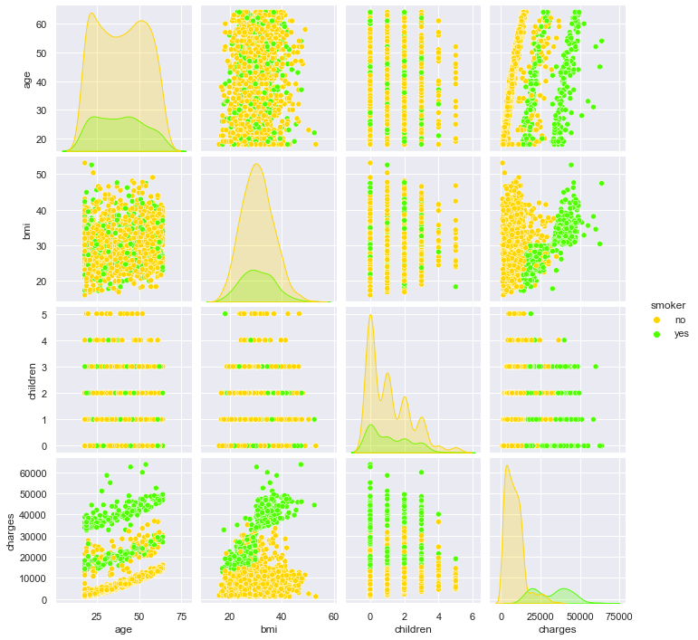
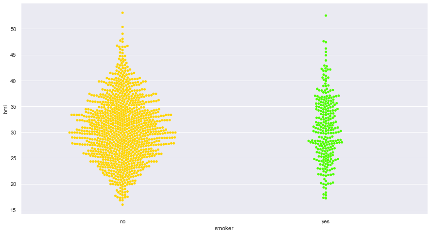
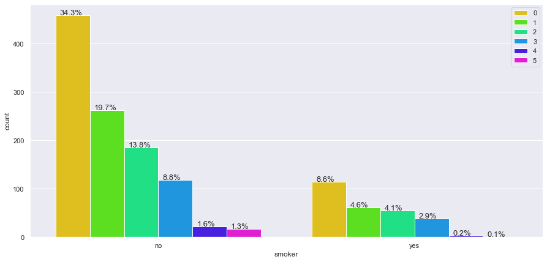
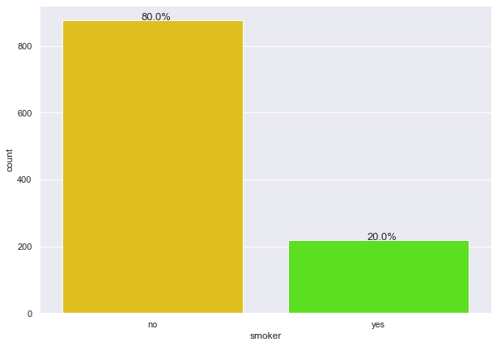

## <a href="https://jakeeide.github.io">Data Science Portfolio</a>

***
##### Axis Health Insurance  •  Business Statistics Project
##### Python • <a href="https://github.com/jakeeide/jakeeide.github.io/blob/d1b9ad6fd72c1d69fbea7c7200186ded7128f6b6/pdf/Eide_Project2_AxisInsurance.pdf" target="_blank">PDF Presentation</a>
    
***

# <span style='color:#ffd400'> Background </span>  
Axis Insurance seeks to leverage existing customer information in making future business decisions.

# <span style='color:#ffd400'> Objective </span>  
Explore the Axis dataset and extract insights using Exploratory Data Analysis.

# <span style='color:#ffd400'> Key Questions </span>  

1) What insights can be extracted from the Axis Insurance dataset?

2) Smokers: Are there more medical claims made by Axis customers who smoke than those who don't smoke?

3) Smokers: Is the proportion of smokers significantly different across different regions?

4) BMI: Is the BMI of females different than the BMI of males?

5) BMI: Is the mean BMI of women with no children, one child, and two children the same?

# <span style='color:#ffd400'> Data Dictionary </span>

* Age - This is an integer indicating the age of the primary beneficiary (excluding those above 64 years, since they are generally covered by the government).
* Sex - This is the policy holder's gender, either male or female.
* BMI - This is the body mass index (BMI), which provides a sense of how over or under-weight a person is relative to their height. BMI is equal to weight (in kilograms) divided by height (in meters) squared. An ideal BMI is within the range of 18.5 to 24.9.
* Children - This is an integer indicating the number of children / dependents covered by the insurance plan.
* Smoker - This is yes or no depending on whether the insured regularly smokes tobacco.
* Region - This is the beneficiary's place of residence in the U.S., divided into four geographic regions - northeast, southeast, southwest, or northwest.
* Charges - Individual medical costs billed to health insurance.

***

# <span style='color:#009dff'> Notebook Setup </span>


```python
import warnings
warnings.filterwarnings('ignore')
```


```python
# import necessary libraries
import numpy as np
import pandas as pd
import math
import matplotlib.pyplot as plt 
%matplotlib inline
import seaborn as sns
sns.set(color_codes=True)
from scipy import stats
from scipy.stats import t
from statsmodels.stats.proportion import proportions_ztest # For proportion Z-test
from statsmodels.formula.api import ols      # For n-way ANOVA
from statsmodels.stats.anova import anova_lm # For n-way ANOVA
from scipy.stats import chi2_contingency   # For Chi-Sq 
import researchpy as rp
```


```python
#set seaborn color palette
sns.set_palette(palette='hsv')
```

### <span style='color:#3600ff'>  Import and Summarize the Dataset </span>


```python
# import the dataset and create a working copy
data = pd.read_csv('AxisInsurance.csv')
axis = data.copy()
```


```python
# view the shape of the data
axis.shape
```


    (1338, 7)


```python
# look at the first ten rows
axis.head(10)
```


<div>
<style scoped>
    .dataframe tbody tr th:only-of-type {
        vertical-align: middle;
    }

    .dataframe tbody tr th {
        vertical-align: top;
    }

    .dataframe thead th {
        text-align: right;
    }
</style>
<table border="1" class="dataframe">
  <thead>
    <tr style="text-align: right;">
      <th></th>
      <th>age</th>
      <th>sex</th>
      <th>bmi</th>
      <th>children</th>
      <th>smoker</th>
      <th>region</th>
      <th>charges</th>
    </tr>
  </thead>
  <tbody>
    <tr>
      <th>0</th>
      <td>19</td>
      <td>female</td>
      <td>27.900</td>
      <td>0</td>
      <td>yes</td>
      <td>southwest</td>
      <td>16884.92400</td>
    </tr>
    <tr>
      <th>1</th>
      <td>18</td>
      <td>male</td>
      <td>33.770</td>
      <td>1</td>
      <td>no</td>
      <td>southeast</td>
      <td>1725.55230</td>
    </tr>
    <tr>
      <th>2</th>
      <td>28</td>
      <td>male</td>
      <td>33.000</td>
      <td>3</td>
      <td>no</td>
      <td>southeast</td>
      <td>4449.46200</td>
    </tr>
    <tr>
      <th>3</th>
      <td>33</td>
      <td>male</td>
      <td>22.705</td>
      <td>0</td>
      <td>no</td>
      <td>northwest</td>
      <td>21984.47061</td>
    </tr>
    <tr>
      <th>4</th>
      <td>32</td>
      <td>male</td>
      <td>28.880</td>
      <td>0</td>
      <td>no</td>
      <td>northwest</td>
      <td>3866.85520</td>
    </tr>
    <tr>
      <th>5</th>
      <td>31</td>
      <td>female</td>
      <td>25.740</td>
      <td>0</td>
      <td>no</td>
      <td>southeast</td>
      <td>3756.62160</td>
    </tr>
    <tr>
      <th>6</th>
      <td>46</td>
      <td>female</td>
      <td>33.440</td>
      <td>1</td>
      <td>no</td>
      <td>southeast</td>
      <td>8240.58960</td>
    </tr>
    <tr>
      <th>7</th>
      <td>37</td>
      <td>female</td>
      <td>27.740</td>
      <td>3</td>
      <td>no</td>
      <td>northwest</td>
      <td>7281.50560</td>
    </tr>
    <tr>
      <th>8</th>
      <td>37</td>
      <td>male</td>
      <td>29.830</td>
      <td>2</td>
      <td>no</td>
      <td>northeast</td>
      <td>6406.41070</td>
    </tr>
    <tr>
      <th>9</th>
      <td>60</td>
      <td>female</td>
      <td>25.840</td>
      <td>0</td>
      <td>no</td>
      <td>northwest</td>
      <td>28923.13692</td>
    </tr>
  </tbody>
</table>
</div>


```python
# look at the last ten rows
axis.tail(10)
```


<div>
<style scoped>
    .dataframe tbody tr th:only-of-type {
        vertical-align: middle;
    }

    .dataframe tbody tr th {
        vertical-align: top;
    }

    .dataframe thead th {
        text-align: right;
    }
</style>
<table border="1" class="dataframe">
  <thead>
    <tr style="text-align: right;">
      <th></th>
      <th>age</th>
      <th>sex</th>
      <th>bmi</th>
      <th>children</th>
      <th>smoker</th>
      <th>region</th>
      <th>charges</th>
    </tr>
  </thead>
  <tbody>
    <tr>
      <th>1328</th>
      <td>23</td>
      <td>female</td>
      <td>24.225</td>
      <td>2</td>
      <td>no</td>
      <td>northeast</td>
      <td>22395.74424</td>
    </tr>
    <tr>
      <th>1329</th>
      <td>52</td>
      <td>male</td>
      <td>38.600</td>
      <td>2</td>
      <td>no</td>
      <td>southwest</td>
      <td>10325.20600</td>
    </tr>
    <tr>
      <th>1330</th>
      <td>57</td>
      <td>female</td>
      <td>25.740</td>
      <td>2</td>
      <td>no</td>
      <td>southeast</td>
      <td>12629.16560</td>
    </tr>
    <tr>
      <th>1331</th>
      <td>23</td>
      <td>female</td>
      <td>33.400</td>
      <td>0</td>
      <td>no</td>
      <td>southwest</td>
      <td>10795.93733</td>
    </tr>
    <tr>
      <th>1332</th>
      <td>52</td>
      <td>female</td>
      <td>44.700</td>
      <td>3</td>
      <td>no</td>
      <td>southwest</td>
      <td>11411.68500</td>
    </tr>
    <tr>
      <th>1333</th>
      <td>50</td>
      <td>male</td>
      <td>30.970</td>
      <td>3</td>
      <td>no</td>
      <td>northwest</td>
      <td>10600.54830</td>
    </tr>
    <tr>
      <th>1334</th>
      <td>18</td>
      <td>female</td>
      <td>31.920</td>
      <td>0</td>
      <td>no</td>
      <td>northeast</td>
      <td>2205.98080</td>
    </tr>
    <tr>
      <th>1335</th>
      <td>18</td>
      <td>female</td>
      <td>36.850</td>
      <td>0</td>
      <td>no</td>
      <td>southeast</td>
      <td>1629.83350</td>
    </tr>
    <tr>
      <th>1336</th>
      <td>21</td>
      <td>female</td>
      <td>25.800</td>
      <td>0</td>
      <td>no</td>
      <td>southwest</td>
      <td>2007.94500</td>
    </tr>
    <tr>
      <th>1337</th>
      <td>61</td>
      <td>female</td>
      <td>29.070</td>
      <td>0</td>
      <td>yes</td>
      <td>northwest</td>
      <td>29141.36030</td>
    </tr>
  </tbody>
</table>
</div>


```python
# show the datatypes
axis.info()
```

    <class 'pandas.core.frame.DataFrame'>
    RangeIndex: 1338 entries, 0 to 1337
    Data columns (total 7 columns):
     #   Column    Non-Null Count  Dtype  
    ---  ------    --------------  -----  
     0   age       1338 non-null   int64  
     1   sex       1338 non-null   object 
     2   bmi       1338 non-null   float64
     3   children  1338 non-null   int64  
     4   smoker    1338 non-null   object 
     5   region    1338 non-null   object 
     6   charges   1338 non-null   float64
    dtypes: float64(2), int64(2), object(3)
    memory usage: 73.3+ KB


```python
# change data types to categories where appropriate
axis['sex'] = axis.sex.astype('category')
axis['smoker'] = axis.smoker.astype('category')
axis['region'] = axis.region.astype('category')
```


```python
# show corrected datatypes
axis.info()
```

    <class 'pandas.core.frame.DataFrame'>
    RangeIndex: 1338 entries, 0 to 1337
    Data columns (total 7 columns):
     #   Column    Non-Null Count  Dtype   
    ---  ------    --------------  -----   
     0   age       1338 non-null   int64   
     1   sex       1338 non-null   category
     2   bmi       1338 non-null   float64 
     3   children  1338 non-null   int64   
     4   smoker    1338 non-null   category
     5   region    1338 non-null   category
     6   charges   1338 non-null   float64 
    dtypes: category(3), float64(2), int64(2)
    memory usage: 46.2 KB


```python
# show a summary of the data
axis.describe(include='all')
```


<div>
<style scoped>
    .dataframe tbody tr th:only-of-type {
        vertical-align: middle;
    }

    .dataframe tbody tr th {
        vertical-align: top;
    }

    .dataframe thead th {
        text-align: right;
    }
</style>
<table border="1" class="dataframe">
  <thead>
    <tr style="text-align: right;">
      <th></th>
      <th>age</th>
      <th>sex</th>
      <th>bmi</th>
      <th>children</th>
      <th>smoker</th>
      <th>region</th>
      <th>charges</th>
    </tr>
  </thead>
  <tbody>
    <tr>
      <th>count</th>
      <td>1338.000000</td>
      <td>1338</td>
      <td>1338.000000</td>
      <td>1338.000000</td>
      <td>1338</td>
      <td>1338</td>
      <td>1338.000000</td>
    </tr>
    <tr>
      <th>unique</th>
      <td>NaN</td>
      <td>2</td>
      <td>NaN</td>
      <td>NaN</td>
      <td>2</td>
      <td>4</td>
      <td>NaN</td>
    </tr>
    <tr>
      <th>top</th>
      <td>NaN</td>
      <td>male</td>
      <td>NaN</td>
      <td>NaN</td>
      <td>no</td>
      <td>southeast</td>
      <td>NaN</td>
    </tr>
    <tr>
      <th>freq</th>
      <td>NaN</td>
      <td>676</td>
      <td>NaN</td>
      <td>NaN</td>
      <td>1064</td>
      <td>364</td>
      <td>NaN</td>
    </tr>
    <tr>
      <th>mean</th>
      <td>39.207025</td>
      <td>NaN</td>
      <td>30.663397</td>
      <td>1.094918</td>
      <td>NaN</td>
      <td>NaN</td>
      <td>13270.422265</td>
    </tr>
    <tr>
      <th>std</th>
      <td>14.049960</td>
      <td>NaN</td>
      <td>6.098187</td>
      <td>1.205493</td>
      <td>NaN</td>
      <td>NaN</td>
      <td>12110.011237</td>
    </tr>
    <tr>
      <th>min</th>
      <td>18.000000</td>
      <td>NaN</td>
      <td>15.960000</td>
      <td>0.000000</td>
      <td>NaN</td>
      <td>NaN</td>
      <td>1121.873900</td>
    </tr>
    <tr>
      <th>25%</th>
      <td>27.000000</td>
      <td>NaN</td>
      <td>26.296250</td>
      <td>0.000000</td>
      <td>NaN</td>
      <td>NaN</td>
      <td>4740.287150</td>
    </tr>
    <tr>
      <th>50%</th>
      <td>39.000000</td>
      <td>NaN</td>
      <td>30.400000</td>
      <td>1.000000</td>
      <td>NaN</td>
      <td>NaN</td>
      <td>9382.033000</td>
    </tr>
    <tr>
      <th>75%</th>
      <td>51.000000</td>
      <td>NaN</td>
      <td>34.693750</td>
      <td>2.000000</td>
      <td>NaN</td>
      <td>NaN</td>
      <td>16639.912515</td>
    </tr>
    <tr>
      <th>max</th>
      <td>64.000000</td>
      <td>NaN</td>
      <td>53.130000</td>
      <td>5.000000</td>
      <td>NaN</td>
      <td>NaN</td>
      <td>63770.428010</td>
    </tr>
  </tbody>
</table>
</div>


```python
# show the mode of each column
axis.mode()
```


<div>
<style scoped>
    .dataframe tbody tr th:only-of-type {
        vertical-align: middle;
    }

    .dataframe tbody tr th {
        vertical-align: top;
    }

    .dataframe thead th {
        text-align: right;
    }
</style>
<table border="1" class="dataframe">
  <thead>
    <tr style="text-align: right;">
      <th></th>
      <th>age</th>
      <th>sex</th>
      <th>bmi</th>
      <th>children</th>
      <th>smoker</th>
      <th>region</th>
      <th>charges</th>
    </tr>
  </thead>
  <tbody>
    <tr>
      <th>0</th>
      <td>18</td>
      <td>male</td>
      <td>32.3</td>
      <td>0</td>
      <td>no</td>
      <td>southeast</td>
      <td>1639.5631</td>
    </tr>
  </tbody>
</table>
</div>


```python
# show the values of the category 'sex'
axis['sex'].value_counts()
```


    male      676
    female    662
    Name: sex, dtype: int64


```python
# show the values of the category 'smoker'
axis['smoker'].value_counts()
```


    no     1064
    yes     274
    Name: smoker, dtype: int64


```python
# show the values of the category 'region'
axis['region'].value_counts()
```


    southeast    364
    southwest    325
    northwest    325
    northeast    324
    Name: region, dtype: int64


<span style='background-color:#00ff85'> **Observations** </span>
* The dataset has 1338 rows and 7 columns
* Four quantitative variables: Age, BMI, Children, and Charges
* Three categorical variables:
    * Sex - 2 possible values: 'male' or 'female'
    * Smoker - 2 possible values: 'yes' or 'no'
    * Region - 4 possible values: 'southeast', 'southwest', 'northwest', or 'northeast'  

# <span style='color:#009dff'> Data Preprocessing </span>

### <span style='color:#3600ff'> Check for missing values </span>


```python
# Check for missing value in any column
axis.isnull().sum()
```


    age         0
    sex         0
    bmi         0
    children    0
    smoker      0
    region      0
    charges     0
    dtype: int64


### <span style='color:#3600ff'>  Check for garbage values in Categorical Variables </span>


```python
# similar code is above, but here I'm checking for garbage values in each category
axis.sex.value_counts(dropna=False)
```


    male      676
    female    662
    Name: sex, dtype: int64


```python
# similar code is above, but here I'm checking for garbage values in each category
axis.smoker.value_counts(dropna=False)
```


    no     1064
    yes     274
    Name: smoker, dtype: int64


```python
# similar code is above, but here I'm checking for garbage values in each category
axis.region.value_counts(dropna=False)
```


    southeast    364
    southwest    325
    northwest    325
    northeast    324
    Name: region, dtype: int64


<span style='background-color:#00ff85'> **Observations** </span>
* There are no missing values in the Axis dataset
* No garbage variables found
* Dataframe appears to be clean and complete

# <span style='color:#009dff'> EDA </span>

## <span style='color:#ff00ec'>  Univariate analysis of Numerical Variables: Age, BMI, Children, and Charges </span>


```python
# This is a function to create a boxplot and histogram for any input numerical variable
# This function takes the numerical column as the input and returns the boxplots and histograms for the variable
def histogram_boxplot(feature, figsize=(15,10), bins = None):
    """ Boxplot and histogram combined
    feature: 1-d feature array
    figsize: size of fig (default (9,8))
    bins: number of bins (default None / auto)
    """
    f2, (ax_box2, ax_hist2) = plt.subplots(nrows = 2, # Number of rows of the subplot grid= 2
                                           sharex = True, # x-axis will be shared among all subplots
                                           gridspec_kw = {"height_ratios": (.25, .75)}, 
                                           figsize = figsize 
                                           ) # creating the 2 subplots
    sns.boxplot(feature, ax=ax_box2, showmeans=True) # boxplot will be created and a star will indicate the mean value of the column
    sns.rugplot(feature, ax=ax_hist2, color='black') # Add rug to the histogram
    sns.distplot(feature, kde=True, ax=ax_hist2, bins=bins) if bins else sns.distplot(feature, kde=False, ax=ax_hist2) # For histogram
    ax_hist2.axvline(np.mean(feature), linestyle='--') # Add mean to the histogram
    ax_hist2.axvline(np.median(feature), color='black', linestyle='-') # Add median to the histogram
```


```python
# Function to create barplots that indicate percentage for each category
def bar_perc(plot, feature):
    '''
    plot
    feature: 1-d categorical feature array
    '''
    total = len(feature) # length of the column
    for p in ax.patches:
        percentage = '{:.1f}%'.format(100 * p.get_height()/total) # percentage of each class of the category
        x = p.get_x() + p.get_width() / 2 - 0.05 # width of the plot
        y = p.get_y() + p.get_height() + 0.2           # height of the plot
        ax.annotate(percentage, (x, y), size = 13) # annotate the percantage
```

### <span style='color:#3600ff'>  Observations on Age </span>


```python
rp.summary_cont(axis['age'])
```

    
    


<div>
<style scoped>
    .dataframe tbody tr th:only-of-type {
        vertical-align: middle;
    }

    .dataframe tbody tr th {
        vertical-align: top;
    }

    .dataframe thead th {
        text-align: right;
    }
</style>
<table border="1" class="dataframe">
  <thead>
    <tr style="text-align: right;">
      <th></th>
      <th>Variable</th>
      <th>N</th>
      <th>Mean</th>
      <th>SD</th>
      <th>SE</th>
      <th>95% Conf.</th>
      <th>Interval</th>
    </tr>
  </thead>
  <tbody>
    <tr>
      <th>0</th>
      <td>age</td>
      <td>1338.0</td>
      <td>39.207</td>
      <td>14.05</td>
      <td>0.3841</td>
      <td>38.4535</td>
      <td>39.9605</td>
    </tr>
  </tbody>
</table>
</div>


```python
# create frequency table
pd.crosstab(index=axis['age'], columns='Count')
```


<div>
<style scoped>
    .dataframe tbody tr th:only-of-type {
        vertical-align: middle;
    }

    .dataframe tbody tr th {
        vertical-align: top;
    }

    .dataframe thead th {
        text-align: right;
    }
</style>
<table border="1" class="dataframe">
  <thead>
    <tr style="text-align: right;">
      <th>col_0</th>
      <th>Count</th>
    </tr>
    <tr>
      <th>age</th>
      <th></th>
    </tr>
  </thead>
  <tbody>
    <tr>
      <th>18</th>
      <td>69</td>
    </tr>
    <tr>
      <th>19</th>
      <td>68</td>
    </tr>
    <tr>
      <th>20</th>
      <td>29</td>
    </tr>
    <tr>
      <th>21</th>
      <td>28</td>
    </tr>
    <tr>
      <th>22</th>
      <td>28</td>
    </tr>
    <tr>
      <th>23</th>
      <td>28</td>
    </tr>
    <tr>
      <th>24</th>
      <td>28</td>
    </tr>
    <tr>
      <th>25</th>
      <td>28</td>
    </tr>
    <tr>
      <th>26</th>
      <td>28</td>
    </tr>
    <tr>
      <th>27</th>
      <td>28</td>
    </tr>
    <tr>
      <th>28</th>
      <td>28</td>
    </tr>
    <tr>
      <th>29</th>
      <td>27</td>
    </tr>
    <tr>
      <th>30</th>
      <td>27</td>
    </tr>
    <tr>
      <th>31</th>
      <td>27</td>
    </tr>
    <tr>
      <th>32</th>
      <td>26</td>
    </tr>
    <tr>
      <th>33</th>
      <td>26</td>
    </tr>
    <tr>
      <th>34</th>
      <td>26</td>
    </tr>
    <tr>
      <th>35</th>
      <td>25</td>
    </tr>
    <tr>
      <th>36</th>
      <td>25</td>
    </tr>
    <tr>
      <th>37</th>
      <td>25</td>
    </tr>
    <tr>
      <th>38</th>
      <td>25</td>
    </tr>
    <tr>
      <th>39</th>
      <td>25</td>
    </tr>
    <tr>
      <th>40</th>
      <td>27</td>
    </tr>
    <tr>
      <th>41</th>
      <td>27</td>
    </tr>
    <tr>
      <th>42</th>
      <td>27</td>
    </tr>
    <tr>
      <th>43</th>
      <td>27</td>
    </tr>
    <tr>
      <th>44</th>
      <td>27</td>
    </tr>
    <tr>
      <th>45</th>
      <td>29</td>
    </tr>
    <tr>
      <th>46</th>
      <td>29</td>
    </tr>
    <tr>
      <th>47</th>
      <td>29</td>
    </tr>
    <tr>
      <th>48</th>
      <td>29</td>
    </tr>
    <tr>
      <th>49</th>
      <td>28</td>
    </tr>
    <tr>
      <th>50</th>
      <td>29</td>
    </tr>
    <tr>
      <th>51</th>
      <td>29</td>
    </tr>
    <tr>
      <th>52</th>
      <td>29</td>
    </tr>
    <tr>
      <th>53</th>
      <td>28</td>
    </tr>
    <tr>
      <th>54</th>
      <td>28</td>
    </tr>
    <tr>
      <th>55</th>
      <td>26</td>
    </tr>
    <tr>
      <th>56</th>
      <td>26</td>
    </tr>
    <tr>
      <th>57</th>
      <td>26</td>
    </tr>
    <tr>
      <th>58</th>
      <td>25</td>
    </tr>
    <tr>
      <th>59</th>
      <td>25</td>
    </tr>
    <tr>
      <th>60</th>
      <td>23</td>
    </tr>
    <tr>
      <th>61</th>
      <td>23</td>
    </tr>
    <tr>
      <th>62</th>
      <td>23</td>
    </tr>
    <tr>
      <th>63</th>
      <td>23</td>
    </tr>
    <tr>
      <th>64</th>
      <td>22</td>
    </tr>
  </tbody>
</table>
</div>


```python
# draw boxplot and histogram
histogram_boxplot(axis.age)
```


    

    


<span style='background-color:#00ff85'> **Observations** </span>
* The age distibution is fairly uniform, except for a larger number of 18 and 19 year olds
* The mean age is 39.2 years
* The median age is 39.0 years
* The mode is 18 years
* The middle 50% of customers are between 27 and 51 years old

### <span style='color:#3600ff'>  Observations on BMI </span>


```python
rp.summary_cont(axis['bmi'])
```

    
    


<div>
<style scoped>
    .dataframe tbody tr th:only-of-type {
        vertical-align: middle;
    }

    .dataframe tbody tr th {
        vertical-align: top;
    }

    .dataframe thead th {
        text-align: right;
    }
</style>
<table border="1" class="dataframe">
  <thead>
    <tr style="text-align: right;">
      <th></th>
      <th>Variable</th>
      <th>N</th>
      <th>Mean</th>
      <th>SD</th>
      <th>SE</th>
      <th>95% Conf.</th>
      <th>Interval</th>
    </tr>
  </thead>
  <tbody>
    <tr>
      <th>0</th>
      <td>bmi</td>
      <td>1338.0</td>
      <td>30.6634</td>
      <td>6.0982</td>
      <td>0.1667</td>
      <td>30.3363</td>
      <td>30.9904</td>
    </tr>
  </tbody>
</table>
</div>


```python
# create frequency table with 10 bins
bmi_binned = pd.cut(axis['bmi'],10)
pd.crosstab(index=bmi_binned, columns='Count')
```


<div>
<style scoped>
    .dataframe tbody tr th:only-of-type {
        vertical-align: middle;
    }

    .dataframe tbody tr th {
        vertical-align: top;
    }

    .dataframe thead th {
        text-align: right;
    }
</style>
<table border="1" class="dataframe">
  <thead>
    <tr style="text-align: right;">
      <th>col_0</th>
      <th>Count</th>
    </tr>
    <tr>
      <th>bmi</th>
      <th></th>
    </tr>
  </thead>
  <tbody>
    <tr>
      <th>(15.923, 19.677]</th>
      <td>30</td>
    </tr>
    <tr>
      <th>(19.677, 23.394]</th>
      <td>127</td>
    </tr>
    <tr>
      <th>(23.394, 27.111]</th>
      <td>234</td>
    </tr>
    <tr>
      <th>(27.111, 30.828]</th>
      <td>319</td>
    </tr>
    <tr>
      <th>(30.828, 34.545]</th>
      <td>288</td>
    </tr>
    <tr>
      <th>(34.545, 38.262]</th>
      <td>195</td>
    </tr>
    <tr>
      <th>(38.262, 41.979]</th>
      <td>96</td>
    </tr>
    <tr>
      <th>(41.979, 45.696]</th>
      <td>32</td>
    </tr>
    <tr>
      <th>(45.696, 49.413]</th>
      <td>14</td>
    </tr>
    <tr>
      <th>(49.413, 53.13]</th>
      <td>3</td>
    </tr>
  </tbody>
</table>
</div>


```python
# draw boxplot and histogram
histogram_boxplot(axis.bmi)
```


    

    


<span style='background-color:#00ff85'> **Observations** </span>
* The BMI distibution appears mound-shaped and symmetrical around 30.5, with a slight amount of right-skew
* The BMI values range from 15.96 (minimum) to 53.13 (max)
* The middle 50% of customers have a BMI between 26.3 and 34.69
* We know from the data dictionary that an ideal BMI is within the range of 18.5 to 24.9, so it appears that the average Axis customer is overweight. This may be something we decide to test in a later section.

### <span style='color:#3600ff'>  Observations on Number of Children </span>


```python
# create frequency table
pd.crosstab(index=axis['children'], columns='Count')
```


<div>
<style scoped>
    .dataframe tbody tr th:only-of-type {
        vertical-align: middle;
    }

    .dataframe tbody tr th {
        vertical-align: top;
    }

    .dataframe thead th {
        text-align: right;
    }
</style>
<table border="1" class="dataframe">
  <thead>
    <tr style="text-align: right;">
      <th>col_0</th>
      <th>Count</th>
    </tr>
    <tr>
      <th>children</th>
      <th></th>
    </tr>
  </thead>
  <tbody>
    <tr>
      <th>0</th>
      <td>574</td>
    </tr>
    <tr>
      <th>1</th>
      <td>324</td>
    </tr>
    <tr>
      <th>2</th>
      <td>240</td>
    </tr>
    <tr>
      <th>3</th>
      <td>157</td>
    </tr>
    <tr>
      <th>4</th>
      <td>25</td>
    </tr>
    <tr>
      <th>5</th>
      <td>18</td>
    </tr>
  </tbody>
</table>
</div>


```python
# draw boxplot and histogram
histogram_boxplot(axis.children)
```


    

    


```python
# Use a pie chart to visualize percentages
child_count = axis['children'].value_counts()
child_labels = ['0 children','1 child','2 children','3 children','4 children', '5 children']
fig = plt.figure(figsize =(15, 12))
plt.pie(x=child_count, autopct="%.1f%%", explode=[0.05]*6, labels=child_labels, pctdistance=0.5)
plt.show()
```


    

    


```python
# A bar graph may be the best way to visualize this
plt.figure(figsize=(10,7))
ax = sns.countplot(axis['children'])
bar_perc(ax,axis['children'])
```


    

    


<span style='background-color:#00ff85'> **Observations** </span>
* The distibution for children is heavily right skewed
* The percentage of customers gets progressively smaller with each child
* The number of children ranges from 0 to 5
* 67% of the customers have either no children or 1 child

### <span style='color:#3600ff'>  Observations on Charges </span>


```python
# create frequency table with 10 bins
charges_binned = pd.cut(axis['charges'],10)
pd.crosstab(index=charges_binned, columns='Count')
```


<div>
<style scoped>
    .dataframe tbody tr th:only-of-type {
        vertical-align: middle;
    }

    .dataframe tbody tr th {
        vertical-align: top;
    }

    .dataframe thead th {
        text-align: right;
    }
</style>
<table border="1" class="dataframe">
  <thead>
    <tr style="text-align: right;">
      <th>col_0</th>
      <th>Count</th>
    </tr>
    <tr>
      <th>charges</th>
      <th></th>
    </tr>
  </thead>
  <tbody>
    <tr>
      <th>(1059.225, 7386.729]</th>
      <td>536</td>
    </tr>
    <tr>
      <th>(7386.729, 13651.585]</th>
      <td>398</td>
    </tr>
    <tr>
      <th>(13651.585, 19916.44]</th>
      <td>129</td>
    </tr>
    <tr>
      <th>(19916.44, 26181.296]</th>
      <td>86</td>
    </tr>
    <tr>
      <th>(26181.296, 32446.151]</th>
      <td>35</td>
    </tr>
    <tr>
      <th>(32446.151, 38711.006]</th>
      <td>59</td>
    </tr>
    <tr>
      <th>(38711.006, 44975.862]</th>
      <td>57</td>
    </tr>
    <tr>
      <th>(44975.862, 51240.717]</th>
      <td>32</td>
    </tr>
    <tr>
      <th>(51240.717, 57505.573]</th>
      <td>2</td>
    </tr>
    <tr>
      <th>(57505.573, 63770.428]</th>
      <td>4</td>
    </tr>
  </tbody>
</table>
</div>


```python
# draw boxplot and histogram
histogram_boxplot(axis.charges)
```


    

    


<span style='background-color:#00ff85'> **Observations** </span>
* The distibution for charges is heavily right skewed
* The median is \$9,382
* The mean is \$13,270
* The middle 50% of charges were between 4,740 and 16,640
* There are outliers with higher charges: the largest charge was \$63,770
* From the graph above we can see that there is a large falloff in the number of charges above \$14,000

## <span style='color:#ff00ec'>  Univariate analysis of Categorical Variables: Sex, Smoking Status, and Region </span>

### <span style='color:#3600ff'>  Observations on Sex </span>


```python
pd.crosstab(index=axis['sex'], columns='Count')
```


<div>
<style scoped>
    .dataframe tbody tr th:only-of-type {
        vertical-align: middle;
    }

    .dataframe tbody tr th {
        vertical-align: top;
    }

    .dataframe thead th {
        text-align: right;
    }
</style>
<table border="1" class="dataframe">
  <thead>
    <tr style="text-align: right;">
      <th>col_0</th>
      <th>Count</th>
    </tr>
    <tr>
      <th>sex</th>
      <th></th>
    </tr>
  </thead>
  <tbody>
    <tr>
      <th>female</th>
      <td>662</td>
    </tr>
    <tr>
      <th>male</th>
      <td>676</td>
    </tr>
  </tbody>
</table>
</div>


```python
# Show a bar graph of gender counts
plt.figure(figsize=(10,7))
ax = sns.countplot(axis['sex'])
bar_perc(ax,axis['sex'])
```


    

    


<span style='background-color:#00ff85'> **Observations** </span>
* Axis customers are divided nearly equally among two genders, with only slightly more male customers

### <span style='color:#3600ff'>  Observations on Smoking Status </span>


```python
pd.crosstab(index=axis['smoker'], columns='Count')
```


<div>
<style scoped>
    .dataframe tbody tr th:only-of-type {
        vertical-align: middle;
    }

    .dataframe tbody tr th {
        vertical-align: top;
    }

    .dataframe thead th {
        text-align: right;
    }
</style>
<table border="1" class="dataframe">
  <thead>
    <tr style="text-align: right;">
      <th>col_0</th>
      <th>Count</th>
    </tr>
    <tr>
      <th>smoker</th>
      <th></th>
    </tr>
  </thead>
  <tbody>
    <tr>
      <th>no</th>
      <td>1064</td>
    </tr>
    <tr>
      <th>yes</th>
      <td>274</td>
    </tr>
  </tbody>
</table>
</div>


```python
# Show a bar graph
plt.figure(figsize=(10,7))
ax = sns.countplot(axis['smoker'])
bar_perc(ax,axis['smoker'])
```


    

    


<span style='background-color:#00ff85'> **Observations** </span>
* Smokers account for roughly 1 in 5 (20%) of Axis customers

### <span style='color:#3600ff'>  Observations on Region </span>


```python
pd.crosstab(index=axis['region'], columns='Count')
```


<div>
<style scoped>
    .dataframe tbody tr th:only-of-type {
        vertical-align: middle;
    }

    .dataframe tbody tr th {
        vertical-align: top;
    }

    .dataframe thead th {
        text-align: right;
    }
</style>
<table border="1" class="dataframe">
  <thead>
    <tr style="text-align: right;">
      <th>col_0</th>
      <th>Count</th>
    </tr>
    <tr>
      <th>region</th>
      <th></th>
    </tr>
  </thead>
  <tbody>
    <tr>
      <th>northeast</th>
      <td>324</td>
    </tr>
    <tr>
      <th>northwest</th>
      <td>325</td>
    </tr>
    <tr>
      <th>southeast</th>
      <td>364</td>
    </tr>
    <tr>
      <th>southwest</th>
      <td>325</td>
    </tr>
  </tbody>
</table>
</div>


```python
# Show a bar graph
plt.figure(figsize=(10,7))
ax = sns.countplot(axis['region'])
bar_perc(ax,axis['region'])
```


    

    


<span style='background-color:#00ff85'> **Observations** </span>
* Customers are fairly evenly divided between the four regions
* The Southeast has a slightly higher percentage of the total customers than the other three regions
* The other three regions (Southwest, Northwest, and Northeast) are very evenly distributed

## <span style='color:#ff00ec'>  Bivariate Analysis </span>


```python
# display the correlation between pairs of numerical columns
axis.corr()
```


<div>
<style scoped>
    .dataframe tbody tr th:only-of-type {
        vertical-align: middle;
    }

    .dataframe tbody tr th {
        vertical-align: top;
    }

    .dataframe thead th {
        text-align: right;
    }
</style>
<table border="1" class="dataframe">
  <thead>
    <tr style="text-align: right;">
      <th></th>
      <th>age</th>
      <th>bmi</th>
      <th>children</th>
      <th>charges</th>
    </tr>
  </thead>
  <tbody>
    <tr>
      <th>age</th>
      <td>1.000000</td>
      <td>0.109272</td>
      <td>0.042469</td>
      <td>0.299008</td>
    </tr>
    <tr>
      <th>bmi</th>
      <td>0.109272</td>
      <td>1.000000</td>
      <td>0.012759</td>
      <td>0.198341</td>
    </tr>
    <tr>
      <th>children</th>
      <td>0.042469</td>
      <td>0.012759</td>
      <td>1.000000</td>
      <td>0.067998</td>
    </tr>
    <tr>
      <th>charges</th>
      <td>0.299008</td>
      <td>0.198341</td>
      <td>0.067998</td>
      <td>1.000000</td>
    </tr>
  </tbody>
</table>
</div>


```python
# plot the correlation as a heatmap
colormap = sns.color_palette('hsv')
plt.figure(figsize=(12,10))
sns.heatmap(axis.corr(), annot=True, cmap=colormap)
plt.show()
```


    

    


<span style='background-color:#00ff85'> **Observations** </span>
* The correlation levels between these four variables is fairly low (less than 0.3)
* The highest correlation is between age and charges, but even this is a moderate level of correlation
* Further investigation will be necessary to find correlation within the dataset

### <span style='color:#3600ff'> Scatterplots </span>


```python
#show an overview of the relationships between variables
sns.pairplot(axis);
```


    

    


```python
#show an overview of the relationships between variables
#use hue to visualize the category 'smoker' vs. numerical variables
sns.pairplot(axis, hue="smoker");
```


    

    


```python
#show an overview of the relationships between variables
#use hue to visualize the category 'sex' vs. numerical variables
sns.pairplot(axis, hue="sex");
```


    

    


```python
#show an overview of the relationships between variables
#use hue to visualize the category 'region' vs. numerical variables
sns.pairplot(axis, hue="region");
```


    

    


<span style='background-color:#00ff85'> **Observations** </span>
* These scatterplots show an overview so that we can begin to see what relationships to investigate further
* We will want to segment smokers from non-smokers, as the scatterplot suggests that these two groups differ in charges
* The regions may have some differences in terms of BMI
* I want to further investigate if charges are more influenced by age, smoking status, or BMI
* One of our key question is about the relationships between BMI, gender, and number of children, but the scatterplots do not reveal any clear patterns, so we will have to dig in further

## <span style='color:#ff00ec'> Bivariate Analysis: Sex vs. Variables </span>


```python
#filter males and females into separate dataframes in order to compare the two groups
male = axis[axis["sex"]=='male'].copy()
female = axis[axis["sex"]=='female'].copy()
```


```python
#describe an overview of the Axis customers who are male
male.describe(include='all')
```


<div>
<style scoped>
    .dataframe tbody tr th:only-of-type {
        vertical-align: middle;
    }

    .dataframe tbody tr th {
        vertical-align: top;
    }

    .dataframe thead th {
        text-align: right;
    }
</style>
<table border="1" class="dataframe">
  <thead>
    <tr style="text-align: right;">
      <th></th>
      <th>age</th>
      <th>sex</th>
      <th>bmi</th>
      <th>children</th>
      <th>smoker</th>
      <th>region</th>
      <th>charges</th>
    </tr>
  </thead>
  <tbody>
    <tr>
      <th>count</th>
      <td>676.000000</td>
      <td>676</td>
      <td>676.000000</td>
      <td>676.000000</td>
      <td>676</td>
      <td>676</td>
      <td>676.000000</td>
    </tr>
    <tr>
      <th>unique</th>
      <td>NaN</td>
      <td>1</td>
      <td>NaN</td>
      <td>NaN</td>
      <td>2</td>
      <td>4</td>
      <td>NaN</td>
    </tr>
    <tr>
      <th>top</th>
      <td>NaN</td>
      <td>male</td>
      <td>NaN</td>
      <td>NaN</td>
      <td>no</td>
      <td>southeast</td>
      <td>NaN</td>
    </tr>
    <tr>
      <th>freq</th>
      <td>NaN</td>
      <td>676</td>
      <td>NaN</td>
      <td>NaN</td>
      <td>517</td>
      <td>189</td>
      <td>NaN</td>
    </tr>
    <tr>
      <th>mean</th>
      <td>38.917160</td>
      <td>NaN</td>
      <td>30.943129</td>
      <td>1.115385</td>
      <td>NaN</td>
      <td>NaN</td>
      <td>13956.751178</td>
    </tr>
    <tr>
      <th>std</th>
      <td>14.050141</td>
      <td>NaN</td>
      <td>6.140435</td>
      <td>1.218986</td>
      <td>NaN</td>
      <td>NaN</td>
      <td>12971.025915</td>
    </tr>
    <tr>
      <th>min</th>
      <td>18.000000</td>
      <td>NaN</td>
      <td>15.960000</td>
      <td>0.000000</td>
      <td>NaN</td>
      <td>NaN</td>
      <td>1121.873900</td>
    </tr>
    <tr>
      <th>25%</th>
      <td>26.000000</td>
      <td>NaN</td>
      <td>26.410000</td>
      <td>0.000000</td>
      <td>NaN</td>
      <td>NaN</td>
      <td>4619.134000</td>
    </tr>
    <tr>
      <th>50%</th>
      <td>39.000000</td>
      <td>NaN</td>
      <td>30.687500</td>
      <td>1.000000</td>
      <td>NaN</td>
      <td>NaN</td>
      <td>9369.615750</td>
    </tr>
    <tr>
      <th>75%</th>
      <td>51.000000</td>
      <td>NaN</td>
      <td>34.992500</td>
      <td>2.000000</td>
      <td>NaN</td>
      <td>NaN</td>
      <td>18989.590250</td>
    </tr>
    <tr>
      <th>max</th>
      <td>64.000000</td>
      <td>NaN</td>
      <td>53.130000</td>
      <td>5.000000</td>
      <td>NaN</td>
      <td>NaN</td>
      <td>62592.873090</td>
    </tr>
  </tbody>
</table>
</div>


```python
#describe an overview of the Axis customers who are female
female.describe(include='all')
```


<div>
<style scoped>
    .dataframe tbody tr th:only-of-type {
        vertical-align: middle;
    }

    .dataframe tbody tr th {
        vertical-align: top;
    }

    .dataframe thead th {
        text-align: right;
    }
</style>
<table border="1" class="dataframe">
  <thead>
    <tr style="text-align: right;">
      <th></th>
      <th>age</th>
      <th>sex</th>
      <th>bmi</th>
      <th>children</th>
      <th>smoker</th>
      <th>region</th>
      <th>charges</th>
    </tr>
  </thead>
  <tbody>
    <tr>
      <th>count</th>
      <td>662.000000</td>
      <td>662</td>
      <td>662.000000</td>
      <td>662.000000</td>
      <td>662</td>
      <td>662</td>
      <td>662.000000</td>
    </tr>
    <tr>
      <th>unique</th>
      <td>NaN</td>
      <td>1</td>
      <td>NaN</td>
      <td>NaN</td>
      <td>2</td>
      <td>4</td>
      <td>NaN</td>
    </tr>
    <tr>
      <th>top</th>
      <td>NaN</td>
      <td>female</td>
      <td>NaN</td>
      <td>NaN</td>
      <td>no</td>
      <td>southeast</td>
      <td>NaN</td>
    </tr>
    <tr>
      <th>freq</th>
      <td>NaN</td>
      <td>662</td>
      <td>NaN</td>
      <td>NaN</td>
      <td>547</td>
      <td>175</td>
      <td>NaN</td>
    </tr>
    <tr>
      <th>mean</th>
      <td>39.503021</td>
      <td>NaN</td>
      <td>30.377749</td>
      <td>1.074018</td>
      <td>NaN</td>
      <td>NaN</td>
      <td>12569.578844</td>
    </tr>
    <tr>
      <th>std</th>
      <td>14.054223</td>
      <td>NaN</td>
      <td>6.046023</td>
      <td>1.192115</td>
      <td>NaN</td>
      <td>NaN</td>
      <td>11128.703801</td>
    </tr>
    <tr>
      <th>min</th>
      <td>18.000000</td>
      <td>NaN</td>
      <td>16.815000</td>
      <td>0.000000</td>
      <td>NaN</td>
      <td>NaN</td>
      <td>1607.510100</td>
    </tr>
    <tr>
      <th>25%</th>
      <td>27.000000</td>
      <td>NaN</td>
      <td>26.125000</td>
      <td>0.000000</td>
      <td>NaN</td>
      <td>NaN</td>
      <td>4885.158700</td>
    </tr>
    <tr>
      <th>50%</th>
      <td>40.000000</td>
      <td>NaN</td>
      <td>30.107500</td>
      <td>1.000000</td>
      <td>NaN</td>
      <td>NaN</td>
      <td>9412.962500</td>
    </tr>
    <tr>
      <th>75%</th>
      <td>51.750000</td>
      <td>NaN</td>
      <td>34.313750</td>
      <td>2.000000</td>
      <td>NaN</td>
      <td>NaN</td>
      <td>14454.691825</td>
    </tr>
    <tr>
      <th>max</th>
      <td>64.000000</td>
      <td>NaN</td>
      <td>48.070000</td>
      <td>5.000000</td>
      <td>NaN</td>
      <td>NaN</td>
      <td>63770.428010</td>
    </tr>
  </tbody>
</table>
</div>


### <span style='color:#3600ff'> Sex vs Age </span>


```python
#distplot shows males in pink, females in yellow, and overlap is orange
plt.figure(figsize=(15,7))
sns.distplot(male["age"],color="#ff00ec")
sns.distplot(female["age"],color="#ffd400")
plt.show()
```


    

    


```python
plt.figure(figsize=(15,7))
sns.boxplot(axis["age"],axis["sex"])
plt.show()
```


    

    


### <span style='color:#3600ff'> Sex vs BMI </span>


```python
#distplot shows males in pink, females in yellow, and overlap is orange
plt.figure(figsize=(15,7))
sns.distplot(male["bmi"],color="#ff00ec")
sns.distplot(female["bmi"],color="#ffd400")
plt.show()
```


    

    


```python
sns.catplot(x='bmi',
             col='sex', 
             data=axis, 
             col_wrap=4,
             kind="violin");
```


    

    


```python
plt.figure(figsize=(20,5))
sns.boxplot(axis["bmi"],axis["sex"])
plt.show()
```


    

    


### <span style='color:#3600ff'> Sex vs Number of Children </span>


```python
# Use a pie chart to compare number of children between male customers vs. female customers
M_child_count = male['children'].value_counts()
M_child_labels = ['0 children','1 child','2 children','3 children','4 children', '5 children']
fig = plt.figure(figsize =(10, 10))
plt.pie(x=M_child_count, autopct="%.1f%%", explode=[0.05]*6, labels=M_child_labels, pctdistance=0.5)
plt.title('Male Customers: Number of Children')

F_child_count = female['children'].value_counts()
F_child_labels = ['0 children','1 child','2 children','3 children','4 children', '5 children']
fig = plt.figure(figsize =(10, 10))
plt.pie(x=F_child_count, autopct="%.1f%%", explode=[0.05]*6, labels=F_child_labels, pctdistance=0.5)
plt.title('Female Customers: Number of Children')

plt.show()
```


    

    


    

    


```python
plt.figure(figsize=(15,7))
ax = sns.countplot(axis["sex"],hue=axis["children"])
bar_perc(ax,axis["children"])
plt.legend(bbox_to_anchor=(1.00, 1))
plt.show()
```


    

    


### <span style='color:#3600ff'> Sex vs Charges </span>


```python
#distplot shows males in pink, females in yellow, and overlap is orange
plt.figure(figsize=(15,7))
sns.distplot(male["charges"],color="#ff00ec")
sns.distplot(female["charges"],color="#ffd400")
plt.show()
```


    

    


```python
plt.figure(figsize=(15,7))
sns.boxplot(axis["charges"],axis["sex"])
plt.show()
```


    

    


### <span style='color:#3600ff'> Sex vs Smoking Status </span>


```python
plt.figure(figsize=(15,7))
ax = sns.countplot(axis["sex"],hue=axis["smoker"])
bar_perc(ax,axis["smoker"])
plt.legend(bbox_to_anchor=(1.00, 1))
plt.show()
```


    

    


### <span style='color:#3600ff'> Sex vs Region </span>


```python
plt.figure(figsize=(15,7))
ax = sns.countplot(axis["sex"],hue=axis["region"])
bar_perc(ax,axis["region"])
plt.legend(bbox_to_anchor=(1.00, 1))
plt.show()
```


    

    


<span style='background-color:#00ff85'> **Observations on Sex** </span>
* Female customers are slightly older than their male counterparts
* Male customers are centered around the age of 39 (median = 39; mean = 38.9
* Female customers are centered around the age of 40 (median = 40; mean = 39.5 
* Male customers have a slightly higher BMI – and a larger range of BMI values – than female customers
* Median charges are very similar for
both genders
* Males have a higher right skew than females in terms of charges

## <span style='color:#ff00ec'> Bivariate Analysis: Smoking Status vs. Variables </span>


```python
#filter smokers and non-smokers into separate dataframes in order to compare the two groups
smoker = axis[axis["smoker"]=='yes'].copy()
nonsmoker = axis[axis["smoker"]=='no'].copy()
```


```python
#describe an overview of the Axis customers who smoke
smoker.describe(include='all')
```


<div>
<style scoped>
    .dataframe tbody tr th:only-of-type {
        vertical-align: middle;
    }

    .dataframe tbody tr th {
        vertical-align: top;
    }

    .dataframe thead th {
        text-align: right;
    }
</style>
<table border="1" class="dataframe">
  <thead>
    <tr style="text-align: right;">
      <th></th>
      <th>age</th>
      <th>sex</th>
      <th>bmi</th>
      <th>children</th>
      <th>smoker</th>
      <th>region</th>
      <th>charges</th>
    </tr>
  </thead>
  <tbody>
    <tr>
      <th>count</th>
      <td>274.000000</td>
      <td>274</td>
      <td>274.000000</td>
      <td>274.000000</td>
      <td>274</td>
      <td>274</td>
      <td>274.000000</td>
    </tr>
    <tr>
      <th>unique</th>
      <td>NaN</td>
      <td>2</td>
      <td>NaN</td>
      <td>NaN</td>
      <td>1</td>
      <td>4</td>
      <td>NaN</td>
    </tr>
    <tr>
      <th>top</th>
      <td>NaN</td>
      <td>male</td>
      <td>NaN</td>
      <td>NaN</td>
      <td>yes</td>
      <td>southeast</td>
      <td>NaN</td>
    </tr>
    <tr>
      <th>freq</th>
      <td>NaN</td>
      <td>159</td>
      <td>NaN</td>
      <td>NaN</td>
      <td>274</td>
      <td>91</td>
      <td>NaN</td>
    </tr>
    <tr>
      <th>mean</th>
      <td>38.514599</td>
      <td>NaN</td>
      <td>30.708449</td>
      <td>1.113139</td>
      <td>NaN</td>
      <td>NaN</td>
      <td>32050.231832</td>
    </tr>
    <tr>
      <th>std</th>
      <td>13.923186</td>
      <td>NaN</td>
      <td>6.318644</td>
      <td>1.157066</td>
      <td>NaN</td>
      <td>NaN</td>
      <td>11541.547176</td>
    </tr>
    <tr>
      <th>min</th>
      <td>18.000000</td>
      <td>NaN</td>
      <td>17.195000</td>
      <td>0.000000</td>
      <td>NaN</td>
      <td>NaN</td>
      <td>12829.455100</td>
    </tr>
    <tr>
      <th>25%</th>
      <td>27.000000</td>
      <td>NaN</td>
      <td>26.083750</td>
      <td>0.000000</td>
      <td>NaN</td>
      <td>NaN</td>
      <td>20826.244213</td>
    </tr>
    <tr>
      <th>50%</th>
      <td>38.000000</td>
      <td>NaN</td>
      <td>30.447500</td>
      <td>1.000000</td>
      <td>NaN</td>
      <td>NaN</td>
      <td>34456.348450</td>
    </tr>
    <tr>
      <th>75%</th>
      <td>49.000000</td>
      <td>NaN</td>
      <td>35.200000</td>
      <td>2.000000</td>
      <td>NaN</td>
      <td>NaN</td>
      <td>41019.207275</td>
    </tr>
    <tr>
      <th>max</th>
      <td>64.000000</td>
      <td>NaN</td>
      <td>52.580000</td>
      <td>5.000000</td>
      <td>NaN</td>
      <td>NaN</td>
      <td>63770.428010</td>
    </tr>
  </tbody>
</table>
</div>


```python
#describe an overview of the Axis customers who do not smoke
nonsmoker.describe(include='all')
```


<div>
<style scoped>
    .dataframe tbody tr th:only-of-type {
        vertical-align: middle;
    }

    .dataframe tbody tr th {
        vertical-align: top;
    }

    .dataframe thead th {
        text-align: right;
    }
</style>
<table border="1" class="dataframe">
  <thead>
    <tr style="text-align: right;">
      <th></th>
      <th>age</th>
      <th>sex</th>
      <th>bmi</th>
      <th>children</th>
      <th>smoker</th>
      <th>region</th>
      <th>charges</th>
    </tr>
  </thead>
  <tbody>
    <tr>
      <th>count</th>
      <td>1064.000000</td>
      <td>1064</td>
      <td>1064.000000</td>
      <td>1064.000000</td>
      <td>1064</td>
      <td>1064</td>
      <td>1064.000000</td>
    </tr>
    <tr>
      <th>unique</th>
      <td>NaN</td>
      <td>2</td>
      <td>NaN</td>
      <td>NaN</td>
      <td>1</td>
      <td>4</td>
      <td>NaN</td>
    </tr>
    <tr>
      <th>top</th>
      <td>NaN</td>
      <td>female</td>
      <td>NaN</td>
      <td>NaN</td>
      <td>no</td>
      <td>southeast</td>
      <td>NaN</td>
    </tr>
    <tr>
      <th>freq</th>
      <td>NaN</td>
      <td>547</td>
      <td>NaN</td>
      <td>NaN</td>
      <td>1064</td>
      <td>273</td>
      <td>NaN</td>
    </tr>
    <tr>
      <th>mean</th>
      <td>39.385338</td>
      <td>NaN</td>
      <td>30.651795</td>
      <td>1.090226</td>
      <td>NaN</td>
      <td>NaN</td>
      <td>8434.268298</td>
    </tr>
    <tr>
      <th>std</th>
      <td>14.083410</td>
      <td>NaN</td>
      <td>6.043111</td>
      <td>1.218136</td>
      <td>NaN</td>
      <td>NaN</td>
      <td>5993.781819</td>
    </tr>
    <tr>
      <th>min</th>
      <td>18.000000</td>
      <td>NaN</td>
      <td>15.960000</td>
      <td>0.000000</td>
      <td>NaN</td>
      <td>NaN</td>
      <td>1121.873900</td>
    </tr>
    <tr>
      <th>25%</th>
      <td>26.750000</td>
      <td>NaN</td>
      <td>26.315000</td>
      <td>0.000000</td>
      <td>NaN</td>
      <td>NaN</td>
      <td>3986.438700</td>
    </tr>
    <tr>
      <th>50%</th>
      <td>40.000000</td>
      <td>NaN</td>
      <td>30.352500</td>
      <td>1.000000</td>
      <td>NaN</td>
      <td>NaN</td>
      <td>7345.405300</td>
    </tr>
    <tr>
      <th>75%</th>
      <td>52.000000</td>
      <td>NaN</td>
      <td>34.430000</td>
      <td>2.000000</td>
      <td>NaN</td>
      <td>NaN</td>
      <td>11362.887050</td>
    </tr>
    <tr>
      <th>max</th>
      <td>64.000000</td>
      <td>NaN</td>
      <td>53.130000</td>
      <td>5.000000</td>
      <td>NaN</td>
      <td>NaN</td>
      <td>36910.608030</td>
    </tr>
  </tbody>
</table>
</div>


### <span style='color:#3600ff'> Smoking Status vs Age </span>


```python
#distplot shows smokers in pink, nonsmokers in yellow, and overlap is orange
plt.figure(figsize=(15,7))
sns.distplot(smoker["age"],color="#ff00ec")
sns.distplot(nonsmoker["age"],color="#ffd400")
plt.show()
```


    

    


```python
plt.figure(figsize=(15,7))
sns.boxplot(axis["age"],axis["smoker"])
plt.show()
```


    

    


### <span style='color:#3600ff'> Smoking Status vs BMI </span>


```python
#distplot shows smokers in pink, nonsmokers in yellow, and overlap is orange
plt.figure(figsize=(15,7))
sns.distplot(smoker["bmi"],color="#ff00ec")
sns.distplot(nonsmoker["bmi"],color="#ffd400")
plt.show()
```


    

    


```python
plt.figure(figsize=(15,8))
sns.swarmplot(data = axis, x='smoker', y ='bmi');
```


    

    


### <span style='color:#3600ff'> Smoking Status vs Number of Children </span>


```python
# Use a pie chart to compare number of children between smokers vs. non-smokers
s_child_count = smoker['children'].value_counts()
s_child_labels = ['0 children','1 child','2 children','3 children','4 children', '5 children']
fig = plt.figure(figsize =(10, 10))
plt.pie(x=s_child_count, autopct="%.1f%%", explode=[0.05]*6, labels=s_child_labels, pctdistance=0.5)
plt.title('Smokers: Number of Children')

ns_child_count = nonsmoker['children'].value_counts()
ns_child_labels = ['0 children','1 child','2 children','3 children','4 children', '5 children']
fig = plt.figure(figsize =(10, 10))
plt.pie(x=ns_child_count, autopct="%.1f%%", explode=[0.05]*6, labels=ns_child_labels, pctdistance=0.5)
plt.title('Non-smokers: Number of Children')

plt.show()
```


    

    


    

    


```python
plt.figure(figsize=(15,7))
ax = sns.countplot(axis["smoker"],hue=axis["children"])
bar_perc(ax,axis["children"])
plt.legend(bbox_to_anchor=(1.00, 1))
plt.show()
```


    

    


### <span style='color:#3600ff'> Smoking Status vs Charges </span>


```python
#distplot shows smokers in pink, nonsmokers in yellow, and overlap is orange
plt.figure(figsize=(15,7))
sns.distplot(smoker["charges"],color="#ff00ec")
sns.distplot(nonsmoker["charges"],color="#ffd400")
plt.show()
```


    

    


```python
plt.figure(figsize=(15,7))
sns.boxplot(axis["charges"],axis["smoker"])
plt.show()
```


    

    


```python
# Smoker charges: boxplot and histogram
histogram_boxplot(smoker.charges)
```


    

    


```python
# Non-smoker charges: boxplot and histogram
histogram_boxplot(nonsmoker.charges)
```


    

    


### <span style='color:#3600ff'> Smoking Status vs Sex </span>


```python
plt.figure(figsize=(15,7))
ax = sns.countplot(axis["smoker"],hue=axis["sex"])
bar_perc(ax,axis["sex"])
plt.legend(bbox_to_anchor=(1.00, 1))
plt.show()
```


    

    


### <span style='color:#3600ff'> Smoking Status vs Region </span>


```python
plt.figure(figsize=(15,7))
ax = sns.countplot(axis["smoker"],hue=axis["region"])
bar_perc(ax,axis["region"])
plt.legend(bbox_to_anchor=(1.00, 1))
plt.show()
```


    

    


```python
# of all smokers, plot the percentage by region
plt.figure(figsize=(15,7))
ax = sns.countplot(smoker["region"], order=["southwest", "southeast", "northwest", "northeast"])
bar_perc(ax,smoker["region"])
plt.title('Smokers by Region')
plt.show()
```


    

    


```python
# of all non-smokers, plot the percentage by region
plt.figure(figsize=(15,7))
ax = sns.countplot(nonsmoker["region"], order=["southwest", "southeast", "northwest", "northeast"])
bar_perc(ax,nonsmoker["region"])
plt.title('Non-smokers by Region')
plt.show()
```


    

    


<span style='background-color:#00ff85'> **Observations on Smoking Status** </span>
* From our key questions: "Are there more medical claims made by people who smoke than those who don't smoke?" By looking at the above charts, the answer to this very much appears to be yes. We will want to test this hypothesis.
* From our key questions: "Is the proportion of smokers significantly different across different regions?" The above countplot suggests that maybe there are more smokers in the southeast. Further on in our EDA, I'd like to segment out the different regions and isolate smoking status by region. This question will also need to go through some hypothesis testing.

## <span style='color:#ff00ec'> Bivariate Analysis: Region vs. Variables </span>


```python
#filter regions into separate dataframes in order to compare the four groups
SW = axis[axis["region"]=='southwest'].copy()
SE = axis[axis["region"]=='southeast'].copy()
NW = axis[axis["region"]=='northwest'].copy()
NE = axis[axis["region"]=='northeast'].copy()
```


```python
#describe an overview of the Axis customers from the southwest
SW.describe(include='all')
```


<div>
<style scoped>
    .dataframe tbody tr th:only-of-type {
        vertical-align: middle;
    }

    .dataframe tbody tr th {
        vertical-align: top;
    }

    .dataframe thead th {
        text-align: right;
    }
</style>
<table border="1" class="dataframe">
  <thead>
    <tr style="text-align: right;">
      <th></th>
      <th>age</th>
      <th>sex</th>
      <th>bmi</th>
      <th>children</th>
      <th>smoker</th>
      <th>region</th>
      <th>charges</th>
    </tr>
  </thead>
  <tbody>
    <tr>
      <th>count</th>
      <td>325.000000</td>
      <td>325</td>
      <td>325.000000</td>
      <td>325.000000</td>
      <td>325</td>
      <td>325</td>
      <td>325.000000</td>
    </tr>
    <tr>
      <th>unique</th>
      <td>NaN</td>
      <td>2</td>
      <td>NaN</td>
      <td>NaN</td>
      <td>2</td>
      <td>1</td>
      <td>NaN</td>
    </tr>
    <tr>
      <th>top</th>
      <td>NaN</td>
      <td>male</td>
      <td>NaN</td>
      <td>NaN</td>
      <td>no</td>
      <td>southwest</td>
      <td>NaN</td>
    </tr>
    <tr>
      <th>freq</th>
      <td>NaN</td>
      <td>163</td>
      <td>NaN</td>
      <td>NaN</td>
      <td>267</td>
      <td>325</td>
      <td>NaN</td>
    </tr>
    <tr>
      <th>mean</th>
      <td>39.455385</td>
      <td>NaN</td>
      <td>30.596615</td>
      <td>1.141538</td>
      <td>NaN</td>
      <td>NaN</td>
      <td>12346.937377</td>
    </tr>
    <tr>
      <th>std</th>
      <td>13.959886</td>
      <td>NaN</td>
      <td>5.691836</td>
      <td>1.275952</td>
      <td>NaN</td>
      <td>NaN</td>
      <td>11557.179101</td>
    </tr>
    <tr>
      <th>min</th>
      <td>19.000000</td>
      <td>NaN</td>
      <td>17.400000</td>
      <td>0.000000</td>
      <td>NaN</td>
      <td>NaN</td>
      <td>1241.565000</td>
    </tr>
    <tr>
      <th>25%</th>
      <td>27.000000</td>
      <td>NaN</td>
      <td>26.900000</td>
      <td>0.000000</td>
      <td>NaN</td>
      <td>NaN</td>
      <td>4751.070000</td>
    </tr>
    <tr>
      <th>50%</th>
      <td>39.000000</td>
      <td>NaN</td>
      <td>30.300000</td>
      <td>1.000000</td>
      <td>NaN</td>
      <td>NaN</td>
      <td>8798.593000</td>
    </tr>
    <tr>
      <th>75%</th>
      <td>51.000000</td>
      <td>NaN</td>
      <td>34.600000</td>
      <td>2.000000</td>
      <td>NaN</td>
      <td>NaN</td>
      <td>13462.520000</td>
    </tr>
    <tr>
      <th>max</th>
      <td>64.000000</td>
      <td>NaN</td>
      <td>47.600000</td>
      <td>5.000000</td>
      <td>NaN</td>
      <td>NaN</td>
      <td>52590.829390</td>
    </tr>
  </tbody>
</table>
</div>


```python
#describe an overview of the Axis customers from the southeast
SE.describe(include='all')
```


<div>
<style scoped>
    .dataframe tbody tr th:only-of-type {
        vertical-align: middle;
    }

    .dataframe tbody tr th {
        vertical-align: top;
    }

    .dataframe thead th {
        text-align: right;
    }
</style>
<table border="1" class="dataframe">
  <thead>
    <tr style="text-align: right;">
      <th></th>
      <th>age</th>
      <th>sex</th>
      <th>bmi</th>
      <th>children</th>
      <th>smoker</th>
      <th>region</th>
      <th>charges</th>
    </tr>
  </thead>
  <tbody>
    <tr>
      <th>count</th>
      <td>364.000000</td>
      <td>364</td>
      <td>364.000000</td>
      <td>364.000000</td>
      <td>364</td>
      <td>364</td>
      <td>364.000000</td>
    </tr>
    <tr>
      <th>unique</th>
      <td>NaN</td>
      <td>2</td>
      <td>NaN</td>
      <td>NaN</td>
      <td>2</td>
      <td>1</td>
      <td>NaN</td>
    </tr>
    <tr>
      <th>top</th>
      <td>NaN</td>
      <td>male</td>
      <td>NaN</td>
      <td>NaN</td>
      <td>no</td>
      <td>southeast</td>
      <td>NaN</td>
    </tr>
    <tr>
      <th>freq</th>
      <td>NaN</td>
      <td>189</td>
      <td>NaN</td>
      <td>NaN</td>
      <td>273</td>
      <td>364</td>
      <td>NaN</td>
    </tr>
    <tr>
      <th>mean</th>
      <td>38.939560</td>
      <td>NaN</td>
      <td>33.355989</td>
      <td>1.049451</td>
      <td>NaN</td>
      <td>NaN</td>
      <td>14735.411438</td>
    </tr>
    <tr>
      <th>std</th>
      <td>14.164585</td>
      <td>NaN</td>
      <td>6.477648</td>
      <td>1.177276</td>
      <td>NaN</td>
      <td>NaN</td>
      <td>13971.098589</td>
    </tr>
    <tr>
      <th>min</th>
      <td>18.000000</td>
      <td>NaN</td>
      <td>19.800000</td>
      <td>0.000000</td>
      <td>NaN</td>
      <td>NaN</td>
      <td>1121.873900</td>
    </tr>
    <tr>
      <th>25%</th>
      <td>26.750000</td>
      <td>NaN</td>
      <td>28.572500</td>
      <td>0.000000</td>
      <td>NaN</td>
      <td>NaN</td>
      <td>4440.886200</td>
    </tr>
    <tr>
      <th>50%</th>
      <td>39.000000</td>
      <td>NaN</td>
      <td>33.330000</td>
      <td>1.000000</td>
      <td>NaN</td>
      <td>NaN</td>
      <td>9294.131950</td>
    </tr>
    <tr>
      <th>75%</th>
      <td>51.000000</td>
      <td>NaN</td>
      <td>37.812500</td>
      <td>2.000000</td>
      <td>NaN</td>
      <td>NaN</td>
      <td>19526.286900</td>
    </tr>
    <tr>
      <th>max</th>
      <td>64.000000</td>
      <td>NaN</td>
      <td>53.130000</td>
      <td>5.000000</td>
      <td>NaN</td>
      <td>NaN</td>
      <td>63770.428010</td>
    </tr>
  </tbody>
</table>
</div>


```python
#describe an overview of the Axis customers from the northwest
NW.describe(include='all')
```


<div>
<style scoped>
    .dataframe tbody tr th:only-of-type {
        vertical-align: middle;
    }

    .dataframe tbody tr th {
        vertical-align: top;
    }

    .dataframe thead th {
        text-align: right;
    }
</style>
<table border="1" class="dataframe">
  <thead>
    <tr style="text-align: right;">
      <th></th>
      <th>age</th>
      <th>sex</th>
      <th>bmi</th>
      <th>children</th>
      <th>smoker</th>
      <th>region</th>
      <th>charges</th>
    </tr>
  </thead>
  <tbody>
    <tr>
      <th>count</th>
      <td>325.000000</td>
      <td>325</td>
      <td>325.000000</td>
      <td>325.000000</td>
      <td>325</td>
      <td>325</td>
      <td>325.000000</td>
    </tr>
    <tr>
      <th>unique</th>
      <td>NaN</td>
      <td>2</td>
      <td>NaN</td>
      <td>NaN</td>
      <td>2</td>
      <td>1</td>
      <td>NaN</td>
    </tr>
    <tr>
      <th>top</th>
      <td>NaN</td>
      <td>female</td>
      <td>NaN</td>
      <td>NaN</td>
      <td>no</td>
      <td>northwest</td>
      <td>NaN</td>
    </tr>
    <tr>
      <th>freq</th>
      <td>NaN</td>
      <td>164</td>
      <td>NaN</td>
      <td>NaN</td>
      <td>267</td>
      <td>325</td>
      <td>NaN</td>
    </tr>
    <tr>
      <th>mean</th>
      <td>39.196923</td>
      <td>NaN</td>
      <td>29.199785</td>
      <td>1.147692</td>
      <td>NaN</td>
      <td>NaN</td>
      <td>12417.575374</td>
    </tr>
    <tr>
      <th>std</th>
      <td>14.051646</td>
      <td>NaN</td>
      <td>5.136765</td>
      <td>1.171828</td>
      <td>NaN</td>
      <td>NaN</td>
      <td>11072.276928</td>
    </tr>
    <tr>
      <th>min</th>
      <td>19.000000</td>
      <td>NaN</td>
      <td>17.385000</td>
      <td>0.000000</td>
      <td>NaN</td>
      <td>NaN</td>
      <td>1621.340200</td>
    </tr>
    <tr>
      <th>25%</th>
      <td>26.000000</td>
      <td>NaN</td>
      <td>25.745000</td>
      <td>0.000000</td>
      <td>NaN</td>
      <td>NaN</td>
      <td>4719.736550</td>
    </tr>
    <tr>
      <th>50%</th>
      <td>39.000000</td>
      <td>NaN</td>
      <td>28.880000</td>
      <td>1.000000</td>
      <td>NaN</td>
      <td>NaN</td>
      <td>8965.795750</td>
    </tr>
    <tr>
      <th>75%</th>
      <td>51.000000</td>
      <td>NaN</td>
      <td>32.775000</td>
      <td>2.000000</td>
      <td>NaN</td>
      <td>NaN</td>
      <td>14711.743800</td>
    </tr>
    <tr>
      <th>max</th>
      <td>64.000000</td>
      <td>NaN</td>
      <td>42.940000</td>
      <td>5.000000</td>
      <td>NaN</td>
      <td>NaN</td>
      <td>60021.398970</td>
    </tr>
  </tbody>
</table>
</div>


```python
#describe an overview of the Axis customers from the northeast
NE.describe(include='all')
```


<div>
<style scoped>
    .dataframe tbody tr th:only-of-type {
        vertical-align: middle;
    }

    .dataframe tbody tr th {
        vertical-align: top;
    }

    .dataframe thead th {
        text-align: right;
    }
</style>
<table border="1" class="dataframe">
  <thead>
    <tr style="text-align: right;">
      <th></th>
      <th>age</th>
      <th>sex</th>
      <th>bmi</th>
      <th>children</th>
      <th>smoker</th>
      <th>region</th>
      <th>charges</th>
    </tr>
  </thead>
  <tbody>
    <tr>
      <th>count</th>
      <td>324.000000</td>
      <td>324</td>
      <td>324.000000</td>
      <td>324.000000</td>
      <td>324</td>
      <td>324</td>
      <td>324.000000</td>
    </tr>
    <tr>
      <th>unique</th>
      <td>NaN</td>
      <td>2</td>
      <td>NaN</td>
      <td>NaN</td>
      <td>2</td>
      <td>1</td>
      <td>NaN</td>
    </tr>
    <tr>
      <th>top</th>
      <td>NaN</td>
      <td>male</td>
      <td>NaN</td>
      <td>NaN</td>
      <td>no</td>
      <td>northeast</td>
      <td>NaN</td>
    </tr>
    <tr>
      <th>freq</th>
      <td>NaN</td>
      <td>163</td>
      <td>NaN</td>
      <td>NaN</td>
      <td>257</td>
      <td>324</td>
      <td>NaN</td>
    </tr>
    <tr>
      <th>mean</th>
      <td>39.268519</td>
      <td>NaN</td>
      <td>29.173503</td>
      <td>1.046296</td>
      <td>NaN</td>
      <td>NaN</td>
      <td>13406.384516</td>
    </tr>
    <tr>
      <th>std</th>
      <td>14.069007</td>
      <td>NaN</td>
      <td>5.937513</td>
      <td>1.198949</td>
      <td>NaN</td>
      <td>NaN</td>
      <td>11255.803066</td>
    </tr>
    <tr>
      <th>min</th>
      <td>18.000000</td>
      <td>NaN</td>
      <td>15.960000</td>
      <td>0.000000</td>
      <td>NaN</td>
      <td>NaN</td>
      <td>1694.796400</td>
    </tr>
    <tr>
      <th>25%</th>
      <td>27.000000</td>
      <td>NaN</td>
      <td>24.866250</td>
      <td>0.000000</td>
      <td>NaN</td>
      <td>NaN</td>
      <td>5194.322288</td>
    </tr>
    <tr>
      <th>50%</th>
      <td>39.500000</td>
      <td>NaN</td>
      <td>28.880000</td>
      <td>1.000000</td>
      <td>NaN</td>
      <td>NaN</td>
      <td>10057.652025</td>
    </tr>
    <tr>
      <th>75%</th>
      <td>51.000000</td>
      <td>NaN</td>
      <td>32.893750</td>
      <td>2.000000</td>
      <td>NaN</td>
      <td>NaN</td>
      <td>16687.364100</td>
    </tr>
    <tr>
      <th>max</th>
      <td>64.000000</td>
      <td>NaN</td>
      <td>48.070000</td>
      <td>5.000000</td>
      <td>NaN</td>
      <td>NaN</td>
      <td>58571.074480</td>
    </tr>
  </tbody>
</table>
</div>


### <span style='color:#3600ff'> Region vs Age </span>


```python
#use a swarm plot to show to age varies by region
plt.figure(figsize=(15,8))
sns.swarmplot(data = axis, x='region', y ='age');
```


    

    


### <span style='color:#3600ff'> Region vs Sex </span>


```python
plt.figure(figsize=(15,7))
ax = sns.countplot(axis["region"],hue=axis["sex"])
bar_perc(ax,axis["sex"])
plt.legend(bbox_to_anchor=(1.00, 1))
plt.show()
```


    

    


### <span style='color:#3600ff'> Region vs BMI </span>


```python
plt.figure(figsize=(15,8))
sns.barplot(data = axis, x='region',y='bmi');
```


    

    


```python
sns.catplot(x='bmi',
             col='region', 
             data=axis, 
             col_wrap=4,
             kind="violin");
```


    

    


### <span style='color:#3600ff'> Region vs Children </span>


```python
# Use a pie chart to compare number of children between regions
SW_child_count = SW['children'].value_counts()
SW_child_labels = ['0 children','1 child','2 children','3 children','4 children', '5 children']
fig = plt.figure(figsize =(10, 10))
plt.pie(x=SW_child_count, autopct="%.1f%%", explode=[0.05]*6, labels=SW_child_labels, pctdistance=0.5)
plt.title('Southwest: Number of Children')

SE_child_count = SE['children'].value_counts()
SE_child_labels = ['0 children','1 child','2 children','3 children','4 children', '5 children']
fig = plt.figure(figsize =(10, 10))
plt.pie(x=SE_child_count, autopct="%.1f%%", explode=[0.05]*6, labels=SE_child_labels, pctdistance=0.5)
plt.title('Southeast: Number of Children')

NW_child_count = NW['children'].value_counts()
NW_child_labels = ['0 children','1 child','2 children','3 children','4 children', '5 children']
fig = plt.figure(figsize =(10, 10))
plt.pie(x=NW_child_count, autopct="%.1f%%", explode=[0.05]*6, labels=NW_child_labels, pctdistance=0.5)
plt.title('Northwest: Number of Children')

NE_child_count = NE['children'].value_counts()
NE_child_labels = ['0 children','1 child','2 children','3 children','4 children', '5 children']
fig = plt.figure(figsize =(10, 10))
plt.pie(x=NE_child_count, autopct="%.1f%%", explode=[0.05]*6, labels=NE_child_labels, pctdistance=0.5)
plt.title('Northeast: Number of Children')

plt.show()
```


    

    


    

    


    

    


    

    


### <span style='color:#3600ff'> Region vs Smoking Status </span>


```python
plt.figure(figsize=(7,7))
ax = sns.countplot(SW["smoker"], order=["yes", "no"])
bar_perc(ax,SW["smoker"])
plt.title('Southwest: Number of Smokers')
plt.show()
```


    

    


```python
plt.figure(figsize=(7,7))
ax = sns.countplot(SE["smoker"], order=["yes", "no"])
bar_perc(ax,SE["smoker"])
plt.title('Southeast: Number of Smokers')
plt.show()
```


    

    


```python
plt.figure(figsize=(7,7))
ax = sns.countplot(NW["smoker"], order=["yes", "no"])
bar_perc(ax,NW["smoker"])
plt.title('Northwest: Number of Smokers')
plt.show()
```


    

    


```python
plt.figure(figsize=(7,7))
ax = sns.countplot(NE["smoker"], order=["yes", "no"])
bar_perc(ax,NE["smoker"])
plt.title('Northeast: Number of Smokers')
plt.show()
```


    

    


### <span style='color:#3600ff'> Region vs Charges </span>


```python
#use a swarm plot to show to how charges vary by region
plt.figure(figsize=(15,8))
sns.swarmplot(data = axis, x='region', y ='charges');
```


    

    


```python
plt.figure(figsize=(15,7))
sns.boxplot(axis["charges"],axis["region"])
plt.show()
```


    

    


<span style='background-color:#00ff85'> **Observations on Region** </span>
* The number of children did not appear to be different enough accross region to warrant further investigation
* The age distribution is very similar across the four regions
* Segmenting smoker proportions by region helped give better graphs on the these variables
* The Southeast has the highest median BMI, as well as the highest overall BMI.
* The Northwest has the most clustered BMI. The Northeast and Southwest have similar medians and spreads.
* The two genders have almost equal proportions in the Northeast, Northwest, and the Southwest
* The overall male skew shows up more in the Southeast than any other region
* The median charges do not appear to be significantly different across regions
* The spread of charges is noticably different across the regaions, with the Southeast having the largest spread, and the Southwest having the smallest spread

## <span style='color:#ff00ec'> Bivariate Analysis: BMI vs. Variables </span>


```python
#reminder: an ideal BMI is within the range of 18.5 to 24.9
#filter BMI into three separate dataframes in order to compare customers with low-BMI, ideal-BMI, and high-BMI
low = axis[axis["bmi"] < 18.5].copy()
mid = axis[(axis["bmi"] >= 18.5) & (axis["bmi"] <= 24.9)].copy()
high = axis[axis["bmi"] > 24.9].copy()
```


```python
#describe an overview of the Axis customers with a low BMI
low.describe(include='all')
```


<div>
<style scoped>
    .dataframe tbody tr th:only-of-type {
        vertical-align: middle;
    }

    .dataframe tbody tr th {
        vertical-align: top;
    }

    .dataframe thead th {
        text-align: right;
    }
</style>
<table border="1" class="dataframe">
  <thead>
    <tr style="text-align: right;">
      <th></th>
      <th>age</th>
      <th>sex</th>
      <th>bmi</th>
      <th>children</th>
      <th>smoker</th>
      <th>region</th>
      <th>charges</th>
    </tr>
  </thead>
  <tbody>
    <tr>
      <th>count</th>
      <td>20.000000</td>
      <td>20</td>
      <td>20.000000</td>
      <td>20.000000</td>
      <td>20</td>
      <td>20</td>
      <td>20.000000</td>
    </tr>
    <tr>
      <th>unique</th>
      <td>NaN</td>
      <td>2</td>
      <td>NaN</td>
      <td>NaN</td>
      <td>2</td>
      <td>3</td>
      <td>NaN</td>
    </tr>
    <tr>
      <th>top</th>
      <td>NaN</td>
      <td>female</td>
      <td>NaN</td>
      <td>NaN</td>
      <td>no</td>
      <td>northeast</td>
      <td>NaN</td>
    </tr>
    <tr>
      <th>freq</th>
      <td>NaN</td>
      <td>12</td>
      <td>NaN</td>
      <td>NaN</td>
      <td>15</td>
      <td>10</td>
      <td>NaN</td>
    </tr>
    <tr>
      <th>mean</th>
      <td>32.350000</td>
      <td>NaN</td>
      <td>17.566250</td>
      <td>1.050000</td>
      <td>NaN</td>
      <td>NaN</td>
      <td>8852.200585</td>
    </tr>
    <tr>
      <th>std</th>
      <td>13.480102</td>
      <td>NaN</td>
      <td>0.608326</td>
      <td>1.276302</td>
      <td>NaN</td>
      <td>NaN</td>
      <td>7735.038364</td>
    </tr>
    <tr>
      <th>min</th>
      <td>18.000000</td>
      <td>NaN</td>
      <td>15.960000</td>
      <td>0.000000</td>
      <td>NaN</td>
      <td>NaN</td>
      <td>1621.340200</td>
    </tr>
    <tr>
      <th>25%</th>
      <td>21.000000</td>
      <td>NaN</td>
      <td>17.290000</td>
      <td>0.000000</td>
      <td>NaN</td>
      <td>NaN</td>
      <td>2751.631438</td>
    </tr>
    <tr>
      <th>50%</th>
      <td>27.500000</td>
      <td>NaN</td>
      <td>17.575000</td>
      <td>1.000000</td>
      <td>NaN</td>
      <td>NaN</td>
      <td>6759.262475</td>
    </tr>
    <tr>
      <th>75%</th>
      <td>38.250000</td>
      <td>NaN</td>
      <td>17.978750</td>
      <td>2.000000</td>
      <td>NaN</td>
      <td>NaN</td>
      <td>12923.162737</td>
    </tr>
    <tr>
      <th>max</th>
      <td>60.000000</td>
      <td>NaN</td>
      <td>18.335000</td>
      <td>5.000000</td>
      <td>NaN</td>
      <td>NaN</td>
      <td>32734.186300</td>
    </tr>
  </tbody>
</table>
</div>


```python
#describe an overview of the Axis customers with a BMI in the ideal range
mid.describe(include='all')
```


<div>
<style scoped>
    .dataframe tbody tr th:only-of-type {
        vertical-align: middle;
    }

    .dataframe tbody tr th {
        vertical-align: top;
    }

    .dataframe thead th {
        text-align: right;
    }
</style>
<table border="1" class="dataframe">
  <thead>
    <tr style="text-align: right;">
      <th></th>
      <th>age</th>
      <th>sex</th>
      <th>bmi</th>
      <th>children</th>
      <th>smoker</th>
      <th>region</th>
      <th>charges</th>
    </tr>
  </thead>
  <tbody>
    <tr>
      <th>count</th>
      <td>222.000000</td>
      <td>222</td>
      <td>222.000000</td>
      <td>222.000000</td>
      <td>222</td>
      <td>222</td>
      <td>222.000000</td>
    </tr>
    <tr>
      <th>unique</th>
      <td>NaN</td>
      <td>2</td>
      <td>NaN</td>
      <td>NaN</td>
      <td>2</td>
      <td>4</td>
      <td>NaN</td>
    </tr>
    <tr>
      <th>top</th>
      <td>NaN</td>
      <td>female</td>
      <td>NaN</td>
      <td>NaN</td>
      <td>no</td>
      <td>northeast</td>
      <td>NaN</td>
    </tr>
    <tr>
      <th>freq</th>
      <td>NaN</td>
      <td>116</td>
      <td>NaN</td>
      <td>NaN</td>
      <td>172</td>
      <td>72</td>
      <td>NaN</td>
    </tr>
    <tr>
      <th>mean</th>
      <td>36.747748</td>
      <td>NaN</td>
      <td>22.584189</td>
      <td>1.117117</td>
      <td>NaN</td>
      <td>NaN</td>
      <td>10379.499732</td>
    </tr>
    <tr>
      <th>std</th>
      <td>13.652751</td>
      <td>NaN</td>
      <td>1.630495</td>
      <td>1.242088</td>
      <td>NaN</td>
      <td>NaN</td>
      <td>7500.713471</td>
    </tr>
    <tr>
      <th>min</th>
      <td>18.000000</td>
      <td>NaN</td>
      <td>18.500000</td>
      <td>0.000000</td>
      <td>NaN</td>
      <td>NaN</td>
      <td>1121.873900</td>
    </tr>
    <tr>
      <th>25%</th>
      <td>25.000000</td>
      <td>NaN</td>
      <td>21.477500</td>
      <td>0.000000</td>
      <td>NaN</td>
      <td>NaN</td>
      <td>4057.701137</td>
    </tr>
    <tr>
      <th>50%</th>
      <td>35.000000</td>
      <td>NaN</td>
      <td>22.895000</td>
      <td>1.000000</td>
      <td>NaN</td>
      <td>NaN</td>
      <td>8604.153525</td>
    </tr>
    <tr>
      <th>75%</th>
      <td>47.750000</td>
      <td>NaN</td>
      <td>23.980000</td>
      <td>2.000000</td>
      <td>NaN</td>
      <td>NaN</td>
      <td>15197.264325</td>
    </tr>
    <tr>
      <th>max</th>
      <td>64.000000</td>
      <td>NaN</td>
      <td>24.890000</td>
      <td>5.000000</td>
      <td>NaN</td>
      <td>NaN</td>
      <td>35069.374520</td>
    </tr>
  </tbody>
</table>
</div>


```python
#describe an overview of the Axis customers with a high BMI
high.describe(include='all')
```


<div>
<style scoped>
    .dataframe tbody tr th:only-of-type {
        vertical-align: middle;
    }

    .dataframe tbody tr th {
        vertical-align: top;
    }

    .dataframe thead th {
        text-align: right;
    }
</style>
<table border="1" class="dataframe">
  <thead>
    <tr style="text-align: right;">
      <th></th>
      <th>age</th>
      <th>sex</th>
      <th>bmi</th>
      <th>children</th>
      <th>smoker</th>
      <th>region</th>
      <th>charges</th>
    </tr>
  </thead>
  <tbody>
    <tr>
      <th>count</th>
      <td>1096.000000</td>
      <td>1096</td>
      <td>1096.000000</td>
      <td>1096.000000</td>
      <td>1096</td>
      <td>1096</td>
      <td>1096.000000</td>
    </tr>
    <tr>
      <th>unique</th>
      <td>NaN</td>
      <td>2</td>
      <td>NaN</td>
      <td>NaN</td>
      <td>2</td>
      <td>4</td>
      <td>NaN</td>
    </tr>
    <tr>
      <th>top</th>
      <td>NaN</td>
      <td>male</td>
      <td>NaN</td>
      <td>NaN</td>
      <td>no</td>
      <td>southeast</td>
      <td>NaN</td>
    </tr>
    <tr>
      <th>freq</th>
      <td>NaN</td>
      <td>562</td>
      <td>NaN</td>
      <td>NaN</td>
      <td>877</td>
      <td>324</td>
      <td>NaN</td>
    </tr>
    <tr>
      <th>mean</th>
      <td>39.830292</td>
      <td>NaN</td>
      <td>32.538878</td>
      <td>1.091241</td>
      <td>NaN</td>
      <td>NaN</td>
      <td>13936.616823</td>
    </tr>
    <tr>
      <th>std</th>
      <td>14.063471</td>
      <td>NaN</td>
      <td>4.997633</td>
      <td>1.197744</td>
      <td>NaN</td>
      <td>NaN</td>
      <td>12813.079629</td>
    </tr>
    <tr>
      <th>min</th>
      <td>18.000000</td>
      <td>NaN</td>
      <td>24.970000</td>
      <td>0.000000</td>
      <td>NaN</td>
      <td>NaN</td>
      <td>1131.506600</td>
    </tr>
    <tr>
      <th>25%</th>
      <td>27.000000</td>
      <td>NaN</td>
      <td>28.595000</td>
      <td>0.000000</td>
      <td>NaN</td>
      <td>NaN</td>
      <td>4893.564850</td>
    </tr>
    <tr>
      <th>50%</th>
      <td>40.000000</td>
      <td>NaN</td>
      <td>31.862500</td>
      <td>1.000000</td>
      <td>NaN</td>
      <td>NaN</td>
      <td>9556.297050</td>
    </tr>
    <tr>
      <th>75%</th>
      <td>52.000000</td>
      <td>NaN</td>
      <td>35.803750</td>
      <td>2.000000</td>
      <td>NaN</td>
      <td>NaN</td>
      <td>17607.411362</td>
    </tr>
    <tr>
      <th>max</th>
      <td>64.000000</td>
      <td>NaN</td>
      <td>53.130000</td>
      <td>5.000000</td>
      <td>NaN</td>
      <td>NaN</td>
      <td>63770.428010</td>
    </tr>
  </tbody>
</table>
</div>


### <span style='color:#3600ff'> Low BMI vs Variables</span>


```python
# Show a bar graph of low bmi by gender
plt.figure(figsize=(10,7))
ax = sns.countplot(low['sex'])
plt.title('Low BMI')
bar_perc(ax,low['sex'])
```


    

    


```python
# Show a bar graph of smoker counts of those with a low bmi
plt.figure(figsize=(10,7))
ax = sns.countplot(low['smoker'])
bar_perc(ax,low['smoker'])
```


    

    


```python
# Show a bar graph of low bmi counts by region
plt.figure(figsize=(10,7))
ax = sns.countplot(low['region'])
bar_perc(ax,low['region'])
```


    

    


```python
# Show a bar graph of low bmi vs. number of children
plt.figure(figsize=(10,7))
ax = sns.countplot(low['children'])
bar_perc(ax,low['children'])
```


    

    


```python
# Show a bar graph of low bmi vs. charges
plt.figure(figsize=(2,8))
plt.title('Low BMI: Charges')
sns.barplot(data = low, y='charges');
```


    

    


### <span style='color:#3600ff'> Ideal BMI vs Variables</span>


```python
# Show a bar graph of ideal bmi by gender
plt.figure(figsize=(10,7))
ax = sns.countplot(mid['sex'])
plt.title('Ideal BMI')
bar_perc(ax,mid['sex'])
```


    

    


```python
# Show a bar graph of smoker counts of those with a ideal bmi
plt.figure(figsize=(10,7))
ax = sns.countplot(mid['smoker'])
bar_perc(ax,mid['smoker'])
```


    

    


```python
# Show a bar graph of ideal bmi counts by region
plt.figure(figsize=(10,7))
ax = sns.countplot(mid['region'])
bar_perc(ax,mid['region'])
```


    

    


```python
# Show a bar graph of ideal bmi vs. number of children
plt.figure(figsize=(10,7))
ax = sns.countplot(mid['children'])
bar_perc(ax,mid['children'])
```


    

    


```python
# Show a bar graph of ideal bmi vs. charges
plt.figure(figsize=(2,8))
plt.title('Ideal BMI: Charges')
sns.barplot(data = mid, y='charges');
```


    

    


### <span style='color:#3600ff'> High BMI vs Variables</span>


```python
# Show a bar graph of high bmi by gender
plt.figure(figsize=(10,7))
ax = sns.countplot(high['sex'])
plt.title('High BMI')
bar_perc(ax,high['sex'])
```


    

    


```python
# Show a bar graph of smoker counts of those with a high bmi
plt.figure(figsize=(10,7))
ax = sns.countplot(high['smoker'])
bar_perc(ax,high['smoker'])
```


    

    


```python
# Show a bar graph of high bmi counts by region
plt.figure(figsize=(10,7))
ax = sns.countplot(high['region'])
bar_perc(ax,high['region'])
```


    

    


```python
# Show a bar graph of high bmi vs. number of children
plt.figure(figsize=(10,7))
ax = sns.countplot(high['children'])
bar_perc(ax,high['children'])
```


    

    


```python
# Show a bar graph of low bmi vs. charges
plt.figure(figsize=(2,8))
plt.title('High BMI: Charges')
sns.barplot(data = high, y='charges');
```


    

    


<span style='background-color:#00ff85'> **Observations on BMI** </span>
* Low BMI (customers with a BMI less than 18.5) vs. Gender Distribution: a higher proportion of females have a low BMI as compared to males
* Ideal BMI (customers with a BMI between 18.5 and 24.9) vs. Gender Distribution: looking at customers with a BMI that is considered in the ideal range, the proportion is skewed slightly female
* High BMI (customers with a BMI above 24.9) vs. Gender Distribution: a higher proportion of males have a higher BMI as compared to females

# <span style='color:#009dff'> Hypothesis Testing </span>

## <span style='color:#ff00ec'> Test 1: Do smokers make more medical claims? </span>
Here we want to test one of our key questions: are more medical claims made by Axis customers who smoke than those who don't smoke?

#### Define null and alternative hypotheses
* H<sub>0</sub>: There is no difference between the mean amount of charges made by smokers vs. non-smokers
* H<sub>A</sub>: There is a difference between the mean amount of charges made by smokers vs. non-smokers

#### Define the significance level
α = 0.05
#### Identify the type of test to be used
This is a two-sample, paired, t - test. We will be comparing a two tailed p-value to α (set at 0.05).


```python
# calculate the test-statistic and p-value
# comparing the charges made in smokers dataframe vs. nonsmokers dataframe
t, p_twotailed = stats.ttest_ind(smoker['charges'], nonsmoker['charges'])
print("tstats = ",t, ", p_twotailed = ", p_twotailed)
```

    tstats =  46.664921172723716 , p_twotailed =  8.271435842177219e-283


<span style='background-color:#00ff85'> **TEST 1 CONCLUSION** </span>
* The P-value is far smaller than our alpha significance level, so we reject the null hypothesis
* We conclude that there is a difference between the mean charges made by smokers vs. non-smokers

## <span style='color:#ff00ec'> Test 2: Are there more smokers in different regions of the US? </span>
Here we want to test one of our key questions: is the proportion of smokers significantly different across different regions?

#### Define null and alternative hypotheses
* H<sub>0</sub>: There is no difference between the proportion of smokers across different regions
* H<sub>A</sub>: There is a difference between the proportion of smokers across different regions

#### Define the significance level
α = 0.05 to obtain a 95% significance level.
#### Identify the type of test to be used
We want to compare categorical data, so this will be a Chi-square test.


```python
# create a contingency table between region and smoker, so that we can use frequencies in the chi-sq test
smoker_by_region = pd.crosstab(axis['smoker'], axis['region'], margins = False)
print(smoker_by_region)
```

    region  northeast  northwest  southeast  southwest
    smoker                                            
    no            257        267        273        267
    yes            67         58         91         58


```python
chi2, pval, dof, exp_freq = chi2_contingency(smoker_by_region, correction = False)
```


```python
pval
```


    0.06171954839170547


<span style='background-color:#00ff85'> **TEST 2 CONCLUSION** </span>
* P-value (0.062) > alpha (0.05), so we fail to reject the null hypothesis.
* We conclude that the assumption has held up: the proportion of smokers is not significantly different across different regions.

## <span style='color:#ff00ec'> Test 3: Does BMI differ by gender? </span>
Here we want to test one of our key questions: is the BMI of females different than the BMI of males?

#### Define null and alternative hypotheses
* H<sub>0</sub>: There is no difference between the mean BMI of men vs. women
* H<sub>A</sub>: There is a difference between the mean BMI of men vs. women

#### Define the significance level
α = 0.05
#### Identify the type of test to be used
This is a two-sample, paired, t - test. We will be comparing a two tailed p-value to α (0.05).


```python
# calculate the test-statistic and p-value
# comparing the bmi values in male dataframe vs. female dataframe
t, p_twotailed = stats.ttest_ind(male['bmi'], female['bmi'])
print("tstats = ",t, ", p_twotailed = ", p_twotailed)
```

    tstats =  1.696752635752224 , p_twotailed =  0.08997637178984932


<span style='background-color:#00ff85'> **TEST 3 CONCLUSION** </span>
* P-value (0.09) > alpha (0.05), so we fail to reject the null hypothesis.
* We conclude that the assumption has held up: there is not a significant difference between the BMI of men vs. women.

## <span style='color:#ff00ec'> Test 4: Do women with with more children have a different BMI? </span>
Here we want to test one of our key questions: is the mean BMI of women with no children, one child, and two children the same?


```python
#Use a boxplot to visualize bmi of females vs. number of children
plt.figure(figsize=(20,5))
sns.boxplot(female["children"],female["bmi"])
plt.show()
```


    

    


#### Define null and alternative hypotheses
* H<sub>0</sub>: There is no difference between the mean BMI of women with no children, one child, and two children
* H<sub>A</sub>: There is difference between the mean BMI of women with no children, one child, and two children

#### Define the significance level
α = 0.05
#### Identify the type of test to be used
This is a one-way ANOVA test, used to test the differences in BMI between the three groups of women. We will be comparing a p-value to α (set at 0.05).


```python
# run ANOVA test using stats.f_oneway
stats.f_oneway(female['bmi'][female['children'] == 0],
               female['bmi'][female['children'] == 1],
               female['bmi'][female['children'] == 2])
```


    F_onewayResult(statistic=0.3344720147757968, pvalue=0.7158579926754841)


<span style='background-color:#00ff85'> **TEST 4 CONCLUSION** </span>
* P-value (0.72) > alpha (0.05), so we fail to reject the null hypothesis.
* We conclude that the assumption has held up: there is no difference between the mean BMI of women with no children, one child, and two children

***

# <span style='color:#ffd400'> Summary </span>  
Axis Insurance seeks to leverage existing customer information in making future business decisions.
 
1) The age distibution of Axis customers is fairly uniform, except for a larger number of 18 and 19 year olds.

2) An ideal BMI is within the range of 18.5 to 24.9, and the average Axis customer has a BMI around 30.5 – higher that the ideal range. Customers with a high BMI had higher charges on average when compared to those with ideal or low BMIs.

3) 67% of Axis customers have either no children or only 1 child; only 3% of customers have either 4 or 5 children.

4) The middle 50% of charges were between 4,740 and 16,640, but there are higher charges extending up to $63,770.

5) Axis customers are divided nearly equally among two genders, with only slightly more male customers.

6) Smokers account for roughly 1 in 5 (20%) of Axis customers. Statistical testing concluded that there is a difference between the mean charges made by smokers vs. non-smokers.

7) Axis customers are fairly evenly divided between the four regions, with the Southeast having a slightly higher percentage of the total customers than the other three regions.

8) The Southeast shows a higher percentage of smokers, but statistical testing concludes that the proportion of smokers is not significantly different across different regions.

9) The Southeast also shows signs of having higher BMIs and potentially higher charges.

10) Statistical testing concludes that there is not a significant difference between the BMI of men vs. women.

11 Statistical testing concludes that there is not a significant difference between the mean BMI of women with no children, one child, and two children.
