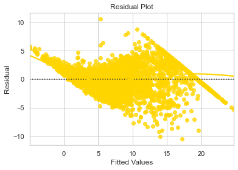

## <a href="https://jakeeide.github.io">Data Science Portfolio</a>

***
##### Cars4U Pricing Model  •  Supervised Learning Project
##### Python • <a href="https://github.com/jakeeide/jakeeide.github.io/blob/d1b9ad6fd72c1d69fbea7c7200186ded7128f6b6/pdf/Eide_Project3_Cars4U.pdf" target="_blank">PDF Presentation</a>
    
***

# <span style='color:#ffd400'> Background </span>  
Cars4U is a tech start-up operating in the Indian pre-owned car market. The business would like to come up with a pricing model that can effectively predict the price of used cars and can help the business in devising profitable strategies using differential pricing. For example, if the business knows the market price, it will never sell anything below it.

# <span style='color:#ffd400'> Objective </span>   

1. Explore and visualize the dataset.
2. Build a linear regression model to predict the prices of used cars.
3. Generate a set of insights and recommendations that will help the business.

# <span style='color:#ffd400'> Data Dictionary </span>

1. S.No. : Serial Number
2. Name : Name of the car which includes Brand name and Model name
3. Location : The location in which the car is being sold or is available for purchase Cities
4. Year : Manufacturing year of the car
5. Kilometers_driven : The total kilometers driven in the car by the previous owner(s) in KM.
6. Fuel_Type : The type of fuel used by the car. (Petrol, Diesel, Electric, CNG, LPG)
7. Transmission : The type of transmission used by the car. (Automatic / Manual)
8. Owner : Type of ownership
9. Mileage : The standard mileage offered by the car company in kmpl or km/kg
10. Engine : The displacement volume of the engine in CC.
11. Power : The maximum power of the engine in bhp.
12. Seats : The number of seats in the car.
13. New_Price : The price of a new car of the same model in INR Lakhs.(1 Lakh = 100, 000)
14. Price : The price of the used car in INR Lakhs (1 Lakh = 100, 000)

***

# <span style='color:#009dff'> Notebook Setup </span>


```python
import warnings
warnings.filterwarnings('ignore')
```


```python
# import necessary libraries
import numpy as np
import pandas as pd
pd.set_option('display.max_rows', 500)

import matplotlib.pyplot as plt 
%matplotlib inline
import seaborn as sns
sns.set(color_codes=True)

from sklearn.linear_model import LinearRegression
from sklearn.model_selection import train_test_split
from sklearn.preprocessing import MinMaxScaler
from sklearn.metrics import mean_absolute_error, mean_squared_error, r2_score

import statsmodels.api as sm
```


```python
#set seaborn color palette
sns.set_palette(palette='hsv')
```

### <span style='color:#3600ff'>  Import and Summarize the Dataset </span>


```python
# import the dataset and create a working copy
data = pd.read_csv('used_cars_data.csv')
car = data.copy()
```


```python
# view the shape of the data
print(f'There are {car.shape[0]} rows and {car.shape[1]} columns.')  # f-string
```

    There are 7253 rows and 14 columns.


# <span style='color:#009dff'> Data Pre-Processing </span>


```python
# look at the first five rows
car.head(10)
```


<div>
<style scoped>
    .dataframe tbody tr th:only-of-type {
        vertical-align: middle;
    }

    .dataframe tbody tr th {
        vertical-align: top;
    }

    .dataframe thead th {
        text-align: right;
    }
</style>
<table border="1" class="dataframe">
  <thead>
    <tr style="text-align: right;">
      <th></th>
      <th>S.No.</th>
      <th>Name</th>
      <th>Location</th>
      <th>Year</th>
      <th>Kilometers_Driven</th>
      <th>Fuel_Type</th>
      <th>Transmission</th>
      <th>Owner_Type</th>
      <th>Mileage</th>
      <th>Engine</th>
      <th>Power</th>
      <th>Seats</th>
      <th>New_Price</th>
      <th>Price</th>
    </tr>
  </thead>
  <tbody>
    <tr>
      <th>0</th>
      <td>0</td>
      <td>Maruti Wagon R LXI CNG</td>
      <td>Mumbai</td>
      <td>2010</td>
      <td>72000</td>
      <td>CNG</td>
      <td>Manual</td>
      <td>First</td>
      <td>26.6 km/kg</td>
      <td>998 CC</td>
      <td>58.16 bhp</td>
      <td>5.0</td>
      <td>NaN</td>
      <td>1.75</td>
    </tr>
    <tr>
      <th>1</th>
      <td>1</td>
      <td>Hyundai Creta 1.6 CRDi SX Option</td>
      <td>Pune</td>
      <td>2015</td>
      <td>41000</td>
      <td>Diesel</td>
      <td>Manual</td>
      <td>First</td>
      <td>19.67 kmpl</td>
      <td>1582 CC</td>
      <td>126.2 bhp</td>
      <td>5.0</td>
      <td>NaN</td>
      <td>12.50</td>
    </tr>
    <tr>
      <th>2</th>
      <td>2</td>
      <td>Honda Jazz V</td>
      <td>Chennai</td>
      <td>2011</td>
      <td>46000</td>
      <td>Petrol</td>
      <td>Manual</td>
      <td>First</td>
      <td>18.2 kmpl</td>
      <td>1199 CC</td>
      <td>88.7 bhp</td>
      <td>5.0</td>
      <td>8.61 Lakh</td>
      <td>4.50</td>
    </tr>
    <tr>
      <th>3</th>
      <td>3</td>
      <td>Maruti Ertiga VDI</td>
      <td>Chennai</td>
      <td>2012</td>
      <td>87000</td>
      <td>Diesel</td>
      <td>Manual</td>
      <td>First</td>
      <td>20.77 kmpl</td>
      <td>1248 CC</td>
      <td>88.76 bhp</td>
      <td>7.0</td>
      <td>NaN</td>
      <td>6.00</td>
    </tr>
    <tr>
      <th>4</th>
      <td>4</td>
      <td>Audi A4 New 2.0 TDI Multitronic</td>
      <td>Coimbatore</td>
      <td>2013</td>
      <td>40670</td>
      <td>Diesel</td>
      <td>Automatic</td>
      <td>Second</td>
      <td>15.2 kmpl</td>
      <td>1968 CC</td>
      <td>140.8 bhp</td>
      <td>5.0</td>
      <td>NaN</td>
      <td>17.74</td>
    </tr>
    <tr>
      <th>5</th>
      <td>5</td>
      <td>Hyundai EON LPG Era Plus Option</td>
      <td>Hyderabad</td>
      <td>2012</td>
      <td>75000</td>
      <td>LPG</td>
      <td>Manual</td>
      <td>First</td>
      <td>21.1 km/kg</td>
      <td>814 CC</td>
      <td>55.2 bhp</td>
      <td>5.0</td>
      <td>NaN</td>
      <td>2.35</td>
    </tr>
    <tr>
      <th>6</th>
      <td>6</td>
      <td>Nissan Micra Diesel XV</td>
      <td>Jaipur</td>
      <td>2013</td>
      <td>86999</td>
      <td>Diesel</td>
      <td>Manual</td>
      <td>First</td>
      <td>23.08 kmpl</td>
      <td>1461 CC</td>
      <td>63.1 bhp</td>
      <td>5.0</td>
      <td>NaN</td>
      <td>3.50</td>
    </tr>
    <tr>
      <th>7</th>
      <td>7</td>
      <td>Toyota Innova Crysta 2.8 GX AT 8S</td>
      <td>Mumbai</td>
      <td>2016</td>
      <td>36000</td>
      <td>Diesel</td>
      <td>Automatic</td>
      <td>First</td>
      <td>11.36 kmpl</td>
      <td>2755 CC</td>
      <td>171.5 bhp</td>
      <td>8.0</td>
      <td>21 Lakh</td>
      <td>17.50</td>
    </tr>
    <tr>
      <th>8</th>
      <td>8</td>
      <td>Volkswagen Vento Diesel Comfortline</td>
      <td>Pune</td>
      <td>2013</td>
      <td>64430</td>
      <td>Diesel</td>
      <td>Manual</td>
      <td>First</td>
      <td>20.54 kmpl</td>
      <td>1598 CC</td>
      <td>103.6 bhp</td>
      <td>5.0</td>
      <td>NaN</td>
      <td>5.20</td>
    </tr>
    <tr>
      <th>9</th>
      <td>9</td>
      <td>Tata Indica Vista Quadrajet LS</td>
      <td>Chennai</td>
      <td>2012</td>
      <td>65932</td>
      <td>Diesel</td>
      <td>Manual</td>
      <td>Second</td>
      <td>22.3 kmpl</td>
      <td>1248 CC</td>
      <td>74 bhp</td>
      <td>5.0</td>
      <td>NaN</td>
      <td>1.95</td>
    </tr>
  </tbody>
</table>
</div>


```python
# look at five random rows
# set random seed so we see the same random results every time
np.random.seed(1)
car.sample(n=5)
```


<div>
<style scoped>
    .dataframe tbody tr th:only-of-type {
        vertical-align: middle;
    }

    .dataframe tbody tr th {
        vertical-align: top;
    }

    .dataframe thead th {
        text-align: right;
    }
</style>
<table border="1" class="dataframe">
  <thead>
    <tr style="text-align: right;">
      <th></th>
      <th>S.No.</th>
      <th>Name</th>
      <th>Location</th>
      <th>Year</th>
      <th>Kilometers_Driven</th>
      <th>Fuel_Type</th>
      <th>Transmission</th>
      <th>Owner_Type</th>
      <th>Mileage</th>
      <th>Engine</th>
      <th>Power</th>
      <th>Seats</th>
      <th>New_Price</th>
      <th>Price</th>
    </tr>
  </thead>
  <tbody>
    <tr>
      <th>2397</th>
      <td>2397</td>
      <td>Ford EcoSport 1.5 Petrol Trend</td>
      <td>Kolkata</td>
      <td>2016</td>
      <td>21460</td>
      <td>Petrol</td>
      <td>Manual</td>
      <td>First</td>
      <td>17.0 kmpl</td>
      <td>1497 CC</td>
      <td>121.36 bhp</td>
      <td>5.0</td>
      <td>9.47 Lakh</td>
      <td>6.00</td>
    </tr>
    <tr>
      <th>3777</th>
      <td>3777</td>
      <td>Maruti Wagon R VXI 1.2</td>
      <td>Kochi</td>
      <td>2015</td>
      <td>49818</td>
      <td>Petrol</td>
      <td>Manual</td>
      <td>First</td>
      <td>21.5 kmpl</td>
      <td>1197 CC</td>
      <td>81.80 bhp</td>
      <td>5.0</td>
      <td>5.44 Lakh</td>
      <td>4.11</td>
    </tr>
    <tr>
      <th>4425</th>
      <td>4425</td>
      <td>Ford Endeavour 4x2 XLT</td>
      <td>Hyderabad</td>
      <td>2007</td>
      <td>130000</td>
      <td>Diesel</td>
      <td>Manual</td>
      <td>First</td>
      <td>13.1 kmpl</td>
      <td>2499 CC</td>
      <td>141 bhp</td>
      <td>7.0</td>
      <td>NaN</td>
      <td>6.00</td>
    </tr>
    <tr>
      <th>3661</th>
      <td>3661</td>
      <td>Mercedes-Benz E-Class E250 CDI Avantgrade</td>
      <td>Coimbatore</td>
      <td>2016</td>
      <td>39753</td>
      <td>Diesel</td>
      <td>Automatic</td>
      <td>First</td>
      <td>13.0 kmpl</td>
      <td>2143 CC</td>
      <td>201.1 bhp</td>
      <td>5.0</td>
      <td>NaN</td>
      <td>35.28</td>
    </tr>
    <tr>
      <th>4514</th>
      <td>4514</td>
      <td>Hyundai Xcent 1.2 Kappa AT SX Option</td>
      <td>Kochi</td>
      <td>2016</td>
      <td>45560</td>
      <td>Petrol</td>
      <td>Automatic</td>
      <td>First</td>
      <td>16.9 kmpl</td>
      <td>1197 CC</td>
      <td>82 bhp</td>
      <td>5.0</td>
      <td>NaN</td>
      <td>6.34</td>
    </tr>
  </tbody>
</table>
</div>


```python
# look at the last five rows
car.tail()
```


<div>
<style scoped>
    .dataframe tbody tr th:only-of-type {
        vertical-align: middle;
    }

    .dataframe tbody tr th {
        vertical-align: top;
    }

    .dataframe thead th {
        text-align: right;
    }
</style>
<table border="1" class="dataframe">
  <thead>
    <tr style="text-align: right;">
      <th></th>
      <th>S.No.</th>
      <th>Name</th>
      <th>Location</th>
      <th>Year</th>
      <th>Kilometers_Driven</th>
      <th>Fuel_Type</th>
      <th>Transmission</th>
      <th>Owner_Type</th>
      <th>Mileage</th>
      <th>Engine</th>
      <th>Power</th>
      <th>Seats</th>
      <th>New_Price</th>
      <th>Price</th>
    </tr>
  </thead>
  <tbody>
    <tr>
      <th>7248</th>
      <td>7248</td>
      <td>Volkswagen Vento Diesel Trendline</td>
      <td>Hyderabad</td>
      <td>2011</td>
      <td>89411</td>
      <td>Diesel</td>
      <td>Manual</td>
      <td>First</td>
      <td>20.54 kmpl</td>
      <td>1598 CC</td>
      <td>103.6 bhp</td>
      <td>5.0</td>
      <td>NaN</td>
      <td>NaN</td>
    </tr>
    <tr>
      <th>7249</th>
      <td>7249</td>
      <td>Volkswagen Polo GT TSI</td>
      <td>Mumbai</td>
      <td>2015</td>
      <td>59000</td>
      <td>Petrol</td>
      <td>Automatic</td>
      <td>First</td>
      <td>17.21 kmpl</td>
      <td>1197 CC</td>
      <td>103.6 bhp</td>
      <td>5.0</td>
      <td>NaN</td>
      <td>NaN</td>
    </tr>
    <tr>
      <th>7250</th>
      <td>7250</td>
      <td>Nissan Micra Diesel XV</td>
      <td>Kolkata</td>
      <td>2012</td>
      <td>28000</td>
      <td>Diesel</td>
      <td>Manual</td>
      <td>First</td>
      <td>23.08 kmpl</td>
      <td>1461 CC</td>
      <td>63.1 bhp</td>
      <td>5.0</td>
      <td>NaN</td>
      <td>NaN</td>
    </tr>
    <tr>
      <th>7251</th>
      <td>7251</td>
      <td>Volkswagen Polo GT TSI</td>
      <td>Pune</td>
      <td>2013</td>
      <td>52262</td>
      <td>Petrol</td>
      <td>Automatic</td>
      <td>Third</td>
      <td>17.2 kmpl</td>
      <td>1197 CC</td>
      <td>103.6 bhp</td>
      <td>5.0</td>
      <td>NaN</td>
      <td>NaN</td>
    </tr>
    <tr>
      <th>7252</th>
      <td>7252</td>
      <td>Mercedes-Benz E-Class 2009-2013 E 220 CDI Avan...</td>
      <td>Kochi</td>
      <td>2014</td>
      <td>72443</td>
      <td>Diesel</td>
      <td>Automatic</td>
      <td>First</td>
      <td>10.0 kmpl</td>
      <td>2148 CC</td>
      <td>170 bhp</td>
      <td>5.0</td>
      <td>NaN</td>
      <td>NaN</td>
    </tr>
  </tbody>
</table>
</div>


* Looking at these rows, I can see that we can drop Serial Number right away, as this column repeats our row index


```python
car.drop(['S.No.'],axis=1,inplace=True)
```


```python
# show the datatypes
car.info()
```

    <class 'pandas.core.frame.DataFrame'>
    RangeIndex: 7253 entries, 0 to 7252
    Data columns (total 13 columns):
     #   Column             Non-Null Count  Dtype  
    ---  ------             --------------  -----  
     0   Name               7253 non-null   object 
     1   Location           7253 non-null   object 
     2   Year               7253 non-null   int64  
     3   Kilometers_Driven  7253 non-null   int64  
     4   Fuel_Type          7253 non-null   object 
     5   Transmission       7253 non-null   object 
     6   Owner_Type         7253 non-null   object 
     7   Mileage            7251 non-null   object 
     8   Engine             7207 non-null   object 
     9   Power              7207 non-null   object 
     10  Seats              7200 non-null   float64
     11  New_Price          1006 non-null   object 
     12  Price              6019 non-null   float64
    dtypes: float64(2), int64(2), object(9)
    memory usage: 736.8+ KB


* Some of the data types are going to need to be corrected. Specifically, I notice that Mileage, Engine, Power, and New-Price should all be numeric values.


```python
# look at the number of unique values in each column
car.nunique()
```


    Name                 2041
    Location               11
    Year                   23
    Kilometers_Driven    3660
    Fuel_Type               5
    Transmission            2
    Owner_Type              4
    Mileage               450
    Engine                150
    Power                 386
    Seats                   9
    New_Price             625
    Price                1373
    dtype: int64


```python
# look at which columns have the most missing values
car.isnull().sum().sort_values(ascending=False)
```


    New_Price            6247
    Price                1234
    Seats                  53
    Power                  46
    Engine                 46
    Mileage                 2
    Owner_Type              0
    Transmission            0
    Fuel_Type               0
    Kilometers_Driven       0
    Year                    0
    Location                0
    Name                    0
    dtype: int64


* New_Price has so many missing values, I might decide that we need to drop this column.

### <span style='color:#3600ff'>  Name: Make, Model, and Trim </span>


```python
# look at Name column to see if we need to pre-process
# check for garbage values
car.Name.value_counts(dropna=False)
```


    Mahindra XUV500 W8 2WD       55
    Maruti Swift VDI             49
    Maruti Swift Dzire VDI       42
    Honda City 1.5 S MT          39
    Maruti Swift VDI BSIV        37
                                 ..
    Maruti Zen LXi BSII           1
    Maruti Alto XCITE             1
    Mini Countryman Cooper D      1
    Hyundai Santro LP zipPlus     1
    BMW X3 2.5si                  1
    Name: Name, Length: 2041, dtype: int64


* Lots of different names found
* Feature Engineering: It probably help us later on if we split this into three columns: 'Make','Model', and 'Trim'


```python
# create temp dataframe by splitting Name into two columns
Make_Model = car["Name"].str.split(" ", n = 1, expand = True) 
```


```python
# add the new columns into our working dataframe and drop the redundant column
car.drop(['Name'], axis=1, inplace=True)
car["Make"]= Make_Model[0]   
car["Model"]= Make_Model[1]

# delete temporary df
del Make_Model
```


```python
# view new Make column
car.Make.value_counts(dropna=False)
```


    Maruti           1444
    Hyundai          1340
    Honda             743
    Toyota            507
    Mercedes-Benz     380
    Volkswagen        374
    Ford              351
    Mahindra          331
    BMW               312
    Audi              285
    Tata              228
    Skoda             202
    Renault           170
    Chevrolet         151
    Nissan            117
    Land               67
    Jaguar             48
    Fiat               38
    Mitsubishi         36
    Mini               31
    Volvo              28
    Porsche            19
    Jeep               19
    Datsun             17
    Force               3
    ISUZU               3
    Bentley             2
    Isuzu               2
    Hindustan           1
    Ambassador          1
    Smart               1
    OpelCorsa           1
    Lamborghini         1
    Name: Make, dtype: int64


```python
# I notice there are two versions of Isuzu (upper and lower-case)
car.loc[(car.Make == 'ISUZU'),'Make'] = 'Isuzu'
```


```python
# 'Land' is supposed to be 'Land Rover'. Rover was cut off because it is after a space.
car.loc[(car.Make == 'Land'),'Make'] = 'Land_Rover'
```


```python
# Remove 'Rover' from the beginning of Land Rover Models
car['Model'] = car['Model'].str.replace('Rover ','')

# Fix Range Rover name
car['Model'] = car['Model'].str.replace('Range','Range_Rover')
```


```python
# view new Model column
car.Model.value_counts(dropna=False)
```


    XUV500 W8 2WD                     55
    Swift VDI                         49
    Swift Dzire VDI                   42
    City 1.5 S MT                     39
    Swift VDI BSIV                    37
                                      ..
    A4 2.0 TDI Celebration Edition     1
    5 Series 530d Highline Sedan       1
    Aveo 1.4 LT ABS BSIV               1
    City 1.3 DX                        1
    X3 2.5si                           1
    Name: Model, Length: 2041, dtype: int64


```python
# create temp dataframe by splitting Model into two columns
Model_Trim = car["Model"].str.split(" ", n = 1, expand = True)
```


```python
# add the new columns into our working dataframe and drop the redundant column
car.drop(['Model'], axis=1, inplace=True)
car["Model"]= Model_Trim[0]   
car["Trim"]= Model_Trim[1]

# delete temporary df
del Model_Trim
```


```python
# view revised Model column
car.Model.value_counts(dropna=False)
```


    Swift          418
    City           318
    i20            303
    Innova         203
    Verna          200
    Grand          183
    Alto           183
    i10            181
    Wagon          178
    Polo           178
    XUV500         131
    Vento          129
    Amaze          127
    New            119
    Creta          118
    Fortuner       118
    Figo           112
    3              109
    E-Class        108
    Duster          97
    Santro          95
    A4              90
    Ertiga          86
    5               86
    Ciaz            83
    Corolla         83
    Brio            80
    Etios           80
    EON             79
    Ritz            78
    Baleno          75
    Jazz            70
    Scorpio         69
    Xcent           68
    Ecosport        67
    A6              66
    Celerio         66
    Superb          58
    Rapid           58
    Vitara          55
    Indica          54
    Beat            54
    EcoSport        50
    Fiesta          49
    Micra           45
    SX4             44
    KWID            44
    Endeavour       43
    Civic           39
    Q7              39
    Q5              38
    XF              36
    X1              36
    Laura           36
    Indigo          36
    Q3              35
    Accord          35
    Zen             33
    Range_Rover     33
    Octavia         33
    Sunny           32
    Elantra         32
    Nano            31
    CR-V            31
    Terrano         30
    Xylo            30
    Pajero          29
    Cooper          28
    Jetta           28
    Dzire           28
    M-Class         27
    X5              25
    Mobilio         24
    Accent          24
    Zest            24
    Omni            23
    Cruze           23
    A-Star          22
    Ameo            22
    Bolero          21
    Eeco            21
    GLA             20
    KUV             20
    S               20
    Compass         19
    Manza           19
    Freelander      19
    Elite           18
    Ikon            18
    Santa           17
    X3              17
    7               17
    Tiago           17
    Aveo            17
    GL-Class        15
    Spark           15
    Linea           15
    800             15
    B               15
    Camry           15
    Discovery       15
    CLA             15
    Ssangyong       14
    GLE             14
    Enjoy           13
    Optra           13
    TUV             12
    Getz            12
    A               12
    Fabia           11
    Thar            10
    Ignis           10
    Sail            10
    Passat          10
    GLC              9
    Pulse            9
    S60              9
    Safari           9
    GO               9
    Sonata           9
    6                9
    X6               8
    BRV              8
    Cayenne          8
    Panamera         8
    Grande           7
    redi-GO          7
    Tigor            7
    Punto            7
    XC60             7
    Sumo             6
    XJ               6
    Esteem           6
    Verito           6
    Yeti             6
    Quanto           6
    Avventura        6
    A3               6
    V40              5
    Tucson           5
    BR-V             5
    CrossPolo        5
    Qualis           5
    XE               5
    Teana            5
    S-Class          5
    WRV              5
    Scala            5
    Freestyle        4
    XC90             4
    Koleos           4
    Captur           4
    R-Class          4
    Hexa             4
    Bolt             4
    Aspire           4
    Fluence          4
    Xenon            4
    Renault          3
    SLC              3
    Tavera           3
    Estilo           3
    Classic          3
    Lodgy            3
    C-Class          3
    SLK-Class        3
    S-Cross          3
    A8               3
    1                3
    S80              3
    Nexon            3
    Captiva          3
    A7               3
    X-Trail          3
    TT               3
    D-MAX            3
    One              3
    NuvoSport        3
    Outlander        2
    RS5              2
    Cedia            2
    Logan            2
    Z4               2
    Versa            2
    Jeep             2
    GLS              2
    Lancer           2
    Clubman          2
    Cayman           2
    Flying           1
    Fusion           1
    1000             1
    1.4Gsi           1
    Fortwo           1
    CLS-Class        1
    Motors           1
    Beetle           1
    WR-V             1
    370Z             1
    Continental      1
    Gallardo         1
    MUX              1
    Countryman       1
    Evalia           1
    Petra            1
    Siena            1
    F                1
    Prius            1
    E                1
    Platinum         1
    Venture          1
    XUV300           1
    MU               1
    Land             1
    Redi             1
    Boxster          1
    Tiguan           1
    Mustang          1
    SL-Class         1
    Abarth           1
    Montero          1
    Name: Model, dtype: int64


```python
# view revised Trim column
car.Trim.value_counts(dropna=False)
```


    VDI                      88
    W8 2WD                   55
    VXI                      45
    Dzire VDI                42
    Sportz 1.2               42
                             ..
    VX CVT                    1
    CRDi 1.6 AT SX Option     1
    1.1 CRDi S Option         1
    Logan 1.4 GLX Petrol      1
    NaN                       1
    Name: Trim, Length: 1894, dtype: int64


```python
# look up NaN value in Trim
car[car.Trim.isnull()]
```


<div>
<style scoped>
    .dataframe tbody tr th:only-of-type {
        vertical-align: middle;
    }

    .dataframe tbody tr th {
        vertical-align: top;
    }

    .dataframe thead th {
        text-align: right;
    }
</style>
<table border="1" class="dataframe">
  <thead>
    <tr style="text-align: right;">
      <th></th>
      <th>Location</th>
      <th>Year</th>
      <th>Kilometers_Driven</th>
      <th>Fuel_Type</th>
      <th>Transmission</th>
      <th>Owner_Type</th>
      <th>Mileage</th>
      <th>Engine</th>
      <th>Power</th>
      <th>Seats</th>
      <th>New_Price</th>
      <th>Price</th>
      <th>Make</th>
      <th>Model</th>
      <th>Trim</th>
    </tr>
  </thead>
  <tbody>
    <tr>
      <th>7067</th>
      <td>Hyderabad</td>
      <td>2005</td>
      <td>50000</td>
      <td>Petrol</td>
      <td>Manual</td>
      <td>Second</td>
      <td>14.2 kmpl</td>
      <td>1389 CC</td>
      <td>88 bhp</td>
      <td>5.0</td>
      <td>NaN</td>
      <td>NaN</td>
      <td>OpelCorsa</td>
      <td>1.4Gsi</td>
      <td>None</td>
    </tr>
  </tbody>
</table>
</div>


```python
# one NaN value in trim needs to be manually fixed
car['Model'].loc[7067] = '1.4'
car['Trim'].loc[7067] = 'GSi'
```


```python
# change Make, Model, and Trim to categories
car['Make'] = car.Make.astype('category')
car['Model'] = car.Model.astype('category')
car['Trim'] = car.Trim.astype('category')
```

### <span style='color:#3600ff'>  Location </span>


```python
# look at Location column to see if we need to pre-process
# check for garbage values
car.Location.value_counts(dropna=False)
```


    Mumbai        949
    Hyderabad     876
    Kochi         772
    Coimbatore    772
    Pune          765
    Delhi         660
    Kolkata       654
    Chennai       591
    Jaipur        499
    Bangalore     440
    Ahmedabad     275
    Name: Location, dtype: int64


* No garbage values found
* 11 different cities are represented in this data set
* Location would be better as a category than an object


```python
# change Location data type to category
car['Location'] = car.Location.astype('category')
```

### <span style='color:#3600ff'>  Year </span>


```python
# look at Year column to see if we need to pre-process
# check for garbage values
car.Year.value_counts(dropna=False)
```


    2015    929
    2014    925
    2016    886
    2013    791
    2017    709
    2012    690
    2011    579
    2010    407
    2018    361
    2009    252
    2008    207
    2007    148
    2019    119
    2006     89
    2005     68
    2004     35
    2003     20
    2002     18
    2001      8
    2000      5
    1998      4
    1999      2
    1996      1
    Name: Year, dtype: int64


* No garbage values found
* years vary from 1996 to 2018
* Years should be a category, not a number


```python
# change Fuel_Type data type to category
car['Year'] = car.Year.astype('category')
```

### <span style='color:#3600ff'>  Kilometers_Driven </span>


```python
# look at Fuel_Type column to see if we need to pre-process
car.Kilometers_Driven.value_counts(dropna=False)
```


    60000    96
    45000    86
    65000    86
    70000    77
    50000    72
             ..
    46300     1
    9434      1
    72921     1
    33128     1
    83969     1
    Name: Kilometers_Driven, Length: 3660, dtype: int64


* Can leave Kilometers_Driven as it is for now

### <span style='color:#3600ff'>  Fuel_Type </span>


```python
# look at Fuel_Type column to see if we need to pre-process
# check for garbage values
car.Fuel_Type.value_counts(dropna=False)
```


    Diesel      3852
    Petrol      3325
    CNG           62
    LPG           12
    Electric       2
    Name: Fuel_Type, dtype: int64


* No garbage values found
* Five fuel types found; this is consistent with our data dictionary
* This should be a category, not an object


```python
# change Fuel_Type data type to category
car['Fuel_Type'] = car.Fuel_Type.astype('category')
```

### <span style='color:#3600ff'>  Transmission </span>


```python
# look at Transmission column to see if we need to pre-process
# check for garbage values
car.Transmission.value_counts(dropna=False)
```


    Manual       5204
    Automatic    2049
    Name: Transmission, dtype: int64


* No garbage values found
* Only two possible values: 'Manual' or 'Automatic'
* This should be a category, not an object


```python
# change Fuel_Type data type to category
car['Transmission'] = car.Transmission.astype('category')
```

### <span style='color:#3600ff'>  Owner_Type </span>


```python
# look at Owner_Type column to see if we need to pre-process
# check for garbage values
car.Owner_Type.value_counts(dropna=False)
```


    First             5952
    Second            1152
    Third              137
    Fourth & Above      12
    Name: Owner_Type, dtype: int64


* No garbage values found
* Only four possible values
* This should be a category, not an object


```python
# change Owner_Type data type to category
car['Owner_Type'] = car.Owner_Type.astype('category')
```

### <span style='color:#3600ff'>  Mileage </span>


```python
# look at Mileage column to see if we need to pre-process
# check for garbage values
car.Mileage.value_counts(dropna=False)
```


    17.0 kmpl      207
    18.9 kmpl      201
    18.6 kmpl      144
    21.1 kmpl      106
    20.36 kmpl     105
    17.8 kmpl       98
    18.0 kmpl       89
    12.8 kmpl       87
    18.5 kmpl       86
    16.0 kmpl       85
    20.0 kmpl       82
    0.0 kmpl        81
    22.7 kmpl       79
    13.0 kmpl       79
    15.1 kmpl       78
    12.99 kmpl      77
    16.8 kmpl       69
    16.47 kmpl      66
    19.7 kmpl       64
    25.8 kmpl       60
    23.1 kmpl       58
    22.32 kmpl      57
    13.5 kmpl       56
    17.5 kmpl       56
    24.3 kmpl       55
    19.4 kmpl       54
    15.0 kmpl       52
    16.1 kmpl       51
    11.5 kmpl       51
    17.01 kmpl      50
    22.9 kmpl       50
    19.3 kmpl       50
    21.4 kmpl       49
    19.0 kmpl       49
    22.07 kmpl      47
    24.0 kmpl       47
    19.81 kmpl      46
    19.01 kmpl      46
    23.4 kmpl       45
    28.4 kmpl       45
    19.67 kmpl      45
    19.1 kmpl       45
    16.55 kmpl      44
    17.9 kmpl       43
    12.55 kmpl      43
    21.9 kmpl       43
    23.59 kmpl      43
    14.0 kmpl       42
    12.05 kmpl      41
    26.0 kmpl       40
    20.54 kmpl      40
    26.59 kmpl      40
    17.68 kmpl      40
    20.77 kmpl      39
    17.4 kmpl       38
    23.0 kmpl       38
    22.54 kmpl      37
    18.88 kmpl      37
    22.5 kmpl       37
    13.7 kmpl       37
    25.2 kmpl       36
    20.14 kmpl      36
    22.0 kmpl       34
    24.07 kmpl      34
    15.8 kmpl       34
    18.2 kmpl       34
    18.7 kmpl       32
    19.27 kmpl      32
    28.09 kmpl      32
    17.3 kmpl       32
    22.74 kmpl      31
    15.04 kmpl      31
    13.2 kmpl       31
    17.1 kmpl       31
    20.4 kmpl       31
    25.17 kmpl      31
    16.2 kmpl       31
    17.11 kmpl      30
    24.7 kmpl       30
    15.4 kmpl       30
    15.6 kmpl       29
    20.73 kmpl      29
    14.84 kmpl      29
    20.51 kmpl      29
    12.07 kmpl      28
    23.08 kmpl      27
    22.69 kmpl      27
    14.53 kmpl      27
    23.2 kmpl       27
    11.36 kmpl      26
    13.68 kmpl      26
    15.5 kmpl       26
    16.95 kmpl      26
    24.4 kmpl       26
    21.5 kmpl       25
    25.44 kmpl      25
    17.92 kmpl      25
    10.5 kmpl       24
    11.7 kmpl       24
    20.5 kmpl       24
    14.8 kmpl       23
    15.3 kmpl       23
    19.87 kmpl      23
    13.1 kmpl       22
    14.28 kmpl      22
    15.29 kmpl      22
    15.73 kmpl      22
    14.21 kmpl      22
    17.05 kmpl      21
    25.4 kmpl       21
    16.36 kmpl      21
    12.9 kmpl       21
    14.74 kmpl      20
    12.7 kmpl       20
    25.0 kmpl       20
    17.6 kmpl       19
    14.16 kmpl      19
    13.6 kmpl       19
    15.26 kmpl      19
    13.8 kmpl       19
    27.3 kmpl       19
    19.5 kmpl       18
    11.0 kmpl       18
    17.21 kmpl      18
    16.5 kmpl       17
    11.74 kmpl      17
    20.92 kmpl      17
    18.12 kmpl      17
    25.1 kmpl       17
    20.45 kmpl      17
    16.02 kmpl      17
    16.07 kmpl      17
    14.4 kmpl       17
    21.64 kmpl      17
    13.4 kmpl       17
    11.3 kmpl       16
    22.77 kmpl      16
    12.0 kmpl       16
    18.48 kmpl      16
    22.48 kmpl      16
    21.43 kmpl      16
    18.16 kmpl      16
    14.3 kmpl       15
    27.39 kmpl      15
    10.91 kmpl      15
    17.57 kmpl      15
    16.09 kmpl      15
    23.84 kmpl      15
    12.4 kmpl       14
    19.2 kmpl       14
    21.66 kmpl      14
    11.1 kmpl       14
    17.7 kmpl       14
    10.0 kmpl       13
    14.7 kmpl       13
    21.76 kmpl      13
    26.6 km/kg      13
    18.1 kmpl       13
    17.2 kmpl       13
    23.9 kmpl       12
    24.2 kmpl       12
    19.08 kmpl      12
    18.3 kmpl       12
    22.3 kmpl       12
    19.6 kmpl       12
    25.47 kmpl      12
    20.3 kmpl       12
    15.97 kmpl      12
    25.83 kmpl      12
    16.73 kmpl      11
    20.34 kmpl      11
    10.8 kmpl       11
    18.49 kmpl      11
    19.64 kmpl      11
    16.9 kmpl       11
    11.18 kmpl      11
    18.15 kmpl      11
    15.96 kmpl      11
    20.85 kmpl      11
    16.78 kmpl      11
    26.21 kmpl      11
    14.69 kmpl      11
    11.57 kmpl      11
    16.6 kmpl       10
    11.8 kmpl       10
    20.7 kmpl       10
    10.1 kmpl       10
    14.67 kmpl      10
    11.4 kmpl       10
    18.06 kmpl      10
    22.95 kmpl      10
    14.94 kmpl      10
    20.64 kmpl       9
    14.24 kmpl       9
    16.96 kmpl       9
    10.2 kmpl        9
    20.68 kmpl       9
    24.52 kmpl       9
    18.53 kmpl       9
    14.49 kmpl       9
    25.32 kmpl       9
    12.39 kmpl       9
    20.89 kmpl       9
    16.3 kmpl        8
    12.6 kmpl        8
    15.2 kmpl        8
    16.77 kmpl       8
    17.71 kmpl       8
    11.2 kmpl        8
    13.93 kmpl       8
    26.2 km/kg       8
    13.01 kmpl       8
    19.16 kmpl       8
    18.19 kmpl       7
    17.19 kmpl       7
    18.25 kmpl       7
    13.9 kmpl        7
    23.5 kmpl        7
    21.12 kmpl       7
    9.0 kmpl         7
    19.33 kmpl       7
    18.56 kmpl       7
    23.65 kmpl       7
    21.38 kmpl       7
    13.24 kmpl       7
    15.7 kmpl        7
    14.95 kmpl       7
    10.9 kmpl        7
    21.14 kmpl       7
    20.46 kmpl       7
    16.46 kmpl       7
    21.19 kmpl       7
    14.6 kmpl        6
    18.4 kmpl        6
    16.4 kmpl        6
    12.3 kmpl        6
    11.33 kmpl       6
    21.21 kmpl       6
    18.33 kmpl       6
    21.27 kmpl       6
    14.2 kmpl        6
    15.1 km/kg       6
    10.93 kmpl       6
    13.22 kmpl       6
    12.62 kmpl       6
    15.9 kmpl        6
    19.12 kmpl       6
    17.32 kmpl       6
    16.52 kmpl       6
    20.38 kmpl       6
    15.06 kmpl       5
    21.56 kmpl       5
    15.63 kmpl       5
    12.83 kmpl       5
    19.15 kmpl       5
    17.85 kmpl       5
    15.64 kmpl       5
    25.6 kmpl        5
    19.34 kmpl       5
    11.9 kmpl        5
    16.82 kmpl       5
    32.26 km/kg      5
    23.8 kmpl        5
    27.62 kmpl       5
    24.5 kmpl        5
    14.66 kmpl       5
    21.7 kmpl        5
    19.59 kmpl       5
    14.62 kmpl       5
    16.98 kmpl       5
    11.68 kmpl       5
    33.54 km/kg      5
    15.17 kmpl       4
    13.14 kmpl       4
    15.68 kmpl       4
    10.13 kmpl       4
    8.7 kmpl         4
    27.4 kmpl        4
    16.93 kmpl       4
    22.1 kmpl        4
    19.71 kmpl       4
    17.88 kmpl       4
    21.02 kmpl       4
    20.37 kmpl       4
    22.71 kmpl       4
    11.79 kmpl       4
    26.1 kmpl        4
    24.8 kmpl        4
    14.75 kmpl       4
    17.97 kmpl       4
    17.54 kmpl       4
    19.09 kmpl       4
    11.72 kmpl       4
    14.02 kmpl       4
    19.83 kmpl       4
    9.8 kmpl         4
    9.74 kmpl        4
    33.44 km/kg      4
    13.49 kmpl       4
    19.69 kmpl       3
    13.45 km/kg      3
    23.3 kmpl        3
    18.51 kmpl       3
    12.5 kmpl        3
    15.74 kmpl       3
    17.72 kmpl       3
    17.67 kmpl       3
    15.15 kmpl       3
    17.5 km/kg       3
    14.39 kmpl       3
    19.98 kmpl       3
    9.5 kmpl         3
    21.03 kmpl       3
    13.73 kmpl       3
    18.78 kmpl       3
    17.3 km/kg       3
    20.63 kmpl       3
    10.4 kmpl        3
    12.35 kmpl       3
    21.13 kmpl       3
    16.51 kmpl       3
    20.58 kmpl       3
    14.81 kmpl       3
    12.98 kmpl       3
    17.45 kmpl       3
    9.1 kmpl         3
    18.44 kmpl       3
    14.07 kmpl       3
    7.94 kmpl        3
    17.43 kmpl       3
    21.72 kmpl       3
    12.65 kmpl       3
    15.41 kmpl       3
    12.1 kmpl        3
    9.9 kmpl         3
    14.1 kmpl        3
    21.0 kmpl        3
    8.45 kmpl        2
    13.06 kmpl       2
    8.2 kmpl         2
    10.37 kmpl       2
    8.6 kmpl         2
    18.59 kmpl       2
    22.1 km/kg       2
    12.63 kmpl       2
    21.79 kmpl       2
    12.19 kmpl       2
    31.79 km/kg      2
    9.43 kmpl        2
    17.44 kmpl       2
    21.8 kmpl        2
    15.85 kmpl       2
    9.52 kmpl        2
    19.72 kmpl       2
    14.42 kmpl       2
    11.07 kmpl       2
    13.2 km/kg       2
    24.04 kmpl       2
    16.7 kmpl        2
    16.38 kmpl       2
    30.46 km/kg      2
    16.05 kmpl       2
    19.49 kmpl       2
    19.68 kmpl       2
    16.25 kmpl       2
    11.78 kmpl       2
    13.17 kmpl       2
    13.53 kmpl       2
    NaN              2
    11.25 kmpl       2
    25.0 km/kg       2
    11.05 kmpl       2
    15.11 kmpl       2
    15.87 kmpl       2
    11.49 kmpl       2
    12.51 kmpl       2
    25.5 kmpl        2
    12.81 kmpl       2
    12.37 kmpl       2
    20.65 kmpl       2
    13.33 kmpl       2
    27.03 kmpl       2
    14.9 kmpl        2
    27.28 kmpl       2
    26.83 km/kg      2
    14.5 kmpl        2
    18.8 kmpl        2
    24.6 km/kg       2
    9.3 kmpl         2
    26.3 km/kg       2
    23.03 kmpl       2
    23.57 kmpl       1
    14.45 kmpl       1
    17.84 kmpl       1
    14.83 kmpl       1
    20.0 km/kg       1
    19.2 km/kg       1
    11.56 kmpl       1
    13.44 kmpl       1
    20.86 kmpl       1
    16.12 kmpl       1
    18.18 kmpl       1
    12.85 kmpl       1
    13.58 kmpl       1
    14.57 kmpl       1
    18.23 kmpl       1
    19.44 kmpl       1
    12.08 kmpl       1
    17.16 kmpl       1
    11.62 kmpl       1
    15.42 kmpl       1
    10.98 kmpl       1
    14.47 kmpl       1
    9.7 kmpl         1
    17.24 kmpl       1
    15.56 kmpl       1
    11.88 km/kg      1
    7.81 kmpl        1
    12.97 kmpl       1
    13.07 kmpl       1
    8.77 kmpl        1
    12.2 kmpl        1
    10.6 kmpl        1
    17.15 kmpl       1
    18.69 kmpl       1
    14.33 kmpl       1
    8.5 kmpl         1
    20.62 kmpl       1
    17.09 kmpl       1
    13.29 kmpl       1
    23.19 kmpl       1
    23.01 kmpl       1
    25.01 kmpl       1
    18.86 kmpl       1
    21.1 km/kg       1
    6.4 kmpl         1
    7.5 kmpl         1
    21.4 km/kg       1
    17.06 kmpl       1
    19.91 kmpl       1
    8.3 kmpl         1
    20.8 kmpl        1
    26.8 kmpl        1
    8.1 kmpl         1
    21.2 kmpl        1
    17.0 km/kg       1
    14.59 kmpl       1
    8.0 kmpl         1
    12.95 kmpl       1
    22.8 km/kg       1
    14.53 km/kg      1
    Name: Mileage, dtype: int64


* Looking at the output from .head, I see that there are units in "kmpl" for some fuel types, and the units are in "km/kg" for CNG and LPG Fuel_Types.
* No garbage values found


```python
# create temp dataframe by splitting Mileage into two columns
km_unit = car["Mileage"].str.split(" ", n = 1, expand = True) 
```


```python
# add the new columns into our working dataframe and drop the redundant column
car.drop(['Mileage'], axis=1, inplace=True)
car["Fuel_Efficiency"]= km_unit[0]   

# delete temporary df
del km_unit
```


```python
# convert "Fuel_Efficiency" to a number
# using to_numeric method because of NaN values
car['Fuel_Efficiency'] = pd.to_numeric(car['Fuel_Efficiency'], errors='coerce')
```


```python
#look at our new columns
car.head(10)
```


<div>
<style scoped>
    .dataframe tbody tr th:only-of-type {
        vertical-align: middle;
    }

    .dataframe tbody tr th {
        vertical-align: top;
    }

    .dataframe thead th {
        text-align: right;
    }
</style>
<table border="1" class="dataframe">
  <thead>
    <tr style="text-align: right;">
      <th></th>
      <th>Location</th>
      <th>Year</th>
      <th>Kilometers_Driven</th>
      <th>Fuel_Type</th>
      <th>Transmission</th>
      <th>Owner_Type</th>
      <th>Engine</th>
      <th>Power</th>
      <th>Seats</th>
      <th>New_Price</th>
      <th>Price</th>
      <th>Make</th>
      <th>Model</th>
      <th>Trim</th>
      <th>Fuel_Efficiency</th>
    </tr>
  </thead>
  <tbody>
    <tr>
      <th>0</th>
      <td>Mumbai</td>
      <td>2010</td>
      <td>72000</td>
      <td>CNG</td>
      <td>Manual</td>
      <td>First</td>
      <td>998 CC</td>
      <td>58.16 bhp</td>
      <td>5.0</td>
      <td>NaN</td>
      <td>1.75</td>
      <td>Maruti</td>
      <td>Wagon</td>
      <td>R LXI CNG</td>
      <td>26.60</td>
    </tr>
    <tr>
      <th>1</th>
      <td>Pune</td>
      <td>2015</td>
      <td>41000</td>
      <td>Diesel</td>
      <td>Manual</td>
      <td>First</td>
      <td>1582 CC</td>
      <td>126.2 bhp</td>
      <td>5.0</td>
      <td>NaN</td>
      <td>12.50</td>
      <td>Hyundai</td>
      <td>Creta</td>
      <td>1.6 CRDi SX Option</td>
      <td>19.67</td>
    </tr>
    <tr>
      <th>2</th>
      <td>Chennai</td>
      <td>2011</td>
      <td>46000</td>
      <td>Petrol</td>
      <td>Manual</td>
      <td>First</td>
      <td>1199 CC</td>
      <td>88.7 bhp</td>
      <td>5.0</td>
      <td>8.61 Lakh</td>
      <td>4.50</td>
      <td>Honda</td>
      <td>Jazz</td>
      <td>V</td>
      <td>18.20</td>
    </tr>
    <tr>
      <th>3</th>
      <td>Chennai</td>
      <td>2012</td>
      <td>87000</td>
      <td>Diesel</td>
      <td>Manual</td>
      <td>First</td>
      <td>1248 CC</td>
      <td>88.76 bhp</td>
      <td>7.0</td>
      <td>NaN</td>
      <td>6.00</td>
      <td>Maruti</td>
      <td>Ertiga</td>
      <td>VDI</td>
      <td>20.77</td>
    </tr>
    <tr>
      <th>4</th>
      <td>Coimbatore</td>
      <td>2013</td>
      <td>40670</td>
      <td>Diesel</td>
      <td>Automatic</td>
      <td>Second</td>
      <td>1968 CC</td>
      <td>140.8 bhp</td>
      <td>5.0</td>
      <td>NaN</td>
      <td>17.74</td>
      <td>Audi</td>
      <td>A4</td>
      <td>New 2.0 TDI Multitronic</td>
      <td>15.20</td>
    </tr>
    <tr>
      <th>5</th>
      <td>Hyderabad</td>
      <td>2012</td>
      <td>75000</td>
      <td>LPG</td>
      <td>Manual</td>
      <td>First</td>
      <td>814 CC</td>
      <td>55.2 bhp</td>
      <td>5.0</td>
      <td>NaN</td>
      <td>2.35</td>
      <td>Hyundai</td>
      <td>EON</td>
      <td>LPG Era Plus Option</td>
      <td>21.10</td>
    </tr>
    <tr>
      <th>6</th>
      <td>Jaipur</td>
      <td>2013</td>
      <td>86999</td>
      <td>Diesel</td>
      <td>Manual</td>
      <td>First</td>
      <td>1461 CC</td>
      <td>63.1 bhp</td>
      <td>5.0</td>
      <td>NaN</td>
      <td>3.50</td>
      <td>Nissan</td>
      <td>Micra</td>
      <td>Diesel XV</td>
      <td>23.08</td>
    </tr>
    <tr>
      <th>7</th>
      <td>Mumbai</td>
      <td>2016</td>
      <td>36000</td>
      <td>Diesel</td>
      <td>Automatic</td>
      <td>First</td>
      <td>2755 CC</td>
      <td>171.5 bhp</td>
      <td>8.0</td>
      <td>21 Lakh</td>
      <td>17.50</td>
      <td>Toyota</td>
      <td>Innova</td>
      <td>Crysta 2.8 GX AT 8S</td>
      <td>11.36</td>
    </tr>
    <tr>
      <th>8</th>
      <td>Pune</td>
      <td>2013</td>
      <td>64430</td>
      <td>Diesel</td>
      <td>Manual</td>
      <td>First</td>
      <td>1598 CC</td>
      <td>103.6 bhp</td>
      <td>5.0</td>
      <td>NaN</td>
      <td>5.20</td>
      <td>Volkswagen</td>
      <td>Vento</td>
      <td>Diesel Comfortline</td>
      <td>20.54</td>
    </tr>
    <tr>
      <th>9</th>
      <td>Chennai</td>
      <td>2012</td>
      <td>65932</td>
      <td>Diesel</td>
      <td>Manual</td>
      <td>Second</td>
      <td>1248 CC</td>
      <td>74 bhp</td>
      <td>5.0</td>
      <td>NaN</td>
      <td>1.95</td>
      <td>Tata</td>
      <td>Indica</td>
      <td>Vista Quadrajet LS</td>
      <td>22.30</td>
    </tr>
  </tbody>
</table>
</div>


### <span style='color:#3600ff'>  Engine </span>


```python
# look at Engine column to see if we need to pre-process
# check for garbage values
car.Engine.value_counts(dropna=False)
```


    1197 CC    732
    1248 CC    610
    1498 CC    370
    998 CC     309
    1198 CC    281
    2179 CC    278
    1497 CC    273
    1968 CC    266
    1995 CC    212
    1461 CC    188
    2143 CC    184
    1199 CC    177
    1582 CC    174
    1396 CC    170
    1598 CC    164
    796 CC     164
    2494 CC    154
    1086 CC    129
    1591 CC    113
    2993 CC    106
    1399 CC    106
    2982 CC    103
    1798 CC    100
    2987 CC     78
    814 CC      74
    2967 CC     67
    1120 CC     60
    1373 CC     59
    1364 CC     58
    1196 CC     57
    1493 CC     57
    2354 CC     53
    1298 CC     48
    NaN         46
    2755 CC     42
    1991 CC     41
    799 CC      40
    1799 CC     39
    1896 CC     39
    999 CC      36
    1998 CC     35
    1496 CC     33
    1061 CC     32
    624 CC      31
    1796 CC     29
    2393 CC     28
    1586 CC     26
    2498 CC     26
    1499 CC     25
    936 CC      25
    1405 CC     25
    1794 CC     24
    1193 CC     24
    2523 CC     22
    1997 CC     22
    1984 CC     22
    2148 CC     21
    1999 CC     21
    1495 CC     20
    1186 CC     18
    2199 CC     17
    1368 CC     17
    2477 CC     17
    1956 CC     17
    2499 CC     16
    3198 CC     15
    995 CC      15
    2497 CC     14
    993 CC      14
    2696 CC     14
    2400 CC     13
    1595 CC     13
    1599 CC     13
    3498 CC     13
    2835 CC     12
    1299 CC     11
    1341 CC     11
    1388 CC     11
    2953 CC     10
    1950 CC      9
    2489 CC      8
    1150 CC      8
    2198 CC      8
    4134 CC      8
    2979 CC      7
    2996 CC      7
    1462 CC      7
    1596 CC      7
    2496 CC      6
    2698 CC      6
    1590 CC      6
    1172 CC      6
    2609 CC      5
    4367 CC      5
    2359 CC      5
    793 CC       5
    1047 CC      5
    2446 CC      5
    2362 CC      4
    4806 CC      4
    1797 CC      4
    4395 CC      4
    1343 CC      4
    1390 CC      4
    1969 CC      3
    1395 CC      3
    2956 CC      3
    5461 CC      3
    1194 CC      3
    2349 CC      3
    2999 CC      2
    2147 CC      2
    1242 CC      2
    2200 CC      2
    2894 CC      2
    1948 CC      2
    5998 CC      2
    2771 CC      2
    3597 CC      2
    1781 CC      2
    2360 CC      2
    2997 CC      2
    1985 CC      2
    1597 CC      2
    5000 CC      2
    2495 CC      2
    2487 CC      2
    3436 CC      2
    970 CC       1
    2720 CC      1
    1978 CC      1
    5204 CC      1
    2149 CC      1
    2092 CC      1
    3197 CC      1
    1422 CC      1
    3200 CC      1
    3696 CC      1
    2706 CC      1
    2694 CC      1
    2112 CC      1
    1468 CC      1
    1389 CC      1
    72 CC        1
    2000 CC      1
    2925 CC      1
    2773 CC      1
    1795 CC      1
    2995 CC      1
    4951 CC      1
    1489 CC      1
    Name: Engine, dtype: int64


```python
# remove "CC" from the end of each entry
car['Engine'] = car['Engine'].str.replace(' CC','')
```


```python
# convert "Engine" to a number
# using to_numeric method because of NaN values
car['Engine'] = pd.to_numeric(car['Engine'], errors='coerce')
```

### <span style='color:#3600ff'>  Power </span>


```python
# look at the Power column to see if we need to pre-process
# check for garbage values
car.Power.value_counts(dropna=False)
```


    74 bhp         280
    98.6 bhp       166
    73.9 bhp       152
    140 bhp        142
    null bhp       129
    78.9 bhp       128
    67.1 bhp       126
    67.04 bhp      125
    82 bhp         124
    88.5 bhp       120
    118 bhp        111
    117.3 bhp      106
    121.3 bhp      104
    126.2 bhp       98
    86.8 bhp        96
    174.33 bhp      92
    88.7 bhp        91
    170 bhp         91
    190 bhp         91
    80 bhp          90
    70 bhp          85
    103.6 bhp       85
    81.83 bhp       84
    81.86 bhp       83
    68 bhp          75
    68.05 bhp       71
    102 bhp         71
    55.2 bhp        70
    85.8 bhp        70
    184 bhp         69
    100 bhp         69
    120 bhp         66
    88.8 bhp        64
    88.73 bhp       61
    47.3 bhp        60
    90 bhp          60
    46.3 bhp        59
    108.45 bhp      59
    67 bhp          57
    81.80 bhp       57
    86.7 bhp        54
    83.1 bhp        54
    138.1 bhp       53
    168.5 bhp       53
    126.32 bhp      52
    88.76 bhp       50
    100.6 bhp       50
    75 bhp          49
    89.84 bhp       49
    83.8 bhp        46
    NaN             46
    258 bhp         44
    108.5 bhp       43
    241.4 bhp       43
    103.2 bhp       42
    62.1 bhp        42
    187.7 bhp       39
    138.03 bhp      39
    147.51 bhp      36
    91.1 bhp        36
    171 bhp         35
    103.52 bhp      33
    110 bhp         33
    103.5 bhp       33
    105 bhp         32
    181 bhp         32
    53.3 bhp        31
    73.75 bhp       30
    130 bhp         29
    116.3 bhp       29
    136 bhp         29
    204 bhp         29
    167.62 bhp      28
    73.94 bhp       27
    93.7 bhp        27
    147.8 bhp       26
    171.5 bhp       26
    112 bhp         26
    85.80 bhp       26
    187.74 bhp      25
    71 bhp          25
    157.75 bhp      24
    62 bhp          23
    203 bhp         23
    66.1 bhp        22
    94 bhp          22
    84.8 bhp        22
    177 bhp         22
    141 bhp         22
    78 bhp          21
    79.4 bhp        21
    73 bhp          21
    174.5 bhp       21
    63.1 bhp        20
    69 bhp          20
    35 bhp          19
    174.3 bhp       19
    73.97 bhp       18
    64 bhp          18
    99 bhp          18
    177.6 bhp       18
    57.6 bhp        18
    84 bhp          17
    194.3 bhp       17
    37.48 bhp       17
    153.86 bhp      16
    83.14 bhp       16
    98.59 bhp       16
    125 bhp         16
    175.56 bhp      16
    215 bhp         15
    60 bhp          15
    37 bhp          15
    152 bhp         14
    186 bhp         14
    163.7 bhp       14
    147.9 bhp       14
    82.85 bhp       14
    88.2 bhp        14
    218 bhp         14
    270.9 bhp       14
    110.4 bhp       14
    245 bhp         13
    107.3 bhp       13
    58.16 bhp       13
    58.2 bhp        13
    126.24 bhp      12
    103.3 bhp       12
    126.3 bhp       12
    88.50 bhp       12
    87.2 bhp        12
    157.7 bhp       11
    85 bhp          11
    63 bhp          11
    69.01 bhp       11
    138 bhp         11
    66 bhp          11
    143 bhp         11
    165 bhp         11
    224 bhp         11
    98.96 bhp       11
    65 bhp          11
    177.46 bhp      10
    201.1 bhp       10
    120.7 bhp       10
    142 bhp         10
    113.98 bhp      10
    197 bhp         10
    254.8 bhp       10
    67.06 bhp       10
    169 bhp         10
    150 bhp         10
    198.5 bhp       10
    210 bhp          9
    88 bhp           9
    235 bhp          9
    254.79 bhp       9
    102.5 bhp        9
    180 bhp          9
    77 bhp           9
    201.15 bhp       9
    34.2 bhp         9
    107.2 bhp        9
    121.4 bhp        9
    37.5 bhp         9
    115 bhp          8
    63.12 bhp        8
    76.8 bhp         8
    160 bhp          8
    140.8 bhp        8
    83 bhp           8
    104.68 bhp       8
    132 bhp          8
    99.6 bhp         8
    123.24 bhp       8
    82.9 bhp         8
    179.5 bhp        8
    97.7 bhp         8
    106 bhp          8
    178 bhp          7
    92.7 bhp         7
    203.2 bhp        7
    189.08 bhp       7
    56.3 bhp         7
    121.36 bhp       7
    130.2 bhp        7
    183 bhp          7
    154 bhp          7
    167.6 bhp        7
    47 bhp           7
    167.7 bhp        6
    313 bhp          6
    76 bhp           6
    255 bhp          6
    108.62 bhp       6
    335.2 bhp        6
    272 bhp          6
    74.9 bhp         6
    265 bhp          6
    158 bhp          6
    241.38 bhp       6
    75.94 bhp        6
    108.4 bhp        6
    306 bhp          6
    123.7 bhp        6
    53.64 bhp        6
    157.8 bhp        6
    147.5 bhp        6
    282 bhp          5
    91.72 bhp        5
    148 bhp          5
    158.2 bhp        5
    103.25 bhp       5
    197.2 bhp        5
    149.92 bhp       5
    194 bhp          5
    134 bhp          5
    300 bhp          5
    241 bhp          5
    141.1 bhp        5
    40.3 bhp         4
    101 bhp          4
    73.8 bhp         4
    118.3 bhp        4
    163.5 bhp        4
    64.1 bhp         4
    91.7 bhp         4
    82.5 bhp         4
    67.05 bhp        4
    55 bhp           4
    185 bhp          4
    224.34 bhp       4
    364.9 bhp        4
    168.7 bhp        4
    208 bhp          4
    164.7 bhp        4
    53.5 bhp         4
    200 bhp          4
    73.74 bhp        4
    108.49 bhp       3
    246.7 bhp        3
    261.49 bhp       3
    97.6 bhp         3
    158.8 bhp        3
    92 bhp           3
    450 bhp          3
    162 bhp          3
    198.25 bhp       3
    191.34 bhp       3
    82.4 bhp         3
    123.37 bhp       3
    178.4 bhp        3
    80.46 bhp        3
    94.68 bhp        3
    86.76 bhp        3
    163.2 bhp        3
    177.5 bhp        3
    108.495 bhp      3
    66.7 bhp         3
    138.08 bhp       3
    91.2 bhp         3
    116.6 bhp        3
    240 bhp          3
    57.5 bhp         3
    70.02 bhp        3
    181.03 bhp       3
    362.07 bhp       3
    105.5 bhp        3
    64.08 bhp        3
    98.82 bhp        3
    147.6 bhp        3
    308 bhp          3
    246.74 bhp       3
    86.79 bhp        3
    83.83 bhp        2
    321 bhp          2
    163 bhp          2
    53 bhp           2
    38.4 bhp         2
    189 bhp          2
    262.6 bhp        2
    118.6 bhp        2
    250 bhp          2
    52.8 bhp         2
    48.21 bhp        2
    104 bhp          2
    85.7 bhp         2
    193.1 bhp        2
    130.3 bhp        2
    93 bhp           2
    177.01 bhp       2
    444 bhp          2
    155 bhp          2
    236 bhp          2
    103 bhp          2
    102.57 bhp       2
    55.23 bhp        2
    65.3 bhp         2
    394.3 bhp        2
    147.4 bhp        2
    127 bhp          2
    320 bhp          2
    175.67 bhp       2
    308.43 bhp       2
    138.13 bhp       2
    98.79 bhp        2
    138.02 bhp       2
    207.8 bhp        2
    139.01 bhp       2
    144 bhp          2
    114 bhp          2
    58.33 bhp        2
    335.3 bhp        2
    112.2 bhp        2
    76.9 bhp         2
    102.53 bhp       2
    116.4 bhp        2
    61 bhp           2
    122 bhp          2
    192 bhp          2
    271.23 bhp       2
    187.4 bhp        2
    148.31 bhp       2
    98.63 bhp        1
    120.69 bhp       1
    161 bhp          1
    114.4 bhp        1
    328.5 bhp        1
    360 bhp          1
    112.4 bhp        1
    110.5 bhp        1
    245.41 bhp       1
    80.9 bhp         1
    152.88 bhp       1
    174.57 bhp       1
    503 bhp          1
    261.5 bhp        1
    68.1 bhp         1
    181.04 bhp       1
    367 bhp          1
    227 bhp          1
    237.4 bhp        1
    170.30 bhp       1
    95 bhp           1
    139.07 bhp       1
    500 bhp          1
    550 bhp          1
    226.6 bhp        1
    135.1 bhp        1
    616 bhp          1
    421 bhp          1
    83.11 bhp        1
    261 bhp          1
    41 bhp           1
    74.93 bhp        1
    89.75 bhp        1
    182.46 bhp       1
    301.73 bhp       1
    71.01 bhp        1
    281.61 bhp       1
    156 bhp          1
    120.33 bhp       1
    362.9 bhp        1
    74.96 bhp        1
    340 bhp          1
    168 bhp          1
    395 bhp          1
    35.5 bhp         1
    488.1 bhp        1
    181.43 bhp       1
    201 bhp          1
    252 bhp          1
    382 bhp          1
    116.9 bhp        1
    161.6 bhp        1
    552 bhp          1
    560 bhp          1
    254 bhp          1
    199.3 bhp        1
    78.8 bhp         1
    231.1 bhp        1
    270.88 bhp       1
    402 bhp          1
    271.72 bhp       1
    387.3 bhp        1
    241.6 bhp        1
    333 bhp          1
    Name: Power, dtype: int64


```python
# remove "bhp" from the end of each entry
car['Power'] = car['Power'].str.replace(' bhp','')
```


```python
# convert "Power" to a number
# using to_numeric method because of NaN values
car['Power'] = pd.to_numeric(car['Power'], errors='coerce')
```

### <span style='color:#3600ff'>  Seats </span>


```python
# look at Seats column to see if we need to pre-process
# check for garbage values
car.Seats.value_counts(dropna=False)
```


    5.0     6047
    7.0      796
    8.0      170
    4.0      119
    NaN       53
    6.0       38
    2.0       18
    10.0       8
    9.0        3
    0.0        1
    Name: Seats, dtype: int64


* NaN values, but no garbage values found
* There is one entry with zero seats, which doesn't make sense. I'll look into that row.
* This should be a category


```python
# Look up the car that supposedly has zero seats
car[car['Seats'] == 0.0]
```


<div>
<style scoped>
    .dataframe tbody tr th:only-of-type {
        vertical-align: middle;
    }

    .dataframe tbody tr th {
        vertical-align: top;
    }

    .dataframe thead th {
        text-align: right;
    }
</style>
<table border="1" class="dataframe">
  <thead>
    <tr style="text-align: right;">
      <th></th>
      <th>Location</th>
      <th>Year</th>
      <th>Kilometers_Driven</th>
      <th>Fuel_Type</th>
      <th>Transmission</th>
      <th>Owner_Type</th>
      <th>Engine</th>
      <th>Power</th>
      <th>Seats</th>
      <th>New_Price</th>
      <th>Price</th>
      <th>Make</th>
      <th>Model</th>
      <th>Trim</th>
      <th>Fuel_Efficiency</th>
    </tr>
  </thead>
  <tbody>
    <tr>
      <th>3999</th>
      <td>Hyderabad</td>
      <td>2012</td>
      <td>125000</td>
      <td>Petrol</td>
      <td>Automatic</td>
      <td>First</td>
      <td>3197.0</td>
      <td>NaN</td>
      <td>0.0</td>
      <td>NaN</td>
      <td>18.0</td>
      <td>Audi</td>
      <td>A4</td>
      <td>3.2 FSI Tiptronic Quattro</td>
      <td>10.5</td>
    </tr>
  </tbody>
</table>
</div>


```python
# I looked up this model of Audi, and it comes with either 4 or 5 seats, so I'll manually change this row
car.loc[car['Seats'] == 0.0, 'Seats'] = 5.0
```


```python
# Impute missing values for Seats
# use a median imputation based on Make
car['Seats'] = car['Seats'].fillna(car.groupby('Make').Seats.transform('median'))
```


```python
# change Fuel_Type data type to category
car['Seats'] = car.Seats.astype('category')
```

### <span style='color:#3600ff'>  New_Price </span>


```python
# look at New_Price column to see if we need to pre-process
# check for garbage values
car.New_Price.value_counts(dropna=False)
```


    NaN           6247
    63.71 Lakh       6
    33.36 Lakh       6
    95.13 Lakh       6
    4.78 Lakh        6
                  ... 
    6.3 Lakh         1
    32.45 Lakh       1
    23.37 Lakh       1
    20.8 Lakh        1
    11.88 Lakh       1
    Name: New_Price, Length: 626, dtype: int64


* As mentioned above, this category might get dropped, but I want to explore further before making that decisions
* Right now, I want to strip off the units (Lakh)


```python
# remove "Lakh" from the end of each entry
car['New_Price'] = car['New_Price'].str.replace(' Lakh','')
```


```python
# convert "New_Price" to a number
# using to_numeric method because of NaN values
car['New_Price'] = pd.to_numeric(car['New_Price'], errors='coerce')
```

### <span style='color:#3600ff'>  Price </span>


```python
# look at Price column to see if we need to pre-process
# check for garbage values
car.Price.value_counts(dropna=False)
```


    NaN      1234
    4.50       88
    5.50       84
    3.50       82
    4.25       73
             ... 
    11.96       1
    5.76        1
    24.99       1
    42.75       1
    25.51       1
    Name: Price, Length: 1374, dtype: int64


* Going to leave Price as it is


```python
# look at info after processing
car.info()
```

    <class 'pandas.core.frame.DataFrame'>
    RangeIndex: 7253 entries, 0 to 7252
    Data columns (total 15 columns):
     #   Column             Non-Null Count  Dtype   
    ---  ------             --------------  -----   
     0   Location           7253 non-null   category
     1   Year               7253 non-null   category
     2   Kilometers_Driven  7253 non-null   int64   
     3   Fuel_Type          7253 non-null   category
     4   Transmission       7253 non-null   category
     5   Owner_Type         7253 non-null   category
     6   Engine             7207 non-null   float64 
     7   Power              7078 non-null   float64 
     8   Seats              7253 non-null   category
     9   New_Price          986 non-null    float64 
     10  Price              6019 non-null   float64 
     11  Make               7253 non-null   category
     12  Model              7253 non-null   category
     13  Trim               7253 non-null   category
     14  Fuel_Efficiency    7251 non-null   float64 
    dtypes: category(9), float64(5), int64(1)
    memory usage: 528.1 KB


## <span style='color:#ff00ec'>  Missing Values </span>


```python
# look at which columns have the most missing values
car.isnull().sum().sort_values(ascending=False)
```


    New_Price            6267
    Price                1234
    Power                 175
    Engine                 46
    Fuel_Efficiency         2
    Trim                    0
    Model                   0
    Make                    0
    Seats                   0
    Owner_Type              0
    Transmission            0
    Fuel_Type               0
    Kilometers_Driven       0
    Year                    0
    Location                0
    dtype: int64


```python
# how many rows have multiple missing values
num_missing = car.isnull().sum(axis=1)
num_missing.value_counts()
```


    1    5248
    2    1131
    0     806
    3      58
    4      10
    dtype: int64


```python
# Here is a function that reports missing values
for n in num_missing.value_counts().sort_index().index:
    if n > 0:
        print(f'For the rows with exactly {n} missing values, NAs are found in:')
        n_miss_per_col = car[num_missing == n].isnull().sum()
        print(n_miss_per_col[n_miss_per_col > 0])
        print('\n\n')
```

    For the rows with exactly 1 missing values, NAs are found in:
    New_Price          5068
    Price               179
    Fuel_Efficiency       1
    dtype: int64
    
    
    
    For the rows with exactly 2 missing values, NAs are found in:
    Power               107
    New_Price          1131
    Price              1023
    Fuel_Efficiency       1
    dtype: int64
    
    
    
    For the rows with exactly 3 missing values, NAs are found in:
    Engine       36
    Power        58
    New_Price    58
    Price        22
    dtype: int64
    
    
    
    For the rows with exactly 4 missing values, NAs are found in:
    Engine       10
    Power        10
    New_Price    10
    Price        10
    dtype: int64
    
    
    


* It looks like there is a pattern to missing values in "New_Price" and "Price." Often times one of these two values is missing. It would be good to look at a summary of the New_Price and Price statistics to make sure that the values are noticably different.


```python
# I want to compare the mean and median values for Price and New Price
car.describe().T
```


<div>
<style scoped>
    .dataframe tbody tr th:only-of-type {
        vertical-align: middle;
    }

    .dataframe tbody tr th {
        vertical-align: top;
    }

    .dataframe thead th {
        text-align: right;
    }
</style>
<table border="1" class="dataframe">
  <thead>
    <tr style="text-align: right;">
      <th></th>
      <th>count</th>
      <th>mean</th>
      <th>std</th>
      <th>min</th>
      <th>25%</th>
      <th>50%</th>
      <th>75%</th>
      <th>max</th>
    </tr>
  </thead>
  <tbody>
    <tr>
      <th>Kilometers_Driven</th>
      <td>7253.0</td>
      <td>58699.063146</td>
      <td>84427.720583</td>
      <td>171.00</td>
      <td>34000.00</td>
      <td>53416.00</td>
      <td>73000.00</td>
      <td>6500000.00</td>
    </tr>
    <tr>
      <th>Engine</th>
      <td>7207.0</td>
      <td>1616.573470</td>
      <td>595.285137</td>
      <td>72.00</td>
      <td>1198.00</td>
      <td>1493.00</td>
      <td>1968.00</td>
      <td>5998.00</td>
    </tr>
    <tr>
      <th>Power</th>
      <td>7078.0</td>
      <td>112.765214</td>
      <td>53.493553</td>
      <td>34.20</td>
      <td>75.00</td>
      <td>94.00</td>
      <td>138.10</td>
      <td>616.00</td>
    </tr>
    <tr>
      <th>New_Price</th>
      <td>986.0</td>
      <td>20.268124</td>
      <td>19.837365</td>
      <td>3.91</td>
      <td>7.87</td>
      <td>11.47</td>
      <td>24.01</td>
      <td>99.92</td>
    </tr>
    <tr>
      <th>Price</th>
      <td>6019.0</td>
      <td>9.479468</td>
      <td>11.187917</td>
      <td>0.44</td>
      <td>3.50</td>
      <td>5.64</td>
      <td>9.95</td>
      <td>160.00</td>
    </tr>
    <tr>
      <th>Fuel_Efficiency</th>
      <td>7251.0</td>
      <td>18.141580</td>
      <td>4.562197</td>
      <td>0.00</td>
      <td>15.17</td>
      <td>18.16</td>
      <td>21.10</td>
      <td>33.54</td>
    </tr>
  </tbody>
</table>
</div>


* Yes, the values for New_Price are much higher than Price (as expected). This tells me that the inputs for each column are valid.


```python
# Look up the two rows with missing Fuel_Unit values
car[car['Fuel_Efficiency'].isnull()]
```


<div>
<style scoped>
    .dataframe tbody tr th:only-of-type {
        vertical-align: middle;
    }

    .dataframe tbody tr th {
        vertical-align: top;
    }

    .dataframe thead th {
        text-align: right;
    }
</style>
<table border="1" class="dataframe">
  <thead>
    <tr style="text-align: right;">
      <th></th>
      <th>Location</th>
      <th>Year</th>
      <th>Kilometers_Driven</th>
      <th>Fuel_Type</th>
      <th>Transmission</th>
      <th>Owner_Type</th>
      <th>Engine</th>
      <th>Power</th>
      <th>Seats</th>
      <th>New_Price</th>
      <th>Price</th>
      <th>Make</th>
      <th>Model</th>
      <th>Trim</th>
      <th>Fuel_Efficiency</th>
    </tr>
  </thead>
  <tbody>
    <tr>
      <th>4446</th>
      <td>Chennai</td>
      <td>2016</td>
      <td>50000</td>
      <td>Electric</td>
      <td>Automatic</td>
      <td>First</td>
      <td>72.0</td>
      <td>41.0</td>
      <td>5.0</td>
      <td>13.58</td>
      <td>13.00</td>
      <td>Mahindra</td>
      <td>E</td>
      <td>Verito D4</td>
      <td>NaN</td>
    </tr>
    <tr>
      <th>4904</th>
      <td>Mumbai</td>
      <td>2011</td>
      <td>44000</td>
      <td>Electric</td>
      <td>Automatic</td>
      <td>First</td>
      <td>1798.0</td>
      <td>73.0</td>
      <td>5.0</td>
      <td>NaN</td>
      <td>12.75</td>
      <td>Toyota</td>
      <td>Prius</td>
      <td>2009-2016 Z4</td>
      <td>NaN</td>
    </tr>
  </tbody>
</table>
</div>


* These are the only two electric vehicles in the data set, so the missing values in Fuel_Unit makes sense.
* After researching these two specific models, I've found fuel efficiency rating equivalents in the cars' specs. I will manually enter these.


```python
# manually input values for the two electric vehicles

car['Fuel_Efficiency'].loc[4446] = 33
car['Fuel_Efficiency'].loc[4904] = 33
```

* There are still a lot of missing values, but we now have a good sense of the missing-ness.
* Before imputing the missing values, I want to do some EDA. This way, imputation does not add any bias to our EDA.

# <span style='color:#009dff'> EDA </span>


```python
# show an initial summary of the data
# car.describe(include='all').T
car.describe().T
```


<div>
<style scoped>
    .dataframe tbody tr th:only-of-type {
        vertical-align: middle;
    }

    .dataframe tbody tr th {
        vertical-align: top;
    }

    .dataframe thead th {
        text-align: right;
    }
</style>
<table border="1" class="dataframe">
  <thead>
    <tr style="text-align: right;">
      <th></th>
      <th>count</th>
      <th>mean</th>
      <th>std</th>
      <th>min</th>
      <th>25%</th>
      <th>50%</th>
      <th>75%</th>
      <th>max</th>
    </tr>
  </thead>
  <tbody>
    <tr>
      <th>Kilometers_Driven</th>
      <td>7253.0</td>
      <td>58699.063146</td>
      <td>84427.720583</td>
      <td>171.00</td>
      <td>34000.00</td>
      <td>53416.00</td>
      <td>73000.00</td>
      <td>6500000.00</td>
    </tr>
    <tr>
      <th>Engine</th>
      <td>7207.0</td>
      <td>1616.573470</td>
      <td>595.285137</td>
      <td>72.00</td>
      <td>1198.00</td>
      <td>1493.00</td>
      <td>1968.00</td>
      <td>5998.00</td>
    </tr>
    <tr>
      <th>Power</th>
      <td>7078.0</td>
      <td>112.765214</td>
      <td>53.493553</td>
      <td>34.20</td>
      <td>75.00</td>
      <td>94.00</td>
      <td>138.10</td>
      <td>616.00</td>
    </tr>
    <tr>
      <th>New_Price</th>
      <td>986.0</td>
      <td>20.268124</td>
      <td>19.837365</td>
      <td>3.91</td>
      <td>7.87</td>
      <td>11.47</td>
      <td>24.01</td>
      <td>99.92</td>
    </tr>
    <tr>
      <th>Price</th>
      <td>6019.0</td>
      <td>9.479468</td>
      <td>11.187917</td>
      <td>0.44</td>
      <td>3.50</td>
      <td>5.64</td>
      <td>9.95</td>
      <td>160.00</td>
    </tr>
    <tr>
      <th>Fuel_Efficiency</th>
      <td>7253.0</td>
      <td>18.145678</td>
      <td>4.568235</td>
      <td>0.00</td>
      <td>15.17</td>
      <td>18.16</td>
      <td>21.10</td>
      <td>33.54</td>
    </tr>
  </tbody>
</table>
</div>


* For Kilometers_Driven, the max is a huge number. I'll probably have to correct some outliers here.
* Fuel_Efficiency has a min of 0, which indicates some zero values.

## <span style='color:#ff00ec'>  Univariate analysis of Numeric Variables</span>


```python
# This is a function to create a boxplot and histogram for any input numerical variable
# This function takes the numerical column as the input and returns the boxplots and histograms for the variable
def histogram_boxplot(feature, figsize=(15,10), bins = None):
    """ Boxplot and histogram combined
    feature: 1-d feature array
    figsize: size of fig (default (9,8))
    bins: number of bins (default None / auto)
    """
    f2, (ax_box2, ax_hist2) = plt.subplots(nrows = 2, # Number of rows of the subplot grid= 2
                                           sharex = True, # x-axis will be shared among all subplots
                                           gridspec_kw = {"height_ratios": (.25, .75)}, 
                                           figsize = figsize 
                                           ) # creating the 2 subplots
    sns.boxplot(feature, ax=ax_box2, showmeans=True) # boxplot will be created and a star will indicate the mean value of the column
    sns.rugplot(feature, ax=ax_hist2, color='black') # Add rug to the histogram
    sns.distplot(feature, kde=True, ax=ax_hist2, bins=bins) if bins else sns.distplot(feature, kde=False, ax=ax_hist2) # For histogram
    ax_hist2.axvline(np.mean(feature), linestyle='--') # Add mean to the histogram
    ax_hist2.axvline(np.median(feature), color='black', linestyle='-') # Add median to the histogram
```


```python
# Function to create barplots that indicate percentage for each category
def bar_perc(plot, feature):
    '''
    plot
    feature: 1-d categorical feature array
    '''
    total = len(feature) # length of the column
    for p in ax.patches:
        percentage = '{:.1f}%'.format(100 * p.get_height()/total) # percentage of each class of the category
        x = p.get_x() + p.get_width() / 2 - 0.05 # width of the plot
        y = p.get_y() + p.get_height() + 0.2           # height of the plot
        ax.annotate(percentage, (x, y), size = 13) # annotate the percantage
```

### <span style='color:#3600ff'>  Observations on Price </span>
This is the price of the used car in INR Lakhs. This project is centered around the price of the used vehicle, so I want to start with this variable.


```python
# draw boxplot and histogram
histogram_boxplot(car.Price)
```


    

    


```python
# look up the questionably high Prices
car[car['Price'] > 100]
```


<div>
<style scoped>
    .dataframe tbody tr th:only-of-type {
        vertical-align: middle;
    }

    .dataframe tbody tr th {
        vertical-align: top;
    }

    .dataframe thead th {
        text-align: right;
    }
</style>
<table border="1" class="dataframe">
  <thead>
    <tr style="text-align: right;">
      <th></th>
      <th>Location</th>
      <th>Year</th>
      <th>Kilometers_Driven</th>
      <th>Fuel_Type</th>
      <th>Transmission</th>
      <th>Owner_Type</th>
      <th>Engine</th>
      <th>Power</th>
      <th>Seats</th>
      <th>New_Price</th>
      <th>Price</th>
      <th>Make</th>
      <th>Model</th>
      <th>Trim</th>
      <th>Fuel_Efficiency</th>
    </tr>
  </thead>
  <tbody>
    <tr>
      <th>4079</th>
      <td>Hyderabad</td>
      <td>2017</td>
      <td>25000</td>
      <td>Diesel</td>
      <td>Automatic</td>
      <td>First</td>
      <td>2993.0</td>
      <td>255.0</td>
      <td>5.0</td>
      <td>NaN</td>
      <td>160.0</td>
      <td>Land_Rover</td>
      <td>Range_Rover</td>
      <td>3.0 Diesel LWB Vogue</td>
      <td>13.33</td>
    </tr>
    <tr>
      <th>5781</th>
      <td>Delhi</td>
      <td>2011</td>
      <td>6500</td>
      <td>Petrol</td>
      <td>Automatic</td>
      <td>Third</td>
      <td>5204.0</td>
      <td>560.0</td>
      <td>2.0</td>
      <td>NaN</td>
      <td>120.0</td>
      <td>Lamborghini</td>
      <td>Gallardo</td>
      <td>Coupe</td>
      <td>6.40</td>
    </tr>
  </tbody>
</table>
</div>


* There are a couple of very high outliers
* We can see that the outliers are pulling the mean almost all of the way up to Q3
* Because these are only two vehicles, I'm going to pull these outliers down
* Later on, we will treat all outliers before building our linear model


```python
# Outlier treatment of the two vehicles above
car['Price'].loc[car['Price'] > 100] = 100
```


```python
# redraw boxplot and histogram after outlier treatment
histogram_boxplot(car.Price)
```


    

    


```python
# plot Price on a log scale to get a better view of the spread of the lower values

fig = plt.figure(figsize =(15, 6))
np.log(car['Price']).plot.hist(bins=100)
plt.show()
```


    

    


### <span style='color:#3600ff'>  Observations on Kilometers_Driven </span>


```python
# draw boxplot and histogram
histogram_boxplot(car.Kilometers_Driven)
```


    

    


* As suspected, it looks like there is one very large outlier. I'm probably going to delete this value.


```python
# look up values over 1,000,000
car[car['Kilometers_Driven'] > 1000000]
```


<div>
<style scoped>
    .dataframe tbody tr th:only-of-type {
        vertical-align: middle;
    }

    .dataframe tbody tr th {
        vertical-align: top;
    }

    .dataframe thead th {
        text-align: right;
    }
</style>
<table border="1" class="dataframe">
  <thead>
    <tr style="text-align: right;">
      <th></th>
      <th>Location</th>
      <th>Year</th>
      <th>Kilometers_Driven</th>
      <th>Fuel_Type</th>
      <th>Transmission</th>
      <th>Owner_Type</th>
      <th>Engine</th>
      <th>Power</th>
      <th>Seats</th>
      <th>New_Price</th>
      <th>Price</th>
      <th>Make</th>
      <th>Model</th>
      <th>Trim</th>
      <th>Fuel_Efficiency</th>
    </tr>
  </thead>
  <tbody>
    <tr>
      <th>2328</th>
      <td>Chennai</td>
      <td>2017</td>
      <td>6500000</td>
      <td>Diesel</td>
      <td>Automatic</td>
      <td>First</td>
      <td>2993.0</td>
      <td>258.0</td>
      <td>5.0</td>
      <td>NaN</td>
      <td>65.0</td>
      <td>BMW</td>
      <td>X5</td>
      <td>xDrive 30d M Sport</td>
      <td>15.97</td>
    </tr>
  </tbody>
</table>
</div>


```python
# The above car is from 2017, a newer car in the data set, so my best guess is that two extra zeros were added
# correct outlier value
car.loc[car['Kilometers_Driven'] > 1000000, 'Kilometers_Driven'] = 65000
```


```python
# redraw boxplot and histogram after correcting for outlier
histogram_boxplot(car.Kilometers_Driven)
```


    

    


```python
# There are still about 7 values that are still very large, so I'm going to correct those too
# correct outlier values about 300,000
car.loc[car['Kilometers_Driven'] > 300000, 'Kilometers_Driven'] = 300000
```


```python
# redraw boxplot and histogram after correcting for outliers
histogram_boxplot(car.Kilometers_Driven)
```


    

    


* After removing outliers, we can see that there is still a right skew, but the data is fairly symmetrical between zero and 100,000 km

### <span style='color:#3600ff'>  Observations on Engine </span>
This is the displacement volume of the engine in CC.


```python
# draw boxplot and histogram
histogram_boxplot(car.Engine)
```


    

    


* There are some larger outliers, but after looking up maximum Engine CC, these appear to be accurate
* The large bars around 1200 and 1600 CC show these to be prevalent values in our data
* Looking these values up shows that 1197 cc, 1248 cc, and 1498 cc are the three most common engines

### <span style='color:#3600ff'>  Observations on Power </span>
This is the maximum power of the engine in bhp.


```python
# draw boxplot and histogram
histogram_boxplot(car.Power)
```


    

    


```python
# look up what cars have a power above 500 bph to make sure outliers make sense
car[car['Power'] > 500]
```


<div>
<style scoped>
    .dataframe tbody tr th:only-of-type {
        vertical-align: middle;
    }

    .dataframe tbody tr th {
        vertical-align: top;
    }

    .dataframe thead th {
        text-align: right;
    }
</style>
<table border="1" class="dataframe">
  <thead>
    <tr style="text-align: right;">
      <th></th>
      <th>Location</th>
      <th>Year</th>
      <th>Kilometers_Driven</th>
      <th>Fuel_Type</th>
      <th>Transmission</th>
      <th>Owner_Type</th>
      <th>Engine</th>
      <th>Power</th>
      <th>Seats</th>
      <th>New_Price</th>
      <th>Price</th>
      <th>Make</th>
      <th>Model</th>
      <th>Trim</th>
      <th>Fuel_Efficiency</th>
    </tr>
  </thead>
  <tbody>
    <tr>
      <th>2100</th>
      <td>Mumbai</td>
      <td>2010</td>
      <td>35000</td>
      <td>Petrol</td>
      <td>Automatic</td>
      <td>Second</td>
      <td>4806.0</td>
      <td>550.0</td>
      <td>5.0</td>
      <td>NaN</td>
      <td>32.00</td>
      <td>Porsche</td>
      <td>Cayenne</td>
      <td>Turbo S</td>
      <td>11.9</td>
    </tr>
    <tr>
      <th>5088</th>
      <td>Coimbatore</td>
      <td>2011</td>
      <td>43686</td>
      <td>Petrol</td>
      <td>Automatic</td>
      <td>First</td>
      <td>5000.0</td>
      <td>503.0</td>
      <td>4.0</td>
      <td>NaN</td>
      <td>50.66</td>
      <td>Jaguar</td>
      <td>XJ</td>
      <td>5.0 L V8 Supercharged</td>
      <td>10.5</td>
    </tr>
    <tr>
      <th>5521</th>
      <td>Hyderabad</td>
      <td>2006</td>
      <td>48000</td>
      <td>Petrol</td>
      <td>Automatic</td>
      <td>First</td>
      <td>5998.0</td>
      <td>552.0</td>
      <td>4.0</td>
      <td>NaN</td>
      <td>59.00</td>
      <td>Bentley</td>
      <td>Continental</td>
      <td>Flying Spur</td>
      <td>8.6</td>
    </tr>
    <tr>
      <th>5781</th>
      <td>Delhi</td>
      <td>2011</td>
      <td>6500</td>
      <td>Petrol</td>
      <td>Automatic</td>
      <td>Third</td>
      <td>5204.0</td>
      <td>560.0</td>
      <td>2.0</td>
      <td>NaN</td>
      <td>100.00</td>
      <td>Lamborghini</td>
      <td>Gallardo</td>
      <td>Coupe</td>
      <td>6.4</td>
    </tr>
    <tr>
      <th>6354</th>
      <td>Bangalore</td>
      <td>2008</td>
      <td>31200</td>
      <td>Petrol</td>
      <td>Automatic</td>
      <td>Second</td>
      <td>5998.0</td>
      <td>616.0</td>
      <td>5.0</td>
      <td>NaN</td>
      <td>NaN</td>
      <td>Bentley</td>
      <td>Flying</td>
      <td>Spur W12</td>
      <td>10.2</td>
    </tr>
  </tbody>
</table>
</div>


* The power values center around 100 bph, with the majority of the values falling between 75 and 140
* The outliers have Power values above 220 bph, and represent high-end luxury and sports cars

### <span style='color:#3600ff'>  Observations on New_Price </span>
This is the price of a new car of the same model in INR Lakhs.


```python
# draw boxplot and histogram
histogram_boxplot(car.New_Price)
```


    

    


* We can see that the prices of new vehicles have a right skew that is similar to the prices of used vehicles
* There are a large number of expensive ouliers


```python
# plot New_Price on a log scale to get a better view of the spread of the lower values

fig = plt.figure(figsize =(15, 6))
np.log(car['New_Price']).plot.hist(bins=100)
plt.show()
```


    

    


### <span style='color:#3600ff'>  Observations on Fuel_Efficiency </span>
This is the fuel efficiency of the car in kmple or km/kg.


```python
# draw boxplot and histogram
histogram_boxplot(car.Fuel_Efficiency)
```


    

    


```python
# look up zero values
car[car['Fuel_Efficiency'] == 0]
```


<div>
<style scoped>
    .dataframe tbody tr th:only-of-type {
        vertical-align: middle;
    }

    .dataframe tbody tr th {
        vertical-align: top;
    }

    .dataframe thead th {
        text-align: right;
    }
</style>
<table border="1" class="dataframe">
  <thead>
    <tr style="text-align: right;">
      <th></th>
      <th>Location</th>
      <th>Year</th>
      <th>Kilometers_Driven</th>
      <th>Fuel_Type</th>
      <th>Transmission</th>
      <th>Owner_Type</th>
      <th>Engine</th>
      <th>Power</th>
      <th>Seats</th>
      <th>New_Price</th>
      <th>Price</th>
      <th>Make</th>
      <th>Model</th>
      <th>Trim</th>
      <th>Fuel_Efficiency</th>
    </tr>
  </thead>
  <tbody>
    <tr>
      <th>14</th>
      <td>Pune</td>
      <td>2012</td>
      <td>85000</td>
      <td>Diesel</td>
      <td>Automatic</td>
      <td>Second</td>
      <td>2179.0</td>
      <td>115.00</td>
      <td>5.0</td>
      <td>NaN</td>
      <td>17.50</td>
      <td>Land_Rover</td>
      <td>Freelander</td>
      <td>2 TD4 SE</td>
      <td>0.0</td>
    </tr>
    <tr>
      <th>67</th>
      <td>Coimbatore</td>
      <td>2019</td>
      <td>15369</td>
      <td>Diesel</td>
      <td>Automatic</td>
      <td>First</td>
      <td>1950.0</td>
      <td>194.00</td>
      <td>5.0</td>
      <td>49.14</td>
      <td>35.67</td>
      <td>Mercedes-Benz</td>
      <td>C-Class</td>
      <td>Progressive C 220d</td>
      <td>0.0</td>
    </tr>
    <tr>
      <th>79</th>
      <td>Hyderabad</td>
      <td>2005</td>
      <td>87591</td>
      <td>Petrol</td>
      <td>Manual</td>
      <td>First</td>
      <td>1086.0</td>
      <td>NaN</td>
      <td>5.0</td>
      <td>NaN</td>
      <td>1.30</td>
      <td>Hyundai</td>
      <td>Santro</td>
      <td>Xing XL</td>
      <td>0.0</td>
    </tr>
    <tr>
      <th>194</th>
      <td>Ahmedabad</td>
      <td>2007</td>
      <td>60006</td>
      <td>Petrol</td>
      <td>Manual</td>
      <td>First</td>
      <td>NaN</td>
      <td>NaN</td>
      <td>5.0</td>
      <td>NaN</td>
      <td>2.95</td>
      <td>Honda</td>
      <td>City</td>
      <td>1.5 GXI</td>
      <td>0.0</td>
    </tr>
    <tr>
      <th>229</th>
      <td>Bangalore</td>
      <td>2015</td>
      <td>70436</td>
      <td>Diesel</td>
      <td>Manual</td>
      <td>First</td>
      <td>1498.0</td>
      <td>99.00</td>
      <td>5.0</td>
      <td>NaN</td>
      <td>3.60</td>
      <td>Ford</td>
      <td>Figo</td>
      <td>Diesel</td>
      <td>0.0</td>
    </tr>
    <tr>
      <th>262</th>
      <td>Hyderabad</td>
      <td>2006</td>
      <td>99000</td>
      <td>Petrol</td>
      <td>Manual</td>
      <td>First</td>
      <td>1086.0</td>
      <td>NaN</td>
      <td>5.0</td>
      <td>NaN</td>
      <td>1.75</td>
      <td>Hyundai</td>
      <td>Santro</td>
      <td>Xing XL</td>
      <td>0.0</td>
    </tr>
    <tr>
      <th>307</th>
      <td>Chennai</td>
      <td>2006</td>
      <td>58000</td>
      <td>Petrol</td>
      <td>Manual</td>
      <td>Second</td>
      <td>1086.0</td>
      <td>NaN</td>
      <td>5.0</td>
      <td>NaN</td>
      <td>1.50</td>
      <td>Hyundai</td>
      <td>Santro</td>
      <td>Xing XL</td>
      <td>0.0</td>
    </tr>
    <tr>
      <th>424</th>
      <td>Hyderabad</td>
      <td>2010</td>
      <td>42021</td>
      <td>Diesel</td>
      <td>Manual</td>
      <td>First</td>
      <td>1968.0</td>
      <td>NaN</td>
      <td>5.0</td>
      <td>NaN</td>
      <td>5.45</td>
      <td>Volkswagen</td>
      <td>Jetta</td>
      <td>2007-2011 1.9 L TDI</td>
      <td>0.0</td>
    </tr>
    <tr>
      <th>443</th>
      <td>Coimbatore</td>
      <td>2012</td>
      <td>50243</td>
      <td>Petrol</td>
      <td>Manual</td>
      <td>First</td>
      <td>1086.0</td>
      <td>NaN</td>
      <td>5.0</td>
      <td>NaN</td>
      <td>3.35</td>
      <td>Hyundai</td>
      <td>Santro</td>
      <td>GLS I - Euro I</td>
      <td>0.0</td>
    </tr>
    <tr>
      <th>544</th>
      <td>Kochi</td>
      <td>2019</td>
      <td>13190</td>
      <td>Petrol</td>
      <td>Automatic</td>
      <td>First</td>
      <td>1950.0</td>
      <td>181.43</td>
      <td>5.0</td>
      <td>49.49</td>
      <td>38.99</td>
      <td>Mercedes-Benz</td>
      <td>New</td>
      <td>C-Class Progressive C 200</td>
      <td>0.0</td>
    </tr>
    <tr>
      <th>631</th>
      <td>Chennai</td>
      <td>2002</td>
      <td>70000</td>
      <td>Petrol</td>
      <td>Manual</td>
      <td>Third</td>
      <td>1086.0</td>
      <td>NaN</td>
      <td>5.0</td>
      <td>NaN</td>
      <td>0.65</td>
      <td>Hyundai</td>
      <td>Santro</td>
      <td>LS zipPlus</td>
      <td>0.0</td>
    </tr>
    <tr>
      <th>647</th>
      <td>Jaipur</td>
      <td>2004</td>
      <td>200000</td>
      <td>Petrol</td>
      <td>Manual</td>
      <td>First</td>
      <td>1086.0</td>
      <td>NaN</td>
      <td>5.0</td>
      <td>NaN</td>
      <td>0.80</td>
      <td>Hyundai</td>
      <td>Santro</td>
      <td>Xing XP</td>
      <td>0.0</td>
    </tr>
    <tr>
      <th>707</th>
      <td>Pune</td>
      <td>2014</td>
      <td>120000</td>
      <td>Diesel</td>
      <td>Automatic</td>
      <td>First</td>
      <td>2987.0</td>
      <td>165.00</td>
      <td>5.0</td>
      <td>NaN</td>
      <td>30.00</td>
      <td>Mercedes-Benz</td>
      <td>M-Class</td>
      <td>ML 350 4Matic</td>
      <td>0.0</td>
    </tr>
    <tr>
      <th>749</th>
      <td>Mumbai</td>
      <td>2008</td>
      <td>55001</td>
      <td>Diesel</td>
      <td>Automatic</td>
      <td>Second</td>
      <td>NaN</td>
      <td>NaN</td>
      <td>5.0</td>
      <td>NaN</td>
      <td>26.50</td>
      <td>Land_Rover</td>
      <td>Range_Rover</td>
      <td>3.0 D</td>
      <td>0.0</td>
    </tr>
    <tr>
      <th>915</th>
      <td>Pune</td>
      <td>2008</td>
      <td>103000</td>
      <td>Diesel</td>
      <td>Automatic</td>
      <td>Second</td>
      <td>799.0</td>
      <td>NaN</td>
      <td>2.0</td>
      <td>NaN</td>
      <td>3.00</td>
      <td>Smart</td>
      <td>Fortwo</td>
      <td>CDI AT</td>
      <td>0.0</td>
    </tr>
    <tr>
      <th>962</th>
      <td>Mumbai</td>
      <td>2018</td>
      <td>8682</td>
      <td>Diesel</td>
      <td>Automatic</td>
      <td>First</td>
      <td>1950.0</td>
      <td>194.00</td>
      <td>5.0</td>
      <td>52.26</td>
      <td>39.50</td>
      <td>Mercedes-Benz</td>
      <td>C-Class</td>
      <td>Progressive C 220d</td>
      <td>0.0</td>
    </tr>
    <tr>
      <th>996</th>
      <td>Pune</td>
      <td>2008</td>
      <td>93000</td>
      <td>Petrol</td>
      <td>Manual</td>
      <td>First</td>
      <td>1086.0</td>
      <td>62.00</td>
      <td>5.0</td>
      <td>NaN</td>
      <td>1.45</td>
      <td>Hyundai</td>
      <td>Santro</td>
      <td>Xing GL</td>
      <td>0.0</td>
    </tr>
    <tr>
      <th>1059</th>
      <td>Hyderabad</td>
      <td>2010</td>
      <td>58163</td>
      <td>Petrol</td>
      <td>Manual</td>
      <td>First</td>
      <td>1086.0</td>
      <td>62.00</td>
      <td>5.0</td>
      <td>NaN</td>
      <td>2.45</td>
      <td>Hyundai</td>
      <td>Santro</td>
      <td>Xing GL</td>
      <td>0.0</td>
    </tr>
    <tr>
      <th>1259</th>
      <td>Bangalore</td>
      <td>2010</td>
      <td>125000</td>
      <td>Diesel</td>
      <td>Automatic</td>
      <td>Second</td>
      <td>2179.0</td>
      <td>115.00</td>
      <td>5.0</td>
      <td>NaN</td>
      <td>11.00</td>
      <td>Land_Rover</td>
      <td>Freelander</td>
      <td>2 TD4 S</td>
      <td>0.0</td>
    </tr>
    <tr>
      <th>1271</th>
      <td>Jaipur</td>
      <td>2009</td>
      <td>89000</td>
      <td>Petrol</td>
      <td>Manual</td>
      <td>Second</td>
      <td>999.0</td>
      <td>NaN</td>
      <td>5.0</td>
      <td>NaN</td>
      <td>1.60</td>
      <td>Hyundai</td>
      <td>Santro</td>
      <td>GLS I - Euro II</td>
      <td>0.0</td>
    </tr>
    <tr>
      <th>1308</th>
      <td>Bangalore</td>
      <td>2014</td>
      <td>33000</td>
      <td>Diesel</td>
      <td>Automatic</td>
      <td>Second</td>
      <td>2987.0</td>
      <td>165.00</td>
      <td>5.0</td>
      <td>NaN</td>
      <td>43.00</td>
      <td>Mercedes-Benz</td>
      <td>M-Class</td>
      <td>ML 350 4Matic</td>
      <td>0.0</td>
    </tr>
    <tr>
      <th>1345</th>
      <td>Pune</td>
      <td>2005</td>
      <td>70000</td>
      <td>Petrol</td>
      <td>Manual</td>
      <td>First</td>
      <td>1590.0</td>
      <td>NaN</td>
      <td>5.0</td>
      <td>NaN</td>
      <td>1.30</td>
      <td>Maruti</td>
      <td>Baleno</td>
      <td>Vxi</td>
      <td>0.0</td>
    </tr>
    <tr>
      <th>1354</th>
      <td>Kochi</td>
      <td>2011</td>
      <td>20842</td>
      <td>Petrol</td>
      <td>Manual</td>
      <td>First</td>
      <td>1086.0</td>
      <td>62.00</td>
      <td>5.0</td>
      <td>NaN</td>
      <td>2.78</td>
      <td>Hyundai</td>
      <td>Santro</td>
      <td>Xing GL</td>
      <td>0.0</td>
    </tr>
    <tr>
      <th>1385</th>
      <td>Pune</td>
      <td>2004</td>
      <td>115000</td>
      <td>Petrol</td>
      <td>Manual</td>
      <td>Second</td>
      <td>NaN</td>
      <td>NaN</td>
      <td>5.0</td>
      <td>NaN</td>
      <td>1.50</td>
      <td>Honda</td>
      <td>City</td>
      <td>1.5 GXI</td>
      <td>0.0</td>
    </tr>
    <tr>
      <th>1419</th>
      <td>Chennai</td>
      <td>2007</td>
      <td>82000</td>
      <td>Petrol</td>
      <td>Manual</td>
      <td>Second</td>
      <td>1086.0</td>
      <td>NaN</td>
      <td>5.0</td>
      <td>NaN</td>
      <td>1.35</td>
      <td>Hyundai</td>
      <td>Santro</td>
      <td>Xing XL</td>
      <td>0.0</td>
    </tr>
    <tr>
      <th>1460</th>
      <td>Coimbatore</td>
      <td>2008</td>
      <td>69078</td>
      <td>Petrol</td>
      <td>Manual</td>
      <td>First</td>
      <td>NaN</td>
      <td>NaN</td>
      <td>5.0</td>
      <td>NaN</td>
      <td>40.88</td>
      <td>Land_Rover</td>
      <td>Range_Rover</td>
      <td>Sport 2005 2012 Sport</td>
      <td>0.0</td>
    </tr>
    <tr>
      <th>1764</th>
      <td>Pune</td>
      <td>2015</td>
      <td>69000</td>
      <td>Diesel</td>
      <td>Automatic</td>
      <td>First</td>
      <td>2987.0</td>
      <td>165.00</td>
      <td>5.0</td>
      <td>NaN</td>
      <td>38.00</td>
      <td>Mercedes-Benz</td>
      <td>M-Class</td>
      <td>ML 350 4Matic</td>
      <td>0.0</td>
    </tr>
    <tr>
      <th>1857</th>
      <td>Hyderabad</td>
      <td>2007</td>
      <td>96000</td>
      <td>Petrol</td>
      <td>Manual</td>
      <td>Second</td>
      <td>999.0</td>
      <td>NaN</td>
      <td>5.0</td>
      <td>NaN</td>
      <td>2.20</td>
      <td>Hyundai</td>
      <td>Santro</td>
      <td>DX</td>
      <td>0.0</td>
    </tr>
    <tr>
      <th>2053</th>
      <td>Hyderabad</td>
      <td>2009</td>
      <td>26000</td>
      <td>Diesel</td>
      <td>Manual</td>
      <td>First</td>
      <td>2498.0</td>
      <td>NaN</td>
      <td>6.0</td>
      <td>NaN</td>
      <td>6.99</td>
      <td>Mahindra</td>
      <td>Jeep</td>
      <td>MM 550 PE</td>
      <td>0.0</td>
    </tr>
    <tr>
      <th>2096</th>
      <td>Coimbatore</td>
      <td>2004</td>
      <td>52146</td>
      <td>Petrol</td>
      <td>Manual</td>
      <td>First</td>
      <td>NaN</td>
      <td>NaN</td>
      <td>5.0</td>
      <td>NaN</td>
      <td>1.93</td>
      <td>Hyundai</td>
      <td>Santro</td>
      <td>LP zipPlus</td>
      <td>0.0</td>
    </tr>
    <tr>
      <th>2130</th>
      <td>Coimbatore</td>
      <td>2012</td>
      <td>51019</td>
      <td>Petrol</td>
      <td>Manual</td>
      <td>First</td>
      <td>999.0</td>
      <td>NaN</td>
      <td>5.0</td>
      <td>NaN</td>
      <td>3.48</td>
      <td>Hyundai</td>
      <td>Santro</td>
      <td>GLS I - Euro II</td>
      <td>0.0</td>
    </tr>
    <tr>
      <th>2267</th>
      <td>Pune</td>
      <td>2004</td>
      <td>215750</td>
      <td>Diesel</td>
      <td>Manual</td>
      <td>Second</td>
      <td>2446.0</td>
      <td>NaN</td>
      <td>10.0</td>
      <td>NaN</td>
      <td>3.50</td>
      <td>Toyota</td>
      <td>Qualis</td>
      <td>RS E2</td>
      <td>0.0</td>
    </tr>
    <tr>
      <th>2343</th>
      <td>Hyderabad</td>
      <td>2006</td>
      <td>74483</td>
      <td>Petrol</td>
      <td>Automatic</td>
      <td>First</td>
      <td>999.0</td>
      <td>NaN</td>
      <td>5.0</td>
      <td>NaN</td>
      <td>2.30</td>
      <td>Hyundai</td>
      <td>Santro</td>
      <td>AT</td>
      <td>0.0</td>
    </tr>
    <tr>
      <th>2542</th>
      <td>Bangalore</td>
      <td>2011</td>
      <td>65000</td>
      <td>Petrol</td>
      <td>Manual</td>
      <td>Second</td>
      <td>NaN</td>
      <td>NaN</td>
      <td>5.0</td>
      <td>NaN</td>
      <td>3.15</td>
      <td>Hyundai</td>
      <td>Santro</td>
      <td>GLS II - Euro II</td>
      <td>0.0</td>
    </tr>
    <tr>
      <th>2597</th>
      <td>Pune</td>
      <td>2007</td>
      <td>70000</td>
      <td>Petrol</td>
      <td>Manual</td>
      <td>First</td>
      <td>1086.0</td>
      <td>NaN</td>
      <td>5.0</td>
      <td>NaN</td>
      <td>1.12</td>
      <td>Hyundai</td>
      <td>Santro</td>
      <td>Xing XP</td>
      <td>0.0</td>
    </tr>
    <tr>
      <th>2681</th>
      <td>Hyderabad</td>
      <td>2010</td>
      <td>54000</td>
      <td>Petrol</td>
      <td>Automatic</td>
      <td>First</td>
      <td>3597.0</td>
      <td>262.60</td>
      <td>5.0</td>
      <td>NaN</td>
      <td>6.00</td>
      <td>Skoda</td>
      <td>Superb</td>
      <td>3.6 V6 FSI</td>
      <td>0.0</td>
    </tr>
    <tr>
      <th>2780</th>
      <td>Pune</td>
      <td>2009</td>
      <td>100000</td>
      <td>Petrol</td>
      <td>Manual</td>
      <td>First</td>
      <td>NaN</td>
      <td>NaN</td>
      <td>5.0</td>
      <td>NaN</td>
      <td>1.60</td>
      <td>Hyundai</td>
      <td>Santro</td>
      <td>GLS II - Euro II</td>
      <td>0.0</td>
    </tr>
    <tr>
      <th>2842</th>
      <td>Bangalore</td>
      <td>2012</td>
      <td>43000</td>
      <td>Petrol</td>
      <td>Manual</td>
      <td>First</td>
      <td>NaN</td>
      <td>NaN</td>
      <td>5.0</td>
      <td>NaN</td>
      <td>3.25</td>
      <td>Hyundai</td>
      <td>Santro</td>
      <td>GLS II - Euro II</td>
      <td>0.0</td>
    </tr>
    <tr>
      <th>3033</th>
      <td>Jaipur</td>
      <td>2005</td>
      <td>120000</td>
      <td>Petrol</td>
      <td>Manual</td>
      <td>First</td>
      <td>1086.0</td>
      <td>NaN</td>
      <td>5.0</td>
      <td>NaN</td>
      <td>1.15</td>
      <td>Hyundai</td>
      <td>Santro</td>
      <td>Xing XP</td>
      <td>0.0</td>
    </tr>
    <tr>
      <th>3044</th>
      <td>Kolkata</td>
      <td>2009</td>
      <td>60170</td>
      <td>Petrol</td>
      <td>Manual</td>
      <td>First</td>
      <td>1086.0</td>
      <td>62.00</td>
      <td>5.0</td>
      <td>NaN</td>
      <td>1.15</td>
      <td>Hyundai</td>
      <td>Santro</td>
      <td>Xing GL</td>
      <td>0.0</td>
    </tr>
    <tr>
      <th>3061</th>
      <td>Ahmedabad</td>
      <td>2005</td>
      <td>58000</td>
      <td>Petrol</td>
      <td>Manual</td>
      <td>Second</td>
      <td>999.0</td>
      <td>NaN</td>
      <td>5.0</td>
      <td>NaN</td>
      <td>1.51</td>
      <td>Hyundai</td>
      <td>Santro</td>
      <td>GS</td>
      <td>0.0</td>
    </tr>
    <tr>
      <th>3093</th>
      <td>Kolkata</td>
      <td>2012</td>
      <td>24720</td>
      <td>Diesel</td>
      <td>Automatic</td>
      <td>Second</td>
      <td>2967.0</td>
      <td>241.40</td>
      <td>5.0</td>
      <td>NaN</td>
      <td>28.00</td>
      <td>Audi</td>
      <td>A7</td>
      <td>2011-2015 Sportback</td>
      <td>0.0</td>
    </tr>
    <tr>
      <th>3189</th>
      <td>Chennai</td>
      <td>2002</td>
      <td>67000</td>
      <td>Petrol</td>
      <td>Manual</td>
      <td>Third</td>
      <td>999.0</td>
      <td>NaN</td>
      <td>5.0</td>
      <td>NaN</td>
      <td>1.20</td>
      <td>Hyundai</td>
      <td>Santro</td>
      <td>GS zipDrive - Euro II</td>
      <td>0.0</td>
    </tr>
    <tr>
      <th>3210</th>
      <td>Coimbatore</td>
      <td>2016</td>
      <td>22769</td>
      <td>Diesel</td>
      <td>Automatic</td>
      <td>First</td>
      <td>2987.0</td>
      <td>165.00</td>
      <td>5.0</td>
      <td>NaN</td>
      <td>49.22</td>
      <td>Mercedes-Benz</td>
      <td>M-Class</td>
      <td>ML 350 4Matic</td>
      <td>0.0</td>
    </tr>
    <tr>
      <th>3271</th>
      <td>Bangalore</td>
      <td>2008</td>
      <td>35268</td>
      <td>Petrol</td>
      <td>Manual</td>
      <td>Second</td>
      <td>1086.0</td>
      <td>62.00</td>
      <td>5.0</td>
      <td>NaN</td>
      <td>1.88</td>
      <td>Hyundai</td>
      <td>Santro</td>
      <td>Xing GL</td>
      <td>0.0</td>
    </tr>
    <tr>
      <th>3516</th>
      <td>Pune</td>
      <td>2011</td>
      <td>65400</td>
      <td>Petrol</td>
      <td>Manual</td>
      <td>First</td>
      <td>1086.0</td>
      <td>NaN</td>
      <td>5.0</td>
      <td>NaN</td>
      <td>2.10</td>
      <td>Hyundai</td>
      <td>Santro</td>
      <td>GLS I - Euro I</td>
      <td>0.0</td>
    </tr>
    <tr>
      <th>3522</th>
      <td>Kochi</td>
      <td>2012</td>
      <td>66400</td>
      <td>Petrol</td>
      <td>Manual</td>
      <td>First</td>
      <td>NaN</td>
      <td>NaN</td>
      <td>5.0</td>
      <td>NaN</td>
      <td>2.66</td>
      <td>Hyundai</td>
      <td>Santro</td>
      <td>GLS II - Euro II</td>
      <td>0.0</td>
    </tr>
    <tr>
      <th>3645</th>
      <td>Bangalore</td>
      <td>2004</td>
      <td>167000</td>
      <td>Petrol</td>
      <td>Manual</td>
      <td>First</td>
      <td>1086.0</td>
      <td>NaN</td>
      <td>5.0</td>
      <td>NaN</td>
      <td>1.35</td>
      <td>Hyundai</td>
      <td>Santro</td>
      <td>Xing XP</td>
      <td>0.0</td>
    </tr>
    <tr>
      <th>4152</th>
      <td>Mumbai</td>
      <td>2003</td>
      <td>75000</td>
      <td>Diesel</td>
      <td>Automatic</td>
      <td>Second</td>
      <td>NaN</td>
      <td>NaN</td>
      <td>5.0</td>
      <td>NaN</td>
      <td>16.11</td>
      <td>Land_Rover</td>
      <td>Range_Rover</td>
      <td>3.0 D</td>
      <td>0.0</td>
    </tr>
    <tr>
      <th>4234</th>
      <td>Chennai</td>
      <td>2012</td>
      <td>63000</td>
      <td>Diesel</td>
      <td>Automatic</td>
      <td>First</td>
      <td>2987.0</td>
      <td>165.00</td>
      <td>5.0</td>
      <td>NaN</td>
      <td>26.00</td>
      <td>Mercedes-Benz</td>
      <td>M-Class</td>
      <td>ML 350 4Matic</td>
      <td>0.0</td>
    </tr>
    <tr>
      <th>4302</th>
      <td>Delhi</td>
      <td>2012</td>
      <td>61449</td>
      <td>Petrol</td>
      <td>Manual</td>
      <td>First</td>
      <td>1086.0</td>
      <td>62.00</td>
      <td>5.0</td>
      <td>NaN</td>
      <td>2.15</td>
      <td>Hyundai</td>
      <td>Santro</td>
      <td>Xing GL</td>
      <td>0.0</td>
    </tr>
    <tr>
      <th>4412</th>
      <td>Coimbatore</td>
      <td>2016</td>
      <td>27833</td>
      <td>Diesel</td>
      <td>Automatic</td>
      <td>First</td>
      <td>2987.0</td>
      <td>165.00</td>
      <td>5.0</td>
      <td>NaN</td>
      <td>49.24</td>
      <td>Mercedes-Benz</td>
      <td>M-Class</td>
      <td>ML 350 4Matic</td>
      <td>0.0</td>
    </tr>
    <tr>
      <th>4629</th>
      <td>Jaipur</td>
      <td>2001</td>
      <td>70000</td>
      <td>Petrol</td>
      <td>Manual</td>
      <td>Third</td>
      <td>1242.0</td>
      <td>NaN</td>
      <td>5.0</td>
      <td>NaN</td>
      <td>0.55</td>
      <td>Fiat</td>
      <td>Siena</td>
      <td>1.2 ELX</td>
      <td>0.0</td>
    </tr>
    <tr>
      <th>4687</th>
      <td>Jaipur</td>
      <td>2012</td>
      <td>119203</td>
      <td>Diesel</td>
      <td>Automatic</td>
      <td>First</td>
      <td>2179.0</td>
      <td>115.00</td>
      <td>5.0</td>
      <td>NaN</td>
      <td>16.50</td>
      <td>Land_Rover</td>
      <td>Freelander</td>
      <td>2 TD4 SE</td>
      <td>0.0</td>
    </tr>
    <tr>
      <th>4704</th>
      <td>Bangalore</td>
      <td>2015</td>
      <td>20000</td>
      <td>Diesel</td>
      <td>Automatic</td>
      <td>First</td>
      <td>2987.0</td>
      <td>165.00</td>
      <td>5.0</td>
      <td>NaN</td>
      <td>47.35</td>
      <td>Mercedes-Benz</td>
      <td>M-Class</td>
      <td>ML 350 4Matic</td>
      <td>0.0</td>
    </tr>
    <tr>
      <th>5016</th>
      <td>Delhi</td>
      <td>2013</td>
      <td>72000</td>
      <td>Diesel</td>
      <td>Automatic</td>
      <td>First</td>
      <td>2179.0</td>
      <td>115.00</td>
      <td>5.0</td>
      <td>NaN</td>
      <td>15.50</td>
      <td>Land_Rover</td>
      <td>Freelander</td>
      <td>2 TD4 HSE</td>
      <td>0.0</td>
    </tr>
    <tr>
      <th>5022</th>
      <td>Hyderabad</td>
      <td>2013</td>
      <td>46000</td>
      <td>Diesel</td>
      <td>Automatic</td>
      <td>Second</td>
      <td>2179.0</td>
      <td>115.00</td>
      <td>5.0</td>
      <td>NaN</td>
      <td>26.00</td>
      <td>Land_Rover</td>
      <td>Freelander</td>
      <td>2 TD4 SE</td>
      <td>0.0</td>
    </tr>
    <tr>
      <th>5119</th>
      <td>Kolkata</td>
      <td>2008</td>
      <td>45500</td>
      <td>Petrol</td>
      <td>Manual</td>
      <td>Second</td>
      <td>1086.0</td>
      <td>NaN</td>
      <td>5.0</td>
      <td>NaN</td>
      <td>1.17</td>
      <td>Hyundai</td>
      <td>Santro</td>
      <td>Xing XP</td>
      <td>0.0</td>
    </tr>
    <tr>
      <th>5270</th>
      <td>Bangalore</td>
      <td>2002</td>
      <td>53000</td>
      <td>Petrol</td>
      <td>Manual</td>
      <td>Second</td>
      <td>NaN</td>
      <td>NaN</td>
      <td>5.0</td>
      <td>NaN</td>
      <td>1.85</td>
      <td>Honda</td>
      <td>City</td>
      <td>1.5 GXI</td>
      <td>0.0</td>
    </tr>
    <tr>
      <th>5311</th>
      <td>Hyderabad</td>
      <td>2012</td>
      <td>139000</td>
      <td>Diesel</td>
      <td>Automatic</td>
      <td>First</td>
      <td>2179.0</td>
      <td>115.00</td>
      <td>5.0</td>
      <td>NaN</td>
      <td>16.75</td>
      <td>Land_Rover</td>
      <td>Freelander</td>
      <td>2 TD4 SE</td>
      <td>0.0</td>
    </tr>
    <tr>
      <th>5374</th>
      <td>Ahmedabad</td>
      <td>2012</td>
      <td>66000</td>
      <td>Diesel</td>
      <td>Automatic</td>
      <td>First</td>
      <td>2987.0</td>
      <td>165.00</td>
      <td>5.0</td>
      <td>NaN</td>
      <td>23.00</td>
      <td>Mercedes-Benz</td>
      <td>M-Class</td>
      <td>ML 350 4Matic</td>
      <td>0.0</td>
    </tr>
    <tr>
      <th>5426</th>
      <td>Chennai</td>
      <td>2006</td>
      <td>85000</td>
      <td>Petrol</td>
      <td>Manual</td>
      <td>Third</td>
      <td>1086.0</td>
      <td>NaN</td>
      <td>5.0</td>
      <td>NaN</td>
      <td>1.30</td>
      <td>Hyundai</td>
      <td>Santro</td>
      <td>Xing XL</td>
      <td>0.0</td>
    </tr>
    <tr>
      <th>5529</th>
      <td>Chennai</td>
      <td>2005</td>
      <td>105000</td>
      <td>Petrol</td>
      <td>Manual</td>
      <td>First</td>
      <td>999.0</td>
      <td>NaN</td>
      <td>5.0</td>
      <td>NaN</td>
      <td>1.75</td>
      <td>Hyundai</td>
      <td>Santro</td>
      <td>LP - Euro II</td>
      <td>0.0</td>
    </tr>
    <tr>
      <th>5647</th>
      <td>Mumbai</td>
      <td>2001</td>
      <td>227000</td>
      <td>Diesel</td>
      <td>Manual</td>
      <td>Fourth &amp; Above</td>
      <td>2446.0</td>
      <td>NaN</td>
      <td>8.0</td>
      <td>NaN</td>
      <td>2.20</td>
      <td>Toyota</td>
      <td>Qualis</td>
      <td>Fleet A3</td>
      <td>0.0</td>
    </tr>
    <tr>
      <th>5875</th>
      <td>Ahmedabad</td>
      <td>2019</td>
      <td>4000</td>
      <td>Diesel</td>
      <td>Automatic</td>
      <td>First</td>
      <td>1950.0</td>
      <td>194.00</td>
      <td>5.0</td>
      <td>49.14</td>
      <td>35.00</td>
      <td>Mercedes-Benz</td>
      <td>C-Class</td>
      <td>Progressive C 220d</td>
      <td>0.0</td>
    </tr>
    <tr>
      <th>5943</th>
      <td>Chennai</td>
      <td>2002</td>
      <td>75000</td>
      <td>Diesel</td>
      <td>Manual</td>
      <td>First</td>
      <td>2112.0</td>
      <td>NaN</td>
      <td>6.0</td>
      <td>NaN</td>
      <td>1.70</td>
      <td>Mahindra</td>
      <td>Jeep</td>
      <td>MM 540 DP</td>
      <td>0.0</td>
    </tr>
    <tr>
      <th>5972</th>
      <td>Mumbai</td>
      <td>2008</td>
      <td>65000</td>
      <td>Petrol</td>
      <td>Manual</td>
      <td>Second</td>
      <td>1086.0</td>
      <td>62.00</td>
      <td>5.0</td>
      <td>NaN</td>
      <td>1.39</td>
      <td>Hyundai</td>
      <td>Santro</td>
      <td>Xing GL</td>
      <td>0.0</td>
    </tr>
    <tr>
      <th>6011</th>
      <td>Hyderabad</td>
      <td>2009</td>
      <td>53000</td>
      <td>Petrol</td>
      <td>Automatic</td>
      <td>First</td>
      <td>3597.0</td>
      <td>262.60</td>
      <td>5.0</td>
      <td>NaN</td>
      <td>4.75</td>
      <td>Skoda</td>
      <td>Superb</td>
      <td>3.6 V6 FSI</td>
      <td>0.0</td>
    </tr>
    <tr>
      <th>6090</th>
      <td>Ahmedabad</td>
      <td>2013</td>
      <td>63831</td>
      <td>Petrol</td>
      <td>Manual</td>
      <td>First</td>
      <td>1086.0</td>
      <td>62.00</td>
      <td>5.0</td>
      <td>NaN</td>
      <td>NaN</td>
      <td>Hyundai</td>
      <td>Santro</td>
      <td>Xing GL</td>
      <td>0.0</td>
    </tr>
    <tr>
      <th>6093</th>
      <td>Bangalore</td>
      <td>2007</td>
      <td>47000</td>
      <td>Petrol</td>
      <td>Manual</td>
      <td>Second</td>
      <td>1086.0</td>
      <td>NaN</td>
      <td>5.0</td>
      <td>NaN</td>
      <td>NaN</td>
      <td>Hyundai</td>
      <td>Santro</td>
      <td>Xing XL</td>
      <td>0.0</td>
    </tr>
    <tr>
      <th>6177</th>
      <td>Bangalore</td>
      <td>2012</td>
      <td>37000</td>
      <td>Diesel</td>
      <td>Automatic</td>
      <td>First</td>
      <td>2987.0</td>
      <td>165.00</td>
      <td>5.0</td>
      <td>NaN</td>
      <td>NaN</td>
      <td>Mercedes-Benz</td>
      <td>M-Class</td>
      <td>ML 350 4Matic</td>
      <td>0.0</td>
    </tr>
    <tr>
      <th>6205</th>
      <td>Ahmedabad</td>
      <td>2007</td>
      <td>78000</td>
      <td>Petrol</td>
      <td>Manual</td>
      <td>First</td>
      <td>1086.0</td>
      <td>62.00</td>
      <td>5.0</td>
      <td>NaN</td>
      <td>NaN</td>
      <td>Hyundai</td>
      <td>Santro</td>
      <td>Xing GL</td>
      <td>0.0</td>
    </tr>
    <tr>
      <th>6439</th>
      <td>Bangalore</td>
      <td>2011</td>
      <td>43189</td>
      <td>Petrol</td>
      <td>Manual</td>
      <td>First</td>
      <td>999.0</td>
      <td>NaN</td>
      <td>5.0</td>
      <td>NaN</td>
      <td>NaN</td>
      <td>Hyundai</td>
      <td>Santro</td>
      <td>GLS I - Euro II</td>
      <td>0.0</td>
    </tr>
    <tr>
      <th>6454</th>
      <td>Chennai</td>
      <td>2002</td>
      <td>120000</td>
      <td>Petrol</td>
      <td>Manual</td>
      <td>Fourth &amp; Above</td>
      <td>999.0</td>
      <td>NaN</td>
      <td>5.0</td>
      <td>NaN</td>
      <td>NaN</td>
      <td>Hyundai</td>
      <td>Santro</td>
      <td>LS zipDrive Euro I</td>
      <td>0.0</td>
    </tr>
    <tr>
      <th>6491</th>
      <td>Coimbatore</td>
      <td>2016</td>
      <td>22177</td>
      <td>Diesel</td>
      <td>Automatic</td>
      <td>First</td>
      <td>2987.0</td>
      <td>165.00</td>
      <td>5.0</td>
      <td>NaN</td>
      <td>NaN</td>
      <td>Mercedes-Benz</td>
      <td>M-Class</td>
      <td>ML 350 4Matic</td>
      <td>0.0</td>
    </tr>
    <tr>
      <th>6576</th>
      <td>Kolkata</td>
      <td>2002</td>
      <td>80000</td>
      <td>Petrol</td>
      <td>Manual</td>
      <td>First</td>
      <td>1086.0</td>
      <td>NaN</td>
      <td>5.0</td>
      <td>NaN</td>
      <td>NaN</td>
      <td>Hyundai</td>
      <td>Santro</td>
      <td>LS zipPlus</td>
      <td>0.0</td>
    </tr>
    <tr>
      <th>6633</th>
      <td>Kolkata</td>
      <td>2016</td>
      <td>27000</td>
      <td>Diesel</td>
      <td>Manual</td>
      <td>First</td>
      <td>NaN</td>
      <td>NaN</td>
      <td>7.0</td>
      <td>NaN</td>
      <td>NaN</td>
      <td>Mahindra</td>
      <td>TUV</td>
      <td>300 P4</td>
      <td>0.0</td>
    </tr>
    <tr>
      <th>6697</th>
      <td>Jaipur</td>
      <td>2007</td>
      <td>85000</td>
      <td>Petrol</td>
      <td>Manual</td>
      <td>Second</td>
      <td>1086.0</td>
      <td>NaN</td>
      <td>5.0</td>
      <td>NaN</td>
      <td>NaN</td>
      <td>Hyundai</td>
      <td>Santro</td>
      <td>Xing XL</td>
      <td>0.0</td>
    </tr>
    <tr>
      <th>6857</th>
      <td>Mumbai</td>
      <td>2011</td>
      <td>87000</td>
      <td>Diesel</td>
      <td>Automatic</td>
      <td>First</td>
      <td>2179.0</td>
      <td>115.00</td>
      <td>5.0</td>
      <td>NaN</td>
      <td>NaN</td>
      <td>Land_Rover</td>
      <td>Freelander</td>
      <td>2 TD4 SE</td>
      <td>0.0</td>
    </tr>
    <tr>
      <th>6957</th>
      <td>Kochi</td>
      <td>2019</td>
      <td>11574</td>
      <td>Petrol</td>
      <td>Manual</td>
      <td>First</td>
      <td>1199.0</td>
      <td>88.70</td>
      <td>5.0</td>
      <td>NaN</td>
      <td>NaN</td>
      <td>Honda</td>
      <td>Jazz</td>
      <td>2020 Petrol</td>
      <td>0.0</td>
    </tr>
    <tr>
      <th>7226</th>
      <td>Ahmedabad</td>
      <td>2014</td>
      <td>41000</td>
      <td>Petrol</td>
      <td>Manual</td>
      <td>First</td>
      <td>1086.0</td>
      <td>62.00</td>
      <td>5.0</td>
      <td>NaN</td>
      <td>NaN</td>
      <td>Hyundai</td>
      <td>Santro</td>
      <td>Xing GL</td>
      <td>0.0</td>
    </tr>
  </tbody>
</table>
</div>


```python
# 81 rows have 0 as the value, so I'm going to change these to NaN values
car['Fuel_Efficiency'].loc[car['Fuel_Efficiency'] == 0] = np.nan
```


```python
# look at revised null values
car.isnull().sum().sort_values(ascending=False)
```


    New_Price            6267
    Price                1234
    Power                 175
    Fuel_Efficiency        81
    Engine                 46
    Trim                    0
    Model                   0
    Make                    0
    Seats                   0
    Owner_Type              0
    Transmission            0
    Fuel_Type               0
    Kilometers_Driven       0
    Year                    0
    Location                0
    dtype: int64


```python
# redraw boxplot and histogram after fixing values
histogram_boxplot(car.Fuel_Efficiency)
```


    

    


* This data looks fairly normal, centered around 18 km per unit

## <span style='color:#ff00ec'>  Univariate analysis of Categorical Variables </span>

### <span style='color:#3600ff'>  Observations on Location </span>


```python
# Show a bar graph of Location counts
plt.figure(figsize=(17,10))
ax = sns.countplot(car['Location'], order = car['Location'].value_counts().index)
bar_perc(ax,car['Location'])
```


    

    


* Mumbai and Hyderabad have the most used cars for sale

### <span style='color:#3600ff'>Observations on Year </span>


```python
# Show a bar graph of Year counts
plt.figure(figsize=(17,10))
ax = sns.countplot(car['Year'])
bar_perc(ax,car['Year'])
```


    

    


* This shows a left-skew, with smaller numbers older vehicles making up the tail
* The most common years of used vehicles in this data set are 2014, 2015, and 2016

### <span style='color:#3600ff'>Observations on Fuel_Type </span>


```python
# Show a bar graph of Fuel_Type counts
plt.figure(figsize=(15,10))
ax = sns.countplot(car['Fuel_Type'], order = car['Fuel_Type'].value_counts().index)
bar_perc(ax,car['Fuel_Type'])
```


    

    


* The vast majority of vehicles run on either Diesel or Petrol

### <span style='color:#3600ff'>Observations on Transmission </span>


```python
# Show a bar graph of Transmission counts
plt.figure(figsize=(6,10))
ax = sns.countplot(car['Transmission'], order = car['Transmission'].value_counts().index)
bar_perc(ax,car['Transmission'])
```


    

    


### <span style='color:#3600ff'>Observations on Owner_Type </span>


```python
# Show a bar graph of Owner_Type counts
plt.figure(figsize=(13,10))
ax = sns.countplot(car['Owner_Type'], order = car['Owner_Type'].value_counts().index)
bar_perc(ax,car['Owner_Type'])
```


    

    


### <span style='color:#3600ff'>Observations on Seats </span>


```python
# Show a bar graph of Seat counts
plt.figure(figsize=(13,10))
ax = sns.countplot(car['Seats'], order = car['Seats'].value_counts().index)
bar_perc(ax,car['Seats'])
```


    

    


### <span style='color:#3600ff'>Observations on Make </span>


```python
# Show a bar graph of Make counts
# Only show 15 most frequent car Makes
plt.figure(figsize=(20,10))
ax = sns.countplot(car['Make'], order = car['Make'].value_counts().iloc[:15].index)
bar_perc(ax,car['Make'])
```


    

    


## <span style='color:#ff00ec'>  Bivariate Analysis </span>


```python
# display the correlation between pairs of numerical columns
car.corr()
```


<div>
<style scoped>
    .dataframe tbody tr th:only-of-type {
        vertical-align: middle;
    }

    .dataframe tbody tr th {
        vertical-align: top;
    }

    .dataframe thead th {
        text-align: right;
    }
</style>
<table border="1" class="dataframe">
  <thead>
    <tr style="text-align: right;">
      <th></th>
      <th>Kilometers_Driven</th>
      <th>Engine</th>
      <th>Power</th>
      <th>New_Price</th>
      <th>Price</th>
      <th>Fuel_Efficiency</th>
    </tr>
  </thead>
  <tbody>
    <tr>
      <th>Kilometers_Driven</th>
      <td>1.000000</td>
      <td>0.171785</td>
      <td>0.003110</td>
      <td>0.013589</td>
      <td>-0.182237</td>
      <td>-0.157154</td>
    </tr>
    <tr>
      <th>Engine</th>
      <td>0.171785</td>
      <td>1.000000</td>
      <td>0.859771</td>
      <td>0.701372</td>
      <td>0.662744</td>
      <td>-0.645147</td>
    </tr>
    <tr>
      <th>Power</th>
      <td>0.003110</td>
      <td>0.859771</td>
      <td>1.000000</td>
      <td>0.889487</td>
      <td>0.777386</td>
      <td>-0.550751</td>
    </tr>
    <tr>
      <th>New_Price</th>
      <td>0.013589</td>
      <td>0.701372</td>
      <td>0.889487</td>
      <td>1.000000</td>
      <td>0.903555</td>
      <td>-0.367333</td>
    </tr>
    <tr>
      <th>Price</th>
      <td>-0.182237</td>
      <td>0.662744</td>
      <td>0.777386</td>
      <td>0.903555</td>
      <td>1.000000</td>
      <td>-0.334476</td>
    </tr>
    <tr>
      <th>Fuel_Efficiency</th>
      <td>-0.157154</td>
      <td>-0.645147</td>
      <td>-0.550751</td>
      <td>-0.367333</td>
      <td>-0.334476</td>
      <td>1.000000</td>
    </tr>
  </tbody>
</table>
</div>


* The highest correlation is between Price and New_Price, which is to be expected
* Kilometers_Driven is negatively correlated with Price, but not to a large extent
* Engine correlates highly with Power, New_Price, and Price
* Fuel_Efficiency correlates negatively with Engine and Power


```python
# plot the correlation as a heatmap
colormap = sns.color_palette('hsv')
plt.figure(figsize=(12,10))
sns.heatmap(car.corr(), annot=True, cmap=colormap)
plt.show()
```


    

    


### <span style='color:#3600ff'> Scatterplots </span>


```python
#show an overview of the relationships between variables
sns.pairplot(car);
```


    

    


* I want to pull out a couple of the scatteplots that appear to have a linear relationship


```python
plt.figure(figsize=(10,7))
plt.scatter(car['Power'], car['Engine'])
plt.title('Power vs Engine', fontsize=14)
plt.xlabel('Power', fontsize=14)
plt.ylabel('Engine', fontsize=14)
plt.grid(True)
plt.show()
```


    

    


```python
plt.figure(figsize=(10,7))
plt.scatter(car['Price'], car['Power'])
plt.title('Price vs Power', fontsize=14)
plt.xlabel('Price', fontsize=14)
plt.ylabel('Power', fontsize=14)
plt.grid(True)
plt.show()
```


    

    


```python
plt.figure(figsize=(10,7))
plt.scatter(car['Engine'], car['Fuel_Efficiency'])
plt.title('Engine vs Fuel_Efficiency', fontsize=14)
plt.xlabel('Engine', fontsize=14)
plt.ylabel('Fuel_Efficiency', fontsize=14)
plt.grid(True)
plt.show()
```


    

    


## <span style='color:#ff00ec'> Bivariate Analysis: Price vs. Variables </span>
Our main goal is to understand the price of used cars in India, so I'm going to focus the bivariate analysis on how price interacts with other variables.


```python
# Boxplot comparison: Price vs. Location
plt.figure(figsize=(15,7))
sns.boxplot(car["Price"],car["Location"])
plt.show()
```


    

    


* It looks like there is some variability of pricing in different cities
* Kolkata, Pune, and Jaipur appears to have lower prices
* Bangalore and Coimbatore have higher prices


```python
# Lineplot comparison: Price vs. Year
plt.figure(figsize=(15,7))
sns.lineplot(x='Year', y='Price',ci=0, data=car)
plt.show()
```


    

    


* As would be expected, new cars tend to be more expensive than older cars


```python
# Boxplot comparison: Price vs. Fuel_Type
plt.figure(figsize=(15,7))
sns.boxplot(car["Price"],car["Fuel_Type"])
plt.show()
```


    

    


```python
# Boxplot comparison: Price vs. Transmission
plt.figure(figsize=(15,4))
sns.boxplot(car["Price"],car["Transmission"])
plt.show()
```


    

    


```python
# Boxplot comparison: Price vs. Owner_Type
plt.figure(figsize=(15,7))
sns.boxplot(car["Price"],car["Owner_Type"])
plt.show()
```


    

    


```python
# Lineplot comparison: Price vs. Seats
plt.figure(figsize=(15,7))
sns.lineplot(x='Seats', y='Price',ci=0, data=car)
plt.show()
```


    

    


# <span style='color:#009dff'> Further Processing </span>
After the initial EDA, now I'd like to return to processing the data in preparation for modeling.

## <span style='color:#ff00ec'> Imputing Missing Values </span>


```python
# recap our missing values
car.isnull().sum().sort_values(ascending=False)
```


    New_Price            6267
    Price                1234
    Power                 175
    Fuel_Efficiency        81
    Engine                 46
    Trim                    0
    Model                   0
    Make                    0
    Seats                   0
    Owner_Type              0
    Transmission            0
    Fuel_Type               0
    Kilometers_Driven       0
    Year                    0
    Location                0
    dtype: int64


```python
# replace missing values for Engine
# each line uses a median imputation based on different columns
# I go through multi-stages here because each iteration doesn't fill in all missing values

car['Engine'] = car['Engine'].fillna(car.groupby(['Model','Trim','Year']).Engine.transform('median'))
car['Engine'] = car['Engine'].fillna(car.groupby(['Model','Trim']).Engine.transform('median'))
car['Engine'] = car['Engine'].fillna(car.groupby('Model').Engine.transform('median'))
car['Engine'] = car['Engine'].fillna(car.groupby(['Make','Power']).Engine.transform('median'))
car['Engine'] = car['Engine'].fillna(car.groupby(['Make','Fuel_Efficiency']).Engine.transform('median'))
car['Engine'] = car['Engine'].fillna(car.groupby(['Make','Seats']).Engine.transform('median'))
```


```python
# replace missing values for Power
# each line uses a median imputation based on different columns
# I go through multi-stages here because each iteration doesn't fill in all missing values

car['Power'] = car['Power'].fillna(car.groupby(['Model','Trim','Year']).Power.transform('median'))
car['Power'] = car['Power'].fillna(car.groupby(['Model','Trim']).Power.transform('median'))
car['Power'] = car['Power'].fillna(car.groupby('Model').Power.transform('median'))
car['Power'] = car['Power'].fillna(car.groupby(['Make','Engine']).Power.transform('median'))
car['Power'] = car['Power'].fillna(car.groupby(['Make','Fuel_Efficiency']).Power.transform('median'))
car['Power'] = car['Power'].fillna(car.groupby(['Make','Seats']).Power.transform('median'))
car['Power'] = car['Power'].fillna(car.groupby('Engine').Power.transform('median'))
```


```python
# replace missing values for Fuel_Efficiency
# each line uses a median imputation based on different columns
# I go through multi-stages here because each iteration doesn't fill in all missing values

car['Fuel_Efficiency'] = car['Fuel_Efficiency'].fillna(car.groupby(['Model','Year','Trim']).Fuel_Efficiency.transform('median'))
car['Fuel_Efficiency'] = car['Fuel_Efficiency'].fillna(car.groupby(['Model','Trim']).Fuel_Efficiency.transform('median'))
car['Fuel_Efficiency'] = car['Fuel_Efficiency'].fillna(car.groupby('Model').Fuel_Efficiency.transform('median'))
car['Fuel_Efficiency'] = car['Fuel_Efficiency'].fillna(car.groupby(['Make','Power']).Fuel_Efficiency.transform('median'))
car['Fuel_Efficiency'] = car['Fuel_Efficiency'].fillna(car.groupby(['Make','Engine']).Fuel_Efficiency.transform('median'))
car['Fuel_Efficiency'] = car['Fuel_Efficiency'].fillna(car.groupby(['Make','Seats']).Fuel_Efficiency.transform('median'))
car['Fuel_Efficiency'] = car['Fuel_Efficiency'].fillna(car.groupby('Engine').Fuel_Efficiency.transform('median'))
```


```python
# replace missing values for Price

# each line uses a median imputation based on a combination of different columns
# I go through multi-stages here because each iteration doesn't fill in all missing values

car['Price'] = car['Price'].fillna(car.groupby(['Make','Model','Trim','Year']).Price.transform('median'))
car['Price'] = car['Price'].fillna(car.groupby(['Make','Model','Trim']).Price.transform('median'))
car['Price'] = car['Price'].fillna(car.groupby(['Make','Model']).Price.transform('median'))
car['Price'] = car['Price'].fillna(car.groupby(['Make','Year']).Price.transform('median'))
car['Price'] = car['Price'].fillna(car.groupby(['Make']).Price.transform('median'))
car['Price'] = car['Price'].fillna(car.groupby(['Kilometers_Driven', 'Engine']).Price.transform('median'))
car['Price'] = car['Price'].fillna(car.groupby(['Kilometers_Driven', 'Year']).Price.transform('median'))
```


```python
# replace missing values for New_Price
# each line uses a median imputation based on a combination of different columns
# I go through multi-stages here because each iteration doesn't fill in all missing values

car['New_Price'] = car['New_Price'].fillna(car.groupby(['Make','Model','Trim','Year']).New_Price.transform('median'))
car['New_Price'] = car['New_Price'].fillna(car.groupby(['Make','Model','Year']).New_Price.transform('median'))
car['New_Price'] = car['New_Price'].fillna(car.groupby(['Make','Model','Trim']).New_Price.transform('median'))
car['New_Price'] = car['New_Price'].fillna(car.groupby(['Make','Model']).New_Price.transform('median'))
car['New_Price'] = car['New_Price'].fillna(car.groupby(['Make','Year']).New_Price.transform('median'))
car['New_Price'] = car['New_Price'].fillna(car.groupby(['Make','Engine']).New_Price.transform('median'))
car['New_Price'] = car['New_Price'].fillna(car.groupby(['Make','Power']).New_Price.transform('median'))
car['New_Price'] = car['New_Price'].fillna(car.groupby(['Make','Seats']).New_Price.transform('median'))
car['New_Price'] = car['New_Price'].fillna(car.groupby(['Make','Price']).New_Price.transform('median'))
car['New_Price'] = car['New_Price'].fillna(car.groupby(['Fuel_Type','Engine','Power','Seats']).New_Price.transform('median'))
car['New_Price'] = car['New_Price'].fillna(car.groupby(['Fuel_Type','Engine','Power']).New_Price.transform('median'))
car['New_Price'] = car['New_Price'].fillna(car.groupby(['Fuel_Type','Engine']).New_Price.transform('median'))
car['New_Price'] = car['New_Price'].fillna(car.groupby(['Year','Price']).New_Price.transform('median'))
car['New_Price'] = car['New_Price'].fillna(car.groupby(['Year','Seats']).New_Price.transform('median'))
```


```python
# confirm that we've filled in all missing values
car.isnull().sum().sort_values(ascending=False)
```


    Fuel_Efficiency      0
    Trim                 0
    Model                0
    Make                 0
    Price                0
    New_Price            0
    Seats                0
    Power                0
    Engine               0
    Owner_Type           0
    Transmission         0
    Fuel_Type            0
    Kilometers_Driven    0
    Year                 0
    Location             0
    dtype: int64


* We no longer have any missing values
* Can move on to making our categorical variables numeric

## <span style='color:#ff00ec'> Outliers Treatment </span>


```python
# Lets treat outliers by flooring and capping
def treat_outliers(df,col):
    '''
    treats outliers in a variable
    col: str, name of the numerical variable
    df: data frame
    col: name of the column
    '''
    Q1=df[col].quantile(0.25) # 25th quantile
    Q3=df[col].quantile(0.75)  # 75th quantile
    IQR=Q3-Q1
    Lower_Whisker = Q1 - 1.5*IQR 
    Upper_Whisker = Q3 + 1.5*IQR
    df[col] = np.clip(df[col], Lower_Whisker, Upper_Whisker) # all the values samller than Lower_Whisker will be assigned value of Lower_whisker 
                                                            # and all the values above upper_whishker will be assigned value of upper_Whisker 
    return df

def treat_outliers_all(df, col_list):
    '''
    treat outlier in all numerical varaibles
    col_list: list of numerical varaibles
    df: data frame
    '''
    for c in col_list:
        df = treat_outliers(df,c)
        
    return df
    
```


```python
numerical_col = car.select_dtypes(include=np.number).columns.tolist()
car = treat_outliers_all(car,numerical_col)
```

## <span style='color:#ff00ec'> Categorical Variables: One Hot Encoding </span>
Before One Hot Encoding, I'd like to scale down the number of unique values in categories, so to avoid having too many columns.


```python
car.nunique()
```


    Location               11
    Year                   23
    Kilometers_Driven    3518
    Fuel_Type               5
    Transmission            2
    Owner_Type              4
    Engine                135
    Power                 324
    Seats                   8
    New_Price             652
    Price                1129
    Make                   32
    Model                 221
    Trim                 1894
    Fuel_Efficiency       433
    dtype: int64


```python
# one hot encoding Location
location_dummies = pd.get_dummies(car['Location'], drop_first=True)
car = car.drop(['Location'], axis=1)
car = pd.concat([car, location_dummies], axis = 1)
```


```python
# one hot encoding Fuel_Type
Fuel_Type_dummies = pd.get_dummies(car['Fuel_Type'], drop_first=True)
car = car.drop(['Fuel_Type'], axis=1)
car = pd.concat([car, Fuel_Type_dummies], axis = 1)
```


```python
# one hot encoding Transmission
Transmission_dummies = pd.get_dummies(car['Transmission'], drop_first=True)
car = car.drop(['Transmission'], axis=1)
car = pd.concat([car, Transmission_dummies], axis = 1)
```


```python
# one hot encoding Owner_Type
Owner_Type_dummies = pd.get_dummies(car['Owner_Type'], drop_first=True)
car = car.drop(['Owner_Type'], axis=1)
car = pd.concat([car, Owner_Type_dummies], axis = 1)
```


```python
# one hot encoding Make
Make_dummies = pd.get_dummies(car['Make'], drop_first=True)
car = car.drop(['Make'], axis=1)
car = pd.concat([car, Make_dummies], axis = 1)
```

# <span style='color:#009dff'> Model Building </span>


```python
# split the data

# independant variables
## X = car.drop(['Price'], axis=1)
X = car.drop(['Price','Model','Trim'], axis=1)

# the dependent variable
y = car[['Price']]
```


```python
# Split X and y into training and test set in 70:30 ratio

X_train, X_test, y_train, y_test = train_test_split(X, y, test_size=0.30, random_state=1)
```


```python
# Fit the linear model

regression_model = LinearRegression()
regression_model.fit(X_train, y_train)
```


    LinearRegression()


```python
for idx, col_name in enumerate(X_train.columns):
    print("The coefficient for {} is {}".format(col_name, regression_model.coef_[0][idx]))
```

    The coefficient for Year is 0.5235026568664145
    The coefficient for Kilometers_Driven is -1.3712005762200538e-05
    The coefficient for Engine is 6.491053366533377e-05
    The coefficient for Power is 0.033516987446526106
    The coefficient for Seats is 0.25824069012021533
    The coefficient for New_Price is 0.12626061644497727
    The coefficient for Fuel_Efficiency is -0.11490826269655796
    The coefficient for Bangalore is 0.7608891994991778
    The coefficient for Chennai is 0.05084576789798079
    The coefficient for Coimbatore is 0.3823578133722466
    The coefficient for Delhi is -0.5456379510973148
    The coefficient for Hyderabad is 0.5987131012846355
    The coefficient for Jaipur is 0.020601119336499954
    The coefficient for Kochi is -0.2016285633514925
    The coefficient for Kolkata is -1.1491207617070394
    The coefficient for Mumbai is -0.4356685605577785
    The coefficient for Pune is -0.10406698152667979
    The coefficient for Diesel is 0.9865038150586042
    The coefficient for Electric is -5.728750807065808e-14
    The coefficient for LPG is -0.46650359071101327
    The coefficient for Petrol is -0.5772023452305235
    The coefficient for Manual is -0.868507528522643
    The coefficient for Fourth & Above is -1.2392408396397327
    The coefficient for Second is -0.3269643881843118
    The coefficient for Third is -0.14530297188559044
    The coefficient for Audi is 0.060245470855501804
    The coefficient for BMW is -0.6425339645461927
    The coefficient for Bentley is 8.02458165286014
    The coefficient for Chevrolet is -4.466041641928104
    The coefficient for Datsun is -4.394631000559401
    The coefficient for Fiat is -3.839282946593308
    The coefficient for Force is -2.442976244125758
    The coefficient for Ford is -3.2804497725338546
    The coefficient for Hindustan is 10.539245426884527
    The coefficient for Honda is -3.1263034077402345
    The coefficient for Hyundai is -2.7794985567596124
    The coefficient for Isuzu is -4.974757402013483
    The coefficient for Jaguar is 0.23589549116861028
    The coefficient for Jeep is 2.3231546891255137
    The coefficient for Lamborghini is 2.7709892925290065
    The coefficient for Land_Rover is 0.6939552677031287
    The coefficient for Mahindra is -3.452677633791324
    The coefficient for Maruti is -2.368327565137383
    The coefficient for Mercedes-Benz is -0.29957464022837793
    The coefficient for Mini is 3.2311959720525794
    The coefficient for Mitsubishi is -3.0821525575203848
    The coefficient for Nissan is -3.4645396285127914
    The coefficient for OpelCorsa is -2.3263192268437862
    The coefficient for Porsche is 0.7829004468271253
    The coefficient for Renault is -3.4242600073537766
    The coefficient for Skoda is -3.7836288131952442
    The coefficient for Smart is -0.4728132988303688
    The coefficient for Tata is -4.431173030826117
    The coefficient for Toyota is -1.161592350810932
    The coefficient for Volkswagen is -3.398064088271868
    The coefficient for Volvo is -1.171930840163405


```python
intercept = regression_model.intercept_[0]
print("The intercept for our model is {}".format(intercept))
```

    The intercept for our model is -1047.9272015127706


```python
pred = regression_model.predict(X_test)
```


```python
# Mean Absolute Error
mean_absolute_error(y_test, pred)
```


    1.341942167610743


```python
# RMSE
mean_squared_error(y_test, pred)**0.5
```


    1.879812279454686


```python
# R-squared
r2_score(y_test, pred)
```


    0.8937571455066154


```python
# train score (R^2)
regression_model.score(X_train, y_train)
```


    0.9025616661785065


```python
# test score (R^2)
regression_model.score(X_test, y_test)
```


    0.8937571455066154


```python
# build a linear regression model using statsmodel 

X = sm.add_constant(X)
X_train1, X_test, y_train, y_test = train_test_split(X, y, test_size=0.3, random_state=42)

olsmod0 = sm.OLS(y_train, X_train1)
olsres0 = olsmod0.fit()
print(olsres0.summary())
```

                                OLS Regression Results                            
    ==============================================================================
    Dep. Variable:                  Price   R-squared:                       0.902
    Model:                            OLS   Adj. R-squared:                  0.901
    Method:                 Least Squares   F-statistic:                     874.4
    Date:                Fri, 07 May 2021   Prob (F-statistic):               0.00
    Time:                        23:42:24   Log-Likelihood:                -10117.
    No. Observations:                5077   AIC:                         2.034e+04
    Df Residuals:                    5023   BIC:                         2.069e+04
    Df Model:                          53                                         
    Covariance Type:            nonrobust                                         
    =====================================================================================
                            coef    std err          t      P>|t|      [0.025      0.975]
    -------------------------------------------------------------------------------------
    const             -1003.5106     22.129    -45.348      0.000   -1046.893    -960.128
    Year                  0.5181      0.011     45.388      0.000       0.496       0.540
    Kilometers_Driven -1.402e-05   1.16e-06    -12.118      0.000   -1.63e-05   -1.18e-05
    Engine               -0.0002      0.000     -1.133      0.257      -0.000       0.000
    Power                 0.0340      0.002     20.584      0.000       0.031       0.037
    Seats                 0.2588      0.049      5.262      0.000       0.162       0.355
    New_Price             0.1323      0.006     21.077      0.000       0.120       0.145
    Fuel_Efficiency      -0.1220      0.013     -9.733      0.000      -0.147      -0.097
    Bangalore             0.8162      0.165      4.939      0.000       0.492       1.140
    Chennai               0.3181      0.157      2.024      0.043       0.010       0.626
    Coimbatore            0.4571      0.151      3.019      0.003       0.160       0.754
    Delhi                -0.5047      0.153     -3.294      0.001      -0.805      -0.204
    Hyderabad             0.6800      0.149      4.560      0.000       0.388       0.972
    Jaipur                0.1889      0.162      1.168      0.243      -0.128       0.506
    Kochi                -0.0079      0.152     -0.052      0.958      -0.305       0.289
    Kolkata              -1.0165      0.155     -6.549      0.000      -1.321      -0.712
    Mumbai               -0.2357      0.148     -1.595      0.111      -0.525       0.054
    Pune                  0.0036      0.152      0.023      0.981      -0.295       0.302
    Diesel                0.9143      0.276      3.316      0.001       0.374       1.455
    Electric              7.5220      1.305      5.766      0.000       4.965      10.079
    LPG                  -0.3591      0.608     -0.591      0.554      -1.550       0.832
    Petrol               -0.6167      0.280     -2.202      0.028      -1.166      -0.068
    Manual               -0.8639      0.085    -10.116      0.000      -1.031      -0.696
    Fourth & Above        0.1944      0.602      0.323      0.747      -0.985       1.374
    Second               -0.3698      0.074     -4.963      0.000      -0.516      -0.224
    Third                -0.3348      0.193     -1.738      0.082      -0.712       0.043
    Audi                -32.9972      0.779    -42.376      0.000     -34.524     -31.471
    BMW                 -33.9756      0.768    -44.249      0.000     -35.481     -32.470
    Bentley             -23.8384      1.878    -12.696      0.000     -27.519     -20.157
    Chevrolet           -37.3721      0.788    -47.403      0.000     -38.918     -35.827
    Datsun              -37.5905      0.942    -39.900      0.000     -39.438     -35.744
    Fiat                -36.9010      0.856    -43.112      0.000     -38.579     -35.223
    Force               -35.5839      1.447    -24.598      0.000     -38.420     -32.748
    Ford                -36.5319      0.792    -46.142      0.000     -38.084     -34.980
    Hindustan         -1.225e-13   2.88e-15    -42.581      0.000   -1.28e-13   -1.17e-13
    Honda               -36.3183      0.781    -46.512      0.000     -37.849     -34.788
    Hyundai             -36.0011      0.782    -46.041      0.000     -37.534     -34.468
    Isuzu               -37.8964      1.198    -31.636      0.000     -40.245     -35.548
    Jaguar              -32.8872      0.823    -39.963      0.000     -34.501     -31.274
    Jeep                -30.8889      0.914    -33.782      0.000     -32.681     -29.096
    Lamborghini         -30.1178      1.922    -15.672      0.000     -33.885     -26.350
    Land_Rover          -32.4775      0.831    -39.064      0.000     -34.107     -30.848
    Mahindra            -36.5844      0.798    -45.823      0.000     -38.150     -35.019
    Maruti              -35.4979      0.781    -45.459      0.000     -37.029     -33.967
    Mercedes-Benz       -33.6212      0.775    -43.357      0.000     -35.141     -32.101
    Mini                -29.8575      0.869    -34.359      0.000     -31.561     -28.154
    Mitsubishi          -36.4166      0.856    -42.561      0.000     -38.094     -34.739
    Nissan              -36.6591      0.807    -45.439      0.000     -38.241     -35.077
    OpelCorsa           -35.4954      1.873    -18.952      0.000     -39.167     -31.824
    Porsche             -31.8539      0.914    -34.845      0.000     -33.646     -30.062
    Renault             -36.7382      0.804    -45.707      0.000     -38.314     -35.162
    Skoda               -36.9883      0.783    -47.216      0.000     -38.524     -35.453
    Smart             -1.679e-16   2.11e-16     -0.795      0.426   -5.82e-16    2.46e-16
    Tata                -37.8054      0.804    -47.025      0.000     -39.382     -36.229
    Toyota              -34.3013      0.797    -43.052      0.000     -35.863     -32.739
    Volkswagen          -36.5212      0.792    -46.133      0.000     -38.073     -34.969
    Volvo               -33.7922      0.879    -38.442      0.000     -35.516     -32.069
    ==============================================================================
    Omnibus:                      286.622   Durbin-Watson:                   1.958
    Prob(Omnibus):                  0.000   Jarque-Bera (JB):             1192.098
    Skew:                           0.005   Prob(JB):                    1.38e-259
    Kurtosis:                       5.374   Cond. No.                     1.13e+16
    ==============================================================================
    
    Notes:
    [1] Standard Errors assume that the covariance matrix of the errors is correctly specified.
    [2] The smallest eigenvalue is 1.61e-19. This might indicate that there are
    strong multicollinearity problems or that the design matrix is singular.


```python
from statsmodels.stats.outliers_influence import variance_inflation_factor
vif_series1 = pd.Series([variance_inflation_factor(X.values,i) for i in range(X.shape[1])],index=X.columns)
print('Series before feature selection: \n\n{}\n'.format(vif_series1))
```

    Series before feature selection: 
    
    const                847809.427678
    Year                      2.218161
    Kilometers_Driven         1.934554
    Engine                   10.328141
    Power                     9.719117
    Seats                     2.508485
    New_Price                 9.926441
    Fuel_Efficiency           4.197841
    Bangalore                 2.484930
    Chennai                   2.966487
    Coimbatore                3.503031
    Delhi                     3.115314
    Hyderabad                 3.736600
    Jaipur                    2.678766
    Kochi                     3.499338
    Kolkata                   3.133602
    Mumbai                    3.952423
    Pune                      3.463018
    Diesel                   31.185598
    Electric                  1.048786
    LPG                       1.213759
    Petrol                   31.885677
    Manual                    2.342869
    Fourth & Above            1.017468
    Second                    1.179568
    Third                     1.123286
    Audi                    280.674737
    BMW                     306.408957
    Bentley                   3.048047
    Chevrolet               150.649978
    Datsun                   18.210204
    Fiat                     39.239546
    Force                     4.044729
    Ford                    338.981925
    Hindustan                 2.030832
    Honda                   677.241155
    Hyundai                1107.792631
    Isuzu                     6.084174
    Jaguar                   49.751742
    Jeep                     20.272258
    Lamborghini               2.023010
    Land_Rover               68.709729
    Mahindra                321.038441
    Maruti                 1172.786558
    Mercedes-Benz           368.623504
    Mini                     32.551137
    Mitsubishi               37.335670
    Nissan                  117.521709
    OpelCorsa                 2.014182
    Porsche                  20.380328
    Renault                 169.182369
    Skoda                   200.359596
    Smart                     2.019919
    Tata                    224.560249
    Toyota                  479.218853
    Volkswagen              359.980066
    Volvo                    29.490702
    dtype: float64
    


## Remove Multicollinearity


```python
# we drop the one with the highest vif values and check the Adjusted-R Squared
X_train2 = X_train1.drop('Maruti', axis=1)
vif_series2 = pd.Series([variance_inflation_factor(X_train2.values,i) for i in range(X_train2.shape[1])],index=X_train2.columns)
print('Series before feature selection: \n\n{}\n'.format(vif_series2))
```

    Series before feature selection: 
    
    const                835633.138903
    Year                      2.215577
    Kilometers_Driven         1.909272
    Engine                   10.205735
    Power                     9.616355
    Seats                     2.547948
    New_Price                10.447736
    Fuel_Efficiency           4.293507
    Bangalore                 2.488841
    Chennai                   2.987694
    Coimbatore                3.571452
    Delhi                     3.144341
    Hyderabad                 3.657566
    Jaipur                    2.691040
    Kochi                     3.563300
    Kolkata                   3.096411
    Mumbai                    3.938569
    Pune                      3.393469
    Diesel                   30.224352
    Electric                  1.068482
    LPG                       1.272259
    Petrol                   31.068844
    Manual                    2.364578
    Fourth & Above            1.020922
    Second                    1.190188
    Third                     1.131051
    Audi                      3.250004
    BMW                       3.582494
    Bentley                   1.021242
    Chevrolet                 1.128129
    Datsun                    1.019750
    Fiat                      1.040963
    Force                     1.010275
    Ford                      1.379184
    Hindustan                      NaN
    Honda                     1.611858
    Hyundai                   1.776718
    Isuzu                     1.044243
    Jaguar                    1.409831
    Jeep                      1.089524
    Lamborghini               1.040834
    Land_Rover                1.515205
    Mahindra                  1.885253
    Mercedes-Benz             4.075702
    Mini                      1.230157
    Mitsubishi                1.204315
    Nissan                    1.103688
    OpelCorsa                 1.005721
    Porsche                   1.171661
    Renault                   1.137981
    Skoda                     1.582290
    Smart                          NaN
    Tata                      1.179036
    Toyota                    2.456931
    Volkswagen                1.346635
    Volvo                     1.209936
    dtype: float64
    


```python
olsmod1 = sm.OLS(y_train, X_train2)
olsres1 = olsmod1.fit()
print(olsres1.summary())
```

                                OLS Regression Results                            
    ==============================================================================
    Dep. Variable:                  Price   R-squared:                       0.902
    Model:                            OLS   Adj. R-squared:                  0.901
    Method:                 Least Squares   F-statistic:                     874.4
    Date:                Fri, 07 May 2021   Prob (F-statistic):               0.00
    Time:                        23:42:25   Log-Likelihood:                -10117.
    No. Observations:                5077   AIC:                         2.034e+04
    Df Residuals:                    5023   BIC:                         2.069e+04
    Df Model:                          53                                         
    Covariance Type:            nonrobust                                         
    =====================================================================================
                            coef    std err          t      P>|t|      [0.025      0.975]
    -------------------------------------------------------------------------------------
    const             -1039.0085     22.893    -45.386      0.000   -1083.888    -994.129
    Year                  0.5181      0.011     45.388      0.000       0.496       0.540
    Kilometers_Driven -1.402e-05   1.16e-06    -12.118      0.000   -1.63e-05   -1.18e-05
    Engine               -0.0002      0.000     -1.133      0.257      -0.000       0.000
    Power                 0.0340      0.002     20.584      0.000       0.031       0.037
    Seats                 0.2588      0.049      5.262      0.000       0.162       0.355
    New_Price             0.1323      0.006     21.077      0.000       0.120       0.145
    Fuel_Efficiency      -0.1220      0.013     -9.733      0.000      -0.147      -0.097
    Bangalore             0.8162      0.165      4.939      0.000       0.492       1.140
    Chennai               0.3181      0.157      2.024      0.043       0.010       0.626
    Coimbatore            0.4571      0.151      3.019      0.003       0.160       0.754
    Delhi                -0.5047      0.153     -3.294      0.001      -0.805      -0.204
    Hyderabad             0.6800      0.149      4.560      0.000       0.388       0.972
    Jaipur                0.1889      0.162      1.168      0.243      -0.128       0.506
    Kochi                -0.0079      0.152     -0.052      0.958      -0.305       0.289
    Kolkata              -1.0165      0.155     -6.549      0.000      -1.321      -0.712
    Mumbai               -0.2357      0.148     -1.595      0.111      -0.525       0.054
    Pune                  0.0036      0.152      0.023      0.981      -0.295       0.302
    Diesel                0.9143      0.276      3.316      0.001       0.374       1.455
    Electric              7.5220      1.305      5.766      0.000       4.965      10.079
    LPG                  -0.3591      0.608     -0.591      0.554      -1.550       0.832
    Petrol               -0.6167      0.280     -2.202      0.028      -1.166      -0.068
    Manual               -0.8639      0.085    -10.116      0.000      -1.031      -0.696
    Fourth & Above        0.1944      0.602      0.323      0.747      -0.985       1.374
    Second               -0.3698      0.074     -4.963      0.000      -0.516      -0.224
    Third                -0.3348      0.193     -1.738      0.082      -0.712       0.043
    Audi                  2.5007      0.233     10.723      0.000       2.043       2.958
    BMW                   1.5223      0.233      6.525      0.000       1.065       1.980
    Bentley              11.6595      1.803      6.465      0.000       8.124      15.195
    Chevrolet            -1.8742      0.192     -9.743      0.000      -2.251      -1.497
    Datsun               -2.0926      0.521     -4.018      0.000      -3.114      -1.072
    Fiat                 -1.4031      0.365     -3.844      0.000      -2.119      -0.688
    Force                -0.0860      1.268     -0.068      0.946      -2.573       2.401
    Ford                 -1.0340      0.141     -7.312      0.000      -1.311      -0.757
    Hindustan          2.363e-11   6.36e-11      0.371      0.710   -1.01e-10    1.48e-10
    Honda                -0.8204      0.104     -7.877      0.000      -1.025      -0.616
    Hyundai              -0.5032      0.086     -5.853      0.000      -0.672      -0.335
    Isuzu                -2.3986      0.912     -2.630      0.009      -4.187      -0.610
    Jaguar                2.6107      0.376      6.948      0.000       1.874       3.347
    Jeep                  4.6090      0.482      9.570      0.000       3.665       5.553
    Lamborghini           5.3801      1.821      2.955      0.003       1.811       8.949
    Land_Rover            3.0204      0.336      8.979      0.000       2.361       3.680
    Mahindra             -1.0865      0.160     -6.772      0.000      -1.401      -0.772
    Mercedes-Benz         1.8767      0.220      8.544      0.000       1.446       2.307
    Mini                  5.6404      0.455     12.400      0.000       4.749       6.532
    Mitsubishi           -0.9187      0.385     -2.386      0.017      -1.674      -0.164
    Nissan               -1.1612      0.210     -5.530      0.000      -1.573      -0.750
    OpelCorsa             0.0025      1.790      0.001      0.999      -3.506       3.511
    Porsche               3.6440      0.558      6.528      0.000       2.550       4.738
    Renault              -1.2403      0.180     -6.908      0.000      -1.592      -0.888
    Skoda                -1.4904      0.186     -8.011      0.000      -1.855      -1.126
    Smart             -4.586e-14   1.09e-13     -0.419      0.675    -2.6e-13    1.69e-13
    Tata                 -2.3075      0.159    -14.507      0.000      -2.619      -1.996
    Toyota                1.1966      0.154      7.794      0.000       0.896       1.498
    Volkswagen           -1.0233      0.130     -7.846      0.000      -1.279      -0.768
    Volvo                 1.7057      0.463      3.680      0.000       0.797       2.614
    ==============================================================================
    Omnibus:                      286.622   Durbin-Watson:                   1.958
    Prob(Omnibus):                  0.000   Jarque-Bera (JB):             1192.098
    Skew:                           0.005   Prob(JB):                    1.38e-259
    Kurtosis:                       5.374   Cond. No.                     1.13e+16
    ==============================================================================
    
    Notes:
    [1] Standard Errors assume that the covariance matrix of the errors is correctly specified.
    [2] The smallest eigenvalue is 1.61e-19. This might indicate that there are
    strong multicollinearity problems or that the design matrix is singular.


```python
# we drop the one with the highest vif values
X_train3 = X_train1.drop('Engine', axis=1)
vif_series3 = pd.Series([variance_inflation_factor(X_train3.values,i) for i in range(X_train3.shape[1])],index=X_train3.columns)
print('Series before feature selection: \n\n{}\n'.format(vif_series3))
```

    Series before feature selection: 
    
    const                 0.000000
    Year                  2.210481
    Kilometers_Driven     1.908666
    Power                 6.091878
    Seats                 2.439488
    New_Price            10.336237
    Fuel_Efficiency       3.744885
    Bangalore             2.488829
    Chennai               2.987127
    Coimbatore            3.571075
    Delhi                 3.144054
    Hyderabad             3.656491
    Jaipur                2.691037
    Kochi                 3.562956
    Kolkata               3.096378
    Mumbai                3.938559
    Pune                  3.393395
    Diesel               30.223237
    Electric              1.067844
    LPG                   1.269264
    Petrol               30.631663
    Manual                2.363765
    Fourth & Above        1.020675
    Second                1.190047
    Third                 1.131042
    Audi                       inf
    BMW                        inf
    Bentley                    inf
    Chevrolet                  inf
    Datsun                     inf
    Fiat                       inf
    Force                      inf
    Ford                       inf
    Hindustan                  NaN
    Honda                      inf
    Hyundai                    inf
    Isuzu                      inf
    Jaguar                     inf
    Jeep                       inf
    Lamborghini                inf
    Land_Rover                 inf
    Mahindra                   inf
    Maruti                     inf
    Mercedes-Benz              inf
    Mini                       inf
    Mitsubishi                 inf
    Nissan                     inf
    OpelCorsa                  inf
    Porsche                    inf
    Renault                    inf
    Skoda                      inf
    Smart                      NaN
    Tata                       inf
    Toyota                     inf
    Volkswagen                 inf
    Volvo                      inf
    dtype: float64
    


```python
olsmod2 = sm.OLS(y_train, X_train3)
olsres2 = olsmod2.fit()
print(olsres2.summary())
```

                                OLS Regression Results                            
    ==============================================================================
    Dep. Variable:                  Price   R-squared:                       0.902
    Model:                            OLS   Adj. R-squared:                  0.901
    Method:                 Least Squares   F-statistic:                     891.2
    Date:                Fri, 07 May 2021   Prob (F-statistic):               0.00
    Time:                        23:42:25   Log-Likelihood:                -10117.
    No. Observations:                5077   AIC:                         2.034e+04
    Df Residuals:                    5024   BIC:                         2.069e+04
    Df Model:                          52                                         
    Covariance Type:            nonrobust                                         
    =====================================================================================
                            coef    std err          t      P>|t|      [0.025      0.975]
    -------------------------------------------------------------------------------------
    const             -1004.8835     22.096    -45.477      0.000   -1048.202    -961.565
    Year                  0.5187      0.011     45.493      0.000       0.496       0.541
    Kilometers_Driven -1.404e-05   1.16e-06    -12.140      0.000   -1.63e-05   -1.18e-05
    Power                 0.0328      0.001     24.999      0.000       0.030       0.035
    Seats                 0.2473      0.048      5.138      0.000       0.153       0.342
    New_Price             0.1316      0.006     21.072      0.000       0.119       0.144
    Fuel_Efficiency      -0.1169      0.012     -9.987      0.000      -0.140      -0.094
    Bangalore             0.8166      0.165      4.942      0.000       0.493       1.141
    Chennai               0.3156      0.157      2.009      0.045       0.008       0.624
    Coimbatore            0.4554      0.151      3.007      0.003       0.159       0.752
    Delhi                -0.5030      0.153     -3.283      0.001      -0.803      -0.203
    Hyderabad             0.6771      0.149      4.541      0.000       0.385       0.969
    Jaipur                0.1887      0.162      1.167      0.243      -0.128       0.506
    Kochi                -0.0096      0.152     -0.063      0.949      -0.307       0.288
    Kolkata              -1.0170      0.155     -6.553      0.000      -1.321      -0.713
    Mumbai               -0.2360      0.148     -1.597      0.110      -0.526       0.054
    Pune                  0.0027      0.152      0.018      0.986      -0.296       0.301
    Diesel                0.9124      0.276      3.309      0.001       0.372       1.453
    Electric              7.5581      1.304      5.795      0.000       5.001      10.115
    LPG                  -0.3257      0.607     -0.537      0.591      -1.515       0.864
    Petrol               -0.5790      0.278     -2.083      0.037      -1.124      -0.034
    Manual               -0.8657      0.085    -10.138      0.000      -1.033      -0.698
    Fourth & Above        0.2050      0.601      0.341      0.733      -0.974       1.384
    Second               -0.3688      0.074     -4.951      0.000      -0.515      -0.223
    Third                -0.3342      0.193     -1.735      0.083      -0.712       0.043
    Audi                -33.0057      0.779    -42.387      0.000     -34.532     -31.479
    BMW                 -33.9936      0.768    -44.281      0.000     -35.499     -32.489
    Bentley             -23.9710      1.874    -12.791      0.000     -27.645     -20.297
    Chevrolet           -37.3987      0.788    -47.456      0.000     -38.944     -35.854
    Datsun              -37.6358      0.941    -39.983      0.000     -39.481     -35.790
    Fiat                -36.9193      0.856    -43.139      0.000     -38.597     -35.242
    Force               -35.6357      1.446    -24.646      0.000     -38.470     -32.801
    Ford                -36.5806      0.791    -46.270      0.000     -38.131     -35.031
    Hindustan         -6.043e-15   1.82e-15     -3.311      0.001   -9.62e-15   -2.47e-15
    Honda               -36.3640      0.780    -46.631      0.000     -37.893     -34.835
    Hyundai             -36.0355      0.781    -46.118      0.000     -37.567     -34.504
    Isuzu               -38.0084      1.194    -31.837      0.000     -40.349     -35.668
    Jaguar              -32.9216      0.822    -40.031      0.000     -34.534     -31.309
    Jeep                -30.8913      0.914    -33.783      0.000     -32.684     -29.099
    Lamborghini         -30.2452      1.918    -15.765      0.000     -34.006     -26.484
    Land_Rover          -32.4913      0.831    -39.084      0.000     -34.121     -30.862
    Mahindra            -36.6490      0.796    -46.020      0.000     -38.210     -35.088
    Maruti              -35.5354      0.780    -45.546      0.000     -37.065     -34.006
    Mercedes-Benz       -33.6467      0.775    -43.406      0.000     -35.166     -32.127
    Mini                -29.8824      0.869    -34.398      0.000     -31.585     -28.179
    Mitsubishi          -36.5043      0.852    -42.838      0.000     -38.175     -34.834
    Nissan              -36.7094      0.806    -45.570      0.000     -38.289     -35.130
    OpelCorsa           -35.5295      1.873    -18.972      0.000     -39.201     -31.858
    Porsche             -31.9506      0.910    -35.103      0.000     -33.735     -30.166
    Renault             -36.7739      0.803    -45.785      0.000     -38.348     -35.199
    Skoda               -37.0299      0.783    -47.319      0.000     -38.564     -35.496
    Smart              6.613e-16   1.92e-16      3.439      0.001    2.84e-16    1.04e-15
    Tata                -37.8490      0.803    -47.132      0.000     -39.423     -36.275
    Toyota              -34.3876      0.793    -43.358      0.000     -35.942     -32.833
    Volkswagen          -36.5617      0.791    -46.229      0.000     -38.112     -35.011
    Volvo               -33.7764      0.879    -38.428      0.000     -35.500     -32.053
    ==============================================================================
    Omnibus:                      288.978   Durbin-Watson:                   1.958
    Prob(Omnibus):                  0.000   Jarque-Bera (JB):             1210.955
    Skew:                           0.003   Prob(JB):                    1.11e-263
    Kurtosis:                       5.393   Cond. No.                     1.13e+16
    ==============================================================================
    
    Notes:
    [1] Standard Errors assume that the covariance matrix of the errors is correctly specified.
    [2] The smallest eigenvalue is 1.61e-19. This might indicate that there are
    strong multicollinearity problems or that the design matrix is singular.


```python
X_train4 = X_train3.drop(['Audi','BMW','Bentley','Chevrolet','Datsun','Fiat','Hindustan','Smart','New_Price','Petrol'], axis=1)
vif_series4 = pd.Series([variance_inflation_factor(X_train4.values,i) for i in range(X_train4.shape[1])],index=X_train4.columns)
print('Series before feature selection: \n\n{}\n'.format(vif_series4))
```

    Series before feature selection: 
    
    const                822340.917007
    Year                      2.183519
    Kilometers_Driven         1.896534
    Power                     4.259952
    Seats                     2.375468
    Fuel_Efficiency           3.488595
    Bangalore                 2.485936
    Chennai                   2.980831
    Coimbatore                3.567976
    Delhi                     3.143855
    Hyderabad                 3.652739
    Jaipur                    2.686987
    Kochi                     3.562324
    Kolkata                   3.091057
    Mumbai                    3.934608
    Pune                      3.387984
    Diesel                    2.388261
    Electric                  1.027314
    LPG                       1.013083
    Manual                    2.233450
    Fourth & Above            1.020135
    Second                    1.188502
    Third                     1.127782
    Force                     1.011486
    Ford                      1.667847
    Honda                     2.331962
    Hyundai                   3.360287
    Isuzu                     1.024343
    Jaguar                    1.074617
    Jeep                      1.058866
    Lamborghini               1.025632
    Land_Rover                1.109171
    Mahindra                  2.190849
    Maruti                    4.020640
    Mercedes-Benz             1.490335
    Mini                      1.042489
    Mitsubishi                1.094088
    Nissan                    1.249101
    OpelCorsa                 1.007381
    Porsche                   1.042761
    Renault                   1.377047
    Skoda                     1.312671
    Tata                      1.552802
    Toyota                    2.313420
    Volkswagen                1.751786
    Volvo                     1.039706
    dtype: float64
    


* VIF scores are under 5, so features are no longer correlated


```python
olsmod3 = sm.OLS(y_train, X_train4)
olsres3 = olsmod3.fit()
print(olsres3.summary())
```

                                OLS Regression Results                            
    ==============================================================================
    Dep. Variable:                  Price   R-squared:                       0.875
    Model:                            OLS   Adj. R-squared:                  0.873
    Method:                 Least Squares   F-statistic:                     779.2
    Date:                Fri, 07 May 2021   Prob (F-statistic):               0.00
    Time:                        23:42:25   Log-Likelihood:                -10750.
    No. Observations:                5077   AIC:                         2.159e+04
    Df Residuals:                    5031   BIC:                         2.189e+04
    Df Model:                          45                                         
    Covariance Type:            nonrobust                                         
    =====================================================================================
                            coef    std err          t      P>|t|      [0.025      0.975]
    -------------------------------------------------------------------------------------
    const             -1002.3122     25.704    -38.994      0.000   -1052.704    -951.921
    Year                  0.5006      0.013     39.036      0.000       0.476       0.526
    Kilometers_Driven -1.453e-05   1.31e-06    -11.131      0.000   -1.71e-05    -1.2e-05
    Power                 0.0562      0.001     45.230      0.000       0.054       0.059
    Seats                 0.1570      0.054      2.920      0.004       0.052       0.262
    Fuel_Efficiency      -0.1296      0.013    -10.141      0.000      -0.155      -0.105
    Bangalore             0.7462      0.187      3.992      0.000       0.380       1.113
    Chennai               0.0872      0.178      0.491      0.624      -0.261       0.435
    Coimbatore            0.4353      0.171      2.541      0.011       0.099       0.771
    Delhi                -0.5066      0.173     -2.922      0.003      -0.847      -0.167
    Hyderabad             0.6637      0.169      3.935      0.000       0.333       0.994
    Jaipur                0.1802      0.183      0.985      0.324      -0.178       0.539
    Kochi                -0.0518      0.172     -0.302      0.763      -0.388       0.285
    Kolkata              -1.1895      0.176     -6.777      0.000      -1.534      -0.845
    Mumbai               -0.3857      0.167     -2.307      0.021      -0.713      -0.058
    Pune                 -0.1828      0.172     -1.062      0.288      -0.520       0.155
    Diesel                1.9272      0.088     21.966      0.000       1.755       2.099
    Electric              9.4407      1.448      6.521      0.000       6.602      12.279
    LPG                   0.4008      0.614      0.653      0.514      -0.802       1.604
    Manual               -1.5811      0.094    -16.832      0.000      -1.765      -1.397
    Fourth & Above        0.6400      0.681      0.940      0.347      -0.694       1.974
    Second               -0.3372      0.084     -4.001      0.000      -0.502      -0.172
    Third                -0.3980      0.218     -1.828      0.068      -0.825       0.029
    Force                -1.8289      1.437     -1.273      0.203      -4.645       0.987
    Ford                 -2.4895      0.176    -14.143      0.000      -2.835      -2.144
    Honda                -2.8940      0.142    -20.409      0.000      -3.172      -2.616
    Hyundai              -2.2547      0.134    -16.848      0.000      -2.517      -1.992
    Isuzu                -3.0035      1.022     -2.937      0.003      -5.008      -0.999
    Jaguar                1.2105      0.371      3.260      0.001       0.483       1.938
    Jeep                  2.3677      0.537      4.406      0.000       1.314       3.421
    Lamborghini           3.3004      2.046      1.613      0.107      -0.710       7.311
    Land_Rover            2.4094      0.326      7.396      0.000       1.771       3.048
    Mahindra             -3.2599      0.196    -16.652      0.000      -3.644      -2.876
    Maruti               -1.7663      0.143    -12.364      0.000      -2.046      -1.486
    Mercedes-Benz         1.0906      0.150      7.255      0.000       0.796       1.385
    Mini                  5.7606      0.474     12.154      0.000       4.831       6.690
    Mitsubishi           -1.4037      0.415     -3.379      0.001      -2.218      -0.589
    Nissan               -2.9567      0.253    -11.694      0.000      -3.452      -2.461
    OpelCorsa            -2.0682      2.027     -1.020      0.308      -6.043       1.906
    Porsche               1.1583      0.596      1.943      0.052      -0.010       2.327
    Renault              -2.9088      0.224    -13.012      0.000      -3.347      -2.471
    Skoda                -2.5884      0.192    -13.496      0.000      -2.964      -2.212
    Tata                 -3.7956      0.207    -18.371      0.000      -4.201      -3.391
    Toyota                0.0736      0.169      0.436      0.663      -0.257       0.404
    Volkswagen           -3.0279      0.168    -17.983      0.000      -3.358      -2.698
    Volvo                 0.7230      0.486      1.487      0.137      -0.230       1.676
    ==============================================================================
    Omnibus:                      195.093   Durbin-Watson:                   1.977
    Prob(Omnibus):                  0.000   Jarque-Bera (JB):              573.952
    Skew:                          -0.085   Prob(JB):                    2.33e-125
    Kurtosis:                       4.638   Cond. No.                     5.78e+07
    ==============================================================================
    
    Notes:
    [1] Standard Errors assume that the covariance matrix of the errors is correctly specified.
    [2] The condition number is large, 5.78e+07. This might indicate that there are
    strong multicollinearity or other numerical problems.


```python
# drop columns with high p-values
X_train5 = X_train4.drop(['Chennai','LPG','Fourth & Above'], axis=1)
```


```python
olsmod4 = sm.OLS(y_train, X_train5)
olsres4 = olsmod4.fit()
print(olsres4.summary())
```

                                OLS Regression Results                            
    ==============================================================================
    Dep. Variable:                  Price   R-squared:                       0.874
    Model:                            OLS   Adj. R-squared:                  0.873
    Method:                 Least Squares   F-statistic:                     835.1
    Date:                Fri, 07 May 2021   Prob (F-statistic):               0.00
    Time:                        23:42:25   Log-Likelihood:                -10750.
    No. Observations:                5077   AIC:                         2.159e+04
    Df Residuals:                    5034   BIC:                         2.187e+04
    Df Model:                          42                                         
    Covariance Type:            nonrobust                                         
    =====================================================================================
                            coef    std err          t      P>|t|      [0.025      0.975]
    -------------------------------------------------------------------------------------
    const              -999.8461     25.606    -39.048      0.000   -1050.044    -949.648
    Year                  0.4994      0.013     39.091      0.000       0.474       0.524
    Kilometers_Driven -1.451e-05    1.3e-06    -11.133      0.000   -1.71e-05    -1.2e-05
    Power                 0.0561      0.001     45.225      0.000       0.054       0.059
    Seats                 0.1594      0.054      2.967      0.003       0.054       0.265
    Fuel_Efficiency      -0.1298      0.013    -10.154      0.000      -0.155      -0.105
    Bangalore             0.6913      0.143      4.849      0.000       0.412       0.971
    Coimbatore            0.3774      0.123      3.066      0.002       0.136       0.619
    Delhi                -0.5677      0.126     -4.522      0.000      -0.814      -0.322
    Hyderabad             0.6050      0.118      5.137      0.000       0.374       0.836
    Jaipur                0.1205      0.137      0.882      0.378      -0.147       0.388
    Kochi                -0.1109      0.124     -0.897      0.370      -0.353       0.132
    Kolkata              -1.2514      0.129     -9.668      0.000      -1.505      -0.998
    Mumbai               -0.4455      0.117     -3.813      0.000      -0.674      -0.216
    Pune                 -0.2441      0.121     -2.010      0.044      -0.482      -0.006
    Diesel                1.9246      0.088     21.954      0.000       1.753       2.096
    Electric              9.4506      1.447      6.530      0.000       6.613      12.288
    Manual               -1.5832      0.094    -16.860      0.000      -1.767      -1.399
    Second               -0.3408      0.084     -4.055      0.000      -0.506      -0.176
    Third                -0.4014      0.217     -1.849      0.064      -0.827       0.024
    Force                -1.8174      1.436     -1.266      0.206      -4.633       0.998
    Ford                 -2.4860      0.176    -14.135      0.000      -2.831      -2.141
    Honda                -2.8992      0.142    -20.473      0.000      -3.177      -2.622
    Hyundai              -2.2557      0.134    -16.867      0.000      -2.518      -1.993
    Isuzu                -3.0012      1.022     -2.936      0.003      -5.005      -0.997
    Jaguar                1.2156      0.371      3.275      0.001       0.488       1.943
    Jeep                  2.3756      0.537      4.421      0.000       1.322       3.429
    Lamborghini           3.3110      2.045      1.619      0.106      -0.699       7.321
    Land_Rover            2.4077      0.326      7.394      0.000       1.769       3.046
    Mahindra             -3.2650      0.196    -16.684      0.000      -3.649      -2.881
    Maruti               -1.7668      0.143    -12.375      0.000      -2.047      -1.487
    Mercedes-Benz         1.0910      0.150      7.259      0.000       0.796       1.386
    Mini                  5.7607      0.474     12.156      0.000       4.832       6.690
    Mitsubishi           -1.4071      0.415     -3.388      0.001      -2.221      -0.593
    Nissan               -2.9581      0.253    -11.702      0.000      -3.454      -2.463
    OpelCorsa            -2.0811      2.027     -1.027      0.305      -6.055       1.893
    Porsche               1.1632      0.596      1.952      0.051      -0.005       2.332
    Renault              -2.9113      0.223    -13.027      0.000      -3.349      -2.473
    Skoda                -2.5923      0.192    -13.521      0.000      -2.968      -2.216
    Tata                 -3.7948      0.206    -18.378      0.000      -4.200      -3.390
    Toyota                0.0719      0.169      0.427      0.670      -0.259       0.402
    Volkswagen           -3.0297      0.168    -17.998      0.000      -3.360      -2.700
    Volvo                 0.7201      0.486      1.481      0.139      -0.233       1.673
    ==============================================================================
    Omnibus:                      195.179   Durbin-Watson:                   1.976
    Prob(Omnibus):                  0.000   Jarque-Bera (JB):              574.341
    Skew:                          -0.085   Prob(JB):                    1.92e-125
    Kurtosis:                       4.639   Cond. No.                     5.76e+07
    ==============================================================================
    
    Notes:
    [1] Standard Errors assume that the covariance matrix of the errors is correctly specified.
    [2] The condition number is large, 5.76e+07. This might indicate that there are
    strong multicollinearity or other numerical problems.


```python
# drop more columns with high p-values
X_train6 = X_train5.drop(['Kochi','Mitsubishi','OpelCorsa','Pune','Force'], axis=1)
```


```python
olsmod5 = sm.OLS(y_train, X_train6)
olsres5 = olsmod5.fit()
print(olsres5.summary())
```

                                OLS Regression Results                            
    ==============================================================================
    Dep. Variable:                  Price   R-squared:                       0.874
    Model:                            OLS   Adj. R-squared:                  0.873
    Method:                 Least Squares   F-statistic:                     945.1
    Date:                Fri, 07 May 2021   Prob (F-statistic):               0.00
    Time:                        23:42:25   Log-Likelihood:                -10759.
    No. Observations:                5077   AIC:                         2.159e+04
    Df Residuals:                    5039   BIC:                         2.184e+04
    Df Model:                          37                                         
    Covariance Type:            nonrobust                                         
    =====================================================================================
                            coef    std err          t      P>|t|      [0.025      0.975]
    -------------------------------------------------------------------------------------
    const              -994.5732     25.130    -39.577      0.000   -1043.839    -945.308
    Year                  0.4967      0.013     39.630      0.000       0.472       0.521
    Kilometers_Driven -1.473e-05    1.3e-06    -11.321      0.000   -1.73e-05   -1.22e-05
    Power                 0.0567      0.001     45.815      0.000       0.054       0.059
    Seats                 0.1423      0.054      2.659      0.008       0.037       0.247
    Fuel_Efficiency      -0.1236      0.013     -9.752      0.000      -0.148      -0.099
    Bangalore             0.7946      0.127      6.261      0.000       0.546       1.043
    Coimbatore            0.4975      0.101      4.910      0.000       0.299       0.696
    Delhi                -0.4617      0.107     -4.330      0.000      -0.671      -0.253
    Hyderabad             0.7166      0.098      7.284      0.000       0.524       0.910
    Jaipur                0.2407      0.120      2.003      0.045       0.005       0.476
    Kolkata              -1.1450      0.112    -10.243      0.000      -1.364      -0.926
    Mumbai               -0.3350      0.096     -3.499      0.000      -0.523      -0.147
    Diesel                1.9148      0.087     21.902      0.000       1.743       2.086
    Electric              9.3784      1.448      6.475      0.000       6.539      12.218
    Manual               -1.6072      0.094    -17.150      0.000      -1.791      -1.423
    Second               -0.3397      0.084     -4.048      0.000      -0.504      -0.175
    Third                -0.4337      0.217     -2.000      0.046      -0.859      -0.008
    Ford                 -2.3611      0.173    -13.622      0.000      -2.701      -2.021
    Honda                -2.8062      0.140    -20.094      0.000      -3.080      -2.532
    Hyundai              -2.1573      0.131    -16.430      0.000      -2.415      -1.900
    Isuzu                -2.8665      1.023     -2.803      0.005      -4.872      -0.861
    Jaguar                1.2511      0.371      3.370      0.001       0.523       1.979
    Jeep                  2.4534      0.537      4.566      0.000       1.400       3.507
    Lamborghini           3.3610      2.048      1.641      0.101      -0.653       7.375
    Land_Rover            2.4965      0.325      7.681      0.000       1.859       3.134
    Mahindra             -3.1030      0.191    -16.220      0.000      -3.478      -2.728
    Maruti               -1.6722      0.141    -11.901      0.000      -1.948      -1.397
    Mercedes-Benz         1.1568      0.149      7.747      0.000       0.864       1.450
    Mini                  5.8019      0.474     12.233      0.000       4.872       6.732
    Nissan               -2.8569      0.252    -11.353      0.000      -3.350      -2.364
    Porsche               1.1938      0.597      2.001      0.045       0.024       2.363
    Renault              -2.8201      0.222    -12.694      0.000      -3.256      -2.385
    Skoda                -2.5174      0.190    -13.216      0.000      -2.891      -2.144
    Tata                 -3.6907      0.204    -18.059      0.000      -4.091      -3.290
    Toyota                0.2173      0.164      1.323      0.186      -0.105       0.539
    Volkswagen           -2.9222      0.166    -17.590      0.000      -3.248      -2.597
    Volvo                 0.8026      0.486      1.651      0.099      -0.150       1.756
    ==============================================================================
    Omnibus:                      193.582   Durbin-Watson:                   1.977
    Prob(Omnibus):                  0.000   Jarque-Bera (JB):              570.078
    Skew:                          -0.079   Prob(JB):                    1.62e-124
    Kurtosis:                       4.634   Cond. No.                     5.64e+07
    ==============================================================================
    
    Notes:
    [1] Standard Errors assume that the covariance matrix of the errors is correctly specified.
    [2] The condition number is large, 5.64e+07. This might indicate that there are
    strong multicollinearity or other numerical problems.


```python
# drop more columns with high p-values
X_train7 = X_train6.drop(['Third','Isuzu','Lamborghini'], axis=1)
```


```python
olsmod6 = sm.OLS(y_train, X_train7)
olsres6 = olsmod6.fit()
print(olsres6.summary())
```

                                OLS Regression Results                            
    ==============================================================================
    Dep. Variable:                  Price   R-squared:                       0.874
    Model:                            OLS   Adj. R-squared:                  0.873
    Method:                 Least Squares   F-statistic:                     1026.
    Date:                Fri, 07 May 2021   Prob (F-statistic):               0.00
    Time:                        23:42:25   Log-Likelihood:                -10766.
    No. Observations:                5077   AIC:                         2.160e+04
    Df Residuals:                    5042   BIC:                         2.183e+04
    Df Model:                          34                                         
    Covariance Type:            nonrobust                                         
    =====================================================================================
                            coef    std err          t      P>|t|      [0.025      0.975]
    -------------------------------------------------------------------------------------
    const             -1000.6532     24.553    -40.755      0.000   -1048.788    -952.518
    Year                  0.4997      0.012     40.795      0.000       0.476       0.524
    Kilometers_Driven -1.483e-05    1.3e-06    -11.391      0.000   -1.74e-05   -1.23e-05
    Power                 0.0568      0.001     45.950      0.000       0.054       0.059
    Seats                 0.1327      0.053      2.487      0.013       0.028       0.237
    Fuel_Efficiency      -0.1221      0.013     -9.659      0.000      -0.147      -0.097
    Bangalore             0.7995      0.127      6.294      0.000       0.550       1.049
    Coimbatore            0.5073      0.101      5.005      0.000       0.309       0.706
    Delhi                -0.4439      0.106     -4.169      0.000      -0.653      -0.235
    Hyderabad             0.7370      0.098      7.525      0.000       0.545       0.929
    Jaipur                0.2179      0.120      1.816      0.069      -0.017       0.453
    Kolkata              -1.1337      0.111    -10.176      0.000      -1.352      -0.915
    Mumbai               -0.3274      0.096     -3.421      0.001      -0.515      -0.140
    Diesel                1.9123      0.087     21.867      0.000       1.741       2.084
    Electric              9.3608      1.450      6.456      0.000       6.519      12.203
    Manual               -1.6111      0.094    -17.190      0.000      -1.795      -1.427
    Second               -0.3128      0.083     -3.773      0.000      -0.475      -0.150
    Ford                 -2.3308      0.173    -13.457      0.000      -2.670      -1.991
    Honda                -2.7806      0.140    -19.929      0.000      -3.054      -2.507
    Hyundai              -2.1259      0.131    -16.220      0.000      -2.383      -1.869
    Jaguar                1.2647      0.372      3.404      0.001       0.536       1.993
    Jeep                  2.4729      0.538      4.599      0.000       1.419       3.527
    Land_Rover            2.5195      0.325      7.748      0.000       1.882       3.157
    Mahindra             -3.0527      0.191    -15.989      0.000      -3.427      -2.678
    Maruti               -1.6392      0.140    -11.680      0.000      -1.914      -1.364
    Mercedes-Benz         1.1789      0.149      7.907      0.000       0.887       1.471
    Mini                  5.8140      0.475     12.247      0.000       4.883       6.745
    Nissan               -2.8228      0.252    -11.215      0.000      -3.316      -2.329
    Porsche               1.1620      0.597      1.947      0.052      -0.008       2.332
    Renault              -2.7847      0.222    -12.536      0.000      -3.220      -2.349
    Skoda                -2.4841      0.190    -13.051      0.000      -2.857      -2.111
    Tata                 -3.6559      0.204    -17.895      0.000      -4.056      -3.255
    Toyota                0.2601      0.164      1.587      0.113      -0.061       0.581
    Volkswagen           -2.8888      0.166    -17.409      0.000      -3.214      -2.564
    Volvo                 0.8284      0.487      1.703      0.089      -0.125       1.782
    ==============================================================================
    Omnibus:                      194.107   Durbin-Watson:                   1.979
    Prob(Omnibus):                  0.000   Jarque-Bera (JB):              569.429
    Skew:                          -0.085   Prob(JB):                    2.24e-124
    Kurtosis:                       4.632   Cond. No.                     5.51e+07
    ==============================================================================
    
    Notes:
    [1] Standard Errors assume that the covariance matrix of the errors is correctly specified.
    [2] The condition number is large, 5.51e+07. This might indicate that there are
    strong multicollinearity or other numerical problems.


```python
X_train8 = X_train7.drop(['Jaipur','Porsche','Toyota','Volvo'], axis=1)
```


```python
olsmod7 = sm.OLS(y_train, X_train8)
olsres7 = olsmod7.fit()
print(olsres7.summary())
```

                                OLS Regression Results                            
    ==============================================================================
    Dep. Variable:                  Price   R-squared:                       0.873
    Model:                            OLS   Adj. R-squared:                  0.873
    Method:                 Least Squares   F-statistic:                     1161.
    Date:                Fri, 07 May 2021   Prob (F-statistic):               0.00
    Time:                        23:42:25   Log-Likelihood:                -10772.
    No. Observations:                5077   AIC:                         2.161e+04
    Df Residuals:                    5046   BIC:                         2.181e+04
    Df Model:                          30                                         
    Covariance Type:            nonrobust                                         
    =====================================================================================
                            coef    std err          t      P>|t|      [0.025      0.975]
    -------------------------------------------------------------------------------------
    const             -1005.4748     24.308    -41.363      0.000   -1053.130    -957.820
    Year                  0.5022      0.012     41.410      0.000       0.478       0.526
    Kilometers_Driven -1.448e-05   1.29e-06    -11.224      0.000    -1.7e-05    -1.2e-05
    Power                 0.0566      0.001     47.386      0.000       0.054       0.059
    Seats                 0.1460      0.050      2.905      0.004       0.047       0.245
    Fuel_Efficiency      -0.1265      0.013    -10.119      0.000      -0.151      -0.102
    Bangalore             0.7637      0.126      6.083      0.000       0.518       1.010
    Coimbatore            0.4710      0.100      4.720      0.000       0.275       0.667
    Delhi                -0.4650      0.105     -4.449      0.000      -0.670      -0.260
    Hyderabad             0.7051      0.096      7.371      0.000       0.518       0.893
    Kolkata              -1.1634      0.110    -10.594      0.000      -1.379      -0.948
    Mumbai               -0.3545      0.094     -3.773      0.000      -0.539      -0.170
    Diesel                1.9229      0.087     22.004      0.000       1.752       2.094
    Electric              9.5106      1.448      6.568      0.000       6.672      12.350
    Manual               -1.5821      0.093    -17.080      0.000      -1.764      -1.401
    Second               -0.3068      0.083     -3.699      0.000      -0.469      -0.144
    Ford                 -2.4587      0.158    -15.573      0.000      -2.768      -2.149
    Honda                -2.8902      0.124    -23.266      0.000      -3.134      -2.647
    Hyundai              -2.2379      0.113    -19.796      0.000      -2.459      -2.016
    Jaguar                1.1735      0.370      3.167      0.002       0.447       1.900
    Jeep                  2.3705      0.535      4.430      0.000       1.321       3.420
    Land_Rover            2.3977      0.321      7.465      0.000       1.768       3.027
    Mahindra             -3.2200      0.160    -20.069      0.000      -3.535      -2.905
    Maruti               -1.7471      0.121    -14.391      0.000      -1.985      -1.509
    Mercedes-Benz         1.0782      0.144      7.509      0.000       0.797       1.360
    Mini                  5.7339      0.474     12.096      0.000       4.805       6.663
    Nissan               -2.9408      0.243    -12.122      0.000      -3.416      -2.465
    Renault              -2.8878      0.212    -13.639      0.000      -3.303      -2.473
    Skoda                -2.5949      0.182    -14.242      0.000      -2.952      -2.238
    Tata                 -3.7763      0.191    -19.790      0.000      -4.150      -3.402
    Volkswagen           -3.0109      0.152    -19.784      0.000      -3.309      -2.713
    ==============================================================================
    Omnibus:                      199.818   Durbin-Watson:                   1.978
    Prob(Omnibus):                  0.000   Jarque-Bera (JB):              591.510
    Skew:                          -0.096   Prob(JB):                    3.59e-129
    Kurtosis:                       4.661   Cond. No.                     5.45e+07
    ==============================================================================
    
    Notes:
    [1] Standard Errors assume that the covariance matrix of the errors is correctly specified.
    [2] The condition number is large, 5.45e+07. This might indicate that there are
    strong multicollinearity or other numerical problems.


### Observations
* No feature has p value greater than 0.05
*  Features in X_train8 shows the final features
* olsres7 is the final model
* Adjusted R-squared is 0.873, Our model is able to explain 87.3% of variance that shows model is good.
* The Adjusted-R squared in Olsres0 it was 90.1% (Where we considered all the variables) this shows that the variables we dropped affected the model by less than 3%.
     

 # <span style='color:#009dff'> Model performance evaluation </span>


```python
# check the mean of residuals; should be 0
residual= olsres7.resid
np.mean(residual)
```


    6.93459147807211e-12


* Mean of residuals is very close to 0


```python
residual=olsres7.resid
fitted=olsres7.fittedvalues #predicted values
```


```python
# test for linearity
sns.set_style("whitegrid")
sns.residplot(fitted,residual,lowess=True)
plt.xlabel("Fitted Values")
plt.ylabel("Residual")
plt.title("Residual Plot")
plt.show()
```


    

    


* No pattern in the residual


```python
# test for normality
sns.distplot(residual)
plt.title('Normality of residuals')
plt.show()
```


    

    


```python
import pylab
import scipy.stats as stats
stats.probplot(residual,dist="norm",plot=pylab)
plt.show()
```


    

    


```python
stats.shapiro(residual)
```


    ShapiroResult(statistic=0.9832515716552734, pvalue=4.559789187146144e-24)


```python
import statsmodels.stats.api as sms
from statsmodels.compat import lzip

name = ['F statistic', 'p-value']
test = sms.het_goldfeldquandt(residual, X_train8)
lzip(name, test)
```


    [('F statistic', 1.0462753760607355), ('p-value', 0.12872198097384968)]


Since p-value > 0.05 we can say that the residuals are homoscedastic. This assumption is therefore valid in the data.

### Assumptions are satisfied, so we can move towards prediction


```python
# predicting on the test data
X_train8.columns
```


    Index(['const', 'Year', 'Kilometers_Driven', 'Power', 'Seats',
           'Fuel_Efficiency', 'Bangalore', 'Coimbatore', 'Delhi', 'Hyderabad',
           'Kolkata', 'Mumbai', 'Diesel', 'Electric', 'Manual', 'Second', 'Ford',
           'Honda', 'Hyundai', 'Jaguar', 'Jeep', 'Land_Rover', 'Mahindra',
           'Maruti', 'Mercedes-Benz', 'Mini', 'Nissan', 'Renault', 'Skoda', 'Tata',
           'Volkswagen'],
          dtype='object')


```python
X_test_final = X_test[X_train8.columns]
```


```python
X_test_final.head()
```


<div>
<style scoped>
    .dataframe tbody tr th:only-of-type {
        vertical-align: middle;
    }

    .dataframe tbody tr th {
        vertical-align: top;
    }

    .dataframe thead th {
        text-align: right;
    }
</style>
<table border="1" class="dataframe">
  <thead>
    <tr style="text-align: right;">
      <th></th>
      <th>const</th>
      <th>Year</th>
      <th>Kilometers_Driven</th>
      <th>Power</th>
      <th>Seats</th>
      <th>Fuel_Efficiency</th>
      <th>Bangalore</th>
      <th>Coimbatore</th>
      <th>Delhi</th>
      <th>Hyderabad</th>
      <th>...</th>
      <th>Land_Rover</th>
      <th>Mahindra</th>
      <th>Maruti</th>
      <th>Mercedes-Benz</th>
      <th>Mini</th>
      <th>Nissan</th>
      <th>Renault</th>
      <th>Skoda</th>
      <th>Tata</th>
      <th>Volkswagen</th>
    </tr>
  </thead>
  <tbody>
    <tr>
      <th>2954</th>
      <td>1.0</td>
      <td>2016</td>
      <td>30000</td>
      <td>81.80</td>
      <td>5.0</td>
      <td>20.4</td>
      <td>0</td>
      <td>0</td>
      <td>1</td>
      <td>0</td>
      <td>...</td>
      <td>0</td>
      <td>0</td>
      <td>1</td>
      <td>0</td>
      <td>0</td>
      <td>0</td>
      <td>0</td>
      <td>0</td>
      <td>0</td>
      <td>0</td>
    </tr>
    <tr>
      <th>6520</th>
      <td>1.0</td>
      <td>2016</td>
      <td>105000</td>
      <td>73.94</td>
      <td>5.0</td>
      <td>23.2</td>
      <td>0</td>
      <td>0</td>
      <td>0</td>
      <td>0</td>
      <td>...</td>
      <td>0</td>
      <td>0</td>
      <td>1</td>
      <td>0</td>
      <td>0</td>
      <td>0</td>
      <td>0</td>
      <td>0</td>
      <td>0</td>
      <td>0</td>
    </tr>
    <tr>
      <th>6036</th>
      <td>1.0</td>
      <td>2009</td>
      <td>131500</td>
      <td>68.00</td>
      <td>5.0</td>
      <td>13.8</td>
      <td>0</td>
      <td>0</td>
      <td>0</td>
      <td>0</td>
      <td>...</td>
      <td>0</td>
      <td>0</td>
      <td>0</td>
      <td>0</td>
      <td>0</td>
      <td>0</td>
      <td>0</td>
      <td>0</td>
      <td>0</td>
      <td>0</td>
    </tr>
    <tr>
      <th>6251</th>
      <td>1.0</td>
      <td>2014</td>
      <td>33750</td>
      <td>70.02</td>
      <td>5.0</td>
      <td>15.6</td>
      <td>0</td>
      <td>0</td>
      <td>0</td>
      <td>1</td>
      <td>...</td>
      <td>0</td>
      <td>0</td>
      <td>0</td>
      <td>0</td>
      <td>0</td>
      <td>0</td>
      <td>0</td>
      <td>0</td>
      <td>0</td>
      <td>0</td>
    </tr>
    <tr>
      <th>6735</th>
      <td>1.0</td>
      <td>2017</td>
      <td>35000</td>
      <td>88.50</td>
      <td>5.0</td>
      <td>24.3</td>
      <td>0</td>
      <td>0</td>
      <td>0</td>
      <td>0</td>
      <td>...</td>
      <td>0</td>
      <td>0</td>
      <td>1</td>
      <td>0</td>
      <td>0</td>
      <td>0</td>
      <td>0</td>
      <td>0</td>
      <td>0</td>
      <td>0</td>
    </tr>
  </tbody>
</table>
<p>5 rows × 31 columns</p>
</div>


```python
y_pred = olsres7.predict(X_test_final)
```


```python
#Checking root mean squared error on both train and test set  

from sklearn.metrics import mean_squared_error
rms = np.sqrt(mean_squared_error(y_train, fitted))
print('Train error:',rms)

rms1 = np.sqrt(mean_squared_error(y_test, y_pred))
print('Test error:',rms1)
```

    Train error: 2.01942629674954
    Test error: 2.1194126610341923


# <span style='color:#009dff'> Conclusion </span>
#### We have low test and train error, also both the errors are comparable, so our model does not suffer from overfitting.
#### We conclude the model "olsres7" is good for prediction as well as inference purpose


```python
olsmod7 = sm.OLS(y_train, X_train8)
olsres7 = olsmod7.fit()
print(olsres7.summary())
```

                                OLS Regression Results                            
    ==============================================================================
    Dep. Variable:                  Price   R-squared:                       0.873
    Model:                            OLS   Adj. R-squared:                  0.873
    Method:                 Least Squares   F-statistic:                     1161.
    Date:                Fri, 07 May 2021   Prob (F-statistic):               0.00
    Time:                        23:42:27   Log-Likelihood:                -10772.
    No. Observations:                5077   AIC:                         2.161e+04
    Df Residuals:                    5046   BIC:                         2.181e+04
    Df Model:                          30                                         
    Covariance Type:            nonrobust                                         
    =====================================================================================
                            coef    std err          t      P>|t|      [0.025      0.975]
    -------------------------------------------------------------------------------------
    const             -1005.4748     24.308    -41.363      0.000   -1053.130    -957.820
    Year                  0.5022      0.012     41.410      0.000       0.478       0.526
    Kilometers_Driven -1.448e-05   1.29e-06    -11.224      0.000    -1.7e-05    -1.2e-05
    Power                 0.0566      0.001     47.386      0.000       0.054       0.059
    Seats                 0.1460      0.050      2.905      0.004       0.047       0.245
    Fuel_Efficiency      -0.1265      0.013    -10.119      0.000      -0.151      -0.102
    Bangalore             0.7637      0.126      6.083      0.000       0.518       1.010
    Coimbatore            0.4710      0.100      4.720      0.000       0.275       0.667
    Delhi                -0.4650      0.105     -4.449      0.000      -0.670      -0.260
    Hyderabad             0.7051      0.096      7.371      0.000       0.518       0.893
    Kolkata              -1.1634      0.110    -10.594      0.000      -1.379      -0.948
    Mumbai               -0.3545      0.094     -3.773      0.000      -0.539      -0.170
    Diesel                1.9229      0.087     22.004      0.000       1.752       2.094
    Electric              9.5106      1.448      6.568      0.000       6.672      12.350
    Manual               -1.5821      0.093    -17.080      0.000      -1.764      -1.401
    Second               -0.3068      0.083     -3.699      0.000      -0.469      -0.144
    Ford                 -2.4587      0.158    -15.573      0.000      -2.768      -2.149
    Honda                -2.8902      0.124    -23.266      0.000      -3.134      -2.647
    Hyundai              -2.2379      0.113    -19.796      0.000      -2.459      -2.016
    Jaguar                1.1735      0.370      3.167      0.002       0.447       1.900
    Jeep                  2.3705      0.535      4.430      0.000       1.321       3.420
    Land_Rover            2.3977      0.321      7.465      0.000       1.768       3.027
    Mahindra             -3.2200      0.160    -20.069      0.000      -3.535      -2.905
    Maruti               -1.7471      0.121    -14.391      0.000      -1.985      -1.509
    Mercedes-Benz         1.0782      0.144      7.509      0.000       0.797       1.360
    Mini                  5.7339      0.474     12.096      0.000       4.805       6.663
    Nissan               -2.9408      0.243    -12.122      0.000      -3.416      -2.465
    Renault              -2.8878      0.212    -13.639      0.000      -3.303      -2.473
    Skoda                -2.5949      0.182    -14.242      0.000      -2.952      -2.238
    Tata                 -3.7763      0.191    -19.790      0.000      -4.150      -3.402
    Volkswagen           -3.0109      0.152    -19.784      0.000      -3.309      -2.713
    ==============================================================================
    Omnibus:                      199.818   Durbin-Watson:                   1.978
    Prob(Omnibus):                  0.000   Jarque-Bera (JB):              591.510
    Skew:                          -0.096   Prob(JB):                    3.59e-129
    Kurtosis:                       4.661   Cond. No.                     5.45e+07
    ==============================================================================
    
    Notes:
    [1] Standard Errors assume that the covariance matrix of the errors is correctly specified.
    [2] The condition number is large, 5.45e+07. This might indicate that there are
    strong multicollinearity or other numerical problems.

