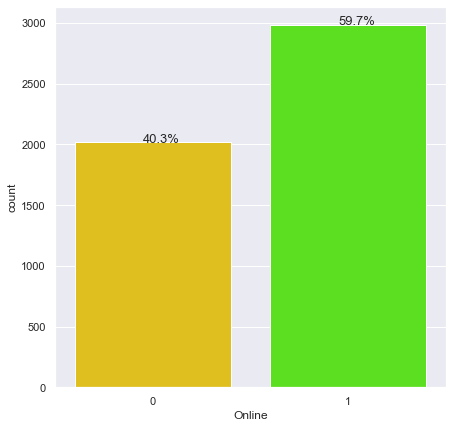
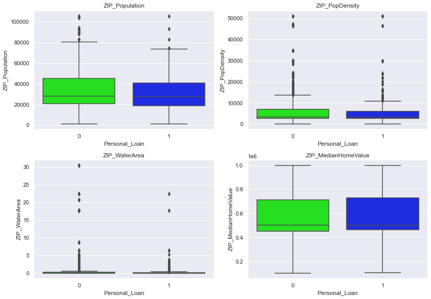
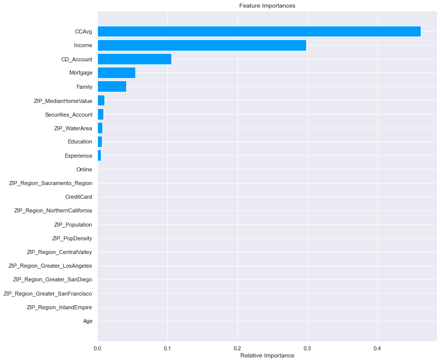

# <span style='color:#ffd400'> Background </span>  
AllLife Bank is a US bank that has a growing customer base. The majority of these customers are liability customers (depositors) with varying sizes of deposits. The number of customers who are also borrowers (asset customers) is quite small, and the bank is interested in expanding this base rapidly to bring in more loan business and in the process, earn more through the interest on loans. In particular, the management wants to explore ways of converting its liability customers to personal loan customers (while retaining them as depositors).

A campaign that the bank ran last year for liability customers showed a healthy conversion rate of over 9% success. This has encouraged the retail marketing department to devise campaigns with better target marketing to increase the success ratio.

The purpose of this project is to build a model that will help the marketing department to identify the potential customers who have a higher probability of purchasing the loan.

# <span style='color:#ffd400'> Objective </span>   

1. Predict whether a liability customer will buy a personal loan or not.
2. Identify which variables are most significant.
3. Identify which segment of customers should be targeted more.

# <span style='color:#ffd400'> Data Dictionary </span>

* ID: Customer ID
* Age: Customer’s age in completed years
* Experience: #years of professional experience
* Income: Annual income of the customer (in thousand dollars)
* ZIP Code: Home Address ZIP code.
* Family: the Family size of the customer
* CCAvg: Average spending on credit cards per month (in thousand dollars)
* Education: Education Level. 1: Undergrad; 2: Graduate;3: Advanced/Professional
* Mortgage: Value of house mortgage if any. (in thousand dollars)
* Personal_Loan: Did this customer accept the personal loan offered in the last campaign?
* Securities_Account: Does the customer have securities account with the bank?
* CD_Account: Does the customer have a certificate of deposit (CD) account with the bank?
* Online: Do customers use internet banking facilities?
* CreditCard: Does the customer use a credit card issued by any other Bank (excluding All life Bank)?

***

# <span style='color:#009dff'> Notebook Setup </span>
In this section:
* Import libraries and adjust settings
* Import the dataset
* Get an initial understanding of the dataset by looking at its shape, viewing some rows, and viewing a summary of the data


```python
# import necessary libraries

# libraries for reading and manipulating data
import numpy as np
import pandas as pd
pd.set_option('display.max_rows', None)
pd.set_option('display.max_columns', None)

# libraries for visualization
import matplotlib.pyplot as plt 
%matplotlib inline
import seaborn as sns
sns.set(color_codes=True)

# to build linear model for statistical analysis and prediction
import statsmodels.stats.api as sms
from statsmodels.stats.outliers_influence import variance_inflation_factor
import statsmodels.api as sm
from statsmodels.tools.tools import add_constant

# to split data
from sklearn.model_selection import train_test_split

# to build sklearn model
from sklearn.linear_model import LogisticRegression
from sklearn.metrics import confusion_matrix, classification_report
from sklearn.metrics import f1_score,accuracy_score, recall_score, precision_score, roc_auc_score, roc_curve, confusion_matrix, precision_recall_curve
from sklearn import metrics

# to build sklearn decision tree model
from sklearn.tree import DecisionTreeClassifier
from sklearn import tree
from sklearn.model_selection import GridSearchCV

# to perform sklearn misclassification analysis
from sklearn.svm import LinearSVC

import scipy.stats as stats
```


```python
# ignore warnings
import warnings
warnings.filterwarnings('ignore')
```


```python
# set seaborn color palette
sns.set_palette(palette='hsv')
```

### Import the dataset


```python
# import the dataset and create a working copy
data = pd.read_csv('Loan_Modelling.csv')
loan = data.copy()
```

###  View the shape of the dataset


```python
# display the shape using an f-string
print(f'There are {loan.shape[0]} rows and {loan.shape[1]} columns.')
```

    There are 5000 rows and 14 columns.


### View some rows of the dataset


```python
# look at the first five rows
loan.head()
```


<div>
<style scoped>
    .dataframe tbody tr th:only-of-type {
        vertical-align: middle;
    }

    .dataframe tbody tr th {
        vertical-align: top;
    }

    .dataframe thead th {
        text-align: right;
    }
</style>
<table border="1" class="dataframe">
  <thead>
    <tr style="text-align: right;">
      <th></th>
      <th>ID</th>
      <th>Age</th>
      <th>Experience</th>
      <th>Income</th>
      <th>ZIPCode</th>
      <th>Family</th>
      <th>CCAvg</th>
      <th>Education</th>
      <th>Mortgage</th>
      <th>Personal_Loan</th>
      <th>Securities_Account</th>
      <th>CD_Account</th>
      <th>Online</th>
      <th>CreditCard</th>
    </tr>
  </thead>
  <tbody>
    <tr>
      <th>0</th>
      <td>1</td>
      <td>25</td>
      <td>1</td>
      <td>49</td>
      <td>91107</td>
      <td>4</td>
      <td>1.6</td>
      <td>1</td>
      <td>0</td>
      <td>0</td>
      <td>1</td>
      <td>0</td>
      <td>0</td>
      <td>0</td>
    </tr>
    <tr>
      <th>1</th>
      <td>2</td>
      <td>45</td>
      <td>19</td>
      <td>34</td>
      <td>90089</td>
      <td>3</td>
      <td>1.5</td>
      <td>1</td>
      <td>0</td>
      <td>0</td>
      <td>1</td>
      <td>0</td>
      <td>0</td>
      <td>0</td>
    </tr>
    <tr>
      <th>2</th>
      <td>3</td>
      <td>39</td>
      <td>15</td>
      <td>11</td>
      <td>94720</td>
      <td>1</td>
      <td>1.0</td>
      <td>1</td>
      <td>0</td>
      <td>0</td>
      <td>0</td>
      <td>0</td>
      <td>0</td>
      <td>0</td>
    </tr>
    <tr>
      <th>3</th>
      <td>4</td>
      <td>35</td>
      <td>9</td>
      <td>100</td>
      <td>94112</td>
      <td>1</td>
      <td>2.7</td>
      <td>2</td>
      <td>0</td>
      <td>0</td>
      <td>0</td>
      <td>0</td>
      <td>0</td>
      <td>0</td>
    </tr>
    <tr>
      <th>4</th>
      <td>5</td>
      <td>35</td>
      <td>8</td>
      <td>45</td>
      <td>91330</td>
      <td>4</td>
      <td>1.0</td>
      <td>2</td>
      <td>0</td>
      <td>0</td>
      <td>0</td>
      <td>0</td>
      <td>0</td>
      <td>1</td>
    </tr>
  </tbody>
</table>
</div>


```python
# look at five random rows
# set random seed so we see the same random results every time
np.random.seed(1)
loan.sample(n=5)
```


<div>
<style scoped>
    .dataframe tbody tr th:only-of-type {
        vertical-align: middle;
    }

    .dataframe tbody tr th {
        vertical-align: top;
    }

    .dataframe thead th {
        text-align: right;
    }
</style>
<table border="1" class="dataframe">
  <thead>
    <tr style="text-align: right;">
      <th></th>
      <th>ID</th>
      <th>Age</th>
      <th>Experience</th>
      <th>Income</th>
      <th>ZIPCode</th>
      <th>Family</th>
      <th>CCAvg</th>
      <th>Education</th>
      <th>Mortgage</th>
      <th>Personal_Loan</th>
      <th>Securities_Account</th>
      <th>CD_Account</th>
      <th>Online</th>
      <th>CreditCard</th>
    </tr>
  </thead>
  <tbody>
    <tr>
      <th>2764</th>
      <td>2765</td>
      <td>31</td>
      <td>5</td>
      <td>84</td>
      <td>91320</td>
      <td>1</td>
      <td>2.9</td>
      <td>3</td>
      <td>105</td>
      <td>0</td>
      <td>0</td>
      <td>0</td>
      <td>0</td>
      <td>1</td>
    </tr>
    <tr>
      <th>4767</th>
      <td>4768</td>
      <td>35</td>
      <td>9</td>
      <td>45</td>
      <td>90639</td>
      <td>3</td>
      <td>0.9</td>
      <td>1</td>
      <td>101</td>
      <td>0</td>
      <td>1</td>
      <td>0</td>
      <td>0</td>
      <td>0</td>
    </tr>
    <tr>
      <th>3814</th>
      <td>3815</td>
      <td>34</td>
      <td>9</td>
      <td>35</td>
      <td>94304</td>
      <td>3</td>
      <td>1.3</td>
      <td>1</td>
      <td>0</td>
      <td>0</td>
      <td>0</td>
      <td>0</td>
      <td>0</td>
      <td>0</td>
    </tr>
    <tr>
      <th>3499</th>
      <td>3500</td>
      <td>49</td>
      <td>23</td>
      <td>114</td>
      <td>94550</td>
      <td>1</td>
      <td>0.3</td>
      <td>1</td>
      <td>286</td>
      <td>0</td>
      <td>0</td>
      <td>0</td>
      <td>1</td>
      <td>0</td>
    </tr>
    <tr>
      <th>2735</th>
      <td>2736</td>
      <td>36</td>
      <td>12</td>
      <td>70</td>
      <td>92131</td>
      <td>3</td>
      <td>2.6</td>
      <td>2</td>
      <td>165</td>
      <td>0</td>
      <td>0</td>
      <td>0</td>
      <td>1</td>
      <td>0</td>
    </tr>
  </tbody>
</table>
</div>


```python
# look at the last five rows
loan.tail()
```


<div>
<style scoped>
    .dataframe tbody tr th:only-of-type {
        vertical-align: middle;
    }

    .dataframe tbody tr th {
        vertical-align: top;
    }

    .dataframe thead th {
        text-align: right;
    }
</style>
<table border="1" class="dataframe">
  <thead>
    <tr style="text-align: right;">
      <th></th>
      <th>ID</th>
      <th>Age</th>
      <th>Experience</th>
      <th>Income</th>
      <th>ZIPCode</th>
      <th>Family</th>
      <th>CCAvg</th>
      <th>Education</th>
      <th>Mortgage</th>
      <th>Personal_Loan</th>
      <th>Securities_Account</th>
      <th>CD_Account</th>
      <th>Online</th>
      <th>CreditCard</th>
    </tr>
  </thead>
  <tbody>
    <tr>
      <th>4995</th>
      <td>4996</td>
      <td>29</td>
      <td>3</td>
      <td>40</td>
      <td>92697</td>
      <td>1</td>
      <td>1.9</td>
      <td>3</td>
      <td>0</td>
      <td>0</td>
      <td>0</td>
      <td>0</td>
      <td>1</td>
      <td>0</td>
    </tr>
    <tr>
      <th>4996</th>
      <td>4997</td>
      <td>30</td>
      <td>4</td>
      <td>15</td>
      <td>92037</td>
      <td>4</td>
      <td>0.4</td>
      <td>1</td>
      <td>85</td>
      <td>0</td>
      <td>0</td>
      <td>0</td>
      <td>1</td>
      <td>0</td>
    </tr>
    <tr>
      <th>4997</th>
      <td>4998</td>
      <td>63</td>
      <td>39</td>
      <td>24</td>
      <td>93023</td>
      <td>2</td>
      <td>0.3</td>
      <td>3</td>
      <td>0</td>
      <td>0</td>
      <td>0</td>
      <td>0</td>
      <td>0</td>
      <td>0</td>
    </tr>
    <tr>
      <th>4998</th>
      <td>4999</td>
      <td>65</td>
      <td>40</td>
      <td>49</td>
      <td>90034</td>
      <td>3</td>
      <td>0.5</td>
      <td>2</td>
      <td>0</td>
      <td>0</td>
      <td>0</td>
      <td>0</td>
      <td>1</td>
      <td>0</td>
    </tr>
    <tr>
      <th>4999</th>
      <td>5000</td>
      <td>28</td>
      <td>4</td>
      <td>83</td>
      <td>92612</td>
      <td>3</td>
      <td>0.8</td>
      <td>1</td>
      <td>0</td>
      <td>0</td>
      <td>0</td>
      <td>0</td>
      <td>1</td>
      <td>1</td>
    </tr>
  </tbody>
</table>
</div>


### Summary of the data


```python
loan.describe(include='all').T
```


<div>
<style scoped>
    .dataframe tbody tr th:only-of-type {
        vertical-align: middle;
    }

    .dataframe tbody tr th {
        vertical-align: top;
    }

    .dataframe thead th {
        text-align: right;
    }
</style>
<table border="1" class="dataframe">
  <thead>
    <tr style="text-align: right;">
      <th></th>
      <th>count</th>
      <th>mean</th>
      <th>std</th>
      <th>min</th>
      <th>25%</th>
      <th>50%</th>
      <th>75%</th>
      <th>max</th>
    </tr>
  </thead>
  <tbody>
    <tr>
      <th>ID</th>
      <td>5000.0</td>
      <td>2500.500000</td>
      <td>1443.520003</td>
      <td>1.0</td>
      <td>1250.75</td>
      <td>2500.5</td>
      <td>3750.25</td>
      <td>5000.0</td>
    </tr>
    <tr>
      <th>Age</th>
      <td>5000.0</td>
      <td>45.338400</td>
      <td>11.463166</td>
      <td>23.0</td>
      <td>35.00</td>
      <td>45.0</td>
      <td>55.00</td>
      <td>67.0</td>
    </tr>
    <tr>
      <th>Experience</th>
      <td>5000.0</td>
      <td>20.104600</td>
      <td>11.467954</td>
      <td>-3.0</td>
      <td>10.00</td>
      <td>20.0</td>
      <td>30.00</td>
      <td>43.0</td>
    </tr>
    <tr>
      <th>Income</th>
      <td>5000.0</td>
      <td>73.774200</td>
      <td>46.033729</td>
      <td>8.0</td>
      <td>39.00</td>
      <td>64.0</td>
      <td>98.00</td>
      <td>224.0</td>
    </tr>
    <tr>
      <th>ZIPCode</th>
      <td>5000.0</td>
      <td>93169.257000</td>
      <td>1759.455086</td>
      <td>90005.0</td>
      <td>91911.00</td>
      <td>93437.0</td>
      <td>94608.00</td>
      <td>96651.0</td>
    </tr>
    <tr>
      <th>Family</th>
      <td>5000.0</td>
      <td>2.396400</td>
      <td>1.147663</td>
      <td>1.0</td>
      <td>1.00</td>
      <td>2.0</td>
      <td>3.00</td>
      <td>4.0</td>
    </tr>
    <tr>
      <th>CCAvg</th>
      <td>5000.0</td>
      <td>1.937938</td>
      <td>1.747659</td>
      <td>0.0</td>
      <td>0.70</td>
      <td>1.5</td>
      <td>2.50</td>
      <td>10.0</td>
    </tr>
    <tr>
      <th>Education</th>
      <td>5000.0</td>
      <td>1.881000</td>
      <td>0.839869</td>
      <td>1.0</td>
      <td>1.00</td>
      <td>2.0</td>
      <td>3.00</td>
      <td>3.0</td>
    </tr>
    <tr>
      <th>Mortgage</th>
      <td>5000.0</td>
      <td>56.498800</td>
      <td>101.713802</td>
      <td>0.0</td>
      <td>0.00</td>
      <td>0.0</td>
      <td>101.00</td>
      <td>635.0</td>
    </tr>
    <tr>
      <th>Personal_Loan</th>
      <td>5000.0</td>
      <td>0.096000</td>
      <td>0.294621</td>
      <td>0.0</td>
      <td>0.00</td>
      <td>0.0</td>
      <td>0.00</td>
      <td>1.0</td>
    </tr>
    <tr>
      <th>Securities_Account</th>
      <td>5000.0</td>
      <td>0.104400</td>
      <td>0.305809</td>
      <td>0.0</td>
      <td>0.00</td>
      <td>0.0</td>
      <td>0.00</td>
      <td>1.0</td>
    </tr>
    <tr>
      <th>CD_Account</th>
      <td>5000.0</td>
      <td>0.060400</td>
      <td>0.238250</td>
      <td>0.0</td>
      <td>0.00</td>
      <td>0.0</td>
      <td>0.00</td>
      <td>1.0</td>
    </tr>
    <tr>
      <th>Online</th>
      <td>5000.0</td>
      <td>0.596800</td>
      <td>0.490589</td>
      <td>0.0</td>
      <td>0.00</td>
      <td>1.0</td>
      <td>1.00</td>
      <td>1.0</td>
    </tr>
    <tr>
      <th>CreditCard</th>
      <td>5000.0</td>
      <td>0.294000</td>
      <td>0.455637</td>
      <td>0.0</td>
      <td>0.00</td>
      <td>0.0</td>
      <td>1.00</td>
      <td>1.0</td>
    </tr>
  </tbody>
</table>
</div>


* The ID column is just a unique identifier for each row, which doesn't seem useful to us. I will probably drop this row.
* ZIP Codes aren't really a number (because there isn't a mathematical relationship between different zip codes), so looking at the values listed here doesn't give us any insight.
* The minimum value in experience is -3, which doesn't make sense. I'll have to fix this.

***
# <span style='color:#009dff'> Data Pre-Processing </span>
In this section:
* Prepare the data for analysis
* Treat missing and incorrect values
* Fix data types
* Feature engineering

### Check for missing values


```python
# look at which columns have the most missing values
loan.isnull().sum().sort_values(ascending=False)
```


    CreditCard            0
    Online                0
    CD_Account            0
    Securities_Account    0
    Personal_Loan         0
    Mortgage              0
    Education             0
    CCAvg                 0
    Family                0
    ZIPCode               0
    Income                0
    Experience            0
    Age                   0
    ID                    0
    dtype: int64


* There are no missing values in our dataset

### Check the data types for each column


```python
# show the datatypes
loan.info()
```

    <class 'pandas.core.frame.DataFrame'>
    RangeIndex: 5000 entries, 0 to 4999
    Data columns (total 14 columns):
     #   Column              Non-Null Count  Dtype  
    ---  ------              --------------  -----  
     0   ID                  5000 non-null   int64  
     1   Age                 5000 non-null   int64  
     2   Experience          5000 non-null   int64  
     3   Income              5000 non-null   int64  
     4   ZIPCode             5000 non-null   int64  
     5   Family              5000 non-null   int64  
     6   CCAvg               5000 non-null   float64
     7   Education           5000 non-null   int64  
     8   Mortgage            5000 non-null   int64  
     9   Personal_Loan       5000 non-null   int64  
     10  Securities_Account  5000 non-null   int64  
     11  CD_Account          5000 non-null   int64  
     12  Online              5000 non-null   int64  
     13  CreditCard          5000 non-null   int64  
    dtypes: float64(1), int64(13)
    memory usage: 547.0 KB


* All of the columns are integers, except for CCAvg which is a float
* We will check for missing values later, but it is a good sign that all of the columns have the same number (5000) of non-null values


```python
# look at the number of unique values in each column
loan.nunique().sort_values()
```


    Personal_Loan            2
    Securities_Account       2
    CD_Account               2
    Online                   2
    CreditCard               2
    Education                3
    Family                   4
    Age                     45
    Experience              47
    CCAvg                  108
    Income                 162
    Mortgage               347
    ZIPCode                467
    ID                    5000
    dtype: int64


* Five of our columns only have two unique values, so I can change these to booleans to save space
* There are unique ID rows for every row, so I can drop this row

### Drop columns that do not help


```python
# drop ID column as it doesn't give us any useful data
loan.drop(['ID'],axis=1,inplace=True)
```

### Look at value counts to check for incorrect or garbage values


```python
# show value counts for Personal_Loan
print(loan.Personal_Loan.value_counts())
```

    0    4520
    1     480
    Name: Personal_Loan, dtype: int64


```python
# show value counts for Securities_Account
print(loan.Securities_Account.value_counts())
```

    0    4478
    1     522
    Name: Securities_Account, dtype: int64


```python
# show value counts for CD_Account
print(loan.CD_Account.value_counts())
```

    0    4698
    1     302
    Name: CD_Account, dtype: int64


```python
# show value counts for Online
print(loan.Online.value_counts())
```

    1    2984
    0    2016
    Name: Online, dtype: int64


```python
# show value counts for CD_Account
print(loan.CD_Account.value_counts())
```

    0    4698
    1     302
    Name: CD_Account, dtype: int64


```python
# show value counts for CreditCard
print(loan.CreditCard.value_counts())
```

    0    3530
    1    1470
    Name: CreditCard, dtype: int64


```python
# show value counts for Family
print(loan.Family.value_counts())
```

    1    1472
    2    1296
    4    1222
    3    1010
    Name: Family, dtype: int64


```python
# show value counts for Age
print(loan.Age.value_counts())
```

    35    151
    43    149
    52    145
    58    143
    54    143
    50    138
    41    136
    30    136
    56    135
    34    134
    39    133
    59    132
    57    132
    51    129
    60    127
    45    127
    46    127
    42    126
    40    125
    31    125
    55    125
    62    123
    29    123
    61    122
    44    121
    32    120
    33    120
    48    118
    38    115
    49    115
    47    113
    53    112
    63    108
    36    107
    37    106
    28    103
    27     91
    65     80
    64     78
    26     78
    25     53
    24     28
    66     24
    23     12
    67     12
    Name: Age, dtype: int64


```python
# show value counts for Experience
print(loan.Experience.value_counts())
```

     32    154
     20    148
     9     147
     5     146
     23    144
     35    143
     25    142
     28    138
     18    137
     19    135
     26    134
     24    131
     3     129
     14    127
     16    127
     30    126
     34    125
     27    125
     17    125
     29    124
     22    124
     7     121
     8     119
     6     119
     15    119
     10    118
     33    117
     13    117
     11    116
     37    116
     36    114
     21    113
     4     113
     31    104
     12    102
     38     88
     39     85
     2      85
     1      74
     0      66
     40     57
     41     43
    -1      33
    -2      15
     42      8
    -3       4
     43      3
    Name: Experience, dtype: int64


```python
# show value counts for CCAvg
print(loan.CCAvg.value_counts())
```

    0.30     241
    1.00     231
    0.20     204
    2.00     188
    0.80     187
    0.10     183
    0.40     179
    1.50     178
    0.70     169
    0.50     163
    1.70     158
    1.80     152
    1.40     136
    2.20     130
    1.30     128
    0.60     118
    2.80     110
    2.50     107
    0.90     106
    0.00     106
    1.90     106
    1.60     101
    2.10     100
    2.40      92
    2.60      87
    1.10      84
    1.20      66
    2.70      58
    2.30      58
    2.90      54
    3.00      53
    3.30      45
    3.80      43
    3.40      39
    2.67      36
    4.00      33
    4.50      29
    3.90      27
    3.60      27
    4.30      26
    6.00      26
    3.70      25
    4.70      24
    3.20      22
    4.10      22
    4.90      22
    3.10      20
    6.50      18
    5.00      18
    5.40      18
    0.67      18
    2.33      18
    1.67      18
    4.40      17
    5.20      16
    3.50      15
    6.90      14
    7.00      14
    6.10      14
    4.60      14
    7.20      13
    5.70      13
    7.40      13
    6.30      13
    7.50      12
    8.00      12
    4.20      11
    6.33      10
    6.80      10
    8.10      10
    7.30      10
    0.75       9
    1.75       9
    6.67       9
    4.33       9
    7.60       9
    6.70       9
    1.33       9
    8.80       9
    7.80       9
    8.60       8
    4.80       7
    5.60       7
    5.10       6
    5.90       5
    7.90       4
    5.30       4
    6.60       4
    5.50       4
    5.80       3
    10.00      3
    6.40       3
    4.75       2
    8.50       2
    4.25       2
    8.30       2
    5.67       2
    6.20       2
    9.00       2
    3.33       1
    8.90       1
    4.67       1
    3.25       1
    2.75       1
    8.20       1
    9.30       1
    3.67       1
    5.33       1
    Name: CCAvg, dtype: int64


```python
# show value counts for Income
print(loan.Income.value_counts())
```

    44     85
    38     84
    81     83
    41     82
    39     81
    40     78
    42     77
    83     74
    43     70
    45     69
    29     67
    21     65
    35     65
    22     65
    85     65
    25     64
    84     63
    28     63
    30     63
    55     61
    82     61
    78     61
    65     60
    64     60
    32     58
    61     57
    53     57
    80     56
    58     55
    62     55
    31     55
    23     54
    34     53
    18     53
    59     53
    79     53
    54     52
    19     52
    49     52
    60     52
    33     51
    70     47
    52     47
    20     47
    24     47
    75     47
    69     46
    63     46
    50     45
    74     45
    48     44
    73     44
    71     43
    51     41
    72     41
    90     38
    91     37
    93     37
    68     35
    113    34
    89     34
    15     33
    13     32
    14     31
    12     30
    114    30
    92     29
    98     28
    115    27
    11     27
    94     26
    9      26
    112    26
    88     26
    95     25
    141    24
    101    24
    99     24
    128    24
    122    24
    125    23
    129    23
    145    23
    8      23
    10     23
    111    22
    154    21
    134    20
    104    20
    149    20
    105    20
    121    20
    140    19
    130    19
    131    19
    118    19
    110    19
    155    19
    119    18
    123    18
    138    18
    135    18
    180    18
    103    18
    158    18
    132    18
    109    18
    120    17
    179    17
    102    16
    108    16
    139    16
    161    16
    195    15
    152    15
    133    15
    142    15
    191    13
    173    13
    182    13
    164    13
    184    12
    170    12
    124    12
    160    12
    183    12
    175    12
    190    11
    172    11
    150    11
    165    11
    148    11
    153    11
    100    10
    162    10
    188    10
    178    10
    163     9
    143     9
    185     9
    174     9
    171     9
    181     8
    194     8
    168     8
    144     7
    169     7
    159     7
    193     6
    192     6
    201     5
    151     4
    200     3
    198     3
    204     3
    199     3
    203     2
    189     2
    202     2
    205     2
    224     1
    218     1
    Name: Income, dtype: int64


```python
# show value counts for Mortgage
print(loan.Mortgage.value_counts())
```

    0      3462
    98       17
    103      16
    119      16
    83       16
    91       16
    89       16
    90       15
    102      15
    78       15
    118      14
    101      14
    87       14
    94       14
    131      14
    104      14
    109      13
    106      13
    116      13
    144      13
    112      13
    81       13
    185      12
    76       12
    120      12
    97       12
    121      12
    100      12
    158      11
    184      11
    95       11
    111      11
    86       11
    137      11
    79       11
    84       11
    153      11
    115      11
    161      10
    82       10
    135      10
    151      10
    117      10
    113      10
    142      10
    108      10
    149       9
    166       9
    159       9
    88        9
    167       9
    123       9
    221       9
    128       9
    146       9
    148       9
    110       8
    138       8
    170       8
    174       8
    122       8
    75        8
    218       8
    194       8
    114       8
    147       8
    157       8
    105       8
    169       8
    207       8
    205       8
    132       8
    140       8
    164       8
    204       7
    249       7
    129       7
    126       7
    219       7
    154       7
    124       7
    85        7
    96        7
    80        7
    196       7
    230       7
    229       7
    127       7
    193       7
    107       6
    251       6
    130       6
    136       6
    99        6
    125       6
    236       6
    141       6
    145       6
    240       6
    150       6
    187       6
    163       6
    182       6
    192       6
    155       6
    134       6
    294       5
    171       5
    256       5
    178       5
    198       5
    301       5
    180       5
    307       5
    172       5
    188       5
    272       5
    227       5
    156       5
    209       5
    212       5
    220       5
    217       5
    93        4
    162       4
    241       4
    189       4
    181       4
    297       4
    190       4
    245       4
    77        4
    247       4
    211       4
    232       4
    199       4
    224       4
    244       4
    342       4
    152       4
    179       4
    175       4
    203       4
    231       4
    139       4
    200       4
    92        4
    223       3
    352       3
    328       3
    308       3
    177       3
    197       3
    239       3
    165       3
    215       3
    226       3
    255       3
    160       3
    380       3
    400       3
    341       3
    143       3
    333       3
    329       3
    325       3
    428       3
    257       3
    305       3
    176       3
    168       3
    213       3
    263       3
    248       3
    310       3
    214       3
    260       3
    264       3
    238       3
    242       3
    186       3
    327       3
    323       3
    270       3
    319       3
    282       3
    285       3
    315       3
    277       3
    133       3
    228       3
    268       3
    275       3
    422       3
    366       3
    216       3
    208       3
    427       2
    243       2
    267       2
    455       2
    271       2
    303       2
    359       2
    299       2
    233       2
    287       2
    225       2
    183       2
    201       2
    259       2
    222       2
    289       2
    312       2
    292       2
    280       2
    276       2
    442       2
    402       2
    394       2
    358       2
    354       2
    330       2
    322       2
    314       2
    306       2
    252       2
    266       2
    262       2
    250       2
    246       2
    234       2
    202       2
    565       2
    304       2
    392       2
    364       2
    293       2
    309       2
    313       2
    357       2
    372       2
    397       2
    368       2
    408       2
    437       2
    449       2
    360       1
    416       1
    432       1
    452       1
    464       1
    508       1
    496       1
    300       1
    412       1
    284       1
    500       1
    524       1
    296       1
    396       1
    344       1
    336       1
    635       1
    612       1
    283       1
    195       1
    191       1
    590       1
    582       1
    550       1
    522       1
    470       1
    466       1
    458       1
    446       1
    410       1
    406       1
    398       1
    382       1
    378       1
    374       1
    334       1
    235       1
    295       1
    318       1
    311       1
    571       1
    567       1
    547       1
    535       1
    483       1
    475       1
    467       1
    431       1
    419       1
    415       1
    403       1
    391       1
    383       1
    355       1
    351       1
    343       1
    331       1
    326       1
    302       1
    173       1
    461       1
    429       1
    421       1
    405       1
    389       1
    385       1
    381       1
    373       1
    361       1
    353       1
    345       1
    337       1
    321       1
    281       1
    273       1
    265       1
    253       1
    237       1
    433       1
    477       1
    298       1
    481       1
    290       1
    286       1
    278       1
    258       1
    210       1
    206       1
    617       1
    601       1
    589       1
    581       1
    587       1
    569       1
    553       1
    541       1
    509       1
    505       1
    485       1
    577       1
    Name: Mortgage, dtype: int64


```python
# show value counts for ZIPCode
print(loan.ZIPCode.value_counts())
```

    94720    169
    94305    127
    95616    116
    90095     71
    93106     57
    93943     54
    92037     54
    91320     53
    94025     52
    91711     52
    92093     51
    90245     50
    90024     50
    91330     46
    90089     46
    94304     45
    92121     45
    94143     37
    95051     34
    94608     34
    92028     32
    92521     32
    92182     32
    95054     31
    95814     30
    95014     29
    94542     27
    94301     27
    94550     27
    95819     26
    95064     26
    95039     26
    93407     26
    94501     26
    94303     25
    91107     25
    95060     25
    94022     25
    94105     25
    93117     24
    94596     24
    93555     23
    94080     23
    95521     23
    92717     22
    92612     22
    91380     22
    91768     21
    94110     21
    92647     21
    90401     20
    94132     20
    94117     20
    90034     20
    90025     19
    92697     19
    94005     19
    92122     19
    95747     19
    90266     19
    94122     18
    90291     18
    92130     18
    93940     18
    90840     18
    94709     18
    94309     18
    93023     17
    94583     17
    92407     17
    92691     17
    92096     17
    92009     17
    90630     17
    91311     17
    90740     17
    92120     17
    92780     16
    95136     16
    92677     16
    94539     16
    92126     16
    90277     16
    91604     15
    95929     15
    94115     15
    94588     15
    92354     15
    94928     15
    95134     15
    94061     15
    92152     14
    92507     14
    94545     14
    90064     14
    94920     14
    95020     14
    94590     14
    94111     14
    94609     13
    92103     13
    94704     13
    92007     13
    92064     13
    92115     13
    95762     13
    94611     13
    93955     12
    93108     12
    94063     12
    95133     12
    95670     12
    95818     12
    94701     12
    91775     12
    94109     12
    91355     12
    94402     12
    95053     12
    94024     11
    92831     11
    92008     11
    95827     11
    94306     11
    95008     11
    90210     11
    92110     11
    93109     11
    92123     11
    94801     11
    95035     11
    94112     11
    95032     10
    91902     10
    93907     10
    94706     10
    91605     10
    94035     10
    94998     10
    90717     10
    90041     10
    92870     10
    93014     10
    92373     10
    90405     10
    92646     10
    93305     10
    94065     10
    91304     10
    92374     10
    94010     10
    94086     10
    95630     10
    91360     10
    92173     10
    94710      9
    95120      9
    91125      9
    90250      9
    91103      9
    91335      9
    95605      9
    96001      9
    94102      9
    92806      9
    91302      9
    92660      9
    91910      9
    95023      9
    93711      9
    95123      9
    90049      9
    90033      9
    95351      9
    94131      9
    91016      8
    95833      8
    90032      8
    90065      8
    90212      8
    92104      8
    91101      8
    90028      8
    95831      8
    92672      8
    90009      8
    92821      8
    90503      8
    92626      8
    92866      8
    94104      8
    93561      8
    92101      8
    92630      8
    93105      8
    90747      8
    94591      8
    91105      7
    94607      7
    95006      7
    95370      7
    94085      7
    92124      7
    90254      7
    92220      7
    95138      7
    95211      7
    94551      7
    93101      7
    94708      7
    92131      7
    92675      7
    91950      7
    92038      7
    91423      7
    94534      7
    93010      7
    94123      7
    92606      7
    92333      7
    95112      7
    94015      7
    95821      7
    91763      7
    95841      7
    93118      7
    94002      7
    90036      7
    94114      7
    92709      7
    92807      7
    91942      7
    94234      7
    94523      6
    91401      6
    95503      6
    91709      6
    91745      6
    94949      6
    91741      6
    94610      6
    94606      6
    91365      6
    94538      6
    91301      6
    94043      6
    96651      6
    95207      6
    94546      6
    94707      6
    90504      6
    90073      6
    94553      6
    94521      6
    91040      6
    92704      6
    94923      6
    92868      6
    91765      6
    92346      6
    91911      6
    93727      6
    92056      6
    90066      6
    92109      6
    90058      6
    90007      6
    90230      6
    91367      6
    91116      6
    94960      6
    90035      6
    95449      6
    95621      6
    91706      6
    90071      6
    94904      6
    95812      6
    92029      6
    90502      6
    94040      6
    95126      6
    91730      6
    96003      6
    94066      5
    92634      5
    93950      5
    95817      5
    95822      5
    91007      5
    92068      5
    90509      5
    95617      5
    94555      5
    90019      5
    93022      5
    90404      5
    94901      5
    93302      5
    90232      5
    95045      5
    91203      5
    92325      5
    92192      5
    93437      5
    93065      5
    94612      5
    94124      5
    93107      5
    91006      5
    90274      5
    90720      5
    91754      5
    91770      5
    92867      5
    96064      5
    93524      5
    93460      5
    95403      5
    90005      5
    91109      5
    93611      5
    90638      5
    90029      5
    92054      5
    92154      5
    90037      5
    94939      5
    95070      5
    94107      5
    92703      5
    92129      4
    95741      4
    93003      4
    96150      4
    91030      4
    95354      4
    90048      4
    95348      4
    95825      4
    95758      4
    91791      4
    95973      4
    94126      4
    95678      4
    94118      4
    93401      4
    94536      4
    91342      4
    94302      4
    92735      4
    95422      4
    90018      4
    95828      4
    95125      4
    92624      4
    94705      4
    90639      4
    94571      4
    93009      4
    94577      4
    91361      4
    92886      4
    95010      4
    91614      4
    95820      4
    94028      4
    90601      4
    96091      4
    95003      4
    92653      4
    94108      4
    90059      4
    92350      4
    92833      4
    92084      4
    92069      4
    92648      4
    92177      3
    94558      3
    92661      3
    94806      3
    94618      3
    90640      3
    92673      3
    94566      3
    90086      3
    92843      3
    92834      3
    91345      3
    93720      3
    91773      3
    91801      3
    90755      3
    92614      3
    92251      3
    92518      3
    92399      3
    90650      3
    92835      3
    90275      3
    95518      3
    93063      3
    93111      3
    95192      3
    93311      3
    92106      3
    93403      3
    91710      3
    90057      3
    90045      3
    96008      3
    95135      3
    92692      3
    93657      3
    93933      3
    91343      3
    92024      3
    90011      3
    90027      3
    94703      3
    90505      3
    94803      3
    95131      3
    94509      2
    95005      2
    90272      2
    91207      2
    95405      2
    95193      2
    90623      2
    90280      2
    95037      2
    90304      2
    90016      2
    90044      2
    94526      2
    95482      2
    92161      2
    94575      2
    94507      2
    92116      2
    96094      2
    93033      2
    94019      2
    91129      2
    95307      2
    91784      2
    91941      2
    94116      2
    95842      2
    94604      2
    92705      2
    91326      2
    95816      2
    90745      2
    96145      1
    90068      1
    94087      1
    93077      1
    91024      1
    90813      1
    94970      1
    92694      1
    94404      1
    94598      1
    94965      1
    Name: ZIPCode, dtype: int64


### Treat Incorrect Values

* Years of experience: there are some values with -1, -2, or -3. I'm going to change these to 1, 2, or 3 years respectively.
* I do not see any other incorrect or garbage values


```python
# use abs() function to remove negative values from the Experience column
loan['Experience'] = abs(loan.Experience)
```

### Feature Engineering
I'm going to use the ZIPCode column to bring in more information


```python
# This package helps create new features by looking up ZIP codes

# Use this to install uszipcode package (uncomment the below line to install)
# pip install uszipcode

# Use this to update uszipcode package (uncomment the below line to run)
# pip install --upgrade uszipcode

from uszipcode import SearchEngine, SimpleZipcode, Zipcode
search = SearchEngine(simple_zipcode=False)
```


```python
# create a new column from ZIPCodes that corresponds to the name of the city

def zip_city(x):
    city = search.by_zipcode(x).major_city
    return city if city else 'None'

loan['ZIP_City'] = loan['ZIPCode'].apply(zip_city)
```


```python
# create a new column from ZIPCodes that corresponds to the population of the ZIP code

def zip_pop(x):
    pop = search.by_zipcode(x).population
    return pop if pop else 0

loan['ZIP_Population'] = loan['ZIPCode'].apply(zip_pop)
```


```python
# create a new column from ZIPCodes that corresponds to the population density of the ZIP code

def zip_density(x):
    density = search.by_zipcode(x).population_density
    return density if density else 0

loan['ZIP_PopDensity'] = loan['ZIPCode'].apply(zip_density)
```


```python
# create a new column from ZIPCodes that corresponds to the water area of the ZIP code

def zip_water(x):
    water = search.by_zipcode(x).water_area_in_sqmi
    return water if water else 0

loan['ZIP_WaterArea'] = loan['ZIPCode'].apply(zip_water)
```


```python
# create a new column from ZIPCodes that corresponds to the number of median home value in the ZIP code

def zip_home_value(x):
    home_value = search.by_zipcode(x).median_home_value
    return home_value if home_value else 0

loan['ZIP_MedianHomeValue'] = loan['ZIPCode'].apply(zip_home_value)
```

### Clean up new data


```python
# check to see if there are null values in the new columns
loan.isnull().sum().sort_values(ascending=False)
```


    ZIP_MedianHomeValue    0
    ZIP_WaterArea          0
    Experience             0
    Income                 0
    ZIPCode                0
    Family                 0
    CCAvg                  0
    Education              0
    Mortgage               0
    Personal_Loan          0
    Securities_Account     0
    CD_Account             0
    Online                 0
    CreditCard             0
    ZIP_City               0
    ZIP_Population         0
    ZIP_PopDensity         0
    Age                    0
    dtype: int64


* We do not have any null values


```python
# remove spaces from city names
loan['ZIP_City'] = loan['ZIP_City'].str.replace(' ', '_')
```


```python
# look at the first rows of our new dataframe
loan.head()
```


<div>
<style scoped>
    .dataframe tbody tr th:only-of-type {
        vertical-align: middle;
    }

    .dataframe tbody tr th {
        vertical-align: top;
    }

    .dataframe thead th {
        text-align: right;
    }
</style>
<table border="1" class="dataframe">
  <thead>
    <tr style="text-align: right;">
      <th></th>
      <th>Age</th>
      <th>Experience</th>
      <th>Income</th>
      <th>ZIPCode</th>
      <th>Family</th>
      <th>CCAvg</th>
      <th>Education</th>
      <th>Mortgage</th>
      <th>Personal_Loan</th>
      <th>Securities_Account</th>
      <th>CD_Account</th>
      <th>Online</th>
      <th>CreditCard</th>
      <th>ZIP_City</th>
      <th>ZIP_Population</th>
      <th>ZIP_PopDensity</th>
      <th>ZIP_WaterArea</th>
      <th>ZIP_MedianHomeValue</th>
    </tr>
  </thead>
  <tbody>
    <tr>
      <th>0</th>
      <td>25</td>
      <td>1</td>
      <td>49</td>
      <td>91107</td>
      <td>4</td>
      <td>1.6</td>
      <td>1</td>
      <td>0</td>
      <td>0</td>
      <td>1</td>
      <td>0</td>
      <td>0</td>
      <td>0</td>
      <td>Pasadena</td>
      <td>32940</td>
      <td>4008.0</td>
      <td>0.08</td>
      <td>633100</td>
    </tr>
    <tr>
      <th>1</th>
      <td>45</td>
      <td>19</td>
      <td>34</td>
      <td>90089</td>
      <td>3</td>
      <td>1.5</td>
      <td>1</td>
      <td>0</td>
      <td>0</td>
      <td>1</td>
      <td>0</td>
      <td>0</td>
      <td>0</td>
      <td>Los_Angeles</td>
      <td>3217</td>
      <td>11218.0</td>
      <td>0.00</td>
      <td>0</td>
    </tr>
    <tr>
      <th>2</th>
      <td>39</td>
      <td>15</td>
      <td>11</td>
      <td>94720</td>
      <td>1</td>
      <td>1.0</td>
      <td>1</td>
      <td>0</td>
      <td>0</td>
      <td>0</td>
      <td>0</td>
      <td>0</td>
      <td>0</td>
      <td>Berkeley</td>
      <td>2964</td>
      <td>4761.0</td>
      <td>0.00</td>
      <td>0</td>
    </tr>
    <tr>
      <th>3</th>
      <td>35</td>
      <td>9</td>
      <td>100</td>
      <td>94112</td>
      <td>1</td>
      <td>2.7</td>
      <td>2</td>
      <td>0</td>
      <td>0</td>
      <td>0</td>
      <td>0</td>
      <td>0</td>
      <td>0</td>
      <td>San_Francisco</td>
      <td>79407</td>
      <td>23606.0</td>
      <td>0.00</td>
      <td>602400</td>
    </tr>
    <tr>
      <th>4</th>
      <td>35</td>
      <td>8</td>
      <td>45</td>
      <td>91330</td>
      <td>4</td>
      <td>1.0</td>
      <td>2</td>
      <td>0</td>
      <td>0</td>
      <td>0</td>
      <td>0</td>
      <td>0</td>
      <td>1</td>
      <td>Northridge</td>
      <td>2702</td>
      <td>7931.0</td>
      <td>0.00</td>
      <td>0</td>
    </tr>
  </tbody>
</table>
</div>


```python
# ZIP_MedianHomeValue is in dollar amount, but Income and CCAvg are in thousand dollars
# Make these all the same scale to help with visualization and modeling
loan['Income'] = loan['Income'] * 1000
loan['CCAvg'] = loan['CCAvg'] * 1000
```


```python
# check to see if we created any new problems with the addition of columns
loan.info()
```

    <class 'pandas.core.frame.DataFrame'>
    RangeIndex: 5000 entries, 0 to 4999
    Data columns (total 18 columns):
     #   Column               Non-Null Count  Dtype  
    ---  ------               --------------  -----  
     0   Age                  5000 non-null   int64  
     1   Experience           5000 non-null   int64  
     2   Income               5000 non-null   int64  
     3   ZIPCode              5000 non-null   int64  
     4   Family               5000 non-null   int64  
     5   CCAvg                5000 non-null   float64
     6   Education            5000 non-null   int64  
     7   Mortgage             5000 non-null   int64  
     8   Personal_Loan        5000 non-null   int64  
     9   Securities_Account   5000 non-null   int64  
     10  CD_Account           5000 non-null   int64  
     11  Online               5000 non-null   int64  
     12  CreditCard           5000 non-null   int64  
     13  ZIP_City             5000 non-null   object 
     14  ZIP_Population       5000 non-null   int64  
     15  ZIP_PopDensity       5000 non-null   float64
     16  ZIP_WaterArea        5000 non-null   float64
     17  ZIP_MedianHomeValue  5000 non-null   int64  
    dtypes: float64(3), int64(14), object(1)
    memory usage: 703.2+ KB


* I'm going to want to change the data types for ZIPCode and ZIP_City, but will wait to do that until the modeling phase
* For now, everything looks good to proceed to EDA

### Summarize the data again to see added features


```python
loan.describe(include='all').T
```


<div>
<style scoped>
    .dataframe tbody tr th:only-of-type {
        vertical-align: middle;
    }

    .dataframe tbody tr th {
        vertical-align: top;
    }

    .dataframe thead th {
        text-align: right;
    }
</style>
<table border="1" class="dataframe">
  <thead>
    <tr style="text-align: right;">
      <th></th>
      <th>count</th>
      <th>unique</th>
      <th>top</th>
      <th>freq</th>
      <th>mean</th>
      <th>std</th>
      <th>min</th>
      <th>25%</th>
      <th>50%</th>
      <th>75%</th>
      <th>max</th>
    </tr>
  </thead>
  <tbody>
    <tr>
      <th>Age</th>
      <td>5000</td>
      <td>NaN</td>
      <td>NaN</td>
      <td>NaN</td>
      <td>45.3384</td>
      <td>11.4632</td>
      <td>23</td>
      <td>35</td>
      <td>45</td>
      <td>55</td>
      <td>67</td>
    </tr>
    <tr>
      <th>Experience</th>
      <td>5000</td>
      <td>NaN</td>
      <td>NaN</td>
      <td>NaN</td>
      <td>20.1346</td>
      <td>11.4152</td>
      <td>0</td>
      <td>10</td>
      <td>20</td>
      <td>30</td>
      <td>43</td>
    </tr>
    <tr>
      <th>Income</th>
      <td>5000</td>
      <td>NaN</td>
      <td>NaN</td>
      <td>NaN</td>
      <td>73774.2</td>
      <td>46033.7</td>
      <td>8000</td>
      <td>39000</td>
      <td>64000</td>
      <td>98000</td>
      <td>224000</td>
    </tr>
    <tr>
      <th>ZIPCode</th>
      <td>5000</td>
      <td>NaN</td>
      <td>NaN</td>
      <td>NaN</td>
      <td>93169.3</td>
      <td>1759.46</td>
      <td>90005</td>
      <td>91911</td>
      <td>93437</td>
      <td>94608</td>
      <td>96651</td>
    </tr>
    <tr>
      <th>Family</th>
      <td>5000</td>
      <td>NaN</td>
      <td>NaN</td>
      <td>NaN</td>
      <td>2.3964</td>
      <td>1.14766</td>
      <td>1</td>
      <td>1</td>
      <td>2</td>
      <td>3</td>
      <td>4</td>
    </tr>
    <tr>
      <th>CCAvg</th>
      <td>5000</td>
      <td>NaN</td>
      <td>NaN</td>
      <td>NaN</td>
      <td>1937.94</td>
      <td>1747.66</td>
      <td>0</td>
      <td>700</td>
      <td>1500</td>
      <td>2500</td>
      <td>10000</td>
    </tr>
    <tr>
      <th>Education</th>
      <td>5000</td>
      <td>NaN</td>
      <td>NaN</td>
      <td>NaN</td>
      <td>1.881</td>
      <td>0.839869</td>
      <td>1</td>
      <td>1</td>
      <td>2</td>
      <td>3</td>
      <td>3</td>
    </tr>
    <tr>
      <th>Mortgage</th>
      <td>5000</td>
      <td>NaN</td>
      <td>NaN</td>
      <td>NaN</td>
      <td>56.4988</td>
      <td>101.714</td>
      <td>0</td>
      <td>0</td>
      <td>0</td>
      <td>101</td>
      <td>635</td>
    </tr>
    <tr>
      <th>Personal_Loan</th>
      <td>5000</td>
      <td>NaN</td>
      <td>NaN</td>
      <td>NaN</td>
      <td>0.096</td>
      <td>0.294621</td>
      <td>0</td>
      <td>0</td>
      <td>0</td>
      <td>0</td>
      <td>1</td>
    </tr>
    <tr>
      <th>Securities_Account</th>
      <td>5000</td>
      <td>NaN</td>
      <td>NaN</td>
      <td>NaN</td>
      <td>0.1044</td>
      <td>0.305809</td>
      <td>0</td>
      <td>0</td>
      <td>0</td>
      <td>0</td>
      <td>1</td>
    </tr>
    <tr>
      <th>CD_Account</th>
      <td>5000</td>
      <td>NaN</td>
      <td>NaN</td>
      <td>NaN</td>
      <td>0.0604</td>
      <td>0.23825</td>
      <td>0</td>
      <td>0</td>
      <td>0</td>
      <td>0</td>
      <td>1</td>
    </tr>
    <tr>
      <th>Online</th>
      <td>5000</td>
      <td>NaN</td>
      <td>NaN</td>
      <td>NaN</td>
      <td>0.5968</td>
      <td>0.490589</td>
      <td>0</td>
      <td>0</td>
      <td>1</td>
      <td>1</td>
      <td>1</td>
    </tr>
    <tr>
      <th>CreditCard</th>
      <td>5000</td>
      <td>NaN</td>
      <td>NaN</td>
      <td>NaN</td>
      <td>0.294</td>
      <td>0.455637</td>
      <td>0</td>
      <td>0</td>
      <td>0</td>
      <td>1</td>
      <td>1</td>
    </tr>
    <tr>
      <th>ZIP_City</th>
      <td>5000</td>
      <td>245</td>
      <td>Los_Angeles</td>
      <td>375</td>
      <td>NaN</td>
      <td>NaN</td>
      <td>NaN</td>
      <td>NaN</td>
      <td>NaN</td>
      <td>NaN</td>
      <td>NaN</td>
    </tr>
    <tr>
      <th>ZIP_Population</th>
      <td>5000</td>
      <td>NaN</td>
      <td>NaN</td>
      <td>NaN</td>
      <td>27528.8</td>
      <td>21180.9</td>
      <td>0</td>
      <td>5846</td>
      <td>27522</td>
      <td>44515</td>
      <td>105549</td>
    </tr>
    <tr>
      <th>ZIP_PopDensity</th>
      <td>5000</td>
      <td>NaN</td>
      <td>NaN</td>
      <td>NaN</td>
      <td>5047.16</td>
      <td>6334.38</td>
      <td>0</td>
      <td>684</td>
      <td>3248</td>
      <td>7034</td>
      <td>50983</td>
    </tr>
    <tr>
      <th>ZIP_WaterArea</th>
      <td>5000</td>
      <td>NaN</td>
      <td>NaN</td>
      <td>NaN</td>
      <td>0.46027</td>
      <td>1.86869</td>
      <td>0</td>
      <td>0</td>
      <td>0.01</td>
      <td>0.17</td>
      <td>30.45</td>
    </tr>
    <tr>
      <th>ZIP_MedianHomeValue</th>
      <td>5000</td>
      <td>NaN</td>
      <td>NaN</td>
      <td>NaN</td>
      <td>474381</td>
      <td>329462</td>
      <td>0</td>
      <td>217000</td>
      <td>502200</td>
      <td>714100</td>
      <td>1e+06</td>
    </tr>
  </tbody>
</table>
</div>


* I'll do a deeper dive into all of these variables, but a couple of immediate observations:
* Mean and median age are both around 45 years old
* Large spread in income levels: 8000 dollars a year at the low end compared to 224,000 dollars at the high end
* More customers live in Los Angeles than any other city
* The median mortgage value is 0, indicating most customers do not have a mortgage

### Treating Outliers
* I notice that ZIP_Population, ZIP_PopDensity and ZIP_MedianHomeValue have min values of 0, which doesn't make sense
* I will manually treat these low outliers


```python
loan.loc[loan['ZIP_Population']<1000, 'ZIP_Population'] = loan['ZIP_Population'].median(axis=0)
loan.loc[loan['ZIP_PopDensity']<100, 'ZIP_PopDensity'] = loan['ZIP_PopDensity'].median(axis=0)
loan.loc[loan['ZIP_MedianHomeValue']<100000, 'ZIP_MedianHomeValue'] = loan['ZIP_MedianHomeValue'].median(axis=0)
```

***
# <span style='color:#009dff'> EDA </span>
In this section:
* Univariate analysis
* Bivariate analysis
* Identify relationships between variables
* Visualize the data set
* Identify patterns and insights which can drive business decisions
* Identify which variables are most significant

### Univariate Analysis


```python
# This is a function to create a boxplot and histogram for any input numerical variable
# This function takes the numerical column as the input and returns the boxplots and histograms for the variable
def histogram_boxplot(feature, figsize=(15,10), bins = None):
    """ Boxplot and histogram combined
    feature: 1-d feature array
    figsize: size of fig (default (9,8))
    bins: number of bins (default None / auto)
    """
    f2, (ax_box2, ax_hist2) = plt.subplots(nrows = 2, # Number of rows of the subplot grid= 2
                                           sharex = True, # x-axis will be shared among all subplots
                                           gridspec_kw = {"height_ratios": (.25, .75)}, 
                                           figsize = figsize 
                                           ) # creating the 2 subplots
    sns.boxplot(feature, ax=ax_box2, showmeans=True) # boxplot will be created and a star will indicate the mean value of the column
    sns.rugplot(feature, ax=ax_hist2, color='black') # Add rug to the histogram
    sns.distplot(feature, kde=True, ax=ax_hist2, bins=bins) if bins else sns.distplot(feature, kde=False, ax=ax_hist2) # For histogram
    ax_hist2.axvline(np.mean(feature), linestyle='--') # Add mean to the histogram
    ax_hist2.axvline(np.median(feature), color='black', linestyle='-') # Add median to the histogram
```


```python
# Function to create barplots that indicate percentage for each category
def bar_perc(plot, feature):
    '''
    plot
    feature: 1-d categorical feature array
    '''
    total = len(feature) # length of the column
    for p in ax.patches:
        percentage = '{:.1f}%'.format(100 * p.get_height()/total) # percentage of each class of the category
        x = p.get_x() + p.get_width() / 2 - 0.05 # width of the plot
        y = p.get_y() + p.get_height() + 0.2           # height of the plot
        ax.annotate(percentage, (x, y), size = 13) # annotate the percantage
```

### Observations on Personal Loan
Our goal is to identify customers that will buy a personal loan. The Personal_Loan category tells us whether a customer accepted the personal loan or not offered in the last campaign. I will focus a lot of attention on this category because it will help us predict whether a liability customer will buy a personal loan or not.


```python
# Show a bar graph of Personal_Loan counts
plt.figure(figsize=(7,7))
ax = sns.countplot(loan['Personal_Loan'], order = loan['Personal_Loan'].value_counts().index)
bar_perc(ax,loan['Personal_Loan'])
```


    

    


<span style='background-color:#00ff85'> **Personal_Loan is our most important variable** </span>
* Only about 10% of customers accepted the personal loan offer from the bank

### Observations on Age
Customer's age


```python
# draw boxplot and histogram
histogram_boxplot(loan.Age)
```


    

    


* Age is fairly symmetrical
* There isn't a big skep to age
* We see that mean and median are fairly equal
* The bank has a large spread in customers of various ages, from 23 to 67

### Observations on Experience
The number of years of professional experience


```python
# draw boxplot and histogram
histogram_boxplot(loan.Experience)
```


    

    


* There is not an obvious skew
* Mean and median are very similar
* Spread of values is between 0 and 43 years

### Observations on Income
Annual income of the customer (in thousand dollars)


```python
# draw boxplot and histogram
histogram_boxplot(loan.Income)
```


    

    


* Income is right skewed, with some outliers having high incomes
* The peak of the graph is around Q1: a lot of customers make around 40,000 dollars per year
* Mean annual income is approx 74,000 dollars
* Median annual income is approx 64,000 dollars

### Observations on Mortgage
Value of customer's house (in thousand dollars)


```python
# draw boxplot and histogram
histogram_boxplot(loan.Mortgage)
```


    

    


```python
# this histogram filters out mortgages that equal zero
# so we can better see the distribution of those who do have a mortgage
plt.figure(figsize=(15,7))
sns.distplot(loan.Mortgage, kde=True, hist=True, kde_kws={"clip":(50,650)}, hist_kws={"range":(50,650)})
plt.show()
```


    

    


* approximately 70% of customers do not have a mortgage, so these mortgage values of 0 cause the data to be skewed
* of those who do have a mortgage, the peak mortgage concentration is around 100,000 dollars

### Observations on Credit Card Average
Average spending on credit cards per month (in thousand dollars)


```python
# draw boxplot and histogram
histogram_boxplot(loan.CCAvg)
```


    

    


* credit card spending is right skewed, with a number of outliers spending over 5,000 dollars per month
* mean cc spending is about 1,900 dollars per month
* median cc spending is about 1,500 dollars per month

### Observations on City
These are the cities where customers live, based on their ZIP code 


```python
# Show a bar graph of ZIP_City counts
# Only show 15 most frequent cities
plt.figure(figsize=(20,10))
ax = sns.countplot(loan['ZIP_City'], order = loan['ZIP_City'].value_counts().iloc[:15].index)
bar_perc(ax,loan['ZIP_City'])
```


    

    


* All of the customers are in the state of California
* We see that Los Angeles has the most customers compared with other cities

### Observations on Family
The family size of the customer


```python
# Show a bar graph
plt.figure(figsize=(10,7))
ax = sns.countplot(loan['Family'])
bar_perc(ax,loan['Family'])
```


    

    


* The spread of family size is fairly small: all customers have families between one and four people
* A family size of one is most common

### Observations on Education
Education level of the customer

1: Undergrad
2: Graduate
3: Advanced/Professional


```python
# Show a bar graph
plt.figure(figsize=(10,7))
ax = sns.countplot(loan['Education'])
bar_perc(ax,loan['Education'])
```


    

    


* Most customers have an undergraduate education

### Securities Account
Does the customer have a securities account with the bank?


```python
# Show a bar graph
plt.figure(figsize=(7,7))
ax = sns.countplot(loan['Securities_Account'])
bar_perc(ax,loan['Securities_Account'])
```


    

    


* About 90% of customers do not have a securities account

### CD Account
Does the customer have a CD account with the bank?


```python
# Show a bar graph
plt.figure(figsize=(7,7))
ax = sns.countplot(loan['CD_Account'])
bar_perc(ax,loan['CD_Account'])
```


    

    


* Only 6% of customers have a CD account

### Online
Does the customer use internet banking facilities?


```python
# Show a bar graph
plt.figure(figsize=(7,7))
ax = sns.countplot(loan['Online'])
bar_perc(ax,loan['Online'])
```


    

    


* More customers use internet banking than those who do not

### Credit Card
Does the customer use a credit card issued by any other bank (excluding AllLife Bank)


```python
# Show a bar graph
plt.figure(figsize=(7,7))
ax = sns.countplot(loan['CreditCard'])
bar_perc(ax,loan['CreditCard'])
```


    

    


* About 29% of customers do use a credit card from an outside bank

* We can see that 9.6% of customers accepted the personal loan offer from the last campain, compared to 90.4% that did not
* I will likely split the data into two groups to be able to compare what makes them different. I want to do some other univariate analysis first to understand the data set.

### Bivariate Analysis: Correlation and Scatterplots


```python
# display the correlation between pairs of numerical columns
loan.corr()
```


<div>
<style scoped>
    .dataframe tbody tr th:only-of-type {
        vertical-align: middle;
    }

    .dataframe tbody tr th {
        vertical-align: top;
    }

    .dataframe thead th {
        text-align: right;
    }
</style>
<table border="1" class="dataframe">
  <thead>
    <tr style="text-align: right;">
      <th></th>
      <th>Age</th>
      <th>Experience</th>
      <th>Income</th>
      <th>ZIPCode</th>
      <th>Family</th>
      <th>CCAvg</th>
      <th>Education</th>
      <th>Mortgage</th>
      <th>Personal_Loan</th>
      <th>Securities_Account</th>
      <th>CD_Account</th>
      <th>Online</th>
      <th>CreditCard</th>
      <th>ZIP_Population</th>
      <th>ZIP_PopDensity</th>
      <th>ZIP_WaterArea</th>
      <th>ZIP_MedianHomeValue</th>
    </tr>
  </thead>
  <tbody>
    <tr>
      <th>Age</th>
      <td>1.000000</td>
      <td>0.993991</td>
      <td>-0.055269</td>
      <td>-0.030530</td>
      <td>-0.046418</td>
      <td>-0.052012</td>
      <td>0.041334</td>
      <td>-0.012539</td>
      <td>-0.007726</td>
      <td>-0.000436</td>
      <td>0.008043</td>
      <td>0.013702</td>
      <td>0.007681</td>
      <td>0.000992</td>
      <td>0.005262</td>
      <td>-0.002968</td>
      <td>-0.002180</td>
    </tr>
    <tr>
      <th>Experience</th>
      <td>0.993991</td>
      <td>1.000000</td>
      <td>-0.046876</td>
      <td>-0.030837</td>
      <td>-0.051851</td>
      <td>-0.049738</td>
      <td>0.013919</td>
      <td>-0.011097</td>
      <td>-0.008304</td>
      <td>-0.000989</td>
      <td>0.009735</td>
      <td>0.014051</td>
      <td>0.008851</td>
      <td>-0.001091</td>
      <td>0.004708</td>
      <td>-0.000540</td>
      <td>-0.003129</td>
    </tr>
    <tr>
      <th>Income</th>
      <td>-0.055269</td>
      <td>-0.046876</td>
      <td>1.000000</td>
      <td>-0.030709</td>
      <td>-0.157501</td>
      <td>0.645984</td>
      <td>-0.187524</td>
      <td>0.206806</td>
      <td>0.502462</td>
      <td>-0.002616</td>
      <td>0.169738</td>
      <td>0.014206</td>
      <td>-0.002385</td>
      <td>-0.018004</td>
      <td>-0.012090</td>
      <td>-0.015707</td>
      <td>0.026150</td>
    </tr>
    <tr>
      <th>ZIPCode</th>
      <td>-0.030530</td>
      <td>-0.030837</td>
      <td>-0.030709</td>
      <td>1.000000</td>
      <td>0.027512</td>
      <td>-0.012188</td>
      <td>-0.008266</td>
      <td>0.003614</td>
      <td>-0.002974</td>
      <td>0.002422</td>
      <td>0.021671</td>
      <td>0.028317</td>
      <td>0.024033</td>
      <td>-0.105800</td>
      <td>-0.144334</td>
      <td>0.165886</td>
      <td>-0.076837</td>
    </tr>
    <tr>
      <th>Family</th>
      <td>-0.046418</td>
      <td>-0.051851</td>
      <td>-0.157501</td>
      <td>0.027512</td>
      <td>1.000000</td>
      <td>-0.109275</td>
      <td>0.064929</td>
      <td>-0.020445</td>
      <td>0.061367</td>
      <td>0.019994</td>
      <td>0.014110</td>
      <td>0.010354</td>
      <td>0.011588</td>
      <td>-0.012899</td>
      <td>0.013196</td>
      <td>-0.009141</td>
      <td>0.022624</td>
    </tr>
    <tr>
      <th>CCAvg</th>
      <td>-0.052012</td>
      <td>-0.049738</td>
      <td>0.645984</td>
      <td>-0.012188</td>
      <td>-0.109275</td>
      <td>1.000000</td>
      <td>-0.136124</td>
      <td>0.109905</td>
      <td>0.366889</td>
      <td>0.015086</td>
      <td>0.136534</td>
      <td>-0.003611</td>
      <td>-0.006689</td>
      <td>-0.008659</td>
      <td>-0.009249</td>
      <td>0.009069</td>
      <td>0.007883</td>
    </tr>
    <tr>
      <th>Education</th>
      <td>0.041334</td>
      <td>0.013919</td>
      <td>-0.187524</td>
      <td>-0.008266</td>
      <td>0.064929</td>
      <td>-0.136124</td>
      <td>1.000000</td>
      <td>-0.033327</td>
      <td>0.136722</td>
      <td>-0.010812</td>
      <td>0.013934</td>
      <td>-0.015004</td>
      <td>-0.011014</td>
      <td>-0.006425</td>
      <td>-0.004679</td>
      <td>-0.011029</td>
      <td>0.006311</td>
    </tr>
    <tr>
      <th>Mortgage</th>
      <td>-0.012539</td>
      <td>-0.011097</td>
      <td>0.206806</td>
      <td>0.003614</td>
      <td>-0.020445</td>
      <td>0.109905</td>
      <td>-0.033327</td>
      <td>1.000000</td>
      <td>0.142095</td>
      <td>-0.005411</td>
      <td>0.089311</td>
      <td>-0.005995</td>
      <td>-0.007231</td>
      <td>-0.010445</td>
      <td>-0.009988</td>
      <td>-0.001227</td>
      <td>-0.015029</td>
    </tr>
    <tr>
      <th>Personal_Loan</th>
      <td>-0.007726</td>
      <td>-0.008304</td>
      <td>0.502462</td>
      <td>-0.002974</td>
      <td>0.061367</td>
      <td>0.366889</td>
      <td>0.136722</td>
      <td>0.142095</td>
      <td>1.000000</td>
      <td>0.021954</td>
      <td>0.316355</td>
      <td>0.006278</td>
      <td>0.002802</td>
      <td>-0.042403</td>
      <td>-0.009396</td>
      <td>-0.017161</td>
      <td>0.014775</td>
    </tr>
    <tr>
      <th>Securities_Account</th>
      <td>-0.000436</td>
      <td>-0.000989</td>
      <td>-0.002616</td>
      <td>0.002422</td>
      <td>0.019994</td>
      <td>0.015086</td>
      <td>-0.010812</td>
      <td>-0.005411</td>
      <td>0.021954</td>
      <td>1.000000</td>
      <td>0.317034</td>
      <td>0.012627</td>
      <td>-0.015028</td>
      <td>-0.017444</td>
      <td>0.005569</td>
      <td>0.002401</td>
      <td>0.012864</td>
    </tr>
    <tr>
      <th>CD_Account</th>
      <td>0.008043</td>
      <td>0.009735</td>
      <td>0.169738</td>
      <td>0.021671</td>
      <td>0.014110</td>
      <td>0.136534</td>
      <td>0.013934</td>
      <td>0.089311</td>
      <td>0.316355</td>
      <td>0.317034</td>
      <td>1.000000</td>
      <td>0.175880</td>
      <td>0.278644</td>
      <td>-0.028173</td>
      <td>0.003537</td>
      <td>-0.017996</td>
      <td>0.018788</td>
    </tr>
    <tr>
      <th>Online</th>
      <td>0.013702</td>
      <td>0.014051</td>
      <td>0.014206</td>
      <td>0.028317</td>
      <td>0.010354</td>
      <td>-0.003611</td>
      <td>-0.015004</td>
      <td>-0.005995</td>
      <td>0.006278</td>
      <td>0.012627</td>
      <td>0.175880</td>
      <td>1.000000</td>
      <td>0.004210</td>
      <td>0.011001</td>
      <td>-0.005197</td>
      <td>-0.006327</td>
      <td>-0.028512</td>
    </tr>
    <tr>
      <th>CreditCard</th>
      <td>0.007681</td>
      <td>0.008851</td>
      <td>-0.002385</td>
      <td>0.024033</td>
      <td>0.011588</td>
      <td>-0.006689</td>
      <td>-0.011014</td>
      <td>-0.007231</td>
      <td>0.002802</td>
      <td>-0.015028</td>
      <td>0.278644</td>
      <td>0.004210</td>
      <td>1.000000</td>
      <td>-0.021223</td>
      <td>0.009703</td>
      <td>-0.025989</td>
      <td>0.021508</td>
    </tr>
    <tr>
      <th>ZIP_Population</th>
      <td>0.000992</td>
      <td>-0.001091</td>
      <td>-0.018004</td>
      <td>-0.105800</td>
      <td>-0.012899</td>
      <td>-0.008659</td>
      <td>-0.006425</td>
      <td>-0.010445</td>
      <td>-0.042403</td>
      <td>-0.017444</td>
      <td>-0.028173</td>
      <td>0.011001</td>
      <td>-0.021223</td>
      <td>1.000000</td>
      <td>0.157759</td>
      <td>0.016890</td>
      <td>-0.128447</td>
    </tr>
    <tr>
      <th>ZIP_PopDensity</th>
      <td>0.005262</td>
      <td>0.004708</td>
      <td>-0.012090</td>
      <td>-0.144334</td>
      <td>0.013196</td>
      <td>-0.009249</td>
      <td>-0.004679</td>
      <td>-0.009988</td>
      <td>-0.009396</td>
      <td>0.005569</td>
      <td>0.003537</td>
      <td>-0.005197</td>
      <td>0.009703</td>
      <td>0.157759</td>
      <td>1.000000</td>
      <td>-0.130824</td>
      <td>0.141627</td>
    </tr>
    <tr>
      <th>ZIP_WaterArea</th>
      <td>-0.002968</td>
      <td>-0.000540</td>
      <td>-0.015707</td>
      <td>0.165886</td>
      <td>-0.009141</td>
      <td>0.009069</td>
      <td>-0.011029</td>
      <td>-0.001227</td>
      <td>-0.017161</td>
      <td>0.002401</td>
      <td>-0.017996</td>
      <td>-0.006327</td>
      <td>-0.025989</td>
      <td>0.016890</td>
      <td>-0.130824</td>
      <td>1.000000</td>
      <td>-0.091389</td>
    </tr>
    <tr>
      <th>ZIP_MedianHomeValue</th>
      <td>-0.002180</td>
      <td>-0.003129</td>
      <td>0.026150</td>
      <td>-0.076837</td>
      <td>0.022624</td>
      <td>0.007883</td>
      <td>0.006311</td>
      <td>-0.015029</td>
      <td>0.014775</td>
      <td>0.012864</td>
      <td>0.018788</td>
      <td>-0.028512</td>
      <td>0.021508</td>
      <td>-0.128447</td>
      <td>0.141627</td>
      <td>-0.091389</td>
      <td>1.000000</td>
    </tr>
  </tbody>
</table>
</div>


```python
# plot the correlation as a heatmap
colormap = sns.color_palette('hsv')
plt.figure(figsize=(26,20))
sns.heatmap(loan.corr(), annot=True, cmap=colormap)
plt.show()
```


    

    


* The biggest takeaway is that age and experience are very highly correlated


```python
#show an overview of the relationships between variables
#use hue to visualize the category 'Personal_Loan' vs. numerical variables
sns.pairplot(loan, vars=['Age','Experience','Income','Mortgage','CCAvg'], hue="Personal_Loan");
```


    

    


### Bivariate Analysis: Personal Loan
Compare the Personal_Loan variable with other variables


```python
# create a stacked_plot function to compare Personal_Loan with other variables
def stacked_plot(x):
    sns.set(palette='hsv')
    tab1 = pd.crosstab(x,loan['Personal_Loan'],margins=True)
    print(tab1)
    print('-'*120)
    tab = pd.crosstab(x,loan['Personal_Loan'],normalize='index')
    tab.plot(kind='bar',stacked=True,figsize=(15,7))
    plt.legend(loc='lower left', frameon=False)
    plt.legend(loc="upper left", bbox_to_anchor=(1,1))
    plt.show()
```


```python
# filter customers who accepted the loan into separate dataframes in order to compare the two groups
loan_no = loan[loan['Personal_Loan']==0].copy()
loan_yes = loan[loan['Personal_Loan']==1].copy()
```

### Personal Loan vs. Continuous Variables


```python
# create boxplots for bivariate analysis
cols = loan[['Age','Experience','Income','CCAvg','Mortgage']].columns.tolist()
plt.figure(figsize=(12,12))

for i, variable in enumerate(cols):
                     plt.subplot(3,2,i+1)
                     sns.boxplot(loan["Personal_Loan"],loan[variable],palette="hsv")
                     plt.tight_layout()
                     plt.title(variable)
plt.show()
```


    

    


* From these boxplots, it looks like Age and Experience are not significant variables in predicing Personal_Loan
* Potential significant variables: Income, CCAvg, and/or Mortgage
* I'll follow up with alternate visualizations to dig in a little further

### Personal Loan vs. ZIP code analysis


```python
# create boxplots for bivariate analysis
cols = loan[['ZIP_Population','ZIP_PopDensity','ZIP_WaterArea','ZIP_MedianHomeValue']].columns.tolist()
plt.figure(figsize=(12,12))

for i, variable in enumerate(cols):
                     plt.subplot(3,2,i+1)
                     sns.boxplot(data["Personal_Loan"],loan[variable],palette="hsv")
                     plt.tight_layout()
                     plt.title(variable)
plt.show()
```


    

    


* These are the columns added from feature engineering
* There appears to be a little bit of difference in ZIP_Population and ZIP_HousingUnits, but nothing that really jumps out
* These added features may or may not be more valuable later on in in the modeling phase

### Personal Loan vs. Age


```python
stacked_plot(loan['Age'])
```

    Personal_Loan     0    1   All
    Age                           
    23               12    0    12
    24               28    0    28
    25               53    0    53
    26               65   13    78
    27               79   12    91
    28               94    9   103
    29              108   15   123
    30              119   17   136
    31              118    7   125
    32              108   12   120
    33              105   15   120
    34              116   18   134
    35              135   16   151
    36               91   16   107
    37               98    8   106
    38              103   12   115
    39              127    6   133
    40              117    8   125
    41              128    8   136
    42              112   14   126
    43              134   15   149
    44              107   14   121
    45              114   13   127
    46              114   13   127
    47              103   10   113
    48              106   12   118
    49              105   10   115
    50              125   13   138
    51              119   10   129
    52              130   15   145
    53              101   11   112
    54              128   15   143
    55              116    9   125
    56              121   14   135
    57              120   12   132
    58              133   10   143
    59              123    9   132
    60              117   10   127
    61              110   12   122
    62              114    9   123
    63               92   16   108
    64               70    8    78
    65               66   14    80
    66               24    0    24
    67               12    0    12
    All            4520  480  5000
    ------------------------------------------------------------------------------------------------------------------------


    

    


```python
# loan (yes or no) vs. age
# distplot shows those who did not take the loan in pink, those who did take the loan in yellow, and overlap is orange
plt.figure(figsize=(15,7))
sns.distplot(loan_no["Age"],color="#ff00ec")
sns.distplot(loan_yes["Age"],color="#ffd400")
plt.show()
```


    

    


* The youngest and oldest customers did not accept a loan
* Aside from the above point, there is not an obvious pattern in who accepts a loan or not based on age

### Personal Loan vs. Experience


```python
stacked_plot(loan['Experience'])
```

    Personal_Loan     0    1   All
    Experience                    
    0                59    7    66
    1                99    8   107
    2                91    9   100
    3               116   17   133
    4               104    9   113
    5               132   14   146
    6               107   12   119
    7               109   12   121
    8               101   18   119
    9               127   20   147
    10              111    7   118
    11              103   13   116
    12               86   16   102
    13              106   11   117
    14              121    6   127
    15              114    5   119
    16              114   13   127
    17              114   11   125
    18              125   12   137
    19              121   14   135
    20              131   17   148
    21              102   11   113
    22              111   13   124
    23              131   13   144
    24              123    8   131
    25              128   14   142
    26              120   14   134
    27              115   10   125
    28              127   11   138
    29              112   12   124
    30              113   13   126
    31               92   12   104
    32              140   14   154
    33              110    7   117
    34              115   10   125
    35              130   13   143
    36              102   12   114
    37              103   13   116
    38               80    8    88
    39               75   10    85
    40               53    4    57
    41               36    7    43
    42                8    0     8
    43                3    0     3
    All            4520  480  5000
    ------------------------------------------------------------------------------------------------------------------------


    

    


```python
# loan vs. experience
# distplot shows those who did not take the loan in pink, those who did take the loan in yellow, and overlap is orange
plt.figure(figsize=(15,7))
sns.distplot(loan_no["Experience"],color="#ff00ec")
sns.distplot(loan_yes["Experience"],color="#ffd400")
plt.show()
```


    

    


* Again, there is not an obvious pattern in who accepts a loan or not based on experience

### Personal Loan vs. Income


```python
# this compares income
# distplot shows those who did not take the loan in pink, those who did take the loan in yellow, and overlap is orange
plt.figure(figsize=(15,7))
sns.distplot(loan_no["Income"],color="#ff00ec")
sns.distplot(loan_yes["Income"],color="#ffd400")
plt.show()
```


    

    


<span style='background-color:#00ff85'> **This graph identifies a significant variable: Income** </span>
* You can see that those with a higher income are the ones who accepted the loans

### Personal Loan vs. CCAvg


```python
# this compares family
# distplot shows those who did not take the loan in pink, those who did take the loan in yellow, and overlap is orange
plt.figure(figsize=(15,7))
sns.distplot(loan_no["CCAvg"],color="#ff00ec")
sns.distplot(loan_yes["CCAvg"],color="#ffd400")
plt.show()
```


    

    


<span style='background-color:#00ff85'> **This graph identifies another significant variable: CCAvg** </span>
* You can see that those with higher credit card spending are the ones who accepted the loans

### Personal Loan vs. Mortgage


```python
# this compares family
# distplot shows those who did not take the loan in pink, those who did take the loan in yellow, and overlap is orange
plt.figure(figsize=(15,7))
sns.distplot(loan_no["Mortgage"],color="#ff00ec")
sns.distplot(loan_yes["Mortgage"],color="#ffd400")
plt.show()
```


    

    


```python
# this compares family
# distplot shows those who did not take the loan in pink, those who did take the loan in yellow, and overlap is orange
plt.figure(figsize=(15,7))
sns.distplot(loan_no["Mortgage"],color="#ff00ec",kde=True, hist=True, kde_kws={"clip":(50,650)}, hist_kws={"range":(50,650)})
sns.distplot(loan_yes["Mortgage"],color="#ffd400",kde=True, hist=True, kde_kws={"clip":(50,650)}, hist_kws={"range":(50,650)})
plt.show()
```


    

    


* The takeaway here is that there were customers who did accept loans with mortgages of all values (yellow bars are consistent across the graph), but those with larger mortgages appear to have been more likely to accept loans

### Personal Loan vs. Family


```python
stacked_plot(loan['Family'])
```

    Personal_Loan     0    1   All
    Family                        
    1              1365  107  1472
    2              1190  106  1296
    3               877  133  1010
    4              1088  134  1222
    All            4520  480  5000
    ------------------------------------------------------------------------------------------------------------------------


    

    


```python
# Test of Significance: Family vs. Personal_Loan
# Use a Chi-Square test to determine if two categorical variables have a significant correlation between them.

crosstab = pd.crosstab(loan['Family'],loan['Personal_Loan'])  # Contingency table

Ho = "Family has no effect on Personal_Loan"   # Stating the Null Hypothesis
Ha = "Family has an effect on Personal_Loan"   # Stating the Alternate Hypothesis

chi, p_value, dof, expected =  stats.chi2_contingency(crosstab)

if p_value < 0.05:  # Setting our significance level at 5%
    print(f'{Ha} as the p_value ({p_value.round(3)}) < 0.05')
else:
    print(f'{Ho} as the p_value ({p_value.round(3)}) > 0.05')
```

    Family has an effect on Personal_Loan as the p_value (0.0) < 0.05


* Our signficance test shows that there is a significant correlation
* Looking at the graphs, it appears that families with 3 or 4 people are a bit more likely to take loans as complared to families with only 1 or 2 members

### Personal Loan vs. Education


```python
stacked_plot(loan['Education'])
```

    Personal_Loan     0    1   All
    Education                     
    1              2003   93  2096
    2              1221  182  1403
    3              1296  205  1501
    All            4520  480  5000
    ------------------------------------------------------------------------------------------------------------------------


    

    


```python
# Test of Significance: Education vs. Personal_Loan
# Use a Chi-Square test to determine if two categorical variables have a significant correlation between them.

crosstab = pd.crosstab(loan['Education'],loan['Personal_Loan'])  # Contingency table

Ho = "Education has no effect on Personal_Loan"   # Stating the Null Hypothesis
Ha = "Education has an effect on Personal_Loan"   # Stating the Alternate Hypothesis

chi, p_value, dof, expected =  stats.chi2_contingency(crosstab)

if p_value < 0.05:  # Setting our significance level at 5%
    print(f'{Ha} as the p_value ({p_value.round(3)}) < 0.05')
else:
    print(f'{Ho} as the p_value ({p_value.round(3)}) > 0.05')
```

    Education has an effect on Personal_Loan as the p_value (0.0) < 0.05


* Our signficance test shows that there is a significant correlation
* Looking at the graphs, it appears that customers with more education are more likely to take loans as complared to customers with a bachelors degree

### Personal Loan vs. Securties_Account


```python
stacked_plot(loan['Securities_Account'])
```

    Personal_Loan          0    1   All
    Securities_Account                 
    0                   4058  420  4478
    1                    462   60   522
    All                 4520  480  5000
    ------------------------------------------------------------------------------------------------------------------------


    

    


```python
# Test of Significance: Securities_Account vs. Personal_Loan
# Use a Chi-Square test to determine if two categorical variables have a significant correlation between them.

crosstab = pd.crosstab(loan['Securities_Account'],loan['Personal_Loan'])  # Contingency table

Ho = "Securities_Account has no effect on Personal_Loan"   # Stating the Null Hypothesis
Ha = "Securities_Account has an effect on Personal_Loan"   # Stating the Alternate Hypothesis

chi, p_value, dof, expected =  stats.chi2_contingency(crosstab)

if p_value < 0.05:  # Setting our significance level at 5%
    print(f'{Ha} as the p_value ({p_value.round(3)}) < 0.05')
else:
    print(f'{Ho} as the p_value ({p_value.round(3)}) > 0.05')
```

    Securities_Account has no effect on Personal_Loan as the p_value (0.141) > 0.05


* From the stacked plot, it looks like customers that have a Securities Account were very slightly more likely to take a loan
* Our signficance test shows that there is not a significant correlation
* This may be a variable that we drop when building our model

### Personal Loan vs. CD_Account


```python
stacked_plot(loan['CD_Account'])
```

    Personal_Loan     0    1   All
    CD_Account                    
    0              4358  340  4698
    1               162  140   302
    All            4520  480  5000
    ------------------------------------------------------------------------------------------------------------------------


    

    


```python
# Test of Significance: CD_Account vs. Personal_Loan
# Use a Chi-Square test to determine if two categorical variables have a significant correlation between them.

crosstab = pd.crosstab(loan['CD_Account'],loan['Personal_Loan'])  # Contingency table

Ho = "CD_Account has no effect on Personal_Loan"   # Stating the Null Hypothesis
Ha = "CD_Account has an effect on Personal_Loan"   # Stating the Alternate Hypothesis

chi, p_value, dof, expected =  stats.chi2_contingency(crosstab)

if p_value < 0.05:  # Setting our significance level at 5%
    print(f'{Ha} as the p_value ({p_value.round(3)}) < 0.05')
else:
    print(f'{Ho} as the p_value ({p_value.round(3)}) > 0.05')
```

    CD_Account has an effect on Personal_Loan as the p_value (0.0) < 0.05


<span style='background-color:#00ff85'> **This graph identifies another potentially significant variable: CD_Account** </span>

* Our signficance test shows that there is a significant correlation
* Customers that have a CD Account appear much more likely to take a loan
* This is an important point, which may be something that the bank can use to attract new customers
* Perhaps the bank could make a special loan offer for CD_Account customers?

### Personal Loan vs. Online


```python
stacked_plot(loan['Online'])
```

    Personal_Loan     0    1   All
    Online                        
    0              1827  189  2016
    1              2693  291  2984
    All            4520  480  5000
    ------------------------------------------------------------------------------------------------------------------------


    

    


```python
# Test of Significance: Online vs. Personal_Loan
# Use a Chi-Square test to determine if two categorical variables have a significant correlation between them.

crosstab = pd.crosstab(loan['Online'],loan['Personal_Loan'])  # Contingency table

Ho = "Online has no effect on Personal_Loan"   # Stating the Null Hypothesis
Ha = "Online has an effect on Personal_Loan"   # Stating the Alternate Hypothesis

chi, p_value, dof, expected =  stats.chi2_contingency(crosstab)

if p_value < 0.05:  # Setting our significance level at 5%
    print(f'{Ha} as the p_value ({p_value.round(3)}) < 0.05')
else:
    print(f'{Ho} as the p_value ({p_value.round(3)}) > 0.05')
```

    Online has no effect on Personal_Loan as the p_value (0.693) > 0.05


* Our signficance test shows that there is not a significant correlation
* This may be a variable that we drop when building our model

### Personal Loan vs. CreditCard


```python
stacked_plot(loan['CreditCard'])
```

    Personal_Loan     0    1   All
    CreditCard                    
    0              3193  337  3530
    1              1327  143  1470
    All            4520  480  5000
    ------------------------------------------------------------------------------------------------------------------------


    

    


```python
# Test of Significance: CreditCard vs. Personal_Loan
# Use a Chi-Square test to determine if two categorical variables have a significant correlation between them.

crosstab = pd.crosstab(loan['CreditCard'],loan['Personal_Loan'])  # Contingency table

Ho = "CreditCard has no effect on Personal_Loan"   # Stating the Null Hypothesis
Ha = "CreditCard has an effect on Personal_Loan"   # Stating the Alternate Hypothesis

chi, p_value, dof, expected =  stats.chi2_contingency(crosstab)

if p_value < 0.05:  # Setting our significance level at 5%
    print(f'{Ha} as the p_value ({p_value.round(3)}) < 0.05')
else:
    print(f'{Ho} as the p_value ({p_value.round(3)}) > 0.05')
```

    CreditCard has no effect on Personal_Loan as the p_value (0.884) > 0.05


* Our signficance test shows that there is not a significant correlation
* This may be a variable that we drop when building our model

***
# <span style='color:#009dff'> Further Data Processing: Prepare for Modeling </span>
In this section:

* Further data processing before one hot encoding
* Prepare data for modelling
* Check the split


```python
# there will be too many variables if we one hot encode cities, so I'm going to drop that column
loan.drop(['ZIP_City'],axis=1,inplace=True)
```


```python
# Change ZIPCode to three digit code
# This is the first three digits of the ZIP, with the last two numbers removed

loan['ZIPCode'] = loan.ZIPCode.astype('str') # change to string
loan['ZIPCode'] = loan['ZIPCode'].str.strip().str[:-2] # strip last 2 characters
```


```python
# Rename ZIPCode to make the column name more accurate

loan.rename({'ZIPCode': 'ZIP_Region'}, axis=1, inplace=True)
```


```python
# change ZIP codes to one of eight regions in California
# The goal is to find the right balance between representing ZIP Code areas,
# and keeping the number of columns low after one hot encoding

loan.loc[loan.ZIP_Region == '900', 'ZIP_Region'] = 'Greater_LosAngeles'
loan.loc[loan.ZIP_Region == '902', 'ZIP_Region'] = 'Greater_LosAngeles'
loan.loc[loan.ZIP_Region == '903', 'ZIP_Region'] = 'Greater_LosAngeles'
loan.loc[loan.ZIP_Region == '904', 'ZIP_Region'] = 'Greater_LosAngeles'
loan.loc[loan.ZIP_Region == '905', 'ZIP_Region'] = 'Greater_LosAngeles'
loan.loc[loan.ZIP_Region == '906', 'ZIP_Region'] = 'Greater_LosAngeles'
loan.loc[loan.ZIP_Region == '907', 'ZIP_Region'] = 'Greater_LosAngeles'
loan.loc[loan.ZIP_Region == '908', 'ZIP_Region'] = 'Greater_LosAngeles'
loan.loc[loan.ZIP_Region == '908', 'ZIP_Region'] = 'Greater_LosAngeles'
loan.loc[loan.ZIP_Region == '910', 'ZIP_Region'] = 'Greater_LosAngeles'
loan.loc[loan.ZIP_Region == '911', 'ZIP_Region'] = 'Greater_LosAngeles'
loan.loc[loan.ZIP_Region == '912', 'ZIP_Region'] = 'Greater_LosAngeles'
loan.loc[loan.ZIP_Region == '913', 'ZIP_Region'] = 'Greater_LosAngeles'
loan.loc[loan.ZIP_Region == '914', 'ZIP_Region'] = 'Greater_LosAngeles'
loan.loc[loan.ZIP_Region == '915', 'ZIP_Region'] = 'Greater_LosAngeles'
loan.loc[loan.ZIP_Region == '916', 'ZIP_Region'] = 'Greater_LosAngeles'
loan.loc[loan.ZIP_Region == '917', 'ZIP_Region'] = 'Greater_LosAngeles'
loan.loc[loan.ZIP_Region == '918', 'ZIP_Region'] = 'Greater_LosAngeles'
loan.loc[loan.ZIP_Region == '919', 'ZIP_Region'] = 'Greater_SanDiego'
loan.loc[loan.ZIP_Region == '920', 'ZIP_Region'] = 'Greater_SanDiego'
loan.loc[loan.ZIP_Region == '921', 'ZIP_Region'] = 'Greater_SanDiego'
loan.loc[loan.ZIP_Region == '922', 'ZIP_Region'] = 'InlandEmpire'
loan.loc[loan.ZIP_Region == '923', 'ZIP_Region'] = 'InlandEmpire'
loan.loc[loan.ZIP_Region == '924', 'ZIP_Region'] = 'InlandEmpire'
loan.loc[loan.ZIP_Region == '925', 'ZIP_Region'] = 'InlandEmpire'
loan.loc[loan.ZIP_Region == '926', 'ZIP_Region'] = 'Greater_LosAngeles'
loan.loc[loan.ZIP_Region == '927', 'ZIP_Region'] = 'Greater_LosAngeles'
loan.loc[loan.ZIP_Region == '928', 'ZIP_Region'] = 'Greater_LosAngeles'
loan.loc[loan.ZIP_Region == '930', 'ZIP_Region'] = 'CentralCoast'
loan.loc[loan.ZIP_Region == '931', 'ZIP_Region'] = 'CentralCoast'
loan.loc[loan.ZIP_Region == '932', 'ZIP_Region'] = 'CentralValley'
loan.loc[loan.ZIP_Region == '933', 'ZIP_Region'] = 'CentralValley'
loan.loc[loan.ZIP_Region == '934', 'ZIP_Region'] = 'CentralCoast'
loan.loc[loan.ZIP_Region == '935', 'ZIP_Region'] = 'CentralValley'
loan.loc[loan.ZIP_Region == '936', 'ZIP_Region'] = 'CentralValley'
loan.loc[loan.ZIP_Region == '937', 'ZIP_Region'] = 'CentralValley'
loan.loc[loan.ZIP_Region == '939', 'ZIP_Region'] = 'CentralCoast'
loan.loc[loan.ZIP_Region == '940', 'ZIP_Region'] = 'Greater_SanFrancisco'
loan.loc[loan.ZIP_Region == '941', 'ZIP_Region'] = 'Greater_SanFrancisco'
loan.loc[loan.ZIP_Region == '942', 'ZIP_Region'] = 'Sacramento_Region'
loan.loc[loan.ZIP_Region == '943', 'ZIP_Region'] = 'Greater_SanFrancisco'
loan.loc[loan.ZIP_Region == '944', 'ZIP_Region'] = 'Greater_SanFrancisco'
loan.loc[loan.ZIP_Region == '945', 'ZIP_Region'] = 'Greater_SanFrancisco'
loan.loc[loan.ZIP_Region == '946', 'ZIP_Region'] = 'Greater_SanFrancisco'
loan.loc[loan.ZIP_Region == '947', 'ZIP_Region'] = 'Greater_SanFrancisco'
loan.loc[loan.ZIP_Region == '948', 'ZIP_Region'] = 'Greater_SanFrancisco'
loan.loc[loan.ZIP_Region == '949', 'ZIP_Region'] = 'Greater_SanFrancisco'
loan.loc[loan.ZIP_Region == '950', 'ZIP_Region'] = 'Greater_SanFrancisco'
loan.loc[loan.ZIP_Region == '951', 'ZIP_Region'] = 'Greater_SanFrancisco'
loan.loc[loan.ZIP_Region == '952', 'ZIP_Region'] = 'CentralValley'
loan.loc[loan.ZIP_Region == '953', 'ZIP_Region'] = 'CentralValley'
loan.loc[loan.ZIP_Region == '954', 'ZIP_Region'] = 'NorthernCalifornia'
loan.loc[loan.ZIP_Region == '955', 'ZIP_Region'] = 'NorthernCalifornia'
loan.loc[loan.ZIP_Region == '956', 'ZIP_Region'] = 'Sacramento_Region'
loan.loc[loan.ZIP_Region == '957', 'ZIP_Region'] = 'Sacramento_Region'
loan.loc[loan.ZIP_Region == '958', 'ZIP_Region'] = 'Sacramento_Region'
loan.loc[loan.ZIP_Region == '959', 'ZIP_Region'] = 'NorthernCalifornia'
loan.loc[loan.ZIP_Region == '960', 'ZIP_Region'] = 'NorthernCalifornia'
loan.loc[loan.ZIP_Region == '961', 'ZIP_Region'] = 'NorthernCalifornia'
loan.loc[loan.ZIP_Region == '966', 'ZIP_Region'] = 'NorthernCalifornia'
```


```python
print(loan.ZIP_Region.value_counts().sort_index(ascending=True))
```

    CentralCoast             337
    CentralValley            119
    Greater_LosAngeles      1552
    Greater_SanDiego         568
    Greater_SanFrancisco    1828
    InlandEmpire             136
    NorthernCalifornia       110
    Sacramento_Region        350
    Name: ZIP_Region, dtype: int64


```python
# change ZIP_Region to category
loan['ZIP_Region'] = loan.ZIP_Region.astype('category')
```


```python
loan.info()
```

    <class 'pandas.core.frame.DataFrame'>
    RangeIndex: 5000 entries, 0 to 4999
    Data columns (total 17 columns):
     #   Column               Non-Null Count  Dtype   
    ---  ------               --------------  -----   
     0   Age                  5000 non-null   int64   
     1   Experience           5000 non-null   int64   
     2   Income               5000 non-null   int64   
     3   ZIP_Region           5000 non-null   category
     4   Family               5000 non-null   int64   
     5   CCAvg                5000 non-null   float64 
     6   Education            5000 non-null   int64   
     7   Mortgage             5000 non-null   int64   
     8   Personal_Loan        5000 non-null   int64   
     9   Securities_Account   5000 non-null   int64   
     10  CD_Account           5000 non-null   int64   
     11  Online               5000 non-null   int64   
     12  CreditCard           5000 non-null   int64   
     13  ZIP_Population       5000 non-null   int64   
     14  ZIP_PopDensity       5000 non-null   float64 
     15  ZIP_WaterArea        5000 non-null   float64 
     16  ZIP_MedianHomeValue  5000 non-null   int64   
    dtypes: category(1), float64(3), int64(13)
    memory usage: 630.4 KB


### Create Functions for Metrics and Confusion Matrix


```python
def get_metrics_score1(model,train,test,train_y,test_y,threshold=0.5,flag=True,roc=False):
    '''
    Function to calculate different metric scores of the model - Accuracy, Recall, Precision, and F1 score
    model: classifier to predict values of X
    train, test: Independent features
    train_y,test_y: Dependent variable
    threshold: thresold for classifiying the observation as 1
    flag: If the flag is set to True then only the print statements showing different will be displayed. The default value is set to True.
    roc: If the roc is set to True then only roc score will be displayed. The default value is set to False.
    '''
    # defining an empty list to store train and test results
    
    score_list=[] 
    
    pred_train = (model.predict(train)>threshold)
    pred_test = (model.predict(test)>threshold)

    pred_train = np.round(pred_train)
    pred_test = np.round(pred_test)
    
    train_acc = accuracy_score(pred_train,train_y)
    test_acc = accuracy_score(pred_test,test_y)
    
    train_recall = recall_score(train_y,pred_train)
    test_recall = recall_score(test_y,pred_test)
    
    train_precision = precision_score(train_y,pred_train)
    test_precision = precision_score(test_y,pred_test)
    
    train_f1 = f1_score(train_y,pred_train)
    test_f1 = f1_score(test_y,pred_test)
    
    
    score_list.extend((train_acc,test_acc,train_recall,test_recall,train_precision,test_precision,train_f1,test_f1))
        
    
    if flag == True: 
        print("Accuracy on training set : ",accuracy_score(pred_train,train_y))
        print("Accuracy on test set : ",accuracy_score(pred_test,test_y))
        print("Recall on training set : ",recall_score(train_y,pred_train))
        print("Recall on test set : ",recall_score(test_y,pred_test))
        print("Precision on training set : ",precision_score(train_y,pred_train))
        print("Precision on test set : ",precision_score(test_y,pred_test))
        print("F1 on training set : ",f1_score(train_y,pred_train))
        print("F1 on test set : ",f1_score(test_y,pred_test))
   
    if roc == True:
        print("ROC-AUC Score on training set : ",roc_auc_score(train_y,pred_train))
        print("ROC-AUC Score on test set : ",roc_auc_score(test_y,pred_test))
    
    return score_list # returning the list with train and test scores
```


```python
def get_metrics_score2(model,train,test,train_y,test_y,flag=True,roc=False):
    '''
    Function to calculate different metric scores of the model - Accuracy, Recall, Precision, and F1 score
    model: classifier to predict values of X
    train, test: Independent features
    train_y,test_y: Dependent variable
    flag: If the flag is set to True then only the print statements shwoing different will be displayed. The default value is set to True.
    roc: If the roc is set to True then only roc score will be displayed. The default value is set to False.
    '''
    # defining an empty list to store train and test results
    
    score_list=[] 
    
    pred_train = model.predict(train)
    pred_test = model.predict(test)
    
    train_acc = accuracy_score(pred_train,train_y)
    test_acc = accuracy_score(pred_test,test_y)
    
    train_recall = recall_score(train_y,pred_train)
    test_recall = recall_score(test_y,pred_test)
    
    train_precision = precision_score(train_y,pred_train)
    test_precision = precision_score(test_y,pred_test)
    
    train_f1 = f1_score(train_y,pred_train)
    test_f1 = f1_score(test_y,pred_test)
    
    
    score_list.extend((train_acc,test_acc,train_recall,test_recall,train_precision,test_precision,train_f1,test_f1))
        
     # If the flag is set to True then only the following print statements will be dispayed. The default value is set to True.
    if flag == True: 
        print("Accuracy on training set : ",accuracy_score(pred_train,train_y))
        print("Accuracy on test set : ",accuracy_score(pred_test,test_y))
        print("Recall on training set : ",recall_score(train_y,pred_train))
        print("Recall on test set : ",recall_score(test_y,pred_test))
        print("Precision on training set : ",precision_score(train_y,pred_train))
        print("Precision on test set : ",precision_score(test_y,pred_test))
        print("F1 on training set : ",f1_score(train_y,pred_train))
        print("F1 on test set : ",f1_score(test_y,pred_test))
        
    if roc == True:
        print("ROC-AUC Score on training set : ",roc_auc_score(train_y,pred_train))
        print("ROC-AUC Score on test set : ",roc_auc_score(test_y,pred_test))
    
    return score_list # returning the list with train and test scores
```


```python
def make_confusion_matrix(model,y_actual,labels=[1, 0]):
    '''
    model : classifier to predict values of X
    y_actual : ground truth  
    
    '''
    y_predict = model.predict(X_test)
    cm=metrics.confusion_matrix( y_actual, y_predict, labels=[0, 1])
    df_cm = pd.DataFrame(cm, index = [i for i in ["Actual - No","Actual - Yes"]],
                  columns = [i for i in ['Predicted - No','Predicted - Yes']])
    group_counts = ["{0:0.0f}".format(value) for value in
                cm.flatten()]
    group_percentages = ["{0:.2%}".format(value) for value in
                         cm.flatten()/np.sum(cm)]
    labels = [f"{v1}\n{v2}" for v1, v2 in
              zip(group_counts,group_percentages)]
    labels = np.asarray(labels).reshape(2,2)
    plt.figure(figsize = (10,7))
    sns.heatmap(df_cm, annot=labels,fmt='')
    plt.ylabel('True label')
    plt.xlabel('Predicted label')
```

### Split the data 
We will use 70% of data for training and 30% for testing.

A reminder that Personal_Loan: Did this customer accept the personal loan offered in the last campaign?
We want to predict whether a liability customer will buy a personal loan or not, so the Personal_Loan column is our predictor column for this.


```python
def split(*kwargs):
    '''
    Function to split data into X and Y then one hot encode the X variable.
    Returns training and test sets
    *kwargs : Variable to remove from the dataset before splitting into X and Y
    '''
    X = loan.drop([*kwargs], axis=1)
    Y = loan['Personal_Loan']

    X = pd.get_dummies(X,drop_first=True)
    X = add_constant(X)

    #Splitting data in train and test sets
    X_train, X_test, y_train, y_test = train_test_split(X,Y, test_size=0.30, random_state = 1)
    return X_train,X_test, y_train, y_test
```


```python
X_train,X_test, y_train, y_test = split('Personal_Loan')
```


```python
# create feature names for Decision Tree Model
dummy_data = pd.get_dummies(loan,drop_first=True)
column_names = list(dummy_data.columns)
column_names.remove('Personal_Loan') # Keep only names of features by removing the name of target variable
feature_names = column_names
print(feature_names)
```

    ['Age', 'Experience', 'Income', 'Family', 'CCAvg', 'Education', 'Mortgage', 'Securities_Account', 'CD_Account', 'Online', 'CreditCard', 'ZIP_Population', 'ZIP_PopDensity', 'ZIP_WaterArea', 'ZIP_MedianHomeValue', 'ZIP_Region_CentralValley', 'ZIP_Region_Greater_LosAngeles', 'ZIP_Region_Greater_SanDiego', 'ZIP_Region_Greater_SanFrancisco', 'ZIP_Region_InlandEmpire', 'ZIP_Region_NorthernCalifornia', 'ZIP_Region_Sacramento_Region']


### Check the split


```python
print("{0:0.2f}% data is in training set".format((len(X_train)/len(loan.index)) * 100))
print("{0:0.2f}% data is in test set".format((len(X_test)/len(loan.index)) * 100))
```

    70.00% data is in training set
    30.00% data is in test set


### Check the True/False ratio in split data for Personal_Loan


```python
print("Original Personal_Loan True Values    : {0} ({1:0.2f}%)".format(len(loan.loc[loan['Personal_Loan'] == 1]), (len(loan.loc[loan['Personal_Loan'] == 1])/len(loan.index)) * 100))
print("Original Personal_Loan False Values   : {0} ({1:0.2f}%)".format(len(loan.loc[loan['Personal_Loan'] == 0]), (len(loan.loc[loan['Personal_Loan'] == 0])/len(loan.index)) * 100))
print("")
print("Training Personal_Loan True Values    : {0} ({1:0.2f}%)".format(len(y_train[y_train[:] == 1]), (len(y_train[y_train[:] == 1])/len(y_train)) * 100))
print("Training Personal_Loan False Values   : {0} ({1:0.2f}%)".format(len(y_train[y_train[:] == 0]), (len(y_train[y_train[:] == 0])/len(y_train)) * 100))
print("")
print("Test Personal_Loan True Values        : {0} ({1:0.2f}%)".format(len(y_test[y_test[:] == 1]), (len(y_test[y_test[:] == 1])/len(y_test)) * 100))
print("Test Personal_Loan False Values       : {0} ({1:0.2f}%)".format(len(y_test[y_test[:] == 0]), (len(y_test[y_test[:] == 0])/len(y_test)) * 100))
print("")
```

    Original Personal_Loan True Values    : 480 (9.60%)
    Original Personal_Loan False Values   : 4520 (90.40%)
    
    Training Personal_Loan True Values    : 331 (9.46%)
    Training Personal_Loan False Values   : 3169 (90.54%)
    
    Test Personal_Loan True Values        : 149 (9.93%)
    Test Personal_Loan False Values       : 1351 (90.07%)
    


***
# <span style='color:#009dff'> Model Building </span>
In this section:

#### Logistic regression model
* Build the model
* Comment on the model statistics
* Test assumptions
* Filter out key variables that have a strong relatipnship with the dependent variable
* Evaluate model performance
* Misclassification analysis: is there a pattern among the misclassified samples?
* Identify which metric is right for model performance and explain why
* Can model performance be improved?

#### Decision tree model
* build the model
* Comment on the model statistics
* Identify the key variables that have a strong relatipnship with the dependent variable
* Evaluate model performance
* Misclassification analysis: is there a pattern among the misclassified samples?
* Identify which metric is right for model performance and explain why
* Can model performance be improved?

#### Model comparison
* Compare logistic regression and decision tree models
* Which model do you recommend using?

### Recall as the appropriate metric
* Our dependent variable is Personal_Loan
* We want to predict whether a customer is likely to accept a Personal_Loan offer, so we need to decide what the appropriate metric is

#### What kind of losses do we face if we make the wrong prediction?
1. A false negative would means that we predict a customer would not take a Personal_Loan when in fact they would. This would result in loss of revenue for the bank.

2. A false positive would means that we predict a customer would take a Personal_Loan when in fact they would not. This would result in a loss of marketing resources, as the bank would market a loan to a customer who is unlikely to accept the loan.

* A loss of revenue is a bigger loss to the bank than a loss in marketing resources
* In this case, we'd rather have some false positives than false negatives
* Because of this, recall will be our primary metric

### Logistic Regression with Sklearn


```python
lr = LogisticRegression(solver='newton-cg',random_state=1,fit_intercept=False)
model_A  = lr.fit(X_train,y_train)

# Let's check model performances for this model
scores_LR = get_metrics_score2(model_A,X_train,X_test,y_train,y_test)
```

    Accuracy on training set :  0.9445714285714286
    Accuracy on test set :  0.9373333333333334
    Recall on training set :  0.5498489425981873
    Recall on test set :  0.4966442953020134
    Precision on training set :  0.801762114537445
    Precision on test set :  0.7956989247311828
    F1 on training set :  0.6523297491039426
    F1 on test set :  0.6115702479338844


### Comments on the model statistics – Sklearn Model
* As mentioned earlier, Recall is the metric that I will be primarily be judging the model by
* The recall on the training set was about 0.5, which is not real great
* I think we can build a better logistic regression model with statsmodels
* Statsmodel will also allow us to identify significant variables

### Logistic Regression with Statsmodels


```python
# adding constant to training and test set
X_train = sm.add_constant(X_train)
X_test = sm.add_constant(X_test)

logit = sm.Logit(y_train, X_train)

lg = logit.fit()

print(lg.summary2())

# look at Model Performance
y_pred = lg.predict(X_train) 
pred_train = list(map(round, y_pred))

y_pred1 = lg.predict(X_test) 
pred_test = list(map(round, y_pred1))

print('recall on train data:',recall_score(y_train, pred_train) )
print('recall on test data:',recall_score(y_test, pred_test))
```

    Optimization terminated successfully.
             Current function value: 0.123498
             Iterations 9
                                     Results: Logit
    =================================================================================
    Model:                   Logit                 Pseudo R-squared:      0.605      
    Dependent Variable:      Personal_Loan         AIC:                   910.4832   
    Date:                    2021-06-05 00:32      BIC:                   1052.1751  
    No. Observations:        3500                  Log-Likelihood:        -432.24    
    Df Model:                22                    LL-Null:               -1095.5    
    Df Residuals:            3477                  LLR p-value:           4.2758e-267
    Converged:               1.0000                Scale:                 1.0000     
    No. Iterations:          9.0000                                                  
    ---------------------------------------------------------------------------------
                                     Coef.   Std.Err.    z    P>|z|   [0.025   0.975]
    ---------------------------------------------------------------------------------
    const                           -12.9958   1.9978 -6.5049 0.0000 -16.9115 -9.0801
    Age                              -0.0163   0.0714 -0.2281 0.8196  -0.1562  0.1236
    Experience                        0.0217   0.0715  0.3042 0.7610  -0.1184  0.1619
    Income                            0.0001   0.0000 16.7568 0.0000   0.0000  0.0001
    Family                            0.7269   0.0938  7.7451 0.0000   0.5429  0.9108
    CCAvg                             0.0002   0.0000  3.6726 0.0002   0.0001  0.0003
    Education                         1.7312   0.1419 12.2020 0.0000   1.4531  2.0092
    Mortgage                          0.0008   0.0007  1.1052 0.2691  -0.0006  0.0021
    Securities_Account               -1.2018   0.3744 -3.2100 0.0013  -1.9355 -0.4680
    CD_Account                        3.8814   0.4024  9.6456 0.0000   3.0927  4.6701
    Online                           -0.6351   0.1933 -3.2857 0.0010  -1.0139 -0.2562
    CreditCard                       -1.1587   0.2519 -4.5988 0.0000  -1.6525 -0.6648
    ZIP_Population                   -0.0000   0.0000 -1.5937 0.1110  -0.0000  0.0000
    ZIP_PopDensity                    0.0000   0.0000  0.8327 0.4050  -0.0000  0.0001
    ZIP_WaterArea                    -0.1104   0.1091 -1.0113 0.3119  -0.3242  0.1035
    ZIP_MedianHomeValue              -0.0000   0.0000 -0.4403 0.6597  -0.0000  0.0000
    ZIP_Region_CentralValley          0.2028   0.7297  0.2779 0.7811  -1.2273  1.6329
    ZIP_Region_Greater_LosAngeles    -0.0416   0.3855 -0.1078 0.9141  -0.7971  0.7140
    ZIP_Region_Greater_SanDiego       0.1533   0.4343  0.3530 0.7241  -0.6979  1.0046
    ZIP_Region_Greater_SanFrancisco   0.0695   0.3807  0.1826 0.8551  -0.6767  0.8157
    ZIP_Region_InlandEmpire           0.1482   0.7135  0.2077 0.8354  -1.2503  1.5467
    ZIP_Region_NorthernCalifornia    -0.6107   1.1509 -0.5306 0.5957  -2.8664  1.6450
    ZIP_Region_Sacramento_Region     -0.0915   0.4835 -0.1892 0.8499  -1.0391  0.8561
    =================================================================================
    
    recall on train data: 0.6465256797583081
    recall on test data: 0.5771812080536913


* Before making any performance judgements, we need to remove multicollinearity from the model

### Multicollinearity


```python
# changing datatype of colums to numeric for checking vif
X_train_num = X_train.astype(float).copy()
```


```python
vif_series1 = pd.Series([variance_inflation_factor(X_train.values,i) for i in range(X_train.shape[1])],index=X_train.columns)
print('Series before feature selection: \n\n{}\n'.format(vif_series1))
```

    Series before feature selection: 
    
    const                              463.147022
    Age                                 91.589844
    Experience                          91.551473
    Income                               1.881418
    Family                               1.035175
    CCAvg                                1.744776
    Education                            1.114108
    Mortgage                             1.047591
    Securities_Account                   1.146080
    CD_Account                           1.358937
    Online                               1.044148
    CreditCard                           1.112090
    ZIP_Population                       1.113730
    ZIP_PopDensity                       1.163062
    ZIP_WaterArea                        1.275834
    ZIP_MedianHomeValue                  1.297016
    ZIP_Region_CentralValley             1.345911
    ZIP_Region_Greater_LosAngeles        4.110029
    ZIP_Region_Greater_SanDiego          2.383478
    ZIP_Region_Greater_SanFrancisco      4.398691
    ZIP_Region_InlandEmpire              1.411927
    ZIP_Region_NorthernCalifornia        1.562363
    ZIP_Region_Sacramento_Region         1.996506
    dtype: float64
    


* Remove Experience to try to fix multicollinearity in Age
* In EDA we saw a high-correlation between Age and Experience, so I don't think we'll lose any performance


```python
X_train_num1 = X_train_num.drop('Experience',axis=1)
vif_series2 = pd.Series([variance_inflation_factor(X_train_num1.values,i) for i in range(X_train_num1.shape[1])],index=X_train_num1.columns)
print('Series before feature selection: \n\n{}\n'.format(vif_series2))
```

    Series before feature selection: 
    
    const                              62.676599
    Age                                 1.012663
    Income                              1.877870
    Family                              1.034661
    CCAvg                               1.740156
    Education                           1.050651
    Mortgage                            1.047575
    Securities_Account                  1.145822
    CD_Account                          1.358316
    Online                              1.044069
    CreditCard                          1.112027
    ZIP_Population                      1.112715
    ZIP_PopDensity                      1.163056
    ZIP_WaterArea                       1.275461
    ZIP_MedianHomeValue                 1.296977
    ZIP_Region_CentralValley            1.345898
    ZIP_Region_Greater_LosAngeles       4.109740
    ZIP_Region_Greater_SanDiego         2.383293
    ZIP_Region_Greater_SanFrancisco     4.398417
    ZIP_Region_InlandEmpire             1.411910
    ZIP_Region_NorthernCalifornia       1.562346
    ZIP_Region_Sacramento_Region        1.995461
    dtype: float64
    


### Create a model with the above features
* We will drop the Experience column from our model


```python
X_train,X_test,y_train,y_test = split('Personal_Loan')
```


```python
X_train.drop(['Experience'],axis=1,inplace=True)
X_test.drop(['Experience'],axis=1,inplace=True)
```


```python
logit1 = sm.Logit(y_train, X_train.astype(float))
lg1 = logit1.fit(warn_convergence =False)

# Check model performances for this model
scores_LR = get_metrics_score1(lg1,X_train,X_test,y_train,y_test)
```

    Optimization terminated successfully.
             Current function value: 0.123511
             Iterations 9
    Accuracy on training set :  0.954
    Accuracy on test set :  0.9466666666666667
    Recall on training set :  0.6465256797583081
    Recall on test set :  0.5771812080536913
    Precision on training set :  0.8294573643410853
    Precision on test set :  0.8349514563106796
    F1 on training set :  0.7266553480475382
    F1 on test set :  0.6825396825396827


### Summary of the Model


```python
lg1.summary()
```


<table class="simpletable">
<caption>Logit Regression Results</caption>
<tr>
  <th>Dep. Variable:</th>     <td>Personal_Loan</td>  <th>  No. Observations:  </th>   <td>  3500</td>  
</tr>
<tr>
  <th>Model:</th>                 <td>Logit</td>      <th>  Df Residuals:      </th>   <td>  3478</td>  
</tr>
<tr>
  <th>Method:</th>                 <td>MLE</td>       <th>  Df Model:          </th>   <td>    21</td>  
</tr>
<tr>
  <th>Date:</th>            <td>Sat, 05 Jun 2021</td> <th>  Pseudo R-squ.:     </th>   <td>0.6054</td>  
</tr>
<tr>
  <th>Time:</th>                <td>00:32:15</td>     <th>  Log-Likelihood:    </th>  <td> -432.29</td> 
</tr>
<tr>
  <th>converged:</th>             <td>True</td>       <th>  LL-Null:           </th>  <td> -1095.5</td> 
</tr>
<tr>
  <th>Covariance Type:</th>     <td>nonrobust</td>    <th>  LLR p-value:       </th> <td>5.562e-268</td>
</tr>
</table>
<table class="simpletable">
<tr>
                 <td></td>                    <th>coef</th>     <th>std err</th>      <th>z</th>      <th>P>|z|</th>  <th>[0.025</th>    <th>0.975]</th>  
</tr>
<tr>
  <th>const</th>                           <td>  -13.5338</td> <td>    0.937</td> <td>  -14.438</td> <td> 0.000</td> <td>  -15.371</td> <td>  -11.697</td>
</tr>
<tr>
  <th>Age</th>                             <td>    0.0053</td> <td>    0.008</td> <td>    0.672</td> <td> 0.502</td> <td>   -0.010</td> <td>    0.021</td>
</tr>
<tr>
  <th>Income</th>                          <td>  5.39e-05</td> <td> 3.21e-06</td> <td>   16.801</td> <td> 0.000</td> <td> 4.76e-05</td> <td> 6.02e-05</td>
</tr>
<tr>
  <th>Family</th>                          <td>    0.7268</td> <td>    0.094</td> <td>    7.744</td> <td> 0.000</td> <td>    0.543</td> <td>    0.911</td>
</tr>
<tr>
  <th>CCAvg</th>                           <td>    0.0002</td> <td> 4.92e-05</td> <td>    3.664</td> <td> 0.000</td> <td> 8.38e-05</td> <td>    0.000</td>
</tr>
<tr>
  <th>Education</th>                       <td>    1.7243</td> <td>    0.140</td> <td>   12.310</td> <td> 0.000</td> <td>    1.450</td> <td>    1.999</td>
</tr>
<tr>
  <th>Mortgage</th>                        <td>    0.0007</td> <td>    0.001</td> <td>    1.099</td> <td> 0.272</td> <td>   -0.001</td> <td>    0.002</td>
</tr>
<tr>
  <th>Securities_Account</th>              <td>   -1.2012</td> <td>    0.375</td> <td>   -3.207</td> <td> 0.001</td> <td>   -1.935</td> <td>   -0.467</td>
</tr>
<tr>
  <th>CD_Account</th>                      <td>    3.8841</td> <td>    0.402</td> <td>    9.655</td> <td> 0.000</td> <td>    3.096</td> <td>    4.673</td>
</tr>
<tr>
  <th>Online</th>                          <td>   -0.6338</td> <td>    0.193</td> <td>   -3.281</td> <td> 0.001</td> <td>   -1.012</td> <td>   -0.255</td>
</tr>
<tr>
  <th>CreditCard</th>                      <td>   -1.1568</td> <td>    0.252</td> <td>   -4.594</td> <td> 0.000</td> <td>   -1.650</td> <td>   -0.663</td>
</tr>
<tr>
  <th>ZIP_Population</th>                  <td>-8.467e-06</td> <td> 5.28e-06</td> <td>   -1.603</td> <td> 0.109</td> <td>-1.88e-05</td> <td> 1.89e-06</td>
</tr>
<tr>
  <th>ZIP_PopDensity</th>                  <td> 1.548e-05</td> <td> 1.85e-05</td> <td>    0.839</td> <td> 0.402</td> <td>-2.07e-05</td> <td> 5.17e-05</td>
</tr>
<tr>
  <th>ZIP_WaterArea</th>                   <td>   -0.1086</td> <td>    0.109</td> <td>   -0.999</td> <td> 0.318</td> <td>   -0.322</td> <td>    0.105</td>
</tr>
<tr>
  <th>ZIP_MedianHomeValue</th>             <td>-1.965e-07</td> <td>  4.6e-07</td> <td>   -0.428</td> <td> 0.669</td> <td> -1.1e-06</td> <td> 7.04e-07</td>
</tr>
<tr>
  <th>ZIP_Region_CentralValley</th>        <td>    0.1964</td> <td>    0.729</td> <td>    0.269</td> <td> 0.788</td> <td>   -1.232</td> <td>    1.625</td>
</tr>
<tr>
  <th>ZIP_Region_Greater_LosAngeles</th>   <td>   -0.0391</td> <td>    0.385</td> <td>   -0.102</td> <td> 0.919</td> <td>   -0.793</td> <td>    0.715</td>
</tr>
<tr>
  <th>ZIP_Region_Greater_SanDiego</th>     <td>    0.1566</td> <td>    0.434</td> <td>    0.361</td> <td> 0.718</td> <td>   -0.693</td> <td>    1.006</td>
</tr>
<tr>
  <th>ZIP_Region_Greater_SanFrancisco</th> <td>    0.0701</td> <td>    0.380</td> <td>    0.184</td> <td> 0.854</td> <td>   -0.675</td> <td>    0.815</td>
</tr>
<tr>
  <th>ZIP_Region_InlandEmpire</th>         <td>    0.1435</td> <td>    0.716</td> <td>    0.201</td> <td> 0.841</td> <td>   -1.259</td> <td>    1.546</td>
</tr>
<tr>
  <th>ZIP_Region_NorthernCalifornia</th>   <td>   -0.6161</td> <td>    1.149</td> <td>   -0.536</td> <td> 0.592</td> <td>   -2.869</td> <td>    1.636</td>
</tr>
<tr>
  <th>ZIP_Region_Sacramento_Region</th>    <td>   -0.0920</td> <td>    0.483</td> <td>   -0.191</td> <td> 0.849</td> <td>   -1.039</td> <td>    0.855</td>
</tr>
</table>


* ZIP_MedianHomeValue has a high p-value, so I'm going to drop that column
* There are high p-values for some of the ZIP_Regions, but I think they might add some value, so I'll keep them for now


```python
X_train2 = X_train.drop(['ZIP_MedianHomeValue'], axis = 1)
X_test2 = X_test.drop(['ZIP_MedianHomeValue'], axis = 1)

logit2 = sm.Logit(y_train, X_train2.astype(float))
lg2 = logit2.fit(warn_convergence =False)

print(lg2.summary())
```

    Optimization terminated successfully.
             Current function value: 0.123537
             Iterations 9
                               Logit Regression Results                           
    ==============================================================================
    Dep. Variable:          Personal_Loan   No. Observations:                 3500
    Model:                          Logit   Df Residuals:                     3479
    Method:                           MLE   Df Model:                           20
    Date:                Sat, 05 Jun 2021   Pseudo R-squ.:                  0.6053
    Time:                        00:32:15   Log-Likelihood:                -432.38
    converged:                       True   LL-Null:                       -1095.5
    Covariance Type:            nonrobust   LLR p-value:                7.377e-269
    ===================================================================================================
                                          coef    std err          z      P>|z|      [0.025      0.975]
    ---------------------------------------------------------------------------------------------------
    const                             -13.6349      0.908    -15.014      0.000     -15.415     -11.855
    Age                                 0.0053      0.008      0.673      0.501      -0.010       0.021
    Income                           5.385e-05    3.2e-06     16.803      0.000    4.76e-05    6.01e-05
    Family                              0.7262      0.094      7.740      0.000       0.542       0.910
    CCAvg                               0.0002   4.91e-05      3.692      0.000    8.51e-05       0.000
    Education                           1.7234      0.140     12.311      0.000       1.449       1.998
    Mortgage                            0.0007      0.001      1.101      0.271      -0.001       0.002
    Securities_Account                 -1.2063      0.374     -3.222      0.001      -1.940      -0.472
    CD_Account                          3.8838      0.402      9.655      0.000       3.095       4.672
    Online                             -0.6334      0.193     -3.279      0.001      -1.012      -0.255
    CreditCard                         -1.1598      0.252     -4.606      0.000      -1.653      -0.666
    ZIP_Population                  -8.359e-06   5.29e-06     -1.582      0.114   -1.87e-05       2e-06
    ZIP_PopDensity                   1.484e-05   1.84e-05      0.808      0.419   -2.12e-05    5.08e-05
    ZIP_WaterArea                      -0.1091      0.109     -0.997      0.319      -0.324       0.105
    ZIP_Region_CentralValley            0.2612      0.714      0.366      0.714      -1.138       1.660
    ZIP_Region_Greater_LosAngeles      -0.0477      0.384     -0.124      0.901      -0.801       0.706
    ZIP_Region_Greater_SanDiego         0.1564      0.434      0.361      0.718      -0.693       1.006
    ZIP_Region_Greater_SanFrancisco     0.0500      0.377      0.132      0.895      -0.690       0.790
    ZIP_Region_InlandEmpire             0.1867      0.709      0.263      0.792      -1.203       1.576
    ZIP_Region_NorthernCalifornia      -0.5741      1.146     -0.501      0.617      -2.821       1.673
    ZIP_Region_Sacramento_Region       -0.0632      0.478     -0.132      0.895      -1.000       0.874
    ===================================================================================================


### Model 'lg2' Metrics


```python
scores_LR = get_metrics_score1(lg2,X_train2,X_test2,y_train,y_test)
```

    Accuracy on training set :  0.9542857142857143
    Accuracy on test set :  0.9466666666666667
    Recall on training set :  0.649546827794562
    Recall on test set :  0.5771812080536913
    Precision on training set :  0.8301158301158301
    Precision on test set :  0.8349514563106796
    F1 on training set :  0.7288135593220338
    F1 on test set :  0.6825396825396827


### Comments on the model statistics – Model 'lg2'

* The recall is now 0.58, which is better than the sklearn model
* Recall of 0.58 is still not very good
* Next I will trying to improve the model by changing the threshold using AUC-ROC curve

### Coefficient interpretation and odds


```python
odds = np.exp(lg2.params) # converting coefficients to odds
pd.DataFrame(odds, X_train2.columns, columns=['odds']).T # adding the odds to a dataframe
```


<div>
<style scoped>
    .dataframe tbody tr th:only-of-type {
        vertical-align: middle;
    }

    .dataframe tbody tr th {
        vertical-align: top;
    }

    .dataframe thead th {
        text-align: right;
    }
</style>
<table border="1" class="dataframe">
  <thead>
    <tr style="text-align: right;">
      <th></th>
      <th>const</th>
      <th>Age</th>
      <th>Income</th>
      <th>Family</th>
      <th>CCAvg</th>
      <th>Education</th>
      <th>Mortgage</th>
      <th>Securities_Account</th>
      <th>CD_Account</th>
      <th>Online</th>
      <th>CreditCard</th>
      <th>ZIP_Population</th>
      <th>ZIP_PopDensity</th>
      <th>ZIP_WaterArea</th>
      <th>ZIP_Region_CentralValley</th>
      <th>ZIP_Region_Greater_LosAngeles</th>
      <th>ZIP_Region_Greater_SanDiego</th>
      <th>ZIP_Region_Greater_SanFrancisco</th>
      <th>ZIP_Region_InlandEmpire</th>
      <th>ZIP_Region_NorthernCalifornia</th>
      <th>ZIP_Region_Sacramento_Region</th>
    </tr>
  </thead>
  <tbody>
    <tr>
      <th>odds</th>
      <td>0.000001</td>
      <td>1.005322</td>
      <td>1.000054</td>
      <td>2.067119</td>
      <td>1.000181</td>
      <td>5.603522</td>
      <td>1.000749</td>
      <td>0.299313</td>
      <td>48.609183</td>
      <td>0.530778</td>
      <td>0.31354</td>
      <td>0.999992</td>
      <td>1.000015</td>
      <td>0.896632</td>
      <td>1.298476</td>
      <td>0.95345</td>
      <td>1.169336</td>
      <td>1.051222</td>
      <td>1.205274</td>
      <td>0.563219</td>
      <td>0.938764</td>
    </tr>
  </tbody>
</table>
</div>


```python
# finding the percentage change of odds
perc_change_odds = (np.exp(lg2.params)-1)*100
pd.DataFrame(perc_change_odds, X_train2.columns, columns=['change_odds%']).T # adding the change_odds% to a dataframe
```


<div>
<style scoped>
    .dataframe tbody tr th:only-of-type {
        vertical-align: middle;
    }

    .dataframe tbody tr th {
        vertical-align: top;
    }

    .dataframe thead th {
        text-align: right;
    }
</style>
<table border="1" class="dataframe">
  <thead>
    <tr style="text-align: right;">
      <th></th>
      <th>const</th>
      <th>Age</th>
      <th>Income</th>
      <th>Family</th>
      <th>CCAvg</th>
      <th>Education</th>
      <th>Mortgage</th>
      <th>Securities_Account</th>
      <th>CD_Account</th>
      <th>Online</th>
      <th>CreditCard</th>
      <th>ZIP_Population</th>
      <th>ZIP_PopDensity</th>
      <th>ZIP_WaterArea</th>
      <th>ZIP_Region_CentralValley</th>
      <th>ZIP_Region_Greater_LosAngeles</th>
      <th>ZIP_Region_Greater_SanDiego</th>
      <th>ZIP_Region_Greater_SanFrancisco</th>
      <th>ZIP_Region_InlandEmpire</th>
      <th>ZIP_Region_NorthernCalifornia</th>
      <th>ZIP_Region_Sacramento_Region</th>
    </tr>
  </thead>
  <tbody>
    <tr>
      <th>change_odds%</th>
      <td>-99.99988</td>
      <td>0.53218</td>
      <td>0.005385</td>
      <td>106.711927</td>
      <td>0.018142</td>
      <td>460.352239</td>
      <td>0.074935</td>
      <td>-70.068668</td>
      <td>4760.918332</td>
      <td>-46.922241</td>
      <td>-68.646016</td>
      <td>-0.000836</td>
      <td>0.001484</td>
      <td>-10.336801</td>
      <td>29.847619</td>
      <td>-4.655007</td>
      <td>16.933614</td>
      <td>5.122222</td>
      <td>20.527362</td>
      <td>-43.678062</td>
      <td>-6.123604</td>
    </tr>
  </tbody>
</table>
</div>


* The most important coefficient is CD_Account
* The other two important coefficients are Education and Family

### ROC-AUC on the Training Set


```python
# ROC-AUC on the training set

logit_roc_auc_train = roc_auc_score(y_train, lg2.predict(X_train2))
fpr, tpr, thresholds = roc_curve(y_train, lg2.predict(X_train2))
plt.figure(figsize=(7,5))
plt.plot(fpr, tpr, label='Logistic Regression (area = %0.2f)' % logit_roc_auc_train)
plt.plot([0, 1], [0, 1],'r--')
plt.xlim([0.0, 1.0])
plt.ylim([0.0, 1.05])
plt.xlabel('False Positive Rate')
plt.ylabel('True Positive Rate')
plt.title('Receiver operating characteristic')
plt.legend(loc="lower right")
plt.show()
```


    

    


```python
# ROC-AUC on the test set

logit_roc_auc_test = roc_auc_score(y_test, lg2.predict(X_test2))
fpr, tpr, thresholds = roc_curve(y_test, lg2.predict(X_test2))
plt.figure(figsize=(7,5))
plt.plot(fpr, tpr, label='Logistic Regression (area = %0.2f)' % logit_roc_auc_test)
plt.plot([0, 1], [0, 1],'r--')
plt.xlim([0.0, 1.0])
plt.ylim([0.0, 1.05])
plt.xlabel('False Positive Rate')
plt.ylabel('True Positive Rate')
plt.title('Receiver operating characteristic')
plt.legend(loc="lower right")
plt.show()
```


    

    


```python
# Optimal threshold as per AUC-ROC curve
# The optimal cut off would be where tpr is high and fpr is low
fpr, tpr, thresholds = metrics.roc_curve(y_test, lg2.predict(X_test2))

optimal_idx = np.argmax(tpr - fpr)
optimal_threshold_auc_roc = thresholds[optimal_idx]
print(optimal_threshold_auc_roc)
```

    0.05069354717159973


### Model 'lg2' Metrics with Optimal Threshold = 0.05


```python
scores_LR = get_metrics_score1(lg2,X_train2,X_test2,y_train,y_test,threshold=optimal_threshold_auc_roc,roc=True)
```

    Accuracy on training set :  0.8474285714285714
    Accuracy on test set :  0.868
    Recall on training set :  0.9274924471299094
    Recall on test set :  0.9328859060402684
    Precision on training set :  0.37576499388004897
    Precision on test set :  0.42507645259938837
    F1 on training set :  0.5348432055749128
    F1 on test set :  0.5840336134453782
    ROC-AUC Score on training set :  0.883279199267069
    ROC-AUC Score on test set :  0.8968648627166553


### Comments on the model statistics – Model 'lg2' with optimal threshold = 0.05

* The test recall is now 0.93, which is our best score by far
* To get a high recall, we sacrifice scores on precision, but that is okay
* Next I will try using a precision-recall curve to see what a different threshold would look like

#### Use Precision-Recall curve to see if we can find a better threshold


```python
y_scores=lg2.predict(X_train2)
prec, rec, tre = precision_recall_curve(y_train, y_scores,)

def plot_prec_recall_vs_tresh(precisions, recalls, thresholds):
    plt.plot(thresholds, precisions[:-1], 'b--', label='precision')
    plt.plot(thresholds, recalls[:-1], 'g--', label = 'recall')
    plt.xlabel('Threshold')
    plt.legend(loc='upper left')
    plt.ylim([0,1])
plt.figure(figsize=(10,7))
plot_prec_recall_vs_tresh(prec, rec, tre)
plt.show()
```


    

    


### Model 'lg2' Metrics with Optimal Threshold = 0.34


```python
optimal_threshold_curve = 0.34

scores_LR = get_metrics_score1(lg2,X_train2,X_test2,y_train,y_test,threshold=optimal_threshold_curve,roc=True)
```

    Accuracy on training set :  0.95
    Accuracy on test set :  0.9406666666666667
    Recall on training set :  0.7341389728096677
    Recall on test set :  0.6510067114093959
    Precision on training set :  0.7363636363636363
    Precision on test set :  0.7238805970149254
    F1 on training set :  0.735249621785174
    F1 on test set :  0.685512367491166
    ROC-AUC Score on training set :  0.8533427587304886
    ROC-AUC Score on test set :  0.8118097953790133


### Comments on the model statistics – Model 'lg2' with optimal threshold = 0.34

* The test recall is now 0.65, which isn't as good as our last model
* This is to be expected, as this model was based on a balance between precision and recall
* We would use this model if precision was more important to us, but in this case recall is more important
* Our best model is still our previous one, with an optimal threshold = 0.05
* Next I will try building a decision tree model to see if we can improve our performance that way

### Build Decision Tree Model

* We will build our model using the DecisionTreeClassifier function. Using default 'gini' criteria to split. 
* If the frequency of class A is 10% and the frequency of class B is 90%, then class B will become the dominant class and the decision tree will become biased toward the dominant classes.

* In this case, we can pass a dictionary {0:0.10,1:0.90} to the model to specify the weight of each class and the decision tree will give more weightage to class 1.

* class_weight is a hyperparameter for the decision tree classifier.


```python
dt1 = DecisionTreeClassifier(criterion='gini',class_weight={0:0.10,1:0.90},random_state=1)
```


```python
dt1.fit(X_train, y_train)
```


    DecisionTreeClassifier(class_weight={0: 0.1, 1: 0.9}, random_state=1)


### Misclassification Analysis


```python
make_confusion_matrix(dt1,y_test)
```


    

    


#### How did this model misclassify the data?
* False Positive (FP) = 1.20%: The model predicted that a customer would take a Personal_Loan when they did not
* False Negative (FN) = 1.67%: The model predicted that a customer would not take a Personal_Loan when they did in fact take the loan


```python
# False Negatives are what I'm most concerned with,
# so that is what I'm going to focus on in this misclassification analysis

# predict on dt1
y_pred_dt1 = dt1.predict(X_test)

# create DF of False Negatives for dt1
FN_dt1 = X_test[(y_test == 1)&(y_pred_dt1[:,] == 0)]
```


```python
# describe the Fale Negatives
FN_dt1.describe(include='all').T
```


<div>
<style scoped>
    .dataframe tbody tr th:only-of-type {
        vertical-align: middle;
    }

    .dataframe tbody tr th {
        vertical-align: top;
    }

    .dataframe thead th {
        text-align: right;
    }
</style>
<table border="1" class="dataframe">
  <thead>
    <tr style="text-align: right;">
      <th></th>
      <th>count</th>
      <th>mean</th>
      <th>std</th>
      <th>min</th>
      <th>25%</th>
      <th>50%</th>
      <th>75%</th>
      <th>max</th>
    </tr>
  </thead>
  <tbody>
    <tr>
      <th>const</th>
      <td>25.0</td>
      <td>1.0000</td>
      <td>0.000000</td>
      <td>1.0</td>
      <td>1.0</td>
      <td>1.00</td>
      <td>1.00</td>
      <td>1.00</td>
    </tr>
    <tr>
      <th>Age</th>
      <td>25.0</td>
      <td>44.9200</td>
      <td>11.675901</td>
      <td>26.0</td>
      <td>35.0</td>
      <td>46.00</td>
      <td>52.00</td>
      <td>65.00</td>
    </tr>
    <tr>
      <th>Income</th>
      <td>25.0</td>
      <td>98760.0000</td>
      <td>17012.936255</td>
      <td>60000.0</td>
      <td>90000.0</td>
      <td>105000.00</td>
      <td>113000.00</td>
      <td>115000.00</td>
    </tr>
    <tr>
      <th>Family</th>
      <td>25.0</td>
      <td>2.6000</td>
      <td>1.258306</td>
      <td>1.0</td>
      <td>1.0</td>
      <td>3.00</td>
      <td>4.00</td>
      <td>4.00</td>
    </tr>
    <tr>
      <th>CCAvg</th>
      <td>25.0</td>
      <td>2914.0000</td>
      <td>1303.961912</td>
      <td>200.0</td>
      <td>2750.0</td>
      <td>3100.00</td>
      <td>3700.00</td>
      <td>5100.00</td>
    </tr>
    <tr>
      <th>Education</th>
      <td>25.0</td>
      <td>2.0400</td>
      <td>0.840635</td>
      <td>1.0</td>
      <td>1.0</td>
      <td>2.00</td>
      <td>3.00</td>
      <td>3.00</td>
    </tr>
    <tr>
      <th>Mortgage</th>
      <td>25.0</td>
      <td>62.4400</td>
      <td>101.641970</td>
      <td>0.0</td>
      <td>0.0</td>
      <td>0.00</td>
      <td>132.00</td>
      <td>304.00</td>
    </tr>
    <tr>
      <th>Securities_Account</th>
      <td>25.0</td>
      <td>0.2800</td>
      <td>0.458258</td>
      <td>0.0</td>
      <td>0.0</td>
      <td>0.00</td>
      <td>1.00</td>
      <td>1.00</td>
    </tr>
    <tr>
      <th>CD_Account</th>
      <td>25.0</td>
      <td>0.2400</td>
      <td>0.435890</td>
      <td>0.0</td>
      <td>0.0</td>
      <td>0.00</td>
      <td>0.00</td>
      <td>1.00</td>
    </tr>
    <tr>
      <th>Online</th>
      <td>25.0</td>
      <td>0.3600</td>
      <td>0.489898</td>
      <td>0.0</td>
      <td>0.0</td>
      <td>0.00</td>
      <td>1.00</td>
      <td>1.00</td>
    </tr>
    <tr>
      <th>CreditCard</th>
      <td>25.0</td>
      <td>0.2800</td>
      <td>0.458258</td>
      <td>0.0</td>
      <td>0.0</td>
      <td>0.00</td>
      <td>1.00</td>
      <td>1.00</td>
    </tr>
    <tr>
      <th>ZIP_Population</th>
      <td>25.0</td>
      <td>26821.4000</td>
      <td>16503.458400</td>
      <td>1377.0</td>
      <td>13862.0</td>
      <td>27522.00</td>
      <td>43170.00</td>
      <td>60717.00</td>
    </tr>
    <tr>
      <th>ZIP_PopDensity</th>
      <td>25.0</td>
      <td>4569.5600</td>
      <td>3163.221750</td>
      <td>113.0</td>
      <td>3049.0</td>
      <td>3248.00</td>
      <td>4761.00</td>
      <td>12925.00</td>
    </tr>
    <tr>
      <th>ZIP_WaterArea</th>
      <td>25.0</td>
      <td>0.2248</td>
      <td>0.543546</td>
      <td>0.0</td>
      <td>0.0</td>
      <td>0.01</td>
      <td>0.13</td>
      <td>2.02</td>
    </tr>
    <tr>
      <th>ZIP_MedianHomeValue</th>
      <td>25.0</td>
      <td>629564.1600</td>
      <td>225397.881635</td>
      <td>294400.0</td>
      <td>502200.0</td>
      <td>525400.00</td>
      <td>743200.00</td>
      <td>1000001.00</td>
    </tr>
    <tr>
      <th>ZIP_Region_CentralValley</th>
      <td>25.0</td>
      <td>0.0000</td>
      <td>0.000000</td>
      <td>0.0</td>
      <td>0.0</td>
      <td>0.00</td>
      <td>0.00</td>
      <td>0.00</td>
    </tr>
    <tr>
      <th>ZIP_Region_Greater_LosAngeles</th>
      <td>25.0</td>
      <td>0.2800</td>
      <td>0.458258</td>
      <td>0.0</td>
      <td>0.0</td>
      <td>0.00</td>
      <td>1.00</td>
      <td>1.00</td>
    </tr>
    <tr>
      <th>ZIP_Region_Greater_SanDiego</th>
      <td>25.0</td>
      <td>0.1200</td>
      <td>0.331662</td>
      <td>0.0</td>
      <td>0.0</td>
      <td>0.00</td>
      <td>0.00</td>
      <td>1.00</td>
    </tr>
    <tr>
      <th>ZIP_Region_Greater_SanFrancisco</th>
      <td>25.0</td>
      <td>0.4000</td>
      <td>0.500000</td>
      <td>0.0</td>
      <td>0.0</td>
      <td>0.00</td>
      <td>1.00</td>
      <td>1.00</td>
    </tr>
    <tr>
      <th>ZIP_Region_InlandEmpire</th>
      <td>25.0</td>
      <td>0.0400</td>
      <td>0.200000</td>
      <td>0.0</td>
      <td>0.0</td>
      <td>0.00</td>
      <td>0.00</td>
      <td>1.00</td>
    </tr>
    <tr>
      <th>ZIP_Region_NorthernCalifornia</th>
      <td>25.0</td>
      <td>0.0400</td>
      <td>0.200000</td>
      <td>0.0</td>
      <td>0.0</td>
      <td>0.00</td>
      <td>0.00</td>
      <td>1.00</td>
    </tr>
    <tr>
      <th>ZIP_Region_Sacramento_Region</th>
      <td>25.0</td>
      <td>0.0400</td>
      <td>0.200000</td>
      <td>0.0</td>
      <td>0.0</td>
      <td>0.00</td>
      <td>0.00</td>
      <td>1.00</td>
    </tr>
  </tbody>
</table>
</div>


```python
# draw boxplot and histogram
histogram_boxplot(FN_dt1.Income)
```


    

    


* All of the false negatives are of customers with incomes under 115,000 dollars, so this might one of the factors

### Model 'dt1' Metrics


```python
##  Function to calculate recall score
def get_recall_score(model):
    '''
    model : classifier to predict values of X

    '''
    pred_train = model.predict(X_train)
    pred_test = model.predict(X_test)
    print("Recall on training set : ",metrics.recall_score(y_train,pred_train))
    print("Recall on test set : ",metrics.recall_score(y_test,pred_test))
```


```python
get_recall_score(dt1)
```

    Recall on training set :  1.0
    Recall on test set :  0.8322147651006712


### Comments on the model statistics – Model 'dt1'

* The test recall on the first decision tree model is 0.83, which is still not as good as our best logistic regression model
* This decision tree model is also overfit, as there is a big difference between the recall on the training vs. test sets
* In the next model, I will try improving performance using pre-pruning techniques


```python
plt.figure(figsize=(20,30))
out = tree.plot_tree(dt1,feature_names=feature_names,filled=True,fontsize=9,node_ids=False,class_names=None,)
#below code will add arrows to the decision tree split if they are missing
for o in out:
     arrow = o.arrow_patch
     if arrow is not None:
        arrow.set_edgecolor('black')
        arrow.set_linewidth(1)
plt.show()
```


    

    


```python
# Text report showing the rules of a decision tree -

print(tree.export_text(dt1,feature_names=feature_names,show_weights=True))
```

    |--- Income <= 92500.00
    |   |--- CCAvg <= 2950.00
    |   |   |--- ZIP_Region_NorthernCalifornia <= 0.50
    |   |   |   |--- weights: [237.60, 0.00] class: 0
    |   |   |--- ZIP_Region_NorthernCalifornia >  0.50
    |   |   |   |--- weights: [5.90, 0.00] class: 0
    |   |--- CCAvg >  2950.00
    |   |   |--- CD_Account <= 0.50
    |   |   |   |--- CCAvg <= 3950.00
    |   |   |   |   |--- ZIP_PopDensity <= 14376.00
    |   |   |   |   |   |--- ZIP_PopDensity <= 3266.50
    |   |   |   |   |   |   |--- Mortgage <= 102.50
    |   |   |   |   |   |   |   |--- ZIP_WaterArea <= 0.28
    |   |   |   |   |   |   |   |   |--- Education <= 2.50
    |   |   |   |   |   |   |   |   |   |--- Income <= 68500.00
    |   |   |   |   |   |   |   |   |   |   |--- weights: [0.50, 0.00] class: 0
    |   |   |   |   |   |   |   |   |   |--- Income >  68500.00
    |   |   |   |   |   |   |   |   |   |   |--- Income <= 83500.00
    |   |   |   |   |   |   |   |   |   |   |   |--- truncated branch of depth 5
    |   |   |   |   |   |   |   |   |   |   |--- Income >  83500.00
    |   |   |   |   |   |   |   |   |   |   |   |--- weights: [0.30, 0.00] class: 0
    |   |   |   |   |   |   |   |   |--- Education >  2.50
    |   |   |   |   |   |   |   |   |   |--- weights: [0.60, 0.00] class: 0
    |   |   |   |   |   |   |   |--- ZIP_WaterArea >  0.28
    |   |   |   |   |   |   |   |   |--- weights: [1.00, 0.00] class: 0
    |   |   |   |   |   |   |--- Mortgage >  102.50
    |   |   |   |   |   |   |   |--- weights: [1.50, 0.00] class: 0
    |   |   |   |   |   |--- ZIP_PopDensity >  3266.50
    |   |   |   |   |   |   |--- weights: [3.00, 0.00] class: 0
    |   |   |   |   |--- ZIP_PopDensity >  14376.00
    |   |   |   |   |   |--- CCAvg <= 3750.00
    |   |   |   |   |   |   |--- ZIP_MedianHomeValue <= 349800.00
    |   |   |   |   |   |   |   |--- weights: [0.10, 0.00] class: 0
    |   |   |   |   |   |   |--- ZIP_MedianHomeValue >  349800.00
    |   |   |   |   |   |   |   |--- weights: [0.00, 3.60] class: 1
    |   |   |   |   |   |--- CCAvg >  3750.00
    |   |   |   |   |   |   |--- CreditCard <= 0.50
    |   |   |   |   |   |   |   |--- weights: [0.10, 0.00] class: 0
    |   |   |   |   |   |   |--- CreditCard >  0.50
    |   |   |   |   |   |   |   |--- weights: [0.10, 0.00] class: 0
    |   |   |   |--- CCAvg >  3950.00
    |   |   |   |   |--- ZIP_Region_Greater_SanFrancisco <= 0.50
    |   |   |   |   |   |--- weights: [2.60, 0.00] class: 0
    |   |   |   |   |--- ZIP_Region_Greater_SanFrancisco >  0.50
    |   |   |   |   |   |--- weights: [1.60, 0.00] class: 0
    |   |   |--- CD_Account >  0.50
    |   |   |   |--- weights: [0.00, 4.50] class: 1
    |--- Income >  92500.00
    |   |--- Education <= 1.50
    |   |   |--- Family <= 2.50
    |   |   |   |--- Income <= 103500.00
    |   |   |   |   |--- CCAvg <= 3215.00
    |   |   |   |   |   |--- weights: [4.00, 0.00] class: 0
    |   |   |   |   |--- CCAvg >  3215.00
    |   |   |   |   |   |--- ZIP_Region_Greater_LosAngeles <= 0.50
    |   |   |   |   |   |   |--- weights: [0.40, 0.00] class: 0
    |   |   |   |   |   |--- ZIP_Region_Greater_LosAngeles >  0.50
    |   |   |   |   |   |   |--- Income <= 96000.00
    |   |   |   |   |   |   |   |--- weights: [0.10, 0.00] class: 0
    |   |   |   |   |   |   |--- Income >  96000.00
    |   |   |   |   |   |   |   |--- weights: [0.00, 2.70] class: 1
    |   |   |   |--- Income >  103500.00
    |   |   |   |   |--- Experience <= 24.50
    |   |   |   |   |   |--- weights: [0.60, 0.00] class: 0
    |   |   |   |   |--- Experience >  24.50
    |   |   |   |   |   |--- weights: [42.70, 0.00] class: 0
    |   |   |--- Family >  2.50
    |   |   |   |--- Income <= 108500.00
    |   |   |   |   |--- ZIP_PopDensity <= 2508.00
    |   |   |   |   |   |--- ZIP_PopDensity <= 1132.00
    |   |   |   |   |   |   |--- weights: [0.10, 0.00] class: 0
    |   |   |   |   |   |--- ZIP_PopDensity >  1132.00
    |   |   |   |   |   |   |--- weights: [0.00, 1.80] class: 1
    |   |   |   |   |--- ZIP_PopDensity >  2508.00
    |   |   |   |   |   |--- Mortgage <= 39.50
    |   |   |   |   |   |   |--- weights: [0.70, 0.00] class: 0
    |   |   |   |   |   |--- Mortgage >  39.50
    |   |   |   |   |   |   |--- weights: [0.50, 0.00] class: 0
    |   |   |   |--- Income >  108500.00
    |   |   |   |   |--- Experience <= 26.00
    |   |   |   |   |   |--- weights: [0.10, 0.00] class: 0
    |   |   |   |   |--- Experience >  26.00
    |   |   |   |   |   |--- Income <= 113500.00
    |   |   |   |   |   |   |--- Income <= 112000.00
    |   |   |   |   |   |   |   |--- ZIP_PopDensity <= 10803.50
    |   |   |   |   |   |   |   |   |--- weights: [0.00, 3.60] class: 1
    |   |   |   |   |   |   |   |--- ZIP_PopDensity >  10803.50
    |   |   |   |   |   |   |   |   |--- weights: [0.10, 0.00] class: 0
    |   |   |   |   |   |   |--- Income >  112000.00
    |   |   |   |   |   |   |   |--- weights: [0.10, 0.00] class: 0
    |   |   |   |   |   |--- Income >  113500.00
    |   |   |   |   |   |   |--- ZIP_Region_Greater_SanDiego <= 0.50
    |   |   |   |   |   |   |   |--- weights: [0.00, 36.90] class: 1
    |   |   |   |   |   |   |--- ZIP_Region_Greater_SanDiego >  0.50
    |   |   |   |   |   |   |   |--- weights: [0.00, 7.20] class: 1
    |   |--- Education >  1.50
    |   |   |--- Income <= 116500.00
    |   |   |   |--- CCAvg <= 2850.00
    |   |   |   |   |--- Income <= 106500.00
    |   |   |   |   |   |--- weights: [6.80, 0.00] class: 0
    |   |   |   |   |--- Income >  106500.00
    |   |   |   |   |   |--- Experience <= 57.50
    |   |   |   |   |   |   |--- Experience <= 27.50
    |   |   |   |   |   |   |   |--- weights: [0.70, 0.00] class: 0
    |   |   |   |   |   |   |--- Experience >  27.50
    |   |   |   |   |   |   |   |--- ZIP_PopDensity <= 2308.50
    |   |   |   |   |   |   |   |   |--- weights: [0.50, 0.00] class: 0
    |   |   |   |   |   |   |   |--- ZIP_PopDensity >  2308.50
    |   |   |   |   |   |   |   |   |--- ZIP_MedianHomeValue <= 479550.00
    |   |   |   |   |   |   |   |   |   |--- weights: [0.50, 0.00] class: 0
    |   |   |   |   |   |   |   |   |--- ZIP_MedianHomeValue >  479550.00
    |   |   |   |   |   |   |   |   |   |--- Mortgage <= 334.00
    |   |   |   |   |   |   |   |   |   |   |--- Income <= 114500.00
    |   |   |   |   |   |   |   |   |   |   |   |--- truncated branch of depth 9
    |   |   |   |   |   |   |   |   |   |   |--- Income >  114500.00
    |   |   |   |   |   |   |   |   |   |   |   |--- weights: [0.30, 0.00] class: 0
    |   |   |   |   |   |   |   |   |   |--- Mortgage >  334.00
    |   |   |   |   |   |   |   |   |   |   |--- weights: [0.30, 0.00] class: 0
    |   |   |   |   |   |--- Experience >  57.50
    |   |   |   |   |   |   |--- weights: [0.90, 0.00] class: 0
    |   |   |   |--- CCAvg >  2850.00
    |   |   |   |   |--- Experience <= 63.50
    |   |   |   |   |   |--- ZIP_Region_InlandEmpire <= 0.50
    |   |   |   |   |   |   |--- ZIP_WaterArea <= 0.26
    |   |   |   |   |   |   |   |--- Family <= 1.50
    |   |   |   |   |   |   |   |   |--- Online <= 0.50
    |   |   |   |   |   |   |   |   |   |--- weights: [0.00, 2.70] class: 1
    |   |   |   |   |   |   |   |   |--- Online >  0.50
    |   |   |   |   |   |   |   |   |   |--- CCAvg <= 3450.00
    |   |   |   |   |   |   |   |   |   |   |--- weights: [0.10, 0.00] class: 0
    |   |   |   |   |   |   |   |   |   |--- CCAvg >  3450.00
    |   |   |   |   |   |   |   |   |   |   |--- weights: [0.10, 0.00] class: 0
    |   |   |   |   |   |   |   |--- Family >  1.50
    |   |   |   |   |   |   |   |   |--- ZIP_Region_Sacramento_Region <= 0.50
    |   |   |   |   |   |   |   |   |   |--- Mortgage <= 303.50
    |   |   |   |   |   |   |   |   |   |   |--- weights: [0.00, 16.20] class: 1
    |   |   |   |   |   |   |   |   |   |--- Mortgage >  303.50
    |   |   |   |   |   |   |   |   |   |   |--- Family <= 2.50
    |   |   |   |   |   |   |   |   |   |   |   |--- weights: [0.10, 0.00] class: 0
    |   |   |   |   |   |   |   |   |   |   |--- Family >  2.50
    |   |   |   |   |   |   |   |   |   |   |   |--- weights: [0.00, 1.80] class: 1
    |   |   |   |   |   |   |   |   |--- ZIP_Region_Sacramento_Region >  0.50
    |   |   |   |   |   |   |   |   |   |--- ZIP_MedianHomeValue <= 417500.00
    |   |   |   |   |   |   |   |   |   |   |--- weights: [0.00, 0.90] class: 1
    |   |   |   |   |   |   |   |   |   |--- ZIP_MedianHomeValue >  417500.00
    |   |   |   |   |   |   |   |   |   |   |--- weights: [0.10, 0.00] class: 0
    |   |   |   |   |   |   |--- ZIP_WaterArea >  0.26
    |   |   |   |   |   |   |   |--- Experience <= 36.50
    |   |   |   |   |   |   |   |   |--- weights: [0.20, 0.00] class: 0
    |   |   |   |   |   |   |   |--- Experience >  36.50
    |   |   |   |   |   |   |   |   |--- ZIP_Region_Greater_LosAngeles <= 0.50
    |   |   |   |   |   |   |   |   |   |--- CreditCard <= 0.50
    |   |   |   |   |   |   |   |   |   |   |--- Experience <= 42.00
    |   |   |   |   |   |   |   |   |   |   |   |--- weights: [0.00, 0.90] class: 1
    |   |   |   |   |   |   |   |   |   |   |--- Experience >  42.00
    |   |   |   |   |   |   |   |   |   |   |   |--- weights: [0.00, 3.60] class: 1
    |   |   |   |   |   |   |   |   |   |--- CreditCard >  0.50
    |   |   |   |   |   |   |   |   |   |   |--- weights: [0.10, 0.00] class: 0
    |   |   |   |   |   |   |   |   |--- ZIP_Region_Greater_LosAngeles >  0.50
    |   |   |   |   |   |   |   |   |   |--- weights: [0.20, 0.00] class: 0
    |   |   |   |   |   |--- ZIP_Region_InlandEmpire >  0.50
    |   |   |   |   |   |   |--- weights: [0.10, 0.00] class: 0
    |   |   |   |   |--- Experience >  63.50
    |   |   |   |   |   |--- ZIP_Population <= 21643.50
    |   |   |   |   |   |   |--- weights: [0.10, 0.00] class: 0
    |   |   |   |   |   |--- ZIP_Population >  21643.50
    |   |   |   |   |   |   |--- weights: [0.10, 0.00] class: 0
    |   |   |--- Income >  116500.00
    |   |   |   |--- weights: [0.00, 199.80] class: 1
    


```python
# show the Gini importance
print (pd.DataFrame(dt1.feature_importances_, columns = ["Imp"], index = X_train.columns).sort_values(by = 'Imp', ascending = False))
```

                                              Imp
    Income                           6.306317e-01
    Family                           1.392730e-01
    Education                        9.128942e-02
    CCAvg                            8.410494e-02
    ZIP_PopDensity                   1.669150e-02
    CD_Account                       7.690498e-03
    Age                              7.646881e-03
    ZIP_WaterArea                    5.341454e-03
    Mortgage                         4.952721e-03
    ZIP_Region_Greater_LosAngeles    3.313968e-03
    ZIP_MedianHomeValue              3.120323e-03
    ZIP_Population                   2.314656e-03
    Online                           1.212654e-03
    ZIP_Region_Greater_SanFrancisco  6.393993e-04
    CreditCard                       6.370827e-04
    ZIP_Region_InlandEmpire          6.063021e-04
    Securities_Account               4.784842e-04
    ZIP_Region_Sacramento_Region     5.508348e-05
    ZIP_Region_NorthernCalifornia    1.478869e-14
    ZIP_Region_Greater_SanDiego      4.782789e-17
    ZIP_Region_CentralValley         0.000000e+00
    const                            0.000000e+00


```python
importances = dt1.feature_importances_
indices = np.argsort(importances)

plt.figure(figsize=(12,12))
plt.title('Feature Importances')
plt.barh(range(len(indices)), importances[indices], color='#009dff', align='center')
plt.yticks(range(len(indices)), [feature_names[i] for i in indices])
plt.xlabel('Relative Importance')
plt.show()
```


    

    


### Build a second Decision Tree Model using pre-pruning
* Use GridSearch to reduce over fitting


```python
# Choose the type of classifier. 
dt2 = DecisionTreeClassifier(random_state=1,class_weight = {0:.10,1:.90})

# Grid of parameters to choose from
parameters = {
            'max_depth': np.arange(1,10),
            'criterion': ['entropy','gini'],
            'splitter': ['best','random'],
            'min_impurity_decrease': [0.000001,0.00001,0.0001],
            'max_features': ['log2','sqrt']
             }

# Type of scoring used to compare parameter combinations
scorer = metrics.make_scorer(metrics.recall_score)

# Run the grid search
grid_obj = GridSearchCV(dt2, parameters, scoring=scorer,cv=5)
grid_obj = grid_obj.fit(X_train, y_train)

# Set the clf to the best combination of parameters
dt2 = grid_obj.best_estimator_

# Fit the best algorithm to the data. 
dt2.fit(X_train, y_train)
```


    DecisionTreeClassifier(class_weight={0: 0.1, 1: 0.9}, criterion='entropy',
                           max_depth=5, max_features='log2',
                           min_impurity_decrease=1e-06, random_state=1)


### Misclassification Analysis


```python
make_confusion_matrix(dt2,y_test)
```


    

    


#### How did this model misclassify the data?
* False Positive (FP) = 16.07%: The model predicted that a customer would take a Personal_Loan when they did not
* False Negative (FN) = 1.4%: The model predicted that a customer would not take a Personal_Loan when they did in fact take the loan


```python
# False Negatives are what I'm most concerned with,
# so that is what I'm going to focus on in this misclassification analysis

# predict on dt2
y_pred_dt2 = dt2.predict(X_test)

# create DF of False Negatives for dt2
FN_dt2 = X_test[(y_test == 1)&(y_pred_dt2[:,] == 0)]
```


```python
# describe the Fale Negatives
FN_dt2.describe(include='all').T
```


<div>
<style scoped>
    .dataframe tbody tr th:only-of-type {
        vertical-align: middle;
    }

    .dataframe tbody tr th {
        vertical-align: top;
    }

    .dataframe thead th {
        text-align: right;
    }
</style>
<table border="1" class="dataframe">
  <thead>
    <tr style="text-align: right;">
      <th></th>
      <th>count</th>
      <th>mean</th>
      <th>std</th>
      <th>min</th>
      <th>25%</th>
      <th>50%</th>
      <th>75%</th>
      <th>max</th>
    </tr>
  </thead>
  <tbody>
    <tr>
      <th>const</th>
      <td>21.0</td>
      <td>1.000000</td>
      <td>0.000000</td>
      <td>1.0</td>
      <td>1.0</td>
      <td>1.00</td>
      <td>1.00</td>
      <td>1.00</td>
    </tr>
    <tr>
      <th>Age</th>
      <td>21.0</td>
      <td>45.476190</td>
      <td>11.822094</td>
      <td>27.0</td>
      <td>35.0</td>
      <td>47.00</td>
      <td>56.00</td>
      <td>62.00</td>
    </tr>
    <tr>
      <th>Income</th>
      <td>21.0</td>
      <td>141047.619048</td>
      <td>26316.299494</td>
      <td>105000.0</td>
      <td>119000.0</td>
      <td>135000.00</td>
      <td>161000.00</td>
      <td>188000.00</td>
    </tr>
    <tr>
      <th>Family</th>
      <td>21.0</td>
      <td>2.285714</td>
      <td>1.146423</td>
      <td>1.0</td>
      <td>1.0</td>
      <td>2.00</td>
      <td>3.00</td>
      <td>4.00</td>
    </tr>
    <tr>
      <th>CCAvg</th>
      <td>21.0</td>
      <td>1900.000000</td>
      <td>2536.533067</td>
      <td>100.0</td>
      <td>500.0</td>
      <td>700.00</td>
      <td>2000.00</td>
      <td>8800.00</td>
    </tr>
    <tr>
      <th>Education</th>
      <td>21.0</td>
      <td>2.238095</td>
      <td>0.830949</td>
      <td>1.0</td>
      <td>2.0</td>
      <td>2.00</td>
      <td>3.00</td>
      <td>3.00</td>
    </tr>
    <tr>
      <th>Mortgage</th>
      <td>21.0</td>
      <td>85.761905</td>
      <td>182.253918</td>
      <td>0.0</td>
      <td>0.0</td>
      <td>0.00</td>
      <td>0.00</td>
      <td>582.00</td>
    </tr>
    <tr>
      <th>Securities_Account</th>
      <td>21.0</td>
      <td>0.238095</td>
      <td>0.436436</td>
      <td>0.0</td>
      <td>0.0</td>
      <td>0.00</td>
      <td>0.00</td>
      <td>1.00</td>
    </tr>
    <tr>
      <th>CD_Account</th>
      <td>21.0</td>
      <td>0.095238</td>
      <td>0.300793</td>
      <td>0.0</td>
      <td>0.0</td>
      <td>0.00</td>
      <td>0.00</td>
      <td>1.00</td>
    </tr>
    <tr>
      <th>Online</th>
      <td>21.0</td>
      <td>0.380952</td>
      <td>0.497613</td>
      <td>0.0</td>
      <td>0.0</td>
      <td>0.00</td>
      <td>1.00</td>
      <td>1.00</td>
    </tr>
    <tr>
      <th>CreditCard</th>
      <td>21.0</td>
      <td>0.095238</td>
      <td>0.300793</td>
      <td>0.0</td>
      <td>0.0</td>
      <td>0.00</td>
      <td>0.00</td>
      <td>1.00</td>
    </tr>
    <tr>
      <th>ZIP_Population</th>
      <td>21.0</td>
      <td>32148.571429</td>
      <td>17200.168850</td>
      <td>2964.0</td>
      <td>21741.0</td>
      <td>29395.00</td>
      <td>44274.00</td>
      <td>62276.00</td>
    </tr>
    <tr>
      <th>ZIP_PopDensity</th>
      <td>21.0</td>
      <td>4123.476190</td>
      <td>4509.138738</td>
      <td>368.0</td>
      <td>2147.0</td>
      <td>2904.00</td>
      <td>4761.00</td>
      <td>21941.00</td>
    </tr>
    <tr>
      <th>ZIP_WaterArea</th>
      <td>21.0</td>
      <td>0.413810</td>
      <td>1.383020</td>
      <td>0.0</td>
      <td>0.0</td>
      <td>0.02</td>
      <td>0.13</td>
      <td>6.36</td>
    </tr>
    <tr>
      <th>ZIP_MedianHomeValue</th>
      <td>21.0</td>
      <td>650862.190476</td>
      <td>276873.839427</td>
      <td>166100.0</td>
      <td>466300.0</td>
      <td>576600.00</td>
      <td>1000001.00</td>
      <td>1000001.00</td>
    </tr>
    <tr>
      <th>ZIP_Region_CentralValley</th>
      <td>21.0</td>
      <td>0.000000</td>
      <td>0.000000</td>
      <td>0.0</td>
      <td>0.0</td>
      <td>0.00</td>
      <td>0.00</td>
      <td>0.00</td>
    </tr>
    <tr>
      <th>ZIP_Region_Greater_LosAngeles</th>
      <td>21.0</td>
      <td>0.285714</td>
      <td>0.462910</td>
      <td>0.0</td>
      <td>0.0</td>
      <td>0.00</td>
      <td>1.00</td>
      <td>1.00</td>
    </tr>
    <tr>
      <th>ZIP_Region_Greater_SanDiego</th>
      <td>21.0</td>
      <td>0.095238</td>
      <td>0.300793</td>
      <td>0.0</td>
      <td>0.0</td>
      <td>0.00</td>
      <td>0.00</td>
      <td>1.00</td>
    </tr>
    <tr>
      <th>ZIP_Region_Greater_SanFrancisco</th>
      <td>21.0</td>
      <td>0.619048</td>
      <td>0.497613</td>
      <td>0.0</td>
      <td>0.0</td>
      <td>1.00</td>
      <td>1.00</td>
      <td>1.00</td>
    </tr>
    <tr>
      <th>ZIP_Region_InlandEmpire</th>
      <td>21.0</td>
      <td>0.000000</td>
      <td>0.000000</td>
      <td>0.0</td>
      <td>0.0</td>
      <td>0.00</td>
      <td>0.00</td>
      <td>0.00</td>
    </tr>
    <tr>
      <th>ZIP_Region_NorthernCalifornia</th>
      <td>21.0</td>
      <td>0.000000</td>
      <td>0.000000</td>
      <td>0.0</td>
      <td>0.0</td>
      <td>0.00</td>
      <td>0.00</td>
      <td>0.00</td>
    </tr>
    <tr>
      <th>ZIP_Region_Sacramento_Region</th>
      <td>21.0</td>
      <td>0.000000</td>
      <td>0.000000</td>
      <td>0.0</td>
      <td>0.0</td>
      <td>0.00</td>
      <td>0.00</td>
      <td>0.00</td>
    </tr>
  </tbody>
</table>
</div>


```python
# draw boxplot and histogram
histogram_boxplot(FN_dt2.Income)
```


    

    


```python
# Show a bar graph
plt.figure(figsize=(7,7))
ax = sns.countplot(FN_dt2['CD_Account'])
bar_perc(ax,FN_dt2['CD_Account'])
```


    

    


* Incomes are higher than the last model, so I don't think that is the problem here
* This looks like it might be a problem with CD_Account, as most of the FN's are customers without a CD_Account

### Model 'dt2' Metrics


```python
get_recall_score(dt2)
```

    Recall on training set :  0.9697885196374623
    Recall on test set :  0.8590604026845637


### Comments on the model statistics – Model 'dt2'

* The test recall on the second decision tree model is 0.86, which is a little better than our last model
* This decision tree model is still overfit, as there remains a difference between the recall on the training vs. test sets
* In the next model, I will try improving performance using post-pruning techniques


```python
plt.figure(figsize=(15,10))
out = tree.plot_tree(dt2,feature_names=feature_names,filled=True,fontsize=9,node_ids=False,class_names=None)
for o in out:
    arrow = o.arrow_patch
    if arrow is not None:
        arrow.set_edgecolor('black')
        arrow.set_linewidth(1)
plt.show()
```


    

    


```python
# Text report showing the rules of a decision tree -

print(tree.export_text(dt2,feature_names=feature_names,show_weights=True))
```

    |--- CCAvg <= 2850.00
    |   |--- CD_Account <= 0.50
    |   |   |--- Mortgage <= 281.00
    |   |   |   |--- CCAvg <= 1050.00
    |   |   |   |   |--- ZIP_MedianHomeValue <= 776200.00
    |   |   |   |   |   |--- weights: [102.80, 4.50] class: 0
    |   |   |   |   |--- ZIP_MedianHomeValue >  776200.00
    |   |   |   |   |   |--- weights: [21.40, 4.50] class: 0
    |   |   |   |--- CCAvg >  1050.00
    |   |   |   |   |--- Income <= 106500.00
    |   |   |   |   |   |--- weights: [125.10, 0.00] class: 0
    |   |   |   |   |--- Income >  106500.00
    |   |   |   |   |   |--- weights: [9.40, 34.20] class: 1
    |   |   |--- Mortgage >  281.00
    |   |   |   |--- Mortgage <= 527.50
    |   |   |   |   |--- ZIP_WaterArea <= 0.15
    |   |   |   |   |   |--- weights: [4.60, 10.80] class: 1
    |   |   |   |   |--- ZIP_WaterArea >  0.15
    |   |   |   |   |   |--- weights: [1.60, 0.00] class: 0
    |   |   |   |--- Mortgage >  527.50
    |   |   |   |   |--- weights: [0.00, 1.80] class: 1
    |   |--- CD_Account >  0.50
    |   |   |--- Mortgage <= 337.50
    |   |   |   |--- Income <= 119000.00
    |   |   |   |   |--- weights: [9.30, 0.00] class: 0
    |   |   |   |--- Income >  119000.00
    |   |   |   |   |--- Family <= 1.50
    |   |   |   |   |   |--- weights: [0.10, 1.80] class: 1
    |   |   |   |   |--- Family >  1.50
    |   |   |   |   |   |--- weights: [0.00, 17.10] class: 1
    |   |   |--- Mortgage >  337.50
    |   |   |   |--- ZIP_MedianHomeValue <= 737050.00
    |   |   |   |   |--- weights: [0.00, 5.40] class: 1
    |   |   |   |--- ZIP_MedianHomeValue >  737050.00
    |   |   |   |   |--- weights: [0.10, 0.00] class: 0
    |--- CCAvg >  2850.00
    |   |--- CD_Account <= 0.50
    |   |   |--- Securities_Account <= 0.50
    |   |   |   |--- Family <= 2.50
    |   |   |   |   |--- Mortgage <= 547.00
    |   |   |   |   |   |--- weights: [30.10, 63.00] class: 1
    |   |   |   |   |--- Mortgage >  547.00
    |   |   |   |   |   |--- weights: [0.20, 0.00] class: 0
    |   |   |   |--- Family >  2.50
    |   |   |   |   |--- Family <= 3.50
    |   |   |   |   |   |--- weights: [1.60, 46.80] class: 1
    |   |   |   |   |--- Family >  3.50
    |   |   |   |   |   |--- weights: [4.50, 36.90] class: 1
    |   |   |--- Securities_Account >  0.50
    |   |   |   |--- Income <= 151500.00
    |   |   |   |   |--- weights: [3.30, 0.00] class: 0
    |   |   |   |--- Income >  151500.00
    |   |   |   |   |--- Experience <= 37.50
    |   |   |   |   |   |--- weights: [0.10, 2.70] class: 1
    |   |   |   |   |--- Experience >  37.50
    |   |   |   |   |   |--- weights: [0.60, 0.00] class: 0
    |   |--- CD_Account >  0.50
    |   |   |--- CCAvg <= 2950.00
    |   |   |   |--- weights: [0.30, 0.00] class: 0
    |   |   |--- CCAvg >  2950.00
    |   |   |   |--- Education <= 1.50
    |   |   |   |   |--- Online <= 0.50
    |   |   |   |   |   |--- weights: [0.00, 1.80] class: 1
    |   |   |   |   |--- Online >  0.50
    |   |   |   |   |   |--- weights: [1.60, 12.60] class: 1
    |   |   |   |--- Education >  1.50
    |   |   |   |   |--- ZIP_WaterArea <= 0.05
    |   |   |   |   |   |--- weights: [0.00, 38.70] class: 1
    |   |   |   |   |--- ZIP_WaterArea >  0.05
    |   |   |   |   |   |--- weights: [0.20, 15.30] class: 1
    


```python
# show the Gini importance
print (pd.DataFrame(dt2.feature_importances_, columns = ["Imp"], index = X_train.columns).sort_values(by = 'Imp', ascending = False))
```

                                          Imp
    CCAvg                            0.461751
    Income                           0.298450
    CD_Account                       0.105916
    Mortgage                         0.054031
    Family                           0.041515
    ZIP_MedianHomeValue              0.010147
    Securities_Account               0.008784
    ZIP_WaterArea                    0.007289
    Education                        0.006693
    Age                              0.004694
    Online                           0.000730
    const                            0.000000
    ZIP_Region_Greater_SanDiego      0.000000
    ZIP_Region_NorthernCalifornia    0.000000
    ZIP_Region_InlandEmpire          0.000000
    ZIP_Region_Greater_SanFrancisco  0.000000
    ZIP_Population                   0.000000
    ZIP_Region_Greater_LosAngeles    0.000000
    ZIP_Region_CentralValley         0.000000
    ZIP_PopDensity                   0.000000
    CreditCard                       0.000000
    ZIP_Region_Sacramento_Region     0.000000


```python
importances = dt2.feature_importances_
indices = np.argsort(importances)

plt.figure(figsize=(12,12))
plt.title('Feature Importances')
plt.barh(range(len(indices)), importances[indices], color='#009dff', align='center')
plt.yticks(range(len(indices)), [feature_names[i] for i in indices])
plt.xlabel('Relative Importance')
plt.show()
```


    

    


### Build a third Decision Tree Model using post-pruning
* I will use the method of cost complexity pruning to prune


```python
clf = DecisionTreeClassifier(random_state=1,class_weight = {0:0.10,1:0.90})
path = clf.cost_complexity_pruning_path(X_train, y_train)
ccp_alphas, impurities = path.ccp_alphas, path.impurities
```


```python
pd.DataFrame(path)
```


<div>
<style scoped>
    .dataframe tbody tr th:only-of-type {
        vertical-align: middle;
    }

    .dataframe tbody tr th {
        vertical-align: top;
    }

    .dataframe thead th {
        text-align: right;
    }
</style>
<table border="1" class="dataframe">
  <thead>
    <tr style="text-align: right;">
      <th></th>
      <th>ccp_alphas</th>
      <th>impurities</th>
    </tr>
  </thead>
  <tbody>
    <tr>
      <th>0</th>
      <td>0.000000e+00</td>
      <td>-1.656576e-15</td>
    </tr>
    <tr>
      <th>1</th>
      <td>5.056318e-19</td>
      <td>-1.656071e-15</td>
    </tr>
    <tr>
      <th>2</th>
      <td>5.056318e-19</td>
      <td>-1.655565e-15</td>
    </tr>
    <tr>
      <th>3</th>
      <td>5.056318e-19</td>
      <td>-1.655059e-15</td>
    </tr>
    <tr>
      <th>4</th>
      <td>1.444662e-18</td>
      <td>-1.653615e-15</td>
    </tr>
    <tr>
      <th>5</th>
      <td>2.166994e-18</td>
      <td>-1.651448e-15</td>
    </tr>
    <tr>
      <th>6</th>
      <td>2.437868e-18</td>
      <td>-1.649010e-15</td>
    </tr>
    <tr>
      <th>7</th>
      <td>9.029140e-18</td>
      <td>-1.639981e-15</td>
    </tr>
    <tr>
      <th>8</th>
      <td>2.345771e-17</td>
      <td>-1.616523e-15</td>
    </tr>
    <tr>
      <th>9</th>
      <td>2.389110e-17</td>
      <td>-1.592632e-15</td>
    </tr>
    <tr>
      <th>10</th>
      <td>2.419448e-16</td>
      <td>-1.350687e-15</td>
    </tr>
    <tr>
      <th>11</th>
      <td>7.387281e-15</td>
      <td>6.036594e-15</td>
    </tr>
    <tr>
      <th>12</th>
      <td>1.568454e-04</td>
      <td>3.136909e-04</td>
    </tr>
    <tr>
      <th>13</th>
      <td>1.582585e-04</td>
      <td>6.302078e-04</td>
    </tr>
    <tr>
      <th>14</th>
      <td>1.596972e-04</td>
      <td>9.496021e-04</td>
    </tr>
    <tr>
      <th>15</th>
      <td>1.609513e-04</td>
      <td>1.593407e-03</td>
    </tr>
    <tr>
      <th>16</th>
      <td>2.159672e-04</td>
      <td>2.241309e-03</td>
    </tr>
    <tr>
      <th>17</th>
      <td>3.025841e-04</td>
      <td>2.846477e-03</td>
    </tr>
    <tr>
      <th>18</th>
      <td>3.081875e-04</td>
      <td>3.154665e-03</td>
    </tr>
    <tr>
      <th>19</th>
      <td>3.136909e-04</td>
      <td>3.468356e-03</td>
    </tr>
    <tr>
      <th>20</th>
      <td>3.165169e-04</td>
      <td>3.784872e-03</td>
    </tr>
    <tr>
      <th>21</th>
      <td>3.168860e-04</td>
      <td>4.418644e-03</td>
    </tr>
    <tr>
      <th>22</th>
      <td>3.182371e-04</td>
      <td>4.736882e-03</td>
    </tr>
    <tr>
      <th>23</th>
      <td>3.219261e-04</td>
      <td>5.058808e-03</td>
    </tr>
    <tr>
      <th>24</th>
      <td>3.843089e-04</td>
      <td>6.596043e-03</td>
    </tr>
    <tr>
      <th>25</th>
      <td>4.027112e-04</td>
      <td>9.012311e-03</td>
    </tr>
    <tr>
      <th>26</th>
      <td>5.843389e-04</td>
      <td>9.596650e-03</td>
    </tr>
    <tr>
      <th>27</th>
      <td>5.990667e-04</td>
      <td>1.019572e-02</td>
    </tr>
    <tr>
      <th>28</th>
      <td>6.542998e-04</td>
      <td>1.150432e-02</td>
    </tr>
    <tr>
      <th>29</th>
      <td>8.321063e-04</td>
      <td>1.233642e-02</td>
    </tr>
    <tr>
      <th>30</th>
      <td>8.966331e-04</td>
      <td>1.412969e-02</td>
    </tr>
    <tr>
      <th>31</th>
      <td>1.035288e-03</td>
      <td>1.516498e-02</td>
    </tr>
    <tr>
      <th>32</th>
      <td>1.058707e-03</td>
      <td>1.622368e-02</td>
    </tr>
    <tr>
      <th>33</th>
      <td>1.130166e-03</td>
      <td>1.735385e-02</td>
    </tr>
    <tr>
      <th>34</th>
      <td>1.216155e-03</td>
      <td>1.857000e-02</td>
    </tr>
    <tr>
      <th>35</th>
      <td>1.233284e-03</td>
      <td>1.980329e-02</td>
    </tr>
    <tr>
      <th>36</th>
      <td>1.649454e-03</td>
      <td>2.145274e-02</td>
    </tr>
    <tr>
      <th>37</th>
      <td>1.829863e-03</td>
      <td>2.328261e-02</td>
    </tr>
    <tr>
      <th>38</th>
      <td>1.881978e-03</td>
      <td>2.704656e-02</td>
    </tr>
    <tr>
      <th>39</th>
      <td>2.352681e-03</td>
      <td>2.939924e-02</td>
    </tr>
    <tr>
      <th>40</th>
      <td>2.369134e-03</td>
      <td>3.176838e-02</td>
    </tr>
    <tr>
      <th>41</th>
      <td>3.240232e-03</td>
      <td>3.500861e-02</td>
    </tr>
    <tr>
      <th>42</th>
      <td>3.470671e-03</td>
      <td>4.194995e-02</td>
    </tr>
    <tr>
      <th>43</th>
      <td>3.841577e-03</td>
      <td>4.579153e-02</td>
    </tr>
    <tr>
      <th>44</th>
      <td>4.760264e-03</td>
      <td>5.055179e-02</td>
    </tr>
    <tr>
      <th>45</th>
      <td>1.059696e-02</td>
      <td>7.174571e-02</td>
    </tr>
    <tr>
      <th>46</th>
      <td>2.132036e-02</td>
      <td>9.306606e-02</td>
    </tr>
    <tr>
      <th>47</th>
      <td>5.678893e-02</td>
      <td>2.066439e-01</td>
    </tr>
    <tr>
      <th>48</th>
      <td>2.928785e-01</td>
      <td>4.995225e-01</td>
    </tr>
  </tbody>
</table>
</div>


```python
fig, ax = plt.subplots(figsize=(10,5))
ax.plot(ccp_alphas[:-1], impurities[:-1], marker='o', drawstyle="steps-post")
ax.set_xlabel("effective alpha")
ax.set_ylabel("total impurity of leaves")
ax.set_title("Total Impurity vs effective alpha for training set")
plt.show()
```


    

    


```python
clfs = []
for ccp_alpha in ccp_alphas:
    clf = DecisionTreeClassifier(random_state=1, ccp_alpha=ccp_alpha,class_weight = {0:0.10,1:0.90})
    clf.fit(X_train, y_train)
    clfs.append(clf)
print("Number of nodes in the last tree is: {} with ccp_alpha: {}".format(
      clfs[-1].tree_.node_count, ccp_alphas[-1]))
```

    Number of nodes in the last tree is: 1 with ccp_alpha: 0.2928785401980035


```python
clfs = clfs[:-1]
ccp_alphas = ccp_alphas[:-1]

node_counts = [clf.tree_.node_count for clf in clfs]
depth = [clf.tree_.max_depth for clf in clfs]
fig, ax = plt.subplots(2, 1,figsize=(10,7))
ax[0].plot(ccp_alphas, node_counts, marker='o', drawstyle="steps-post")
ax[0].set_xlabel("alpha")
ax[0].set_ylabel("number of nodes")
ax[0].set_title("Number of nodes vs alpha")
ax[1].plot(ccp_alphas, depth, marker='o', drawstyle="steps-post")
ax[1].set_xlabel("alpha")
ax[1].set_ylabel("depth of tree")
ax[1].set_title("Depth vs alpha")
fig.tight_layout()
```


    

    


```python
recall_train=[]
for clf in clfs:
    pred_train3=clf.predict(X_train)
    values_train=metrics.recall_score(y_train,pred_train3)
    recall_train.append(values_train)
```


```python
recall_test=[]
for clf in clfs:
    pred_test3=clf.predict(X_test)
    values_test=metrics.recall_score(y_test,pred_test3)
    recall_test.append(values_test)
```


```python
train_scores = [clf.score(X_train, y_train) for clf in clfs]
test_scores = [clf.score(X_test, y_test) for clf in clfs]
```


```python
fig, ax = plt.subplots(figsize=(15,5))
ax.set_xlabel("alpha")
ax.set_ylabel("Recall")
ax.set_title("Recall vs alpha for training and testing sets")
ax.plot(ccp_alphas, recall_train, marker='o', label="train",
        drawstyle="steps-post",)
ax.plot(ccp_alphas, recall_test, marker='o', label="test",
        drawstyle="steps-post")
ax.legend()
plt.show()
```


    

    


```python
# creating the model where we get highest train and test recall
index_best_model = np.argmax(recall_test)
dt3 = clfs[index_best_model]
print(dt3)
```

    DecisionTreeClassifier(ccp_alpha=0.002369133793987262,
                           class_weight={0: 0.1, 1: 0.9}, random_state=1)


```python
dt3.fit(X_train, y_train)
```


    DecisionTreeClassifier(ccp_alpha=0.002369133793987262,
                           class_weight={0: 0.1, 1: 0.9}, random_state=1)


### Misclassification Analysis


```python
# show a confusion matrix for model 'dt3'
make_confusion_matrix(dt3,y_test)
```


    

    


#### How did this model misclassify the data?
* False Positive (FP) = 5.07%: The model predicted that a customer would take a Personal_Loan when they did not
* False Negative (FN) = 0.07%: The model predicted that a customer would not take a Personal_Loan when they did in fact take the loan


```python
# False Negatives are what I'm most concerned with,
# so that is what I'm going to focus on in this misclassification analysis

# predict on dt3
y_pred_dt3 = dt3.predict(X_test)

# create DF of False Negatives for dt3
FN_dt3 = X_test[(y_test == 1)&(y_pred_dt3[:,] == 0)]
```


```python
# there is only one False Negative
FN_dt3.head()
```


<div>
<style scoped>
    .dataframe tbody tr th:only-of-type {
        vertical-align: middle;
    }

    .dataframe tbody tr th {
        vertical-align: top;
    }

    .dataframe thead th {
        text-align: right;
    }
</style>
<table border="1" class="dataframe">
  <thead>
    <tr style="text-align: right;">
      <th></th>
      <th>const</th>
      <th>Age</th>
      <th>Income</th>
      <th>Family</th>
      <th>CCAvg</th>
      <th>Education</th>
      <th>Mortgage</th>
      <th>Securities_Account</th>
      <th>CD_Account</th>
      <th>Online</th>
      <th>CreditCard</th>
      <th>ZIP_Population</th>
      <th>ZIP_PopDensity</th>
      <th>ZIP_WaterArea</th>
      <th>ZIP_MedianHomeValue</th>
      <th>ZIP_Region_CentralValley</th>
      <th>ZIP_Region_Greater_LosAngeles</th>
      <th>ZIP_Region_Greater_SanDiego</th>
      <th>ZIP_Region_Greater_SanFrancisco</th>
      <th>ZIP_Region_InlandEmpire</th>
      <th>ZIP_Region_NorthernCalifornia</th>
      <th>ZIP_Region_Sacramento_Region</th>
    </tr>
  </thead>
  <tbody>
    <tr>
      <th>1126</th>
      <td>1.0</td>
      <td>32</td>
      <td>104000</td>
      <td>2</td>
      <td>3700.0</td>
      <td>1</td>
      <td>0</td>
      <td>0</td>
      <td>0</td>
      <td>0</td>
      <td>1</td>
      <td>27522</td>
      <td>3248.0</td>
      <td>0.0</td>
      <td>502200</td>
      <td>0</td>
      <td>0</td>
      <td>0</td>
      <td>1</td>
      <td>0</td>
      <td>0</td>
      <td>0</td>
    </tr>
  </tbody>
</table>
</div>


* I believe this was misclassified because of the combination of a few factors: education level 1, family size 2, and no CD_Account

### Model 'dt3' Metrics


```python
get_recall_score(dt3)
```

    Recall on training set :  1.0
    Recall on test set :  0.9932885906040269


### Comments on the model statistics – Model 'dt3'

* The test recall on the second decision tree model is 0.99
* This is a very good model for recall
* False positives are only 0.07% on the test set
* False negatives are 5.07%, but that seems like an okay tradeoff for such high recall
* The takeaway from this, is that our model predicts that about 15% percent of customers would take a personal loan, when in fact only 10% of those did take that loan
* This appears to be the best of all of the models


```python
plt.figure(figsize=(15,10))

out = tree.plot_tree(dt3,feature_names=feature_names,filled=True,fontsize=9,node_ids=False,class_names=None)
for o in out:
    arrow = o.arrow_patch
    if arrow is not None:
        arrow.set_edgecolor('black')
        arrow.set_linewidth(1)
plt.show()
```


    

    


```python
# Text report showing the rules of a decision tree -

print(tree.export_text(dt3,feature_names=feature_names,show_weights=True))
```

    |--- Income <= 92500.00
    |   |--- CCAvg <= 2950.00
    |   |   |--- weights: [243.50, 0.00] class: 0
    |   |--- CCAvg >  2950.00
    |   |   |--- CD_Account <= 0.50
    |   |   |   |--- CCAvg <= 3950.00
    |   |   |   |   |--- weights: [7.50, 9.00] class: 1
    |   |   |   |--- CCAvg >  3950.00
    |   |   |   |   |--- weights: [4.20, 0.00] class: 0
    |   |   |--- CD_Account >  0.50
    |   |   |   |--- weights: [0.00, 4.50] class: 1
    |--- Income >  92500.00
    |   |--- Education <= 1.50
    |   |   |--- Family <= 2.50
    |   |   |   |--- Income <= 103500.00
    |   |   |   |   |--- CCAvg <= 3215.00
    |   |   |   |   |   |--- weights: [4.00, 0.00] class: 0
    |   |   |   |   |--- CCAvg >  3215.00
    |   |   |   |   |   |--- weights: [0.50, 2.70] class: 1
    |   |   |   |--- Income >  103500.00
    |   |   |   |   |--- weights: [43.30, 0.00] class: 0
    |   |   |--- Family >  2.50
    |   |   |   |--- weights: [1.60, 49.50] class: 1
    |   |--- Education >  1.50
    |   |   |--- Income <= 116500.00
    |   |   |   |--- CCAvg <= 2850.00
    |   |   |   |   |--- Income <= 106500.00
    |   |   |   |   |   |--- weights: [6.80, 0.00] class: 0
    |   |   |   |   |--- Income >  106500.00
    |   |   |   |   |   |--- weights: [4.30, 6.30] class: 1
    |   |   |   |--- CCAvg >  2850.00
    |   |   |   |   |--- weights: [1.20, 26.10] class: 1
    |   |   |--- Income >  116500.00
    |   |   |   |--- weights: [0.00, 199.80] class: 1
    


```python
# show the Gini importance
print (pd.DataFrame(dt3.feature_importances_, columns = ["Imp"], index = X_train.columns).sort_values(by = 'Imp', ascending = False))
```

                                          Imp
    Income                           0.661588
    Family                           0.147962
    Education                        0.094853
    CCAvg                            0.087384
    CD_Account                       0.008213
    const                            0.000000
    ZIP_MedianHomeValue              0.000000
    ZIP_Region_NorthernCalifornia    0.000000
    ZIP_Region_InlandEmpire          0.000000
    ZIP_Region_Greater_SanFrancisco  0.000000
    ZIP_Region_Greater_SanDiego      0.000000
    ZIP_Region_Greater_LosAngeles    0.000000
    ZIP_Region_CentralValley         0.000000
    ZIP_Population                   0.000000
    ZIP_WaterArea                    0.000000
    ZIP_PopDensity                   0.000000
    Age                              0.000000
    CreditCard                       0.000000
    Online                           0.000000
    Securities_Account               0.000000
    Mortgage                         0.000000
    ZIP_Region_Sacramento_Region     0.000000


```python
importances = dt3.feature_importances_
indices = np.argsort(importances)

plt.figure(figsize=(12,12))
plt.title('Feature Importances')
plt.barh(range(len(indices)), importances[indices], color='#009dff', align='center')
plt.yticks(range(len(indices)), [feature_names[i] for i in indices])
plt.xlabel('Relative Importance')
plt.show()
```


    

    


* Income is the most important feature used to predict Personal_Loan
* Family, Education, CCAvg and CD_Account are also important features used in this model
* All of the other features are not important to this model

### Model Comparison


```python
comparison_frame = pd.DataFrame({'Model':['Logistic Regression Model - Sklearn','Logistic Regression Model - Statsmodels','Logistic Reg Model - Optimal Threshold = .05','Logistic Reg Model - Optimal Threshold = .34','Decision Tree Model - No Pruning','Decision Tree Model - with pre-pruning',
                                          'Decision Tree Model - with post-pruning'], 'Train_Recall':[0.55,0.65,0.93,0.73,1,0.97,1], 'Test_Recall':[0.50,0.58,0.93,0.65,0.83,0.86,0.99]}) 
comparison_frame
```


<div>
<style scoped>
    .dataframe tbody tr th:only-of-type {
        vertical-align: middle;
    }

    .dataframe tbody tr th {
        vertical-align: top;
    }

    .dataframe thead th {
        text-align: right;
    }
</style>
<table border="1" class="dataframe">
  <thead>
    <tr style="text-align: right;">
      <th></th>
      <th>Model</th>
      <th>Train_Recall</th>
      <th>Test_Recall</th>
    </tr>
  </thead>
  <tbody>
    <tr>
      <th>0</th>
      <td>Logistic Regression Model - Sklearn</td>
      <td>0.55</td>
      <td>0.50</td>
    </tr>
    <tr>
      <th>1</th>
      <td>Logistic Regression Model - Statsmodels</td>
      <td>0.65</td>
      <td>0.58</td>
    </tr>
    <tr>
      <th>2</th>
      <td>Logistic Reg Model - Optimal Threshold = .05</td>
      <td>0.93</td>
      <td>0.93</td>
    </tr>
    <tr>
      <th>3</th>
      <td>Logistic Reg Model - Optimal Threshold = .34</td>
      <td>0.73</td>
      <td>0.65</td>
    </tr>
    <tr>
      <th>4</th>
      <td>Decision Tree Model - No Pruning</td>
      <td>1.00</td>
      <td>0.83</td>
    </tr>
    <tr>
      <th>5</th>
      <td>Decision Tree Model - with pre-pruning</td>
      <td>0.97</td>
      <td>0.86</td>
    </tr>
    <tr>
      <th>6</th>
      <td>Decision Tree Model - with post-pruning</td>
      <td>1.00</td>
      <td>0.99</td>
    </tr>
  </tbody>
</table>
</div>


***
# <span style='color:#009dff'> Project Summary & Business Recommendations </span>
In this section:

### Key Takeaways

• Income is the most important feature that our model uses to predict whether a customer will accept a personal loan or not

• The other features that are important to the model are Family, Education, Avg Credit Card Spending, and CD Account 

• Features that do not help in our prediction are Age, Experience, ZIP Code, Mortgage, Securities Account, Online, and Credit Card from a different bank

### Which segment of customers should be targeted?

• Using the model will be more precise in targeting customers, but here are some general guidelines of the types of customers that are more likely to take a loan:

#### Income

• Primarily target customers with a yearly income over $92,500

#### Secondary Factors

• Family Size: target customers with a family size greater than 2

• Credit card Average: target customers that spend more than $2850 a month on their credit cards

• Education: target customers with graduate or advanced/professional levels of education

• CD Account: target customers with a CD Account


### Identifying a new target

• This model has also identified the types of customers who DID NOT take the loan last time. My advice to the banking team would be to create alternative types of loans that may be more beneficial to these other types of customers. Here are some further ideas on this concept:

• We saw that customers that made higher amounts of money were more likely to take the loan offer. Perhaps there are smaller, more specialized personal loans that could be marketed to people who make less that $90,000 per year? For example, maybe you could offer loans for computers, electronics, or home appliances to those customers.

• We saw that customers that had larger families were more likely to take the loan offer. Perhaps there are loan types that are more applicable to single customers?

• We saw that customers that had advanced degrees were more likely to take the loan offer. Maybe the bank could offer educational loans to those with only a bachelor’s degree?

***
