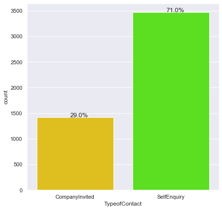
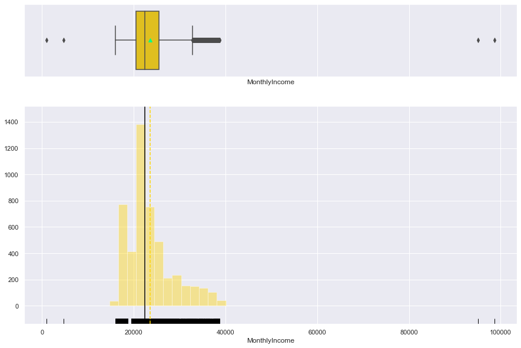

## <a href="https://jakeeide.github.io">Data Science Portfolio</a>

***
##### Travel Package Purchase Prediction  •  Ensemble Techniques Project
##### Python • <a href="https://github.com/jakeeide/jakeeide.github.io/blob/d1b9ad6fd72c1d69fbea7c7200186ded7128f6b6/pdf/Eide_Project5_VisitWithUs.pdf" target="_blank">PDF Presentation</a>
    
***

# <span style='color:#ffd400'> Background </span>  
"Visit With Us" is a tourism company wishing to expand its customer base. Currently, "Visit With Us" offers 5 types of packages - Basic, Standard, Deluxe, Super Deluxe, King. Last year, 18% of the customers purchased the packages. However, the marketing cost was quite high because customers were contacted at random without looking at the available information.

One of the ways to expand the customer base is to introduce a new offering of packages. The company is now planning to launch a new product i.e. Wellness Tourism Package. Wellness Tourism is defined as Travel that allows the traveler to maintain, enhance or kick-start a healthy lifestyle, and support or increase one's sense of well-being.
However, this time company wants to harness the available data of existing and potential customers to make the marketing expenditure more efficient.

The purpose of this project is to analyze the customers' data and information to provide recommendations to the Policy Maker and Marketing Team and also build a model to predict the potential customer who is going to purchase the newly introduced travel package.

# <span style='color:#ffd400'> Objective </span>   

To predict which customer is more likely to purchase the newly introduced travel package.

# <span style='color:#ffd400'> Data Dictionary </span>

Customer details:
1. CustomerID: Unique customer ID
2. ProdTaken: Whether the customer has purchased a package or not (0: No, 1: Yes)
3. Age: Age of customer
4. TypeofContact: How customer was contacted (Company Invited or Self Inquiry)
5. CityTier: City tier depends on the development of a city, population, facilities, and living
standards. The categories are ordered i.e. Tier 1 > Tier 2 > Tier 3
6. Occupation: Occupation of customer
7. Gender: Gender of customer
8. NumberOfPersonVisiting: Total number of persons planning to take the trip with the
customer
9. PreferredPropertyStar: Preferred hotel property rating by customer
10. MaritalStatus: Marital status of customer
11. NumberOfTrips: Average number of trips in a year by customer
12. Passport: The customer has a passport or not (0: No, 1: Yes)
13. OwnCar: Whether the customers own a car or not (0: No, 1: Yes)
14. NumberOfChildrenVisiting: Total number of children with age less than 5 planning to take
the trip with the customer
15. Designation: Designation of the customer in the current organization
16. MonthlyIncome: Gross monthly income of the customer

Customer interaction data:
1. PitchSatisfactionScore: Sales pitch satisfaction score
2. ProductPitched: Product pitched by the salesperson
3. NumberOfFollowups: Total number of follow-ups has been done by the salesperson after
the sales pitch
4. DurationOfPitch: Duration of the pitch by a salesperson to the customer

***

# <span style='color:#009dff'> Notebook Setup </span>
In this section:
* Import libraries and adjust settings
* Import the dataset
* Get an initial understanding of the dataset by looking at its shape, viewing some rows, and viewing a summary of the data


```python
# import necessary libraries

# libraries for reading and manipulating data
import pandas as pd
import numpy as np
pd.set_option('display.max_rows', None)
pd.set_option('display.max_columns', None)

# libraries for visualization
import matplotlib.pyplot as plt 
%matplotlib inline
import seaborn as sns
sns.set(color_codes=True)

# Libraries to split data, impute missing values
from sklearn.model_selection import train_test_split
from sklearn.impute import SimpleImputer

# Libraries to tune model, get different metric scores
from sklearn import metrics
from sklearn.metrics import confusion_matrix, classification_report, accuracy_score, precision_score, recall_score, f1_score
from sklearn.model_selection import GridSearchCV

# Libraries to import decision tree classifier and different ensemble classifiers
from sklearn.tree import DecisionTreeClassifier
from sklearn.tree import DecisionTreeRegressor
from sklearn.ensemble import BaggingClassifier
from sklearn.ensemble import RandomForestClassifier
from sklearn.ensemble import AdaBoostClassifier, GradientBoostingClassifier
from sklearn.ensemble import StackingClassifier
from sklearn.ensemble import BaggingRegressor,RandomForestRegressor, GradientBoostingRegressor, AdaBoostRegressor, StackingRegressor
from xgboost import XGBClassifier
from xgboost import XGBRegressor

# ignore warnings
import warnings
warnings.filterwarnings('ignore')
```


```python
# set seaborn color palette
sns.set_palette(palette='hsv')
```

### Import the dataset


```python
# import the dataset and create a working copy
data = pd.read_csv('Tourism.csv')
tour = data.copy()
```

###  View the shape of the dataset


```python
# display the shape using an f-string
print(f'There are {tour.shape[0]} rows and {tour.shape[1]} columns.')
```

    There are 4888 rows and 20 columns.


### View some rows of the dataset


```python
# look at the first five rows
tour.head()
```


<div>
<style scoped>
    .dataframe tbody tr th:only-of-type {
        vertical-align: middle;
    }

    .dataframe tbody tr th {
        vertical-align: top;
    }

    .dataframe thead th {
        text-align: right;
    }
</style>
<table border="1" class="dataframe">
  <thead>
    <tr style="text-align: right;">
      <th></th>
      <th>CustomerID</th>
      <th>ProdTaken</th>
      <th>Age</th>
      <th>TypeofContact</th>
      <th>CityTier</th>
      <th>DurationOfPitch</th>
      <th>Occupation</th>
      <th>Gender</th>
      <th>NumberOfPersonVisiting</th>
      <th>NumberOfFollowups</th>
      <th>ProductPitched</th>
      <th>PreferredPropertyStar</th>
      <th>MaritalStatus</th>
      <th>NumberOfTrips</th>
      <th>Passport</th>
      <th>PitchSatisfactionScore</th>
      <th>OwnCar</th>
      <th>NumberOfChildrenVisiting</th>
      <th>Designation</th>
      <th>MonthlyIncome</th>
    </tr>
  </thead>
  <tbody>
    <tr>
      <th>0</th>
      <td>200000</td>
      <td>1</td>
      <td>41.0</td>
      <td>Self Enquiry</td>
      <td>3</td>
      <td>6.0</td>
      <td>Salaried</td>
      <td>Female</td>
      <td>3</td>
      <td>3.0</td>
      <td>Deluxe</td>
      <td>3.0</td>
      <td>Single</td>
      <td>1.0</td>
      <td>1</td>
      <td>2</td>
      <td>1</td>
      <td>0.0</td>
      <td>Manager</td>
      <td>20993.0</td>
    </tr>
    <tr>
      <th>1</th>
      <td>200001</td>
      <td>0</td>
      <td>49.0</td>
      <td>Company Invited</td>
      <td>1</td>
      <td>14.0</td>
      <td>Salaried</td>
      <td>Male</td>
      <td>3</td>
      <td>4.0</td>
      <td>Deluxe</td>
      <td>4.0</td>
      <td>Divorced</td>
      <td>2.0</td>
      <td>0</td>
      <td>3</td>
      <td>1</td>
      <td>2.0</td>
      <td>Manager</td>
      <td>20130.0</td>
    </tr>
    <tr>
      <th>2</th>
      <td>200002</td>
      <td>1</td>
      <td>37.0</td>
      <td>Self Enquiry</td>
      <td>1</td>
      <td>8.0</td>
      <td>Free Lancer</td>
      <td>Male</td>
      <td>3</td>
      <td>4.0</td>
      <td>Basic</td>
      <td>3.0</td>
      <td>Single</td>
      <td>7.0</td>
      <td>1</td>
      <td>3</td>
      <td>0</td>
      <td>0.0</td>
      <td>Executive</td>
      <td>17090.0</td>
    </tr>
    <tr>
      <th>3</th>
      <td>200003</td>
      <td>0</td>
      <td>33.0</td>
      <td>Company Invited</td>
      <td>1</td>
      <td>9.0</td>
      <td>Salaried</td>
      <td>Female</td>
      <td>2</td>
      <td>3.0</td>
      <td>Basic</td>
      <td>3.0</td>
      <td>Divorced</td>
      <td>2.0</td>
      <td>1</td>
      <td>5</td>
      <td>1</td>
      <td>1.0</td>
      <td>Executive</td>
      <td>17909.0</td>
    </tr>
    <tr>
      <th>4</th>
      <td>200004</td>
      <td>0</td>
      <td>NaN</td>
      <td>Self Enquiry</td>
      <td>1</td>
      <td>8.0</td>
      <td>Small Business</td>
      <td>Male</td>
      <td>2</td>
      <td>3.0</td>
      <td>Basic</td>
      <td>4.0</td>
      <td>Divorced</td>
      <td>1.0</td>
      <td>0</td>
      <td>5</td>
      <td>1</td>
      <td>0.0</td>
      <td>Executive</td>
      <td>18468.0</td>
    </tr>
  </tbody>
</table>
</div>


```python
# look at five random rows
# set random seed so we see the same random results every time
np.random.seed(1)
tour.sample(n=5)
```


<div>
<style scoped>
    .dataframe tbody tr th:only-of-type {
        vertical-align: middle;
    }

    .dataframe tbody tr th {
        vertical-align: top;
    }

    .dataframe thead th {
        text-align: right;
    }
</style>
<table border="1" class="dataframe">
  <thead>
    <tr style="text-align: right;">
      <th></th>
      <th>CustomerID</th>
      <th>ProdTaken</th>
      <th>Age</th>
      <th>TypeofContact</th>
      <th>CityTier</th>
      <th>DurationOfPitch</th>
      <th>Occupation</th>
      <th>Gender</th>
      <th>NumberOfPersonVisiting</th>
      <th>NumberOfFollowups</th>
      <th>ProductPitched</th>
      <th>PreferredPropertyStar</th>
      <th>MaritalStatus</th>
      <th>NumberOfTrips</th>
      <th>Passport</th>
      <th>PitchSatisfactionScore</th>
      <th>OwnCar</th>
      <th>NumberOfChildrenVisiting</th>
      <th>Designation</th>
      <th>MonthlyIncome</th>
    </tr>
  </thead>
  <tbody>
    <tr>
      <th>3015</th>
      <td>203015</td>
      <td>0</td>
      <td>27.0</td>
      <td>Company Invited</td>
      <td>1</td>
      <td>7.0</td>
      <td>Salaried</td>
      <td>Female</td>
      <td>4</td>
      <td>6.0</td>
      <td>Basic</td>
      <td>3.0</td>
      <td>Married</td>
      <td>5.0</td>
      <td>0</td>
      <td>4</td>
      <td>1</td>
      <td>3.0</td>
      <td>Executive</td>
      <td>23042.0</td>
    </tr>
    <tr>
      <th>1242</th>
      <td>201242</td>
      <td>0</td>
      <td>40.0</td>
      <td>Self Enquiry</td>
      <td>3</td>
      <td>13.0</td>
      <td>Small Business</td>
      <td>Male</td>
      <td>2</td>
      <td>3.0</td>
      <td>King</td>
      <td>4.0</td>
      <td>Single</td>
      <td>2.0</td>
      <td>0</td>
      <td>4</td>
      <td>1</td>
      <td>NaN</td>
      <td>VP</td>
      <td>34833.0</td>
    </tr>
    <tr>
      <th>3073</th>
      <td>203073</td>
      <td>0</td>
      <td>29.0</td>
      <td>Self Enquiry</td>
      <td>2</td>
      <td>15.0</td>
      <td>Small Business</td>
      <td>Male</td>
      <td>4</td>
      <td>5.0</td>
      <td>Basic</td>
      <td>3.0</td>
      <td>Married</td>
      <td>3.0</td>
      <td>0</td>
      <td>2</td>
      <td>0</td>
      <td>2.0</td>
      <td>Executive</td>
      <td>23614.0</td>
    </tr>
    <tr>
      <th>804</th>
      <td>200804</td>
      <td>0</td>
      <td>48.0</td>
      <td>Company Invited</td>
      <td>1</td>
      <td>6.0</td>
      <td>Small Business</td>
      <td>Male</td>
      <td>2</td>
      <td>1.0</td>
      <td>Super Deluxe</td>
      <td>3.0</td>
      <td>Single</td>
      <td>3.0</td>
      <td>0</td>
      <td>2</td>
      <td>0</td>
      <td>0.0</td>
      <td>AVP</td>
      <td>31885.0</td>
    </tr>
    <tr>
      <th>3339</th>
      <td>203339</td>
      <td>0</td>
      <td>32.0</td>
      <td>Self Enquiry</td>
      <td>1</td>
      <td>18.0</td>
      <td>Small Business</td>
      <td>Male</td>
      <td>4</td>
      <td>4.0</td>
      <td>Deluxe</td>
      <td>5.0</td>
      <td>Divorced</td>
      <td>3.0</td>
      <td>1</td>
      <td>2</td>
      <td>0</td>
      <td>3.0</td>
      <td>Manager</td>
      <td>25511.0</td>
    </tr>
  </tbody>
</table>
</div>


```python
# look at the last five rows
tour.tail()
```


<div>
<style scoped>
    .dataframe tbody tr th:only-of-type {
        vertical-align: middle;
    }

    .dataframe tbody tr th {
        vertical-align: top;
    }

    .dataframe thead th {
        text-align: right;
    }
</style>
<table border="1" class="dataframe">
  <thead>
    <tr style="text-align: right;">
      <th></th>
      <th>CustomerID</th>
      <th>ProdTaken</th>
      <th>Age</th>
      <th>TypeofContact</th>
      <th>CityTier</th>
      <th>DurationOfPitch</th>
      <th>Occupation</th>
      <th>Gender</th>
      <th>NumberOfPersonVisiting</th>
      <th>NumberOfFollowups</th>
      <th>ProductPitched</th>
      <th>PreferredPropertyStar</th>
      <th>MaritalStatus</th>
      <th>NumberOfTrips</th>
      <th>Passport</th>
      <th>PitchSatisfactionScore</th>
      <th>OwnCar</th>
      <th>NumberOfChildrenVisiting</th>
      <th>Designation</th>
      <th>MonthlyIncome</th>
    </tr>
  </thead>
  <tbody>
    <tr>
      <th>4883</th>
      <td>204883</td>
      <td>1</td>
      <td>49.0</td>
      <td>Self Enquiry</td>
      <td>3</td>
      <td>9.0</td>
      <td>Small Business</td>
      <td>Male</td>
      <td>3</td>
      <td>5.0</td>
      <td>Deluxe</td>
      <td>4.0</td>
      <td>Unmarried</td>
      <td>2.0</td>
      <td>1</td>
      <td>1</td>
      <td>1</td>
      <td>1.0</td>
      <td>Manager</td>
      <td>26576.0</td>
    </tr>
    <tr>
      <th>4884</th>
      <td>204884</td>
      <td>1</td>
      <td>28.0</td>
      <td>Company Invited</td>
      <td>1</td>
      <td>31.0</td>
      <td>Salaried</td>
      <td>Male</td>
      <td>4</td>
      <td>5.0</td>
      <td>Basic</td>
      <td>3.0</td>
      <td>Single</td>
      <td>3.0</td>
      <td>1</td>
      <td>3</td>
      <td>1</td>
      <td>2.0</td>
      <td>Executive</td>
      <td>21212.0</td>
    </tr>
    <tr>
      <th>4885</th>
      <td>204885</td>
      <td>1</td>
      <td>52.0</td>
      <td>Self Enquiry</td>
      <td>3</td>
      <td>17.0</td>
      <td>Salaried</td>
      <td>Female</td>
      <td>4</td>
      <td>4.0</td>
      <td>Standard</td>
      <td>4.0</td>
      <td>Married</td>
      <td>7.0</td>
      <td>0</td>
      <td>1</td>
      <td>1</td>
      <td>3.0</td>
      <td>Senior Manager</td>
      <td>31820.0</td>
    </tr>
    <tr>
      <th>4886</th>
      <td>204886</td>
      <td>1</td>
      <td>19.0</td>
      <td>Self Enquiry</td>
      <td>3</td>
      <td>16.0</td>
      <td>Small Business</td>
      <td>Male</td>
      <td>3</td>
      <td>4.0</td>
      <td>Basic</td>
      <td>3.0</td>
      <td>Single</td>
      <td>3.0</td>
      <td>0</td>
      <td>5</td>
      <td>0</td>
      <td>2.0</td>
      <td>Executive</td>
      <td>20289.0</td>
    </tr>
    <tr>
      <th>4887</th>
      <td>204887</td>
      <td>1</td>
      <td>36.0</td>
      <td>Self Enquiry</td>
      <td>1</td>
      <td>14.0</td>
      <td>Salaried</td>
      <td>Male</td>
      <td>4</td>
      <td>4.0</td>
      <td>Basic</td>
      <td>4.0</td>
      <td>Unmarried</td>
      <td>3.0</td>
      <td>1</td>
      <td>3</td>
      <td>1</td>
      <td>2.0</td>
      <td>Executive</td>
      <td>24041.0</td>
    </tr>
  </tbody>
</table>
</div>


* There are some NaN values in a couple of different columns, so I will probably have to impute some missing values

### Summary of the data


```python
tour.describe(include='all').T
```


<div>
<style scoped>
    .dataframe tbody tr th:only-of-type {
        vertical-align: middle;
    }

    .dataframe tbody tr th {
        vertical-align: top;
    }

    .dataframe thead th {
        text-align: right;
    }
</style>
<table border="1" class="dataframe">
  <thead>
    <tr style="text-align: right;">
      <th></th>
      <th>count</th>
      <th>unique</th>
      <th>top</th>
      <th>freq</th>
      <th>mean</th>
      <th>std</th>
      <th>min</th>
      <th>25%</th>
      <th>50%</th>
      <th>75%</th>
      <th>max</th>
    </tr>
  </thead>
  <tbody>
    <tr>
      <th>CustomerID</th>
      <td>4888</td>
      <td>NaN</td>
      <td>NaN</td>
      <td>NaN</td>
      <td>202444</td>
      <td>1411.19</td>
      <td>200000</td>
      <td>201222</td>
      <td>202444</td>
      <td>203665</td>
      <td>204887</td>
    </tr>
    <tr>
      <th>ProdTaken</th>
      <td>4888</td>
      <td>NaN</td>
      <td>NaN</td>
      <td>NaN</td>
      <td>0.188216</td>
      <td>0.390925</td>
      <td>0</td>
      <td>0</td>
      <td>0</td>
      <td>0</td>
      <td>1</td>
    </tr>
    <tr>
      <th>Age</th>
      <td>4662</td>
      <td>NaN</td>
      <td>NaN</td>
      <td>NaN</td>
      <td>37.6223</td>
      <td>9.31639</td>
      <td>18</td>
      <td>31</td>
      <td>36</td>
      <td>44</td>
      <td>61</td>
    </tr>
    <tr>
      <th>TypeofContact</th>
      <td>4863</td>
      <td>2</td>
      <td>Self Enquiry</td>
      <td>3444</td>
      <td>NaN</td>
      <td>NaN</td>
      <td>NaN</td>
      <td>NaN</td>
      <td>NaN</td>
      <td>NaN</td>
      <td>NaN</td>
    </tr>
    <tr>
      <th>CityTier</th>
      <td>4888</td>
      <td>NaN</td>
      <td>NaN</td>
      <td>NaN</td>
      <td>1.65426</td>
      <td>0.916583</td>
      <td>1</td>
      <td>1</td>
      <td>1</td>
      <td>3</td>
      <td>3</td>
    </tr>
    <tr>
      <th>DurationOfPitch</th>
      <td>4637</td>
      <td>NaN</td>
      <td>NaN</td>
      <td>NaN</td>
      <td>15.4908</td>
      <td>8.51964</td>
      <td>5</td>
      <td>9</td>
      <td>13</td>
      <td>20</td>
      <td>127</td>
    </tr>
    <tr>
      <th>Occupation</th>
      <td>4888</td>
      <td>4</td>
      <td>Salaried</td>
      <td>2368</td>
      <td>NaN</td>
      <td>NaN</td>
      <td>NaN</td>
      <td>NaN</td>
      <td>NaN</td>
      <td>NaN</td>
      <td>NaN</td>
    </tr>
    <tr>
      <th>Gender</th>
      <td>4888</td>
      <td>3</td>
      <td>Male</td>
      <td>2916</td>
      <td>NaN</td>
      <td>NaN</td>
      <td>NaN</td>
      <td>NaN</td>
      <td>NaN</td>
      <td>NaN</td>
      <td>NaN</td>
    </tr>
    <tr>
      <th>NumberOfPersonVisiting</th>
      <td>4888</td>
      <td>NaN</td>
      <td>NaN</td>
      <td>NaN</td>
      <td>2.90507</td>
      <td>0.724891</td>
      <td>1</td>
      <td>2</td>
      <td>3</td>
      <td>3</td>
      <td>5</td>
    </tr>
    <tr>
      <th>NumberOfFollowups</th>
      <td>4843</td>
      <td>NaN</td>
      <td>NaN</td>
      <td>NaN</td>
      <td>3.70845</td>
      <td>1.00251</td>
      <td>1</td>
      <td>3</td>
      <td>4</td>
      <td>4</td>
      <td>6</td>
    </tr>
    <tr>
      <th>ProductPitched</th>
      <td>4888</td>
      <td>5</td>
      <td>Basic</td>
      <td>1842</td>
      <td>NaN</td>
      <td>NaN</td>
      <td>NaN</td>
      <td>NaN</td>
      <td>NaN</td>
      <td>NaN</td>
      <td>NaN</td>
    </tr>
    <tr>
      <th>PreferredPropertyStar</th>
      <td>4862</td>
      <td>NaN</td>
      <td>NaN</td>
      <td>NaN</td>
      <td>3.58104</td>
      <td>0.798009</td>
      <td>3</td>
      <td>3</td>
      <td>3</td>
      <td>4</td>
      <td>5</td>
    </tr>
    <tr>
      <th>MaritalStatus</th>
      <td>4888</td>
      <td>4</td>
      <td>Married</td>
      <td>2340</td>
      <td>NaN</td>
      <td>NaN</td>
      <td>NaN</td>
      <td>NaN</td>
      <td>NaN</td>
      <td>NaN</td>
      <td>NaN</td>
    </tr>
    <tr>
      <th>NumberOfTrips</th>
      <td>4748</td>
      <td>NaN</td>
      <td>NaN</td>
      <td>NaN</td>
      <td>3.23652</td>
      <td>1.84902</td>
      <td>1</td>
      <td>2</td>
      <td>3</td>
      <td>4</td>
      <td>22</td>
    </tr>
    <tr>
      <th>Passport</th>
      <td>4888</td>
      <td>NaN</td>
      <td>NaN</td>
      <td>NaN</td>
      <td>0.290917</td>
      <td>0.454232</td>
      <td>0</td>
      <td>0</td>
      <td>0</td>
      <td>1</td>
      <td>1</td>
    </tr>
    <tr>
      <th>PitchSatisfactionScore</th>
      <td>4888</td>
      <td>NaN</td>
      <td>NaN</td>
      <td>NaN</td>
      <td>3.07815</td>
      <td>1.36579</td>
      <td>1</td>
      <td>2</td>
      <td>3</td>
      <td>4</td>
      <td>5</td>
    </tr>
    <tr>
      <th>OwnCar</th>
      <td>4888</td>
      <td>NaN</td>
      <td>NaN</td>
      <td>NaN</td>
      <td>0.620295</td>
      <td>0.485363</td>
      <td>0</td>
      <td>0</td>
      <td>1</td>
      <td>1</td>
      <td>1</td>
    </tr>
    <tr>
      <th>NumberOfChildrenVisiting</th>
      <td>4822</td>
      <td>NaN</td>
      <td>NaN</td>
      <td>NaN</td>
      <td>1.18727</td>
      <td>0.857861</td>
      <td>0</td>
      <td>1</td>
      <td>1</td>
      <td>2</td>
      <td>3</td>
    </tr>
    <tr>
      <th>Designation</th>
      <td>4888</td>
      <td>5</td>
      <td>Executive</td>
      <td>1842</td>
      <td>NaN</td>
      <td>NaN</td>
      <td>NaN</td>
      <td>NaN</td>
      <td>NaN</td>
      <td>NaN</td>
      <td>NaN</td>
    </tr>
    <tr>
      <th>MonthlyIncome</th>
      <td>4655</td>
      <td>NaN</td>
      <td>NaN</td>
      <td>NaN</td>
      <td>23619.9</td>
      <td>5380.7</td>
      <td>1000</td>
      <td>20346</td>
      <td>22347</td>
      <td>25571</td>
      <td>98678</td>
    </tr>
  </tbody>
</table>
</div>


* MonthlyIncome looks to be the only continuous variable, and has a wide range – from 1000 to 98678 per month.
* CustomerID will probably be dropped, as that doesn't seem to add any relevant information
* Quite a few of the columns seem to be ordered categories, so I'll have to do some processing on those columns

***
# <span style='color:#009dff'> Data Pre-Processing </span>
In this section:
* Prepare the data for analysis
* Treat missing and incorrect values
* Fix data types
* Feature engineering
* Outlier Detection

### Treat missing values


```python
# look at which columns have the most missing values
tour.isnull().sum().sort_values(ascending=False)
```


    DurationOfPitch             251
    MonthlyIncome               233
    Age                         226
    NumberOfTrips               140
    NumberOfChildrenVisiting     66
    NumberOfFollowups            45
    PreferredPropertyStar        26
    TypeofContact                25
    Passport                      0
    MaritalStatus                 0
    ProductPitched                0
    Designation                   0
    NumberOfPersonVisiting        0
    Gender                        0
    Occupation                    0
    PitchSatisfactionScore        0
    CityTier                      0
    OwnCar                        0
    ProdTaken                     0
    CustomerID                    0
    dtype: int64


* As suspected, there are some missing values that I'll have to fix
* DurationOfPitch is the column with the most missing values: approximately 5% of the values are missing.


```python
# Impute missing numerical values with median

tour['DurationOfPitch'] = tour['DurationOfPitch'].fillna(tour['DurationOfPitch'].median())
tour['MonthlyIncome'] = tour['MonthlyIncome'].fillna(tour['MonthlyIncome'].median())
tour['Age'] = tour['Age'].fillna(tour['Age'].median())
tour['NumberOfTrips'] = tour['NumberOfTrips'].fillna(tour['NumberOfTrips'].median())
tour['NumberOfChildrenVisiting'] = tour['NumberOfChildrenVisiting'].fillna(tour['NumberOfChildrenVisiting'].median())
tour['NumberOfFollowups'] = tour['NumberOfFollowups'].fillna(tour['NumberOfFollowups'].median())
tour['PreferredPropertyStar'] = tour['PreferredPropertyStar'].fillna(tour['PreferredPropertyStar'].median())
```


```python
# Impute missing categorical values with most frequent

imputer = SimpleImputer(missing_values=np.NaN, strategy='most_frequent')
tour.TypeofContact = imputer.fit_transform(tour['TypeofContact'].values.reshape(-1,1))[:,0]
```

### Drop columns


```python
# drop CustomerID column as it doesn't give us any useful data
tour.drop(['CustomerID'],axis=1,inplace=True)
```

### Check for incorrect or garbage values


```python
# look at the number of unique values in each column
tour.nunique().sort_values()
```


    ProdTaken                      2
    TypeofContact                  2
    OwnCar                         2
    Passport                       2
    CityTier                       3
    Gender                         3
    PreferredPropertyStar          3
    NumberOfChildrenVisiting       4
    Occupation                     4
    MaritalStatus                  4
    PitchSatisfactionScore         5
    ProductPitched                 5
    NumberOfPersonVisiting         5
    Designation                    5
    NumberOfFollowups              6
    NumberOfTrips                 12
    DurationOfPitch               34
    Age                           44
    MonthlyIncome               2475
    dtype: int64


```python
cat_cols=['ProdTaken','TypeofContact','Passport', 'OwnCar', 'CityTier', 'Gender', 'PreferredPropertyStar', 'NumberOfChildrenVisiting', 'Occupation', 'MaritalStatus', 'PitchSatisfactionScore', 'NumberOfPersonVisiting', 'Designation', 'ProductPitched', 'NumberOfFollowups', 'NumberOfTrips', 'DurationOfPitch', 'Age']

for column in cat_cols:
    print(tour[column].value_counts())
    print('-'*44)
```

    0    3968
    1     920
    Name: ProdTaken, dtype: int64
    --------------------------------------------
    Self Enquiry       3469
    Company Invited    1419
    Name: TypeofContact, dtype: int64
    --------------------------------------------
    0    3466
    1    1422
    Name: Passport, dtype: int64
    --------------------------------------------
    1    3032
    0    1856
    Name: OwnCar, dtype: int64
    --------------------------------------------
    1    3190
    3    1500
    2     198
    Name: CityTier, dtype: int64
    --------------------------------------------
    Male       2916
    Female     1817
    Fe Male     155
    Name: Gender, dtype: int64
    --------------------------------------------
    3.0    3019
    5.0     956
    4.0     913
    Name: PreferredPropertyStar, dtype: int64
    --------------------------------------------
    1.0    2146
    2.0    1335
    0.0    1082
    3.0     325
    Name: NumberOfChildrenVisiting, dtype: int64
    --------------------------------------------
    Salaried          2368
    Small Business    2084
    Large Business     434
    Free Lancer          2
    Name: Occupation, dtype: int64
    --------------------------------------------
    Married      2340
    Divorced      950
    Single        916
    Unmarried     682
    Name: MaritalStatus, dtype: int64
    --------------------------------------------
    3    1478
    5     970
    1     942
    4     912
    2     586
    Name: PitchSatisfactionScore, dtype: int64
    --------------------------------------------
    3    2402
    2    1418
    4    1026
    1      39
    5       3
    Name: NumberOfPersonVisiting, dtype: int64
    --------------------------------------------
    Executive         1842
    Manager           1732
    Senior Manager     742
    AVP                342
    VP                 230
    Name: Designation, dtype: int64
    --------------------------------------------
    Basic           1842
    Deluxe          1732
    Standard         742
    Super Deluxe     342
    King             230
    Name: ProductPitched, dtype: int64
    --------------------------------------------
    4.0    2113
    3.0    1466
    5.0     768
    2.0     229
    1.0     176
    6.0     136
    Name: NumberOfFollowups, dtype: int64
    --------------------------------------------
    2.0     1464
    3.0     1219
    1.0      620
    4.0      478
    5.0      458
    6.0      322
    7.0      218
    8.0      105
    21.0       1
    19.0       1
    22.0       1
    20.0       1
    Name: NumberOfTrips, dtype: int64
    --------------------------------------------
    9.0      483
    13.0     474
    7.0      342
    8.0      333
    6.0      307
    16.0     274
    15.0     269
    14.0     253
    10.0     244
    11.0     205
    12.0     195
    17.0     172
    30.0      95
    22.0      89
    31.0      83
    23.0      79
    18.0      75
    32.0      74
    29.0      74
    21.0      73
    25.0      73
    27.0      72
    26.0      72
    24.0      70
    35.0      66
    20.0      65
    28.0      61
    33.0      57
    19.0      57
    34.0      50
    36.0      44
    5.0        6
    126.0      1
    127.0      1
    Name: DurationOfPitch, dtype: int64
    --------------------------------------------
    36.0    457
    35.0    237
    34.0    211
    31.0    203
    30.0    199
    32.0    197
    33.0    189
    37.0    185
    29.0    178
    38.0    176
    41.0    155
    39.0    150
    28.0    147
    40.0    146
    42.0    142
    27.0    138
    43.0    130
    46.0    121
    45.0    116
    26.0    106
    44.0    105
    51.0     90
    47.0     88
    50.0     86
    25.0     74
    52.0     68
    53.0     66
    48.0     65
    49.0     65
    55.0     64
    54.0     61
    56.0     58
    24.0     56
    22.0     46
    23.0     46
    59.0     44
    21.0     41
    20.0     38
    19.0     32
    58.0     31
    60.0     29
    57.0     29
    18.0     14
    61.0      9
    Name: Age, dtype: int64
    --------------------------------------------


### Treat Incorrect Values

* `Gender` has 155 values listed as Fe Male. Correct these to Female.
* `MaritalStatus` has entries for both Single and Unmarried. I'm going to combine these.


```python
# Change 'Fe Male' to 'Female'
tour.loc[tour['Gender'] == 'Fe Male', 'Gender'] = 'Female'
```


```python
# Change 'Unmarried' to 'Single'
tour.loc[tour['MaritalStatus'] == 'Unmarried', 'MaritalStatus'] = 'Single'
```

### Strip White Space


```python
# Some of the string objects have white space that I'd like to remove

tour['TypeofContact'] = tour['TypeofContact'].str.replace(' ', '')
tour['Occupation'] = tour['Occupation'].str.replace(' ', '')
tour['Designation'] = tour['Designation'].str.replace(' ', '')
tour['ProductPitched'] = tour['ProductPitched'].str.replace(' ', '')
```

### Treat Outliers

* `Occupation` has 2 rows listed as Free Lancer. There are not enough Freelancers in the data set to be able to make any predictions about this occupation. I'm going to change the two Free Lance entries a different category that is similar.
* `NumberOfPersonVisting` has only 3 rows with the value 5, and 39 rows with the value 1. I'm going to change these outliers because there are not enough of these entries to help make accurate preditions.
* `NumberOfTrips` has 4 rows with unique outliers: the number of trips equal to 19, 20, 21, and 22. Again, I'm going to change these outliers because there are not enough of these entries to help make accurate preditions.
* `DurationOfPitch` has 8 rows with outliers: the duration of pitch equal to 5, 126, and 127. Again, I'm going to change these outliers because there are not enough of these entries to help make accurate preditions.


```python
# Treat ouliers: change Occupation 'Free Lancer' to 'Small Business' as that is the closest match
tour.loc[tour['Occupation'] == 'FreeLancer', 'Occupation'] = 'SmallBusiness'
```


```python
# Treat outliers NumberOfPersonVisiting; change to closest values
tour.loc[tour['NumberOfPersonVisiting'] == 1, 'NumberOfPersonVisiting'] = 2
tour.loc[tour['NumberOfPersonVisiting'] == 5, 'NumberOfPersonVisiting'] = 4
```


```python
# Treat outliers NumberOfTrips
# The outliers are all large numbers
tour.loc[tour['NumberOfTrips'] > 8, 'NumberOfTrips'] = 8
```


```python
# Treat outliers DurationOfPitch; change to closest values
tour.loc[tour['DurationOfPitch'] == 5, 'DurationOfPitch'] = 6
tour.loc[tour['DurationOfPitch'] > 36, 'DurationOfPitch'] = 36
```

* The data looks good in terms of missing values, incorrect values, and outliers
* I didn't look at outliers for `MonthlyIncome` yet, because it will be easier to spot outliers during EDA. If we need to fix outliers for this category, I'll do it then.

### Feature Engineering

* For EDA, I'd like to be able to easily see what product was purchased by the customers who did purchase a package
* I'm going to create a new column that contains the type of product purchases, based on ProdTaken and ProductPitched


```python
# function to return the name of the product only if the product was purchased

def prodtype(df):
    if df['ProdTaken'] == 0:
        return 'None'
    elif df['ProdTaken'] == 1:
        if df['ProductPitched'] == 'Basic':
            return 'Basic'
        elif df['ProductPitched'] == 'Deluxe':
            return 'Deluxe'
        elif df['ProductPitched'] == 'Standard':
            return 'Standard'
        elif df['ProductPitched'] == 'SuperDeluxe':
            return 'SuperDeluxe'
        elif df['ProductPitched'] == 'King':
            return 'King'    
```


```python
tour['ProdPurchased'] = tour.apply(prodtype, axis=1)
```

### Check the data types for each column


```python
# show the datatypes
tour.info()
```

    <class 'pandas.core.frame.DataFrame'>
    RangeIndex: 4888 entries, 0 to 4887
    Data columns (total 20 columns):
     #   Column                    Non-Null Count  Dtype  
    ---  ------                    --------------  -----  
     0   ProdTaken                 4888 non-null   int64  
     1   Age                       4888 non-null   float64
     2   TypeofContact             4888 non-null   object 
     3   CityTier                  4888 non-null   int64  
     4   DurationOfPitch           4888 non-null   float64
     5   Occupation                4888 non-null   object 
     6   Gender                    4888 non-null   object 
     7   NumberOfPersonVisiting    4888 non-null   int64  
     8   NumberOfFollowups         4888 non-null   float64
     9   ProductPitched            4888 non-null   object 
     10  PreferredPropertyStar     4888 non-null   float64
     11  MaritalStatus             4888 non-null   object 
     12  NumberOfTrips             4888 non-null   float64
     13  Passport                  4888 non-null   int64  
     14  PitchSatisfactionScore    4888 non-null   int64  
     15  OwnCar                    4888 non-null   int64  
     16  NumberOfChildrenVisiting  4888 non-null   float64
     17  Designation               4888 non-null   object 
     18  MonthlyIncome             4888 non-null   float64
     19  ProdPurchased             4888 non-null   object 
    dtypes: float64(7), int64(6), object(7)
    memory usage: 763.9+ KB


* 7 columns are objects; these should be changed to categories
* There are a number of columns that are floats, yet they don't need to be. They could be changed to integers to save space.

### Change floats to integers


```python
tour['Age'] = tour['Age'].astype('int')
tour['DurationOfPitch'] = tour['DurationOfPitch'].astype('int')
tour['NumberOfFollowups'] = tour['NumberOfFollowups'].astype('int')
tour['PreferredPropertyStar'] = tour['PreferredPropertyStar'].astype('int')
tour['NumberOfTrips'] = tour['NumberOfTrips'].astype('int')
tour['NumberOfChildrenVisiting'] = tour['NumberOfChildrenVisiting'].astype('int')
tour['MonthlyIncome'] = tour['MonthlyIncome'].astype('int')
```

### Change objects to categories


```python
tour['TypeofContact'] = tour['TypeofContact'].astype('category')
tour['Occupation'] = tour['Occupation'].astype('category')
tour['Gender'] = tour['Gender'].astype('category')
tour['ProductPitched'] = tour['ProductPitched'].astype('category')
tour['MaritalStatus'] = tour['MaritalStatus'].astype('category')
tour['Designation'] = tour['Designation'].astype('category')
tour['ProdPurchased'] = tour['ProdPurchased'].astype('category')
```

### Summarize the data again after processing


```python
# show the datatypes
tour.info()
```

    <class 'pandas.core.frame.DataFrame'>
    RangeIndex: 4888 entries, 0 to 4887
    Data columns (total 20 columns):
     #   Column                    Non-Null Count  Dtype   
    ---  ------                    --------------  -----   
     0   ProdTaken                 4888 non-null   int64   
     1   Age                       4888 non-null   int64   
     2   TypeofContact             4888 non-null   category
     3   CityTier                  4888 non-null   int64   
     4   DurationOfPitch           4888 non-null   int64   
     5   Occupation                4888 non-null   category
     6   Gender                    4888 non-null   category
     7   NumberOfPersonVisiting    4888 non-null   int64   
     8   NumberOfFollowups         4888 non-null   int64   
     9   ProductPitched            4888 non-null   category
     10  PreferredPropertyStar     4888 non-null   int64   
     11  MaritalStatus             4888 non-null   category
     12  NumberOfTrips             4888 non-null   int64   
     13  Passport                  4888 non-null   int64   
     14  PitchSatisfactionScore    4888 non-null   int64   
     15  OwnCar                    4888 non-null   int64   
     16  NumberOfChildrenVisiting  4888 non-null   int64   
     17  Designation               4888 non-null   category
     18  MonthlyIncome             4888 non-null   int64   
     19  ProdPurchased             4888 non-null   category
    dtypes: category(7), int64(13)
    memory usage: 531.0 KB


```python
tour.describe(include='all').T
```


<div>
<style scoped>
    .dataframe tbody tr th:only-of-type {
        vertical-align: middle;
    }

    .dataframe tbody tr th {
        vertical-align: top;
    }

    .dataframe thead th {
        text-align: right;
    }
</style>
<table border="1" class="dataframe">
  <thead>
    <tr style="text-align: right;">
      <th></th>
      <th>count</th>
      <th>unique</th>
      <th>top</th>
      <th>freq</th>
      <th>mean</th>
      <th>std</th>
      <th>min</th>
      <th>25%</th>
      <th>50%</th>
      <th>75%</th>
      <th>max</th>
    </tr>
  </thead>
  <tbody>
    <tr>
      <th>ProdTaken</th>
      <td>4888</td>
      <td>NaN</td>
      <td>NaN</td>
      <td>NaN</td>
      <td>0.188216</td>
      <td>0.390925</td>
      <td>0</td>
      <td>0</td>
      <td>0</td>
      <td>0</td>
      <td>1</td>
    </tr>
    <tr>
      <th>Age</th>
      <td>4888</td>
      <td>NaN</td>
      <td>NaN</td>
      <td>NaN</td>
      <td>37.5473</td>
      <td>9.1048</td>
      <td>18</td>
      <td>31</td>
      <td>36</td>
      <td>43</td>
      <td>61</td>
    </tr>
    <tr>
      <th>TypeofContact</th>
      <td>4888</td>
      <td>2</td>
      <td>SelfEnquiry</td>
      <td>3469</td>
      <td>NaN</td>
      <td>NaN</td>
      <td>NaN</td>
      <td>NaN</td>
      <td>NaN</td>
      <td>NaN</td>
      <td>NaN</td>
    </tr>
    <tr>
      <th>CityTier</th>
      <td>4888</td>
      <td>NaN</td>
      <td>NaN</td>
      <td>NaN</td>
      <td>1.65426</td>
      <td>0.916583</td>
      <td>1</td>
      <td>1</td>
      <td>1</td>
      <td>3</td>
      <td>3</td>
    </tr>
    <tr>
      <th>DurationOfPitch</th>
      <td>4888</td>
      <td>NaN</td>
      <td>NaN</td>
      <td>NaN</td>
      <td>15.3271</td>
      <td>8.01577</td>
      <td>6</td>
      <td>9</td>
      <td>13</td>
      <td>19</td>
      <td>36</td>
    </tr>
    <tr>
      <th>Occupation</th>
      <td>4888</td>
      <td>3</td>
      <td>Salaried</td>
      <td>2368</td>
      <td>NaN</td>
      <td>NaN</td>
      <td>NaN</td>
      <td>NaN</td>
      <td>NaN</td>
      <td>NaN</td>
      <td>NaN</td>
    </tr>
    <tr>
      <th>Gender</th>
      <td>4888</td>
      <td>2</td>
      <td>Male</td>
      <td>2916</td>
      <td>NaN</td>
      <td>NaN</td>
      <td>NaN</td>
      <td>NaN</td>
      <td>NaN</td>
      <td>NaN</td>
      <td>NaN</td>
    </tr>
    <tr>
      <th>NumberOfPersonVisiting</th>
      <td>4888</td>
      <td>NaN</td>
      <td>NaN</td>
      <td>NaN</td>
      <td>2.91244</td>
      <td>0.707833</td>
      <td>2</td>
      <td>2</td>
      <td>3</td>
      <td>3</td>
      <td>4</td>
    </tr>
    <tr>
      <th>NumberOfFollowups</th>
      <td>4888</td>
      <td>NaN</td>
      <td>NaN</td>
      <td>NaN</td>
      <td>3.71113</td>
      <td>0.998271</td>
      <td>1</td>
      <td>3</td>
      <td>4</td>
      <td>4</td>
      <td>6</td>
    </tr>
    <tr>
      <th>ProductPitched</th>
      <td>4888</td>
      <td>5</td>
      <td>Basic</td>
      <td>1842</td>
      <td>NaN</td>
      <td>NaN</td>
      <td>NaN</td>
      <td>NaN</td>
      <td>NaN</td>
      <td>NaN</td>
      <td>NaN</td>
    </tr>
    <tr>
      <th>PreferredPropertyStar</th>
      <td>4888</td>
      <td>NaN</td>
      <td>NaN</td>
      <td>NaN</td>
      <td>3.57795</td>
      <td>0.797005</td>
      <td>3</td>
      <td>3</td>
      <td>3</td>
      <td>4</td>
      <td>5</td>
    </tr>
    <tr>
      <th>MaritalStatus</th>
      <td>4888</td>
      <td>3</td>
      <td>Married</td>
      <td>2340</td>
      <td>NaN</td>
      <td>NaN</td>
      <td>NaN</td>
      <td>NaN</td>
      <td>NaN</td>
      <td>NaN</td>
      <td>NaN</td>
    </tr>
    <tr>
      <th>NumberOfTrips</th>
      <td>4888</td>
      <td>NaN</td>
      <td>NaN</td>
      <td>NaN</td>
      <td>3.21952</td>
      <td>1.75951</td>
      <td>1</td>
      <td>2</td>
      <td>3</td>
      <td>4</td>
      <td>8</td>
    </tr>
    <tr>
      <th>Passport</th>
      <td>4888</td>
      <td>NaN</td>
      <td>NaN</td>
      <td>NaN</td>
      <td>0.290917</td>
      <td>0.454232</td>
      <td>0</td>
      <td>0</td>
      <td>0</td>
      <td>1</td>
      <td>1</td>
    </tr>
    <tr>
      <th>PitchSatisfactionScore</th>
      <td>4888</td>
      <td>NaN</td>
      <td>NaN</td>
      <td>NaN</td>
      <td>3.07815</td>
      <td>1.36579</td>
      <td>1</td>
      <td>2</td>
      <td>3</td>
      <td>4</td>
      <td>5</td>
    </tr>
    <tr>
      <th>OwnCar</th>
      <td>4888</td>
      <td>NaN</td>
      <td>NaN</td>
      <td>NaN</td>
      <td>0.620295</td>
      <td>0.485363</td>
      <td>0</td>
      <td>0</td>
      <td>1</td>
      <td>1</td>
      <td>1</td>
    </tr>
    <tr>
      <th>NumberOfChildrenVisiting</th>
      <td>4888</td>
      <td>NaN</td>
      <td>NaN</td>
      <td>NaN</td>
      <td>1.18474</td>
      <td>0.852323</td>
      <td>0</td>
      <td>1</td>
      <td>1</td>
      <td>2</td>
      <td>3</td>
    </tr>
    <tr>
      <th>Designation</th>
      <td>4888</td>
      <td>5</td>
      <td>Executive</td>
      <td>1842</td>
      <td>NaN</td>
      <td>NaN</td>
      <td>NaN</td>
      <td>NaN</td>
      <td>NaN</td>
      <td>NaN</td>
      <td>NaN</td>
    </tr>
    <tr>
      <th>MonthlyIncome</th>
      <td>4888</td>
      <td>NaN</td>
      <td>NaN</td>
      <td>NaN</td>
      <td>23559.2</td>
      <td>5257.86</td>
      <td>1000</td>
      <td>20485</td>
      <td>22347</td>
      <td>25424.8</td>
      <td>98678</td>
    </tr>
    <tr>
      <th>ProdPurchased</th>
      <td>4888</td>
      <td>6</td>
      <td>None</td>
      <td>3968</td>
      <td>NaN</td>
      <td>NaN</td>
      <td>NaN</td>
      <td>NaN</td>
      <td>NaN</td>
      <td>NaN</td>
      <td>NaN</td>
    </tr>
  </tbody>
</table>
</div>


* I'll get deeper into this in EDA, but here are a couple of immediate insights:
* Mean and median age are pretty close, centering around 36 and 37 year olds
* Similarly, mean and median for monthly income centers around 23,000

***
# <span style='color:#009dff'> EDA </span>
In this section:
* Univariate analysis
* Bivariate analysis
* Identify relationships between variables
* Visualize the data set
* Identify patterns and insights which can drive business decisions
* Identify which variables are most significant

### Univariate Analysis


```python
# This is a function to create a boxplot and histogram for any input numerical variable
# This function takes the numerical column as the input and returns the boxplots and histograms for the variable
def histogram_boxplot(feature, figsize=(15,10), bins = None):
    """ Boxplot and histogram combined
    feature: 1-d feature array
    figsize: size of fig (default (9,8))
    bins: number of bins (default None / auto)
    """
    f2, (ax_box2, ax_hist2) = plt.subplots(nrows = 2, # Number of rows of the subplot grid= 2
                                           sharex = True, # x-axis will be shared among all subplots
                                           gridspec_kw = {"height_ratios": (.25, .75)}, 
                                           figsize = figsize 
                                           ) # creating the 2 subplots
    sns.boxplot(feature, ax=ax_box2, showmeans=True) # boxplot will be created and a star will indicate the mean value of the column
    sns.rugplot(feature, ax=ax_hist2, color='black') # Add rug to the histogram
    sns.distplot(feature, kde=True, ax=ax_hist2, bins=bins) if bins else sns.distplot(feature, kde=False, ax=ax_hist2) # For histogram
    ax_hist2.axvline(np.mean(feature), linestyle='--') # Add mean to the histogram
    ax_hist2.axvline(np.median(feature), color='black', linestyle='-') # Add median to the histogram
```


```python
# Function to create barplots that indicate percentage for each category
def bar_perc(plot, feature):
    '''
    plot
    feature: 1-d categorical feature array
    '''
    total = len(feature) # length of the column
    for p in ax.patches:
        percentage = '{:.1f}%'.format(100 * p.get_height()/total) # percentage of each class of the category
        x = p.get_x() + p.get_width() / 2 - 0.05 # width of the plot
        y = p.get_y() + p.get_height() + 0.2           # height of the plot
        ax.annotate(percentage, (x, y), size = 13) # annotate the percantage
```

### Observations on Product Taken
Our goal is to predict which customer is more likely to purchase the newly introduced travel package. The ProdTaken category tells us whether a customer purchased a package or not previously. I will focus a lot of attention on this category because it will help us predict whether a customer might be likely to purchase the new package.


```python
# Show a bar graph of Personal_Loan counts
plt.figure(figsize=(7,7))
ax = sns.countplot(tour['ProdTaken'], order = tour['ProdTaken'].value_counts().index)
bar_perc(ax,tour['ProdTaken'])
```


    

    


<span style='background-color:#00ff85'> **ProdTaken is our most important variable** </span>
* Only about 18% of customers purchased a package

### Observations on Product Purchased
This is the category that I added to be able to see what products were purchased.


```python
# Show a bar graph
plt.figure(figsize=(12,7))
ax = sns.countplot(tour['ProdPurchased'])
bar_perc(ax,tour['ProdPurchased'])
```


    

    


* In order from most purchased to least purchased: Basic, Deluxe, Standard, King, and SuperDeluxe

### Observations on Age
Customer's age


```python
# draw boxplot and histogram
histogram_boxplot(tour.Age)
```


    

    


* Age is fairly mound shaped, with a small amount of right-skew
* There appears to be a large amount of customers who are 36 years old
* IQR is from 31 to 43

### Observations on Type of Contact
How the customer was contacted


```python
# Show a bar graph
plt.figure(figsize=(7,7))
ax = sns.countplot(tour['TypeofContact'])
bar_perc(ax,tour['TypeofContact'])
```


    

    


* A clear majority of customers initiated contact via Self Enquiry

### Observations on City Tier
City tier depends on the development of a city, population, facilities, and living
standards. The categories are ordered i.e. Tier 1 > Tier 2 > Tier 3


```python
# Show a bar graph
plt.figure(figsize=(10,7))
ax = sns.countplot(tour['CityTier'])
bar_perc(ax,tour['CityTier'])
```


    

    


* Tiers 1 and 3 were much more popular that the middle tier

### Observations on Occupation
Occupation of customer


```python
# Show a bar graph
plt.figure(figsize=(10,7))
ax = sns.countplot(tour['Occupation'])
bar_perc(ax,tour['Occupation'])
```


    

    


* Most customers are Salaried employees, followed closely by Small Business owners

### Observations on Gender
Gender of the customer


```python
# Show a bar graph
plt.figure(figsize=(7,7))
ax = sns.countplot(tour['Gender'])
bar_perc(ax,tour['Gender'])
```


    

    


* Customers are skewed about 60% male

### Observations on Number of Persons Visiting
Total number of persons planning to take the trip with the
customer


```python
# Show a bar graph
plt.figure(figsize=(10,7))
ax = sns.countplot(tour['NumberOfPersonVisiting'])
bar_perc(ax,tour['NumberOfPersonVisiting'])
```


    

    


* About half of customers plan on taking 3 people on the trip with them

### Observations on Preferred Property Star
Preferred hotel property rating by customer


```python
# Show a bar graph
plt.figure(figsize=(10,7))
ax = sns.countplot(tour['PreferredPropertyStar'])
bar_perc(ax,tour['PreferredPropertyStar'])
```


    

    


* 3 Star properties are the clear favorite

### Observations on Marital Status
Marital status of customer


```python
# Show a bar graph
plt.figure(figsize=(10,7))
ax = sns.countplot(tour['MaritalStatus'])
bar_perc(ax,tour['MaritalStatus'])
```


    

    


* About half of customers are married

### Observations on Number of Trips
Average number of trips in a year by customer


```python
# Show a bar graph
plt.figure(figsize=(14,7))
ax = sns.countplot(tour['NumberOfTrips'])
bar_perc(ax,tour['NumberOfTrips'])
```


    

    


```python
# draw boxplot and histogram
histogram_boxplot(tour.NumberOfTrips)
```


    

    


* More than half of customers take 2 or 3 trips per year
* The values range between 1 and 8 trips per year

### Observations on Passport
The customer has a passport or not (0: No, 1: Yes)


```python
# Show a bar graph
plt.figure(figsize=(7,7))
ax = sns.countplot(tour['Passport'])
bar_perc(ax,tour['Passport'])
```


    

    


* Most customers do not have a passport
* Less than 1/3 of customers do have a passport

### Observations on Own Car
Whether the customers own a car or not (0: No, 1: Yes)


```python
# Show a bar graph
plt.figure(figsize=(7,7))
ax = sns.countplot(tour['OwnCar'])
bar_perc(ax,tour['OwnCar'])
```


    

    


* Most customers do own a car

### Observations on Number of Children Visiting
Total number of children with age less than 5 planning to take
the trip with the customer


```python
# Show a bar graph
plt.figure(figsize=(10,7))
ax = sns.countplot(tour['NumberOfChildrenVisiting'])
bar_perc(ax,tour['NumberOfChildrenVisiting'])
```


    

    


* Range is between 0 and 3 children
* The most common value is one child

### Observations on Designation
Designation of the customer in the current organization


```python
# Show a bar graph
plt.figure(figsize=(12,7))
ax = sns.countplot(tour['Designation'])
bar_perc(ax,tour['Designation'])
```


    

    


* There are five different designations
* Executives and Managers make up more than 70% of customers

### Observations on Monthly Income
Gross monthly income of the customer


```python
# draw boxplot and histogram
histogram_boxplot(tour.MonthlyIncome)
```


    

    


* There appears to be a couple of very high outliers as well as a couple of low outliers
* I'm going to look at these specific values to see if I want to change them


```python
# identify outliers by
# viewing the specific values for monthly incomes

tour['MonthlyIncome'].value_counts().sort_index(ascending=True)
```


    1000       1
    4678       1
    16009      2
    16051      2
    16052      2
    16081      1
    16091      1
    16102      2
    16118      2
    16129      1
    16200      2
    16223      2
    16232      2
    16261      1
    16274      1
    16281      2
    16359      1
    16393      1
    16416      2
    16420      2
    16483      2
    16514      1
    16555      1
    16563      1
    16569      1
    16601      2
    16611      2
    16675      2
    16702      2
    16706      2
    16790      1
    16859      2
    16878      2
    16904      2
    16951      2
    17001      1
    17007      2
    17008      3
    17011      2
    17013      1
    17014      2
    17018      1
    17022      2
    17024      2
    17028      3
    17029      1
    17033      3
    17042      4
    17044      3
    17045      2
    17058      2
    17061      1
    17062      1
    17064      1
    17066      1
    17070      4
    17073      3
    17074      1
    17075      2
    17080      2
    17083      2
    17086      2
    17088      2
    17089      2
    17090      2
    17093      2
    17096      4
    17097      2
    17099      1
    17105      1
    17107      2
    17109      2
    17115      2
    17119      2
    17121      2
    17127      3
    17132      3
    17133      1
    17141      1
    17143      2
    17144      2
    17145      1
    17148      1
    17153      2
    17154      2
    17157      2
    17166      1
    17168      2
    17174      2
    17176      2
    17177      5
    17180      1
    17187      3
    17194      2
    17201      2
    17206      2
    17207      2
    17210      2
    17213      2
    17216      2
    17218      2
    17220      2
    17226      1
    17231      2
    17232      2
    17235      2
    17238      2
    17244      2
    17258      4
    17259      2
    17267      2
    17269      3
    17270      2
    17272      1
    17274      2
    17275      1
    17277      2
    17279      2
    17285      2
    17288      2
    17289      1
    17290      2
    17293      4
    17296      1
    17297      2
    17302      2
    17305      1
    17306      2
    17307      1
    17308      1
    17311      2
    17313      2
    17314      2
    17318      2
    17319      2
    17321      2
    17322      2
    17323      4
    17325      2
    17326      2
    17328      2
    17329      2
    17332      2
    17335      1
    17339      1
    17340      4
    17341      2
    17342      7
    17345      1
    17348      2
    17351      2
    17356      2
    17362      3
    17366      2
    17367      2
    17368      2
    17370      2
    17372      4
    17373      2
    17376      2
    17377      4
    17379      1
    17380      5
    17387      2
    17389      2
    17394      1
    17398      1
    17400      2
    17404      5
    17406      3
    17408      1
    17413      2
    17422      2
    17426      2
    17430      1
    17432      1
    17436      3
    17437      1
    17438      1
    17439      2
    17440      1
    17450      3
    17451      5
    17455      2
    17461      2
    17468      1
    17472      1
    17476      2
    17478      2
    17479      2
    17496      2
    17500      4
    17501      2
    17506      2
    17514      2
    17515      4
    17517      2
    17519      2
    17523      2
    17532      2
    17534      2
    17539      2
    17543      2
    17544      1
    17546      2
    17552      2
    17553      2
    17559      6
    17561      1
    17564      4
    17566      2
    17570      1
    17571      1
    17572      2
    17576      2
    17579      2
    17580      1
    17585      2
    17587      2
    17592      1
    17593      2
    17596      2
    17600      2
    17610      5
    17613      2
    17619      2
    17622      2
    17625      2
    17632      2
    17642      2
    17644      1
    17645      2
    17647      1
    17654      2
    17655      1
    17657      4
    17659      2
    17660      1
    17661      2
    17662      1
    17670      2
    17678      2
    17679      1
    17683      2
    17684      2
    17686      2
    17690      1
    17691      2
    17693      4
    17694      2
    17695      2
    17696      2
    17700      2
    17703      4
    17705      2
    17706      1
    17707      2
    17713      2
    17716      2
    17718      1
    17720      4
    17723      2
    17725      2
    17728      1
    17741      6
    17742      1
    17743      4
    17756      2
    17759      2
    17760      1
    17766      1
    17768      2
    17773      2
    17774      2
    17778      2
    17781      2
    17782      3
    17783      1
    17785      1
    17789      2
    17791      2
    17793      1
    17794      2
    17795      2
    17799      2
    17800      2
    17804      1
    17809      1
    17810      1
    17811      2
    17814      1
    17818      2
    17819      2
    17821      2
    17827      2
    17835      2
    17836      2
    17837      1
    17838      2
    17844      2
    17851      2
    17853      2
    17856      1
    17858      1
    17859      2
    17862      1
    17863      1
    17867      1
    17871      2
    17875      2
    17886      4
    17889      2
    17897      1
    17899      2
    17904      2
    17909      3
    17911      4
    17926      2
    17929      1
    17932      1
    17933      1
    17935      2
    17936      3
    17942      4
    17950      1
    17956      3
    17960      2
    17966      1
    17972      1
    17973      4
    17974      1
    17976      2
    17977      1
    17979      2
    17983      2
    17991      1
    17994      2
    17996      2
    18022      2
    18033      2
    18034      2
    18038      4
    18041      2
    18055      1
    18057      2
    18058      2
    18065      1
    18067      1
    18068      2
    18069      1
    18072      4
    18102      2
    18117      1
    18131      2
    18140      2
    18143      1
    18149      2
    18161      2
    18162      3
    18172      1
    18180      1
    18195      1
    18196      2
    18201      2
    18202      2
    18204      2
    18210      2
    18211      1
    18212      2
    18221      2
    18229      1
    18230      2
    18280      2
    18291      2
    18294      3
    18295      1
    18298      2
    18306      1
    18310      2
    18312      1
    18319      2
    18339      2
    18346      2
    18348      2
    18375      1
    18376      2
    18377      1
    18388      2
    18407      3
    18408      2
    18419      1
    18420      2
    18423      2
    18424      2
    18433      1
    18441      2
    18445      1
    18447      2
    18448      2
    18452      6
    18464      2
    18468      2
    18477      1
    18479      2
    18482      1
    18485      2
    18491      2
    18500      1
    18505      2
    18506      2
    18517      1
    18537      1
    18539      1
    18540      1
    18544      2
    18564      2
    18578      1
    18579      2
    18580      2
    18591      1
    18597      2
    18600      2
    18617      2
    18622      2
    18629      1
    18633      2
    18646      1
    18660      2
    18669      2
    18673      1
    18681      2
    18688      2
    18690      2
    18691      2
    18692      2
    18697      2
    18702      1
    18708      2
    19485      2
    19487      2
    19490      2
    19502      1
    19505      2
    19507      1
    19508      2
    19522      2
    19523      2
    19534      2
    19537      2
    19538      2
    19539      2
    19541      2
    19553      2
    19554      2
    19556      2
    19558      2
    19559      2
    19568      2
    19577      2
    19581      1
    19591      1
    19599      1
    19601      2
    19614      1
    19615      2
    19617      1
    19621      2
    19627      2
    19639      3
    19647      2
    19648      1
    19649      2
    19661      2
    19663      1
    19668      2
    19678      2
    19680      2
    19682      2
    19684      1
    19687      2
    19695      2
    19707      2
    19717      2
    19721      2
    19723      1
    19724      2
    19728      2
    19729      2
    19730      2
    19735      1
    19736      2
    19739      2
    19741      2
    19759      2
    19765      2
    19766      2
    19768      1
    19769      1
    19771      1
    19774      1
    19775      2
    19777      2
    19779      3
    19780      2
    19787      1
    19788      1
    19789      1
    19796      2
    19805      2
    19807      1
    19809      2
    19810      2
    19821      2
    19834      2
    19841      1
    19850      1
    19851      2
    19855      1
    19859      2
    19869      2
    19876      3
    19878      3
    19883      2
    19898      3
    19900      1
    19901      2
    19907      3
    19908      2
    19910      2
    19930      1
    19936      4
    19939      1
    19941      4
    19950      2
    19952      1
    19959      2
    19960      2
    19963      2
    19968      3
    19969      2
    19978      1
    19998      2
    19999      2
    20003      3
    20006      2
    20010      2
    20021      2
    20033      1
    20037      1
    20042      1
    20055      2
    20056      2
    20063      1
    20067      2
    20070      2
    20071      2
    20079      2
    20087      1
    20093      2
    20094      4
    20098      3
    20121      2
    20126      2
    20130      2
    20131      1
    20147      1
    20151      1
    20154      1
    20155      2
    20160      2
    20161      2
    20163      2
    20171      2
    20175      2
    20192      1
    20204      3
    20206      1
    20207      1
    20208      2
    20209      2
    20210      2
    20220      2
    20228      4
    20231      2
    20233      1
    20237      2
    20238      3
    20241      1
    20247      1
    20249      2
    20253      2
    20257      2
    20258      2
    20265      2
    20279      2
    20289      2
    20294      1
    20295      1
    20296      2
    20301      1
    20304      4
    20309      2
    20321      1
    20324      2
    20326      2
    20329      2
    20332      1
    20337      2
    20343      3
    20346      3
    20347      1
    20353      2
    20363      2
    20368      1
    20373      1
    20376      2
    20377      1
    20380      3
    20381      2
    20384      2
    20390      1
    20396      2
    20399      1
    20405      3
    20406      1
    20410      3
    20415      2
    20429      1
    20433      1
    20440      1
    20441      2
    20454      2
    20460      2
    20467      2
    20468      2
    20470      1
    20472      2
    20473      3
    20476      1
    20482      2
    20484      3
    20485      2
    20486      1
    20487      1
    20488      2
    20505      1
    20507      1
    20537      2
    20538      1
    20556      2
    20561      2
    20562      4
    20577      2
    20582      4
    20593      2
    20605      4
    20617      1
    20629      2
    20647      1
    20660      2
    20661      2
    20666      2
    20673      1
    20674      2
    20675      1
    20677      1
    20679      3
    20685      2
    20686      3
    20689      3
    20691      1
    20692      2
    20696      1
    20700      2
    20702      2
    20706      3
    20707      1
    20711      3
    20714      2
    20715      2
    20720      4
    20722      3
    20723      2
    20731      2
    20736      3
    20739      1
    20740      1
    20742      1
    20743      1
    20744      3
    20745      2
    20747      1
    20748      4
    20751      3
    20752      1
    20753      2
    20758      2
    20761      2
    20762      1
    20764      2
    20765      1
    20766      2
    20767      2
    20768      3
    20769      2
    20770      1
    20771      2
    20772      2
    20774      4
    20775      4
    20777      1
    20783      1
    20785      2
    20787      2
    20793      2
    20797      2
    20799      2
    20805      3
    20810      4
    20811      2
    20813      1
    20819      1
    20821      2
    20822      2
    20823      1
    20826      1
    20828      2
    20831      2
    20832      2
    20835      2
    20844      1
    20846      2
    20852      2
    20854      2
    20855      7
    20858      1
    20865      3
    20869      1
    20872      2
    20878      1
    20879      2
    20884      2
    20885      2
    20888      2
    20891      2
    20894      2
    20896      2
    20898      2
    20902      2
    20904      1
    20906      1
    20909      2
    20910      2
    20913      2
    20914      2
    20915      2
    20916      4
    20922      2
    20933      2
    20936      4
    20937      2
    20940      2
    20945      2
    20947      3
    20948      2
    20950      1
    20952      2
    20953      1
    20955      2
    20957      4
    20963      2
    20966      2
    20967      1
    20968      3
    20971      4
    20974      3
    20975      2
    20980      4
    20983      1
    20984      2
    20985      3
    20986      1
    20989      2
    20991      2
    20992      2
    20993      4
    20996      2
    20997      2
    20999      2
    21000      2
    21001      4
    21003      2
    21004      2
    21006      2
    21007      2
    21010      2
    21013      1
    21017      1
    21018      4
    21019      2
    21020      7
    21023      1
    21026      2
    21029      3
    21032      2
    21034      2
    21040      3
    21044      2
    21045      2
    21046      2
    21048      2
    21050      4
    21051      2
    21054      2
    21055      4
    21057      1
    21058      5
    21062      2
    21065      2
    21067      2
    21072      1
    21074      2
    21076      1
    21077      1
    21078      2
    21082      5
    21084      3
    21086      1
    21091      4
    21100      2
    21104      2
    21108      1
    21110      1
    21114      3
    21115      1
    21116      1
    21117      2
    21118      3
    21120      1
    21125      2
    21128      3
    21129      5
    21132      2
    21133      2
    21134      1
    21139      2
    21142      4
    21146      3
    21150      1
    21151      2
    21154      2
    21156      2
    21157      2
    21162      4
    21172      2
    21174      2
    21178      4
    21179      3
    21180      2
    21184      2
    21192      2
    21193      4
    21195      2
    21197      2
    21201      4
    21209      2
    21210      2
    21212      2
    21214      2
    21217      2
    21220      2
    21221      2
    21222      1
    21224      2
    21230      4
    21231      2
    21232      1
    21237      6
    21239      1
    21242      4
    21244      4
    21248      1
    21249      1
    21250      2
    21254      2
    21257      2
    21258      1
    21261      2
    21263      2
    21265      2
    21270      1
    21271      2
    21272      4
    21274      4
    21278      2
    21288      7
    21291      2
    21294      1
    21297      2
    21300      2
    21303      2
    21306      1
    21310      2
    21320      2
    21322      3
    21323      3
    21325      1
    21332      2
    21333      1
    21334      2
    21335      4
    21337      2
    21338      1
    21339      2
    21340      1
    21347      6
    21348      2
    21349      2
    21356      2
    21357      1
    21361      2
    21362      2
    21364      2
    21368      1
    21369      2
    21371      4
    21372      2
    21373      2
    21374      2
    21377      1
    21378      2
    21380      2
    21381      4
    21383      2
    21384      2
    21385      4
    21388      1
    21389      2
    21391      2
    21392      1
    21394      2
    21396      1
    21397      4
    21398      4
    21401      2
    21403      2
    21406      1
    21410      2
    21419      6
    21420      1
    21421      4
    21430      1
    21434      4
    21437      2
    21438      1
    21439      1
    21444      1
    21446      2
    21447      2
    21451      2
    21452      2
    21456      2
    21459      2
    21460      3
    21461      1
    21463      1
    21465      2
    21467      2
    21469      2
    21471      1
    21472      3
    21473      2
    21474      2
    21477      2
    21478      2
    21482      1
    21487      1
    21488      1
    21489      2
    21492      1
    21496      2
    21497      2
    21499      4
    21500      3
    21502      2
    21505      2
    21513      3
    21514      2
    21515      1
    21516      3
    21522      2
    21524      2
    21529      2
    21531      2
    21534      1
    21536      1
    21537      2
    21538      2
    21540      3
    21541      1
    21545      3
    21549      3
    21553      4
    21564      4
    21567      4
    21575      1
    21577      4
    21578      2
    21582      4
    21583      1
    21586      2
    21587      3
    21589      4
    21604      2
    21607      1
    21610      1
    21611      1
    21613      2
    21614      3
    21620      4
    21623      2
    21628      1
    21632      2
    21634      3
    21638      2
    21644      3
    21646      2
    21650      1
    21651      5
    21652      2
    21653      2
    21654      2
    21655      1
    21657      2
    21661      2
    21667      1
    21669      1
    21672      2
    21673      2
    21674      4
    21687      1
    21694      2
    21696      2
    21700      2
    21711      2
    21712      3
    21716      4
    21719      2
    21725      2
    21728      1
    21733      1
    21735      3
    21736      2
    21743      1
    21745      1
    21746      2
    21747      1
    21750      4
    21755      2
    21780      2
    21781      2
    21782      2
    21795      1
    21796      2
    21799      1
    21804      4
    21809      2
    21811      4
    21812      2
    21815      1
    21818      2
    21821      1
    21825      2
    21827      2
    21833      2
    21834      1
    21839      2
    21840      3
    21842      1
    21850      1
    21852      2
    21854      1
    21858      1
    21861      2
    21870      1
    21873      1
    21874      2
    21877      2
    21879      2
    21880      2
    21882      2
    21883      1
    21888      2
    21889      1
    21890      2
    21893      2
    21899      2
    21907      1
    21908      2
    21929      2
    21931      2
    21932      2
    21949      2
    21958      2
    21962      1
    21969      2
    21972      3
    21973      1
    21976      2
    21984      1
    21988      2
    21990      1
    21997      2
    22005      1
    22017      2
    22024      2
    22026      2
    22053      1
    22054      2
    22055      1
    22066      2
    22082      1
    22083      1
    22085      3
    22086      2
    22094      2
    22097      1
    22098      2
    22101      2
    22102      2
    22104      2
    22111      1
    22119      4
    22123      1
    22125      2
    22126      2
    22130      6
    22140      1
    22142      2
    22143      2
    22146      2
    22155      1
    22157      2
    22160      1
    22163      2
    22169      2
    22178      1
    22183      2
    22184      2
    22195      1
    22215      1
    22217      1
    22218      1
    22222      2
    22242      2
    22256      1
    22257      2
    22258      2
    22260      2
    22264      2
    22269      1
    22275      2
    22278      2
    22295      4
    22300      2
    22307      1
    22311      2
    22314      1
    22324      1
    22336      2
    22338      2
    22347    235
    22351      3
    22359      2
    22366      2
    22368      2
    22369      2
    22370      2
    22375      2
    22379      2
    22380      1
    22386      2
    22400      1
    22403      2
    22406      2
    22408      2
    22412      2
    22415      2
    22421      2
    22426      1
    22428      2
    22433      2
    22438      3
    22439      2
    22441      1
    22446      1
    22457      2
    22458      2
    22463      1
    22484      2
    22490      1
    22491      2
    22493      2
    22494      2
    22510      1
    22511      2
    22516      1
    22525      2
    22545      2
    22547      2
    22553      3
    22564      1
    22572      2
    22580      1
    22582      3
    22585      1
    22587      2
    22595      2
    22596      2
    22597      2
    22598      2
    22607      2
    22609      2
    22614      1
    22622      2
    22625      2
    22632      2
    22633      2
    22637      2
    22639      2
    22642      2
    22644      1
    22646      1
    22653      1
    22654      2
    22655      3
    22656      1
    22661      2
    22664      1
    22667      1
    22678      2
    22679      1
    22689      4
    22692      4
    22703      3
    22706      2
    22709      2
    22711      2
    22713      1
    22715      2
    22725      2
    22729      2
    22744      1
    22747      1
    22749      1
    22756      4
    22759      1
    22762      1
    22765      1
    22767      2
    22779      2
    22781      2
    22783      1
    22785      2
    22786      1
    22793      2
    22805      1
    22823      2
    22826      3
    22830      2
    22835      2
    22840      1
    22841      2
    22847      1
    22849      2
    22861      2
    22865      1
    22867      1
    22871      2
    22872      2
    22875      3
    22876      1
    22878      2
    22879      1
    22880      2
    22891      1
    22898      2
    22899      2
    22905      2
    22908      2
    22911      2
    22918      4
    22922      2
    22927      2
    22934      2
    22935      2
    22936      2
    22938      2
    22940      2
    22945      1
    22950      2
    22962      2
    22963      1
    22964      2
    22969      2
    22972      2
    22976      2
    22978      2
    22980      2
    22984      4
    22988      1
    22990      2
    22991      1
    22995      1
    22997      2
    22998      1
    23001      2
    23003      2
    23005      2
    23008      1
    23010      1
    23013      2
    23020      4
    23023      2
    23042      2
    23051      1
    23052      1
    23055      2
    23059      2
    23060      2
    23063      1
    23071      1
    23078      1
    23079      1
    23081      2
    23082      1
    23095      2
    23098      2
    23100      2
    23102      2
    23103      3
    23112      2
    23118      2
    23120      2
    23122      2
    23125      2
    23126      1
    23127      2
    23128      2
    23143      2
    23155      2
    23156      2
    23161      1
    23163      2
    23165      2
    23168      2
    23180      1
    23183      2
    23185      1
    23186      2
    23189      2
    23200      2
    23201      2
    23212      2
    23215      2
    23216      2
    23217      2
    23219      2
    23224      2
    23231      2
    23232      2
    23234      2
    23236      2
    23237      3
    23246      2
    23255      2
    23259      1
    23268      2
    23269      1
    23277      1
    23279      2
    23292      1
    23293      2
    23295      1
    23299      2
    23305      2
    23317      3
    23321      1
    23325      2
    23326      1
    23327      2
    23339      2
    23341      1
    23346      3
    23356      2
    23358      2
    23360      2
    23362      1
    23373      2
    23376      1
    23380      2
    23381      2
    23385      2
    23392      2
    23395      2
    23396      2
    23399      2
    23401      1
    23402      2
    23406      2
    23412      2
    23413      1
    23414      2
    23417      2
    23419      2
    23437      1
    23443      2
    23444      2
    23446      3
    23449      1
    23452      1
    23453      2
    23455      2
    23457      3
    23463      1
    23465      1
    23466      1
    23467      1
    23474      2
    23483      2
    23487      2
    23488      2
    23499      2
    23500      2
    23512      2
    23519      1
    23528      1
    23529      2
    23533      1
    23537      2
    23547      2
    23554      3
    23556      1
    23561      2
    23564      1
    23576      3
    23578      2
    23585      3
    23586      2
    23606      1
    23608      1
    23614      4
    23619      4
    23620      1
    23621      2
    23628      3
    23633      1
    23638      2
    23639      2
    23641      2
    23646      3
    23647      2
    23656      1
    23676      2
    23677      2
    23681      3
    23684      2
    23686      2
    23688      2
    23699      2
    23711      1
    23720      1
    23722      2
    23726      2
    23733      2
    23734      2
    23740      2
    23741      1
    23745      2
    23748      2
    23749      1
    23757      2
    23765      1
    23771      2
    23772      2
    23776      1
    23789      2
    23793      2
    23799      2
    23804      2
    23808      2
    23809      1
    23823      2
    23825      1
    23829      1
    23832      1
    23833      2
    23834      2
    23837      1
    23838      2
    23841      2
    23847      2
    23849      2
    23853      3
    23858      2
    23865      2
    23882      3
    23884      1
    23885      1
    23886      2
    23887      2
    23888      2
    23898      2
    23906      4
    23909      2
    23915      2
    23916      3
    23926      1
    23927      2
    23931      2
    23935      2
    23936      2
    23938      1
    23943      4
    23966      2
    23972      1
    23973      1
    23974      2
    23979      1
    23982      4
    23987      2
    23998      2
    23999      1
    24002      2
    24004      2
    24007      2
    24010      1
    24015      2
    24021      3
    24024      3
    24025      1
    24041      2
    24046      1
    24051      1
    24054      2
    24055      1
    24058      1
    24059      2
    24068      1
    24069      2
    24071      2
    24074      2
    24077      1
    24083      3
    24084      1
    24088      3
    24093      2
    24094      2
    24107      1
    24111      1
    24118      1
    24119      2
    24132      2
    24138      2
    24145      2
    24146      1
    24148      1
    24150      2
    24151      3
    24154      1
    24160      2
    24162      3
    24163      2
    24164      1
    24165      1
    24166      2
    24183      1
    24185      1
    24204      1
    24208      2
    24216      1
    24239      2
    24240      4
    24241      1
    24250      1
    24255      2
    24260      2
    24271      2
    24278      1
    24283      4
    24295      1
    24325      1
    24338      2
    24339      2
    24344      2
    24351      1
    24352      2
    24353      1
    24355      3
    24357      2
    24362      1
    24367      1
    24380      1
    24392      2
    24393      2
    24396      2
    24409      2
    24414      1
    24419      2
    24421      1
    24422      2
    24423      2
    24425      1
    24434      2
    24439      2
    24440      1
    24443      1
    24446      1
    24447      2
    24448      1
    24450      2
    24453      2
    24488      1
    24489      1
    24491      1
    24506      2
    24525      1
    24526      2
    24533      2
    24547      3
    24556      1
    24580      2
    24582      2
    24584      1
    24592      2
    24593      2
    24594      2
    24602      2
    24610      1
    24611      2
    24613      2
    24618      2
    24619      2
    24635      2
    24637      1
    24646      1
    24652      2
    24658      2
    24663      2
    24667      1
    24671      4
    24679      1
    24699      2
    24705      2
    24707      1
    24710      2
    24713      1
    24714      1
    24715      1
    24724      2
    24725      2
    24738      2
    24740      2
    24752      2
    24755      1
    24756      1
    24769      2
    24796      2
    24798      1
    24803      2
    24810      2
    24812      1
    24820      4
    24824      6
    24829      2
    24840      4
    24850      2
    24852      2
    24854      1
    24857      1
    24858      2
    24879      2
    24884      2
    24887      2
    24888      1
    24892      2
    24898      2
    24907      1
    24908      2
    24910      1
    24922      2
    24924      1
    24936      1
    24939      2
    24950      6
    24952      2
    24957      2
    24966      2
    24972      1
    24980      4
    24981      2
    24984      1
    24985      2
    24991      1
    24998      1
    25000      2
    25001      1
    25008      2
    25012      2
    25025      6
    25027      2
    25048      2
    25055      1
    25058      2
    25062      1
    25063      2
    25066      1
    25067      2
    25070      1
    25075      4
    25088      2
    25096      3
    25108      1
    25112      2
    25117      1
    25124      1
    25125      2
    25143      2
    25150      1
    25152      2
    25169      1
    25177      2
    25178      3
    25180      2
    25191      1
    25194      1
    25202      2
    25209      1
    25216      2
    25218      2
    25221      2
    25223      2
    25227      1
    25231      4
    25239      2
    25245      2
    25248      2
    25252      2
    25255      2
    25256      2
    25260      2
    25261      1
    25264      2
    25266      2
    25274      2
    25301      2
    25306      1
    25310      2
    25312      2
    25322      4
    25324      2
    25325      2
    25329      1
    25330      1
    25331      2
    25333      1
    25345      1
    25351      2
    25352      2
    25365      1
    25368      1
    25372      2
    25374      2
    25377      2
    25388      2
    25390      1
    25400      2
    25403      2
    25406      1
    25413      1
    25422      1
    25433      2
    25435      1
    25445      2
    25447      1
    25448      1
    25453      2
    25459      2
    25460      2
    25466      1
    25474      2
    25475      2
    25477      1
    25482      6
    25489      4
    25490      2
    25493      1
    25496      2
    25502      2
    25503      2
    25511      2
    25512      3
    25520      1
    25527      2
    25530      2
    25532      1
    25539      2
    25548      1
    25552      2
    25555      2
    25561      1
    25571      2
    25596      1
    25607      2
    25609      6
    25610      2
    25627      2
    25640      1
    25648      2
    25650      2
    25673      2
    25683      1
    25685      2
    25686      2
    25725      2
    25739      2
    25748      1
    25760      1
    25761      3
    25772      2
    25782      2
    25793      1
    25797      2
    25798      2
    25818      1
    25820      2
    25821      2
    25845      2
    25851      1
    25854      1
    25855      2
    25880      2
    25883      1
    25903      2
    25920      1
    25932      2
    25934      2
    25938      4
    25942      2
    25965      2
    25973      2
    25976      2
    25992      1
    25999      2
    26014      2
    26029      2
    26031      1
    26057      2
    26081      2
    26084      2
    26090      2
    26103      2
    26106      2
    26119      1
    26124      1
    26135      2
    26159      2
    26162      2
    26169      2
    26188      1
    26203      2
    26225      2
    26231      1
    26244      1
    26245      1
    26265      2
    26274      2
    26303      2
    26310      2
    26315      2
    26317      2
    26320      2
    26322      1
    26332      2
    26333      2
    26403      2
    26416      2
    26434      3
    26457      2
    26501      2
    26510      2
    26525      1
    26539      2
    26557      3
    26558      2
    26576      2
    26596      2
    26623      1
    26631      2
    26647      2
    26656      2
    26666      1
    26669      1
    26686      1
    26691      2
    26698      2
    26713      2
    26773      2
    26781      1
    26798      2
    26836      2
    26839      1
    26849      2
    26867      2
    26878      2
    26902      2
    26904      2
    26915      1
    26916      2
    26935      2
    26946      2
    26957      1
    26994      2
    26996      2
    26999      1
    27024      1
    27031      1
    27054      1
    27058      2
    27059      2
    27061      2
    27070      2
    27074      2
    27090      2
    27124      2
    27141      1
    27152      2
    27169      2
    27178      2
    27185      2
    27242      1
    27256      1
    27284      1
    27298      1
    27299      2
    27306      1
    27311      1
    27317      2
    27364      2
    27400      2
    27404      2
    27418      2
    27467      2
    27471      2
    27490      2
    27501      2
    27504      2
    27512      2
    27515      1
    27525      2
    27531      1
    27536      2
    27543      2
    27604      1
    27616      1
    27621      2
    27644      2
    27676      2
    27742      2
    27747      2
    27749      2
    27772      2
    27808      2
    27882      1
    27886      2
    27919      1
    27928      1
    27936      1
    27956      1
    27965      1
    28033      2
    28040      1
    28058      1
    28074      2
    28097      2
    28112      2
    28116      1
    28117      2
    28120      2
    28142      2
    28191      2
    28194      2
    28203      1
    28204      2
    28206      1
    28212      2
    28225      3
    28237      2
    28245      2
    28247      1
    28260      2
    28269      1
    28280      2
    28288      1
    28291      2
    28297      2
    28315      1
    28320      2
    28341      1
    28345      1
    28348      1
    28357      1
    28377      2
    28383      2
    28391      1
    28392      1
    28393      1
    28402      3
    28403      2
    28416      2
    28434      1
    28458      2
    28464      1
    28496      2
    28499      2
    28502      4
    28503      2
    28525      2
    28530      2
    28532      1
    28549      2
    28562      2
    28566      1
    28570      1
    28577      2
    28582      2
    28585      1
    28591      2
    28602      1
    28603      2
    28610      2
    28614      1
    28628      2
    28635      2
    28658      4
    28659      2
    28663      2
    28664      2
    28669      1
    28675      2
    28676      1
    28686      2
    28695      1
    28726      4
    28734      2
    28744      1
    28757      1
    28758      2
    28770      2
    28774      3
    28802      1
    28826      2
    28847      1
    28872      2
    28887      1
    28899      2
    28909      2
    28917      2
    28926      2
    28930      2
    28944      2
    28952      2
    28964      2
    28966      1
    28973      2
    28984      1
    28990      2
    29000      2
    29003      2
    29011      1
    29026      2
    29046      1
    29055      2
    29066      2
    29078      2
    29100      1
    29113      1
    29118      2
    29123      2
    29125      1
    29126      1
    29131      2
    29144      1
    29153      2
    29160      2
    29174      2
    29180      2
    29190      2
    29205      2
    29230      2
    29274      1
    29275      2
    29287      4
    29326      2
    29328      2
    29336      2
    29351      2
    29363      2
    29364      2
    29403      2
    29411      1
    29417      2
    29426      1
    29439      2
    29471      1
    29476      2
    29498      2
    29523      2
    29529      1
    29532      1
    29533      2
    29558      2
    29561      1
    29581      2
    29598      1
    29610      2
    29612      2
    29616      2
    29643      2
    29654      2
    29677      2
    29709      1
    29732      1
    29756      2
    29781      2
    29814      2
    29837      2
    29852      2
    29922      1
    29923      1
    30094      2
    30188      2
    30202      1
    30235      2
    30309      2
    30369      2
    30379      1
    30391      2
    30402      2
    30427      2
    30514      2
    30527      2
    30556      2
    30582      2
    30594      2
    30613      2
    30635      1
    30672      2
    30674      2
    30709      1
    30739      2
    30787      1
    30847      2
    30863      2
    30972      1
    30992      2
    31015      2
    31032      1
    31064      2
    31124      2
    31168      2
    31182      2
    31184      2
    31307      2
    31328      1
    31413      1
    31420      2
    31422      1
    31437      1
    31486      2
    31555      2
    31595      2
    31598      1
    31606      1
    31614      1
    31627      2
    31643      1
    31659      2
    31704      1
    31752      2
    31756      2
    31792      2
    31794      1
    31798      2
    31799      1
    31820      2
    31823      1
    31835      2
    31856      2
    31869      2
    31872      4
    31880      2
    31884      1
    31885      2
    31890      2
    31903      1
    31915      2
    31923      2
    31925      1
    31947      1
    31959      2
    31998      2
    32007      1
    32019      1
    32026      1
    32046      2
    32048      2
    32068      2
    32080      1
    32099      2
    32123      2
    32136      2
    32142      1
    32159      2
    32169      1
    32174      3
    32177      2
    32181      4
    32203      2
    32227      2
    32248      1
    32255      2
    32260      2
    32269      2
    32281      2
    32288      2
    32328      3
    32342      2
    32353      2
    32373      1
    32399      2
    32404      2
    32412      2
    32422      1
    32426      1
    32435      1
    32436      2
    32444      2
    32448      2
    32465      2
    32504      2
    32550      2
    32567      1
    32584      2
    32603      1
    32639      2
    32642      2
    32644      1
    32650      2
    32651      2
    32665      2
    32704      2
    32779      2
    32796      2
    32856      2
    32861      4
    32875      1
    32924      2
    32953      2
    33014      2
    33041      2
    33061      2
    33089      1
    33172      2
    33200      2
    33213      2
    33265      2
    33300      2
    33303      2
    33410      1
    33430      2
    33434      2
    33492      2
    33530      2
    33606      2
    33665      2
    33711      2
    33722      2
    33740      2
    33789      2
    33824      2
    33844      2
    33880      2
    33947      2
    34033      2
    34038      1
    34045      2
    34049      1
    34057      1
    34068      2
    34080      2
    34081      2
    34094      2
    34105      2
    34141      2
    34144      2
    34161      1
    34187      2
    34189      2
    34190      2
    34197      2
    34202      2
    34232      2
    34237      2
    34246      2
    34272      2
    34328      1
    34331      1
    34392      1
    34406      2
    34419      2
    34431      1
    34436      2
    34465      1
    34502      2
    34513      2
    34517      2
    34537      2
    34545      2
    34566      2
    34586      1
    34613      1
    34626      2
    34627      2
    34636      1
    34650      1
    34658      1
    34665      1
    34670      2
    34693      2
    34701      1
    34710      1
    34717      2
    34740      2
    34742      2
    34802      2
    34833      1
    34845      2
    34847      2
    34859      2
    34862      2
    34926      2
    34943      2
    34973      2
    34985      2
    34999      2
    35006      1
    35091      1
    35100      1
    35115      1
    35233      2
    35273      2
    35276      1
    35284      1
    35305      2
    35337      2
    35382      1
    35430      2
    35434      2
    35470      2
    35477      1
    35501      1
    35513      2
    35534      2
    35550      2
    35558      2
    35563      2
    35637      2
    35685      1
    35724      2
    35726      2
    35746      2
    35777      2
    35801      2
    35837      2
    35847      1
    35852      1
    35859      2
    36006      3
    36077      2
    36104      1
    36122      2
    36143      2
    36245      1
    36262      2
    36281      1
    36317      2
    36328      2
    36343      2
    36457      2
    36534      2
    36539      4
    36553      1
    36602      2
    36719      2
    36739      2
    36850      2
    36878      2
    36891      2
    36943      2
    36978      2
    36981      2
    37108      2
    37284      2
    37343      2
    37389      2
    37400      2
    37418      2
    37467      2
    37502      2
    37522      2
    37558      1
    37625      2
    37711      2
    37716      1
    37723      2
    37727      1
    37746      2
    37759      2
    37772      2
    37819      2
    37822      2
    37839      1
    37865      2
    37867      2
    37868      2
    37875      2
    37880      2
    37910      2
    37915      2
    37924      2
    37950      2
    38006      1
    38009      1
    38070      1
    38084      2
    38097      2
    38109      1
    38114      2
    38180      2
    38191      2
    38195      2
    38215      2
    38223      2
    38244      2
    38264      1
    38291      1
    38304      2
    38305      2
    38314      1
    38336      1
    38343      1
    38379      1
    38395      2
    38418      2
    38511      1
    38523      2
    38525      2
    38537      2
    38604      2
    38621      2
    38651      2
    38677      2
    95000      1
    98678      1
    Name: MonthlyIncome, dtype: int64


```python
# change the two outliers that have very low monthly incomes

tour[tour['MonthlyIncome'] < 10000]
tour.loc[(tour.MonthlyIncome < 10000),'MonthlyIncome'] = 16000
```


```python
# change the two outliers that have very high monthly incomes

tour[tour['MonthlyIncome'] > 40000]
tour.loc[(tour.MonthlyIncome > 40000),'MonthlyIncome'] = 39000
```


```python
# redraw boxplot and histogram after changing outliers
histogram_boxplot(tour.MonthlyIncome)
```


    

    


* Removing those 4 rows gives us a much clearer picture of Monthly Income
* There is a right skew to income, caused by quite a few incomes between 33,000 and 39,000
* The biggest cluster is throughout the IQR: 20,500 to 25,500

### Bivariate Analysis: Correlation and Scatterplots


```python
# display the correlation between pairs of numerical columns
tour.corr()
```


<div>
<style scoped>
    .dataframe tbody tr th:only-of-type {
        vertical-align: middle;
    }

    .dataframe tbody tr th {
        vertical-align: top;
    }

    .dataframe thead th {
        text-align: right;
    }
</style>
<table border="1" class="dataframe">
  <thead>
    <tr style="text-align: right;">
      <th></th>
      <th>ProdTaken</th>
      <th>Age</th>
      <th>CityTier</th>
      <th>DurationOfPitch</th>
      <th>NumberOfPersonVisiting</th>
      <th>NumberOfFollowups</th>
      <th>PreferredPropertyStar</th>
      <th>NumberOfTrips</th>
      <th>Passport</th>
      <th>PitchSatisfactionScore</th>
      <th>OwnCar</th>
      <th>NumberOfChildrenVisiting</th>
      <th>MonthlyIncome</th>
    </tr>
  </thead>
  <tbody>
    <tr>
      <th>ProdTaken</th>
      <td>1.000000</td>
      <td>-0.143753</td>
      <td>0.086852</td>
      <td>0.081498</td>
      <td>0.004848</td>
      <td>0.111560</td>
      <td>0.098704</td>
      <td>0.016375</td>
      <td>0.260844</td>
      <td>0.051394</td>
      <td>-0.011508</td>
      <td>0.008009</td>
      <td>-0.130168</td>
    </tr>
    <tr>
      <th>Age</th>
      <td>-0.143753</td>
      <td>1.000000</td>
      <td>-0.012754</td>
      <td>-0.010029</td>
      <td>0.020645</td>
      <td>0.001682</td>
      <td>-0.015932</td>
      <td>0.182359</td>
      <td>0.032398</td>
      <td>0.017392</td>
      <td>0.047356</td>
      <td>0.008486</td>
      <td>0.481971</td>
    </tr>
    <tr>
      <th>CityTier</th>
      <td>0.086852</td>
      <td>-0.012754</td>
      <td>1.000000</td>
      <td>0.013392</td>
      <td>-0.004093</td>
      <td>0.024333</td>
      <td>-0.008479</td>
      <td>-0.025632</td>
      <td>0.001793</td>
      <td>-0.042160</td>
      <td>0.003817</td>
      <td>0.000578</td>
      <td>0.056631</td>
    </tr>
    <tr>
      <th>DurationOfPitch</th>
      <td>0.081498</td>
      <td>-0.010029</td>
      <td>0.013392</td>
      <td>1.000000</td>
      <td>0.077684</td>
      <td>0.017003</td>
      <td>-0.002310</td>
      <td>0.015930</td>
      <td>0.037700</td>
      <td>0.004430</td>
      <td>-0.006304</td>
      <td>0.037696</td>
      <td>0.008115</td>
    </tr>
    <tr>
      <th>NumberOfPersonVisiting</th>
      <td>0.004848</td>
      <td>0.020645</td>
      <td>-0.004093</td>
      <td>0.077684</td>
      <td>1.000000</td>
      <td>0.326759</td>
      <td>0.031324</td>
      <td>0.199616</td>
      <td>0.010509</td>
      <td>-0.020860</td>
      <td>0.011606</td>
      <td>0.604431</td>
      <td>0.213140</td>
    </tr>
    <tr>
      <th>NumberOfFollowups</th>
      <td>0.111560</td>
      <td>0.001682</td>
      <td>0.024333</td>
      <td>0.017003</td>
      <td>0.326759</td>
      <td>1.000000</td>
      <td>-0.026989</td>
      <td>0.141074</td>
      <td>0.004411</td>
      <td>0.004405</td>
      <td>0.012186</td>
      <td>0.281583</td>
      <td>0.179481</td>
    </tr>
    <tr>
      <th>PreferredPropertyStar</th>
      <td>0.098704</td>
      <td>-0.015932</td>
      <td>-0.008479</td>
      <td>-0.002310</td>
      <td>0.031324</td>
      <td>-0.026989</td>
      <td>1.000000</td>
      <td>0.010048</td>
      <td>0.001221</td>
      <td>-0.024019</td>
      <td>0.013577</td>
      <td>0.031362</td>
      <td>-0.003980</td>
    </tr>
    <tr>
      <th>NumberOfTrips</th>
      <td>0.016375</td>
      <td>0.182359</td>
      <td>-0.025632</td>
      <td>0.015930</td>
      <td>0.199616</td>
      <td>0.141074</td>
      <td>0.010048</td>
      <td>1.000000</td>
      <td>0.011226</td>
      <td>-0.003990</td>
      <td>-0.017150</td>
      <td>0.168208</td>
      <td>0.132056</td>
    </tr>
    <tr>
      <th>Passport</th>
      <td>0.260844</td>
      <td>0.032398</td>
      <td>0.001793</td>
      <td>0.037700</td>
      <td>0.010509</td>
      <td>0.004411</td>
      <td>0.001221</td>
      <td>0.011226</td>
      <td>1.000000</td>
      <td>0.002926</td>
      <td>-0.022330</td>
      <td>0.020244</td>
      <td>-0.002187</td>
    </tr>
    <tr>
      <th>PitchSatisfactionScore</th>
      <td>0.051394</td>
      <td>0.017392</td>
      <td>-0.042160</td>
      <td>0.004430</td>
      <td>-0.020860</td>
      <td>0.004405</td>
      <td>-0.024019</td>
      <td>-0.003990</td>
      <td>0.002926</td>
      <td>1.000000</td>
      <td>0.068850</td>
      <td>0.000251</td>
      <td>0.035377</td>
    </tr>
    <tr>
      <th>OwnCar</th>
      <td>-0.011508</td>
      <td>0.047356</td>
      <td>0.003817</td>
      <td>-0.006304</td>
      <td>0.011606</td>
      <td>0.012186</td>
      <td>0.013577</td>
      <td>-0.017150</td>
      <td>-0.022330</td>
      <td>0.068850</td>
      <td>1.000000</td>
      <td>0.025659</td>
      <td>0.076828</td>
    </tr>
    <tr>
      <th>NumberOfChildrenVisiting</th>
      <td>0.008009</td>
      <td>0.008486</td>
      <td>0.000578</td>
      <td>0.037696</td>
      <td>0.604431</td>
      <td>0.281583</td>
      <td>0.031362</td>
      <td>0.168208</td>
      <td>0.020244</td>
      <td>0.000251</td>
      <td>0.025659</td>
      <td>1.000000</td>
      <td>0.200670</td>
    </tr>
    <tr>
      <th>MonthlyIncome</th>
      <td>-0.130168</td>
      <td>0.481971</td>
      <td>0.056631</td>
      <td>0.008115</td>
      <td>0.213140</td>
      <td>0.179481</td>
      <td>-0.003980</td>
      <td>0.132056</td>
      <td>-0.002187</td>
      <td>0.035377</td>
      <td>0.076828</td>
      <td>0.200670</td>
      <td>1.000000</td>
    </tr>
  </tbody>
</table>
</div>


```python
# plot the correlation as a heatmap
colormap = sns.color_palette('hsv')
plt.figure(figsize=(26,20))
sns.heatmap(tour.corr(), annot=True, cmap=colormap)
plt.show()
```


    

    


* Overall, the correlation between the columns is not very high
* The largest correlation (.06) is between NumberOfChildrenVisiting and NumberOfPersons Visiting. This makes sense, as the NumberOfPersons visiting probably includes children.
* MonthlyIncome and Age have a correlation of 0.48. This is still a moderate correlation.


```python
#show an overview of the relationships between variables
#use hue to visualize the category 'ProdTaken' vs. numerical variables
sns.pairplot(tour, vars=['Age','MonthlyIncome','DurationOfPitch','NumberOfTrips'], hue="ProdTaken");
```


    

    


### Bivariate Analysis: Personal Loan
Compare the Personal_Loan variable with other variables


```python
# Function to plot stacked bar charts for categorical columns

def stacked_plot(x):   
    sns.set(palette='hsv')
    ## crosstab 
    tab1 = pd.crosstab(x,tour['ProdTaken'],margins=True).sort_values(by=1,ascending=False)
    print(tab1)
    print('-'*110)
    ## visualising the cross tab
    tab = pd.crosstab(x,tour['ProdTaken'],normalize='index').sort_values(by=1,ascending=False)
    tab.plot(kind='bar',stacked=True,figsize=(17,7))
    plt.legend(loc='lower left', frameon=False,)
    plt.legend(loc="upper left", bbox_to_anchor=(1,1))
    plt.show()
```


```python
# Function to plot distributions and Boxplots of customers

def plot(x,target='ProdTaken'):
    fig,axs = plt.subplots(2,2,figsize=(12,10))
    axs[0, 0].set_title('Distribution of a customer who purchased a package')
    sns.distplot(tour[(tour[target] == 1)][x],ax=axs[0,0],color='chartreuse')
    axs[0, 1].set_title("Distribution of a customer who did not purchase a package")
    sns.distplot(tour[(tour[target] == 0)][x],ax=axs[0,1],color='gold')
    axs[1,0].set_title('Boxplot Product Taken')
    sns.boxplot(tour[target],tour[x],ax=axs[1,0],palette='hsv')
    axs[1,1].set_title('Boxplot Product Taken - Without outliers')
    sns.boxplot(tour[target],tour[x],ax=axs[1,1],showfliers=False,palette='hsv')
    plt.tight_layout()
    plt.show()
```

### Product Taken vs. Age


```python
plot('Age')
```


    

    


* Younger customers tended to purchase packages more than older customers
* Looking at this, the company may want to target customers younger than 42

### Product Taken vs. Type of Contact


```python
stacked_plot(tour['TypeofContact'])
```

    ProdTaken          0    1   All
    TypeofContact                  
    All             3968  920  4888
    SelfEnquiry     2859  610  3469
    CompanyInvited  1109  310  1419
    --------------------------------------------------------------------------------------------------------------


    

    


* Company Invited has a slightly higher percentage of customers who purchased a package

### Product Taken vs. City Tier


```python
stacked_plot(tour['CityTier'])
```

    ProdTaken     0    1   All
    CityTier                  
    All        3968  920  4888
    1          2670  520  3190
    3          1146  354  1500
    2           152   46   198
    --------------------------------------------------------------------------------------------------------------


    

    


* City tiers 2 and 3 are slightly more popular than tier 1

### Product Taken vs. Duration of Pitch


```python
plot('DurationOfPitch')
```


    

    


* Longer pitches do tend to correlate with a product being purchased

### Product Taken vs. Occupation


```python
stacked_plot(tour['Occupation'])
```

    ProdTaken         0    1   All
    Occupation                    
    All            3968  920  4888
    Salaried       1954  414  2368
    SmallBusiness  1700  386  2086
    LargeBusiness   314  120   434
    --------------------------------------------------------------------------------------------------------------


    

    


* Customers whose occupation is categorized as "large business" bought packages more often than the other two categories

### Product Taken vs. Gender


```python
stacked_plot(tour['Gender'])
```

    ProdTaken     0    1   All
    Gender                    
    All        3968  920  4888
    Male       2338  578  2916
    Female     1630  342  1972
    --------------------------------------------------------------------------------------------------------------


    

    


* Males were slightly more likely to buy a package than females

### Product Taken vs. Number of Persons Visiting


```python
stacked_plot(tour['NumberOfPersonVisiting'])
```

    ProdTaken                  0    1   All
    NumberOfPersonVisiting                 
    All                     3968  920  4888
    3                       1942  460  2402
    2                       1190  267  1457
    4                        836  193  1029
    --------------------------------------------------------------------------------------------------------------


    

    


* Number of Persons Visiting did not seem to have a noticable effect on whether a customer bought a package or not

### Product Taken vs. Number of Followups


```python
stacked_plot(tour['NumberOfFollowups'])
```

    ProdTaken             0    1   All
    NumberOfFollowups                 
    All                3968  920  4888
    4                  1726  387  2113
    3                  1222  244  1466
    5                   577  191   768
    6                    82   54   136
    2                   205   24   229
    1                   156   20   176
    --------------------------------------------------------------------------------------------------------------


    

    


* A greater number of follow ups does appear to have a positive effect on the sales of a travel package
* In particular, there is a large increase in sales between 5 follow-ups and 6 follow-ups; this should be communicated to the sales team

### Product Taken vs. Product Pitched


```python
stacked_plot(tour['ProductPitched'])
```

    ProdTaken          0    1   All
    ProductPitched                 
    All             3968  920  4888
    Basic           1290  552  1842
    Deluxe          1528  204  1732
    Standard         618  124   742
    King             210   20   230
    SuperDeluxe      322   20   342
    --------------------------------------------------------------------------------------------------------------


    

    


* The Basic package was the most popular in terms of percentage pitched vs. sold

### Product Taken vs. Preferred Property Star


```python
stacked_plot(tour['PreferredPropertyStar'])
```

    ProdTaken                 0    1   All
    PreferredPropertyStar                 
    All                    3968  920  4888
    3                      2531  488  3019
    5                       706  250   956
    4                       731  182   913
    --------------------------------------------------------------------------------------------------------------


    

    


* 5 star properties had a slightly higher percentage of interest compared to 3 and 4 star properties

### Product Taken vs. Marital Status


```python
stacked_plot(tour['MaritalStatus'])
```

    ProdTaken         0    1   All
    MaritalStatus                 
    All            3968  920  4888
    Single         1128  470  1598
    Married        2014  326  2340
    Divorced        826  124   950
    --------------------------------------------------------------------------------------------------------------


    

    


* Single customers bought packages at a higer percentage

### Product Taken vs. Number of Trips


```python
stacked_plot(tour['NumberOfTrips'])
```

    ProdTaken         0    1   All
    NumberOfTrips                 
    All            3968  920  4888
    2              1165  299  1464
    3               990  229  1219
    1               508  112   620
    6               258   64   322
    5               396   62   458
    7               156   62   218
    4               417   61   478
    8                78   31   109
    --------------------------------------------------------------------------------------------------------------


    

    


* Customers who take 7 or 8 trips a year had a higher percentage of purchasing a package

### Product Taken vs. Passport


```python
stacked_plot(tour['Passport'])
```

    ProdTaken     0    1   All
    Passport                  
    All        3968  920  4888
    1           928  494  1422
    0          3040  426  3466
    --------------------------------------------------------------------------------------------------------------


    

    


* Customers with a passport bought package at a much higher percentage compared to customers without a passport

### Product Taken vs. Pitch Satisfaction Score


```python
stacked_plot(tour['PitchSatisfactionScore'])
```

    ProdTaken                  0    1   All
    PitchSatisfactionScore                 
    All                     3968  920  4888
    3                       1162  316  1478
    5                        760  210   970
    4                        750  162   912
    1                        798  144   942
    2                        498   88   586
    --------------------------------------------------------------------------------------------------------------


    

    


* Satisfaction score does not appear to be very significant

### Product Taken vs. Own Car


```python
stacked_plot(tour['OwnCar'])
```

    ProdTaken     0    1   All
    OwnCar                    
    All        3968  920  4888
    1          2472  560  3032
    0          1496  360  1856
    --------------------------------------------------------------------------------------------------------------


    

    


* Whether or not a customer owns a car does not appear to be an important predictor of whether they will buy a travel package

### Product Taken vs. Number of Children Visiting


```python
stacked_plot(tour['NumberOfChildrenVisiting'])
```

    ProdTaken                    0    1   All
    NumberOfChildrenVisiting                 
    All                       3968  920  4888
    1                         1747  399  2146
    2                         1082  253  1335
    0                          880  202  1082
    3                          259   66   325
    --------------------------------------------------------------------------------------------------------------


    

    


* Similar to Number of Persons Visiting, the Number of Children visiting also did not seem to have a noticable effect on whether a customer bought a package or not

### Product Taken vs. Designation


```python
stacked_plot(tour['Designation'])
```

    ProdTaken         0    1   All
    Designation                   
    All            3968  920  4888
    Executive      1290  552  1842
    Manager        1528  204  1732
    SeniorManager   618  124   742
    AVP             322   20   342
    VP              210   20   230
    --------------------------------------------------------------------------------------------------------------


    

    


* Executives were the most likely to buy a package
* This may be correlated with age, as we saw that younger customers were also more likely to purchase a travel package

### Product Taken vs. Monthly Income


```python
plot('MonthlyIncome')
```


    

    


* Customers who purchased a package had lower incomes compared to those who did not purchase a package
* This information may be important to the company as they design future packages; depending on the demographic they wish to target, future packages could be designed as either high-cost or low-cost packages

***
# <span style='color:#009dff'> Further Data Processing: Prepare for Modeling </span>
In this section:

* Further data processing before one hot encoding
* Prepare data for modelling
* Check the split


```python
# I added the ProdPurchased column for EDA purposes, but am going to drop it for modeling
tour.drop(['ProdPurchased'],axis=1,inplace=True)
```

### One Hot Encoding


```python
restructure = {
                "Designation":     {"Executive": 1, "Manager": 2, "SeniorManager": 3 , "AVP": 4, "VP": 5},
                "TypeofContact": {"SelfEnquiry": 0, "CompanyInvited":1},
                "ProductPitched": {"Basic": 1, "Standard":2 , "Deluxe": 3, "King": 4,"SuperDeluxe": 5},
                    }
oneHotCols = ["MaritalStatus","Gender","Occupation","TypeofContact"]
```


```python
tour=tour.replace(restructure)
tour=pd.get_dummies(tour, columns=oneHotCols,drop_first=True)
tour.head(10)
```


<div>
<style scoped>
    .dataframe tbody tr th:only-of-type {
        vertical-align: middle;
    }

    .dataframe tbody tr th {
        vertical-align: top;
    }

    .dataframe thead th {
        text-align: right;
    }
</style>
<table border="1" class="dataframe">
  <thead>
    <tr style="text-align: right;">
      <th></th>
      <th>ProdTaken</th>
      <th>Age</th>
      <th>CityTier</th>
      <th>DurationOfPitch</th>
      <th>NumberOfPersonVisiting</th>
      <th>NumberOfFollowups</th>
      <th>ProductPitched</th>
      <th>PreferredPropertyStar</th>
      <th>NumberOfTrips</th>
      <th>Passport</th>
      <th>PitchSatisfactionScore</th>
      <th>OwnCar</th>
      <th>NumberOfChildrenVisiting</th>
      <th>Designation</th>
      <th>MonthlyIncome</th>
      <th>MaritalStatus_Married</th>
      <th>MaritalStatus_Single</th>
      <th>Gender_Male</th>
      <th>Occupation_Salaried</th>
      <th>Occupation_SmallBusiness</th>
      <th>TypeofContact_1</th>
    </tr>
  </thead>
  <tbody>
    <tr>
      <th>0</th>
      <td>1</td>
      <td>41</td>
      <td>3</td>
      <td>6</td>
      <td>3</td>
      <td>3</td>
      <td>3</td>
      <td>3</td>
      <td>1</td>
      <td>1</td>
      <td>2</td>
      <td>1</td>
      <td>0</td>
      <td>2</td>
      <td>20993</td>
      <td>0</td>
      <td>1</td>
      <td>0</td>
      <td>1</td>
      <td>0</td>
      <td>0</td>
    </tr>
    <tr>
      <th>1</th>
      <td>0</td>
      <td>49</td>
      <td>1</td>
      <td>14</td>
      <td>3</td>
      <td>4</td>
      <td>3</td>
      <td>4</td>
      <td>2</td>
      <td>0</td>
      <td>3</td>
      <td>1</td>
      <td>2</td>
      <td>2</td>
      <td>20130</td>
      <td>0</td>
      <td>0</td>
      <td>1</td>
      <td>1</td>
      <td>0</td>
      <td>1</td>
    </tr>
    <tr>
      <th>2</th>
      <td>1</td>
      <td>37</td>
      <td>1</td>
      <td>8</td>
      <td>3</td>
      <td>4</td>
      <td>1</td>
      <td>3</td>
      <td>7</td>
      <td>1</td>
      <td>3</td>
      <td>0</td>
      <td>0</td>
      <td>1</td>
      <td>17090</td>
      <td>0</td>
      <td>1</td>
      <td>1</td>
      <td>0</td>
      <td>1</td>
      <td>0</td>
    </tr>
    <tr>
      <th>3</th>
      <td>0</td>
      <td>33</td>
      <td>1</td>
      <td>9</td>
      <td>2</td>
      <td>3</td>
      <td>1</td>
      <td>3</td>
      <td>2</td>
      <td>1</td>
      <td>5</td>
      <td>1</td>
      <td>1</td>
      <td>1</td>
      <td>17909</td>
      <td>0</td>
      <td>0</td>
      <td>0</td>
      <td>1</td>
      <td>0</td>
      <td>1</td>
    </tr>
    <tr>
      <th>4</th>
      <td>0</td>
      <td>36</td>
      <td>1</td>
      <td>8</td>
      <td>2</td>
      <td>3</td>
      <td>1</td>
      <td>4</td>
      <td>1</td>
      <td>0</td>
      <td>5</td>
      <td>1</td>
      <td>0</td>
      <td>1</td>
      <td>18468</td>
      <td>0</td>
      <td>0</td>
      <td>1</td>
      <td>0</td>
      <td>1</td>
      <td>0</td>
    </tr>
    <tr>
      <th>5</th>
      <td>0</td>
      <td>32</td>
      <td>1</td>
      <td>8</td>
      <td>3</td>
      <td>3</td>
      <td>1</td>
      <td>3</td>
      <td>1</td>
      <td>0</td>
      <td>5</td>
      <td>1</td>
      <td>1</td>
      <td>1</td>
      <td>18068</td>
      <td>0</td>
      <td>1</td>
      <td>1</td>
      <td>1</td>
      <td>0</td>
      <td>1</td>
    </tr>
    <tr>
      <th>6</th>
      <td>0</td>
      <td>59</td>
      <td>1</td>
      <td>9</td>
      <td>2</td>
      <td>2</td>
      <td>1</td>
      <td>5</td>
      <td>5</td>
      <td>1</td>
      <td>2</td>
      <td>1</td>
      <td>1</td>
      <td>1</td>
      <td>17670</td>
      <td>0</td>
      <td>0</td>
      <td>0</td>
      <td>0</td>
      <td>1</td>
      <td>0</td>
    </tr>
    <tr>
      <th>7</th>
      <td>0</td>
      <td>30</td>
      <td>1</td>
      <td>30</td>
      <td>3</td>
      <td>3</td>
      <td>1</td>
      <td>3</td>
      <td>2</td>
      <td>0</td>
      <td>2</td>
      <td>0</td>
      <td>1</td>
      <td>1</td>
      <td>17693</td>
      <td>1</td>
      <td>0</td>
      <td>1</td>
      <td>1</td>
      <td>0</td>
      <td>0</td>
    </tr>
    <tr>
      <th>8</th>
      <td>0</td>
      <td>38</td>
      <td>1</td>
      <td>29</td>
      <td>2</td>
      <td>4</td>
      <td>2</td>
      <td>3</td>
      <td>1</td>
      <td>0</td>
      <td>3</td>
      <td>0</td>
      <td>0</td>
      <td>3</td>
      <td>24526</td>
      <td>0</td>
      <td>1</td>
      <td>1</td>
      <td>1</td>
      <td>0</td>
      <td>1</td>
    </tr>
    <tr>
      <th>9</th>
      <td>0</td>
      <td>36</td>
      <td>1</td>
      <td>33</td>
      <td>3</td>
      <td>3</td>
      <td>3</td>
      <td>3</td>
      <td>7</td>
      <td>0</td>
      <td>3</td>
      <td>1</td>
      <td>0</td>
      <td>2</td>
      <td>20237</td>
      <td>0</td>
      <td>0</td>
      <td>1</td>
      <td>0</td>
      <td>1</td>
      <td>0</td>
    </tr>
  </tbody>
</table>
</div>


```python
tour.info()
```

    <class 'pandas.core.frame.DataFrame'>
    RangeIndex: 4888 entries, 0 to 4887
    Data columns (total 21 columns):
     #   Column                    Non-Null Count  Dtype
    ---  ------                    --------------  -----
     0   ProdTaken                 4888 non-null   int64
     1   Age                       4888 non-null   int64
     2   CityTier                  4888 non-null   int64
     3   DurationOfPitch           4888 non-null   int64
     4   NumberOfPersonVisiting    4888 non-null   int64
     5   NumberOfFollowups         4888 non-null   int64
     6   ProductPitched            4888 non-null   int64
     7   PreferredPropertyStar     4888 non-null   int64
     8   NumberOfTrips             4888 non-null   int64
     9   Passport                  4888 non-null   int64
     10  PitchSatisfactionScore    4888 non-null   int64
     11  OwnCar                    4888 non-null   int64
     12  NumberOfChildrenVisiting  4888 non-null   int64
     13  Designation               4888 non-null   int64
     14  MonthlyIncome             4888 non-null   int64
     15  MaritalStatus_Married     4888 non-null   uint8
     16  MaritalStatus_Single      4888 non-null   uint8
     17  Gender_Male               4888 non-null   uint8
     18  Occupation_Salaried       4888 non-null   uint8
     19  Occupation_SmallBusiness  4888 non-null   uint8
     20  TypeofContact_1           4888 non-null   uint8
    dtypes: int64(15), uint8(6)
    memory usage: 601.6 KB


* All of the columns are now integers, so we can proceed to splitting the dataset

### Split the Dataset


```python
# Split into X and y
X = tour.drop('ProdTaken', axis=1)
y = tour['ProdTaken']
```


```python
# Splitting data into training and test set
# Use stratify argument to maintain original distribution of classes
X_train, X_test, y_train, y_test =train_test_split(X, y, test_size=0.3, random_state=1,stratify=y)
print(X_train.shape, X_test.shape)
```

    (3421, 20) (1467, 20)


```python
y.value_counts(1)
```


    0    0.811784
    1    0.188216
    Name: ProdTaken, dtype: float64


```python
y_test.value_counts(1)
```


    0    0.811861
    1    0.188139
    Name: ProdTaken, dtype: float64


* The distribution of classes is consistent between train and test sets

***
# <span style='color:#009dff'> Model Building </span>

### Model evaluation criterion

### Types of wrong predictions:
1. False Positive: predicting a customer will purchase a package when the customer will not purchase.
2. False Negative: predicting a customer will not purchase a package when the customer will purchase.

### Which case is more important? 
1. If the model predicts a customer will purchase a package when the customer will not purchase, then the company would incur loss of marketing resources. This leads to the higher marketing costs that the company is seeking to avoid.
2. If the model predicts a customer will not purchase a package when the customer will purchase, then the company would lose potential business. This is also something the company wants to avoid.

### Which metric to optimize?
* We would want F1-Score to be maximized so that we can balance false positives and false negatives.
* The greater the F1-Score higher the chances of predicting both the classes correctly.


```python
#  Function to calculate metric scores - Accuracy, Recall and Precision

def get_metrics_score(model,flag=True):
    '''
    model : classifier to predict values of X

    '''
    # defining an empty list to store train and test results
    score_list=[] 
    
    pred_train = model.predict(X_train)
    pred_test = model.predict(X_test)
    
    train_acc = model.score(X_train,y_train)
    test_acc = model.score(X_test,y_test)
    
    train_recall = metrics.recall_score(y_train,pred_train)
    test_recall = metrics.recall_score(y_test,pred_test)
    
    train_precision = metrics.precision_score(y_train,pred_train)
    test_precision = metrics.precision_score(y_test,pred_test)
    
    train_f1 = f1_score(y_train,pred_train)
    test_f1 = f1_score(y_test,pred_test)
    
    score_list.extend((train_acc,test_acc,train_recall,test_recall,train_precision,test_precision, train_f1, test_f1))
        
    # If the flag is set to True then only the following print statements will be dispayed. The default value is set to True.
    if flag == True: 
        print("Accuracy on training set : ",model.score(X_train,y_train))
        print("Accuracy on test set : ",model.score(X_test,y_test))
        print("Recall on training set : ",metrics.recall_score(y_train,pred_train))
        print("Recall on test set : ",metrics.recall_score(y_test,pred_test))
        print("Precision on training set : ",metrics.precision_score(y_train,pred_train))
        print("Precision on test set : ",metrics.precision_score(y_test,pred_test))
        print("F1-Score on training set : ",metrics.f1_score(y_train,pred_train))
        print("F1-Score on test set : ",metrics.f1_score(y_test,pred_test))
    
    return score_list # returning the list with train and test scores
```


```python
# Function to create confusion matrix

def make_confusion_matrix(model,y_actual,labels=[1, 0]):
    '''
    model : classifier to predict values of X
    y_actual : ground truth  
    
    '''
    y_predict = model.predict(X_test)
    cm=metrics.confusion_matrix( y_actual, y_predict, labels=[0, 1])
    df_cm = pd.DataFrame(cm, index = [i for i in ["Actual - No","Actual - Yes"]],
                  columns = [i for i in ['Predicted - No','Predicted - Yes']])
    group_counts = ["{0:0.0f}".format(value) for value in
                cm.flatten()]
    group_percentages = ["{0:.2%}".format(value) for value in
                         cm.flatten()/np.sum(cm)]
    labels = [f"{v1}\n{v2}" for v1, v2 in
              zip(group_counts,group_percentages)]
    labels = np.asarray(labels).reshape(2,2)
    plt.figure(figsize = (10,7))
    sns.heatmap(df_cm, annot=labels,fmt='')
    plt.ylabel('True label')
    plt.xlabel('Predicted label')
```

### Decision Tree Classifier


```python
#Fitting the model
d_tree = DecisionTreeClassifier(random_state=1)
d_tree.fit(X_train,y_train)

#Calculating different metrics
get_metrics_score(d_tree)

#Creating confusion matrix
make_confusion_matrix(d_tree,y_test)
```

    Accuracy on training set :  1.0
    Accuracy on test set :  0.8929788684389911
    Recall on training set :  1.0
    Recall on test set :  0.7282608695652174
    Precision on training set :  1.0
    Precision on test set :  0.7102473498233216
    F1-Score on training set :  1.0
    F1-Score on test set :  0.7191413237924866


    

    


* The decision tree is overfitting the training data
* The next step is to try to improve performance by using hyperparameter tuning

### Hyperparameter Tuning


```python
#Choose the type of classifier. 
dtree_estimator = DecisionTreeClassifier(class_weight={0:0.81,1:0.19},random_state=1)

# Grid of parameters to choose from
parameters = {'max_depth': np.arange(2,10,1), 
              'min_samples_leaf': np.arange(1,10,1),
              'max_leaf_nodes' : np.arange(5,20,1),
              'min_impurity_decrease': [0.00001, 0.00005, 0.0001]
             }

# Type of scoring used to compare parameter combinations
scorer = metrics.make_scorer(metrics.f1_score)

# Run the grid search
grid_obj = GridSearchCV(dtree_estimator, parameters, scoring=scorer,n_jobs=-1)
grid_obj = grid_obj.fit(X_train, y_train)

# Set the clf to the best combination of parameters
dtree_estimator = grid_obj.best_estimator_

# Fit the best algorithm to the data. 
dtree_estimator.fit(X_train, y_train)
```


    DecisionTreeClassifier(class_weight={0: 0.81, 1: 0.19}, max_depth=9,
                           max_leaf_nodes=19, min_impurity_decrease=1e-05,
                           min_samples_leaf=5, random_state=1)


```python
get_metrics_score(dtree_estimator)

make_confusion_matrix(dtree_estimator,y_test)
```

    Accuracy on training set :  0.8523823443437591
    Accuracy on test set :  0.8452624403544649
    Recall on training set :  0.2267080745341615
    Recall on test set :  0.2028985507246377
    Precision on training set :  0.954248366013072
    Precision on test set :  0.8888888888888888
    F1-Score on training set :  0.36637390213299875
    F1-Score on test set :  0.3303834808259587


    

    


* The model is no longer overfitting, but the performance has gone way down
* Test recall is very low
* Test f1-score has decreased from 0.73 to 0.33

### Random Forest Classifier


```python
#Fitting the model
rf_estimator = RandomForestClassifier(random_state=1)
rf_estimator.fit(X_train,y_train)

#Calculating different metrics
get_metrics_score(rf_estimator)

#Creating confusion matrix
make_confusion_matrix(rf_estimator,y_test)
```

    Accuracy on training set :  1.0
    Accuracy on test set :  0.9250170415814588
    Recall on training set :  1.0
    Recall on test set :  0.6340579710144928
    Precision on training set :  1.0
    Precision on test set :  0.9510869565217391
    F1-Score on training set :  1.0
    F1-Score on test set :  0.7608695652173914


    

    


* This model is also overfitting
* Use hyperparameter tuning to try to fix overfitting

### Hyperparameter Tuning


```python
# Choose the type of classifier. 
rf_tuned = RandomForestClassifier(class_weight={0:0.81,1:0.19},random_state=1,oob_score=True,bootstrap=True)

parameters = {  
                'max_depth': list(np.arange(4,32,4)) + [None],
                'max_features': ['sqrt','log2',0.5,0.7],
                'min_samples_leaf': np.arange(2,20,4),
                'min_samples_split': np.arange(2,20,4),
                'n_estimators': np.arange(10,200,10)}


# Type of scoring used to compare parameter combinations
scorer = metrics.make_scorer(metrics.f1_score)

# Run the grid search
grid_obj = GridSearchCV(rf_tuned, parameters, scoring=scorer, cv=5,n_jobs=-1)
grid_obj = grid_obj.fit(X_train, y_train)

# Set the clf to the best combination of parameters
rf_tuned = grid_obj.best_estimator_

# Fit the best algorithm to the data. 
rf_tuned.fit(X_train, y_train)
```


    RandomForestClassifier(class_weight={0: 0.81, 1: 0.19}, max_depth=28,
                           max_features=0.7, min_samples_leaf=2, n_estimators=60,
                           oob_score=True, random_state=1)


```python
#Calculating different metrics
get_metrics_score(rf_tuned)

#Creating confusion matrix
make_confusion_matrix(rf_tuned,y_test)
```

    Accuracy on training set :  0.9780765857936276
    Accuracy on test set :  0.9025221540558964
    Recall on training set :  0.8835403726708074
    Recall on test set :  0.5289855072463768
    Precision on training set :  1.0
    Precision on test set :  0.9182389937106918
    F1-Score on training set :  0.9381698268755152
    F1-Score on test set :  0.671264367816092


    

    


* Again, hypertuning has reduced some overfitting, although there is still some overfitting
* F1-Score is also lower than model without hypertuning, at 0.67
* F1-Score of hypertuned random forest has a much better F1 score than the hypertuned decision tree model

### Bagging Classifier


```python
#Fitting the model
bagging_classifier = BaggingClassifier(random_state=1)
bagging_classifier.fit(X_train,y_train)

#Calculating different metrics
get_metrics_score(bagging_classifier)

#Creating confusion matrix
make_confusion_matrix(bagging_classifier,y_test)
```

    Accuracy on training set :  0.9953230049693073
    Accuracy on test set :  0.9134287661895024
    Recall on training set :  0.9767080745341615
    Recall on test set :  0.6159420289855072
    Precision on training set :  0.9984126984126984
    Precision on test set :  0.8900523560209425
    F1-Score on training set :  0.9874411302982733
    F1-Score on test set :  0.728051391862955


    

    


* Overfitting is again a problem
* Next, tune hyperparameters to try to reduce overfitting and improve scores

### Hyperparameter Tuning


```python
# Choose the type of classifier. 
bagging_estimator_tuned = BaggingClassifier(random_state=1)

# Grid of parameters to choose from
parameters = {'max_samples': [0.8, 0.85, 0.9, 0.95], 
              'max_features': [0.8, 0.85, 0.9, 0.95],
              'n_estimators' : np.arange(40,110,10),
             }

# Type of scoring used to compare parameter combinations
scorer = metrics.make_scorer(metrics.f1_score)

# Run the grid search
grid_obj = GridSearchCV(bagging_estimator_tuned, parameters, scoring=scorer,cv=5)
grid_obj = grid_obj.fit(X_train, y_train)

# Set the clf to the best combination of parameters
bagging_estimator_tuned = grid_obj.best_estimator_

# Fit the best algorithm to the data.
bagging_estimator_tuned.fit(X_train, y_train)
```


    BaggingClassifier(max_features=0.9, max_samples=0.9, n_estimators=80,
                      random_state=1)


```python
#Calculating different metrics
get_metrics_score(bagging_estimator_tuned)

#Creating confusion matrix
make_confusion_matrix(bagging_estimator_tuned,y_test)
```

    Accuracy on training set :  1.0
    Accuracy on test set :  0.9325153374233128
    Recall on training set :  1.0
    Recall on test set :  0.6811594202898551
    Precision on training set :  1.0
    Precision on test set :  0.9447236180904522
    F1-Score on training set :  1.0
    F1-Score on test set :  0.7915789473684212


    

    


* The hypertuned model has become worse at overfitting
* The F1-Score has improved: 0.73 to 0.79

### AdaBoost Classifier


```python
#Fitting the model
ab_classifier = AdaBoostClassifier(random_state=1)
ab_classifier.fit(X_train,y_train)

#Calculating different metrics
get_metrics_score(ab_classifier)

#Creating confusion matrix
make_confusion_matrix(ab_classifier,y_test)
```

    Accuracy on training set :  0.8436129786612102
    Accuracy on test set :  0.8486707566462167
    Recall on training set :  0.31211180124223603
    Recall on test set :  0.34057971014492755
    Precision on training set :  0.6860068259385665
    Precision on test set :  0.7014925373134329
    F1-Score on training set :  0.42902881536819637
    F1-Score on test set :  0.4585365853658537


    

    


* Adaboost is not overfitting, which is a big improvement compared to other models
* The F1-Score is still too low

### Hyperparameter Tuning


```python
# Choose the type of classifier. 
abc_tuned = AdaBoostClassifier(random_state=1)

# Grid of parameters to choose from
parameters = {
    #Let's try different max_depth for base_estimator
    "base_estimator":[DecisionTreeClassifier(max_depth=5)],
    "n_estimators": np.arange(900,1000,10),
    "learning_rate":np.arange(0.01,0.05,0.01)
}

# Type of scoring used to compare parameter  combinations
scorer = metrics.make_scorer(metrics.f1_score)

# Run the grid search
grid_obj = GridSearchCV(abc_tuned, parameters, scoring=scorer,cv=5)
grid_obj = grid_obj.fit(X_train, y_train)

# Set the clf to the best combination of parameters
abc_tuned = grid_obj.best_estimator_

# Fit the best algorithm to the data.
abc_tuned.fit(X_train, y_train)
```


    AdaBoostClassifier(base_estimator=DecisionTreeClassifier(max_depth=5),
                       learning_rate=0.04, n_estimators=990, random_state=1)


```python
#Calculating different metrics
get_metrics_score(abc_tuned)

#Creating confusion matrix
make_confusion_matrix(abc_tuned,y_test)
```

    Accuracy on training set :  1.0
    Accuracy on test set :  0.9202453987730062
    Recall on training set :  1.0
    Recall on test set :  0.6594202898550725
    Precision on training set :  1.0
    Precision on test set :  0.8878048780487805
    F1-Score on training set :  1.0
    F1-Score on test set :  0.7567567567567567


    

    


* The model performance has gone way up, but at the cost of overfitting

### Gradient Boosting Classifier


```python
#Fitting the model
gb_classifier = GradientBoostingClassifier(random_state=1)
gb_classifier.fit(X_train,y_train)

#Calculating different metrics
get_metrics_score(gb_classifier)

#Creating confusion matrix
make_confusion_matrix(gb_classifier,y_test)
```

    Accuracy on training set :  0.887459807073955
    Accuracy on test set :  0.8677573278800272
    Recall on training set :  0.4673913043478261
    Recall on test set :  0.38405797101449274
    Precision on training set :  0.8775510204081632
    Precision on test set :  0.8153846153846154
    F1-Score on training set :  0.6099290780141844
    F1-Score on test set :  0.5221674876847291


    

    


* The gradient boosting classifier is overfitting, but not as bad as some of the other models
* Again, I'll see if we can improve this with hyperparameter tuning

### Hyperparameter Tuning


```python
# Choose the type of classifier. 
gbc_tuned = GradientBoostingClassifier(init=AdaBoostClassifier(random_state=1),random_state=1)

# Grid of parameters to choose from
parameters = {
    "n_estimators": np.arange(900,1000,10),
    "subsample":[0.8,0.9,1],
    "max_features":[0.3,0.4,0.5]
}

# Type of scoring used to compare parameter combinations
scorer = metrics.make_scorer(metrics.f1_score)

# Run the grid search
grid_obj = GridSearchCV(gbc_tuned, parameters, scoring=scorer,cv=5)
grid_obj = grid_obj.fit(X_train, y_train)

# Set the clf to the best combination of parameters
gbc_tuned = grid_obj.best_estimator_

# Fit the best algorithm to the data.
gbc_tuned.fit(X_train, y_train)
```


    GradientBoostingClassifier(init=AdaBoostClassifier(random_state=1),
                               max_features=0.5, n_estimators=960, random_state=1,
                               subsample=0.8)


```python
#Calculating different metrics
get_metrics_score(gbc_tuned)

#Creating confusion matrix
make_confusion_matrix(gbc_tuned,y_test)
```

    Accuracy on training set :  0.9871382636655949
    Accuracy on test set :  0.9011588275391956
    Recall on training set :  0.9316770186335404
    Recall on test set :  0.6086956521739131
    Precision on training set :  1.0
    Precision on test set :  0.8195121951219512
    F1-Score on training set :  0.9646302250803859
    F1-Score on test set :  0.6985446985446986


    

    


* The scores have improved, but the overfitting has become worse

### XGBoost Classifier


```python
#Fitting the model
xgb_classifier = XGBClassifier(random_state=1, eval_metric='logloss')
xgb_classifier.fit(X_train,y_train)

#Calculating different metrics
get_metrics_score(xgb_classifier)

#Creating confusion matrix
make_confusion_matrix(xgb_classifier,y_test)
```

    Accuracy on training set :  0.9997076878105817
    Accuracy on test set :  0.9318336741649625
    Recall on training set :  0.9984472049689441
    Recall on test set :  0.6920289855072463
    Precision on training set :  1.0
    Precision on test set :  0.9271844660194175
    F1-Score on training set :  0.9992229992229993
    F1-Score on test set :  0.7925311203319503


    

    


* Like many of the other models, Xgboost classifier is overfitting the training data
* Again, I'll try hyperparameter tuning 

### Hyperparameter Tuning


```python
# Choose the type of classifier. 
xgb_tuned = XGBClassifier(random_state=1, eval_metric='logloss')

# Grid of parameters to choose from
parameters = {
    "n_estimators": np.arange(900,1000,10),
    "scale_pos_weight":[3.5,4,4.5],
    "subsample":[0.5],
    "learning_rate":[0.03,0.04,0.05],
    "colsample_bytree":[0.6,0.7,0.8],
    "colsample_bylevel":[0.5,0.6]
}

# Type of scoring used to compare parameter combinations
scorer = metrics.make_scorer(metrics.f1_score)

# Run the grid search
grid_obj = GridSearchCV(xgb_tuned, parameters,scoring=scorer,cv=5)
grid_obj = grid_obj.fit(X_train, y_train)

# Set the clf to the best combination of parameters
xgb_tuned = grid_obj.best_estimator_

# Fit the best algorithm to the data.
xgb_tuned.fit(X_train, y_train)
```


    XGBClassifier(base_score=0.5, booster='gbtree', colsample_bylevel=0.5,
                  colsample_bynode=1, colsample_bytree=0.6, eval_metric='logloss',
                  gamma=0, gpu_id=-1, importance_type='gain',
                  interaction_constraints='', learning_rate=0.05, max_delta_step=0,
                  max_depth=6, min_child_weight=1, missing=nan,
                  monotone_constraints='()', n_estimators=980, n_jobs=16,
                  num_parallel_tree=1, random_state=1, reg_alpha=0, reg_lambda=1,
                  scale_pos_weight=4, subsample=0.5, tree_method='exact',
                  validate_parameters=1, verbosity=None)


```python
#Calculating different metrics
get_metrics_score(xgb_tuned)

#Creating confusion matrix
make_confusion_matrix(xgb_tuned,y_test)
```

    Accuracy on training set :  1.0
    Accuracy on test set :  0.9263803680981595
    Recall on training set :  1.0
    Recall on test set :  0.7572463768115942
    Precision on training set :  1.0
    Precision on test set :  0.836
    F1-Score on training set :  1.0
    F1-Score on test set :  0.7946768060836503


    

    


* The model is still overfitting
* Recall is a little better, but Precision went down
* The F1-Score is about the same

### Stacking Classifier


```python
estimators = [('XGBoost',xgb_tuned), ('AdaBoost',abc_tuned), ('Decision Tree',dtree_estimator)]

final_estimator = xgb_tuned

stacking_classifier= StackingClassifier(estimators=estimators,final_estimator=final_estimator)

stacking_classifier.fit(X_train,y_train)
```


    StackingClassifier(estimators=[('XGBoost',
                                    XGBClassifier(base_score=0.5, booster='gbtree',
                                                  colsample_bylevel=0.5,
                                                  colsample_bynode=1,
                                                  colsample_bytree=0.6,
                                                  eval_metric='logloss', gamma=0,
                                                  gpu_id=-1, importance_type='gain',
                                                  interaction_constraints='',
                                                  learning_rate=0.05,
                                                  max_delta_step=0, max_depth=6,
                                                  min_child_weight=1, missing=nan,
                                                  monotone_constraints='()',
                                                  n_est...
                                                     eval_metric='logloss', gamma=0,
                                                     gpu_id=-1,
                                                     importance_type='gain',
                                                     interaction_constraints='',
                                                     learning_rate=0.05,
                                                     max_delta_step=0, max_depth=6,
                                                     min_child_weight=1,
                                                     missing=nan,
                                                     monotone_constraints='()',
                                                     n_estimators=980, n_jobs=16,
                                                     num_parallel_tree=1,
                                                     random_state=1, reg_alpha=0,
                                                     reg_lambda=1,
                                                     scale_pos_weight=4,
                                                     subsample=0.5,
                                                     tree_method='exact',
                                                     validate_parameters=1,
                                                     verbosity=None))


```python
#Calculating different metrics
get_metrics_score(stacking_classifier)

#Creating confusion matrix
make_confusion_matrix(stacking_classifier,y_test)
```

    Accuracy on training set :  0.9897690733703596
    Accuracy on test set :  0.9161554192229039
    Recall on training set :  1.0
    Recall on test set :  0.8079710144927537
    Precision on training set :  0.9484536082474226
    Precision on test set :  0.7610921501706485
    F1-Score on training set :  0.9735449735449735
    F1-Score on test set :  0.7838312829525484


    

    


* This model is also overfitting
* The stacking classifier is giving similar performance as compared to XGBoost

### Comparing all models


```python
# defining list of models
models = [d_tree, dtree_estimator,rf_estimator, rf_tuned, bagging_classifier,bagging_estimator_tuned,
          ab_classifier, abc_tuned, gb_classifier, gbc_tuned, xgb_classifier,xgb_tuned, stacking_classifier]

# defining empty lists to add train and test results
acc_train = []
acc_test = []
recall_train = []
recall_test = []
precision_train = []
precision_test = []
f1_train = [] 
f1_test = []

# looping through all the models to get the metrics score - Accuracy, Recall and Precision
for model in models:
    
    j = get_metrics_score(model,False)
    acc_train.append(j[0])
    acc_test.append(j[1])
    recall_train.append(j[2])
    recall_test.append(j[3])
    precision_train.append(j[4])
    precision_test.append(j[5])
    f1_train.append(j[6])
    f1_test.append(j[7])
```


```python
# Sort models in decreasing order of test F1 score

comparison_frame = pd.DataFrame({'Model':['Decision Tree','Tuned Decision Tree','Random Forest','Tuned Random Forest',
                                          'Bagging Classifier','Bagging Classifier Tuned','AdaBoost Classifier','Tuned AdaBoost Classifier',
                                          'Gradient Boosting Classifier', 'Tuned Gradient Boosting Classifier',
                                          'XGBoost Classifier',  'Tuned XGBoost Classifier', 'Stacking Classifier'], 
                                          'Train_Accuracy': acc_train,'Test_Accuracy': acc_test,
                                          'Train_Recall':recall_train,'Test_Recall':recall_test,
                                          'Train_Precision':precision_train,'Test_Precision':precision_test,
                                            'Train_F1-Score':f1_train, 'Test_F1-Score':f1_test}) 

comparison_frame.sort_values(by='Test_F1-Score',ascending=False)
```


<div>
<style scoped>
    .dataframe tbody tr th:only-of-type {
        vertical-align: middle;
    }

    .dataframe tbody tr th {
        vertical-align: top;
    }

    .dataframe thead th {
        text-align: right;
    }
</style>
<table border="1" class="dataframe">
  <thead>
    <tr style="text-align: right;">
      <th></th>
      <th>Model</th>
      <th>Train_Accuracy</th>
      <th>Test_Accuracy</th>
      <th>Train_Recall</th>
      <th>Test_Recall</th>
      <th>Train_Precision</th>
      <th>Test_Precision</th>
      <th>Train_F1-Score</th>
      <th>Test_F1-Score</th>
    </tr>
  </thead>
  <tbody>
    <tr>
      <th>11</th>
      <td>Tuned XGBoost Classifier</td>
      <td>1.000000</td>
      <td>0.926380</td>
      <td>1.000000</td>
      <td>0.757246</td>
      <td>1.000000</td>
      <td>0.836000</td>
      <td>1.000000</td>
      <td>0.794677</td>
    </tr>
    <tr>
      <th>10</th>
      <td>XGBoost Classifier</td>
      <td>0.999708</td>
      <td>0.931834</td>
      <td>0.998447</td>
      <td>0.692029</td>
      <td>1.000000</td>
      <td>0.927184</td>
      <td>0.999223</td>
      <td>0.792531</td>
    </tr>
    <tr>
      <th>5</th>
      <td>Bagging Classifier Tuned</td>
      <td>1.000000</td>
      <td>0.932515</td>
      <td>1.000000</td>
      <td>0.681159</td>
      <td>1.000000</td>
      <td>0.944724</td>
      <td>1.000000</td>
      <td>0.791579</td>
    </tr>
    <tr>
      <th>12</th>
      <td>Stacking Classifier</td>
      <td>0.989769</td>
      <td>0.916155</td>
      <td>1.000000</td>
      <td>0.807971</td>
      <td>0.948454</td>
      <td>0.761092</td>
      <td>0.973545</td>
      <td>0.783831</td>
    </tr>
    <tr>
      <th>2</th>
      <td>Random Forest</td>
      <td>1.000000</td>
      <td>0.925017</td>
      <td>1.000000</td>
      <td>0.634058</td>
      <td>1.000000</td>
      <td>0.951087</td>
      <td>1.000000</td>
      <td>0.760870</td>
    </tr>
    <tr>
      <th>7</th>
      <td>Tuned AdaBoost Classifier</td>
      <td>1.000000</td>
      <td>0.920245</td>
      <td>1.000000</td>
      <td>0.659420</td>
      <td>1.000000</td>
      <td>0.887805</td>
      <td>1.000000</td>
      <td>0.756757</td>
    </tr>
    <tr>
      <th>4</th>
      <td>Bagging Classifier</td>
      <td>0.995323</td>
      <td>0.913429</td>
      <td>0.976708</td>
      <td>0.615942</td>
      <td>0.998413</td>
      <td>0.890052</td>
      <td>0.987441</td>
      <td>0.728051</td>
    </tr>
    <tr>
      <th>0</th>
      <td>Decision Tree</td>
      <td>1.000000</td>
      <td>0.892979</td>
      <td>1.000000</td>
      <td>0.728261</td>
      <td>1.000000</td>
      <td>0.710247</td>
      <td>1.000000</td>
      <td>0.719141</td>
    </tr>
    <tr>
      <th>9</th>
      <td>Tuned Gradient Boosting Classifier</td>
      <td>0.987138</td>
      <td>0.901159</td>
      <td>0.931677</td>
      <td>0.608696</td>
      <td>1.000000</td>
      <td>0.819512</td>
      <td>0.964630</td>
      <td>0.698545</td>
    </tr>
    <tr>
      <th>3</th>
      <td>Tuned Random Forest</td>
      <td>0.978077</td>
      <td>0.902522</td>
      <td>0.883540</td>
      <td>0.528986</td>
      <td>1.000000</td>
      <td>0.918239</td>
      <td>0.938170</td>
      <td>0.671264</td>
    </tr>
    <tr>
      <th>8</th>
      <td>Gradient Boosting Classifier</td>
      <td>0.887460</td>
      <td>0.867757</td>
      <td>0.467391</td>
      <td>0.384058</td>
      <td>0.877551</td>
      <td>0.815385</td>
      <td>0.609929</td>
      <td>0.522167</td>
    </tr>
    <tr>
      <th>6</th>
      <td>AdaBoost Classifier</td>
      <td>0.843613</td>
      <td>0.848671</td>
      <td>0.312112</td>
      <td>0.340580</td>
      <td>0.686007</td>
      <td>0.701493</td>
      <td>0.429029</td>
      <td>0.458537</td>
    </tr>
    <tr>
      <th>1</th>
      <td>Tuned Decision Tree</td>
      <td>0.852382</td>
      <td>0.845262</td>
      <td>0.226708</td>
      <td>0.202899</td>
      <td>0.954248</td>
      <td>0.888889</td>
      <td>0.366374</td>
      <td>0.330383</td>
    </tr>
  </tbody>
</table>
</div>


* Majority of the models are overfitting the training data in terms of f1-score
* The tuned XGBoost classifier is giving the highest f1-score on the test data but is overfitting the training data
* Almost all of the models are overfitting the training data

### Feature importance of Tuned XGBoost Classifier


```python
feature_names = X_train.columns
importances = xgb_tuned.feature_importances_
indices = np.argsort(importances)

plt.figure(figsize=(12,12))
plt.title('Feature Importances')
plt.barh(range(len(indices)), importances[indices], color='#009dff', align='center')
plt.yticks(range(len(indices)), [feature_names[i] for i in indices])
plt.xlabel('Relative Importance')
plt.show()
```


    

    


***
# <span style='color:#009dff'> Project Summary & Business Recommendations </span>
In this section:

### Key Takeaways

* Passport is the most important feature used to predict which customer is more likely to purchase a travel package
* MaritalStatus_Single is the second most important feature

### Which segment of customers should be targeted?

• The above models and our EDA has shown that customers who purchased a package have the following characteristics:

#### Single customers with a passport

• Primarily target customers who have a passport

• Marital Status: target single customers, that is, customers who are not married or divorced

#### Secondary Factors

• Monthly Income: target customers with a monthly income between 16,000 and 25,000

• Age: target customers under 42 years old, or more specifically, those between 25 and 38 years old

• Designation: target customers with the title of Executive

• Number of Trips: target customers who take 7 or 8 trips a year

#### Insights on Customer interaction:

• NumberOfFollowups: There is a large increase in percentage of sales between 5 follow-ups and 6 follow-ups, so the company should encourage the sales team to meet a 6 follow-up threshold

***
