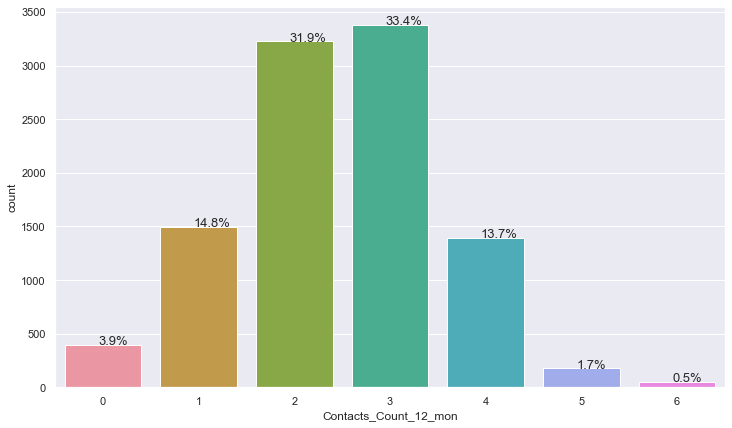
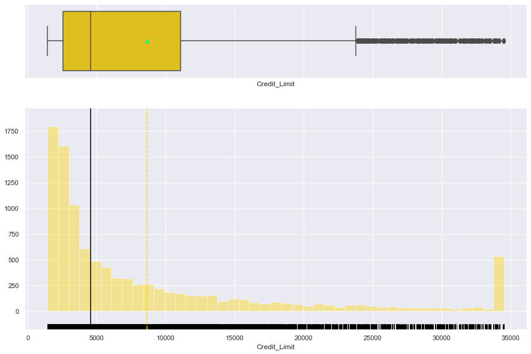
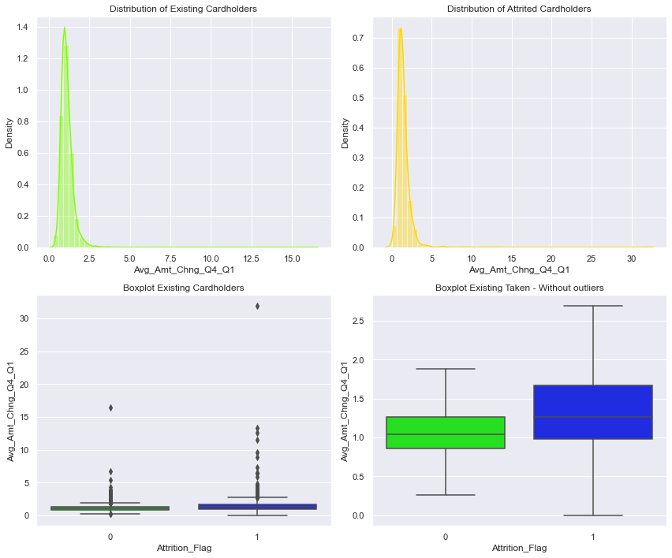

# <span style='color:#ffd400'> Background </span>  
The Thera bank recently saw a steep decline in their number of credit card users, leading to a loss of income. The bank wants to analyze the data of customers and identify the customers who will leave their credit card services. I will develop a classification model that will help the bank improve their services so that customers do not close their credit card accounts.

# <span style='color:#ffd400'> Objective </span>   

1. Explore and visualize the dataset
2. Build a classification model to predict if the customer is going to churn or not
3. Optimize the model using appropriate techniques
4. Generate a set of insights and recommendations that will help the bank

# <span style='color:#ffd400'> Data Dictionary </span>

Customer details:
* CLIENTNUM: Client number. Unique identifier for the customer holding the account
* Attrition_Flag: Internal event (customer activity) variable - if the account is closed then 1 else 0
* Customer_Age: Age in Years
* Gender: Gender of the account holder
* Dependent_count: Number of dependents
* Education_Level: Educational Qualification of the account holder
* Marital_Status: Marital Status of the account holder
* Income_Category: Annual Income Category of the account holder
* Card_Category: Type of Card
* Months_on_book: Period of relationship with the bank
* Total_Relationship_Count: Total no. of products held by the customer
* Months_Inactive_12_mon: No. of months inactive in the last 12 months
* Contacts_Count_12_mon: No. of Contacts in the last 12 months
* Credit_Limit: Credit Limit on the Credit Card
* Total_Revolving_Bal: Total Revolving Balance on the Credit Card
* Avg_Open_To_Buy: Open to Buy Credit Line (Average of last 12 months)
* Total_Amt_Chng_Q4_Q1: Change in Transaction Amount (Q4 over Q1)
* Total_Trans_Amt: Total Transaction Amount (Last 12 months)
* Total_Trans_Ct: Total Transaction Count (Last 12 months)
* Total_Ct_Chng_Q4_Q1: Change in Transaction Count (Q4 over Q1)
* Avg_Utilization_Ratio: Average Card Utilization Ratio

***

# <span style='color:#009dff'> Notebook Setup </span>
In this section:
* Import libraries and adjust settings
* Import the dataset
* Get an initial understanding of the dataset by looking at its shape, viewing some rows, and viewing a summary of the data


```python
# import necessary libraries

# libraries for reading and manipulating data
import pandas as pd
import numpy as np
pd.set_option('display.max_rows', None)
pd.set_option('display.max_columns', None)

# libraries for visualization
import matplotlib.pyplot as plt 
%matplotlib inline
import seaborn as sns
sns.set(color_codes=True)

# Libraries to split data
from sklearn.model_selection import train_test_split, StratifiedKFold, cross_val_score

# Libraries to Up Sample
from imblearn.over_sampling import SMOTE

# Libraries to tune model, get different metric scores
import statsmodels.stats.api as sms
from statsmodels.stats.outliers_influence import variance_inflation_factor
from sklearn.metrics import confusion_matrix, classification_report
from sklearn.metrics import accuracy_score, precision_score, recall_score, r2_score, f1_score
from sklearn import metrics
from sklearn.preprocessing import LabelEncoder
from sklearn.impute import KNNImputer
from sklearn.preprocessing import StandardScaler
from sklearn.model_selection import GridSearchCV, RandomizedSearchCV
from sklearn.pipeline import Pipeline, make_pipeline
from sklearn.linear_model import LogisticRegression
from sklearn.linear_model import Ridge
from sklearn.linear_model import Lasso
from sklearn.tree import DecisionTreeClassifier
from sklearn.ensemble import (
    AdaBoostClassifier,
    GradientBoostingClassifier,
    RandomForestClassifier,
)
from xgboost import XGBClassifier

# ignore warnings
import warnings
warnings.filterwarnings('ignore')
```


```python
# set seaborn color palette
sns.set_palette(palette='hsv')
```

### Import the dataset


```python
# import the dataset and create a working copy
bank_churners = pd.read_csv('BankChurners.csv')
data = bank_churners.copy()
```

###  View the shape of the dataset


```python
# display the shape using an f-string
print(f'There are {data.shape[0]} rows and {data.shape[1]} columns.')
```

    There are 10127 rows and 21 columns.


### View some rows of the dataset


```python
# look at the first five rows
data.head()
```


<div>
<style scoped>
    .dataframe tbody tr th:only-of-type {
        vertical-align: middle;
    }

    .dataframe tbody tr th {
        vertical-align: top;
    }

    .dataframe thead th {
        text-align: right;
    }
</style>
<table border="1" class="dataframe">
  <thead>
    <tr style="text-align: right;">
      <th></th>
      <th>CLIENTNUM</th>
      <th>Attrition_Flag</th>
      <th>Customer_Age</th>
      <th>Gender</th>
      <th>Dependent_count</th>
      <th>Education_Level</th>
      <th>Marital_Status</th>
      <th>Income_Category</th>
      <th>Card_Category</th>
      <th>Months_on_book</th>
      <th>Total_Relationship_Count</th>
      <th>Months_Inactive_12_mon</th>
      <th>Contacts_Count_12_mon</th>
      <th>Credit_Limit</th>
      <th>Total_Revolving_Bal</th>
      <th>Avg_Open_To_Buy</th>
      <th>Total_Amt_Chng_Q4_Q1</th>
      <th>Total_Trans_Amt</th>
      <th>Total_Trans_Ct</th>
      <th>Total_Ct_Chng_Q4_Q1</th>
      <th>Avg_Utilization_Ratio</th>
    </tr>
  </thead>
  <tbody>
    <tr>
      <th>0</th>
      <td>768805383</td>
      <td>Existing Customer</td>
      <td>45</td>
      <td>M</td>
      <td>3</td>
      <td>High School</td>
      <td>Married</td>
      <td>$60K - $80K</td>
      <td>Blue</td>
      <td>39</td>
      <td>5</td>
      <td>1</td>
      <td>3</td>
      <td>12691.0</td>
      <td>777</td>
      <td>11914.0</td>
      <td>1.335</td>
      <td>1144</td>
      <td>42</td>
      <td>1.625</td>
      <td>0.061</td>
    </tr>
    <tr>
      <th>1</th>
      <td>818770008</td>
      <td>Existing Customer</td>
      <td>49</td>
      <td>F</td>
      <td>5</td>
      <td>Graduate</td>
      <td>Single</td>
      <td>Less than $40K</td>
      <td>Blue</td>
      <td>44</td>
      <td>6</td>
      <td>1</td>
      <td>2</td>
      <td>8256.0</td>
      <td>864</td>
      <td>7392.0</td>
      <td>1.541</td>
      <td>1291</td>
      <td>33</td>
      <td>3.714</td>
      <td>0.105</td>
    </tr>
    <tr>
      <th>2</th>
      <td>713982108</td>
      <td>Existing Customer</td>
      <td>51</td>
      <td>M</td>
      <td>3</td>
      <td>Graduate</td>
      <td>Married</td>
      <td>$80K - $120K</td>
      <td>Blue</td>
      <td>36</td>
      <td>4</td>
      <td>1</td>
      <td>0</td>
      <td>3418.0</td>
      <td>0</td>
      <td>3418.0</td>
      <td>2.594</td>
      <td>1887</td>
      <td>20</td>
      <td>2.333</td>
      <td>0.000</td>
    </tr>
    <tr>
      <th>3</th>
      <td>769911858</td>
      <td>Existing Customer</td>
      <td>40</td>
      <td>F</td>
      <td>4</td>
      <td>High School</td>
      <td>Unknown</td>
      <td>Less than $40K</td>
      <td>Blue</td>
      <td>34</td>
      <td>3</td>
      <td>4</td>
      <td>1</td>
      <td>3313.0</td>
      <td>2517</td>
      <td>796.0</td>
      <td>1.405</td>
      <td>1171</td>
      <td>20</td>
      <td>2.333</td>
      <td>0.760</td>
    </tr>
    <tr>
      <th>4</th>
      <td>709106358</td>
      <td>Existing Customer</td>
      <td>40</td>
      <td>M</td>
      <td>3</td>
      <td>Uneducated</td>
      <td>Married</td>
      <td>$60K - $80K</td>
      <td>Blue</td>
      <td>21</td>
      <td>5</td>
      <td>1</td>
      <td>0</td>
      <td>4716.0</td>
      <td>0</td>
      <td>4716.0</td>
      <td>2.175</td>
      <td>816</td>
      <td>28</td>
      <td>2.500</td>
      <td>0.000</td>
    </tr>
  </tbody>
</table>
</div>


```python
# look at five random rows
# set random seed so we see the same random results every time
np.random.seed(1)
data.sample(n=5)
```


<div>
<style scoped>
    .dataframe tbody tr th:only-of-type {
        vertical-align: middle;
    }

    .dataframe tbody tr th {
        vertical-align: top;
    }

    .dataframe thead th {
        text-align: right;
    }
</style>
<table border="1" class="dataframe">
  <thead>
    <tr style="text-align: right;">
      <th></th>
      <th>CLIENTNUM</th>
      <th>Attrition_Flag</th>
      <th>Customer_Age</th>
      <th>Gender</th>
      <th>Dependent_count</th>
      <th>Education_Level</th>
      <th>Marital_Status</th>
      <th>Income_Category</th>
      <th>Card_Category</th>
      <th>Months_on_book</th>
      <th>Total_Relationship_Count</th>
      <th>Months_Inactive_12_mon</th>
      <th>Contacts_Count_12_mon</th>
      <th>Credit_Limit</th>
      <th>Total_Revolving_Bal</th>
      <th>Avg_Open_To_Buy</th>
      <th>Total_Amt_Chng_Q4_Q1</th>
      <th>Total_Trans_Amt</th>
      <th>Total_Trans_Ct</th>
      <th>Total_Ct_Chng_Q4_Q1</th>
      <th>Avg_Utilization_Ratio</th>
    </tr>
  </thead>
  <tbody>
    <tr>
      <th>6498</th>
      <td>712389108</td>
      <td>Existing Customer</td>
      <td>43</td>
      <td>F</td>
      <td>2</td>
      <td>Graduate</td>
      <td>Married</td>
      <td>Less than $40K</td>
      <td>Blue</td>
      <td>36</td>
      <td>6</td>
      <td>3</td>
      <td>2</td>
      <td>2570.0</td>
      <td>2107</td>
      <td>463.0</td>
      <td>0.651</td>
      <td>4058</td>
      <td>83</td>
      <td>0.766</td>
      <td>0.820</td>
    </tr>
    <tr>
      <th>9013</th>
      <td>718388733</td>
      <td>Existing Customer</td>
      <td>38</td>
      <td>F</td>
      <td>1</td>
      <td>College</td>
      <td>Unknown</td>
      <td>Less than $40K</td>
      <td>Blue</td>
      <td>32</td>
      <td>2</td>
      <td>3</td>
      <td>3</td>
      <td>2609.0</td>
      <td>1259</td>
      <td>1350.0</td>
      <td>0.871</td>
      <td>8677</td>
      <td>96</td>
      <td>0.627</td>
      <td>0.483</td>
    </tr>
    <tr>
      <th>2053</th>
      <td>710109633</td>
      <td>Existing Customer</td>
      <td>39</td>
      <td>M</td>
      <td>2</td>
      <td>College</td>
      <td>Married</td>
      <td>$60K - $80K</td>
      <td>Blue</td>
      <td>31</td>
      <td>6</td>
      <td>3</td>
      <td>2</td>
      <td>9871.0</td>
      <td>1061</td>
      <td>8810.0</td>
      <td>0.545</td>
      <td>1683</td>
      <td>34</td>
      <td>0.478</td>
      <td>0.107</td>
    </tr>
    <tr>
      <th>3211</th>
      <td>717331758</td>
      <td>Existing Customer</td>
      <td>44</td>
      <td>M</td>
      <td>4</td>
      <td>Graduate</td>
      <td>Married</td>
      <td>$120K +</td>
      <td>Blue</td>
      <td>32</td>
      <td>6</td>
      <td>3</td>
      <td>4</td>
      <td>34516.0</td>
      <td>2517</td>
      <td>31999.0</td>
      <td>0.765</td>
      <td>4228</td>
      <td>83</td>
      <td>0.596</td>
      <td>0.073</td>
    </tr>
    <tr>
      <th>5559</th>
      <td>709460883</td>
      <td>Attrited Customer</td>
      <td>38</td>
      <td>F</td>
      <td>2</td>
      <td>Doctorate</td>
      <td>Married</td>
      <td>Less than $40K</td>
      <td>Blue</td>
      <td>28</td>
      <td>5</td>
      <td>2</td>
      <td>4</td>
      <td>1614.0</td>
      <td>0</td>
      <td>1614.0</td>
      <td>0.609</td>
      <td>2437</td>
      <td>46</td>
      <td>0.438</td>
      <td>0.000</td>
    </tr>
  </tbody>
</table>
</div>


```python
# look at the last five rows
data.tail()
```


<div>
<style scoped>
    .dataframe tbody tr th:only-of-type {
        vertical-align: middle;
    }

    .dataframe tbody tr th {
        vertical-align: top;
    }

    .dataframe thead th {
        text-align: right;
    }
</style>
<table border="1" class="dataframe">
  <thead>
    <tr style="text-align: right;">
      <th></th>
      <th>CLIENTNUM</th>
      <th>Attrition_Flag</th>
      <th>Customer_Age</th>
      <th>Gender</th>
      <th>Dependent_count</th>
      <th>Education_Level</th>
      <th>Marital_Status</th>
      <th>Income_Category</th>
      <th>Card_Category</th>
      <th>Months_on_book</th>
      <th>Total_Relationship_Count</th>
      <th>Months_Inactive_12_mon</th>
      <th>Contacts_Count_12_mon</th>
      <th>Credit_Limit</th>
      <th>Total_Revolving_Bal</th>
      <th>Avg_Open_To_Buy</th>
      <th>Total_Amt_Chng_Q4_Q1</th>
      <th>Total_Trans_Amt</th>
      <th>Total_Trans_Ct</th>
      <th>Total_Ct_Chng_Q4_Q1</th>
      <th>Avg_Utilization_Ratio</th>
    </tr>
  </thead>
  <tbody>
    <tr>
      <th>10122</th>
      <td>772366833</td>
      <td>Existing Customer</td>
      <td>50</td>
      <td>M</td>
      <td>2</td>
      <td>Graduate</td>
      <td>Single</td>
      <td>$40K - $60K</td>
      <td>Blue</td>
      <td>40</td>
      <td>3</td>
      <td>2</td>
      <td>3</td>
      <td>4003.0</td>
      <td>1851</td>
      <td>2152.0</td>
      <td>0.703</td>
      <td>15476</td>
      <td>117</td>
      <td>0.857</td>
      <td>0.462</td>
    </tr>
    <tr>
      <th>10123</th>
      <td>710638233</td>
      <td>Attrited Customer</td>
      <td>41</td>
      <td>M</td>
      <td>2</td>
      <td>Unknown</td>
      <td>Divorced</td>
      <td>$40K - $60K</td>
      <td>Blue</td>
      <td>25</td>
      <td>4</td>
      <td>2</td>
      <td>3</td>
      <td>4277.0</td>
      <td>2186</td>
      <td>2091.0</td>
      <td>0.804</td>
      <td>8764</td>
      <td>69</td>
      <td>0.683</td>
      <td>0.511</td>
    </tr>
    <tr>
      <th>10124</th>
      <td>716506083</td>
      <td>Attrited Customer</td>
      <td>44</td>
      <td>F</td>
      <td>1</td>
      <td>High School</td>
      <td>Married</td>
      <td>Less than $40K</td>
      <td>Blue</td>
      <td>36</td>
      <td>5</td>
      <td>3</td>
      <td>4</td>
      <td>5409.0</td>
      <td>0</td>
      <td>5409.0</td>
      <td>0.819</td>
      <td>10291</td>
      <td>60</td>
      <td>0.818</td>
      <td>0.000</td>
    </tr>
    <tr>
      <th>10125</th>
      <td>717406983</td>
      <td>Attrited Customer</td>
      <td>30</td>
      <td>M</td>
      <td>2</td>
      <td>Graduate</td>
      <td>Unknown</td>
      <td>$40K - $60K</td>
      <td>Blue</td>
      <td>36</td>
      <td>4</td>
      <td>3</td>
      <td>3</td>
      <td>5281.0</td>
      <td>0</td>
      <td>5281.0</td>
      <td>0.535</td>
      <td>8395</td>
      <td>62</td>
      <td>0.722</td>
      <td>0.000</td>
    </tr>
    <tr>
      <th>10126</th>
      <td>714337233</td>
      <td>Attrited Customer</td>
      <td>43</td>
      <td>F</td>
      <td>2</td>
      <td>Graduate</td>
      <td>Married</td>
      <td>Less than $40K</td>
      <td>Silver</td>
      <td>25</td>
      <td>6</td>
      <td>2</td>
      <td>4</td>
      <td>10388.0</td>
      <td>1961</td>
      <td>8427.0</td>
      <td>0.703</td>
      <td>10294</td>
      <td>61</td>
      <td>0.649</td>
      <td>0.189</td>
    </tr>
  </tbody>
</table>
</div>


### Summary of the data


```python
data.describe(include='all').T
```


<div>
<style scoped>
    .dataframe tbody tr th:only-of-type {
        vertical-align: middle;
    }

    .dataframe tbody tr th {
        vertical-align: top;
    }

    .dataframe thead th {
        text-align: right;
    }
</style>
<table border="1" class="dataframe">
  <thead>
    <tr style="text-align: right;">
      <th></th>
      <th>count</th>
      <th>unique</th>
      <th>top</th>
      <th>freq</th>
      <th>mean</th>
      <th>std</th>
      <th>min</th>
      <th>25%</th>
      <th>50%</th>
      <th>75%</th>
      <th>max</th>
    </tr>
  </thead>
  <tbody>
    <tr>
      <th>CLIENTNUM</th>
      <td>10127</td>
      <td>NaN</td>
      <td>NaN</td>
      <td>NaN</td>
      <td>7.39178e+08</td>
      <td>3.69038e+07</td>
      <td>7.08082e+08</td>
      <td>7.13037e+08</td>
      <td>7.17926e+08</td>
      <td>7.73144e+08</td>
      <td>8.28343e+08</td>
    </tr>
    <tr>
      <th>Attrition_Flag</th>
      <td>10127</td>
      <td>2</td>
      <td>Existing Customer</td>
      <td>8500</td>
      <td>NaN</td>
      <td>NaN</td>
      <td>NaN</td>
      <td>NaN</td>
      <td>NaN</td>
      <td>NaN</td>
      <td>NaN</td>
    </tr>
    <tr>
      <th>Customer_Age</th>
      <td>10127</td>
      <td>NaN</td>
      <td>NaN</td>
      <td>NaN</td>
      <td>46.326</td>
      <td>8.01681</td>
      <td>26</td>
      <td>41</td>
      <td>46</td>
      <td>52</td>
      <td>73</td>
    </tr>
    <tr>
      <th>Gender</th>
      <td>10127</td>
      <td>2</td>
      <td>F</td>
      <td>5358</td>
      <td>NaN</td>
      <td>NaN</td>
      <td>NaN</td>
      <td>NaN</td>
      <td>NaN</td>
      <td>NaN</td>
      <td>NaN</td>
    </tr>
    <tr>
      <th>Dependent_count</th>
      <td>10127</td>
      <td>NaN</td>
      <td>NaN</td>
      <td>NaN</td>
      <td>2.3462</td>
      <td>1.29891</td>
      <td>0</td>
      <td>1</td>
      <td>2</td>
      <td>3</td>
      <td>5</td>
    </tr>
    <tr>
      <th>Education_Level</th>
      <td>10127</td>
      <td>7</td>
      <td>Graduate</td>
      <td>3128</td>
      <td>NaN</td>
      <td>NaN</td>
      <td>NaN</td>
      <td>NaN</td>
      <td>NaN</td>
      <td>NaN</td>
      <td>NaN</td>
    </tr>
    <tr>
      <th>Marital_Status</th>
      <td>10127</td>
      <td>4</td>
      <td>Married</td>
      <td>4687</td>
      <td>NaN</td>
      <td>NaN</td>
      <td>NaN</td>
      <td>NaN</td>
      <td>NaN</td>
      <td>NaN</td>
      <td>NaN</td>
    </tr>
    <tr>
      <th>Income_Category</th>
      <td>10127</td>
      <td>6</td>
      <td>Less than $40K</td>
      <td>3561</td>
      <td>NaN</td>
      <td>NaN</td>
      <td>NaN</td>
      <td>NaN</td>
      <td>NaN</td>
      <td>NaN</td>
      <td>NaN</td>
    </tr>
    <tr>
      <th>Card_Category</th>
      <td>10127</td>
      <td>4</td>
      <td>Blue</td>
      <td>9436</td>
      <td>NaN</td>
      <td>NaN</td>
      <td>NaN</td>
      <td>NaN</td>
      <td>NaN</td>
      <td>NaN</td>
      <td>NaN</td>
    </tr>
    <tr>
      <th>Months_on_book</th>
      <td>10127</td>
      <td>NaN</td>
      <td>NaN</td>
      <td>NaN</td>
      <td>35.9284</td>
      <td>7.98642</td>
      <td>13</td>
      <td>31</td>
      <td>36</td>
      <td>40</td>
      <td>56</td>
    </tr>
    <tr>
      <th>Total_Relationship_Count</th>
      <td>10127</td>
      <td>NaN</td>
      <td>NaN</td>
      <td>NaN</td>
      <td>3.81258</td>
      <td>1.55441</td>
      <td>1</td>
      <td>3</td>
      <td>4</td>
      <td>5</td>
      <td>6</td>
    </tr>
    <tr>
      <th>Months_Inactive_12_mon</th>
      <td>10127</td>
      <td>NaN</td>
      <td>NaN</td>
      <td>NaN</td>
      <td>2.34117</td>
      <td>1.01062</td>
      <td>0</td>
      <td>2</td>
      <td>2</td>
      <td>3</td>
      <td>6</td>
    </tr>
    <tr>
      <th>Contacts_Count_12_mon</th>
      <td>10127</td>
      <td>NaN</td>
      <td>NaN</td>
      <td>NaN</td>
      <td>2.45532</td>
      <td>1.10623</td>
      <td>0</td>
      <td>2</td>
      <td>2</td>
      <td>3</td>
      <td>6</td>
    </tr>
    <tr>
      <th>Credit_Limit</th>
      <td>10127</td>
      <td>NaN</td>
      <td>NaN</td>
      <td>NaN</td>
      <td>8631.95</td>
      <td>9088.78</td>
      <td>1438.3</td>
      <td>2555</td>
      <td>4549</td>
      <td>11067.5</td>
      <td>34516</td>
    </tr>
    <tr>
      <th>Total_Revolving_Bal</th>
      <td>10127</td>
      <td>NaN</td>
      <td>NaN</td>
      <td>NaN</td>
      <td>1162.81</td>
      <td>814.987</td>
      <td>0</td>
      <td>359</td>
      <td>1276</td>
      <td>1784</td>
      <td>2517</td>
    </tr>
    <tr>
      <th>Avg_Open_To_Buy</th>
      <td>10127</td>
      <td>NaN</td>
      <td>NaN</td>
      <td>NaN</td>
      <td>7469.14</td>
      <td>9090.69</td>
      <td>3</td>
      <td>1324.5</td>
      <td>3474</td>
      <td>9859</td>
      <td>34516</td>
    </tr>
    <tr>
      <th>Total_Amt_Chng_Q4_Q1</th>
      <td>10127</td>
      <td>NaN</td>
      <td>NaN</td>
      <td>NaN</td>
      <td>0.759941</td>
      <td>0.219207</td>
      <td>0</td>
      <td>0.631</td>
      <td>0.736</td>
      <td>0.859</td>
      <td>3.397</td>
    </tr>
    <tr>
      <th>Total_Trans_Amt</th>
      <td>10127</td>
      <td>NaN</td>
      <td>NaN</td>
      <td>NaN</td>
      <td>4404.09</td>
      <td>3397.13</td>
      <td>510</td>
      <td>2155.5</td>
      <td>3899</td>
      <td>4741</td>
      <td>18484</td>
    </tr>
    <tr>
      <th>Total_Trans_Ct</th>
      <td>10127</td>
      <td>NaN</td>
      <td>NaN</td>
      <td>NaN</td>
      <td>64.8587</td>
      <td>23.4726</td>
      <td>10</td>
      <td>45</td>
      <td>67</td>
      <td>81</td>
      <td>139</td>
    </tr>
    <tr>
      <th>Total_Ct_Chng_Q4_Q1</th>
      <td>10127</td>
      <td>NaN</td>
      <td>NaN</td>
      <td>NaN</td>
      <td>0.712222</td>
      <td>0.238086</td>
      <td>0</td>
      <td>0.582</td>
      <td>0.702</td>
      <td>0.818</td>
      <td>3.714</td>
    </tr>
    <tr>
      <th>Avg_Utilization_Ratio</th>
      <td>10127</td>
      <td>NaN</td>
      <td>NaN</td>
      <td>NaN</td>
      <td>0.274894</td>
      <td>0.275691</td>
      <td>0</td>
      <td>0.023</td>
      <td>0.176</td>
      <td>0.503</td>
      <td>0.999</td>
    </tr>
  </tbody>
</table>
</div>


* Customers are aged 26 to 73, with a central tendency near 46 years old
* Credit Limit has a mean ~8600 dollars, compared to a 3500 dollar median, indicating a skew 
* The Utilization Ratio ranges from 0 to 0.999, showing that customers use their available credit in different ways
* There is data about both Total Transaction Amounts and Total Transaction Counts – this could be used to find the average transaction amount. Revisit this idea during feature engineering.

***
# <span style='color:#009dff'> Data Pre-Processing </span>
In this section:
* Prepare the data for analysis
* If necessary, treat missing and incorrect values
* Fix data types
* Feature engineering

### Check for missing values


```python
# look at which columns have the most missing values
data.isnull().sum().sort_values(ascending=False)
```


    Avg_Utilization_Ratio       0
    Months_on_book              0
    Attrition_Flag              0
    Customer_Age                0
    Gender                      0
    Dependent_count             0
    Education_Level             0
    Marital_Status              0
    Income_Category             0
    Card_Category               0
    Total_Relationship_Count    0
    Total_Ct_Chng_Q4_Q1         0
    Months_Inactive_12_mon      0
    Contacts_Count_12_mon       0
    Credit_Limit                0
    Total_Revolving_Bal         0
    Avg_Open_To_Buy             0
    Total_Amt_Chng_Q4_Q1        0
    Total_Trans_Amt             0
    Total_Trans_Ct              0
    CLIENTNUM                   0
    dtype: int64


* No missing values were found

### Drop columns


```python
# drop CLIENTNUM column as it doesn't give us any useful data
data.drop(['CLIENTNUM'],axis=1,inplace=True)
```

### Check for incorrect or garbage values


```python
# look at the number of unique values in each column
data.nunique().sort_values()
```


    Attrition_Flag                 2
    Gender                         2
    Card_Category                  4
    Marital_Status                 4
    Income_Category                6
    Total_Relationship_Count       6
    Dependent_count                6
    Months_Inactive_12_mon         7
    Contacts_Count_12_mon          7
    Education_Level                7
    Months_on_book                44
    Customer_Age                  45
    Total_Trans_Ct               126
    Total_Ct_Chng_Q4_Q1          830
    Avg_Utilization_Ratio        964
    Total_Amt_Chng_Q4_Q1        1158
    Total_Revolving_Bal         1974
    Total_Trans_Amt             5033
    Credit_Limit                6205
    Avg_Open_To_Buy             6813
    dtype: int64


```python
# Display the value counts for columns with a limited set of values (mostly categorical values)

# List the variables
cat_col = [
    "Attrition_Flag",
    "Gender",
    "Card_Category",
    "Marital_Status",
    "Income_Category",
    "Total_Relationship_Count",
    "Dependent_count",    
    "Months_Inactive_12_mon",
    "Contacts_Count_12_mon",   
    "Education_Level",     
]

# Print the number of unique values in each column
for column in cat_col:
    print(data[column].value_counts())
    print("-" * 40)
```

    Existing Customer    8500
    Attrited Customer    1627
    Name: Attrition_Flag, dtype: int64
    ----------------------------------------
    F    5358
    M    4769
    Name: Gender, dtype: int64
    ----------------------------------------
    Blue        9436
    Silver       555
    Gold         116
    Platinum      20
    Name: Card_Category, dtype: int64
    ----------------------------------------
    Married     4687
    Single      3943
    Unknown      749
    Divorced     748
    Name: Marital_Status, dtype: int64
    ----------------------------------------
    Less than $40K    3561
    $40K - $60K       1790
    $80K - $120K      1535
    $60K - $80K       1402
    Unknown           1112
    $120K +            727
    Name: Income_Category, dtype: int64
    ----------------------------------------
    3    2305
    4    1912
    5    1891
    6    1866
    2    1243
    1     910
    Name: Total_Relationship_Count, dtype: int64
    ----------------------------------------
    3    2732
    2    2655
    1    1838
    4    1574
    0     904
    5     424
    Name: Dependent_count, dtype: int64
    ----------------------------------------
    3    3846
    2    3282
    1    2233
    4     435
    5     178
    6     124
    0      29
    Name: Months_Inactive_12_mon, dtype: int64
    ----------------------------------------
    3    3380
    2    3227
    1    1499
    4    1392
    0     399
    5     176
    6      54
    Name: Contacts_Count_12_mon, dtype: int64
    ----------------------------------------
    Graduate         3128
    High School      2013
    Unknown          1519
    Uneducated       1487
    College          1013
    Post-Graduate     516
    Doctorate         451
    Name: Education_Level, dtype: int64
    ----------------------------------------


* There is an category for "Unknown" values in three categories: Marital_Status, Income_Category, and Education_Level
* I'm going to change the "Unknown" values so that they are flagged as missing
* No other incorrect or garbage values found


```python
# Change 'Unknown' values to 'None' so that they will be recognized as null values
# I will impute these later on in the modeling stage

data['Marital_Status'] = data['Marital_Status'].replace(['Unknown'], [None])
data['Income_Category'] = data['Income_Category'].replace(['Unknown'], [None])
data['Education_Level'] = data['Education_Level'].replace(['Unknown'], [None])
```

### Strip White Space


```python
# Some of the string objects have white space that I'd like to remove

data['Attrition_Flag'] = data['Attrition_Flag'].str.replace(' ', '')
data['Income_Category'] = data['Income_Category'].str.replace(' ', '')
data['Education_Level'] = data['Education_Level'].str.replace(' ', '')
```

### Feature Engineering
* I think we can extract further relevant information from our data set
* I'm going to create 7 new columns
* The goal is to help reveal more insight about the transaction amounts and averages, as well as credit-to-income ratios


```python
# Create a new column to see the Average Transaction Amount

data['Avg_Amt_per_Trans'] = data.apply(lambda row: (row.Total_Trans_Amt / row.Total_Trans_Ct)
                                   if row.Total_Trans_Ct != 0 else 0, axis = 1)
```


```python
# Create a new column to see the Monthly Average Transaction Amount during Active Months

data['Active_Month_Trans_Amt_Avg'] = data.apply(lambda row: (row.Total_Trans_Amt / (12 - row.Months_Inactive_12_mon))
                                            if (12 - row.Months_Inactive_12_mon) != 0 else 0, axis = 1)
```


```python
# Create a new column to see the Monthly Average Transaction Count during Active Months

data['Active_Month_Trans_Amt_Ct'] = data.apply(lambda row: (row.Total_Trans_Ct / (12 - row.Months_Inactive_12_mon))
                                            if (12 - row.Months_Inactive_12_mon) != 0 else 0, axis = 1)
```


```python
# Create a new column to see the Average Amount Changed between Q4 and Q1

data['Avg_Amt_Chng_Q4_Q1'] = data.apply(lambda row: (row.Total_Amt_Chng_Q4_Q1 / row.Total_Ct_Chng_Q4_Q1)
                                        if row.Total_Ct_Chng_Q4_Q1 != 0 else 0, axis = 1)
```


```python
# Create a new column to see the Average Monthly Spend per Person (Cardholder + Dependents)

data['Avg_Monthly_Spend_per_Person'] = data.apply(lambda row: (row.Active_Month_Trans_Amt_Avg / (1 + row.Dependent_count)), axis = 1)
```


```python
# Function to return an integer income estimate based on Income_Category

def income(df):
    if df['Income_Category'] == 'None':
        return float('NaN')
    elif df['Income_Category'] == 'Lessthan$40K':
        return 30000
    elif df['Income_Category'] == '$40K-$60K':
        return 50000
    elif df['Income_Category'] == '$60K-$80K':
        return 70000
    elif df['Income_Category'] == '$80K-$120K':
        return 100000
    elif df['Income_Category'] == '$120K+':
        return 130000
```


```python
# Create two new columns:
    # the cardholder's Credit Limit to Income Ratio
    # the cardholder's Revolving Balance to Income Ratio

# We estimate the customer's income based on their Income_Category

data['Income_Estimate'] = data.apply(income, axis=1)

data['Credit_to_Income_Ratio'] = data.apply(lambda row: (row.Credit_Limit / row.Income_Estimate)
                                   if row.Total_Trans_Ct != 0 else 0, axis = 1)

data['Balance_to_Income_Ratio'] = data.apply(lambda row: (row.Total_Revolving_Bal / row.Income_Estimate)
                                   if row.Total_Trans_Ct != 0 else 0, axis = 1)

# Drop this column after using it to create Credit_to_Income_Ratio
data.drop(['Income_Estimate'],axis=1,inplace=True)
```

### Check the data types for each column


```python
data.info()
```

    <class 'pandas.core.frame.DataFrame'>
    RangeIndex: 10127 entries, 0 to 10126
    Data columns (total 27 columns):
     #   Column                        Non-Null Count  Dtype  
    ---  ------                        --------------  -----  
     0   Attrition_Flag                10127 non-null  object 
     1   Customer_Age                  10127 non-null  int64  
     2   Gender                        10127 non-null  object 
     3   Dependent_count               10127 non-null  int64  
     4   Education_Level               8608 non-null   object 
     5   Marital_Status                9378 non-null   object 
     6   Income_Category               9015 non-null   object 
     7   Card_Category                 10127 non-null  object 
     8   Months_on_book                10127 non-null  int64  
     9   Total_Relationship_Count      10127 non-null  int64  
     10  Months_Inactive_12_mon        10127 non-null  int64  
     11  Contacts_Count_12_mon         10127 non-null  int64  
     12  Credit_Limit                  10127 non-null  float64
     13  Total_Revolving_Bal           10127 non-null  int64  
     14  Avg_Open_To_Buy               10127 non-null  float64
     15  Total_Amt_Chng_Q4_Q1          10127 non-null  float64
     16  Total_Trans_Amt               10127 non-null  int64  
     17  Total_Trans_Ct                10127 non-null  int64  
     18  Total_Ct_Chng_Q4_Q1           10127 non-null  float64
     19  Avg_Utilization_Ratio         10127 non-null  float64
     20  Avg_Amt_per_Trans             10127 non-null  float64
     21  Active_Month_Trans_Amt_Avg    10127 non-null  float64
     22  Active_Month_Trans_Amt_Ct     10127 non-null  float64
     23  Avg_Amt_Chng_Q4_Q1            10127 non-null  float64
     24  Avg_Monthly_Spend_per_Person  10127 non-null  float64
     25  Credit_to_Income_Ratio        9015 non-null   float64
     26  Balance_to_Income_Ratio       9015 non-null   float64
    dtypes: float64(12), int64(9), object(6)
    memory usage: 2.1+ MB


* We now see the missing values after changing the 'Unknown' values
* 6 columns are objects; these should be changed to categories
* There are a couple of columns that are floats, yet they don't need to be. They could be changed to integers to save space.

### Change Attrition_Flag
* The data dictionary says "if the account is closed then 1 else 0", but the column has values "ExistingCustomer" and "AttritedCustomer". I'm going to change this to match the data dictionary description.


```python
# Set open accounts to 0 and closed accounts equal to 1
data.loc[data['Attrition_Flag']=='ExistingCustomer', 'Attrition_Flag'] = 0
data.loc[data['Attrition_Flag']=='AttritedCustomer', 'Attrition_Flag'] = 1
```


```python
# Change Attrition_Flag to int
data['Attrition_Flag'] = data['Attrition_Flag'].astype('int')
```

### Change floats to integers


```python
data['Credit_Limit'] = data['Credit_Limit'].astype('int')
data['Avg_Open_To_Buy'] = data['Avg_Open_To_Buy'].astype('int')
```

### Change objects to categories


```python
data['Gender'] = data['Gender'].astype('category')
data['Education_Level'] = data['Education_Level'].astype('category')
data['Marital_Status'] = data['Marital_Status'].astype('category')
data['Income_Category'] = data['Income_Category'].astype('category')
data['Card_Category'] = data['Card_Category'].astype('category')
```

### Summarize the data again after processing


```python
# Show the datatypes
data.info()
```

    <class 'pandas.core.frame.DataFrame'>
    RangeIndex: 10127 entries, 0 to 10126
    Data columns (total 27 columns):
     #   Column                        Non-Null Count  Dtype   
    ---  ------                        --------------  -----   
     0   Attrition_Flag                10127 non-null  int64   
     1   Customer_Age                  10127 non-null  int64   
     2   Gender                        10127 non-null  category
     3   Dependent_count               10127 non-null  int64   
     4   Education_Level               8608 non-null   category
     5   Marital_Status                9378 non-null   category
     6   Income_Category               9015 non-null   category
     7   Card_Category                 10127 non-null  category
     8   Months_on_book                10127 non-null  int64   
     9   Total_Relationship_Count      10127 non-null  int64   
     10  Months_Inactive_12_mon        10127 non-null  int64   
     11  Contacts_Count_12_mon         10127 non-null  int64   
     12  Credit_Limit                  10127 non-null  int64   
     13  Total_Revolving_Bal           10127 non-null  int64   
     14  Avg_Open_To_Buy               10127 non-null  int64   
     15  Total_Amt_Chng_Q4_Q1          10127 non-null  float64 
     16  Total_Trans_Amt               10127 non-null  int64   
     17  Total_Trans_Ct                10127 non-null  int64   
     18  Total_Ct_Chng_Q4_Q1           10127 non-null  float64 
     19  Avg_Utilization_Ratio         10127 non-null  float64 
     20  Avg_Amt_per_Trans             10127 non-null  float64 
     21  Active_Month_Trans_Amt_Avg    10127 non-null  float64 
     22  Active_Month_Trans_Amt_Ct     10127 non-null  float64 
     23  Avg_Amt_Chng_Q4_Q1            10127 non-null  float64 
     24  Avg_Monthly_Spend_per_Person  10127 non-null  float64 
     25  Credit_to_Income_Ratio        9015 non-null   float64 
     26  Balance_to_Income_Ratio       9015 non-null   float64 
    dtypes: category(5), float64(10), int64(12)
    memory usage: 1.7 MB


```python
data.describe(include='all').T
```


<div>
<style scoped>
    .dataframe tbody tr th:only-of-type {
        vertical-align: middle;
    }

    .dataframe tbody tr th {
        vertical-align: top;
    }

    .dataframe thead th {
        text-align: right;
    }
</style>
<table border="1" class="dataframe">
  <thead>
    <tr style="text-align: right;">
      <th></th>
      <th>count</th>
      <th>unique</th>
      <th>top</th>
      <th>freq</th>
      <th>mean</th>
      <th>std</th>
      <th>min</th>
      <th>25%</th>
      <th>50%</th>
      <th>75%</th>
      <th>max</th>
    </tr>
  </thead>
  <tbody>
    <tr>
      <th>Attrition_Flag</th>
      <td>10127</td>
      <td>NaN</td>
      <td>NaN</td>
      <td>NaN</td>
      <td>0.16066</td>
      <td>0.367235</td>
      <td>0</td>
      <td>0</td>
      <td>0</td>
      <td>0</td>
      <td>1</td>
    </tr>
    <tr>
      <th>Customer_Age</th>
      <td>10127</td>
      <td>NaN</td>
      <td>NaN</td>
      <td>NaN</td>
      <td>46.326</td>
      <td>8.01681</td>
      <td>26</td>
      <td>41</td>
      <td>46</td>
      <td>52</td>
      <td>73</td>
    </tr>
    <tr>
      <th>Gender</th>
      <td>10127</td>
      <td>2</td>
      <td>F</td>
      <td>5358</td>
      <td>NaN</td>
      <td>NaN</td>
      <td>NaN</td>
      <td>NaN</td>
      <td>NaN</td>
      <td>NaN</td>
      <td>NaN</td>
    </tr>
    <tr>
      <th>Dependent_count</th>
      <td>10127</td>
      <td>NaN</td>
      <td>NaN</td>
      <td>NaN</td>
      <td>2.3462</td>
      <td>1.29891</td>
      <td>0</td>
      <td>1</td>
      <td>2</td>
      <td>3</td>
      <td>5</td>
    </tr>
    <tr>
      <th>Education_Level</th>
      <td>8608</td>
      <td>6</td>
      <td>Graduate</td>
      <td>3128</td>
      <td>NaN</td>
      <td>NaN</td>
      <td>NaN</td>
      <td>NaN</td>
      <td>NaN</td>
      <td>NaN</td>
      <td>NaN</td>
    </tr>
    <tr>
      <th>Marital_Status</th>
      <td>9378</td>
      <td>3</td>
      <td>Married</td>
      <td>4687</td>
      <td>NaN</td>
      <td>NaN</td>
      <td>NaN</td>
      <td>NaN</td>
      <td>NaN</td>
      <td>NaN</td>
      <td>NaN</td>
    </tr>
    <tr>
      <th>Income_Category</th>
      <td>9015</td>
      <td>5</td>
      <td>Lessthan$40K</td>
      <td>3561</td>
      <td>NaN</td>
      <td>NaN</td>
      <td>NaN</td>
      <td>NaN</td>
      <td>NaN</td>
      <td>NaN</td>
      <td>NaN</td>
    </tr>
    <tr>
      <th>Card_Category</th>
      <td>10127</td>
      <td>4</td>
      <td>Blue</td>
      <td>9436</td>
      <td>NaN</td>
      <td>NaN</td>
      <td>NaN</td>
      <td>NaN</td>
      <td>NaN</td>
      <td>NaN</td>
      <td>NaN</td>
    </tr>
    <tr>
      <th>Months_on_book</th>
      <td>10127</td>
      <td>NaN</td>
      <td>NaN</td>
      <td>NaN</td>
      <td>35.9284</td>
      <td>7.98642</td>
      <td>13</td>
      <td>31</td>
      <td>36</td>
      <td>40</td>
      <td>56</td>
    </tr>
    <tr>
      <th>Total_Relationship_Count</th>
      <td>10127</td>
      <td>NaN</td>
      <td>NaN</td>
      <td>NaN</td>
      <td>3.81258</td>
      <td>1.55441</td>
      <td>1</td>
      <td>3</td>
      <td>4</td>
      <td>5</td>
      <td>6</td>
    </tr>
    <tr>
      <th>Months_Inactive_12_mon</th>
      <td>10127</td>
      <td>NaN</td>
      <td>NaN</td>
      <td>NaN</td>
      <td>2.34117</td>
      <td>1.01062</td>
      <td>0</td>
      <td>2</td>
      <td>2</td>
      <td>3</td>
      <td>6</td>
    </tr>
    <tr>
      <th>Contacts_Count_12_mon</th>
      <td>10127</td>
      <td>NaN</td>
      <td>NaN</td>
      <td>NaN</td>
      <td>2.45532</td>
      <td>1.10623</td>
      <td>0</td>
      <td>2</td>
      <td>2</td>
      <td>3</td>
      <td>6</td>
    </tr>
    <tr>
      <th>Credit_Limit</th>
      <td>10127</td>
      <td>NaN</td>
      <td>NaN</td>
      <td>NaN</td>
      <td>8631.94</td>
      <td>9088.79</td>
      <td>1438</td>
      <td>2555</td>
      <td>4549</td>
      <td>11067.5</td>
      <td>34516</td>
    </tr>
    <tr>
      <th>Total_Revolving_Bal</th>
      <td>10127</td>
      <td>NaN</td>
      <td>NaN</td>
      <td>NaN</td>
      <td>1162.81</td>
      <td>814.987</td>
      <td>0</td>
      <td>359</td>
      <td>1276</td>
      <td>1784</td>
      <td>2517</td>
    </tr>
    <tr>
      <th>Avg_Open_To_Buy</th>
      <td>10127</td>
      <td>NaN</td>
      <td>NaN</td>
      <td>NaN</td>
      <td>7469.12</td>
      <td>9090.7</td>
      <td>3</td>
      <td>1324.5</td>
      <td>3474</td>
      <td>9859</td>
      <td>34516</td>
    </tr>
    <tr>
      <th>Total_Amt_Chng_Q4_Q1</th>
      <td>10127</td>
      <td>NaN</td>
      <td>NaN</td>
      <td>NaN</td>
      <td>0.759941</td>
      <td>0.219207</td>
      <td>0</td>
      <td>0.631</td>
      <td>0.736</td>
      <td>0.859</td>
      <td>3.397</td>
    </tr>
    <tr>
      <th>Total_Trans_Amt</th>
      <td>10127</td>
      <td>NaN</td>
      <td>NaN</td>
      <td>NaN</td>
      <td>4404.09</td>
      <td>3397.13</td>
      <td>510</td>
      <td>2155.5</td>
      <td>3899</td>
      <td>4741</td>
      <td>18484</td>
    </tr>
    <tr>
      <th>Total_Trans_Ct</th>
      <td>10127</td>
      <td>NaN</td>
      <td>NaN</td>
      <td>NaN</td>
      <td>64.8587</td>
      <td>23.4726</td>
      <td>10</td>
      <td>45</td>
      <td>67</td>
      <td>81</td>
      <td>139</td>
    </tr>
    <tr>
      <th>Total_Ct_Chng_Q4_Q1</th>
      <td>10127</td>
      <td>NaN</td>
      <td>NaN</td>
      <td>NaN</td>
      <td>0.712222</td>
      <td>0.238086</td>
      <td>0</td>
      <td>0.582</td>
      <td>0.702</td>
      <td>0.818</td>
      <td>3.714</td>
    </tr>
    <tr>
      <th>Avg_Utilization_Ratio</th>
      <td>10127</td>
      <td>NaN</td>
      <td>NaN</td>
      <td>NaN</td>
      <td>0.274894</td>
      <td>0.275691</td>
      <td>0</td>
      <td>0.023</td>
      <td>0.176</td>
      <td>0.503</td>
      <td>0.999</td>
    </tr>
    <tr>
      <th>Avg_Amt_per_Trans</th>
      <td>10127</td>
      <td>NaN</td>
      <td>NaN</td>
      <td>NaN</td>
      <td>62.6127</td>
      <td>26.4042</td>
      <td>19.1379</td>
      <td>47.5146</td>
      <td>55.7949</td>
      <td>65.4767</td>
      <td>190.193</td>
    </tr>
    <tr>
      <th>Active_Month_Trans_Amt_Avg</th>
      <td>10127</td>
      <td>NaN</td>
      <td>NaN</td>
      <td>NaN</td>
      <td>460.236</td>
      <td>357.846</td>
      <td>51.7273</td>
      <td>227.449</td>
      <td>392.222</td>
      <td>502</td>
      <td>2683.33</td>
    </tr>
    <tr>
      <th>Active_Month_Trans_Amt_Ct</th>
      <td>10127</td>
      <td>NaN</td>
      <td>NaN</td>
      <td>NaN</td>
      <td>6.78808</td>
      <td>2.57711</td>
      <td>1</td>
      <td>4.77778</td>
      <td>6.88889</td>
      <td>8.4</td>
      <td>20.6667</td>
    </tr>
    <tr>
      <th>Avg_Amt_Chng_Q4_Q1</th>
      <td>10127</td>
      <td>NaN</td>
      <td>NaN</td>
      <td>NaN</td>
      <td>1.15784</td>
      <td>0.607377</td>
      <td>0</td>
      <td>0.873044</td>
      <td>1.0638</td>
      <td>1.31784</td>
      <td>31.9474</td>
    </tr>
    <tr>
      <th>Avg_Monthly_Spend_per_Person</th>
      <td>10127</td>
      <td>NaN</td>
      <td>NaN</td>
      <td>NaN</td>
      <td>169.487</td>
      <td>182.135</td>
      <td>11.0556</td>
      <td>71.8348</td>
      <td>114.1</td>
      <td>194.438</td>
      <td>1897.5</td>
    </tr>
    <tr>
      <th>Credit_to_Income_Ratio</th>
      <td>9015</td>
      <td>NaN</td>
      <td>NaN</td>
      <td>NaN</td>
      <td>0.134179</td>
      <td>0.103301</td>
      <td>0.0110638</td>
      <td>0.058669</td>
      <td>0.0964</td>
      <td>0.184226</td>
      <td>0.5329</td>
    </tr>
    <tr>
      <th>Balance_to_Income_Ratio</th>
      <td>9015</td>
      <td>NaN</td>
      <td>NaN</td>
      <td>NaN</td>
      <td>0.0251111</td>
      <td>0.0226074</td>
      <td>0</td>
      <td>0.00585192</td>
      <td>0.02055</td>
      <td>0.0383167</td>
      <td>0.0839</td>
    </tr>
  </tbody>
</table>
</div>


* The new columns show some interesting information:
* `Avg_Amt_per_Trans` shows that the average transaction is somewhere between 55 (median) and 62 dollars (mean)

***
# <span style='color:#009dff'> EDA </span>
In this section:
* Univariate analysis
* Bivariate analysis
* Identify relationships between variables
* Visualize the data set
* Identify patterns and insights which can drive business decisions
* Identify which variables are most significant


```python
# This is a function to create a boxplot and histogram for any input numerical variable
# This function takes the numerical column as the input and returns the boxplots and histograms for the variable
def histogram_boxplot(feature, figsize=(15,10), bins = None):
    """ Boxplot and histogram combined
    feature: 1-d feature array
    figsize: size of fig (default (9,8))
    bins: number of bins (default None / auto)
    """
    f2, (ax_box2, ax_hist2) = plt.subplots(nrows = 2, # Number of rows of the subplot grid= 2
                                           sharex = True, # x-axis will be shared among all subplots
                                           gridspec_kw = {"height_ratios": (.25, .75)}, 
                                           figsize = figsize 
                                           ) # creating the 2 subplots
    sns.boxplot(feature, ax=ax_box2, showmeans=True) # boxplot will be created and a star will indicate the mean value of the column
    sns.rugplot(feature, ax=ax_hist2, color='black') # Add rug to the histogram
    sns.distplot(feature, kde=True, ax=ax_hist2, bins=bins) if bins else sns.distplot(feature, kde=False, ax=ax_hist2) # For histogram
    ax_hist2.axvline(np.mean(feature), linestyle='--') # Add mean to the histogram
    ax_hist2.axvline(np.median(feature), color='black', linestyle='-') # Add median to the histogram
```


```python
# Function to create barplots that indicate percentage for each category
def bar_perc(plot, feature):
    '''
    plot
    feature: 1-d categorical feature array
    '''
    total = len(feature) # length of the column
    for p in ax.patches:
        percentage = '{:.1f}%'.format(100 * p.get_height()/total) # percentage of each class of the category
        x = p.get_x() + p.get_width() / 2 - 0.05 # width of the plot
        y = p.get_y() + p.get_height() + 0.2           # height of the plot
        ax.annotate(percentage, (x, y), size = 13) # annotate the percantage
```

### Observations on Attrition_Flag
Our goal is to predict if a current credit card customer is going to close their account or not. The Attrition_Flag category tells us whether a customer has an active account, or if they've closed their credit card account. For this reason, the Attrition_Flag category will be the target variable we wish to predict.


```python
# Show a bar graph of Attrition_Flag counts
plt.figure(figsize=(4,7))
ax = sns.countplot(data['Attrition_Flag'], order = data['Attrition_Flag'].value_counts().index)
bar_perc(ax,data['Attrition_Flag'])
```


    

    


<span style='background-color:#00ff85'> **Attrition_Flag is our most important variable** </span>
* In this data set, roughly 16% of customers have closed their credit card account with Thera bank

### Observations on Customer_Age
Age in Years


```python
# draw boxplot and histogram
histogram_boxplot(data.Customer_Age)
```


    

    


* This distribution is generally bell-shaped and symmetrical
* The ages range from 26 to 73 years old
* There are a couple of outliers on the older end of the spectrum
* The outliers don't skew the distribution very much because the mean is 46.3 and median is 46

### Observations on Gender
Gender of the account holder


```python
# Show a bar graph of Gender counts
plt.figure(figsize=(4,7))
ax = sns.countplot(data['Gender'], order = data['Gender'].value_counts().index)
bar_perc(ax,data['Gender'])
```


    

    


* There is a generally even balance of genders
* A slightly higher percentage of customers are female

### Observations on Dependent_count
Number of dependents


```python
# Show a bar graph of Dependent_count counts
plt.figure(figsize=(12,7))
ax = sns.countplot(data['Dependent_count'])
bar_perc(ax,data['Dependent_count'])
```


    

    


* The number of dependents ranges between 0 and 5
* More than half of customers have either 2 or 3 children

### Observations on Education_Level
Educational Qualification of the account holder


```python
# Show a bar graph of Education_Level counts
plt.figure(figsize=(12,7))
ax = sns.countplot(data['Education_Level'], order = data['Education_Level'].value_counts().index)
bar_perc(ax,data['Education_Level'])
```


    

    


* Highest percentage: 31% of customers have a graduate degree
* Lowest percentage: 4% of customers have a graduate degree

### Observations on Marital_Status
Marital Status of the account holder


```python
# Show a bar graph of Marital_Status counts
plt.figure(figsize=(6,7))
ax = sns.countplot(data['Marital_Status'], order = data['Marital_Status'].value_counts().index)
bar_perc(ax,data['Marital_Status'])
```


    

    


* Married customers make up the largest proportion at 46%

### Observations on Income_Category
Annual Income Category of the account holder


```python
# Show a bar graph of Income_Category counts
plt.figure(figsize=(10,7))
income_order_list = ['Lessthan$40K','$40K-$60K','$60K-$80K','$80K-$120K','$120K+']
ax = sns.countplot(data['Income_Category'],order = income_order_list)
bar_perc(ax,data['Income_Category'])
```


    

    


* The largest group (35%) is those that make less that 40,000 dollars per years

### Observations on Card_Category
Type of Card


```python
# Show a bar graph of Card_Category counts
plt.figure(figsize=(8,7))
ax = sns.countplot(data['Card_Category'], order = data['Card_Category'].value_counts().index)
bar_perc(ax,data['Card_Category'])
```


    

    


* Blue cards are obviously the most widely used
* The other cards make up a relatively small percentage of the number of cards in use

### Observations on Months_on_book
Period of relationship with the bank


```python
# draw boxplot and histogram
histogram_boxplot(data.Months_on_book)
```


    

    


* A very large number of customers have 36 months on book. This could be a mistake in the data, or it could relate to something specific to Thera Bank, perhaps a new branch opening at this time.

### Observations on Total_Relationship_Count
Total no. of products held by the customer


```python
# Show a bar graph of Total_Relationship_Count counts
plt.figure(figsize=(12,7))
ax = sns.countplot(data['Total_Relationship_Count'])
bar_perc(ax,data['Total_Relationship_Count'])
```


    

    


### Observations on Months_Inactive_12_mon
No. of months inactive in the last 12 months


```python
# Show a bar graph of Months_Inactive_12_mon counts
plt.figure(figsize=(12,7))
ax = sns.countplot(data['Months_Inactive_12_mon'])
bar_perc(ax,data['Months_Inactive_12_mon'])
```


    

    


* More than 90% of customers were inactive between 1 and 3 months within a one year period
* This seems like something the bank could improve on by creating initiatives to encourage customers to use their cards for monthly purchases (revolving purchases)

### Observations on Contacts_Count_12_mon
No. of Contacts in the last 12 months


```python
# Show a bar graph of Contacts_Count_12_mon counts
plt.figure(figsize=(12,7))
ax = sns.countplot(data['Contacts_Count_12_mon'])
bar_perc(ax,data['Contacts_Count_12_mon'])
```


    

    


* The data suggests that 2 or 3 contacts per year is the most common

### Observations on Credit_Limit
Credit Limit on the Credit Card


```python
# draw boxplot and histogram
histogram_boxplot(data.Credit_Limit)
```


    

    


* This Credit_Limit distribution is right-skewed
* The mean is approx 8,630 compared to a median of 4,550
* There are a number of outliers on the right, with a higher number of outliers at the upper limit of 35,000 dollars

### Observations on Total_Revolving_Bal
Total Revolving Balance on the Credit Card


```python
# draw boxplot and histogram
histogram_boxplot(data.Total_Revolving_Bal)
```


    

    


* There are a large number of customers that do not carry a revolving balance (balance of 0 dollars)
* At the higher end of the spectrum, there are a significant number of customers who carry a revolving balance of 2,500 dollars
* The mean is 1,160 compared to a median of 1,275 – indicating a slight left skew, likely caused by those with no revolving balance

### Observations on Avg_Open_To_Buy
Open to Buy Credit Line (Average of last 12 months). Opent to Buy is the amount of credit available at a given time on a credit card holder's account. This is the difference between the credit limit assigned to a cardholder account and the present balance on the account.


```python
# draw boxplot and histogram
histogram_boxplot(data.Avg_Open_To_Buy)
```


    

    


* This Avg_Open_To_Buy distribution is right-skewed
* The mean is approx 7,500 compared to a median of 3,500
* There are a number of outliers on the right, with a higher number of outliers clustered near the upper limit of 35,000 dollars
* This distribution looks very similiar to the Credit_Limit distribution, so I want to see if there is a correlation between the two

### Observations on Total_Amt_Chng_Q4_Q1
Change in Transaction Amount (Q4 over Q1)


```python
# draw boxplot and histogram
histogram_boxplot(data.Total_Amt_Chng_Q4_Q1)
```


    

    


* The is a ratio of the amount of Q4 over Q1
* The distribution is bell-shaped and symmetrical, with outliers

### Observations on Total_Ct_Chng_Q4_Q1
Change in Transaction Count (Q4 over Q1)


```python
# draw boxplot and histogram
histogram_boxplot(data.Total_Ct_Chng_Q4_Q1)
```


    

    


* The IQR has a limited range
* There are a number of outliers

### Observations on Avg_Amt_Chng_Q4_Q1
Change in Average Amount per Transaction (Q4 over Q1)


```python
# draw boxplot and histogram
histogram_boxplot(data.Avg_Amt_Chng_Q4_Q1)
```


    

    


* This is the largest outlier that we've seen so far in any of the data

### Observations on Total_Trans_Amt
Total Transaction Amount (Last 12 months)


```python
# draw boxplot and histogram
histogram_boxplot(data.Total_Trans_Amt)
```


    

    


* There are four curves in this distribution, indicating that there are four distinct groups of customers:
    * 0 to 3,400
    * 3,400 to 6,250
    * 6,250 to 11,250
    * 11,250 to 20,000

### Observations on Total_Trans_Ct
Total Transaction Count (Last 12 months)


```python
# draw boxplot and histogram
histogram_boxplot(data.Total_Trans_Ct)
```


    

    


* This distribution is somewhat mound-shaped, but has two peaks around 40 and 75
* The mean is 65 and median is 67, indicating that there is very little skew

### Observations on Avg_Amt_per_Trans
Average Dollar Amount per Transaction (Last 12 months)


```python
# draw boxplot and histogram
histogram_boxplot(data.Avg_Amt_per_Trans)
```


    

    


* The IQR shows us that more than half of transactions are between 47 dollars and 66 dollars

### Observations on Active_Month_Trans_Amt_Avg
Average Monthly Transaction Amount during Active Months (Last 12 months)


```python
# draw boxplot and histogram
histogram_boxplot(data.Active_Month_Trans_Amt_Avg)
```


    

    


* The data clusters at the lower end of the graph, with quite a few outliers spread out on the right

### Observations on Active_Month_Trans_Amt_Ct
Average Monthly Transaction Count during Active Months (Last 12 months)


```python
# draw boxplot and histogram
histogram_boxplot(data.Active_Month_Trans_Amt_Ct)
```


    

    


* This distribution is a little more mound like. but still has some outliers on the right

### Observations on Avg_Monthly_Spend_per_Person
Average Monthly Spend per Person (Cardholder + Dependents)


```python
# draw boxplot and histogram
histogram_boxplot(data.Avg_Monthly_Spend_per_Person)
```


    

    


* The data clusters at the lower end of the graph, with quite a few outliers spread out on the right
* The vast majority of cardholders spend less than 400 dollars per month per person, but there appears to be a significant number of outliers that range in spending all the way up to near 2000 dollars

### Observations on Avg_Utilization_Ratio
Average Card Utilization Ratio


```python
# draw boxplot and histogram
histogram_boxplot(data.Avg_Utilization_Ratio)
```


    

    


* This Avg_Utilization_Ratio distribution is right-skewed
* A large number of customers do use very little (close to zero) of their credit
* The mean is approx 27% compared to a median of 18%

### Observations on Credit_to_Income_Ratio
Credit Limit to Income Ratio (income is estimated based on income category)


```python
# draw boxplot and histogram
histogram_boxplot(data.Credit_to_Income_Ratio)
```


    

    


* The distribution is right-skewed

### Observations on Balance_to_Income_Ratio
Revolving Balance to Income Ratio (income is estimated based on income category)


```python
# draw boxplot and histogram
histogram_boxplot(data.Balance_to_Income_Ratio)
```


    

    


* Aside from the cardholders with a balance of zero, there is a bit of a peak around 0.015

### Bivariate Analysis: Correlation and Scatterplots


```python
# display the correlation between pairs of numerical columns
data.corr()
```


<div>
<style scoped>
    .dataframe tbody tr th:only-of-type {
        vertical-align: middle;
    }

    .dataframe tbody tr th {
        vertical-align: top;
    }

    .dataframe thead th {
        text-align: right;
    }
</style>
<table border="1" class="dataframe">
  <thead>
    <tr style="text-align: right;">
      <th></th>
      <th>Attrition_Flag</th>
      <th>Customer_Age</th>
      <th>Dependent_count</th>
      <th>Months_on_book</th>
      <th>Total_Relationship_Count</th>
      <th>Months_Inactive_12_mon</th>
      <th>Contacts_Count_12_mon</th>
      <th>Credit_Limit</th>
      <th>Total_Revolving_Bal</th>
      <th>Avg_Open_To_Buy</th>
      <th>Total_Amt_Chng_Q4_Q1</th>
      <th>Total_Trans_Amt</th>
      <th>Total_Trans_Ct</th>
      <th>Total_Ct_Chng_Q4_Q1</th>
      <th>Avg_Utilization_Ratio</th>
      <th>Avg_Amt_per_Trans</th>
      <th>Active_Month_Trans_Amt_Avg</th>
      <th>Active_Month_Trans_Amt_Ct</th>
      <th>Avg_Amt_Chng_Q4_Q1</th>
      <th>Avg_Monthly_Spend_per_Person</th>
      <th>Credit_to_Income_Ratio</th>
      <th>Balance_to_Income_Ratio</th>
    </tr>
  </thead>
  <tbody>
    <tr>
      <th>Attrition_Flag</th>
      <td>1.000000</td>
      <td>0.018203</td>
      <td>0.018991</td>
      <td>0.013687</td>
      <td>-0.150005</td>
      <td>0.152449</td>
      <td>0.204491</td>
      <td>-0.023873</td>
      <td>-0.263053</td>
      <td>-0.000285</td>
      <td>-0.131063</td>
      <td>-0.168598</td>
      <td>-0.371403</td>
      <td>-0.290054</td>
      <td>-0.178410</td>
      <td>0.016246</td>
      <td>-0.152801</td>
      <td>-0.324380</td>
      <td>0.208679</td>
      <td>-0.107765</td>
      <td>-0.030236</td>
      <td>-0.196796</td>
    </tr>
    <tr>
      <th>Customer_Age</th>
      <td>0.018203</td>
      <td>1.000000</td>
      <td>-0.122254</td>
      <td>0.788912</td>
      <td>-0.010931</td>
      <td>0.054361</td>
      <td>-0.018452</td>
      <td>0.002476</td>
      <td>0.014780</td>
      <td>0.001151</td>
      <td>-0.062042</td>
      <td>-0.046446</td>
      <td>-0.067097</td>
      <td>-0.012143</td>
      <td>0.007114</td>
      <td>-0.029877</td>
      <td>-0.036583</td>
      <td>-0.046725</td>
      <td>-0.021160</td>
      <td>0.009085</td>
      <td>-0.014934</td>
      <td>0.006380</td>
    </tr>
    <tr>
      <th>Dependent_count</th>
      <td>0.018991</td>
      <td>-0.122254</td>
      <td>1.000000</td>
      <td>-0.103062</td>
      <td>-0.039076</td>
      <td>-0.010768</td>
      <td>-0.040505</td>
      <td>0.068065</td>
      <td>-0.002688</td>
      <td>0.068291</td>
      <td>-0.035439</td>
      <td>0.025046</td>
      <td>0.049912</td>
      <td>0.011087</td>
      <td>-0.037135</td>
      <td>0.018707</td>
      <td>0.023901</td>
      <td>0.044832</td>
      <td>-0.024119</td>
      <td>-0.451920</td>
      <td>0.046604</td>
      <td>-0.035584</td>
    </tr>
    <tr>
      <th>Months_on_book</th>
      <td>0.013687</td>
      <td>0.788912</td>
      <td>-0.103062</td>
      <td>1.000000</td>
      <td>-0.009203</td>
      <td>0.074164</td>
      <td>-0.010774</td>
      <td>0.007507</td>
      <td>0.008623</td>
      <td>0.006732</td>
      <td>-0.048959</td>
      <td>-0.038591</td>
      <td>-0.049819</td>
      <td>-0.014072</td>
      <td>-0.007541</td>
      <td>-0.029198</td>
      <td>-0.025862</td>
      <td>-0.024885</td>
      <td>-0.008042</td>
      <td>0.014013</td>
      <td>-0.004447</td>
      <td>-0.003275</td>
    </tr>
    <tr>
      <th>Total_Relationship_Count</th>
      <td>-0.150005</td>
      <td>-0.010931</td>
      <td>-0.039076</td>
      <td>-0.009203</td>
      <td>1.000000</td>
      <td>-0.003675</td>
      <td>0.055203</td>
      <td>-0.071386</td>
      <td>0.013726</td>
      <td>-0.072601</td>
      <td>0.050119</td>
      <td>-0.347229</td>
      <td>-0.241891</td>
      <td>0.040831</td>
      <td>0.067663</td>
      <td>-0.346583</td>
      <td>-0.338579</td>
      <td>-0.223743</td>
      <td>-0.002670</td>
      <td>-0.234227</td>
      <td>-0.087937</td>
      <td>0.012125</td>
    </tr>
    <tr>
      <th>Months_Inactive_12_mon</th>
      <td>0.152449</td>
      <td>0.054361</td>
      <td>-0.010768</td>
      <td>0.074164</td>
      <td>-0.003675</td>
      <td>1.000000</td>
      <td>0.029493</td>
      <td>-0.020394</td>
      <td>-0.042210</td>
      <td>-0.016605</td>
      <td>-0.032247</td>
      <td>-0.036982</td>
      <td>-0.042787</td>
      <td>-0.038989</td>
      <td>-0.007503</td>
      <td>-0.016782</td>
      <td>0.114095</td>
      <td>0.271184</td>
      <td>0.013078</td>
      <td>0.080417</td>
      <td>-0.018613</td>
      <td>-0.027638</td>
    </tr>
    <tr>
      <th>Contacts_Count_12_mon</th>
      <td>0.204491</td>
      <td>-0.018452</td>
      <td>-0.040505</td>
      <td>-0.010774</td>
      <td>0.055203</td>
      <td>0.029493</td>
      <td>1.000000</td>
      <td>0.020817</td>
      <td>-0.053913</td>
      <td>0.025646</td>
      <td>-0.024445</td>
      <td>-0.112774</td>
      <td>-0.152213</td>
      <td>-0.094997</td>
      <td>-0.055471</td>
      <td>-0.073186</td>
      <td>-0.110359</td>
      <td>-0.141181</td>
      <td>0.069216</td>
      <td>-0.060456</td>
      <td>0.005415</td>
      <td>-0.057925</td>
    </tr>
    <tr>
      <th>Credit_Limit</th>
      <td>-0.023873</td>
      <td>0.002476</td>
      <td>0.068065</td>
      <td>0.007507</td>
      <td>-0.071386</td>
      <td>-0.020394</td>
      <td>0.020817</td>
      <td>1.000000</td>
      <td>0.042494</td>
      <td>0.995981</td>
      <td>0.012813</td>
      <td>0.171730</td>
      <td>0.075927</td>
      <td>-0.002020</td>
      <td>-0.482964</td>
      <td>0.175635</td>
      <td>0.165931</td>
      <td>0.063758</td>
      <td>0.001665</td>
      <td>0.092464</td>
      <td>0.792310</td>
      <td>-0.251229</td>
    </tr>
    <tr>
      <th>Total_Revolving_Bal</th>
      <td>-0.263053</td>
      <td>0.014780</td>
      <td>-0.002688</td>
      <td>0.008623</td>
      <td>0.013726</td>
      <td>-0.042210</td>
      <td>-0.053913</td>
      <td>0.042494</td>
      <td>1.000000</td>
      <td>-0.047165</td>
      <td>0.058174</td>
      <td>0.064370</td>
      <td>0.056060</td>
      <td>0.089861</td>
      <td>0.624022</td>
      <td>0.033255</td>
      <td>0.060406</td>
      <td>0.044710</td>
      <td>-0.044016</td>
      <td>0.043032</td>
      <td>0.063545</td>
      <td>0.770367</td>
    </tr>
    <tr>
      <th>Avg_Open_To_Buy</th>
      <td>-0.000285</td>
      <td>0.001151</td>
      <td>0.068291</td>
      <td>0.006732</td>
      <td>-0.072601</td>
      <td>-0.016605</td>
      <td>0.025646</td>
      <td>0.995981</td>
      <td>-0.047165</td>
      <td>1.000000</td>
      <td>0.007595</td>
      <td>0.165924</td>
      <td>0.070885</td>
      <td>-0.010075</td>
      <td>-0.538807</td>
      <td>0.172617</td>
      <td>0.160481</td>
      <td>0.059737</td>
      <td>0.005611</td>
      <td>0.088587</td>
      <td>0.786432</td>
      <td>-0.319723</td>
    </tr>
    <tr>
      <th>Total_Amt_Chng_Q4_Q1</th>
      <td>-0.131063</td>
      <td>-0.062042</td>
      <td>-0.035439</td>
      <td>-0.048959</td>
      <td>0.050119</td>
      <td>-0.032247</td>
      <td>-0.024445</td>
      <td>0.012813</td>
      <td>0.058174</td>
      <td>0.007595</td>
      <td>1.000000</td>
      <td>0.039678</td>
      <td>0.005469</td>
      <td>0.384189</td>
      <td>0.035235</td>
      <td>0.080501</td>
      <td>0.038656</td>
      <td>-0.000004</td>
      <td>0.291400</td>
      <td>0.039352</td>
      <td>0.000582</td>
      <td>0.036659</td>
    </tr>
    <tr>
      <th>Total_Trans_Amt</th>
      <td>-0.168598</td>
      <td>-0.046446</td>
      <td>0.025046</td>
      <td>-0.038591</td>
      <td>-0.347229</td>
      <td>-0.036982</td>
      <td>-0.112774</td>
      <td>0.171730</td>
      <td>0.064370</td>
      <td>0.165924</td>
      <td>0.039678</td>
      <td>1.000000</td>
      <td>0.807192</td>
      <td>0.085581</td>
      <td>-0.083034</td>
      <td>0.912118</td>
      <td>0.981381</td>
      <td>0.754904</td>
      <td>-0.107784</td>
      <td>0.718502</td>
      <td>0.232431</td>
      <td>0.043041</td>
    </tr>
    <tr>
      <th>Total_Trans_Ct</th>
      <td>-0.371403</td>
      <td>-0.067097</td>
      <td>0.049912</td>
      <td>-0.049819</td>
      <td>-0.241891</td>
      <td>-0.042787</td>
      <td>-0.152213</td>
      <td>0.075927</td>
      <td>0.056060</td>
      <td>0.070885</td>
      <td>0.005469</td>
      <td>0.807192</td>
      <td>1.000000</td>
      <td>0.112324</td>
      <td>0.002838</td>
      <td>0.553655</td>
      <td>0.792184</td>
      <td>0.940927</td>
      <td>-0.194805</td>
      <td>0.564962</td>
      <td>0.134671</td>
      <td>0.075531</td>
    </tr>
    <tr>
      <th>Total_Ct_Chng_Q4_Q1</th>
      <td>-0.290054</td>
      <td>-0.012143</td>
      <td>0.011087</td>
      <td>-0.014072</td>
      <td>0.040831</td>
      <td>-0.038989</td>
      <td>-0.094997</td>
      <td>-0.002020</td>
      <td>0.089861</td>
      <td>-0.010075</td>
      <td>0.384189</td>
      <td>0.085581</td>
      <td>0.112324</td>
      <td>1.000000</td>
      <td>0.074143</td>
      <td>0.078481</td>
      <td>0.082414</td>
      <td>0.100288</td>
      <td>-0.447575</td>
      <td>0.062291</td>
      <td>0.001927</td>
      <td>0.079811</td>
    </tr>
    <tr>
      <th>Avg_Utilization_Ratio</th>
      <td>-0.178410</td>
      <td>0.007114</td>
      <td>-0.037135</td>
      <td>-0.007541</td>
      <td>0.067663</td>
      <td>-0.007503</td>
      <td>-0.055471</td>
      <td>-0.482964</td>
      <td>0.624022</td>
      <td>-0.538807</td>
      <td>0.035235</td>
      <td>-0.083034</td>
      <td>0.002838</td>
      <td>0.074143</td>
      <td>1.000000</td>
      <td>-0.109116</td>
      <td>-0.080947</td>
      <td>0.004657</td>
      <td>-0.036855</td>
      <td>-0.051194</td>
      <td>-0.440425</td>
      <td>0.737143</td>
    </tr>
    <tr>
      <th>Avg_Amt_per_Trans</th>
      <td>0.016246</td>
      <td>-0.029877</td>
      <td>0.018707</td>
      <td>-0.029198</td>
      <td>-0.346583</td>
      <td>-0.016782</td>
      <td>-0.073186</td>
      <td>0.175635</td>
      <td>0.033255</td>
      <td>0.172617</td>
      <td>0.080501</td>
      <td>0.912118</td>
      <td>0.553655</td>
      <td>0.078481</td>
      <td>-0.109116</td>
      <td>1.000000</td>
      <td>0.897501</td>
      <td>0.517580</td>
      <td>-0.036347</td>
      <td>0.659135</td>
      <td>0.228191</td>
      <td>0.010512</td>
    </tr>
    <tr>
      <th>Active_Month_Trans_Amt_Avg</th>
      <td>-0.152801</td>
      <td>-0.036583</td>
      <td>0.023901</td>
      <td>-0.025862</td>
      <td>-0.338579</td>
      <td>0.114095</td>
      <td>-0.110359</td>
      <td>0.165931</td>
      <td>0.060406</td>
      <td>0.160481</td>
      <td>0.038656</td>
      <td>0.981381</td>
      <td>0.792184</td>
      <td>0.082414</td>
      <td>-0.080947</td>
      <td>0.897501</td>
      <td>1.000000</td>
      <td>0.800348</td>
      <td>-0.104912</td>
      <td>0.729946</td>
      <td>0.226929</td>
      <td>0.041511</td>
    </tr>
    <tr>
      <th>Active_Month_Trans_Amt_Ct</th>
      <td>-0.324380</td>
      <td>-0.046725</td>
      <td>0.044832</td>
      <td>-0.024885</td>
      <td>-0.223743</td>
      <td>0.271184</td>
      <td>-0.141181</td>
      <td>0.063758</td>
      <td>0.044710</td>
      <td>0.059737</td>
      <td>-0.000004</td>
      <td>0.754904</td>
      <td>0.940927</td>
      <td>0.100288</td>
      <td>0.004657</td>
      <td>0.517580</td>
      <td>0.800348</td>
      <td>1.000000</td>
      <td>-0.182895</td>
      <td>0.568467</td>
      <td>0.121481</td>
      <td>0.068731</td>
    </tr>
    <tr>
      <th>Avg_Amt_Chng_Q4_Q1</th>
      <td>0.208679</td>
      <td>-0.021160</td>
      <td>-0.024119</td>
      <td>-0.008042</td>
      <td>-0.002670</td>
      <td>0.013078</td>
      <td>0.069216</td>
      <td>0.001665</td>
      <td>-0.044016</td>
      <td>0.005611</td>
      <td>0.291400</td>
      <td>-0.107784</td>
      <td>-0.194805</td>
      <td>-0.447575</td>
      <td>-0.036855</td>
      <td>-0.036347</td>
      <td>-0.104912</td>
      <td>-0.182895</td>
      <td>1.000000</td>
      <td>-0.071324</td>
      <td>-0.005095</td>
      <td>-0.033108</td>
    </tr>
    <tr>
      <th>Avg_Monthly_Spend_per_Person</th>
      <td>-0.107765</td>
      <td>0.009085</td>
      <td>-0.451920</td>
      <td>0.014013</td>
      <td>-0.234227</td>
      <td>0.080417</td>
      <td>-0.060456</td>
      <td>0.092464</td>
      <td>0.043032</td>
      <td>0.088587</td>
      <td>0.039352</td>
      <td>0.718502</td>
      <td>0.564962</td>
      <td>0.062291</td>
      <td>-0.051194</td>
      <td>0.659135</td>
      <td>0.729946</td>
      <td>0.568467</td>
      <td>-0.071324</td>
      <td>1.000000</td>
      <td>0.165528</td>
      <td>0.054911</td>
    </tr>
    <tr>
      <th>Credit_to_Income_Ratio</th>
      <td>-0.030236</td>
      <td>-0.014934</td>
      <td>0.046604</td>
      <td>-0.004447</td>
      <td>-0.087937</td>
      <td>-0.018613</td>
      <td>0.005415</td>
      <td>0.792310</td>
      <td>0.063545</td>
      <td>0.786432</td>
      <td>0.000582</td>
      <td>0.232431</td>
      <td>0.134671</td>
      <td>0.001927</td>
      <td>-0.440425</td>
      <td>0.228191</td>
      <td>0.226929</td>
      <td>0.121481</td>
      <td>-0.005095</td>
      <td>0.165528</td>
      <td>1.000000</td>
      <td>0.004983</td>
    </tr>
    <tr>
      <th>Balance_to_Income_Ratio</th>
      <td>-0.196796</td>
      <td>0.006380</td>
      <td>-0.035584</td>
      <td>-0.003275</td>
      <td>0.012125</td>
      <td>-0.027638</td>
      <td>-0.057925</td>
      <td>-0.251229</td>
      <td>0.770367</td>
      <td>-0.319723</td>
      <td>0.036659</td>
      <td>0.043041</td>
      <td>0.075531</td>
      <td>0.079811</td>
      <td>0.737143</td>
      <td>0.010512</td>
      <td>0.041511</td>
      <td>0.068731</td>
      <td>-0.033108</td>
      <td>0.054911</td>
      <td>0.004983</td>
      <td>1.000000</td>
    </tr>
  </tbody>
</table>
</div>


```python
# plot the correlation as a heatmap
colormap = sns.color_palette('hsv')
plt.figure(figsize=(26,20))
sns.heatmap(data.corr(), annot=True, cmap=colormap)
plt.show()
```


    

    


* `Total_Trans_Ct` has the highest correlation with `Attrition_Flag`; it is negatively correlated, indicating that the higher the Total Transaction Count a cardholder has, the less likely they are to close their account
* `Avg_Open_To_Buy` and `Credit_Limit` are very highly correlated
* `Months_on_Book` and `Customer_Age` also has a higher correlation; neither of these correlates with `Attrition_Flag`
* As can be expected, some of the largest correlation can be seen among the columns that were created from other data points (during feature engineering)


```python
#show an overview of the relationships between variables
#use hue to visualize the category 'Attrition_Flag' vs. numerical variables

sns.pairplot(data, vars=['Customer_Age','Months_on_book','Credit_Limit','Avg_Open_To_Buy','Active_Month_Trans_Amt_Avg','Total_Trans_Ct'], hue="Attrition_Flag");
```


    

    


* For Total_Trans_Ct, it is is apparent that those who keep their account (yellow) make more transactions that those who close their accounts (green)

### Bivariate Analysis: Attrition_Flag
Compare the Attrition_Flag variable with other variables


```python
# Function to plot distributions and Boxplots of customers

def plot(x,target='Attrition_Flag'):
    fig,axs = plt.subplots(2,2,figsize=(12,10))
    axs[0, 0].set_title('Distribution of Existing Cardholders')
    sns.distplot(data[(data[target] == 0)][x],ax=axs[0,0],color='chartreuse')
    axs[0, 1].set_title("Distribution of Attrited Cardholders")
    sns.distplot(data[(data[target] == 1)][x],ax=axs[0,1],color='gold')
    axs[1,0].set_title('Boxplot Existing Cardholders')
    sns.boxplot(data[target],data[x],ax=axs[1,0],palette='hsv')
    axs[1,1].set_title('Boxplot Existing Taken - Without outliers')
    sns.boxplot(data[target],data[x],ax=axs[1,1],showfliers=False,palette='hsv')
    plt.tight_layout()
    plt.show()
```


```python
# Function to plot stacked bar chart for categorical columns

def stacked_plot(x):
    tab1 = pd.crosstab(x, data['Attrition_Flag'], margins=True)
    print(tab1)
    print("-" * 120)
    tab = pd.crosstab(x, data['Attrition_Flag'], normalize="index")
    tab.plot(kind="bar", stacked=True, figsize=(10, 5))
    # plt.legend(loc='lower left', frameon=False)
    # plt.legend(loc="upper left", bbox_to_anchor=(0,1))
    plt.show()
```

### Attrition_Flag vs. Customer_Age


```python
plot('Customer_Age')
```


    

    


* We saw earlier that Age and Attrition do not seem to be correlated
* These graphs back up the claim that the customer's age doesn't seem to have a bearing on whether they will close their account or not

### Attrition_Flag vs. Gender


```python
stacked_plot(data['Gender'])
```

    Attrition_Flag     0     1    All
    Gender                           
    F               4428   930   5358
    M               4072   697   4769
    All             8500  1627  10127
    ------------------------------------------------------------------------------------------------------------------------


    

    


### Attrition_Flag vs. Dependent_count


```python
stacked_plot(data['Dependent_count'])
```

    Attrition_Flag      0     1    All
    Dependent_count                   
    0                 769   135    904
    1                1569   269   1838
    2                2238   417   2655
    3                2250   482   2732
    4                1314   260   1574
    5                 360    64    424
    All              8500  1627  10127
    ------------------------------------------------------------------------------------------------------------------------


    

    


### Attrition_Flag vs. Education_Level


```python
stacked_plot(data['Education_Level'])
```

    Attrition_Flag      0     1   All
    Education_Level                  
    College           859   154  1013
    Doctorate         356    95   451
    Graduate         2641   487  3128
    HighSchool       1707   306  2013
    Post-Graduate     424    92   516
    Uneducated       1250   237  1487
    All              7237  1371  8608
    ------------------------------------------------------------------------------------------------------------------------


    

    


### Attrition_Flag vs. Marital_Status


```python
stacked_plot(data['Marital_Status'])
```

    Attrition_Flag     0     1   All
    Marital_Status                  
    Divorced         627   121   748
    Married         3978   709  4687
    Single          3275   668  3943
    All             7880  1498  9378
    ------------------------------------------------------------------------------------------------------------------------


    

    


### Attrition_Flag vs. Income_Category


```python
stacked_plot(data['Income_Category'])
```

    Attrition_Flag      0     1   All
    Income_Category                  
    $120K+            601   126   727
    $40K-$60K        1519   271  1790
    $60K-$80K        1213   189  1402
    $80K-$120K       1293   242  1535
    Lessthan$40K     2949   612  3561
    All              7575  1440  9015
    ------------------------------------------------------------------------------------------------------------------------


    

    


### Attrition_Flag vs. Card_Category


```python
stacked_plot(data['Card_Category'])
```

    Attrition_Flag     0     1    All
    Card_Category                    
    Blue            7917  1519   9436
    Gold              95    21    116
    Platinum          15     5     20
    Silver           473    82    555
    All             8500  1627  10127
    ------------------------------------------------------------------------------------------------------------------------


    

    


### Attrition_Flag vs. Months_on_book


```python
plot('Months_on_book')
```


    

    


### Attrition_Flag vs. Total_Relationship_Count


```python
stacked_plot(data['Total_Relationship_Count'])
```

    Attrition_Flag               0     1    All
    Total_Relationship_Count                   
    1                          677   233    910
    2                          897   346   1243
    3                         1905   400   2305
    4                         1687   225   1912
    5                         1664   227   1891
    6                         1670   196   1866
    All                       8500  1627  10127
    ------------------------------------------------------------------------------------------------------------------------


    

    


* There appears to be less attrition among customers with 3 or more products

### Attrition_Flag vs. Months_Inactive_12_mon


```python
stacked_plot(data['Months_Inactive_12_mon'])
```

    Attrition_Flag             0     1    All
    Months_Inactive_12_mon                   
    0                         14    15     29
    1                       2133   100   2233
    2                       2777   505   3282
    3                       3020   826   3846
    4                        305   130    435
    5                        146    32    178
    6                        105    19    124
    All                     8500  1627  10127
    ------------------------------------------------------------------------------------------------------------------------


    

    


* The 0 column appears to be significant, but when looking at the data we see that there were only 29 customers who were inactive 0 months out of the year

### Attrition_Flag vs. Contacts_Count_12_mon


```python
stacked_plot(data['Contacts_Count_12_mon'])
```

    Attrition_Flag            0     1    All
    Contacts_Count_12_mon                   
    0                       392     7    399
    1                      1391   108   1499
    2                      2824   403   3227
    3                      2699   681   3380
    4                      1077   315   1392
    5                       117    59    176
    6                         0    54     54
    All                    8500  1627  10127
    ------------------------------------------------------------------------------------------------------------------------


    

    


* VERY IMPORTANT FOR THE BANK TO BE AWARE OF THIS
* The more contacts that a customer has with the in a given year, the more likely a customer is going to close their credit card account
* Every customer that had more than 5 contacts with the bank closed their account

### Attrition_Flag vs. Credit_Limit


```python
plot('Credit_Limit')
```


    

    


### Attrition_Flag vs. Total_Revolving_Bal


```python
plot('Total_Revolving_Bal')
```


    

    


### Attrition_Flag vs. Avg_Open_To_Buy


```python
plot('Avg_Open_To_Buy')
```


    

    


### Attrition_Flag vs. Total_Amt_Chng_Q4_Q1


```python
plot('Total_Amt_Chng_Q4_Q1')
```


    

    


### Attrition_Flag vs. Total_Trans_Amt


```python
plot('Total_Trans_Amt')
```


    

    


### Attrition_Flag vs. Total_Trans_Ct


```python
plot('Total_Trans_Ct')
```


    

    


### Attrition_Flag vs. Total_Ct_Chng_Q4_Q1


```python
plot('Total_Ct_Chng_Q4_Q1')
```


    

    


### Attrition_Flag vs. Avg_Utilization_Ratio


```python
plot('Avg_Utilization_Ratio')
```


    

    


### Attrition_Flag vs. Avg_Amt_per_Trans


```python
plot('Avg_Amt_per_Trans')
```


    

    


### Attrition_Flag vs. Active_Month_Trans_Amt_Avg


```python
plot('Active_Month_Trans_Amt_Avg')
```


    

    


### Attrition_Flag vs. Active_Month_Trans_Amt_Ct


```python
plot('Active_Month_Trans_Amt_Ct')
```


    

    


### Attrition_Flag vs. Avg_Amt_Chng_Q4_Q1


```python
plot('Avg_Amt_Chng_Q4_Q1')
```


    

    


### Attrition_Flag vs. Avg_Monthly_Spend_per_Person


```python
plot('Avg_Monthly_Spend_per_Person')
```


    

    


### Attrition_Flag vs. Credit_to_Income_Ratio


```python
plot('Credit_to_Income_Ratio')
```


    

    


### Attrition_Flag vs. Balance_to_Income_Ratio


```python
plot('Balance_to_Income_Ratio')
```


    

    


***
# <span style='color:#009dff'> Further Data Processing: Prepare for Modeling </span>
In this section:

* Additional Feature Engineering
* One Hot Encoding
* Partition the data into train, validation, and test sets
* Impute Missing Values

### Additional Feature Engineering
During EDA, I discovered that the Total_Trans_Amt category has four distinct groups. I believe that I can simplify our model to prevent overfitting by binning customers into four groups.


```python
data.info()
```

    <class 'pandas.core.frame.DataFrame'>
    RangeIndex: 10127 entries, 0 to 10126
    Data columns (total 27 columns):
     #   Column                        Non-Null Count  Dtype   
    ---  ------                        --------------  -----   
     0   Attrition_Flag                10127 non-null  int64   
     1   Customer_Age                  10127 non-null  int64   
     2   Gender                        10127 non-null  category
     3   Dependent_count               10127 non-null  int64   
     4   Education_Level               8608 non-null   category
     5   Marital_Status                9378 non-null   category
     6   Income_Category               9015 non-null   category
     7   Card_Category                 10127 non-null  category
     8   Months_on_book                10127 non-null  int64   
     9   Total_Relationship_Count      10127 non-null  int64   
     10  Months_Inactive_12_mon        10127 non-null  int64   
     11  Contacts_Count_12_mon         10127 non-null  int64   
     12  Credit_Limit                  10127 non-null  int64   
     13  Total_Revolving_Bal           10127 non-null  int64   
     14  Avg_Open_To_Buy               10127 non-null  int64   
     15  Total_Amt_Chng_Q4_Q1          10127 non-null  float64 
     16  Total_Trans_Amt               10127 non-null  int64   
     17  Total_Trans_Ct                10127 non-null  int64   
     18  Total_Ct_Chng_Q4_Q1           10127 non-null  float64 
     19  Avg_Utilization_Ratio         10127 non-null  float64 
     20  Avg_Amt_per_Trans             10127 non-null  float64 
     21  Active_Month_Trans_Amt_Avg    10127 non-null  float64 
     22  Active_Month_Trans_Amt_Ct     10127 non-null  float64 
     23  Avg_Amt_Chng_Q4_Q1            10127 non-null  float64 
     24  Avg_Monthly_Spend_per_Person  10127 non-null  float64 
     25  Credit_to_Income_Ratio        9015 non-null   float64 
     26  Balance_to_Income_Ratio       9015 non-null   float64 
    dtypes: category(5), float64(10), int64(12)
    memory usage: 1.7 MB


```python
# Change 'Total_Trans_Amt' to 1, 2, 3, or 4 based on the amounts found in EDA

data.loc[data['Total_Trans_Amt'].between(0, 3399), 'Total_Trans_Amt'] = 1
data.loc[data['Total_Trans_Amt'].between(3400, 6250), 'Total_Trans_Amt'] = 2
data.loc[data['Total_Trans_Amt'].between(6251, 11249), 'Total_Trans_Amt'] = 3
data.loc[data['Total_Trans_Amt'].between(11249, 100000), 'Total_Trans_Amt'] = 4
```


```python
# Check new value counts

data['Total_Trans_Amt'].value_counts()
```


    2    4427
    1    4254
    4     747
    3     699
    Name: Total_Trans_Amt, dtype: int64


### One Hot Encoding


```python
restructure = {
                "Card_Category": {"Blue": 1, "Silver": 2, "Gold": 3, "Platinum": 4},
                "Marital_Status": {"Single": 1, "Married": 2, "Divorced": 3},
                "Income_Category": {"Lessthan$40K": 1, "$40K-$60K": 2, "$60K-$80K": 3, "$80K-$120K": 4,"$120K+": 5},
                "Education_Level": {"Uneducated": 1, "HighSchool": 2, "College": 3, "Graduate": 4, "Post-Graduate": 5, "Doctorate": 6}
                    }
oneHotCols = ["Gender"]
```


```python
data=data.replace(restructure)
data=pd.get_dummies(data, columns=oneHotCols,drop_first=True)
data.head(10)
```


<div>
<style scoped>
    .dataframe tbody tr th:only-of-type {
        vertical-align: middle;
    }

    .dataframe tbody tr th {
        vertical-align: top;
    }

    .dataframe thead th {
        text-align: right;
    }
</style>
<table border="1" class="dataframe">
  <thead>
    <tr style="text-align: right;">
      <th></th>
      <th>Attrition_Flag</th>
      <th>Customer_Age</th>
      <th>Dependent_count</th>
      <th>Education_Level</th>
      <th>Marital_Status</th>
      <th>Income_Category</th>
      <th>Card_Category</th>
      <th>Months_on_book</th>
      <th>Total_Relationship_Count</th>
      <th>Months_Inactive_12_mon</th>
      <th>Contacts_Count_12_mon</th>
      <th>Credit_Limit</th>
      <th>Total_Revolving_Bal</th>
      <th>Avg_Open_To_Buy</th>
      <th>Total_Amt_Chng_Q4_Q1</th>
      <th>Total_Trans_Amt</th>
      <th>Total_Trans_Ct</th>
      <th>Total_Ct_Chng_Q4_Q1</th>
      <th>Avg_Utilization_Ratio</th>
      <th>Avg_Amt_per_Trans</th>
      <th>Active_Month_Trans_Amt_Avg</th>
      <th>Active_Month_Trans_Amt_Ct</th>
      <th>Avg_Amt_Chng_Q4_Q1</th>
      <th>Avg_Monthly_Spend_per_Person</th>
      <th>Credit_to_Income_Ratio</th>
      <th>Balance_to_Income_Ratio</th>
      <th>Gender_M</th>
    </tr>
  </thead>
  <tbody>
    <tr>
      <th>0</th>
      <td>0</td>
      <td>45</td>
      <td>3</td>
      <td>2.0</td>
      <td>2.0</td>
      <td>3.0</td>
      <td>1</td>
      <td>39</td>
      <td>5</td>
      <td>1</td>
      <td>3</td>
      <td>12691</td>
      <td>777</td>
      <td>11914</td>
      <td>1.335</td>
      <td>1</td>
      <td>42</td>
      <td>1.625</td>
      <td>0.061</td>
      <td>27.238095</td>
      <td>104.000000</td>
      <td>3.818182</td>
      <td>0.821538</td>
      <td>26.000000</td>
      <td>0.181300</td>
      <td>0.011100</td>
      <td>1</td>
    </tr>
    <tr>
      <th>1</th>
      <td>0</td>
      <td>49</td>
      <td>5</td>
      <td>4.0</td>
      <td>1.0</td>
      <td>1.0</td>
      <td>1</td>
      <td>44</td>
      <td>6</td>
      <td>1</td>
      <td>2</td>
      <td>8256</td>
      <td>864</td>
      <td>7392</td>
      <td>1.541</td>
      <td>1</td>
      <td>33</td>
      <td>3.714</td>
      <td>0.105</td>
      <td>39.121212</td>
      <td>117.363636</td>
      <td>3.000000</td>
      <td>0.414917</td>
      <td>19.560606</td>
      <td>0.275200</td>
      <td>0.028800</td>
      <td>0</td>
    </tr>
    <tr>
      <th>2</th>
      <td>0</td>
      <td>51</td>
      <td>3</td>
      <td>4.0</td>
      <td>2.0</td>
      <td>4.0</td>
      <td>1</td>
      <td>36</td>
      <td>4</td>
      <td>1</td>
      <td>0</td>
      <td>3418</td>
      <td>0</td>
      <td>3418</td>
      <td>2.594</td>
      <td>1</td>
      <td>20</td>
      <td>2.333</td>
      <td>0.000</td>
      <td>94.350000</td>
      <td>171.545455</td>
      <td>1.818182</td>
      <td>1.111873</td>
      <td>42.886364</td>
      <td>0.034180</td>
      <td>0.000000</td>
      <td>1</td>
    </tr>
    <tr>
      <th>3</th>
      <td>0</td>
      <td>40</td>
      <td>4</td>
      <td>2.0</td>
      <td>NaN</td>
      <td>1.0</td>
      <td>1</td>
      <td>34</td>
      <td>3</td>
      <td>4</td>
      <td>1</td>
      <td>3313</td>
      <td>2517</td>
      <td>796</td>
      <td>1.405</td>
      <td>1</td>
      <td>20</td>
      <td>2.333</td>
      <td>0.760</td>
      <td>58.550000</td>
      <td>146.375000</td>
      <td>2.500000</td>
      <td>0.602229</td>
      <td>29.275000</td>
      <td>0.110433</td>
      <td>0.083900</td>
      <td>0</td>
    </tr>
    <tr>
      <th>4</th>
      <td>0</td>
      <td>40</td>
      <td>3</td>
      <td>1.0</td>
      <td>2.0</td>
      <td>3.0</td>
      <td>1</td>
      <td>21</td>
      <td>5</td>
      <td>1</td>
      <td>0</td>
      <td>4716</td>
      <td>0</td>
      <td>4716</td>
      <td>2.175</td>
      <td>1</td>
      <td>28</td>
      <td>2.500</td>
      <td>0.000</td>
      <td>29.142857</td>
      <td>74.181818</td>
      <td>2.545455</td>
      <td>0.870000</td>
      <td>18.545455</td>
      <td>0.067371</td>
      <td>0.000000</td>
      <td>1</td>
    </tr>
    <tr>
      <th>5</th>
      <td>0</td>
      <td>44</td>
      <td>2</td>
      <td>4.0</td>
      <td>2.0</td>
      <td>2.0</td>
      <td>1</td>
      <td>36</td>
      <td>3</td>
      <td>1</td>
      <td>2</td>
      <td>4010</td>
      <td>1247</td>
      <td>2763</td>
      <td>1.376</td>
      <td>1</td>
      <td>24</td>
      <td>0.846</td>
      <td>0.311</td>
      <td>45.333333</td>
      <td>98.909091</td>
      <td>2.181818</td>
      <td>1.626478</td>
      <td>32.969697</td>
      <td>0.080200</td>
      <td>0.024940</td>
      <td>1</td>
    </tr>
    <tr>
      <th>6</th>
      <td>0</td>
      <td>51</td>
      <td>4</td>
      <td>NaN</td>
      <td>2.0</td>
      <td>5.0</td>
      <td>3</td>
      <td>46</td>
      <td>6</td>
      <td>1</td>
      <td>3</td>
      <td>34516</td>
      <td>2264</td>
      <td>32252</td>
      <td>1.975</td>
      <td>1</td>
      <td>31</td>
      <td>0.722</td>
      <td>0.066</td>
      <td>42.903226</td>
      <td>120.909091</td>
      <td>2.818182</td>
      <td>2.735457</td>
      <td>24.181818</td>
      <td>0.265508</td>
      <td>0.017415</td>
      <td>1</td>
    </tr>
    <tr>
      <th>7</th>
      <td>0</td>
      <td>32</td>
      <td>0</td>
      <td>2.0</td>
      <td>NaN</td>
      <td>3.0</td>
      <td>2</td>
      <td>27</td>
      <td>2</td>
      <td>2</td>
      <td>2</td>
      <td>29081</td>
      <td>1396</td>
      <td>27685</td>
      <td>2.204</td>
      <td>1</td>
      <td>36</td>
      <td>0.714</td>
      <td>0.048</td>
      <td>42.722222</td>
      <td>153.800000</td>
      <td>3.600000</td>
      <td>3.086835</td>
      <td>153.800000</td>
      <td>0.415443</td>
      <td>0.019943</td>
      <td>1</td>
    </tr>
    <tr>
      <th>8</th>
      <td>0</td>
      <td>37</td>
      <td>3</td>
      <td>1.0</td>
      <td>1.0</td>
      <td>3.0</td>
      <td>1</td>
      <td>36</td>
      <td>5</td>
      <td>2</td>
      <td>0</td>
      <td>22352</td>
      <td>2517</td>
      <td>19835</td>
      <td>3.355</td>
      <td>1</td>
      <td>24</td>
      <td>1.182</td>
      <td>0.113</td>
      <td>56.250000</td>
      <td>135.000000</td>
      <td>2.400000</td>
      <td>2.838409</td>
      <td>33.750000</td>
      <td>0.319314</td>
      <td>0.035957</td>
      <td>1</td>
    </tr>
    <tr>
      <th>9</th>
      <td>0</td>
      <td>48</td>
      <td>2</td>
      <td>4.0</td>
      <td>1.0</td>
      <td>4.0</td>
      <td>1</td>
      <td>36</td>
      <td>6</td>
      <td>3</td>
      <td>3</td>
      <td>11656</td>
      <td>1677</td>
      <td>9979</td>
      <td>1.524</td>
      <td>1</td>
      <td>32</td>
      <td>0.882</td>
      <td>0.144</td>
      <td>45.031250</td>
      <td>160.111111</td>
      <td>3.555556</td>
      <td>1.727891</td>
      <td>53.370370</td>
      <td>0.116560</td>
      <td>0.016770</td>
      <td>1</td>
    </tr>
  </tbody>
</table>
</div>


```python
data.info()
```

    <class 'pandas.core.frame.DataFrame'>
    RangeIndex: 10127 entries, 0 to 10126
    Data columns (total 27 columns):
     #   Column                        Non-Null Count  Dtype  
    ---  ------                        --------------  -----  
     0   Attrition_Flag                10127 non-null  int64  
     1   Customer_Age                  10127 non-null  int64  
     2   Dependent_count               10127 non-null  int64  
     3   Education_Level               8608 non-null   float64
     4   Marital_Status                9378 non-null   float64
     5   Income_Category               9015 non-null   float64
     6   Card_Category                 10127 non-null  int64  
     7   Months_on_book                10127 non-null  int64  
     8   Total_Relationship_Count      10127 non-null  int64  
     9   Months_Inactive_12_mon        10127 non-null  int64  
     10  Contacts_Count_12_mon         10127 non-null  int64  
     11  Credit_Limit                  10127 non-null  int64  
     12  Total_Revolving_Bal           10127 non-null  int64  
     13  Avg_Open_To_Buy               10127 non-null  int64  
     14  Total_Amt_Chng_Q4_Q1          10127 non-null  float64
     15  Total_Trans_Amt               10127 non-null  int64  
     16  Total_Trans_Ct                10127 non-null  int64  
     17  Total_Ct_Chng_Q4_Q1           10127 non-null  float64
     18  Avg_Utilization_Ratio         10127 non-null  float64
     19  Avg_Amt_per_Trans             10127 non-null  float64
     20  Active_Month_Trans_Amt_Avg    10127 non-null  float64
     21  Active_Month_Trans_Amt_Ct     10127 non-null  float64
     22  Avg_Amt_Chng_Q4_Q1            10127 non-null  float64
     23  Avg_Monthly_Spend_per_Person  10127 non-null  float64
     24  Credit_to_Income_Ratio        9015 non-null   float64
     25  Balance_to_Income_Ratio       9015 non-null   float64
     26  Gender_M                      10127 non-null  uint8  
    dtypes: float64(13), int64(13), uint8(1)
    memory usage: 2.0 MB


* All of the columns are now floats or integers, so we can proceed to splitting the dataset

### Split the Dataset into Train, Validation, and Test


```python
# Split into X and y
X = data.drop('Attrition_Flag', axis=1)
y = data['Attrition_Flag']
```


```python
# split data into temporary and test
X_temp, X_test, y_temp, y_test = train_test_split(X, y, test_size=0.2, random_state=1, stratify=y)
```


```python
# split the temporary set into train and validation
X_train, X_val, y_train, y_val = train_test_split(X_temp, y_temp, test_size=0.25, random_state=1, stratify=y_temp)
```


```python
# check the shape to make sure the split looks correct
print(X_train.shape, X_val.shape, X_test.shape)
```

    (6075, 26) (2026, 26) (2026, 26)


```python
print(y_train.shape, y_val.shape, y_test.shape)
```

    (6075,) (2026,) (2026,)


```python
y.value_counts(1)
```


    0    0.83934
    1    0.16066
    Name: Attrition_Flag, dtype: float64


```python
y_val.value_counts(1)
```


    0    0.839092
    1    0.160908
    Name: Attrition_Flag, dtype: float64


```python
y_test.value_counts(1)
```


    0    0.839585
    1    0.160415
    Name: Attrition_Flag, dtype: float64


* The distribution of classes is consistent between train, validation, and test sets

### Impute Missing Values
* I will use KNN imputer to impute missing values.


```python
# Creating a list of columns with missing values
columns_to_impute = ['Education_Level','Marital_Status','Income_Category','Credit_to_Income_Ratio','Balance_to_Income_Ratio']
```


```python
imputer = KNNImputer(n_neighbors=5)
```


```python
# Fit and transform the train data
X_train[columns_to_impute] = imputer.fit_transform(X_train[columns_to_impute])

# Transform the validation data
X_val[columns_to_impute] = imputer.transform(X_val[columns_to_impute])

# Transform the test data
X_test[columns_to_impute] = imputer.transform(X_test[columns_to_impute])
```


```python
# round imputed values
columns_to_round = ['Education_Level','Marital_Status','Income_Category']

X_train[columns_to_round] = np.round(X_train[columns_to_round])
X_val[columns_to_round] = np.round(X_val[columns_to_round])
X_test[columns_to_round] = np.round(X_test[columns_to_round])
```


```python
# change floats to int

X_train['Education_Level'] = X_train['Education_Level'].astype('int')
X_train['Marital_Status'] = X_train['Marital_Status'].astype('int')
X_train['Income_Category'] = X_train['Income_Category'].astype('int')

X_val['Education_Level'] = X_val['Education_Level'].astype('int')
X_val['Marital_Status'] = X_val['Marital_Status'].astype('int')
X_val['Income_Category'] = X_val['Income_Category'].astype('int')

X_test['Education_Level'] = X_test['Education_Level'].astype('int')
X_test['Marital_Status'] = X_test['Marital_Status'].astype('int')
X_test['Income_Category'] = X_test['Income_Category'].astype('int')
```


```python
# look at the data

X_train.head()
```


<div>
<style scoped>
    .dataframe tbody tr th:only-of-type {
        vertical-align: middle;
    }

    .dataframe tbody tr th {
        vertical-align: top;
    }

    .dataframe thead th {
        text-align: right;
    }
</style>
<table border="1" class="dataframe">
  <thead>
    <tr style="text-align: right;">
      <th></th>
      <th>Customer_Age</th>
      <th>Dependent_count</th>
      <th>Education_Level</th>
      <th>Marital_Status</th>
      <th>Income_Category</th>
      <th>Card_Category</th>
      <th>Months_on_book</th>
      <th>Total_Relationship_Count</th>
      <th>Months_Inactive_12_mon</th>
      <th>Contacts_Count_12_mon</th>
      <th>Credit_Limit</th>
      <th>Total_Revolving_Bal</th>
      <th>Avg_Open_To_Buy</th>
      <th>Total_Amt_Chng_Q4_Q1</th>
      <th>Total_Trans_Amt</th>
      <th>Total_Trans_Ct</th>
      <th>Total_Ct_Chng_Q4_Q1</th>
      <th>Avg_Utilization_Ratio</th>
      <th>Avg_Amt_per_Trans</th>
      <th>Active_Month_Trans_Amt_Avg</th>
      <th>Active_Month_Trans_Amt_Ct</th>
      <th>Avg_Amt_Chng_Q4_Q1</th>
      <th>Avg_Monthly_Spend_per_Person</th>
      <th>Credit_to_Income_Ratio</th>
      <th>Balance_to_Income_Ratio</th>
      <th>Gender_M</th>
    </tr>
  </thead>
  <tbody>
    <tr>
      <th>800</th>
      <td>40</td>
      <td>2</td>
      <td>1</td>
      <td>1</td>
      <td>5</td>
      <td>1</td>
      <td>21</td>
      <td>6</td>
      <td>4</td>
      <td>3</td>
      <td>20056</td>
      <td>1602</td>
      <td>18454</td>
      <td>0.466</td>
      <td>1</td>
      <td>46</td>
      <td>0.533</td>
      <td>0.080</td>
      <td>36.673913</td>
      <td>210.875000</td>
      <td>5.750000</td>
      <td>0.874296</td>
      <td>70.291667</td>
      <td>0.154277</td>
      <td>0.012323</td>
      <td>1</td>
    </tr>
    <tr>
      <th>498</th>
      <td>44</td>
      <td>1</td>
      <td>3</td>
      <td>2</td>
      <td>2</td>
      <td>1</td>
      <td>34</td>
      <td>6</td>
      <td>2</td>
      <td>0</td>
      <td>2885</td>
      <td>1895</td>
      <td>990</td>
      <td>0.387</td>
      <td>1</td>
      <td>31</td>
      <td>0.632</td>
      <td>0.657</td>
      <td>44.064516</td>
      <td>136.600000</td>
      <td>3.100000</td>
      <td>0.612342</td>
      <td>68.300000</td>
      <td>0.134500</td>
      <td>0.012093</td>
      <td>1</td>
    </tr>
    <tr>
      <th>4356</th>
      <td>48</td>
      <td>4</td>
      <td>2</td>
      <td>2</td>
      <td>4</td>
      <td>1</td>
      <td>36</td>
      <td>5</td>
      <td>1</td>
      <td>2</td>
      <td>6798</td>
      <td>2517</td>
      <td>4281</td>
      <td>0.873</td>
      <td>2</td>
      <td>79</td>
      <td>0.881</td>
      <td>0.370</td>
      <td>54.772152</td>
      <td>393.363636</td>
      <td>7.181818</td>
      <td>0.990919</td>
      <td>78.672727</td>
      <td>0.067980</td>
      <td>0.025170</td>
      <td>1</td>
    </tr>
    <tr>
      <th>407</th>
      <td>41</td>
      <td>2</td>
      <td>4</td>
      <td>1</td>
      <td>3</td>
      <td>2</td>
      <td>36</td>
      <td>6</td>
      <td>2</td>
      <td>0</td>
      <td>27000</td>
      <td>0</td>
      <td>27000</td>
      <td>0.610</td>
      <td>1</td>
      <td>39</td>
      <td>0.300</td>
      <td>0.000</td>
      <td>31.000000</td>
      <td>120.900000</td>
      <td>3.900000</td>
      <td>2.033333</td>
      <td>40.300000</td>
      <td>0.385714</td>
      <td>0.000000</td>
      <td>1</td>
    </tr>
    <tr>
      <th>8728</th>
      <td>46</td>
      <td>4</td>
      <td>2</td>
      <td>3</td>
      <td>2</td>
      <td>2</td>
      <td>36</td>
      <td>2</td>
      <td>2</td>
      <td>3</td>
      <td>15034</td>
      <td>1356</td>
      <td>13678</td>
      <td>0.754</td>
      <td>3</td>
      <td>84</td>
      <td>0.750</td>
      <td>0.090</td>
      <td>92.107143</td>
      <td>773.700000</td>
      <td>8.400000</td>
      <td>1.005333</td>
      <td>154.740000</td>
      <td>0.300680</td>
      <td>0.027120</td>
      <td>1</td>
    </tr>
  </tbody>
</table>
</div>


```python
X_val.head()
```


<div>
<style scoped>
    .dataframe tbody tr th:only-of-type {
        vertical-align: middle;
    }

    .dataframe tbody tr th {
        vertical-align: top;
    }

    .dataframe thead th {
        text-align: right;
    }
</style>
<table border="1" class="dataframe">
  <thead>
    <tr style="text-align: right;">
      <th></th>
      <th>Customer_Age</th>
      <th>Dependent_count</th>
      <th>Education_Level</th>
      <th>Marital_Status</th>
      <th>Income_Category</th>
      <th>Card_Category</th>
      <th>Months_on_book</th>
      <th>Total_Relationship_Count</th>
      <th>Months_Inactive_12_mon</th>
      <th>Contacts_Count_12_mon</th>
      <th>Credit_Limit</th>
      <th>Total_Revolving_Bal</th>
      <th>Avg_Open_To_Buy</th>
      <th>Total_Amt_Chng_Q4_Q1</th>
      <th>Total_Trans_Amt</th>
      <th>Total_Trans_Ct</th>
      <th>Total_Ct_Chng_Q4_Q1</th>
      <th>Avg_Utilization_Ratio</th>
      <th>Avg_Amt_per_Trans</th>
      <th>Active_Month_Trans_Amt_Avg</th>
      <th>Active_Month_Trans_Amt_Ct</th>
      <th>Avg_Amt_Chng_Q4_Q1</th>
      <th>Avg_Monthly_Spend_per_Person</th>
      <th>Credit_to_Income_Ratio</th>
      <th>Balance_to_Income_Ratio</th>
      <th>Gender_M</th>
    </tr>
  </thead>
  <tbody>
    <tr>
      <th>2894</th>
      <td>37</td>
      <td>0</td>
      <td>5</td>
      <td>1</td>
      <td>4</td>
      <td>1</td>
      <td>27</td>
      <td>5</td>
      <td>2</td>
      <td>3</td>
      <td>15326</td>
      <td>0</td>
      <td>15326</td>
      <td>1.159</td>
      <td>1</td>
      <td>55</td>
      <td>0.964</td>
      <td>0.000</td>
      <td>54.363636</td>
      <td>299.000</td>
      <td>5.500000</td>
      <td>1.202282</td>
      <td>299.000000</td>
      <td>0.153260</td>
      <td>0.000000</td>
      <td>1</td>
    </tr>
    <tr>
      <th>9158</th>
      <td>58</td>
      <td>2</td>
      <td>1</td>
      <td>1</td>
      <td>4</td>
      <td>1</td>
      <td>46</td>
      <td>1</td>
      <td>3</td>
      <td>1</td>
      <td>10286</td>
      <td>0</td>
      <td>10286</td>
      <td>0.908</td>
      <td>3</td>
      <td>59</td>
      <td>0.903</td>
      <td>0.000</td>
      <td>138.966102</td>
      <td>911.000</td>
      <td>6.555556</td>
      <td>1.005537</td>
      <td>303.666667</td>
      <td>0.102860</td>
      <td>0.000000</td>
      <td>1</td>
    </tr>
    <tr>
      <th>9618</th>
      <td>42</td>
      <td>3</td>
      <td>1</td>
      <td>2</td>
      <td>5</td>
      <td>4</td>
      <td>23</td>
      <td>3</td>
      <td>4</td>
      <td>3</td>
      <td>34516</td>
      <td>2070</td>
      <td>32446</td>
      <td>0.880</td>
      <td>4</td>
      <td>102</td>
      <td>0.545</td>
      <td>0.060</td>
      <td>135.107843</td>
      <td>1722.625</td>
      <td>12.750000</td>
      <td>1.614679</td>
      <td>430.656250</td>
      <td>0.265508</td>
      <td>0.015923</td>
      <td>1</td>
    </tr>
    <tr>
      <th>9910</th>
      <td>47</td>
      <td>3</td>
      <td>4</td>
      <td>2</td>
      <td>4</td>
      <td>1</td>
      <td>36</td>
      <td>3</td>
      <td>2</td>
      <td>3</td>
      <td>9683</td>
      <td>1116</td>
      <td>8567</td>
      <td>0.721</td>
      <td>4</td>
      <td>104</td>
      <td>0.825</td>
      <td>0.115</td>
      <td>150.259615</td>
      <td>1562.700</td>
      <td>10.400000</td>
      <td>0.873939</td>
      <td>390.675000</td>
      <td>0.096830</td>
      <td>0.011160</td>
      <td>1</td>
    </tr>
    <tr>
      <th>5497</th>
      <td>60</td>
      <td>1</td>
      <td>2</td>
      <td>1</td>
      <td>1</td>
      <td>1</td>
      <td>36</td>
      <td>5</td>
      <td>2</td>
      <td>2</td>
      <td>2688</td>
      <td>1617</td>
      <td>1071</td>
      <td>0.552</td>
      <td>2</td>
      <td>71</td>
      <td>0.614</td>
      <td>0.602</td>
      <td>58.915493</td>
      <td>418.300</td>
      <td>7.100000</td>
      <td>0.899023</td>
      <td>209.150000</td>
      <td>0.089600</td>
      <td>0.053900</td>
      <td>0</td>
    </tr>
  </tbody>
</table>
</div>


```python
X_test.head()
```


<div>
<style scoped>
    .dataframe tbody tr th:only-of-type {
        vertical-align: middle;
    }

    .dataframe tbody tr th {
        vertical-align: top;
    }

    .dataframe thead th {
        text-align: right;
    }
</style>
<table border="1" class="dataframe">
  <thead>
    <tr style="text-align: right;">
      <th></th>
      <th>Customer_Age</th>
      <th>Dependent_count</th>
      <th>Education_Level</th>
      <th>Marital_Status</th>
      <th>Income_Category</th>
      <th>Card_Category</th>
      <th>Months_on_book</th>
      <th>Total_Relationship_Count</th>
      <th>Months_Inactive_12_mon</th>
      <th>Contacts_Count_12_mon</th>
      <th>Credit_Limit</th>
      <th>Total_Revolving_Bal</th>
      <th>Avg_Open_To_Buy</th>
      <th>Total_Amt_Chng_Q4_Q1</th>
      <th>Total_Trans_Amt</th>
      <th>Total_Trans_Ct</th>
      <th>Total_Ct_Chng_Q4_Q1</th>
      <th>Avg_Utilization_Ratio</th>
      <th>Avg_Amt_per_Trans</th>
      <th>Active_Month_Trans_Amt_Avg</th>
      <th>Active_Month_Trans_Amt_Ct</th>
      <th>Avg_Amt_Chng_Q4_Q1</th>
      <th>Avg_Monthly_Spend_per_Person</th>
      <th>Credit_to_Income_Ratio</th>
      <th>Balance_to_Income_Ratio</th>
      <th>Gender_M</th>
    </tr>
  </thead>
  <tbody>
    <tr>
      <th>9760</th>
      <td>32</td>
      <td>1</td>
      <td>2</td>
      <td>1</td>
      <td>4</td>
      <td>1</td>
      <td>26</td>
      <td>2</td>
      <td>3</td>
      <td>2</td>
      <td>6407</td>
      <td>1130</td>
      <td>5277</td>
      <td>0.756</td>
      <td>4</td>
      <td>93</td>
      <td>0.603</td>
      <td>0.176</td>
      <td>155.602151</td>
      <td>1607.888889</td>
      <td>10.333333</td>
      <td>1.253731</td>
      <td>803.944444</td>
      <td>0.064070</td>
      <td>0.011300</td>
      <td>1</td>
    </tr>
    <tr>
      <th>7413</th>
      <td>50</td>
      <td>1</td>
      <td>5</td>
      <td>1</td>
      <td>3</td>
      <td>1</td>
      <td>36</td>
      <td>4</td>
      <td>3</td>
      <td>2</td>
      <td>2317</td>
      <td>0</td>
      <td>2317</td>
      <td>0.734</td>
      <td>1</td>
      <td>41</td>
      <td>0.519</td>
      <td>0.000</td>
      <td>54.000000</td>
      <td>246.000000</td>
      <td>4.555556</td>
      <td>1.414258</td>
      <td>123.000000</td>
      <td>0.033100</td>
      <td>0.000000</td>
      <td>1</td>
    </tr>
    <tr>
      <th>6074</th>
      <td>54</td>
      <td>2</td>
      <td>2</td>
      <td>2</td>
      <td>2</td>
      <td>1</td>
      <td>36</td>
      <td>3</td>
      <td>3</td>
      <td>3</td>
      <td>3892</td>
      <td>0</td>
      <td>3892</td>
      <td>0.738</td>
      <td>2</td>
      <td>74</td>
      <td>0.762</td>
      <td>0.000</td>
      <td>58.351351</td>
      <td>479.777778</td>
      <td>8.222222</td>
      <td>0.968504</td>
      <td>159.925926</td>
      <td>0.077840</td>
      <td>0.000000</td>
      <td>0</td>
    </tr>
    <tr>
      <th>3520</th>
      <td>61</td>
      <td>0</td>
      <td>1</td>
      <td>2</td>
      <td>5</td>
      <td>1</td>
      <td>36</td>
      <td>4</td>
      <td>3</td>
      <td>4</td>
      <td>24172</td>
      <td>2517</td>
      <td>21655</td>
      <td>0.424</td>
      <td>1</td>
      <td>27</td>
      <td>0.500</td>
      <td>0.104</td>
      <td>61.407407</td>
      <td>184.222222</td>
      <td>3.000000</td>
      <td>0.848000</td>
      <td>184.222222</td>
      <td>0.185938</td>
      <td>0.019362</td>
      <td>1</td>
    </tr>
    <tr>
      <th>6103</th>
      <td>41</td>
      <td>3</td>
      <td>3</td>
      <td>2</td>
      <td>2</td>
      <td>1</td>
      <td>15</td>
      <td>5</td>
      <td>3</td>
      <td>4</td>
      <td>4312</td>
      <td>2517</td>
      <td>1795</td>
      <td>0.741</td>
      <td>1</td>
      <td>56</td>
      <td>0.436</td>
      <td>0.584</td>
      <td>48.089286</td>
      <td>299.222222</td>
      <td>6.222222</td>
      <td>1.699541</td>
      <td>74.805556</td>
      <td>0.086240</td>
      <td>0.050340</td>
      <td>0</td>
    </tr>
  </tbody>
</table>
</div>


```python
# Check for missing values after imputation
print(X_train.isna().sum())
print("-" * 30)
print(X_val.isna().sum())
print("-" * 30)
print(X_test.isna().sum())
```

    Customer_Age                    0
    Dependent_count                 0
    Education_Level                 0
    Marital_Status                  0
    Income_Category                 0
    Card_Category                   0
    Months_on_book                  0
    Total_Relationship_Count        0
    Months_Inactive_12_mon          0
    Contacts_Count_12_mon           0
    Credit_Limit                    0
    Total_Revolving_Bal             0
    Avg_Open_To_Buy                 0
    Total_Amt_Chng_Q4_Q1            0
    Total_Trans_Amt                 0
    Total_Trans_Ct                  0
    Total_Ct_Chng_Q4_Q1             0
    Avg_Utilization_Ratio           0
    Avg_Amt_per_Trans               0
    Active_Month_Trans_Amt_Avg      0
    Active_Month_Trans_Amt_Ct       0
    Avg_Amt_Chng_Q4_Q1              0
    Avg_Monthly_Spend_per_Person    0
    Credit_to_Income_Ratio          0
    Balance_to_Income_Ratio         0
    Gender_M                        0
    dtype: int64
    ------------------------------
    Customer_Age                    0
    Dependent_count                 0
    Education_Level                 0
    Marital_Status                  0
    Income_Category                 0
    Card_Category                   0
    Months_on_book                  0
    Total_Relationship_Count        0
    Months_Inactive_12_mon          0
    Contacts_Count_12_mon           0
    Credit_Limit                    0
    Total_Revolving_Bal             0
    Avg_Open_To_Buy                 0
    Total_Amt_Chng_Q4_Q1            0
    Total_Trans_Amt                 0
    Total_Trans_Ct                  0
    Total_Ct_Chng_Q4_Q1             0
    Avg_Utilization_Ratio           0
    Avg_Amt_per_Trans               0
    Active_Month_Trans_Amt_Avg      0
    Active_Month_Trans_Amt_Ct       0
    Avg_Amt_Chng_Q4_Q1              0
    Avg_Monthly_Spend_per_Person    0
    Credit_to_Income_Ratio          0
    Balance_to_Income_Ratio         0
    Gender_M                        0
    dtype: int64
    ------------------------------
    Customer_Age                    0
    Dependent_count                 0
    Education_Level                 0
    Marital_Status                  0
    Income_Category                 0
    Card_Category                   0
    Months_on_book                  0
    Total_Relationship_Count        0
    Months_Inactive_12_mon          0
    Contacts_Count_12_mon           0
    Credit_Limit                    0
    Total_Revolving_Bal             0
    Avg_Open_To_Buy                 0
    Total_Amt_Chng_Q4_Q1            0
    Total_Trans_Amt                 0
    Total_Trans_Ct                  0
    Total_Ct_Chng_Q4_Q1             0
    Avg_Utilization_Ratio           0
    Avg_Amt_per_Trans               0
    Active_Month_Trans_Amt_Avg      0
    Active_Month_Trans_Amt_Ct       0
    Avg_Amt_Chng_Q4_Q1              0
    Avg_Monthly_Spend_per_Person    0
    Credit_to_Income_Ratio          0
    Balance_to_Income_Ratio         0
    Gender_M                        0
    dtype: int64


* There are no longer any missing values

### Balance Data
* I will use SMOTE to upsample smaller class


```python
# use SMOTE to upsample minority class on the train data

sm = SMOTE(sampling_strategy = 1 ,k_neighbors = 5, random_state=1)
X_train_res, y_train_res = sm.fit_resample(X_train, y_train.ravel())
```


```python
# compare train data, before and after SMOTE

print("Before UpSampling, counts of label '1': {}".format(sum(y_train==1)))
print("Before UpSampling, counts of label '0': {} \n".format(sum(y_train==0)))
print("After UpSampling, counts of label '1': {}".format(sum(y_train_res==1)))
print("After UpSampling, counts of label '0': {} \n".format(sum(y_train_res==0)))
print('After UpSampling, the shape of train_X: {}'.format(X_train_res.shape))
print('After UpSampling, the shape of train_y: {} \n'.format(y_train_res.shape))
```

    Before UpSampling, counts of label '1': 976
    Before UpSampling, counts of label '0': 5099 
    
    After UpSampling, counts of label '1': 5099
    After UpSampling, counts of label '0': 5099 
    
    After UpSampling, the shape of train_X: (10198, 26)
    After UpSampling, the shape of train_y: (10198,) 
    


### Insights from Ridge & Lasso models
* There are a lot of categories, so I'd like to lower the dimensionality before modeling
* I'm going to create Ridge & Lasso models to identify what catergories are important


```python
# create a Ridge model so that we can see the coefficients
ridge = Ridge(alpha=.3)
ridge.fit(X_train,y_train)

print(list(zip(ridge.coef_, (list(X_train.columns)))))
```

    [(0.0015606251015450974, 'Customer_Age'), (0.025082285302000847, 'Dependent_count'), (0.0037577222264660896, 'Education_Level'), (-0.0126560772906222, 'Marital_Status'), (0.0073781914961392, 'Income_Category'), (0.05853757103204929, 'Card_Category'), (-0.0006892341772882864, 'Months_on_book'), (-0.03765309479280246, 'Total_Relationship_Count'), (0.10028362450392533, 'Months_Inactive_12_mon'), (0.03460510662124151, 'Contacts_Count_12_mon'), (-2.7750512243129343e-05, 'Credit_Limit'), (-5.5476033811466656e-05, 'Total_Revolving_Bal'), (2.7712654082072987e-05, 'Avg_Open_To_Buy'), (-0.19506185073185295, 'Total_Amt_Chng_Q4_Q1'), (-0.282733581601196, 'Total_Trans_Amt'), (0.0059296492667201975, 'Total_Trans_Ct'), (-0.22355294724667565, 'Total_Ct_Chng_Q4_Q1'), (-0.024505468393040113, 'Avg_Utilization_Ratio'), (0.011270568442351471, 'Avg_Amt_per_Trans'), (-0.0002948604644778498, 'Active_Month_Trans_Amt_Avg'), (-0.06550484138495923, 'Active_Month_Trans_Amt_Ct'), (0.02929430677048208, 'Avg_Amt_Chng_Q4_Q1'), (0.00010689171001116029, 'Avg_Monthly_Spend_per_Person'), (-0.11219804857693863, 'Credit_to_Income_Ratio'), (0.3509425863006661, 'Balance_to_Income_Ratio'), (-0.05691852582152694, 'Gender_M')]


```python
# create a Lasso model so that we can see the coefficients
lasso = Lasso(alpha=0.2)
lasso.fit(X_train,y_train)

print(list(zip(lasso.coef_, (list(X_train.columns)))))
```

    [(0.0, 'Customer_Age'), (0.0, 'Dependent_count'), (0.0, 'Education_Level'), (-0.0, 'Marital_Status'), (-0.0, 'Income_Category'), (0.0, 'Card_Category'), (0.0, 'Months_on_book'), (-0.0, 'Total_Relationship_Count'), (0.0, 'Months_Inactive_12_mon'), (0.0, 'Contacts_Count_12_mon'), (-1.0579525770258801e-06, 'Credit_Limit'), (-0.00010822881430681212, 'Total_Revolving_Bal'), (3.352768121812001e-07, 'Avg_Open_To_Buy'), (-0.0, 'Total_Amt_Chng_Q4_Q1'), (-0.0, 'Total_Trans_Amt'), (-0.007521600909861982, 'Total_Trans_Ct'), (-0.0, 'Total_Ct_Chng_Q4_Q1'), (-0.0, 'Avg_Utilization_Ratio'), (0.003712713369427506, 'Avg_Amt_per_Trans'), (1.4893650488333516e-05, 'Active_Month_Trans_Amt_Avg'), (0.0, 'Active_Month_Trans_Amt_Ct'), (0.0, 'Avg_Amt_Chng_Q4_Q1'), (-3.9256837136855955e-05, 'Avg_Monthly_Spend_per_Person'), (0.0, 'Credit_to_Income_Ratio'), (0.0, 'Balance_to_Income_Ratio'), (-0.0, 'Gender_M')]


```python
# see Ridge scores
print(ridge.score(X_train, y_train))
print(ridge.score(X_val, y_val))
```

    0.4232904722295501
    0.43879680760543627


```python
# see Lasso scores
print(lasso.score(X_train, y_train))
print(lasso.score(X_test, y_test))
```

    0.2594826727889381
    0.25546761447366917


#### The Lasso model identifies the following categories as important to the model:
* 'Credit_Limit'
* 'Total_Revolving_Bal'
* 'Avg_Open_To_Buy'
* 'Total_Trans_Ct'
* 'Avg_Amt_per_Trans'
* 'Active_Month_Trans_Amt_Avg'
* 'Avg_Monthly_Spend_per_Person'

### Check for Multicollinearity
* Again, I want to identify what columns I could drop


```python
# changing datatype of colums to numeric for checking vif
X_train_num = X_train.astype(float).copy()
```


```python
vif_series1 = pd.Series([variance_inflation_factor(X_train.values,i) for i in range(X_train.shape[1])],index=X_train.columns)
print('Series before feature selection: \n\n{}\n'.format(vif_series1))
```

    Series before feature selection: 
    
    Customer_Age                     82.948035
    Dependent_count                   7.948277
    Education_Level                   6.109369
    Marital_Status                    8.235751
    Income_Category                  15.954002
    Card_Category                    17.786688
    Months_on_book                   56.010099
    Total_Relationship_Count          7.807259
    Months_Inactive_12_mon           40.752864
    Contacts_Count_12_mon             6.021458
    Credit_Limit                           inf
    Total_Revolving_Bal                    inf
    Avg_Open_To_Buy                        inf
    Total_Amt_Chng_Q4_Q1             23.141785
    Total_Trans_Amt                  79.848350
    Total_Trans_Ct                  483.205207
    Total_Ct_Chng_Q4_Q1              17.823863
    Avg_Utilization_Ratio             7.493847
    Avg_Amt_per_Trans                89.568946
    Active_Month_Trans_Amt_Avg       64.955868
    Active_Month_Trans_Amt_Ct       594.688333
    Avg_Amt_Chng_Q4_Q1                7.318328
    Avg_Monthly_Spend_per_Person      7.507074
    Credit_to_Income_Ratio           11.136080
    Balance_to_Income_Ratio          11.899679
    Gender_M                          3.997469
    dtype: float64
    


```python
X_train_num1 = X_train_num.drop('Active_Month_Trans_Amt_Ct',axis=1)
vif_series2 = pd.Series([variance_inflation_factor(X_train_num1.values,i) for i in range(X_train_num1.shape[1])],index=X_train_num1.columns)
print('Series before feature selection: \n\n{}\n'.format(vif_series2))
```

    Series before feature selection: 
    
    Customer_Age                    82.857864
    Dependent_count                  7.939414
    Education_Level                  6.103923
    Marital_Status                   8.209143
    Income_Category                 15.941486
    Card_Category                   17.733491
    Months_on_book                  55.987355
    Total_Relationship_Count         7.799317
    Months_Inactive_12_mon           7.686622
    Contacts_Count_12_mon            5.993611
    Credit_Limit                          inf
    Total_Revolving_Bal                   inf
    Avg_Open_To_Buy                       inf
    Total_Amt_Chng_Q4_Q1            23.112277
    Total_Trans_Amt                 79.839875
    Total_Trans_Ct                  52.859893
    Total_Ct_Chng_Q4_Q1             17.821743
    Avg_Utilization_Ratio            7.487258
    Avg_Amt_per_Trans               66.754953
    Active_Month_Trans_Amt_Avg      44.653353
    Avg_Amt_Chng_Q4_Q1               7.310452
    Avg_Monthly_Spend_per_Person     7.485404
    Credit_to_Income_Ratio          11.131544
    Balance_to_Income_Ratio         11.895903
    Gender_M                         3.989630
    dtype: float64
    


```python
X_train_num2 = X_train_num1.drop('Customer_Age',axis=1)
vif_series3 = pd.Series([variance_inflation_factor(X_train_num2.values,i) for i in range(X_train_num2.shape[1])],index=X_train_num2.columns)
print('Series before feature selection: \n\n{}\n'.format(vif_series3))
```

    Series before feature selection: 
    
    Dependent_count                  7.938109
    Education_Level                  6.099738
    Marital_Status                   8.183197
    Income_Category                 15.737578
    Card_Category                   17.628991
    Months_on_book                  19.471150
    Total_Relationship_Count         7.776550
    Months_Inactive_12_mon           7.527977
    Contacts_Count_12_mon            5.975320
    Credit_Limit                          inf
    Total_Revolving_Bal                   inf
    Avg_Open_To_Buy                       inf
    Total_Amt_Chng_Q4_Q1            23.095746
    Total_Trans_Amt                 79.388616
    Total_Trans_Ct                  52.274000
    Total_Ct_Chng_Q4_Q1             17.729932
    Avg_Utilization_Ratio            7.487234
    Avg_Amt_per_Trans               65.435700
    Active_Month_Trans_Amt_Avg      42.524468
    Avg_Amt_Chng_Q4_Q1               7.292708
    Avg_Monthly_Spend_per_Person     7.482978
    Credit_to_Income_Ratio          11.129380
    Balance_to_Income_Ratio         11.840544
    Gender_M                         3.985620
    dtype: float64
    


```python
X_train_num3 = X_train_num2.drop('Total_Trans_Amt',axis=1)
vif_series4 = pd.Series([variance_inflation_factor(X_train_num3.values,i) for i in range(X_train_num3.shape[1])],index=X_train_num3.columns)
print('Series before feature selection: \n\n{}\n'.format(vif_series4))
```

    Series before feature selection: 
    
    Dependent_count                  7.937101
    Education_Level                  6.099226
    Marital_Status                   8.182957
    Income_Category                 15.731490
    Card_Category                   17.606920
    Months_on_book                  19.307357
    Total_Relationship_Count         7.717200
    Months_Inactive_12_mon           7.253786
    Contacts_Count_12_mon            5.843291
    Credit_Limit                          inf
    Total_Revolving_Bal                   inf
    Avg_Open_To_Buy                       inf
    Total_Amt_Chng_Q4_Q1            22.595248
    Total_Trans_Ct                  30.274281
    Total_Ct_Chng_Q4_Q1             17.720493
    Avg_Utilization_Ratio            7.478842
    Avg_Amt_per_Trans               49.054538
    Active_Month_Trans_Amt_Avg      40.310416
    Avg_Amt_Chng_Q4_Q1               7.290043
    Avg_Monthly_Spend_per_Person     7.477875
    Credit_to_Income_Ratio          11.125017
    Balance_to_Income_Ratio         11.840104
    Gender_M                         3.984501
    dtype: float64
    


```python
X_train_num4 = X_train_num3.drop('Months_Inactive_12_mon',axis=1)
vif_series5 = pd.Series([variance_inflation_factor(X_train_num4.values,i) for i in range(X_train_num4.shape[1])],index=X_train_num4.columns)
print('Series before feature selection: \n\n{}\n'.format(vif_series5))
```

    Series before feature selection: 
    
    Dependent_count                  7.808339
    Education_Level                  6.065985
    Marital_Status                   8.096026
    Income_Category                 15.553869
    Card_Category                   17.410447
    Months_on_book                  17.646581
    Total_Relationship_Count         7.587728
    Contacts_Count_12_mon            5.716419
    Credit_Limit                          inf
    Total_Revolving_Bal                   inf
    Avg_Open_To_Buy                       inf
    Total_Amt_Chng_Q4_Q1            22.579569
    Total_Trans_Ct                  27.937371
    Total_Ct_Chng_Q4_Q1             17.597242
    Avg_Utilization_Ratio            7.441657
    Avg_Amt_per_Trans               44.084316
    Active_Month_Trans_Amt_Avg      35.644528
    Avg_Amt_Chng_Q4_Q1               7.205836
    Avg_Monthly_Spend_per_Person     7.440529
    Credit_to_Income_Ratio          11.111970
    Balance_to_Income_Ratio         11.818106
    Gender_M                         3.981570
    dtype: float64
    


```python
X_train_num5 = X_train_num4.drop('Total_Ct_Chng_Q4_Q1',axis=1)
vif_series6 = pd.Series([variance_inflation_factor(X_train_num5.values,i) for i in range(X_train_num5.shape[1])],index=X_train_num5.columns)
print('Series before feature selection: \n\n{}\n'.format(vif_series6))
```

    Series before feature selection: 
    
    Dependent_count                  7.743187
    Education_Level                  6.060960
    Marital_Status                   8.083861
    Income_Category                 15.518424
    Card_Category                   17.395562
    Months_on_book                  17.344792
    Total_Relationship_Count         7.544041
    Contacts_Count_12_mon            5.715922
    Credit_Limit                          inf
    Total_Revolving_Bal                   inf
    Avg_Open_To_Buy                       inf
    Total_Amt_Chng_Q4_Q1            14.530223
    Total_Trans_Ct                  27.394270
    Avg_Utilization_Ratio            7.435342
    Avg_Amt_per_Trans               42.969522
    Active_Month_Trans_Amt_Avg      34.686144
    Avg_Amt_Chng_Q4_Q1               4.840129
    Avg_Monthly_Spend_per_Person     7.416230
    Credit_to_Income_Ratio          11.103210
    Balance_to_Income_Ratio         11.797312
    Gender_M                         3.980609
    dtype: float64
    


```python
X_train_num6 = X_train_num5.drop('Credit_Limit',axis=1)
vif_series7 = pd.Series([variance_inflation_factor(X_train_num6.values,i) for i in range(X_train_num6.shape[1])],index=X_train_num6.columns)
print('Series before feature selection: \n\n{}\n'.format(vif_series7))
```

    Series before feature selection: 
    
    Dependent_count                  7.743187
    Education_Level                  6.060960
    Marital_Status                   8.083861
    Income_Category                 15.518424
    Card_Category                   17.395562
    Months_on_book                  17.344792
    Total_Relationship_Count         7.544041
    Contacts_Count_12_mon            5.715922
    Total_Revolving_Bal             11.725317
    Avg_Open_To_Buy                  7.523432
    Total_Amt_Chng_Q4_Q1            14.530223
    Total_Trans_Ct                  27.394270
    Avg_Utilization_Ratio            7.435342
    Avg_Amt_per_Trans               42.969522
    Active_Month_Trans_Amt_Avg      34.686144
    Avg_Amt_Chng_Q4_Q1               4.840129
    Avg_Monthly_Spend_per_Person     7.416230
    Credit_to_Income_Ratio          11.103210
    Balance_to_Income_Ratio         11.797312
    Gender_M                         3.980609
    dtype: float64
    


```python
X_train_num7 = X_train_num6.drop('Income_Category',axis=1)
vif_series8 = pd.Series([variance_inflation_factor(X_train_num7.values,i) for i in range(X_train_num7.shape[1])],index=X_train_num7.columns)
print('Series before feature selection: \n\n{}\n'.format(vif_series8))
```

    Series before feature selection: 
    
    Dependent_count                  7.699644
    Education_Level                  6.040503
    Marital_Status                   8.038895
    Card_Category                   17.385870
    Months_on_book                  16.881637
    Total_Relationship_Count         7.502463
    Contacts_Count_12_mon            5.695827
    Total_Revolving_Bal              9.827425
    Avg_Open_To_Buy                  6.006119
    Total_Amt_Chng_Q4_Q1            14.504508
    Total_Trans_Ct                  26.654226
    Avg_Utilization_Ratio            7.430384
    Avg_Amt_per_Trans               42.133085
    Active_Month_Trans_Amt_Avg      33.980499
    Avg_Amt_Chng_Q4_Q1               4.834514
    Avg_Monthly_Spend_per_Person     7.416015
    Credit_to_Income_Ratio          10.252165
    Balance_to_Income_Ratio          9.751406
    Gender_M                         3.033119
    dtype: float64
    


### Lower Dimensionality
#### I've identified seven columns to drop in order to prevent overfitting
* 'Active_Month_Trans_Amt_Ct'
* 'Customer_Age'
* 'Total_Trans_Amt'
* 'Months_Inactive_12_mon'
* 'Total_Ct_Chng_Q4_Q1'
* 'Credit_Limit'
* 'Income_Category'


```python
# drop columns from train, validation, and test sets

X_train.drop([
    'Active_Month_Trans_Amt_Ct',
    'Customer_Age',
    'Total_Trans_Amt',
    'Months_Inactive_12_mon',
    'Credit_Limit',
    'Income_Category',
    'Total_Ct_Chng_Q4_Q1'],axis=1,inplace=True)

X_train_res.drop([
    'Active_Month_Trans_Amt_Ct',
    'Customer_Age',
    'Total_Trans_Amt',
    'Months_Inactive_12_mon',
    'Credit_Limit',
    'Income_Category',
    'Total_Ct_Chng_Q4_Q1'],axis=1,inplace=True)

X_val.drop([
    'Active_Month_Trans_Amt_Ct',
    'Customer_Age',
    'Total_Trans_Amt',
    'Months_Inactive_12_mon',
    'Credit_Limit',
    'Income_Category',
    'Total_Ct_Chng_Q4_Q1'],axis=1,inplace=True)

X_test.drop([
    'Active_Month_Trans_Amt_Ct',
    'Customer_Age',
    'Total_Trans_Amt',
    'Months_Inactive_12_mon',
    'Credit_Limit',
    'Income_Category',
    'Total_Ct_Chng_Q4_Q1'],axis=1,inplace=True)
```

***
# <span style='color:#009dff'> Model Building </span>

### Model evaluation criterion
To reiterate, Thera bank recently saw a steep decline in the number of users of their credit cards, and wants to prevent customers leaving credit cards services. The goal of the model is to identify the customers who will leave their credit card services so that bank could improve upon those areas.

### Types of wrong predictions:
1. False Positive: predicting a cardholder will churn when the customer will keep their account open.
2. False Negative: predicting a cardholder will keep their account open when they will actually close their account.

### Which case is more important? 
1. If the model predicts a carholder will churn when the customer will keep their account open, then the company could incur loss of resources directed at retaining a customer who is unlikely to close their credit line. This could lead to loss of company resources.
2. If the model predicts a carholder will keep their account open when they will close their account, then the bank is more likely to lose a customer. The goal of this model is to identify customers who are likely to churn, so we want to avoid these false negatives.

### Optimize for Recall, but also look at F1
* We want to maximize recall because we want to avoid false negatives.
* The greater the recall score, the more likely we are able to identify customers will close their accounts.
* That said, I'm also going to pay attention to F1, as I'd like to minimize false positives as well, in order to avoid loss of resources.


```python
models = []  # Empty list to store all the models

# Appending pipelines for each model into the list
models.append(
    (
        "LOGR",
        Pipeline(
            steps=[
                ("scaler", StandardScaler()),
                ("log_reg", LogisticRegression(random_state=1)),
            ]
        ),
    )
)
models.append(
    (
        "RANF",
        Pipeline(
            steps=[
                ("scaler", StandardScaler()),
                ("random_forest", RandomForestClassifier(random_state=1)),
            ]
        ),
    )
)
models.append(
    (
        "GRDB",
        Pipeline(
            steps=[
                ("scaler", StandardScaler()),
                ("gradient_boosting", GradientBoostingClassifier(random_state=1)),
            ]
        ),
    )
)
models.append(
    (
        "ADAB",
        Pipeline(
            steps=[
                ("scaler", StandardScaler()),
                ("adaboost", AdaBoostClassifier(random_state=1)),
            ]
        ),
    )
)
models.append(
    (
        "XGB",
        Pipeline(
            steps=[
                ("scaler", StandardScaler()),
                ("xgboost", XGBClassifier(random_state=1,eval_metric='logloss')),
            ]
        ),
    )
)
models.append(
    (
        "DTREE",
        Pipeline(
            steps=[
                ("scaler", StandardScaler()),
                ("decision_tree", DecisionTreeClassifier(random_state=1)),
            ]
        ),
    )
)

results = []  # Empty list to store all model's CV scores
names = []  # Empty list to store name of the models

# loop through all models to get the mean cross validated score
for name, model in models:
    scoring = 'recall'
    kfold = StratifiedKFold(
        n_splits=5, shuffle=True, random_state=1
    )  # Setting number of splits equal to 5
    cv_result = cross_val_score(
        estimator=model, X=X_train_res, y=y_train_res, scoring=scoring, cv=kfold
    )
    results.append(cv_result)
    names.append(name)
    print("{}: {}".format(name, cv_result.mean() * 100))
```

    LOGR: 87.37043237314552
    RANF: 97.82320229367507
    GRDB: 95.95999538186227
    ADAB: 94.37149069637668
    XGB: 97.99969212415093
    DTREE: 94.01870345783064


```python
# Plotting boxplots for CV scores of all models defined above
fig = plt.figure(figsize=(12,12))

fig.suptitle("Algorithm Comparison")
ax = fig.add_subplot(111)

plt.boxplot(results)
ax.set_xticklabels(names)

plt.show()
```


    

    


* We can see that the XGBoost and Random Forest are giving the two highest scores
* The boxplot shows that the performance of XGBoost is consistent with no outliers
* I will tune the best three models: XGBoost, Random Forest, and Gradient Boost

### Hyperparameter Tuning


```python
#  Function to calculate different metric scores of the model - Accuracy, Recall and Precision

def get_metrics_score(model, flag=True):
    """
    model : classifier to predict values of X

    """
    # defining an empty list to store train and test results
    score_list = []

    pred_train = model.predict(X_train_res)
    pred_val = model.predict(X_val)

    train_acc = model.score(X_train_res, y_train_res)
    val_acc = model.score(X_val, y_val)

    train_recall = metrics.recall_score(y_train_res, pred_train)
    val_recall = metrics.recall_score(y_val, pred_val)

    train_precision = metrics.precision_score(y_train_res, pred_train)
    val_precision = metrics.precision_score(y_val, pred_val)

    score_list.extend(
        (
            train_acc,
            val_acc,
            train_recall,
            val_recall,
            train_precision,
            val_precision,
        )
    )

    # If the flag is set to True then only the following print statements will be dispayed. The default value is set to True.
    if flag == True:
        print("Recall on training set : ", metrics.recall_score(y_train_res, pred_train))
        print("Recall on validation set : ", metrics.recall_score(y_val, pred_val))       
        print("F1 on training set : ", metrics.f1_score(y_train_res, pred_train))
        print("F1 on validation set : ", metrics.f1_score(y_val, pred_val))
        print("Accuracy on training set : ", model.score(X_train_res, y_train_res))
        print("Accuracy on validation set : ", model.score(X_val, y_val))
        print("Precision on training set : ", metrics.precision_score(y_train_res, pred_train))
        print("Precision on validation set : ", metrics.precision_score(y_val, pred_val))

    return score_list  # returning the list with train and validation scores
```


```python
#  Function to calculate different metric scores of the final model on the test set - Accuracy, Recall and Precision

def get_final_metrics_score(model, flag=True):
    """
    model : classifier to predict values of X

    """
    # defining an empty list to store train and test results
    score_list = []

    pred_train = model.predict(X_train_res)
    pred_test = model.predict(X_test)
    
    train_recall = metrics.recall_score(y_train_res, pred_train)
    test_recall = metrics.recall_score(y_test, pred_test)

    train_f1 = f1_score(y_train_res,pred_train)
    test_f1 = f1_score(y_test,pred_test)
    
    train_acc = model.score(X_train_res, y_train_res)
    test_acc = model.score(X_test, y_test)

    train_precision = metrics.precision_score(y_train_res, pred_train)
    test_precision = metrics.precision_score(y_test, pred_test)

    score_list.extend(
        (
            train_recall,
            test_recall,
            train_f1,
            test_f1,
            train_acc,
            test_acc,
            train_precision,
            test_precision,
        )
    )

    # If the flag is set to True then only the following print statements will be dispayed. The default value is set to True.
    if flag == True:
        print("Recall on training set : ", metrics.recall_score(y_train_res, pred_train))
        print("Recall on test set : ", metrics.recall_score(y_test, pred_test))       
        print("F1 on training set : ", metrics.f1_score(y_train_res, pred_train))
        print("F1 on test set : ", metrics.f1_score(y_test, pred_test))
        print("Accuracy on training set : ", model.score(X_train_res, y_train_res))
        print("Accuracy on test set : ", model.score(X_test, y_test))
        print("Precision on training set : ", metrics.precision_score(y_train_res, pred_train))
        print("Precision on test set : ", metrics.precision_score(y_test, pred_test))

    return score_list  # returning the list with train and test scores
```


```python
## Function to create confusion matrix
def make_confusion_matrix(model, y_actual, labels=[1, 0]):
    """
    model : classifier to predict values of X
    y_actual : ground truth

    """
    y_predict = model.predict(X_val)
    cm = metrics.confusion_matrix(y_actual, y_predict, labels=[0, 1])
    data_cm = pd.DataFrame(
        cm,
        index=[i for i in ["Actual - No", "Actual - Yes"]],
        columns=[i for i in ["Predicted - No", "Predicted - Yes"]],
    )
    group_counts = ["{0:0.0f}".format(value) for value in cm.flatten()]
    group_percentages = ["{0:.2%}".format(value) for value in cm.flatten() / np.sum(cm)]
    labels = [f"{v1}\n{v2}" for v1, v2 in zip(group_counts, group_percentages)]
    labels = np.asarray(labels).reshape(2, 2)
    plt.figure(figsize=(10, 7))
    sns.heatmap(data_cm, annot=labels, fmt="")
    plt.ylabel("True label")
    plt.xlabel("Predicted label")
```

### XGBoost

#### GridSearchCV


```python
# Creating pipeline
pipe = make_pipeline(
    StandardScaler(), XGBClassifier(random_state=1, eval_metric="logloss")
)

# Parameter grid to pass in GridSearchCV
param_grid={
    'xgbclassifier__n_estimators':[50,100],
    'xgbclassifier__scale_pos_weight':[5,10],
    'xgbclassifier__learning_rate':[0.05, 0.1],
    'xgbclassifier__gamma':[3,5],
    'xgbclassifier__subsample':[0.6,0.8],
    'xgbclassifier__colsample_bytree':[0.7,1],
    'xgbclassifier__colsample_bylevel':[0.5,0.7]
}

# Type of scoring used to compare parameter combinations
scorer = metrics.make_scorer(metrics.recall_score, metrics.f1_score)

# Calling GridSearchCV
grid_cv = GridSearchCV(estimator=pipe, param_grid=param_grid, scoring=scorer, cv=5)

# Fitting parameters in GridSeachCV
grid_cv.fit(X_train_res, y_train_res)

print(
    "Best parameters are {} with CV score={}:".format(
        grid_cv.best_params_, grid_cv.best_score_
    )
)
```

    Best parameters are {'xgbclassifier__colsample_bylevel': 0.5, 'xgbclassifier__colsample_bytree': 0.7, 'xgbclassifier__gamma': 5, 'xgbclassifier__learning_rate': 0.05, 'xgbclassifier__n_estimators': 50, 'xgbclassifier__scale_pos_weight': 10, 'xgbclassifier__subsample': 0.8} with CV score=0.9945098039215686:


```python
# Creating new pipeline with best parameters
xgb_tuned1 = make_pipeline(
    StandardScaler(),
    XGBClassifier(
        random_state=1,       
        colsample_bylevel=0.5,
        colsample_bytree=0.7,
        gamma=5,
        learning_rate=0.05,
        n_estimators=50,      
        scale_pos_weight=10,
        subsample=0.8,
        eval_metric="logloss"
    ),
)

# Fit the model on training data
xgb_tuned1.fit(X_train_res, y_train_res)
```


    Pipeline(steps=[('standardscaler', StandardScaler()),
                    ('xgbclassifier',
                     XGBClassifier(base_score=0.5, booster='gbtree',
                                   colsample_bylevel=0.5, colsample_bynode=1,
                                   colsample_bytree=0.7, eval_metric='logloss',
                                   gamma=5, gpu_id=-1, importance_type='gain',
                                   interaction_constraints='', learning_rate=0.05,
                                   max_delta_step=0, max_depth=6,
                                   min_child_weight=1, missing=nan,
                                   monotone_constraints='()', n_estimators=50,
                                   n_jobs=16, num_parallel_tree=1, random_state=1,
                                   reg_alpha=0, reg_lambda=1, scale_pos_weight=10,
                                   subsample=0.8, tree_method='exact',
                                   validate_parameters=1, verbosity=None))])


```python
# Calculating different metrics
get_metrics_score(xgb_tuned1)

# Creating confusion matrix
make_confusion_matrix(xgb_tuned1, y_val)
```

    Recall on training set :  0.9998038831143361
    Recall on validation set :  0.9785276073619632
    F1 on training set :  0.9111706881143877
    F1 on validation set :  0.661139896373057
    Accuracy on training set :  0.9025299078250637
    Accuracy on validation set :  0.8385982230997039
    Precision on training set :  0.8369725824987687
    Precision on validation set :  0.49921752738654146


    

    


* On the validation set, recall is near 98% but the F1 score was 66%
* The model is overfitting the training data in terms of precision
* The model can identify most of the customers who will close their account

#### RandomizedSearchCV


```python
#Creating pipeline
pipe=make_pipeline(StandardScaler(),XGBClassifier(random_state=1, eval_metric="logloss"))

#Parameter grid to pass in RandomizedSearchCV
param_grid={'xgbclassifier__n_estimators':np.arange(10,500,10),
            'xgbclassifier__scale_pos_weight':np.arange(0,20,1),
            'xgbclassifier__learning_rate':np.arange(0.01,0.5,0.01),
            'xgbclassifier__gamma':np.arange(0,20,1),
            'xgbclassifier__subsample':np.arange(0.01,1,0.01),
            'xgbclassifier__colsample_bytree':np.arange(0.1,1,0.1),
            'xgbclassifier__colsample_bylevel':np.arange(0.1,1,0.1)
}

# Type of scoring used to compare parameter combinations
scorer = metrics.make_scorer(metrics.recall_score, metrics.f1_score)

#Calling RandomizedSearchCV
randomized_cv = RandomizedSearchCV(estimator=pipe, param_distributions=param_grid, n_iter=100, scoring=scorer, cv=5, random_state=1)

#Fitting parameters in RandomizedSearchCV
randomized_cv.fit(X_train_res,y_train_res)

print("Best parameters are {} with CV score={}:" .format(randomized_cv.best_params_,randomized_cv.best_score_))
```

    Best parameters are {'xgbclassifier__subsample': 0.02, 'xgbclassifier__scale_pos_weight': 6, 'xgbclassifier__n_estimators': 130, 'xgbclassifier__learning_rate': 0.060000000000000005, 'xgbclassifier__gamma': 18, 'xgbclassifier__colsample_bytree': 0.1, 'xgbclassifier__colsample_bylevel': 0.9} with CV score=0.9982352941176471:


```python
# Creating new pipeline with best parameters
xgb_tuned2 = Pipeline(
    steps=[
        ("scaler", StandardScaler()),
        (
            "XGB",
            XGBClassifier(
                random_state=1,       
                colsample_bylevel=0.9,
                colsample_bytree=0.1,
                gamma=18,
                learning_rate=0.06,
                n_estimators=130,      
                scale_pos_weight=6,
                subsample=0.02,
                eval_metric="logloss"
            ),
        ),
    ]
)
# Fit the model on training data
xgb_tuned2.fit(X_train_res, y_train_res)
```


    Pipeline(steps=[('scaler', StandardScaler()),
                    ('XGB',
                     XGBClassifier(base_score=0.5, booster='gbtree',
                                   colsample_bylevel=0.9, colsample_bynode=1,
                                   colsample_bytree=0.1, eval_metric='logloss',
                                   gamma=18, gpu_id=-1, importance_type='gain',
                                   interaction_constraints='', learning_rate=0.06,
                                   max_delta_step=0, max_depth=6,
                                   min_child_weight=1, missing=nan,
                                   monotone_constraints='()', n_estimators=130,
                                   n_jobs=16, num_parallel_tree=1, random_state=1,
                                   reg_alpha=0, reg_lambda=1, scale_pos_weight=6,
                                   subsample=0.02, tree_method='exact',
                                   validate_parameters=1, verbosity=None))])


```python
# Calculating different metrics
get_metrics_score(xgb_tuned2)

# Creating confusion matrix
make_confusion_matrix(xgb_tuned2, y_val)
```

    Recall on training set :  0.9984310649146891
    Recall on validation set :  0.9969325153374233
    F1 on training set :  0.7127257454850903
    F1 on validation set :  0.32035485460818136
    Accuracy on training set :  0.5975681506177681
    Accuracy on validation set :  0.31934846989141163
    Precision on training set :  0.5541526069445957
    Precision on validation set :  0.19083969465648856


    

    


* Compared to the grid search model, recall was improved to 99%, but the rest of the score went down

### Random Forest

#### GridSearchCV


```python
# Creating pipeline
pipe = make_pipeline(StandardScaler(), RandomForestClassifier(random_state=1))

# Parameter grid to pass in GridSearchCV
param_grid = {
    "randomforestclassifier__max_features": ['sqrt','log2',None],
    "randomforestclassifier__max_depth": [4,6,8],
    "randomforestclassifier__min_samples_split": [6,8],
    "randomforestclassifier__min_samples_leaf": [6,8],
    "randomforestclassifier__n_estimators": [40,80]
}

# Type of scoring used to compare parameter combinations
scorer = metrics.make_scorer(metrics.recall_score, metrics.f1_score)

# Calling GridSearchCV
grid_cv = GridSearchCV(estimator=pipe, param_grid=param_grid, scoring=scorer, cv=5)

# Fitting parameters in GridSeachCV
grid_cv.fit(X_train_res, y_train_res)

print(
    "Best Parameters:{} \nScore: {}".format(grid_cv.best_params_, grid_cv.best_score_)
)
```

    Best Parameters:{'randomforestclassifier__max_depth': 8, 'randomforestclassifier__max_features': 'sqrt', 'randomforestclassifier__min_samples_leaf': 8, 'randomforestclassifier__min_samples_split': 6, 'randomforestclassifier__n_estimators': 80} 
    Score: 0.9560730435451903


```python
# Creating new pipeline with best parameters
rforest_tuned1 = make_pipeline(
    StandardScaler(),
    RandomForestClassifier(
        random_state=1,
        max_features='sqrt',
        max_depth=8,
        n_estimators=80,
        min_samples_leaf=8,
        min_samples_split=6)
)

# Fit the model on training data
rforest_tuned1.fit(X_train_res, y_train_res)
```


    Pipeline(steps=[('standardscaler', StandardScaler()),
                    ('randomforestclassifier',
                     RandomForestClassifier(max_depth=8, max_features='sqrt',
                                            min_samples_leaf=8, min_samples_split=6,
                                            n_estimators=80, random_state=1))])


```python
# Calculating different metrics
get_metrics_score(rforest_tuned1)

# Creating confusion matrix
make_confusion_matrix(rforest_tuned1, y_val)
```

    Recall on training set :  0.9762698568346735
    Recall on validation set :  0.9079754601226994
    F1 on training set :  0.9662267080745341
    F1 on validation set :  0.8188105117565698
    Accuracy on training set :  0.9658756618944891
    Accuracy on validation set :  0.9353405725567621
    Precision on training set :  0.956388088376561
    Precision on validation set :  0.7455919395465995


    

    


* The model is overfitting the training data, primarily in terms of precision
* Compared to our other models so far, the recall isn't quite as good, but the overall scores are much better

#### RandomizedSearchCV


```python
# Creating pipeline
pipe = make_pipeline(StandardScaler(), RandomForestClassifier(random_state=1))

# Parameter grid to pass in RandomizedSearchCV
param_grid = {
    "randomforestclassifier__max_features": ['sqrt','log2',None],
    "randomforestclassifier__max_depth": list(np.arange(1,12,1)),
    "randomforestclassifier__min_samples_split": np.arange(1,20,1),
    "randomforestclassifier__min_samples_leaf": np.arange(1,20,1),
    "randomforestclassifier__n_estimators": np.arange(10,300,10)
}

# Type of scoring used to compare parameter combinations
scorer = metrics.make_scorer(metrics.recall_score, metrics.f1_score)

#Calling RandomizedSearchCV
randomized_cv = RandomizedSearchCV(estimator=pipe, param_distributions=param_grid, n_iter=100, scoring=scorer, cv=5, random_state=1)

#Fitting parameters in RandomizedSearchCV
randomized_cv.fit(X_train_res,y_train_res)

print("Best parameters are {} with CV score={}:" .format(randomized_cv.best_params_,randomized_cv.best_score_))
```

    Best parameters are {'randomforestclassifier__n_estimators': 260, 'randomforestclassifier__min_samples_split': 6, 'randomforestclassifier__min_samples_leaf': 1, 'randomforestclassifier__max_features': 'sqrt', 'randomforestclassifier__max_depth': 11} with CV score=0.9711733918297446:


```python
# Creating new pipeline with best parameters
rforest_tuned2 = make_pipeline(
    StandardScaler(),
        RandomForestClassifier(
            random_state=1,
            max_features='sqrt',
            max_depth=11,
            n_estimators=260,
            min_samples_leaf=1,
            min_samples_split=6)
)

# Fit the model on training data
rforest_tuned2.fit(X_train_res, y_train_res)
```


    Pipeline(steps=[('standardscaler', StandardScaler()),
                    ('randomforestclassifier',
                     RandomForestClassifier(max_depth=11, max_features='sqrt',
                                            min_samples_split=6, n_estimators=260,
                                            random_state=1))])


```python
# Calculating different metrics
get_metrics_score(rforest_tuned2)

# Creating confusion matrix
make_confusion_matrix(rforest_tuned2, y_val)
```

    Recall on training set :  0.9980388311433614
    Recall on validation set :  0.8957055214723927
    F1 on training set :  0.9899815193074604
    F1 on validation set :  0.8354792560801144
    Accuracy on training set :  0.9898999803883114
    Accuracy on validation set :  0.9432379072063178
    Precision on training set :  0.9820532612890776
    Precision on validation set :  0.7828418230563002


    

    


* Compared to the grid search rf model, this model is has very similar scores
* Precision went up about 4%

### Gradient Boost

#### GridSearchCV


```python
# Creating pipeline
pipe = make_pipeline(StandardScaler(), GradientBoostingClassifier(random_state=1))

# Parameter grid to pass in GridSearchCV
param_grid = {    
    "gradientboostingclassifier__n_estimators": [50,100],
    "gradientboostingclassifier__subsample": [0.6,0.8],
    "gradientboostingclassifier__max_features": [0.6,0.8],
    "gradientboostingclassifier__max_depth": [3,5],
    "gradientboostingclassifier__learning_rate":[0.2,0.4]      
}

# Type of scoring used to compare parameter combinations
scorer = metrics.make_scorer(metrics.recall_score, metrics.f1_score)

# Calling GridSearchCV
grid_cv = GridSearchCV(estimator=pipe, param_grid=param_grid, scoring=scorer, cv=5)

# Fitting parameters in GridSeachCV
grid_cv.fit(X_train_res, y_train_res)

print(
    "Best Parameters:{} \nScore: {}".format(grid_cv.best_params_, grid_cv.best_score_)
)
```

    Best Parameters:{'gradientboostingclassifier__learning_rate': 0.4, 'gradientboostingclassifier__max_depth': 5, 'gradientboostingclassifier__max_features': 0.8, 'gradientboostingclassifier__n_estimators': 100, 'gradientboostingclassifier__subsample': 0.8} 
    Score: 0.9717616271238623


```python
# Creating new pipeline with best parameters
gboost_tuned1 = make_pipeline(
    StandardScaler(),
    GradientBoostingClassifier(
        n_estimators=100,
        subsample=0.8,
        learning_rate=0.4,
        max_depth=5,
        max_features=0.8)
)

# Fit the model on training data
gboost_tuned1.fit(X_train_res, y_train_res)
```


    Pipeline(steps=[('standardscaler', StandardScaler()),
                    ('gradientboostingclassifier',
                     GradientBoostingClassifier(learning_rate=0.4, max_depth=5,
                                                max_features=0.8, subsample=0.8))])


```python
# Calculating different metrics
get_metrics_score(gboost_tuned1)

# Creating confusion matrix
make_confusion_matrix(gboost_tuned1, y_val)
```

    Recall on training set :  1.0
    Recall on validation set :  0.901840490797546
    F1 on training set :  1.0
    F1 on validation set :  0.87369985141159
    Accuracy on training set :  1.0
    Accuracy on validation set :  0.9580454096742349
    Precision on training set :  1.0
    Precision on validation set :  0.8472622478386167


    

    


* The model is extremely overfitting on the training data
* The scores on the validation set are balanced

#### RandomizedSearchCV


```python
# Creating pipeline
pipe = make_pipeline(StandardScaler(), GradientBoostingClassifier(random_state=1))

# Parameter grid to pass in RandomizedSearchCV
param_grid = {    
    "gradientboostingclassifier__n_estimators": np.arange(10,300,10),
    "gradientboostingclassifier__subsample": np.arange(0,1,0.1),
    "gradientboostingclassifier__max_features": np.arange(0,1,0.1),
    "gradientboostingclassifier__max_depth": np.arange(1,14,1),
    "gradientboostingclassifier__learning_rate": np.arange(0,10,0.1)     
}

# Type of scoring used to compare parameter combinations
scorer = metrics.make_scorer(metrics.recall_score, metrics.f1_score)

#Calling RandomizedSearchCV
randomized_cv = RandomizedSearchCV(estimator=pipe, param_distributions=param_grid, n_iter=100, scoring=scorer, cv=5, random_state=1)

#Fitting parameters in RandomizedSearchCV
randomized_cv.fit(X_train_res,y_train_res)

print("Best parameters are {} with CV score={}:" .format(randomized_cv.best_params_,randomized_cv.best_score_))
```

    Best parameters are {'gradientboostingclassifier__subsample': 0.7000000000000001, 'gradientboostingclassifier__n_estimators': 110, 'gradientboostingclassifier__max_features': 0.9, 'gradientboostingclassifier__max_depth': 13, 'gradientboostingclassifier__learning_rate': 0.4} with CV score=0.9847039581288847:


```python
# Creating new pipeline with best parameters
gboost_tuned2 = make_pipeline(
    StandardScaler(),
    GradientBoostingClassifier(
        n_estimators=110,
        subsample=0.7,
        learning_rate=0.4,
        max_depth=13,
        max_features=0.9)
)

# Fit the model on training data
gboost_tuned2.fit(X_train_res, y_train_res)
```


    Pipeline(steps=[('standardscaler', StandardScaler()),
                    ('gradientboostingclassifier',
                     GradientBoostingClassifier(learning_rate=0.4, max_depth=13,
                                                max_features=0.9, n_estimators=110,
                                                subsample=0.7))])


```python
# Calculating different metrics
get_metrics_score(gboost_tuned2)

# Creating confusion matrix
make_confusion_matrix(gboost_tuned2, y_val)
```

    Recall on training set :  1.0
    Recall on validation set :  0.9202453987730062
    F1 on training set :  1.0
    F1 on validation set :  0.8797653958944281
    Accuracy on training set :  1.0
    Accuracy on validation set :  0.9595261599210266
    Precision on training set :  1.0
    Precision on validation set :  0.8426966292134831


    

    


* Just like the grid search gboost model, this model is extremely overfitting
* The validation scores are slightly better using RandomizedSearch

### Comparing models from GridsearchCV and RandomisedsearchCV


```python
# defining list of models
models = [xgb_tuned1, xgb_tuned2, rforest_tuned1, rforest_tuned2, gboost_tuned1, gboost_tuned2]

# defining empty lists to add train and test results
recall_train = []
recall_test = []
f1_train = []
f1_test = []
acc_train = []
acc_test = []
precision_train = []
precision_test = []

# looping through all the models to get the metrics score - Accuracy, Recall and Precision
for model in models:

    j = get_final_metrics_score(model, False)
    recall_train.append(j[0])
    recall_test.append(j[1])
    f1_train.append(j[2])
    f1_test.append(j[3])
    acc_train.append(j[4])
    acc_test.append(j[5])
    precision_train.append(j[6])
    precision_test.append(j[7])
```


```python
comparison_frame = pd.DataFrame(
    {
        "Model": [
            "XGBoost tuned with GridSearchCV",
            "XGBoost tuned with RandomizedSearchCV",
            "Random Forest tuned with GridSearchCV",
            "Random Forest tuned with RandomizedSearchCV",
            "Gradient Boosting tuned with GridSearchCV",
            "Gradient Boosting tuned with RandomizedSearchCV"         
        ],
        "Train_Recall": recall_train,
        "Test_Recall": recall_test,
        "Train_F1": f1_train,
        "Test_F1": f1_test,               
        "Train_Accuracy": acc_train,
        "Test_Accuracy": acc_test,
        "Train_Precision": precision_train,
        "Test_Precision": precision_test
    }
)
```


```python
# Sorting models in decreasing order of validation recall
comparison_frame.sort_values(by="Test_Recall", ascending=False)
```


<div>
<style scoped>
    .dataframe tbody tr th:only-of-type {
        vertical-align: middle;
    }

    .dataframe tbody tr th {
        vertical-align: top;
    }

    .dataframe thead th {
        text-align: right;
    }
</style>
<table border="1" class="dataframe">
  <thead>
    <tr style="text-align: right;">
      <th></th>
      <th>Model</th>
      <th>Train_Recall</th>
      <th>Test_Recall</th>
      <th>Train_F1</th>
      <th>Test_F1</th>
      <th>Train_Accuracy</th>
      <th>Test_Accuracy</th>
      <th>Train_Precision</th>
      <th>Test_Precision</th>
    </tr>
  </thead>
  <tbody>
    <tr>
      <th>1</th>
      <td>XGBoost tuned with RandomizedSearchCV</td>
      <td>0.998431</td>
      <td>0.996923</td>
      <td>0.712726</td>
      <td>0.321110</td>
      <td>0.597568</td>
      <td>0.323791</td>
      <td>0.554153</td>
      <td>0.191376</td>
    </tr>
    <tr>
      <th>0</th>
      <td>XGBoost tuned with GridSearchCV</td>
      <td>0.999804</td>
      <td>0.993846</td>
      <td>0.911171</td>
      <td>0.632713</td>
      <td>0.902530</td>
      <td>0.814906</td>
      <td>0.836973</td>
      <td>0.464080</td>
    </tr>
    <tr>
      <th>5</th>
      <td>Gradient Boosting tuned with RandomizedSearchCV</td>
      <td>1.000000</td>
      <td>0.935385</td>
      <td>1.000000</td>
      <td>0.892805</td>
      <td>1.000000</td>
      <td>0.963968</td>
      <td>1.000000</td>
      <td>0.853933</td>
    </tr>
    <tr>
      <th>4</th>
      <td>Gradient Boosting tuned with GridSearchCV</td>
      <td>1.000000</td>
      <td>0.926154</td>
      <td>1.000000</td>
      <td>0.885294</td>
      <td>1.000000</td>
      <td>0.961500</td>
      <td>1.000000</td>
      <td>0.847887</td>
    </tr>
    <tr>
      <th>3</th>
      <td>Random Forest tuned with RandomizedSearchCV</td>
      <td>0.998039</td>
      <td>0.920000</td>
      <td>0.989982</td>
      <td>0.850640</td>
      <td>0.989900</td>
      <td>0.948174</td>
      <td>0.982053</td>
      <td>0.791005</td>
    </tr>
    <tr>
      <th>2</th>
      <td>Random Forest tuned with GridSearchCV</td>
      <td>0.976270</td>
      <td>0.913846</td>
      <td>0.966227</td>
      <td>0.810368</td>
      <td>0.965876</td>
      <td>0.931392</td>
      <td>0.956388</td>
      <td>0.727941</td>
    </tr>
  </tbody>
</table>
</div>


* XGBoost tuned with RandomizedSearchCV has the best test recall score, but its test F1 score is not good.
* XGBoost tuned with GridSearchCV has a slightly lower test recall score, but its F1 score is much better. For this reason, I think it is the better model.
* Let's see the feature importance from the XGBoost model tuned with GridSearchCV


```python
feature_names = X_val.columns
importances = xgb_tuned1[1].feature_importances_
indices = np.argsort(importances)

plt.figure(figsize=(12, 12))
plt.title("Feature Importances")
plt.barh(range(len(indices)), importances[indices], color='#009dff', align="center")
plt.yticks(range(len(indices)), [feature_names[i] for i in indices])
plt.xlabel("Relative Importance")
plt.show()
```


    

    


* Total_Trans_Ct is the most important variable, which make sense as those who use their credit card more often seem less likely to close their account
* Avg_Amt_per_Trans and Total_Revolving_Bal were also very important variables
* The categories that had to do with financial data rather than personal data were more important to our model

***
# <span style='color:#009dff'> Project Summary & Business Recommendations </span>
In this section:

### Key Takeaways

* Total Transaction Count is the most important feature used to predict which customer is more likely to close their account
* Financial activity is a better predictor than personal data

### Which segment of customers should be targeted?

• The above models and our EDA has shown that customers who closed their credit card account have the following characteristics:

#### They do not use their card as often

• Consider ways to encourage cardholders to use their card more often, even if the purchase is small. This encouragement could come in the form of perks or rewards for certain types of purchases.

• Customers who have a revolving balance are not as much at risk of closing their account.

#### They have more frequent contact with the bank

• There should be a red flag for customers that contact the bank 4 or 5 times, as these are customers that are at risk of closing their accounts. Every time a customer has contact with the bank, whether it be about their credit card account or not, the bank should take the opportunity to remind the customer of the benefits using their card.

***
