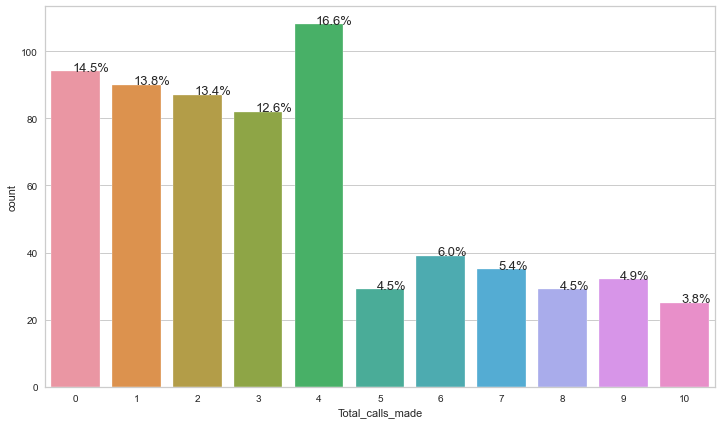
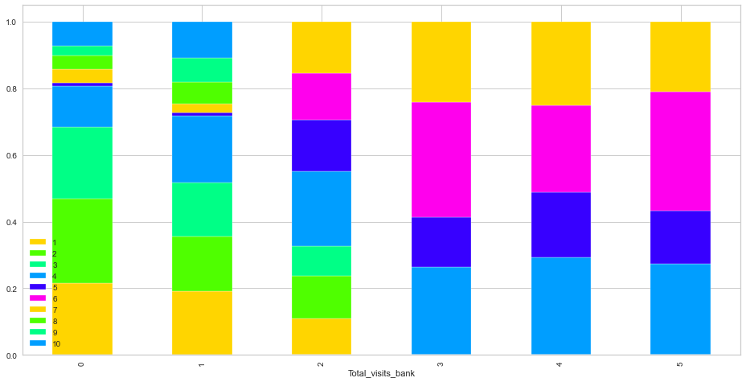

## <a href="https://jakeeide.github.io">Data Science Portfolio</a>

***
##### AllLifeBank Customer Segmentation • Unsupervised Learning Project
##### Python • <a href="https://github.com/jakeeide/jakeeide.github.io/blob/d1b9ad6fd72c1d69fbea7c7200186ded7128f6b6/pdf/Eide_Project7_AllLifeBank.pdf" target="_blank">PDF Presentation</a>
    
***

# <span style='color:#ffd400'> Background </span>  
AllLife Bank wants to focus on its credit card customer base in the next financial year. They have been advised by their marketing research team, that the penetration in the market can be improved. Based on this input, the marketing team proposes to run personalized campaigns to target new customers as well as upsell to existing customers. Another insight from the market research was that the customers perceive the support services of the bank poorly. Based on this, the operations team wants to upgrade the service delivery model, to ensure that customer queries are resolved faster.

# <span style='color:#ffd400'> Objective </span>   

To identify different segments in the existing customer, based on their spending patterns as well as past interaction with the bank, using clustering algorithms, and provide recommendations to the bank on how to better market to and service these customers.

# <span style='color:#ffd400'> Data Description </span>  

The data provided is of various customers of a bank and their financial attributes like credit limit, the total number of credit cards the customer has, and different channels through which customers have contacted the bank for any queries (including visiting the bank, online and through a call center).

# <span style='color:#ffd400'> Data Dictionary </span>

Customer details:
* Sl_No: Primary key of the records
* Customer Key: Customer identification number
* Average Credit Limit: Average credit limit of each customer for all credit cards
* Total credit cards: Total number of credit cards possessed by the customer
* Total visits bank: Total number of Visits that customer made (yearly) personally to the bank
* Total visits online: Total number of visits or online logins made by the customer (yearly)
* Total calls made: Total number of calls made by the customer to the bank or its customer service department (yearly)

***

# <span style='color:#009dff'> Notebook Setup </span>
In this section:
* Import libraries and adjust settings
* Import the dataset
* Get an initial understanding of the dataset by looking at its shape, viewing some rows, and viewing a summary of the data


```python
# import necessary libraries

# Black extension to keep code formatting clean
%load_ext nb_black

# libraries for reading and manipulating data
import pandas as pd
import numpy as np

pd.set_option("display.max_rows", None)
pd.set_option("display.max_columns", None)

# libraries for visualization
import matplotlib.pyplot as plt

%matplotlib inline
import seaborn as sns

sns.set(color_codes=True)

# to scale the data using z-score
from sklearn.preprocessing import StandardScaler

# to compute distances
from scipy.spatial.distance import pdist, cdist

# to perform k-means clustering and compute silhouette scores
from sklearn.cluster import KMeans
from sklearn.metrics import silhouette_score

# to visualize the elbow curve and silhouette scores
from yellowbrick.cluster import KElbowVisualizer, SilhouetteVisualizer

# to perform hierarchical clustering, compute cophenetic correlation, and create dendrograms
from sklearn.cluster import AgglomerativeClustering
from scipy.cluster.hierarchy import dendrogram, linkage, cophenet

# ignore warnings
import warnings

warnings.filterwarnings("ignore")
```


    <IPython.core.display.Javascript object>


```python
# set seaborn color palette
sns.set_palette(palette="hsv")
```


    <IPython.core.display.Javascript object>


### Import the dataset


```python
# import the dataset and create a working copy
credit_card_customer = pd.read_excel("CreditCardCustomerData.xlsx")
data = credit_card_customer.copy()
```


    <IPython.core.display.Javascript object>


###  View the shape of the dataset


```python
# display the shape using an f-string
print(f"There are {data.shape[0]} rows and {data.shape[1]} columns.")
```

    There are 660 rows and 7 columns.


    <IPython.core.display.Javascript object>


### View some rows of the dataset


```python
# look at the first five rows
data.head()
```


<div>
<style scoped>
    .dataframe tbody tr th:only-of-type {
        vertical-align: middle;
    }

    .dataframe tbody tr th {
        vertical-align: top;
    }

    .dataframe thead th {
        text-align: right;
    }
</style>
<table border="1" class="dataframe">
  <thead>
    <tr style="text-align: right;">
      <th></th>
      <th>Sl_No</th>
      <th>Customer Key</th>
      <th>Avg_Credit_Limit</th>
      <th>Total_Credit_Cards</th>
      <th>Total_visits_bank</th>
      <th>Total_visits_online</th>
      <th>Total_calls_made</th>
    </tr>
  </thead>
  <tbody>
    <tr>
      <th>0</th>
      <td>1</td>
      <td>87073</td>
      <td>100000</td>
      <td>2</td>
      <td>1</td>
      <td>1</td>
      <td>0</td>
    </tr>
    <tr>
      <th>1</th>
      <td>2</td>
      <td>38414</td>
      <td>50000</td>
      <td>3</td>
      <td>0</td>
      <td>10</td>
      <td>9</td>
    </tr>
    <tr>
      <th>2</th>
      <td>3</td>
      <td>17341</td>
      <td>50000</td>
      <td>7</td>
      <td>1</td>
      <td>3</td>
      <td>4</td>
    </tr>
    <tr>
      <th>3</th>
      <td>4</td>
      <td>40496</td>
      <td>30000</td>
      <td>5</td>
      <td>1</td>
      <td>1</td>
      <td>4</td>
    </tr>
    <tr>
      <th>4</th>
      <td>5</td>
      <td>47437</td>
      <td>100000</td>
      <td>6</td>
      <td>0</td>
      <td>12</td>
      <td>3</td>
    </tr>
  </tbody>
</table>
</div>


    <IPython.core.display.Javascript object>


```python
# look at five random rows
# set random seed so we see the same random results every time
np.random.seed(1)
data.sample(n=5)
```


<div>
<style scoped>
    .dataframe tbody tr th:only-of-type {
        vertical-align: middle;
    }

    .dataframe tbody tr th {
        vertical-align: top;
    }

    .dataframe thead th {
        text-align: right;
    }
</style>
<table border="1" class="dataframe">
  <thead>
    <tr style="text-align: right;">
      <th></th>
      <th>Sl_No</th>
      <th>Customer Key</th>
      <th>Avg_Credit_Limit</th>
      <th>Total_Credit_Cards</th>
      <th>Total_visits_bank</th>
      <th>Total_visits_online</th>
      <th>Total_calls_made</th>
    </tr>
  </thead>
  <tbody>
    <tr>
      <th>547</th>
      <td>548</td>
      <td>38125</td>
      <td>26000</td>
      <td>4</td>
      <td>5</td>
      <td>2</td>
      <td>4</td>
    </tr>
    <tr>
      <th>353</th>
      <td>354</td>
      <td>94437</td>
      <td>9000</td>
      <td>5</td>
      <td>4</td>
      <td>1</td>
      <td>3</td>
    </tr>
    <tr>
      <th>499</th>
      <td>500</td>
      <td>65825</td>
      <td>68000</td>
      <td>6</td>
      <td>4</td>
      <td>2</td>
      <td>2</td>
    </tr>
    <tr>
      <th>173</th>
      <td>174</td>
      <td>38410</td>
      <td>9000</td>
      <td>2</td>
      <td>1</td>
      <td>5</td>
      <td>8</td>
    </tr>
    <tr>
      <th>241</th>
      <td>242</td>
      <td>81878</td>
      <td>10000</td>
      <td>4</td>
      <td>5</td>
      <td>1</td>
      <td>3</td>
    </tr>
  </tbody>
</table>
</div>


    <IPython.core.display.Javascript object>


```python
# look at the last five rows
data.tail()
```


<div>
<style scoped>
    .dataframe tbody tr th:only-of-type {
        vertical-align: middle;
    }

    .dataframe tbody tr th {
        vertical-align: top;
    }

    .dataframe thead th {
        text-align: right;
    }
</style>
<table border="1" class="dataframe">
  <thead>
    <tr style="text-align: right;">
      <th></th>
      <th>Sl_No</th>
      <th>Customer Key</th>
      <th>Avg_Credit_Limit</th>
      <th>Total_Credit_Cards</th>
      <th>Total_visits_bank</th>
      <th>Total_visits_online</th>
      <th>Total_calls_made</th>
    </tr>
  </thead>
  <tbody>
    <tr>
      <th>655</th>
      <td>656</td>
      <td>51108</td>
      <td>99000</td>
      <td>10</td>
      <td>1</td>
      <td>10</td>
      <td>0</td>
    </tr>
    <tr>
      <th>656</th>
      <td>657</td>
      <td>60732</td>
      <td>84000</td>
      <td>10</td>
      <td>1</td>
      <td>13</td>
      <td>2</td>
    </tr>
    <tr>
      <th>657</th>
      <td>658</td>
      <td>53834</td>
      <td>145000</td>
      <td>8</td>
      <td>1</td>
      <td>9</td>
      <td>1</td>
    </tr>
    <tr>
      <th>658</th>
      <td>659</td>
      <td>80655</td>
      <td>172000</td>
      <td>10</td>
      <td>1</td>
      <td>15</td>
      <td>0</td>
    </tr>
    <tr>
      <th>659</th>
      <td>660</td>
      <td>80150</td>
      <td>167000</td>
      <td>9</td>
      <td>0</td>
      <td>12</td>
      <td>2</td>
    </tr>
  </tbody>
</table>
</div>


    <IPython.core.display.Javascript object>


### Summary of the data


```python
data.describe(include="all").T
```


<div>
<style scoped>
    .dataframe tbody tr th:only-of-type {
        vertical-align: middle;
    }

    .dataframe tbody tr th {
        vertical-align: top;
    }

    .dataframe thead th {
        text-align: right;
    }
</style>
<table border="1" class="dataframe">
  <thead>
    <tr style="text-align: right;">
      <th></th>
      <th>count</th>
      <th>mean</th>
      <th>std</th>
      <th>min</th>
      <th>25%</th>
      <th>50%</th>
      <th>75%</th>
      <th>max</th>
    </tr>
  </thead>
  <tbody>
    <tr>
      <th>Sl_No</th>
      <td>660.0</td>
      <td>330.500000</td>
      <td>190.669872</td>
      <td>1.0</td>
      <td>165.75</td>
      <td>330.5</td>
      <td>495.25</td>
      <td>660.0</td>
    </tr>
    <tr>
      <th>Customer Key</th>
      <td>660.0</td>
      <td>55141.443939</td>
      <td>25627.772200</td>
      <td>11265.0</td>
      <td>33825.25</td>
      <td>53874.5</td>
      <td>77202.50</td>
      <td>99843.0</td>
    </tr>
    <tr>
      <th>Avg_Credit_Limit</th>
      <td>660.0</td>
      <td>34574.242424</td>
      <td>37625.487804</td>
      <td>3000.0</td>
      <td>10000.00</td>
      <td>18000.0</td>
      <td>48000.00</td>
      <td>200000.0</td>
    </tr>
    <tr>
      <th>Total_Credit_Cards</th>
      <td>660.0</td>
      <td>4.706061</td>
      <td>2.167835</td>
      <td>1.0</td>
      <td>3.00</td>
      <td>5.0</td>
      <td>6.00</td>
      <td>10.0</td>
    </tr>
    <tr>
      <th>Total_visits_bank</th>
      <td>660.0</td>
      <td>2.403030</td>
      <td>1.631813</td>
      <td>0.0</td>
      <td>1.00</td>
      <td>2.0</td>
      <td>4.00</td>
      <td>5.0</td>
    </tr>
    <tr>
      <th>Total_visits_online</th>
      <td>660.0</td>
      <td>2.606061</td>
      <td>2.935724</td>
      <td>0.0</td>
      <td>1.00</td>
      <td>2.0</td>
      <td>4.00</td>
      <td>15.0</td>
    </tr>
    <tr>
      <th>Total_calls_made</th>
      <td>660.0</td>
      <td>3.583333</td>
      <td>2.865317</td>
      <td>0.0</td>
      <td>1.00</td>
      <td>3.0</td>
      <td>5.00</td>
      <td>10.0</td>
    </tr>
  </tbody>
</table>
</div>


    <IPython.core.display.Javascript object>


**Observations**

* It appears that all of our data is numerical, so we probably won't have to deal with categorical data
* Both `SI_No` and `Customer Key`are identifition numbers, so they don't provide any insight into customer behavior
* That leaves 5 columns that will be used to segment the customers
* `Avg_Credit_Limit` ranges from 3,000 dollars to 200,000 dollars, but the median is 18,000 so there is probably a right skew to this distribution
* Aside from the two identification numbers and `Avg_Credit_Limit`, the other four columns have a limited range of discrete values that are primarily single digit integers
* `Total_Credit_Cards` centers around 5 cards
* `Total_visits_bank` centers around 2 in-person yearly visits to the bank
* `Total_visits_online` also centers around 2 online visits per year, but unlike `Total_visits_bank`, there might be a bit of a skew to the data because the max number of online visits is 15
* `Total_calls_made` centers around 3 calls to the bank per year, but has a max value of 10 calls

***
# <span style='color:#009dff'> Data Preprocessing </span>
In this section:
* Prepare the data for analysis
* Fix data types if necessary
* Treat missing values
* Check for duplicate values

### Check the data types for each column


```python
data.info()
```

    <class 'pandas.core.frame.DataFrame'>
    RangeIndex: 660 entries, 0 to 659
    Data columns (total 7 columns):
     #   Column               Non-Null Count  Dtype
    ---  ------               --------------  -----
     0   Sl_No                660 non-null    int64
     1   Customer Key         660 non-null    int64
     2   Avg_Credit_Limit     660 non-null    int64
     3   Total_Credit_Cards   660 non-null    int64
     4   Total_visits_bank    660 non-null    int64
     5   Total_visits_online  660 non-null    int64
     6   Total_calls_made     660 non-null    int64
    dtypes: int64(7)
    memory usage: 36.2 KB


    <IPython.core.display.Javascript object>


* All of the columns are integers
* Do not have to change any of the data types for analysis

### Check for missing values and duplicates


```python
# look at which columns have the most missing values
data.isnull().sum().sort_values(ascending=False)
```


    Sl_No                  0
    Customer Key           0
    Avg_Credit_Limit       0
    Total_Credit_Cards     0
    Total_visits_bank      0
    Total_visits_online    0
    Total_calls_made       0
    dtype: int64


    <IPython.core.display.Javascript object>


```python
# check for duplicate observations
data.duplicated().sum()
```


    0


    <IPython.core.display.Javascript object>


```python
# look at the number of unique values in each column
data.nunique().sort_values()
```


    Total_visits_bank        6
    Total_Credit_Cards      10
    Total_calls_made        11
    Total_visits_online     16
    Avg_Credit_Limit       110
    Customer Key           655
    Sl_No                  660
    dtype: int64


    <IPython.core.display.Javascript object>


* No missing values were found
* The duplicated method told us there were no duplicate rows
* `Customer Key` only has 655 unique values whereas `Sl_No` has 660, which suggests that `Customer Key` may contain some duplicates


```python
# remove the space in the 'Customer Key' column label
data.rename(columns={"Customer Key": "CustomerKey"}, inplace=True)
```


    <IPython.core.display.Javascript object>


```python
# create a bool series for CustomerKey duplicates
key_duplicates = data["CustomerKey"].duplicated(keep=False)
```


    <IPython.core.display.Javascript object>


```python
# display duplicates in CustomerKey column
data[key_duplicates].sort_values(by=["CustomerKey"], ascending=False)
```


<div>
<style scoped>
    .dataframe tbody tr th:only-of-type {
        vertical-align: middle;
    }

    .dataframe tbody tr th {
        vertical-align: top;
    }

    .dataframe thead th {
        text-align: right;
    }
</style>
<table border="1" class="dataframe">
  <thead>
    <tr style="text-align: right;">
      <th></th>
      <th>Sl_No</th>
      <th>CustomerKey</th>
      <th>Avg_Credit_Limit</th>
      <th>Total_Credit_Cards</th>
      <th>Total_visits_bank</th>
      <th>Total_visits_online</th>
      <th>Total_calls_made</th>
    </tr>
  </thead>
  <tbody>
    <tr>
      <th>104</th>
      <td>105</td>
      <td>97935</td>
      <td>17000</td>
      <td>2</td>
      <td>1</td>
      <td>2</td>
      <td>10</td>
    </tr>
    <tr>
      <th>632</th>
      <td>633</td>
      <td>97935</td>
      <td>187000</td>
      <td>7</td>
      <td>1</td>
      <td>7</td>
      <td>0</td>
    </tr>
    <tr>
      <th>391</th>
      <td>392</td>
      <td>96929</td>
      <td>13000</td>
      <td>4</td>
      <td>5</td>
      <td>0</td>
      <td>0</td>
    </tr>
    <tr>
      <th>398</th>
      <td>399</td>
      <td>96929</td>
      <td>67000</td>
      <td>6</td>
      <td>2</td>
      <td>2</td>
      <td>2</td>
    </tr>
    <tr>
      <th>411</th>
      <td>412</td>
      <td>50706</td>
      <td>44000</td>
      <td>4</td>
      <td>5</td>
      <td>0</td>
      <td>2</td>
    </tr>
    <tr>
      <th>541</th>
      <td>542</td>
      <td>50706</td>
      <td>60000</td>
      <td>7</td>
      <td>5</td>
      <td>2</td>
      <td>2</td>
    </tr>
    <tr>
      <th>4</th>
      <td>5</td>
      <td>47437</td>
      <td>100000</td>
      <td>6</td>
      <td>0</td>
      <td>12</td>
      <td>3</td>
    </tr>
    <tr>
      <th>332</th>
      <td>333</td>
      <td>47437</td>
      <td>17000</td>
      <td>7</td>
      <td>3</td>
      <td>1</td>
      <td>0</td>
    </tr>
    <tr>
      <th>48</th>
      <td>49</td>
      <td>37252</td>
      <td>6000</td>
      <td>4</td>
      <td>0</td>
      <td>2</td>
      <td>8</td>
    </tr>
    <tr>
      <th>432</th>
      <td>433</td>
      <td>37252</td>
      <td>59000</td>
      <td>6</td>
      <td>2</td>
      <td>1</td>
      <td>2</td>
    </tr>
  </tbody>
</table>
</div>


    <IPython.core.display.Javascript object>


* As a reminder, `Customer Key` is each customer's identification number
* The repeats of the Customer Key number offer conflicting data about these 5 customers
* Because we don't know which row contains the correct information about each customer, it makes the most sense to remove these 10 rows


```python
# drop all rows that have duplicates in the CustomerKey column
data = data.drop_duplicates(subset=["CustomerKey"], keep=False)
```


    <IPython.core.display.Javascript object>


```python
# confirm that the rows were dropped
data.nunique().sort_values()
```


    Total_visits_bank        6
    Total_Credit_Cards      10
    Total_calls_made        11
    Total_visits_online     16
    Avg_Credit_Limit       109
    Sl_No                  650
    CustomerKey            650
    dtype: int64


    <IPython.core.display.Javascript object>


* There are now 650 unique Sl_no rows and 650 unique CustomerKey rows, so it looks like we no longer have any duplicates

### Drop columns


```python
# drop Sl_No and Customer Key columns as they don't give us any useful data for our analysis
data.drop(["Sl_No", "CustomerKey"], axis=1, inplace=True)
```


    <IPython.core.display.Javascript object>


### Resummarize the data after clean up


```python
data.describe(include="all").T
```


<div>
<style scoped>
    .dataframe tbody tr th:only-of-type {
        vertical-align: middle;
    }

    .dataframe tbody tr th {
        vertical-align: top;
    }

    .dataframe thead th {
        text-align: right;
    }
</style>
<table border="1" class="dataframe">
  <thead>
    <tr style="text-align: right;">
      <th></th>
      <th>count</th>
      <th>mean</th>
      <th>std</th>
      <th>min</th>
      <th>25%</th>
      <th>50%</th>
      <th>75%</th>
      <th>max</th>
    </tr>
  </thead>
  <tbody>
    <tr>
      <th>Avg_Credit_Limit</th>
      <td>650.0</td>
      <td>34229.230769</td>
      <td>37260.934830</td>
      <td>3000.0</td>
      <td>10000.0</td>
      <td>18000.0</td>
      <td>48000.0</td>
      <td>200000.0</td>
    </tr>
    <tr>
      <th>Total_Credit_Cards</th>
      <td>650.0</td>
      <td>4.696923</td>
      <td>2.173979</td>
      <td>1.0</td>
      <td>3.0</td>
      <td>5.0</td>
      <td>6.0</td>
      <td>10.0</td>
    </tr>
    <tr>
      <th>Total_visits_bank</th>
      <td>650.0</td>
      <td>2.403077</td>
      <td>1.627193</td>
      <td>0.0</td>
      <td>1.0</td>
      <td>2.0</td>
      <td>4.0</td>
      <td>5.0</td>
    </tr>
    <tr>
      <th>Total_visits_online</th>
      <td>650.0</td>
      <td>2.601538</td>
      <td>2.924789</td>
      <td>0.0</td>
      <td>1.0</td>
      <td>2.0</td>
      <td>4.0</td>
      <td>15.0</td>
    </tr>
    <tr>
      <th>Total_calls_made</th>
      <td>650.0</td>
      <td>3.593846</td>
      <td>2.857902</td>
      <td>0.0</td>
      <td>1.0</td>
      <td>3.0</td>
      <td>5.0</td>
      <td>10.0</td>
    </tr>
  </tbody>
</table>
</div>


    <IPython.core.display.Javascript object>


* After cleaning up the data set, we now have 5 columns and 650 rows

### Problem Definition and Questions to be Answered

* Now knowing we have 5 columns of numerical data to work with, I'd like to restate the project objectives before moving on to EDA
* Problem Definition:
    - the bank's penetration in the credit card market is not as good as it could be
    - customers perceive the support services of the bank poorly
* Problem Solution - to segment customers into groups so that:
    - the bank can offer more personalized customer service
    - gain marketing insights as to how to target the needs of credit card customers
* Questions to be answered:
    - How many different groups of customers best explains the bank's customers?
    - How do these groups differ from one another?
    - What can we infer about the needs of the different clusters based on their credit limits, number of cards, visits to the bank, online visits, and number of calls made?
    - How could the bank do a better job of marketing to and servicing these different groups of customers?
* Final Observation:
    - Three columns of our data have to do with the manner in which the customer interacts with the bank: in-person vists, online, or by phone calls
    - I'd like to be able to identify the preferred method of communication for each group, as this will be very beneficial to the the marketing department

***
# <span style='color:#009dff'> EDA </span>
In this section:
* Univariate analysis
* Bivariate analysis
* Identify relationships between variables
* Visualize the data set
* Identify patterns and insights which can drive business decisions


```python
# This is a function to create a boxplot and histogram for any input numerical variable
# This function takes the numerical column as the input and returns the boxplots and histograms for the variable
def histogram_boxplot(feature, figsize=(15, 10), bins=None):
    """ Boxplot and histogram combined
    feature: 1-d feature array
    figsize: size of fig (default (9,8))
    bins: number of bins (default None / auto)
    """
    f2, (ax_box2, ax_hist2) = plt.subplots(
        nrows=2,  # Number of rows of the subplot grid= 2
        sharex=True,  # x-axis will be shared among all subplots
        gridspec_kw={"height_ratios": (0.25, 0.75)},
        figsize=figsize,
    )  # creating the 2 subplots
    sns.boxplot(
        feature, ax=ax_box2, showmeans=True
    )  # boxplot will be created and a star will indicate the mean value of the column
    sns.rugplot(feature, ax=ax_hist2, color="black")  # Add rug to the histogram
    sns.distplot(feature, kde=True, ax=ax_hist2, bins=bins) if bins else sns.distplot(
        feature, kde=False, ax=ax_hist2
    )  # For histogram
    ax_hist2.axvline(np.mean(feature), linestyle="--")  # Add mean to the histogram
    ax_hist2.axvline(
        np.median(feature), color="black", linestyle="-"
    )  # Add median to the histogram
```


    <IPython.core.display.Javascript object>


```python
# Function to create barplots that indicate percentage for each category
def bar_perc(plot, feature):
    """
    plot
    feature: 1-d categorical feature array
    """
    total = len(feature)  # length of the column
    for p in ax.patches:
        percentage = "{:.1f}%".format(
            100 * p.get_height() / total
        )  # percentage of each class of the category
        x = p.get_x() + p.get_width() / 2 - 0.05  # width of the plot
        y = p.get_y() + p.get_height() + 0.2  # height of the plot
        ax.annotate(percentage, (x, y), size=13)  # annotate the percantage
```


    <IPython.core.display.Javascript object>


### Observations on Total_visits_bank
Total number of visits that customers made (yearly) personally to the bank.


```python
# Show a bar graph of Total_visits_bank counts
plt.figure(figsize=(8, 7))
ax = sns.countplot(data["Total_visits_bank"])
bar_perc(ax, data["Total_visits_bank"])
```


    

    


    <IPython.core.display.Javascript object>


```python
# draw boxplot and histogram
histogram_boxplot(data.Total_visits_bank)
```


    

    


    <IPython.core.display.Javascript object>


* This distribution is generally bell-shaped and symmetrical, centered around 2 visits
* The values range from 0 to 5 in-person visits to the bank every year
* 2 yearly visits is the most common, accounting for 24% of the customers
* There do not appear to be any outliers
* It is interesting to see that 15% of customers have 0 visits to the bank, indicating that these people probably do all of their banking online

### Observations on Total_Credit_Cards
Total number of credit cards possessed by the customer


```python
# Show a bar graph of Total_Credit_Cards counts
plt.figure(figsize=(12, 7))
ax = sns.countplot(data["Total_Credit_Cards"])
bar_perc(ax, data["Total_Credit_Cards"])
```


    

    


    <IPython.core.display.Javascript object>


```python
# draw boxplot and histogram
histogram_boxplot(data.Total_Credit_Cards)
```


    

    


    <IPython.core.display.Javascript object>


* The values range from 1 to 10 cards
* ~23% of the customers have 4 credit cards, the most common value
* Customers with 8, 9, or 10 cards collectively only make up ~6%

### Observations on Total_calls_made
Total number of calls made by the customer to the bank or its customer service department (yearly)


```python
# Show a bar graph of Total_calls_made counts
plt.figure(figsize=(12, 7))
ax = sns.countplot(data["Total_calls_made"])
bar_perc(ax, data["Total_calls_made"])
```


    

    


    <IPython.core.display.Javascript object>


```python
# draw boxplot and histogram
histogram_boxplot(data.Total_calls_made)
```


    

    


    <IPython.core.display.Javascript object>


* The values range from 0 to 10 calls
* The distribution is right skewed, with a mean of 3.6 and median of 3
* ~17% of the customers made 4 calls, the most common value
* There is a large % decrease in the number of calls after 4

### Observations on Total_visits_online
Total number of visits or online logins made by the customer (yearly)


```python
# Show a bar graph of Total_visits_online counts
plt.figure(figsize=(14, 6))
ax = sns.countplot(data["Total_visits_online"])
bar_perc(ax, data["Total_visits_online"])
```


    

    


    <IPython.core.display.Javascript object>


```python
# draw boxplot and histogram
histogram_boxplot(data.Total_visits_online)
```


    

    


    <IPython.core.display.Javascript object>


* The values range from 0 to 15 online visits
* Values of 0 to 5 are much more common than the higher number of visits
* The distribution is right skewed, with a mean of 2.6 and median of 2
* ~28% of the customers made 2 online visits, the most common value
* There is a large % decrease in the number of online visits after 5
* The boxplot whiskers show that more than 8 calls could be considered outliers

### Observations on Avg_Credit_Limit
Average credit limit of each customer for all credit cards


```python
# draw boxplot and histogram
histogram_boxplot(data.Avg_Credit_Limit)
```


    

    


    <IPython.core.display.Javascript object>


* There is a large range in values: from 3,000 to 200,000 dollars
* A lot of the data is clustered in the lower end of the values, below 20,000 dollars
* The distribution is right skewed, with a mean of 34,000 and median of 18,000
* The IQR is from 10,000 to 48,000 dollars
* The boxplot whiskers show that credit limits above 100,000 could be considered outliers

### Bivariate Analysis: Correlation and Scatterplots


```python
# display the correlation between pairs of numerical columns
data.corr()
```


<div>
<style scoped>
    .dataframe tbody tr th:only-of-type {
        vertical-align: middle;
    }

    .dataframe tbody tr th {
        vertical-align: top;
    }

    .dataframe thead th {
        text-align: right;
    }
</style>
<table border="1" class="dataframe">
  <thead>
    <tr style="text-align: right;">
      <th></th>
      <th>Avg_Credit_Limit</th>
      <th>Total_Credit_Cards</th>
      <th>Total_visits_bank</th>
      <th>Total_visits_online</th>
      <th>Total_calls_made</th>
    </tr>
  </thead>
  <tbody>
    <tr>
      <th>Avg_Credit_Limit</th>
      <td>1.000000</td>
      <td>0.611033</td>
      <td>-0.096115</td>
      <td>0.549107</td>
      <td>-0.413937</td>
    </tr>
    <tr>
      <th>Total_Credit_Cards</th>
      <td>0.611033</td>
      <td>1.000000</td>
      <td>0.319887</td>
      <td>0.165633</td>
      <td>-0.650756</td>
    </tr>
    <tr>
      <th>Total_visits_bank</th>
      <td>-0.096115</td>
      <td>0.319887</td>
      <td>1.000000</td>
      <td>-0.550585</td>
      <td>-0.506145</td>
    </tr>
    <tr>
      <th>Total_visits_online</th>
      <td>0.549107</td>
      <td>0.165633</td>
      <td>-0.550585</td>
      <td>1.000000</td>
      <td>0.130844</td>
    </tr>
    <tr>
      <th>Total_calls_made</th>
      <td>-0.413937</td>
      <td>-0.650756</td>
      <td>-0.506145</td>
      <td>0.130844</td>
      <td>1.000000</td>
    </tr>
  </tbody>
</table>
</div>


    <IPython.core.display.Javascript object>


```python
# plot the correlation as a heatmap
colormap = sns.color_palette("hsv")
plt.figure(figsize=(10, 8))
sns.heatmap(data.corr(), annot=True, cmap=colormap)
plt.show()
```


    

    


    <IPython.core.display.Javascript object>


```python
# function to list highest correlation pairs


def get_redundant_pairs(df):
    """Get diagonal and lower triangular pairs of correlation matrix"""
    pairs_to_drop = set()
    cols = df.columns
    for i in range(0, df.shape[1]):
        for j in range(0, i + 1):
            pairs_to_drop.add((cols[i], cols[j]))
    return pairs_to_drop


def get_top_abs_correlations(df, n=5):
    au_corr = df.corr().abs().unstack()
    labels_to_drop = get_redundant_pairs(df)
    au_corr = au_corr.drop(labels=labels_to_drop).sort_values(ascending=False)
    return au_corr[0:n]


print("List of Correlations")
print(get_top_abs_correlations(data, 10))
```

    List of Correlations
    Total_Credit_Cards   Total_calls_made       0.650756
    Avg_Credit_Limit     Total_Credit_Cards     0.611033
    Total_visits_bank    Total_visits_online    0.550585
    Avg_Credit_Limit     Total_visits_online    0.549107
    Total_visits_bank    Total_calls_made       0.506145
    Avg_Credit_Limit     Total_calls_made       0.413937
    Total_Credit_Cards   Total_visits_bank      0.319887
                         Total_visits_online    0.165633
    Total_visits_online  Total_calls_made       0.130844
    Avg_Credit_Limit     Total_visits_bank      0.096115
    dtype: float64


    <IPython.core.display.Javascript object>


* The correlation absolute values range between 0.65 and 0.09, showing that the correlation between the columns are generally moderate
* The highest correlation (-0.65) is between `Total_Credit_Cards` and `Total_calls_made`; the negative correlation indicates that those with more credit cards tend to call the bank less often, or phrased the other way, those with fewer credit cards call the bank more often
* `Total_Credit_Cards` and `Avg_Credit_Limit` has the second highest correlation, indicating that those with more credit cards have a higher combined credit limit (which makes sense)
* `Avg_Credit_Limit` and `Total_visits_bank` has the lowest correlation, meaning that looking at credit limit is probably not a good predictor of how often a customer visits the bank in-person


```python
# show an overview of the relationships between variables
sns.pairplot(data)
```


    <seaborn.axisgrid.PairGrid at 0x7fe80b6c2e20>


    

    


    <IPython.core.display.Javascript object>


### Further Bivariate Analysis
Compare two columns


```python
# Function to plot stacked bar chart


def stacked_plot(x, y):
    tab1 = pd.crosstab(x, y, margins=True)
    print(tab1)
    print("-" * 110)
    tab = pd.crosstab(x, y, normalize="index")
    tab.plot(kind="bar", stacked=True, figsize=(16, 8))
    plt.legend(loc="lower left", frameon=False)
    # plt.legend(loc="upper left", bbox_to_anchor=(0, 1))
    plt.show()
```


    <IPython.core.display.Javascript object>


### Total_visits_bank vs. Total_Credit_Cards


```python
stacked_plot(data["Total_visits_bank"], data["Total_Credit_Cards"])
```

    Total_Credit_Cards   1   2   3    4   5    6   7   8   9  10  All
    Total_visits_bank                                                
    0                   21  25  21   12   1    0   4   4   3   7   98
    1                   21  18  18   22   1    0   3   7   8  12  110
    2                   17  20  14   35  24   22  24   0   0   0  156
    3                    0   0   0   26  15   34  24   0   0   0   99
    4                    0   0   0   27  18   24  23   0   0   0   92
    5                    0   0   0   26  15   34  20   0   0   0   95
    All                 59  63  53  148  74  114  98  11  11  19  650
    --------------------------------------------------------------------------------------------------------------


    

    


    <IPython.core.display.Javascript object>


* Customers who visited the bank more than twice in a year all have between 4 and 7 credit cards
* Customers with fewer than 4 cards did not visit the bank more than twice in a year
* Customers with more than 7 cards did not visit the bank more than once in a year

### Total_Credit_Cards vs. Total_visits_online


```python
stacked_plot(data["Total_Credit_Cards"], data["Total_visits_online"])
```

    Total_visits_online    0    1    2   3   4   5  6  7  8  9  10  11  12  13  \
    Total_Credit_Cards                                                           
    1                      0    0   18   9  17  15  0  0  0  0   0   0   0   0   
    2                      0    1   13  15  18  16  0  0  0  0   0   0   0   0   
    3                      0    2   12   8  14  16  0  0  0  0   1   0   0   0   
    4                     42   25   43  11  20   7  0  0  0  0   0   0   0   0   
    5                     22   23   28   0   0   0  0  0  0  0   0   1   0   0   
    6                     35   37   42   0   0   0  0  0  0  0   0   0   0   0   
    7                     43   19   29   1   0   0  0  0  1  0   1   1   0   2   
    8                      0    0    0   0   0   0  1  4  2  1   0   0   0   1   
    9                      0    0    0   0   0   0  0  0  1  1   2   2   3   0   
    10                     0    0    0   0   0   0  0  2  2  2   2   1   2   2   
    All                  142  107  185  44  69  54  1  6  6  4   6   5   5   5   
    
    Total_visits_online  14  15  All  
    Total_Credit_Cards                
    1                     0   0   59  
    2                     0   0   63  
    3                     0   0   53  
    4                     0   0  148  
    5                     0   0   74  
    6                     0   0  114  
    7                     0   1   98  
    8                     0   2   11  
    9                     1   1   11  
    10                    0   6   19  
    All                   1  10  650  
    --------------------------------------------------------------------------------------------------------------


    

    


    <IPython.core.display.Javascript object>


* The largest cluster of customers have between 4 and 7 credit cards, and have 0 to 2 online visits per year
* A second (slightly overlapping) cluster of customers have between 1 and 4 credit cards, and have 2 to 5 online visits per year
* Very few customers have 6 or more online visits, but these customers also have the most credit cards (7 or more cards)

### Total_Credit_Cards vs. Total_calls_made


```python
stacked_plot(data["Total_Credit_Cards"], data["Total_calls_made"])
```

    Total_calls_made     0   1   2   3    4   5   6   7   8   9  10  All
    Total_Credit_Cards                                                  
    1                    0   0   0   0    6   8   7  12   7  10   9   59
    2                    1   0   1   0   12   7  11   8  12   6   5   63
    3                    0   1   0   0    7   8  13   6   4   9   5   53
    4                   22  22  20  19   23   6   8   9   6   7   6  148
    5                   13  14  15  14   18   0   0   0   0   0   0   74
    6                   27  22  18  29   18   0   0   0   0   0   0  114
    7                   18  18  18  20   24   0   0   0   0   0   0   98
    8                    4   5   2   0    0   0   0   0   0   0   0   11
    9                    3   2   6   0    0   0   0   0   0   0   0   11
    10                   6   6   7   0    0   0   0   0   0   0   0   19
    All                 94  90  87  82  108  29  39  35  29  32  25  650
    --------------------------------------------------------------------------------------------------------------


    

    


    <IPython.core.display.Javascript object>


* The largest cluster of customers have between 4 and 7 credit cards, and call the bank 0 to 4 times per year
* Customers with 8 or more cards make 0 to 2 calls to the bank per year
* Customers who call the bank 5 or more times per year have 4 or fewer credit cards

### Total_visits_bank vs. Total_visits_online


```python
stacked_plot(data["Total_visits_bank"], data["Total_visits_online"])
```

    Total_visits_online    0    1    2   3   4   5  6  7  8  9  10  11  12  13  \
    Total_visits_bank                                                            
    0                      0    3   19  17  23  16  0  2  3  1   2   2   2   4   
    1                      0    2   14  11  30  24  1  4  3  3   4   3   3   1   
    2                     40   26   44  16  16  14  0  0  0  0   0   0   0   0   
    3                     32   32   35   0   0   0  0  0  0  0   0   0   0   0   
    4                     31   23   38   0   0   0  0  0  0  0   0   0   0   0   
    5                     39   21   35   0   0   0  0  0  0  0   0   0   0   0   
    All                  142  107  185  44  69  54  1  6  6  4   6   5   5   5   
    
    Total_visits_online  14  15  All  
    Total_visits_bank                 
    0                     0   4   98  
    1                     1   6  110  
    2                     0   0  156  
    3                     0   0   99  
    4                     0   0   92  
    5                     0   0   95  
    All                   1  10  650  
    --------------------------------------------------------------------------------------------------------------


    

    


    <IPython.core.display.Javascript object>


* The largest cluster of customers visit the bank 2 to 5 times, but have only 0 to 2 online visits per year
* A second (overlapping) cluster of customers visit the bank 0 to 2 times, and make 2 to 5 online visits per year
* Very few customers have 6 or more online visits, but those customers only visit the bank in-person 0 to 1 times per year

### Total_visits_bank vs. Total_calls_made


```python
stacked_plot(data["Total_visits_bank"], data["Total_calls_made"])
```

    Total_calls_made    0   1   2   3    4   5   6   7   8   9  10  All
    Total_visits_bank                                                  
    0                   7   6   8   0   10  10  10  13  10  12  12   98
    1                   9  10  11   0   15  10  14  12   9  12   8  110
    2                  19  14  19  18   29   9  15  10  10   8   5  156
    3                  20  19  18  21   21   0   0   0   0   0   0   99
    4                  21  19  18  23   11   0   0   0   0   0   0   92
    5                  18  22  13  20   22   0   0   0   0   0   0   95
    All                94  90  87  82  108  29  39  35  29  32  25  650
    --------------------------------------------------------------------------------------------------------------


    

    


    <IPython.core.display.Javascript object>


* Customers who made 5 or more calls per year never made more more than 2 in-person visits to the bank
* Customers who made 4 or fewer calls per year tended to visit the bank 2 to 5 times during the year

###  Total_calls_made vs. Total_visits_online


```python
stacked_plot(data["Total_calls_made"], data["Total_visits_online"])
```

    Total_visits_online    0    1    2   3   4   5  6  7  8  9  10  11  12  13  \
    Total_calls_made                                                             
    0                     29   29   21   0   0   0  0  2  2  0   1   3   0   3   
    1                     26   16   33   0   0   0  1  2  3  2   2   0   1   0   
    2                     26   18   25   0   0   0  0  2  1  2   2   2   4   2   
    3                     26   18   38   0   0   0  0  0  0  0   0   0   0   0   
    4                     35   24   26   7  10   6  0  0  0  0   0   0   0   0   
    5                      0    0    9   5   6   9  0  0  0  0   0   0   0   0   
    6                      0    0    9   7  15   8  0  0  0  0   0   0   0   0   
    7                      0    1    9   9  10   6  0  0  0  0   0   0   0   0   
    8                      0    1    4   5  10   9  0  0  0  0   0   0   0   0   
    9                      0    0    4   3  13  11  0  0  0  0   1   0   0   0   
    10                     0    0    7   8   5   5  0  0  0  0   0   0   0   0   
    All                  142  107  185  44  69  54  1  6  6  4   6   5   5   5   
    
    Total_visits_online  14  15  All  
    Total_calls_made                  
    0                     0   4   94  
    1                     1   3   90  
    2                     0   3   87  
    3                     0   0   82  
    4                     0   0  108  
    5                     0   0   29  
    6                     0   0   39  
    7                     0   0   35  
    8                     0   0   29  
    9                     0   0   32  
    10                    0   0   25  
    All                   1  10  650  
    --------------------------------------------------------------------------------------------------------------


    

    


    <IPython.core.display.Javascript object>


* This bivariate analysis shows three clusters of customers:
    - one group makes 0 to 2 online visits and 0 to 4 calls per year
    - a second (overlapping) group makes 2 to 5 online visits and 4 to 10 calls per year
    - the third group makes 6 to 15 online visits and 0 to 2 calls per year

***
# <span style='color:#009dff'> Further Data Preprocessing: Prepare for Clustering </span>
In this section:

* Outlier Treatment: define outliers and treat if needed
* Scale data: create a dataframe of scaled data to be used in clustering

## Outliers


```python
# Detect outliers

# Find the 25th and 75th percentiles
Q1 = data.quantile(0.25)
Q3 = data.quantile(0.75)

# Interquartile Range (75th perentile - 25th percentile)
IQR = Q3 - Q1

# Find lower and upper bounds for all values
# All values outside these bounds are outliers
lower = Q1 - 1.5 * IQR
upper = Q3 + 1.5 * IQR
```


    <IPython.core.display.Javascript object>


```python
# display percentage of outliers in each column
(
    (data.select_dtypes(include=["float64", "int64"]) < lower)
    | (data.select_dtypes(include=["float64", "int64"]) > upper)
).sum() / len(data) * 100
```


    Avg_Credit_Limit       5.846154
    Total_Credit_Cards     0.000000
    Total_visits_bank      0.000000
    Total_visits_online    5.538462
    Total_calls_made       0.000000
    dtype: float64


    <IPython.core.display.Javascript object>


* three of the columns do not have any outliers
* the other two columns have ~6% of their data as outliers
* I am not going to change any of the outliers, as I don't think the outliers in this data set will interfere with our clustering techniques

## Scaling


```python
# create list of of original column labels before scaling (to be used later)
col_labels = data.columns.tolist()
```


    <IPython.core.display.Javascript object>


```python
# scaling the dataset before clustering
scaler = StandardScaler()
data_scaled = scaler.fit_transform(data)
```


    <IPython.core.display.Javascript object>


```python
# creating a dataframe of the scaled columns
data_scaled_df = pd.DataFrame(data_scaled)
```


    <IPython.core.display.Javascript object>


```python
# add labels to columns in scaled dataframe
data_scaled_df.columns = col_labels
```


    <IPython.core.display.Javascript object>


***
# <span style='color:#009dff'> Clustering </span>
In this section:

* K-means clustering
    - Apply K-means Clustering
    - Elbow curve
    - Silhouette Score
    - Define the appropriate number of clusters
    - Perform cluster profiling
    - List the insights about different clusters
    
* Hierarchical clustering
    - Apply Hierarchical clustering with different linkage methods
    - Plot dendrograms for each linkage method
    - Define the appropriate number of clusters
    - Perform cluster profiling
    - List the insights about different clusters

## K-means Clustering

#### Elbow Method


```python
%%time

clusters = range(1, 9)
meanDistortions = []

for k in clusters:
    model = KMeans(n_clusters=k)
    model.fit(data_scaled_df)
    prediction = model.predict(data_scaled_df)
    distortion = (
        sum(
            np.min(cdist(data_scaled_df, model.cluster_centers_, "euclidean"), axis=1)
        )
        / data_scaled_df.shape[0]
    )

    meanDistortions.append(distortion)

    print("Number of Clusters:", k, "\tAverage Distortion:", distortion)

plt.plot(clusters, meanDistortions, "bx-")
plt.xlabel("k")
plt.ylabel("Average distortion")
plt.title("Selecting k with the Elbow Method")
plt.show()
```

    Number of Clusters: 1 	Average Distortion: 2.005363399425087
    Number of Clusters: 2 	Average Distortion: 1.4536709139566302
    Number of Clusters: 3 	Average Distortion: 1.1459558163296042
    Number of Clusters: 4 	Average Distortion: 1.046526370771242
    Number of Clusters: 5 	Average Distortion: 0.9906446148082605
    Number of Clusters: 6 	Average Distortion: 0.942138327905302
    Number of Clusters: 7 	Average Distortion: 0.9090740164419271
    Number of Clusters: 8 	Average Distortion: 0.8884496316126655


    

    


    CPU times: user 2.39 s, sys: 94.7 ms, total: 2.49 s
    Wall time: 866 ms


    <IPython.core.display.Javascript object>


* Looking at the elbow, the appropriate value for k appears to be 3, but there is a chance that 4 clusters may be better
* I want to look at the silhouette coefficients before deciding on the value to use for k

#### Silhouette Coefficients


```python
%%time

# look at the silhouette coefficients for 3 clusters
visualizer = SilhouetteVisualizer(KMeans(3, random_state=1))
visualizer.fit(data_scaled_df)
visualizer.show()
```


    

    


    CPU times: user 1.03 s, sys: 124 ms, total: 1.15 s
    Wall time: 179 ms


    <AxesSubplot:title={'center':'Silhouette Plot of KMeans Clustering for 650 Samples in 3 Centers'}, xlabel='silhouette coefficient values', ylabel='cluster label'>


    <IPython.core.display.Javascript object>


```python
%%time 

# look at the silhouette coefficients for 4 clusters
visualizer = SilhouetteVisualizer(KMeans(4, random_state=1))
visualizer.fit(data_scaled_df)
visualizer.show()
```


    

    


    CPU times: user 1.06 s, sys: 133 ms, total: 1.19 s
    Wall time: 200 ms


    <AxesSubplot:title={'center':'Silhouette Plot of KMeans Clustering for 650 Samples in 4 Centers'}, xlabel='silhouette coefficient values', ylabel='cluster label'>


    <IPython.core.display.Javascript object>


* Silhouette score for 3 is higher than 4, confirming what we saw using the elbow method

#### Silhouette Scores


```python
%%time

# Show Silhouette Scores for cluster sizes from 1 to 9

sil_score = []
cluster_list = list(range(2, 10))
for n_clusters in cluster_list:
    clusterer = KMeans(n_clusters=n_clusters)
    preds = clusterer.fit_predict((data_scaled_df))
    score = silhouette_score(data_scaled_df, preds)
    sil_score.append(score)
    print("For n_clusters = {}, the silhouette score is {})".format(n_clusters, score))

plt.plot(cluster_list, sil_score)
plt.show()
```

    For n_clusters = 2, the silhouette score is 0.41929075804781274)
    For n_clusters = 3, the silhouette score is 0.5153584616976485)
    For n_clusters = 4, the silhouette score is 0.3548358237914311)
    For n_clusters = 5, the silhouette score is 0.2703439119106273)
    For n_clusters = 6, the silhouette score is 0.25549648402010067)
    For n_clusters = 7, the silhouette score is 0.24805589354598387)
    For n_clusters = 8, the silhouette score is 0.2279080007181204)
    For n_clusters = 9, the silhouette score is 0.21910153407282643)


    

    


    CPU times: user 3.2 s, sys: 524 ms, total: 3.73 s
    Wall time: 514 ms


    <IPython.core.display.Javascript object>


* Silhouette score for 3 is higher than all other values
* I will choose 3 as value of k

### Create KMeans Clusters


```python
%%time

# set the number of clusters to 3
kmeans = KMeans(n_clusters=3, random_state=0)
kmeans.fit(data_scaled_df)
```

    CPU times: user 52.8 ms, sys: 3.46 ms, total: 56.3 ms
    Wall time: 18.7 ms


    KMeans(n_clusters=3, random_state=0)


    <IPython.core.display.Javascript object>


```python
%%time

# add the kmeans cluster labels to the original and scaled dataframes
data["K_means_segments"] = kmeans.labels_
data_scaled_df["K_means_segments"] = kmeans.labels_
```

    CPU times: user 2.29 ms, sys: 124 µs, total: 2.41 ms
    Wall time: 782 µs


    <IPython.core.display.Javascript object>


### KMeans Cluster Profiling


```python
%%time

k_cluster_profile = data.groupby("K_means_segments").mean()
```

    CPU times: user 5.21 ms, sys: 530 µs, total: 5.74 ms
    Wall time: 1.77 ms


    <IPython.core.display.Javascript object>


```python
%%time

k_cluster_profile["count_in_each_segments"] = (
    data.groupby("K_means_segments")["Avg_Credit_Limit"].count().values
)
```

    CPU times: user 3.31 ms, sys: 329 µs, total: 3.64 ms
    Wall time: 1.14 ms


    <IPython.core.display.Javascript object>


```python
%%time

# display cluster profiles
k_cluster_profile.style.highlight_max(color="lightgreen", axis=0)
```

    CPU times: user 111 ms, sys: 6.93 ms, total: 118 ms
    Wall time: 42.6 ms


<style  type="text/css" >
#T_a5aa3_row0_col2,#T_a5aa3_row0_col5,#T_a5aa3_row1_col4,#T_a5aa3_row2_col0,#T_a5aa3_row2_col1,#T_a5aa3_row2_col3{
            background-color:  lightgreen;
        }</style><table id="T_a5aa3_" ><thead>    <tr>        <th class="blank level0" ></th>        <th class="col_heading level0 col0" >Avg_Credit_Limit</th>        <th class="col_heading level0 col1" >Total_Credit_Cards</th>        <th class="col_heading level0 col2" >Total_visits_bank</th>        <th class="col_heading level0 col3" >Total_visits_online</th>        <th class="col_heading level0 col4" >Total_calls_made</th>        <th class="col_heading level0 col5" >count_in_each_segments</th>    </tr>    <tr>        <th class="index_name level0" >K_means_segments</th>        <th class="blank" ></th>        <th class="blank" ></th>        <th class="blank" ></th>        <th class="blank" ></th>        <th class="blank" ></th>        <th class="blank" ></th>    </tr></thead><tbody>
                <tr>
                        <th id="T_a5aa3_level0_row0" class="row_heading level0 row0" >0</th>
                        <td id="T_a5aa3_row0_col0" class="data row0 col0" >33631.578947</td>
                        <td id="T_a5aa3_row0_col1" class="data row0 col1" >5.513158</td>
                        <td id="T_a5aa3_row0_col2" class="data row0 col2" >3.486842</td>
                        <td id="T_a5aa3_row0_col3" class="data row0 col3" >0.981579</td>
                        <td id="T_a5aa3_row0_col4" class="data row0 col4" >2.010526</td>
                        <td id="T_a5aa3_row0_col5" class="data row0 col5" >380</td>
            </tr>
            <tr>
                        <th id="T_a5aa3_level0_row1" class="row_heading level0 row1" >1</th>
                        <td id="T_a5aa3_row1_col0" class="data row1 col0" >12180.180180</td>
                        <td id="T_a5aa3_row1_col1" class="data row1 col1" >2.405405</td>
                        <td id="T_a5aa3_row1_col2" class="data row1 col2" >0.936937</td>
                        <td id="T_a5aa3_row1_col3" class="data row1 col3" >3.567568</td>
                        <td id="T_a5aa3_row1_col4" class="data row1 col4" >6.851351</td>
                        <td id="T_a5aa3_row1_col5" class="data row1 col5" >222</td>
            </tr>
            <tr>
                        <th id="T_a5aa3_level0_row2" class="row_heading level0 row2" >2</th>
                        <td id="T_a5aa3_row2_col0" class="data row2 col0" >140937.500000</td>
                        <td id="T_a5aa3_row2_col1" class="data row2 col1" >8.833333</td>
                        <td id="T_a5aa3_row2_col2" class="data row2 col2" >0.604167</td>
                        <td id="T_a5aa3_row2_col3" class="data row2 col3" >10.958333</td>
                        <td id="T_a5aa3_row2_col4" class="data row2 col4" >1.062500</td>
                        <td id="T_a5aa3_row2_col5" class="data row2 col5" >48</td>
            </tr>
    </tbody></table>


    <IPython.core.display.Javascript object>


```python
%%time

# display boxplots of clusters for each variable in scaled dataframe

fig, axes = plt.subplots(1, 5, figsize=(16, 6))
fig.suptitle("Boxplot of scaled numerical variables for each cluster", fontsize=20)
counter = 0
for ii in range(5):
    sns.boxplot(
        ax=axes[ii],
        y=data_scaled_df[col_labels[counter]],
        x=data_scaled_df["K_means_segments"]
    )
    counter = counter + 1

fig.tight_layout(pad=2.0)
```

    CPU times: user 565 ms, sys: 31 ms, total: 596 ms
    Wall time: 238 ms


    

    


    <IPython.core.display.Javascript object>


```python
%%time

# display boxplots of clusters for each variable in unscaled dataframe

fig, axes = plt.subplots(1, 5, figsize=(16, 6))
fig.suptitle("Boxplot of original numerical variables for each cluster", fontsize=20)
counter = 0
for ii in range(5):
    sns.boxplot(
        ax=axes[ii],
        y=data[col_labels[counter]],
        x=data["K_means_segments"]
    )
    counter = counter + 1

fig.tight_layout(pad=2.0)
```

    CPU times: user 507 ms, sys: 28.6 ms, total: 535 ms
    Wall time: 390 ms


    

    


    <IPython.core.display.Javascript object>


### K-Means Clusters: Insights

- **Cluster 0**:
    - This is the largest cluster, accounting for ~58% of customers
    - These customers have middle-of-the-road credit limits and number of credit cards: higher credit limits and number of cards than segment 1 but less than segment 2
    - The customers in this group have the highest number of in-person visits to the bank, and the least amount of online visits
    - These customers call the bank between 0 to 4 times per year, which is slightly more than cluster 2, but not nearly as much as cluster 1
   
- **Cluster 1**:
    - This cluster makes up ~34% of customers
    - These customers have the lowest credit limits, and also the lowest number of credit cards indicating that this cluster is most likely the least wealthiest group
    - The other thing that distinguishes this cluster, is that they make the most calls to the bank compared to other groups; these customers average 7 calls per year
    - These customers only visit the bank around once per year, and have between 2 and 5 online visits per year
    
- **Cluster 2**:
    - Only ~7% of customers fall in this cluster
    - These customers have the highest credit limits, and also the highest number of credit cards indicating that this cluster is most likely the wealthiest group
    - This cluster visits the bank less than any other group, but does more online banking than other clusers
    - Less calls are made to the bank by these customers

## Hierarchical Clustering


```python
# drop K_means_segments column from scaled dataframe to prepare for hierarchical clustering
data_scaled_df.drop(["K_means_segments"], axis=1, inplace=True)
```


    <IPython.core.display.Javascript object>


```python
%%time

# list of distance metrics
distance_metrics = ["euclidean", "chebyshev", "mahalanobis", "cityblock"]

# list of linkage methods
linkage_methods = ["single", "complete", "average", "weighted"]

high_cophenet_corr = 0
high_dm_lm = [0, 0]

for dm in distance_metrics:
    for lm in linkage_methods:
        Z = linkage(data_scaled_df, metric=dm, method=lm)
        c, coph_dists = cophenet(Z, pdist(data_scaled_df))
        print(
            "Cophenetic correlation for {} distance and {} linkage is {}.".format(
                dm.capitalize(), lm, c
            )
        )
        if high_cophenet_corr < c:
            high_cophenet_corr = c
            high_dm_lm[0] = dm
            high_dm_lm[1] = lm
```

    Cophenetic correlation for Euclidean distance and single linkage is 0.7395674464262232.
    Cophenetic correlation for Euclidean distance and complete linkage is 0.875762954637019.
    Cophenetic correlation for Euclidean distance and average linkage is 0.8976551428407843.
    Cophenetic correlation for Euclidean distance and weighted linkage is 0.8464670852814933.
    Cophenetic correlation for Chebyshev distance and single linkage is 0.7386098939096654.
    Cophenetic correlation for Chebyshev distance and complete linkage is 0.8439443039744918.
    Cophenetic correlation for Chebyshev distance and average linkage is 0.8961002468002037.
    Cophenetic correlation for Chebyshev distance and weighted linkage is 0.8268585193923553.
    Cophenetic correlation for Mahalanobis distance and single linkage is 0.7064039538714039.
    Cophenetic correlation for Mahalanobis distance and complete linkage is 0.5497737574299514.
    Cophenetic correlation for Mahalanobis distance and average linkage is 0.8322571488694188.
    Cophenetic correlation for Mahalanobis distance and weighted linkage is 0.643892025798692.
    Cophenetic correlation for Cityblock distance and single linkage is 0.7255480461079944.
    Cophenetic correlation for Cityblock distance and complete linkage is 0.8702772789197417.
    Cophenetic correlation for Cityblock distance and average linkage is 0.8967988636289593.
    Cophenetic correlation for Cityblock distance and weighted linkage is 0.8801543813062728.
    CPU times: user 394 ms, sys: 53.3 ms, total: 447 ms
    Wall time: 148 ms


    <IPython.core.display.Javascript object>


```python
# printing the combination of distance metric and linkage method with the highest cophenetic correlation
print(
    "Highest cophenetic correlation is {}, which is obtained with {} distance and {} linkage.".format(
        high_cophenet_corr, high_dm_lm[0].capitalize(), high_dm_lm[1]
    )
)
```

    Highest cophenetic correlation is 0.8976551428407843, which is obtained with Euclidean distance and average linkage.


    <IPython.core.display.Javascript object>


### Euclidean Distance + Different Linkage Methods


```python
%%time

# 'ward' and 'centroid' require the distance metric to be Euclidean
# see if we get improved results by adding these two methods

# list of linkage methods
linkage_methods = ["single", "complete", "average", "centroid", "ward", "weighted"]

high_cophenet_corr = 0
high_dm_lm = [0, 0]

for lm in linkage_methods:
    Z = linkage(data_scaled_df, metric="euclidean", method=lm)
    c, coph_dists = cophenet(Z, pdist(data_scaled_df))
    print("Cophenetic correlation for {} linkage is {}.".format(lm, c))
    if high_cophenet_corr < c:
        high_cophenet_corr = c
        high_dm_lm[0] = "euclidean"
        high_dm_lm[1] = lm
```

    Cophenetic correlation for single linkage is 0.7395674464262232.
    Cophenetic correlation for complete linkage is 0.875762954637019.
    Cophenetic correlation for average linkage is 0.8976551428407843.
    Cophenetic correlation for centroid linkage is 0.8939026465042819.
    Cophenetic correlation for ward linkage is 0.7379966488639899.
    Cophenetic correlation for weighted linkage is 0.8464670852814933.
    CPU times: user 204 ms, sys: 37.5 ms, total: 241 ms
    Wall time: 53.1 ms


    <IPython.core.display.Javascript object>


```python
# printing the combination of distance metric and linkage method with the highest cophenetic correlation
print(
    "Highest cophenetic correlation is {}, which is obtained with {} linkage.".format(
        high_cophenet_corr, high_dm_lm[1]
    )
)
```

    Highest cophenetic correlation is 0.8976551428407843, which is obtained with average linkage.


    <IPython.core.display.Javascript object>


* Euclidean distance and average linkage still give us the highest cophenetic correlation
* Average linkage with both Chebyshev and Manhattan distances give almost the same cophenetic correlation (~0.89)

### Dendrograms for Euclidean Distances
* with different linkage methods


```python
%%time

# list of linkage methods
linkage_methods = ["single", "complete", "average", "centroid", "ward", "weighted"]

# lists to save results of cophenetic correlation calculation
compare_cols = ["Linkage", "Cophenetic Coefficient"]
compare = []

# create a subplot image
fig, axs = plt.subplots(len(linkage_methods), 1, figsize=(15, 30))

# enumerate through the list of linkage methods above
# for each linkage method, we will plot the dendrogram and calculate the cophenetic correlation
for i, method in enumerate(linkage_methods):
    Z = linkage(data_scaled_df, metric="euclidean", method=method)

    dendrogram(Z, ax=axs[i])
    axs[i].set_title(f"Dendrogram ({method.capitalize()} Linkage)")

    coph_corr, coph_dist = cophenet(Z, pdist(data_scaled_df))
    axs[i].annotate(
        f"Cophenetic\nCorrelation\n{coph_corr:0.2f}",
        (0.80, 0.80),
        xycoords="axes fraction",
    )

    compare.append([method, coph_corr])
```

    CPU times: user 4.89 s, sys: 193 ms, total: 5.09 s
    Wall time: 4.05 s


    

    


    <IPython.core.display.Javascript object>


* Dendrogram for ward linkage shows the most distinct and separate clusters, even though the cc value is lower


```python
# create a dataframe to compare cophenetic correlations for each linkage method
df_cc = pd.DataFrame(compare, columns=compare_cols)
df_cc
```


<div>
<style scoped>
    .dataframe tbody tr th:only-of-type {
        vertical-align: middle;
    }

    .dataframe tbody tr th {
        vertical-align: top;
    }

    .dataframe thead th {
        text-align: right;
    }
</style>
<table border="1" class="dataframe">
  <thead>
    <tr style="text-align: right;">
      <th></th>
      <th>Linkage</th>
      <th>Cophenetic Coefficient</th>
    </tr>
  </thead>
  <tbody>
    <tr>
      <th>0</th>
      <td>single</td>
      <td>0.739567</td>
    </tr>
    <tr>
      <th>1</th>
      <td>complete</td>
      <td>0.875763</td>
    </tr>
    <tr>
      <th>2</th>
      <td>average</td>
      <td>0.897655</td>
    </tr>
    <tr>
      <th>3</th>
      <td>centroid</td>
      <td>0.893903</td>
    </tr>
    <tr>
      <th>4</th>
      <td>ward</td>
      <td>0.737997</td>
    </tr>
    <tr>
      <th>5</th>
      <td>weighted</td>
      <td>0.846467</td>
    </tr>
  </tbody>
</table>
</div>


    <IPython.core.display.Javascript object>


### Dendrograms for Chebyshev, Manhattan, and Mahalanobis Distances
* with average and weighted linkage methods because they gave higher cophenetic correlation values


```python
%%time

# list of distance metrics
distance_metrics = ["chebyshev", "cityblock", "mahalanobis"]

# list of linkage methods
linkage_methods = ["average", "weighted"]

# to create a subplot image
fig, axs = plt.subplots(
    len(distance_metrics) + len(distance_metrics), 1, figsize=(15, 30)
)

i = 0
for dm in distance_metrics:
    for lm in linkage_methods:
        Z = linkage(data_scaled_df, metric=dm, method=lm)

        dendrogram(Z, ax=axs[i])
        axs[i].set_title("Distance metric: {}\nLinkage: {}".format(dm.capitalize(), lm))

        coph_corr, coph_dist = cophenet(Z, pdist(data_scaled_df))
        axs[i].annotate(
            f"Cophenetic\nCorrelation\n{coph_corr:0.2f}",
            (0.80, 0.80),
            xycoords="axes fraction",
        )
        i += 1
```

    CPU times: user 5.89 s, sys: 292 ms, total: 6.19 s
    Wall time: 4.73 s


    

    


    <IPython.core.display.Javascript object>


* Out of all the dendrograms we saw, it is clear that the dendrogram with euclidian distance plus ward linkage gives the best separate and distinct clusters
* The dendrograms look like 3 clusters would be best, but I'm going to check the silhouette scores first

#### Silhouette Scores


```python
%%time

# Show Silhouette Scores for cluster sizes from 1 to 9

sil_score = []
cluster_list = list(range(2, 10))
for n_clusters in cluster_list:
    clusterer = AgglomerativeClustering(
        n_clusters=n_clusters, affinity="euclidean", linkage="ward"
    )
    preds = clusterer.fit_predict((data_scaled_df))
    score = silhouette_score(data_scaled_df, preds)
    sil_score.append(score)
    print("For n_clusters = {}, the silhouette score is {})".format(n_clusters, score))

plt.plot(cluster_list, sil_score)
plt.show()
```

    For n_clusters = 2, the silhouette score is 0.41856781278083766)
    For n_clusters = 3, the silhouette score is 0.5143991483266315)
    For n_clusters = 4, the silhouette score is 0.3471127984833349)
    For n_clusters = 5, the silhouette score is 0.25593453288356044)
    For n_clusters = 6, the silhouette score is 0.22748744293818976)
    For n_clusters = 7, the silhouette score is 0.21550222198373076)
    For n_clusters = 8, the silhouette score is 0.22265458376332048)
    For n_clusters = 9, the silhouette score is 0.20004222016073672)


    

    


    CPU times: user 1.06 s, sys: 171 ms, total: 1.23 s
    Wall time: 232 ms


    <IPython.core.display.Javascript object>


* The silhouette scores for agglomerative clustering are very similar to the scores from K-Means clustering
* Again, 3 clusters gives us the highest silhouette score

### Create Hierarchical Clusters


```python
%%time

# create model with 3 clusters

HCmodel = AgglomerativeClustering(n_clusters=3, affinity="euclidean", linkage="ward")
HCmodel.fit(data_scaled_df)
```

    CPU times: user 8.1 ms, sys: 806 µs, total: 8.9 ms
    Wall time: 7.93 ms


    AgglomerativeClustering(n_clusters=3)


    <IPython.core.display.Javascript object>


```python
%%time

# add hierarchical cluster labels to the original and scaled dataframes

data_scaled_df["HC_Clusters"] = HCmodel.labels_
data["HC_Clusters"] = HCmodel.labels_
```

    CPU times: user 891 µs, sys: 113 µs, total: 1 ms
    Wall time: 906 µs


    <IPython.core.display.Javascript object>


### Hierarchical Cluster Profiling


```python
%%time

h_cluster_profile = data.groupby("HC_Clusters").mean()
```

    CPU times: user 3.3 ms, sys: 808 µs, total: 4.11 ms
    Wall time: 3.49 ms


    <IPython.core.display.Javascript object>


```python
%%time

h_cluster_profile["count_in_each_segments"] = (
    data.groupby("HC_Clusters")["Avg_Credit_Limit"].count().values
)
```

    CPU times: user 1.49 ms, sys: 241 µs, total: 1.73 ms
    Wall time: 1.56 ms


    <IPython.core.display.Javascript object>


```python
%%time

# display cluster profiles
h_cluster_profile.style.highlight_max(color="lightgreen", axis=0)
```

    CPU times: user 1.81 ms, sys: 530 µs, total: 2.34 ms
    Wall time: 1.84 ms


<style  type="text/css" >
#T_eccf9_row0_col2,#T_eccf9_row0_col6,#T_eccf9_row1_col4,#T_eccf9_row2_col0,#T_eccf9_row2_col1,#T_eccf9_row2_col3,#T_eccf9_row2_col5{
            background-color:  lightgreen;
        }</style><table id="T_eccf9_" ><thead>    <tr>        <th class="blank level0" ></th>        <th class="col_heading level0 col0" >Avg_Credit_Limit</th>        <th class="col_heading level0 col1" >Total_Credit_Cards</th>        <th class="col_heading level0 col2" >Total_visits_bank</th>        <th class="col_heading level0 col3" >Total_visits_online</th>        <th class="col_heading level0 col4" >Total_calls_made</th>        <th class="col_heading level0 col5" >K_means_segments</th>        <th class="col_heading level0 col6" >count_in_each_segments</th>    </tr>    <tr>        <th class="index_name level0" >HC_Clusters</th>        <th class="blank" ></th>        <th class="blank" ></th>        <th class="blank" ></th>        <th class="blank" ></th>        <th class="blank" ></th>        <th class="blank" ></th>        <th class="blank" ></th>    </tr></thead><tbody>
                <tr>
                        <th id="T_eccf9_level0_row0" class="row_heading level0 row0" >0</th>
                        <td id="T_eccf9_row0_col0" class="data row0 col0" >33701.846966</td>
                        <td id="T_eccf9_row0_col1" class="data row0 col1" >5.514512</td>
                        <td id="T_eccf9_row0_col2" class="data row0 col2" >3.490765</td>
                        <td id="T_eccf9_row0_col3" class="data row0 col3" >0.978892</td>
                        <td id="T_eccf9_row0_col4" class="data row0 col4" >2.005277</td>
                        <td id="T_eccf9_row0_col5" class="data row0 col5" >0.000000</td>
                        <td id="T_eccf9_row0_col6" class="data row0 col6" >379</td>
            </tr>
            <tr>
                        <th id="T_eccf9_level0_row1" class="row_heading level0 row1" >1</th>
                        <td id="T_eccf9_row1_col0" class="data row1 col0" >12156.950673</td>
                        <td id="T_eccf9_row1_col1" class="data row1 col1" >2.417040</td>
                        <td id="T_eccf9_row1_col2" class="data row1 col2" >0.941704</td>
                        <td id="T_eccf9_row1_col3" class="data row1 col3" >3.560538</td>
                        <td id="T_eccf9_row1_col4" class="data row1 col4" >6.838565</td>
                        <td id="T_eccf9_row1_col5" class="data row1 col5" >0.995516</td>
                        <td id="T_eccf9_row1_col6" class="data row1 col6" >223</td>
            </tr>
            <tr>
                        <th id="T_eccf9_level0_row2" class="row_heading level0 row2" >2</th>
                        <td id="T_eccf9_row2_col0" class="data row2 col0" >140937.500000</td>
                        <td id="T_eccf9_row2_col1" class="data row2 col1" >8.833333</td>
                        <td id="T_eccf9_row2_col2" class="data row2 col2" >0.604167</td>
                        <td id="T_eccf9_row2_col3" class="data row2 col3" >10.958333</td>
                        <td id="T_eccf9_row2_col4" class="data row2 col4" >1.062500</td>
                        <td id="T_eccf9_row2_col5" class="data row2 col5" >2.000000</td>
                        <td id="T_eccf9_row2_col6" class="data row2 col6" >48</td>
            </tr>
    </tbody></table>


    <IPython.core.display.Javascript object>


```python
%%time

# display boxplots of clusters for each variable in scaled dataframe

fig, axes = plt.subplots(1, 5, figsize=(16, 6))
fig.suptitle("Boxplot of scaled numerical variables for each cluster", fontsize=20)
counter = 0
for ii in range(5):
    sns.boxplot(
        ax=axes[ii],
        y=data_scaled_df[col_labels[counter]],
        x=data_scaled_df["HC_Clusters"],
    )
    counter = counter + 1

fig.tight_layout(pad=2.0)
```

    CPU times: user 372 ms, sys: 26.8 ms, total: 399 ms
    Wall time: 261 ms


    

    


    <IPython.core.display.Javascript object>


```python
%%time

# display boxplots of clusters for each variable in unscaled dataframe

fig, axes = plt.subplots(1, 5, figsize=(16, 6))
fig.suptitle("Boxplot of original numerical variables for each cluster", fontsize=20)
counter = 0
for ii in range(5):
    sns.boxplot(
        ax=axes[ii],
        y=data[col_labels[counter]],
        x=data["HC_Clusters"])
    counter = counter + 1

fig.tight_layout(pad=2.0)
```

    CPU times: user 361 ms, sys: 27.5 ms, total: 389 ms
    Wall time: 251 ms


    

    


    <IPython.core.display.Javascript object>


### Hierarchical Clusters: Insights

#### Note: the sets of clusters created by K-Means and Hierarchical clustering ended up being nearly identical. Only 1 row was placed in a different cluster using the two different methods. Therefore, the notes on the clusters below are the same insights that we saw before under K-Means Clustering.

- **Cluster 0**:
    - This is the largest cluster, accounting for ~58% of customers
    - These customers have middle-of-the-road credit limits and number of credit cards: higher credit limits and number of cards than segment 1 but less than segment 2
    - The customers in this group have the highest number of in-person visits to the bank, and the least amount of online visits
    - These customers call the bank between 0 to 4 times per year, which is slightly more than cluster 2, but not nearly as much as cluster 1
   
- **Cluster 1**:
    - This cluster makes up ~34% of customers
    - These customers have the lowest credit limits, and also the lowest number of credit cards indicating that this cluster is most likely the least wealthiest group
    - The other thing that distinguishes this cluster, is that they make the most calls to the bank compared to other groups; these customers average 7 calls per year
    - These customers only visit the bank around once per year, and have between 2 and 5 online visits per year
    
- **Cluster 2**:
    - Only ~7% of customers fall in this cluster
    - These customers have the highest credit limits, and also the highest number of credit cards indicating that this cluster is most likely the wealthiest group
    - This cluster visits the bank less than any other group, but does more online banking than other clusers
    - Less calls are made to the bank by these customers

### Create Alternate Hierarchical Clusters with 4 clusters
* Even though the silhouette score is lower for 4 clusters, I would like to see if we can get any additional insights using 4 clusters instead of 3


```python
# drop HC_Clusters column from scaled dataframe to prepare for hierarchical clustering
data_scaled_df.drop(["HC_Clusters"], axis=1, inplace=True)
```


    <IPython.core.display.Javascript object>


```python
%%time

HCmodel_2 = AgglomerativeClustering(n_clusters=4, affinity="euclidean", linkage="ward")
HCmodel_2.fit(data_scaled_df)
```

    CPU times: user 8.84 ms, sys: 961 µs, total: 9.8 ms
    Wall time: 8.74 ms


    AgglomerativeClustering(n_clusters=4)


    <IPython.core.display.Javascript object>


```python
# add hierarchical cluster labels to the original and scaled dataframes
data_scaled_df["HC_Clusters_2"] = HCmodel_2.labels_
data["HC_Clusters_2"] = HCmodel_2.labels_
```


    <IPython.core.display.Javascript object>


### Hierarchical Cluster Profiling


```python
%%time

h2_cluster_profile = data.groupby("HC_Clusters_2").mean()
```

    CPU times: user 3.27 ms, sys: 1.38 ms, total: 4.64 ms
    Wall time: 3.44 ms


    <IPython.core.display.Javascript object>


```python
%%time

h2_cluster_profile["count_in_each_segments"] = (
    data.groupby("HC_Clusters_2")["Avg_Credit_Limit"].count().values
)
```

    CPU times: user 1.48 ms, sys: 557 µs, total: 2.03 ms
    Wall time: 1.53 ms


    <IPython.core.display.Javascript object>


```python
# display cluster profiles
h2_cluster_profile.style.highlight_max(color="lightgreen", axis=0)
```


<style  type="text/css" >
#T_cc95f_row0_col4,#T_cc95f_row0_col7,#T_cc95f_row2_col0,#T_cc95f_row2_col1,#T_cc95f_row2_col3,#T_cc95f_row2_col5,#T_cc95f_row2_col6,#T_cc95f_row3_col2{
            background-color:  lightgreen;
        }</style><table id="T_cc95f_" ><thead>    <tr>        <th class="blank level0" ></th>        <th class="col_heading level0 col0" >Avg_Credit_Limit</th>        <th class="col_heading level0 col1" >Total_Credit_Cards</th>        <th class="col_heading level0 col2" >Total_visits_bank</th>        <th class="col_heading level0 col3" >Total_visits_online</th>        <th class="col_heading level0 col4" >Total_calls_made</th>        <th class="col_heading level0 col5" >K_means_segments</th>        <th class="col_heading level0 col6" >HC_Clusters</th>        <th class="col_heading level0 col7" >count_in_each_segments</th>    </tr>    <tr>        <th class="index_name level0" >HC_Clusters_2</th>        <th class="blank" ></th>        <th class="blank" ></th>        <th class="blank" ></th>        <th class="blank" ></th>        <th class="blank" ></th>        <th class="blank" ></th>        <th class="blank" ></th>        <th class="blank" ></th>    </tr></thead><tbody>
                <tr>
                        <th id="T_cc95f_level0_row0" class="row_heading level0 row0" >0</th>
                        <td id="T_cc95f_row0_col0" class="data row0 col0" >12156.950673</td>
                        <td id="T_cc95f_row0_col1" class="data row0 col1" >2.417040</td>
                        <td id="T_cc95f_row0_col2" class="data row0 col2" >0.941704</td>
                        <td id="T_cc95f_row0_col3" class="data row0 col3" >3.560538</td>
                        <td id="T_cc95f_row0_col4" class="data row0 col4" >6.838565</td>
                        <td id="T_cc95f_row0_col5" class="data row0 col5" >0.995516</td>
                        <td id="T_cc95f_row0_col6" class="data row0 col6" >1.000000</td>
                        <td id="T_cc95f_row0_col7" class="data row0 col7" >223</td>
            </tr>
            <tr>
                        <th id="T_cc95f_level0_row1" class="row_heading level0 row1" >1</th>
                        <td id="T_cc95f_row1_col0" class="data row1 col0" >38148.936170</td>
                        <td id="T_cc95f_row1_col1" class="data row1 col1" >5.659574</td>
                        <td id="T_cc95f_row1_col2" class="data row1 col2" >2.526596</td>
                        <td id="T_cc95f_row1_col3" class="data row1 col3" >0.941489</td>
                        <td id="T_cc95f_row1_col4" class="data row1 col4" >2.111702</td>
                        <td id="T_cc95f_row1_col5" class="data row1 col5" >0.000000</td>
                        <td id="T_cc95f_row1_col6" class="data row1 col6" >0.000000</td>
                        <td id="T_cc95f_row1_col7" class="data row1 col7" >188</td>
            </tr>
            <tr>
                        <th id="T_cc95f_level0_row2" class="row_heading level0 row2" >2</th>
                        <td id="T_cc95f_row2_col0" class="data row2 col0" >140937.500000</td>
                        <td id="T_cc95f_row2_col1" class="data row2 col1" >8.833333</td>
                        <td id="T_cc95f_row2_col2" class="data row2 col2" >0.604167</td>
                        <td id="T_cc95f_row2_col3" class="data row2 col3" >10.958333</td>
                        <td id="T_cc95f_row2_col4" class="data row2 col4" >1.062500</td>
                        <td id="T_cc95f_row2_col5" class="data row2 col5" >2.000000</td>
                        <td id="T_cc95f_row2_col6" class="data row2 col6" >2.000000</td>
                        <td id="T_cc95f_row2_col7" class="data row2 col7" >48</td>
            </tr>
            <tr>
                        <th id="T_cc95f_level0_row3" class="row_heading level0 row3" >3</th>
                        <td id="T_cc95f_row3_col0" class="data row3 col0" >29324.607330</td>
                        <td id="T_cc95f_row3_col1" class="data row3 col1" >5.371728</td>
                        <td id="T_cc95f_row3_col2" class="data row3 col2" >4.439791</td>
                        <td id="T_cc95f_row3_col3" class="data row3 col3" >1.015707</td>
                        <td id="T_cc95f_row3_col4" class="data row3 col4" >1.900524</td>
                        <td id="T_cc95f_row3_col5" class="data row3 col5" >0.000000</td>
                        <td id="T_cc95f_row3_col6" class="data row3 col6" >0.000000</td>
                        <td id="T_cc95f_row3_col7" class="data row3 col7" >191</td>
            </tr>
    </tbody></table>


    <IPython.core.display.Javascript object>


```python
%%time

# display boxplots of clusters for each variable in scaled dataframe

fig, axes = plt.subplots(1, 5, figsize=(16, 6))
fig.suptitle("Boxplot of scaled numerical variables for each cluster", fontsize=20)
counter = 0
for ii in range(5):
    sns.boxplot(
        ax=axes[ii],
        y=data_scaled_df[col_labels[counter]],
        x=data_scaled_df["HC_Clusters_2"],
    )
    counter = counter + 1

fig.tight_layout(pad=2.0)
```

    CPU times: user 389 ms, sys: 28.1 ms, total: 417 ms
    Wall time: 271 ms


    

    


    <IPython.core.display.Javascript object>


```python
%%time

# display boxplots of clusters for each variable in unscaled dataframe

fig, axes = plt.subplots(1, 5, figsize=(16, 6))
fig.suptitle("Boxplot of original numerical variables for each cluster", fontsize=20)
counter = 0
for ii in range(5):
    sns.boxplot(
        ax=axes[ii],
        y=data[col_labels[counter]],
        x=data["HC_Clusters_2"])
    counter = counter + 1

fig.tight_layout(pad=2.0)
```

    CPU times: user 426 ms, sys: 27.6 ms, total: 454 ms
    Wall time: 308 ms


    

    


    <IPython.core.display.Javascript object>


### Hierarchical Clusters (v2): Insights

- **Cluster 0**:
    - This cluster makes up ~34% of customers
    - These customers have the lowest credit limits, and also the lowest number of credit cards indicating that this cluster is most likely the least wealthiest group
    - The other thing that distinguishes this cluster, is that they make the most calls to the bank compared to other groups; these customers average 7 calls per year
    - These customers only visit the bank around once per year, and have between 2 and 5 online visits per year

- **Cluster 1**:
    - This cluster makes up ~29% of customers
    - These customers have higher credit limits than clusters 0 and 3, but not nearly as much as cluster 2
    - This cluster has a median of 6 credit cards, again higher than both clusters 0 and 3, but not nearly as much as cluster 2 
    - Cluster 1 is fairly similar to cluster 3, especially in the number of online visits and calls made to the bank
    - The biggest difference between clusters 1 and 3, is that cluster 1 does not make as many in person visits to the bank as cluster 3
     
- **Cluster 2**:
    - Only ~7% of customers fall in this cluster
    - These customers have the highest credit limits, and also the highest number of credit cards indicating that this cluster is most likely the wealthiest group
    - This cluster visits the bank less than any other group, but does more online banking than other clusers
    - Less calls are made to the bank by these customers
 
- **Cluster 3**:
    - This cluster makes up ~29% of customers
    - These customers visit the bank more often than any other cluster
    - They have smaller credit limits and not as many credit cards as clusters 1 and 2, but higher credit limits and more cards than cluster 0
    - Cluster 3 is fairly similar to cluster 1, especially in the number of online visits and calls made to the bank
   
- **Takeaway**:
    - In this execution, clusters 1 and 3 were still very similar, with the largest difference being that cluster 3 visited the bank more often than cluster 1
    - Using 4 clusters instead of 3 did not give enough added insight to justify the extra cluster
    - I will recommend using 3 clusters

***
# <span style='color:#009dff'> Cluster Comparison </span>
In this section:

* Compare clusters obtained from K-means and Hierarchical clustering techniques

### Execution Time

* K-Means:
    - Creating clusters, profiling, and making boxplots were completed in milliseconds, so the execution time on these was fast
    - Executing the elbow method, silhouette coeffiecients, and silhouette scores took the most time – but each of these cells only took a couple of seconds of CPU time to execute
    
* Hierarchical:
    - Like K-Means, creating clusters, profiling, and making boxplots were completed in milliseconds, so the execution time on these was fast
    - Calculating the cophenetic correlation was also very fast (less that a second of CPU time)
    - Creating the dendrograms was the slowest, most time consuming part of clustering. That said, with this data set, it still only took a matter of seconds to execute.
    
- **Takeaway**:
    - Hierarchical Clustering took a slight bit longer than K-Means Clustering, primarily because of the dendrograms
    - For this project, most likely because we only had 5 columns and the data set as a whole was quite small, the time was so similar between the two techniques that time wasn't a concern

### Silhouette Scores

* K-Means:
    - For n_clusters = 2, the silhouette score is 0.41929075804781274
    - For n_clusters = 3, the silhouette score is 0.5153584616976485
    - For n_clusters = 4, the silhouette score is 0.3548358237914311
    - For n_clusters = 5, the silhouette score is 0.2703439119106273
    - For n_clusters = 6, the silhouette score is 0.25549648402010067
    - For n_clusters = 7, the silhouette score is 0.24805589354598387
    - For n_clusters = 8, the silhouette score is 0.2279080007181204
    - For n_clusters = 9, the silhouette score is 0.21910153407282643
    
* Hierarchical:
    - For n_clusters = 2, the silhouette score is 0.41856781278083766
    - For n_clusters = 3, the silhouette score is 0.5143991483266315
    - For n_clusters = 4, the silhouette score is 0.3471127984833349
    - For n_clusters = 5, the silhouette score is 0.25593453288356044
    - For n_clusters = 6, the silhouette score is 0.22748744293818976
    - For n_clusters = 7, the silhouette score is 0.21550222198373076
    - For n_clusters = 8, the silhouette score is 0.22265458376332048
    - For n_clusters = 9, the silhouette score is 0.20004222016073672
    
- **Takeaway**:
    - Both techniques had n_clusters = 3 with the highest silhouette score
    - When comparing K-Means to Hierarchical clustering, the silhouette scores for all values of n (2 through 9) were very similar

### Clusters: profiles, number of clusters, and how distinct is each cluster

* K-Means profile:
    - 3 Clusters
    - Cluster 0 = 380 observations 
    - Cluster 1 = 222
    - Cluster 2 = 48
    
* Hierarchical profile:
    - 3 Clusters
    - Cluster 0 = 379 observations 
    - Cluster 1 = 223
    - Cluster 2 = 48

- **Takeaway**:
    - Both techniques clustered the data in almost the exact same way
    - Both K-Means and Hierarchical techniques clearly showed that 3 was the optimal number of clusters
    - There was almost no difference in the cluster profiles created by the two clustering techniques
    - Between the two execution, only one row was placed in a different cluster, so one technique did not give more distinct clusters than the other
    - Because the two models were nearly identical, I will present the hierarchical model to leadership; the dendrograms provide a good visual example that could provide useful   

***
# <span style='color:#009dff'> Project Summary & Business Recommendations </span>
In this section:

### Key Takeaways

I recommend creating focused marketing campaigns and customer service strategies that fit the needs of three customer segments. These should be tailored toward how the different segments of customers interact with the bank – online, via telephone, or in person.

#### In the bank marketing:
* Cluster 0 is your average customer. Their credit limit averages around $34,000 and they are likely to have 4 to 6 credit cards. Customers in this segment make more in-person visits to the bank than any other group. I suggest reaching these customers through in-person marketing offers while they are in the bank. Any marketing that is performed inside of the bank (examples included signage or flyers) should be tailored to this segment. Banking clerks and staff should be trained on how to best provide customer service and make relevant credit card offers to cluster 0. This segment does very little online banking, and is likely to call the bank 1 to 3 times per year, so these are probably not the best ways to reach this segment.

#### Telephone marketing:
* Cluster 1 is the segment of customers with the lowest credit limits and lower number of credit cards. I recommend targeting these customers through telephone services. This segment makes more calls to the bank or its customer service department than any other segment. These customers prefer to use the phone, so I suggest targeting this group via phone calls. As noted previously, customers perceive the support services of the bank poorly, so the customer service phone department should be trained on how to best serve this segment of customers.

#### Online marketing:
* Affluent cardholders primarily fall into cluster 2. These customers do not call or make in-person visits very often, so these will not be effective places to reach this audience. Cluster 2 does use online banking more than any other group, so I suggest using internet based marketing and customer service portals to serve wealthier customers. I would suggest considering launching an online advertising campaign targeting affluent credit card users.
